summary: Fundamentals for new users and Sigma Trials
id: fundamentals-1-getting-around-v2
categories: fundamentals
status: Published
feedback link: https://github.com/sigmacomputing/sigmaquickstarts/issues
tags: default
authors: phil@sigmacomputing.com
lastUpdated: 2024-06-21

# Fundamentals 1: Getting Around v2
<!-- ------------------------ -->

## Overview 
Duration: 6

This QuickStart is part of a series designed to provide new users with an overview of Sigma, helping them quickly get up to speed and start leveraging its powerful capabilities.

The fundamental series of QuickStarts is designed to address a wide audience with varying skill sets. To support this, we have included many useful links to other relevant content. You don’t need to read everything, but feel free to explore anything that piques your interest.

We recognize that many people have been using BI platforms for years, and since Sigma is designed to be easy to use, these users may wish to just learn the key differences with Sigma. 

If you fall into that category, please review these summaries:

[Sigma Differences From Other BI Tools Overview For New Sigma Creators.](https://community.sigmacomputing.com/docs?topic=3285)

[I am a Dashboard Builder New to Sigma. How Can I Quickly Get Up To Speed?](https://community.sigmacomputing.com/docs?topic=3650)

Each QuickStart in the series will use sample data Sigma provides to all customers. We will be using sales data from our fictitious company **Plugs Electronics.** 

We will look at sales data, but throughout the course of other QuickStarts will incorporate other sources.

The other fundamental QuickStarts explore topics such as working with tables, pivot tables, dashboards and more. 

We have broken these QuickStarts up, so that they can be taken in any order you want, except the “Fundamentals 1: Getting Around” QuickStart, which should be taken first.

<aside class="positive">
<strong>IMPORTANT:</strong><br> The first thing to remember about Sigma is that its user interface is designed to be instantly familiar to business users who have experience working with spreadsheets.
</aside>

### About Sigma
Sigma is the data workspace for everyone, allowing you to perform analysis in spreadsheets, build dashboards and reports, run your business with data applications, and even monetize your business through embedding.

<aside class="positive">
<strong>IMPORTANT:</strong><br> Sigma is unique versus many other BI products in that Sigma is fully-managed SaaS, offers a direct connection to the Cloud Data Warehouse (CDW), and pushes all queries to the CDW for execution. Benefits of this include:

- Data accessed by Sigma is always live and accurate
- Unlimited query speed and scale as Sigma leverages the compute resources of the CDW. Queries across massive datasets are performant.
- Stronger security and governance as data never leaves the CDW
- Easy to control permissions via a single point of access 

With many other BI products, data is extracted out of the CDW to local desktops/servers for analysis which leads to stale data, limited scale and speed, and security issues with extracts scattered across many desktops and file shares.
</aside>

There are many providers of BI solutions, but Sigma is different; here’s how.

Sigma isn’t designed for a single skill set; it’s multi-modal. If you are a data engineer, you can write SQL and build a chart from that. If you are a data scientist, you can write Python. If you are a business user, you can use spreadsheet functions.

Sigma is the first and only platform that allows users to securely write back data to rows or columns without overwriting the data in the warehouse.

Sigma enables collaboration; it’s about solving problems with team members of various skills. Just like in a game, teams expect to be able to work together, in real-time, on live data.

Development teams building Sigma assets for embedding in a larger platform are able to freely build using any Sigma feature. They don’t have to manually create elements with code.

This full feature parity, combined with the lack of necessary coding, makes Sigma the fastest, most flexible, and most powerful embedding tool in the market.

<aside class="positive">
<strong>IMPORTANT:</strong><br> Some screens in Sigma may appear slightly different from those shown in QuickStarts. This is because Sigma is continuously adding and enhancing functionality. Rest assured, Sigma’s intuitive interface ensures that any differences will not prevent you from successfully completing any QuickStart.
</aside>

For more information on Sigma's product release strategy, see [Sigma product releases.](https://help.sigmacomputing.com/docs/sigma-product-releases)

 ### Target Audience
Sigma’s target audience includes data analysts, business users, decision-makers, and anyone who needs to work with data, providing intuitive and powerful tools to explore, analyze, and visualize information without requiring deep technical expertise.

### Prerequisites
<ul>
  <li>A computer with a current browser. It does not matter which browser you want to use.</li>
  <li>Access to your Sigma environment. A Sigma trial environment is acceptable and preferred.</li>
  <li>If have not already, you can sign up for a Sigma Trial here:</li>
</ul>

<button>[Free Trial](https://www.sigmacomputing.com/free-trial/)</button>

<aside class="postive">
<strong>IMPORTANT:</strong><br> Sigma recommends that you use non-production resources when doing QuickStarts.
</aside>

### What You’ll Learn
Through this QuickStart we will walk through how to access a Sigma trial environment, navigate the user interface and so much more. 


<!-- END OF OVERVIEW -->

## Sigma Trial Setup
Duration: 6

If you don't already have a Sigma account, you can sign up for a free trial in order to work through QuickStarts.
 
<button>[Free Trial](https://www.sigmacomputing.com/free-trial/)</button>

**Fill out the form on Sigma's Trial page:**

When ready, click the `START TRIAL` button.

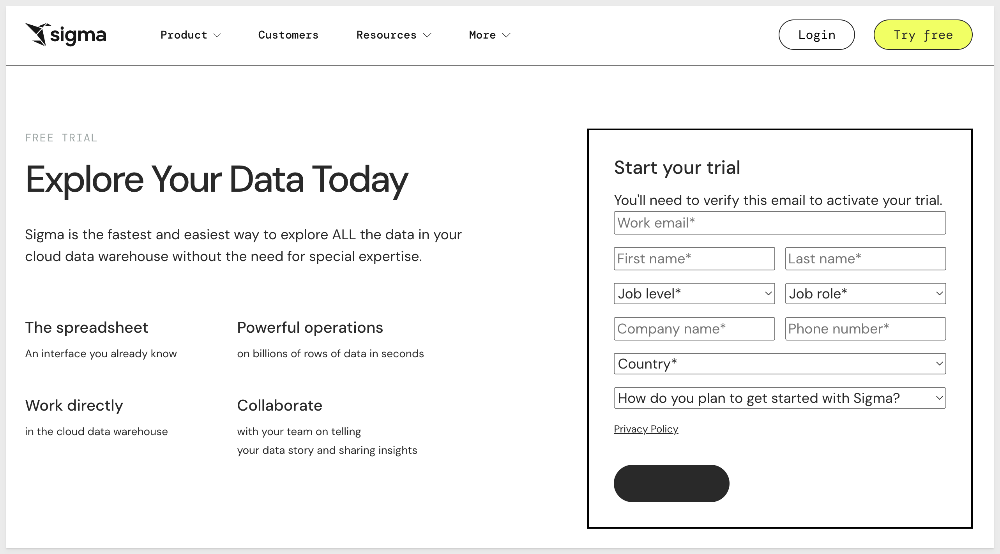

**You will receive notice that Sigma is sending an email invitation:**<br>

In your email application, open the email from Sigma and click `Verify Email Address`.  

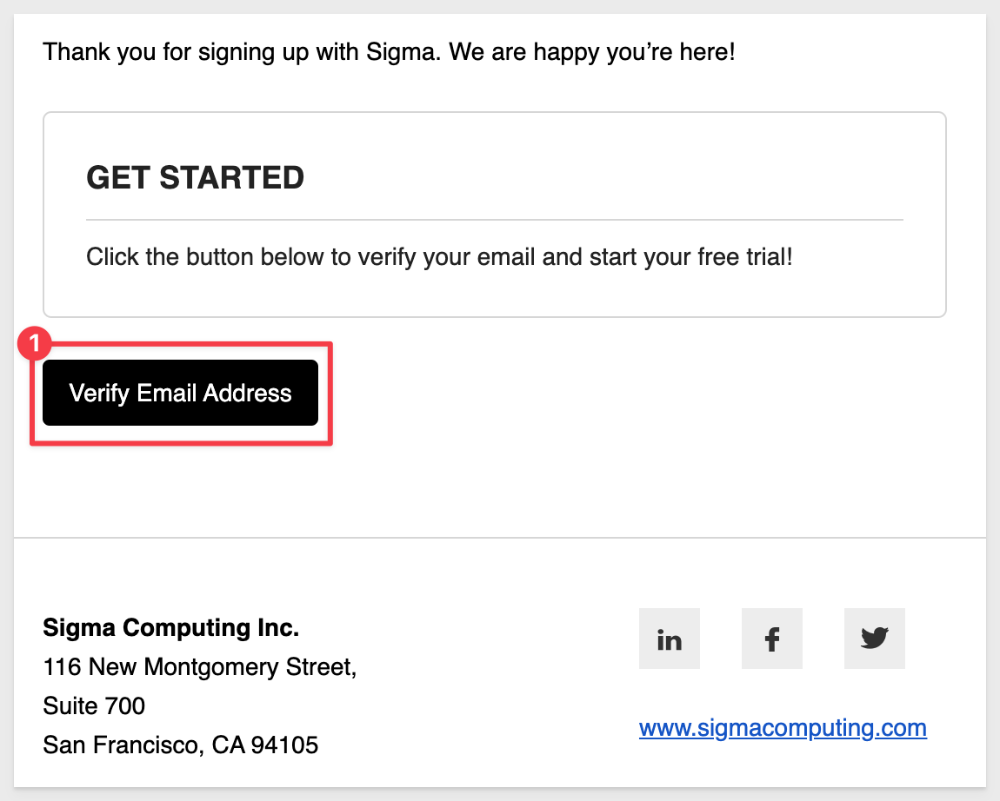

<aside class="negative">
<strong>NOTE:</strong><br> If you have not received this email within 10 minutes, please check your spam folder and if not there, ask for assistance immediately. The email will be "from" Sigma Computing using the address: info@send.sigmacomputing.com.
</aside>

Feel free to contact Sigma support at any time using the [methods listed here.](https://help.sigmacomputing.com/docs/sigma-support)

When the page loads in your default browsers, enter in your `Company Name` and `Company Login URL` (if you prefer something different) and click the `Continue` button:


Create your user profile and click the `Create` button:

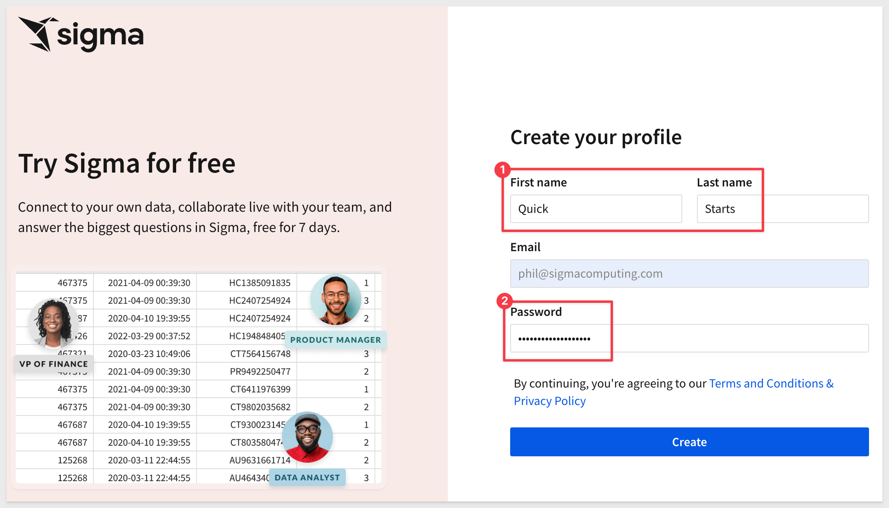

You should now see the Welcome Message for your `Sigma Trial`. There is a video tutorial you can watch if you like but for this QuickStart, just click `Go to home page`:

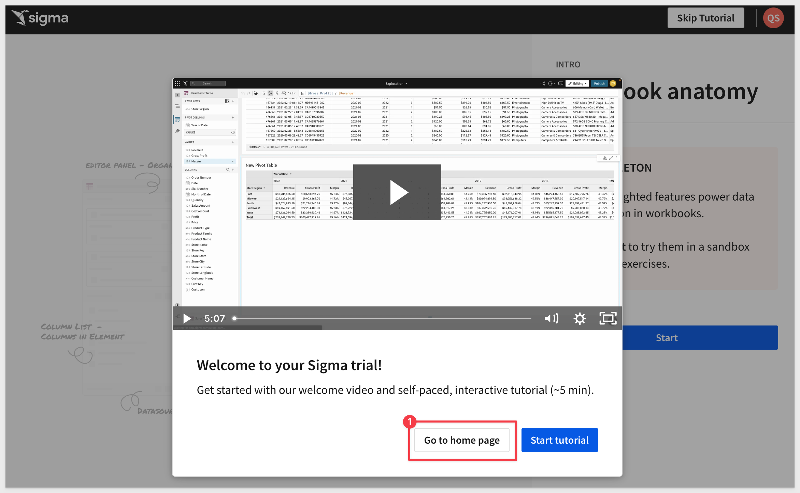

<aside class="positive">
<strong>IMPORTANT:</strong><br> Trial instances are setup with administrative rights for the user who established the account.
</aside>


<!-- END OF SIGMA TRIAL SETUP -->

## Getting Around the UI
Duration: 6

On the homepage, click `Hide` to remove the trial guide.

<aside class="negative">
<strong>NOTE:</strong><br> Click the `Show guide` link anytime to display the trial guide later.
</aside>

The home page is organized logically to make it easy to get to things quickly. The main functions are highlighted below:<br>

<aside class="negative">
<strong>NOTE:</strong> Other users will only see content/features as configured by their assigned "Account Type". 
</aside>

The main functions are numbered and described below:

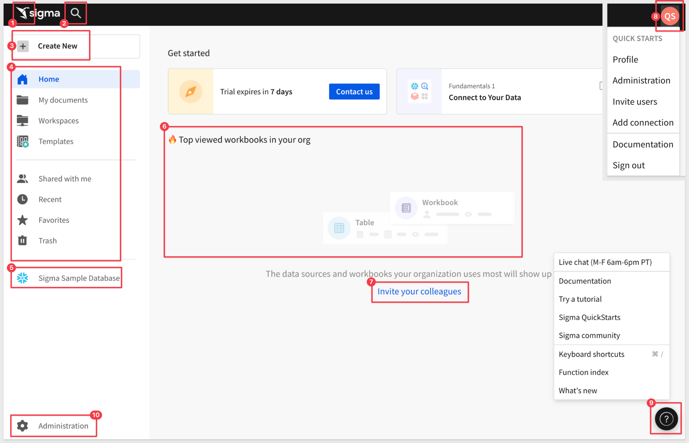

 **Papercrane:** If you want to get back to the home page from anywhere in the portal, just click the Sigma `Papercrane` logo in the upper left corner.

Once you open a different page, you may notice the back arrow next to the Sigma logo. This allows you to go back one level:

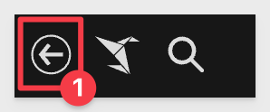

 **Search:** You can click in the search bar at any point to search for content within Sigma.

 **Create New:** Use this anytime you want to create new content.
    <ul>
      <li><strong>Workbook:</strong> our spreadsheet UI for analyzing data</li>
       <li><strong>Dataset:</strong> Model your data in Sigma using datasets, or collections of data based on tables in your CDW or DBMS.</li>
      <li><strong>Datamodel:</strong> A data model is a type of Sigma document that provides the framework for creating and managing a collection of reusable elements.</li>
      <li><strong>Write SQL:</strong> allows you to write SQL to run against the data warehouse.</li>
      <li><strong>Upload CSV:</strong> allows you to upload a csv to the warehouse in order to perform analysis.</li>
    </ul>
     
<aside class="positive">
<strong>IMPORTANT:</strong><br> Data models will eventually replace datasets, which is the older method Sigma provided. Customers using datasets can continue to use them, but data models will offer more functionality and are the preferred method for modeling data in Sigma once they are released from Beta.
</aside>


<aside class="positive">
<strong>IMPORTANT:</strong><br> The second thing to remember is that we built Sigma from day one on a modern cloud architecture. This allows us to add new functionality very quickly!
</aside>

If at anytime you notice an item labeled **BETA**, that means that the feature is mature enough to be included for all customers to evaluate while we finalize its release.

For example, at the time of this QuickStart, data models carried the beta tag:

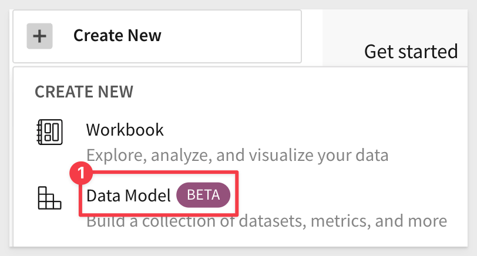

If you ever need to know what is new in Sigma, there are two resources for that:

[Release Notes](https://help.sigmacomputing.com/changelog)

We also provide a summary on the "First Friday" of each month, which includes everything released in the prior month, including bug fixes.

[First Friday Features can be found here.](https://quickstarts.sigmacomputing.com/firstfridayfeatures/)
 
 **My Content:**
 <ul>
      <li><strong>Home:</strong> will bring you back to home screen.</Li>
      <li><strong>My Documents:</strong> is a personal folder for you to save content you have created.</Li>
      <li><strong>Workspaces:</strong> are a way to organize and share content with specific members or teams within your organization. Items placed in workspaces can be accessed by anyone who has permission to that workspace.</Li>
      <li><strong>Templates:</strong> provides a way to standardize and share workbook structures, for quick and consistent reuse.</Li>
      <li><strong>Shared with Me:</strong> will show a list of items others have shared directly with you.</Li>
      <li><strong>Recent:</strong> will bring up items you have accessed recently.</Li>
      <li><strong>Favorites:</strong> will show a list of items that you have marked "favorite", for quicker access.</Li>
      <li><strong>Trash:</strong> the typical recycle bin functionality.</Li>
 </ul>

 **Connections Section:**
Visible to administrators and content creators by default, lists the data warehouses available. 

Clicking on one of them shows the tables in that warehouse you can access. There can be many connections for a single Sigma account, each configured with different levels of access to the warehouse, to be shared with members or teams. The actual connection configuration is done in the administration section.

<aside class="negative">
<strong>NOTE:</strong><br> Trials created from the Sigma website show the "Sigma Sample Database", which uses a Sigma provided Snowflake account. Trials created from cloud provider marketplaces may have additional connections.
</aside>

 **Top viewed:** Empty at the start, as teams start to create and use content, the most popular will float to the top of this listing.

 **Invite your colleagues:** Provides a quick method for adding users to your account. This is a configurable convenience; users in Sigma can be managed in the administration section or externally via any SAML 2.0 compatible identity management provider (ie: Okta, Auth0 ect...).

 **User Profile:**
In the top right corner, there is a box with your username initial. Clicking on it reveals your profile, where you can make changes to your preferences and sign out. Other UI options may or may not be visible to you depending on your permissions.

 **Help:** has lots of useful information for you to explore, to help you get the most out of Sigma.

<aside class="positive">
<strong>IMPORTANT:</strong><br> There is a link to "Live Chat" in this menu. Use it!. Sigma is fanatical about supporting our customers. 
</aside>

 **Administration:** Dedicated area for user management and other common configuration settings. Only shown to users in the Admin role.</li>

Now that we have our initial orientation done, we can move on to the next section.


<!-- END OF GETTING AROUND IN THE UI -->

## Workbooks, Pages and Data
Duration: 6

Let’s begin by establishing some basic terminology Sigma uses.

 <ul>
      <li><strong>Workbook:</strong> A workbook in Sigma is akin to an Excel file or Google Sheet.</li>
      <li><strong>Pages:</strong> Each workbook can contain multiple pages, similar to Excel worksheets.</li>
      <li><strong>Dataset:</strong> Model your data in Sigma using datasets, or collections of data based on tables in your CDW.</li>
      <li><strong>Datamodel:</strong> A data model is a type of Sigma document that provides the framework for creating and managing a collection of reusable elements.</li>
</ul>

<aside class="positive">
<strong>IMPORTANT:</strong><br> Data models will eventually replace datasets, which is the older method Sigma provided. Customers using datasets can continue to use them, but data models will offer more functionality and are the preferred method of modeling data in Sigma once they are released from Beta.
</aside>

In Sigma, analysis and presentation are seamlessly integrated into a spreadsheet-like experience.

This is useful to know because if you want to build something in Sigma (e.g., a dashboard, report, etc.), you’ll need a workbook, at least one page, and some data. Data can come from a cloud data warehouse or end-user input, but we’ll talk more about that later.

One unique feature that may be new to users of traditional BI products is the “Input Tables.” feature. input tables allow data to be captured from the user and stored in the warehouse. 

In addition, data in an Input Table can be joined via a [lookup](https://help.sigmacomputing.com/docs/add-columns-through-lookup) to other warehouse tables. 

This enables many powerful use cases, some of which are covered in this [QuickStart](https://quickstarts.sigmacomputing.com/guide/input_tables_use_cases/index.html?index=..%2F..index#0).

The last feature we will mention now (there are **SO MANY FEATURES**) called `Controls`. 

A Sigma control is typically use to filter data (or individual items). There are many variations of controls, and all are really easy to use.

Of course, this is all baseline terminology, and pretty easy to understand.

The last point we will make on this topic is that there are different icons for different objects in Sigma.

For example, here are the most common ones that you will see when looking at the `Recents` list and in other places:

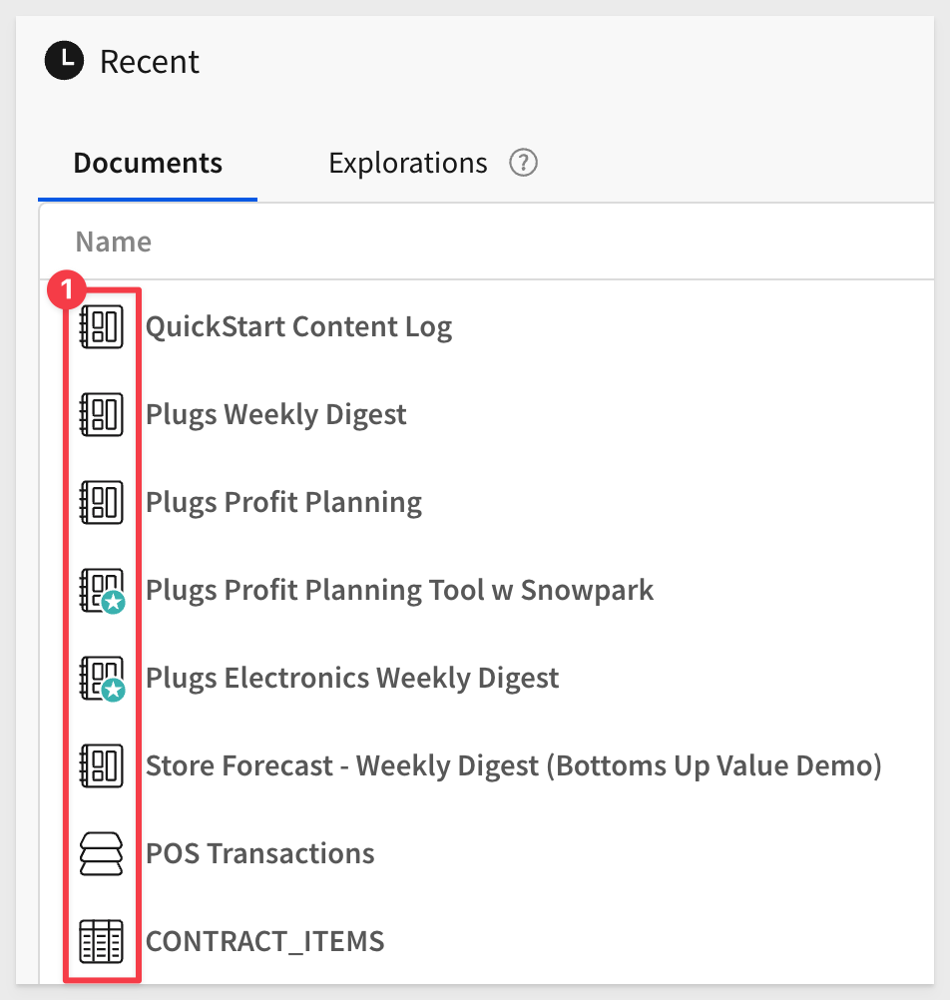

It can be handy to know what these icons represent:

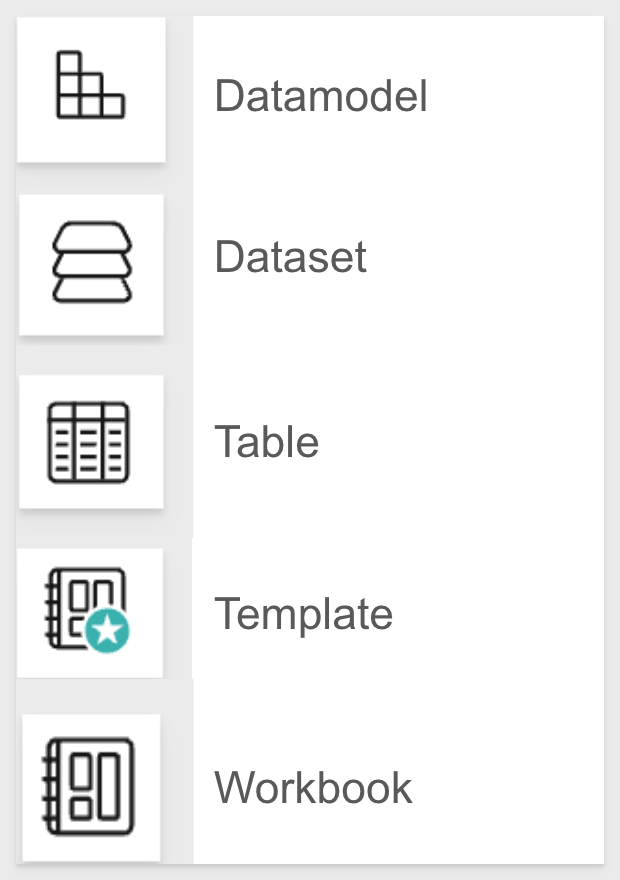


<!-- END OF SECTION-->

## Workbooks
Duration: 6

There are different paths when creating content in Sigma, but we will focus on the most common methods in this QuickStart. 

So you can get started quickly, Sigma provides some common data in the `Sigma Sample Database`.

At the lower-left of the home page, click on `Sigma Sample Database` to see what tables are available:

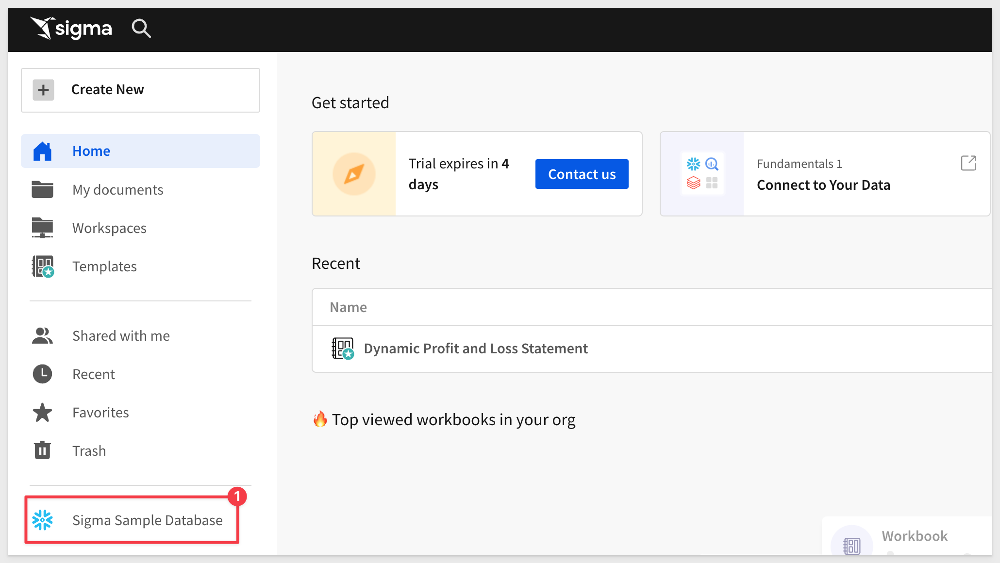

We can see all the different data available, and we are prompted to `Select a table to preview`. 

<aside class="negative">
<strong>NOTE:</strong><br> This interface allows you to quickly preview the columns and data that is available so it is easy to decide which table has the information needed.
</aside>

Select the `RETAIL` schema and the `Plugs_Electronics` (we will just call it “Plugs”) database, expand it and select the `PLUGS_ELECTRONICS_HANDS_ON_LAB_DATA` table. 

We can see all the data that is **live** in the Snowflake table. 

The path and name is shown at the top middle of the screen (#2) and the total row count (#3) is about **4.58+ million rows in 23 columns**.

We are looking at the data (in the **Overview** tab), and we can also look at the column detail, permissions and other information about this table (#4).

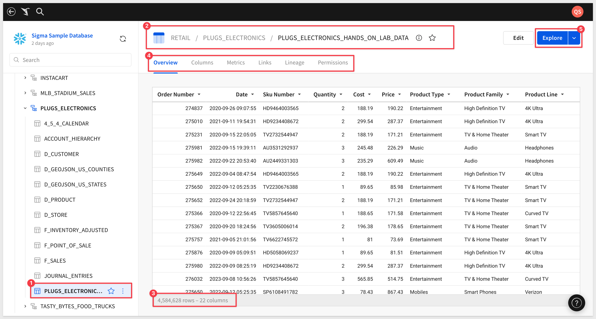

<aside class="positive">
<strong>IMPORTANT:</strong><br> There is a lot more we can do with this table in this interface such as "pre-assign" friendly column names, create "metrics" and assign permissions and more. Feel free to explore if you are comfortable doing so.
</aside>

To begin our analysis we want to begin exploring this data. Click the `Explore` button in the upper right corner (#5) (**click the button, not the drop arrow**).


<aside class="positive">
<strong>IMPORTANT:</strong><br> The "Explore" drop menu also provides a means to use this table as a starting for for data modeling. 
</aside>

We often find ourselves conducting ad hoc analysis that is only needed in the current moment. Why clutter folders with one off documents never to be used again?

All workbooks are considered purely exploratory until you, as their creator, actively save their first version. 

This means you have one central location (the CDW) to start both your ad hoc analysis and reporting. Once you begin exploring your data, you can choose to leave the unsaved workbook behind, or you can save it, and continue to build it later.

<aside class="negative">
<strong>NOTE:</strong> Workbooks support data from multiple sources. This data can come either from tables in your Cloud Data Warehouse (CDW), from your organization's datasets in Sigma or from CSV upload into Sigma.
</aside>

We are now inside a Sigma workbook:

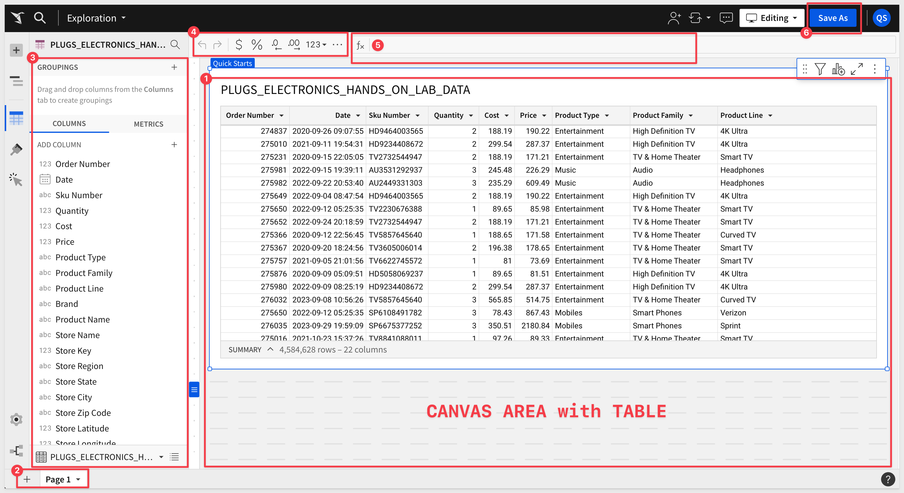

As you can see our table was added to the canvas (#1).  

Each `workbook` can have one or more `Pages` (#2), and each page has its own canvas. 

Click on the `PLUGS_ELECTRONICS_HANDS_ON_LAB_DATA` table. When an element on the canvas is selected, it will have a blue border.

The left hand pane (#3) shows a vertical view of all our columns, groupings, metrics and more. This is called the `Element panel`.

The `toolbar` (#4) can be found directly under the workbook header. The toolbar's content changes depending on the element you have selected.

Buttons for undo, redo and other column-specific features (#4) can always be found in the toolbar as well.


<aside class="positive">
<strong>IMPORTANT:</strong><br> Use the undo and redo arrows in the toolbar instead of the browser back button.
</aside>

The `Function bar` is item #5. This is where we can leverage Sigma's [extensive library of functions. ](https://help.sigmacomputing.com/docs/popular-functions)

Let’s save this workbook for now. Click the `Save As` button in the upper right corner (#6). 

It is best practice to name workbooks something that makes sense to you and others you might share this workbook with later.

Notice that we are given options on where to save it, using a familiar folder structure. 

Click `Create Folder` and name it `QuickStarts`. Then click into the `QuickStarts` folder, and name the workbook `Fundamentals`:

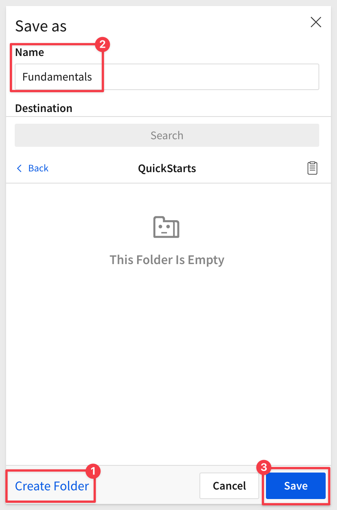

Workbooks have a menu that is accessed by clicking the down-arrow to the right of the name (#1):

The path to the workbook is shown (#2) along with the menu of features (#3).

Clicking the star icon (#4) will add the workbook to your favorites list that is shown on the homepage.

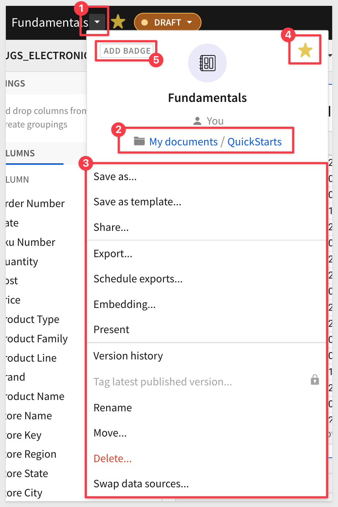

Badges (#5) can be added to indicate a [workbook is endorsed in some way.](https://help.sigmacomputing.com/docs/add-or-update-a-workbook-badge)

For example, we might want to warn others that this workbook is under construction still:

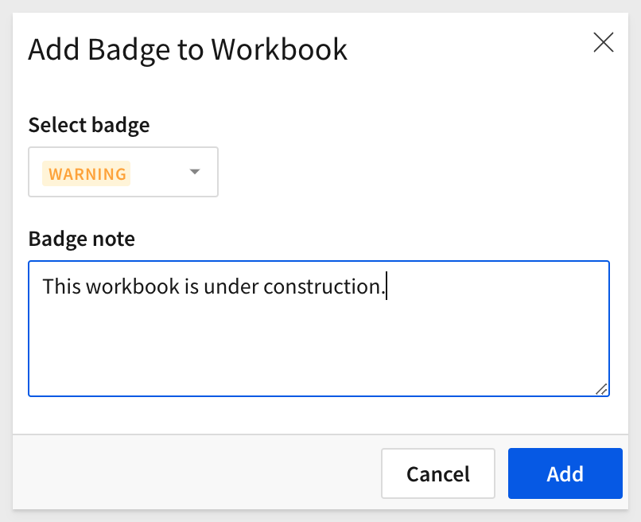

Once set, the workbook will show both the endorsement and the text:

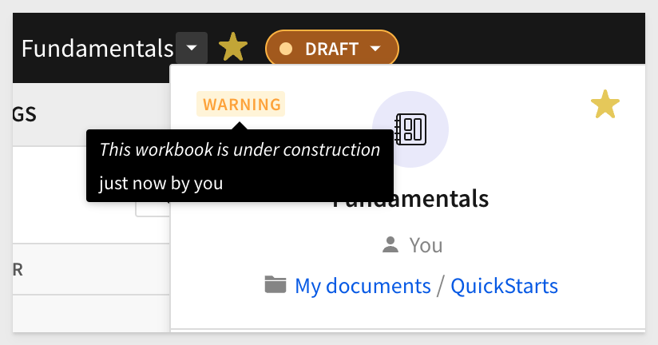

Now that you have saved the workbook, it's state is changed to `Published` and we are still in `Editing` mode. The `Publish` button is not active until we make some other change.

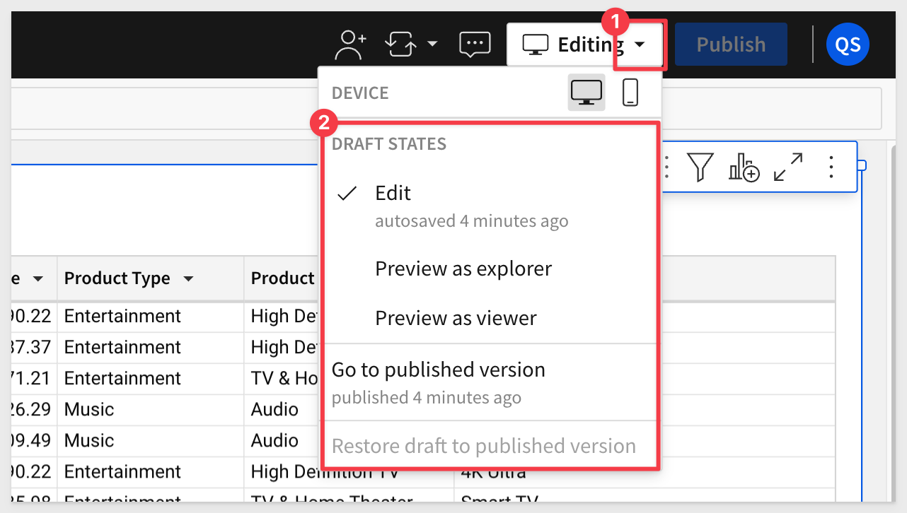

**These options allow you to:**
<ul>
      <li>Continue to work on the workbook (edit)</li>
      <li>Preview the workbook as users will see it (preview as...)</li>
      <li>Review the last published version (go to published version)</li>
      <li>Restore previous draft version if you make a mistake publishing new (restore draft to published version)</li>
</ul>

<aside class="positive">
<strong>IMPORTANT:</strong><br> Sigma has many more features to help address the need for version control.
</aside>

[For more information on version control in Sigma, click here.](https://help.sigmacomputing.com/docs/version-tagging)

In the lower left corner of the workbook there is a tab called `Page `. 

Click the `down-arrow` and rename the tab to `Data`. We will use this table as the source of data going forward.

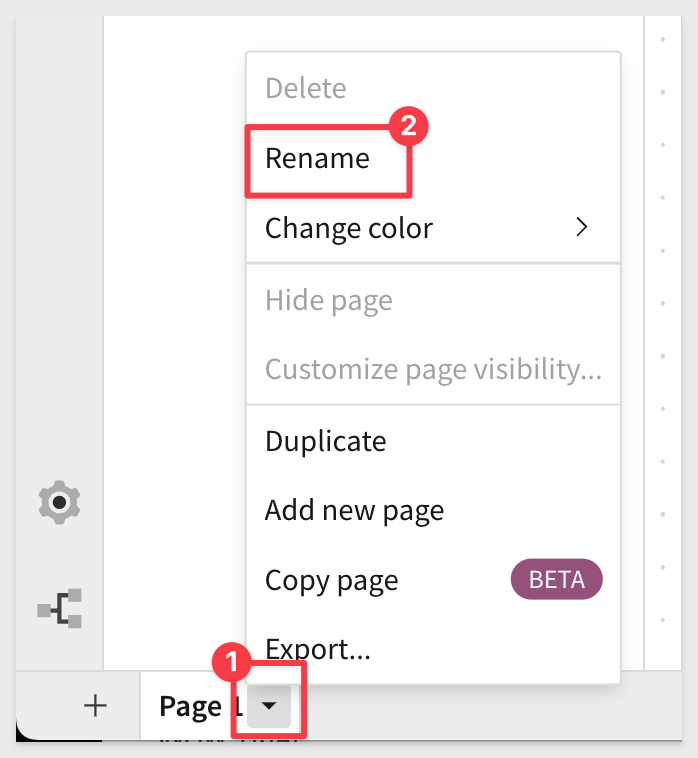

<aside class="negative">
<strong>NOTE:</strong><br> You can also just double-click on the page name and enter a new name too.
</aside>

Rename the table (double-click the table title) from `PLUGS_ELECTRONICS_HANDS_ON_LAB_DATA` to `PLUGS_DATA`:

Now that we have made changes to the workbook, the `Publish` button becomes active again.

Click the `Publish` button and then click `Editing / Go to the published version` link. 

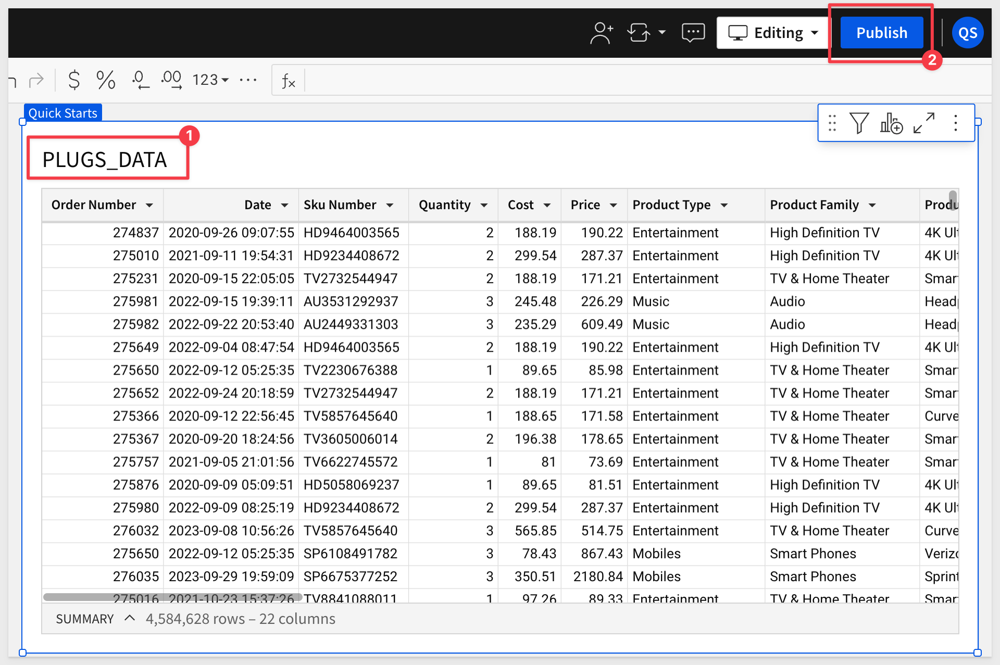

We are taken to the published version of the workbook. 

The `published version` is what a user sees when they do not have the right to edit the workbook. 

<aside class="positive">
<strong>Spreadsheet-like, Tabular Interface:</strong><br>
Sigma is unique in empowering users to do analysis in an interface they already know and love: the spreadsheet. 

It also uses familiar functions found in spreadsheets. 

No need for SQL knowledge as the Sigma interface automatically, and behind the scenes, converts all user actions into optimized SQL. 

This spreadsheet-like interface helps speed up user adoption and success, especially with non-technical business users.
</aside>

Each column has a drop menu (#1) and there are also some controls (#2) in the upper right corner of the table.

The available options are limited based on the mode you are in (published, edit) and what account type (role) the user has. 

These will be very useful as we go forward. Feel free to click into any of them now, but undo any changes when done exploring.

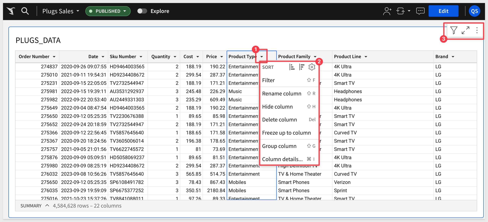

Undo changes using the toolbar as shown:

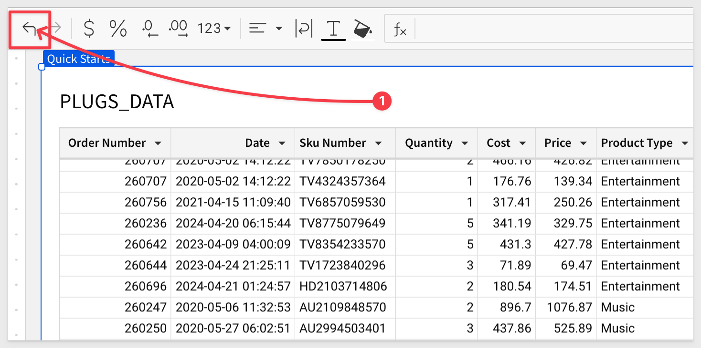

Click the `3-dot` menu > `Export`:

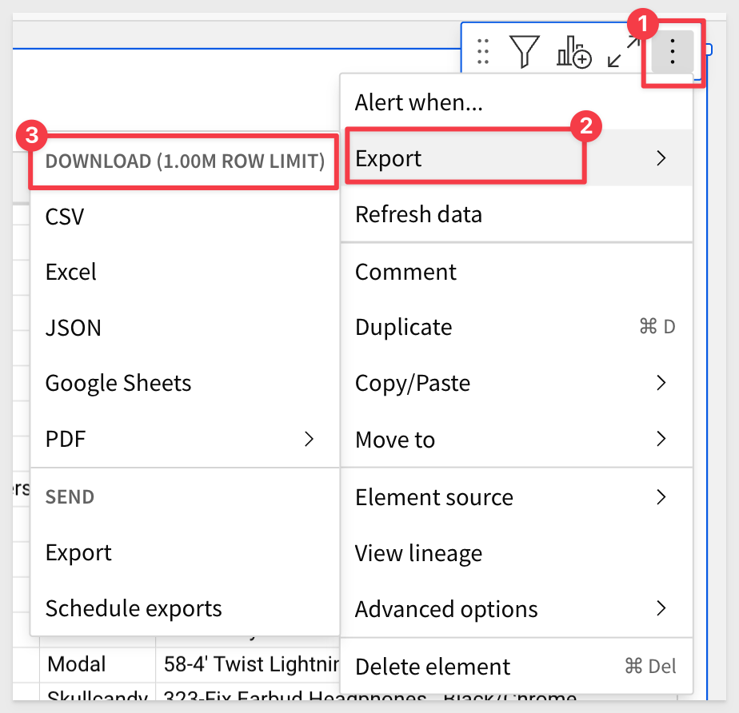

While there are times when downloading data is needed, we do not want users to download the huge volumes of data that Sigma routinely handles. A better practice is to either send a summary report or use Sigma to handle the scale of the data.

<aside class="positive">
<strong>IMPORTANT:</strong><br> Ideally. users should work in Sigma, and not download data, building ungoverned spreadsheets with potentially outdated data or incorrect formulas.
 
</aside>

Return to edit mode via the `Edit` button. 

Add a new page by clicking the `+` icon and name the page `Dashboard`. 

Click the menu arrow on the `Data` page and select `Hide page`:

The `Data` tab now carries an icon (#3) to indicate that it will not be visible to users who do not have edit rights.

Drag the `Dashboard` page to be first in line:

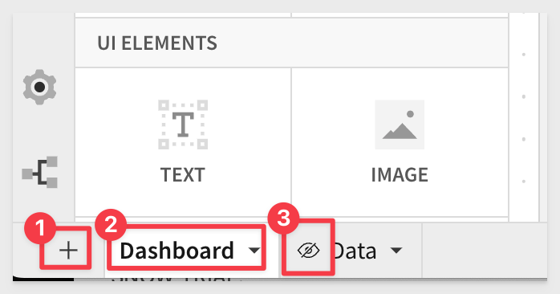

Click `Publish`.


<!-- END OF WORKBOOKS -->

## Pages
Duration: 6

Each page has its own canvas and can be made to operate independently of others, or not.

For example, on one page, we may want to have the dataset you are using to drive the content on other pages. This is the structure we have just built.

On another page, we may want to provide some instructions for the users.

An example of this is in the Sigma template `Plugs Electronics Profit Planning Tool.` 

There is a page that has information about Sigma and a button that takes the user to the `Profit Planning Tool` page:

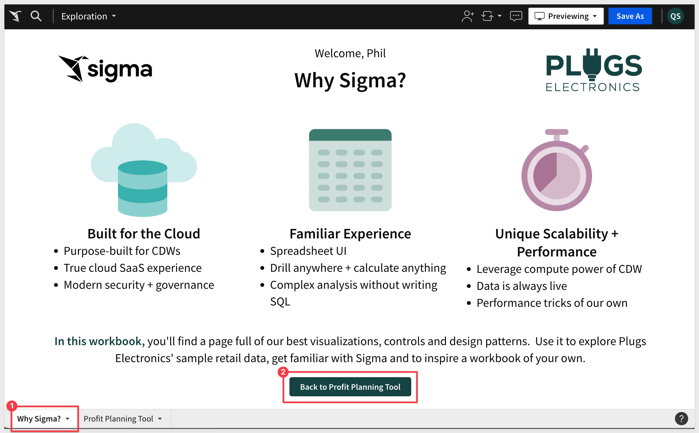

The `Why Sigma` page can carry any information to inform and assist users who are looking at the workbook. 

When in a workbook in `edit` mode you will add elements to the canvas using the editor panel as shown:

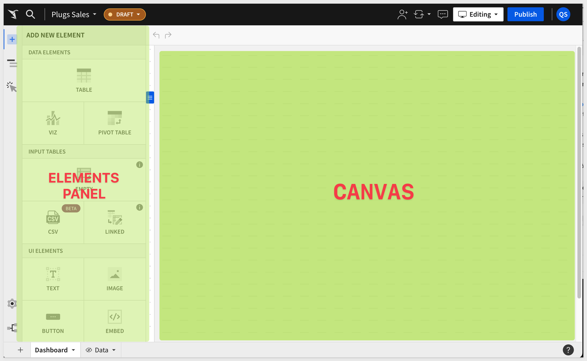

The editor panel contains all the objects possible to create pages in a workbook. 

Sigma's searchable [documentation is available](https://help.sigmacomputing.com/) for each element and there are a large amount of functionality in each option. 

Feel free to experiment with adding elements to pages. It is easy to undo or delete elements anytime or restore a previous version of the entire workbook too.

<aside class="positive">
<strong>IMPORTANT:</strong> Changes to workbook pages are saved as a draft. You can make changes and not publish, close the workbook and when you reopen it your draft changes are still there waiting, when in edit mode. Changes only appear to other users after the workbook is published next.
</aside>

When an existing page element is selected, its configuration is automatically displayed in the workbook's editor panel. 

Since we last created a new page, there are no elements on the `Dashboard` page. 

On the `Dashboard` page, click the `+` icon and select a `TABLE` element. 

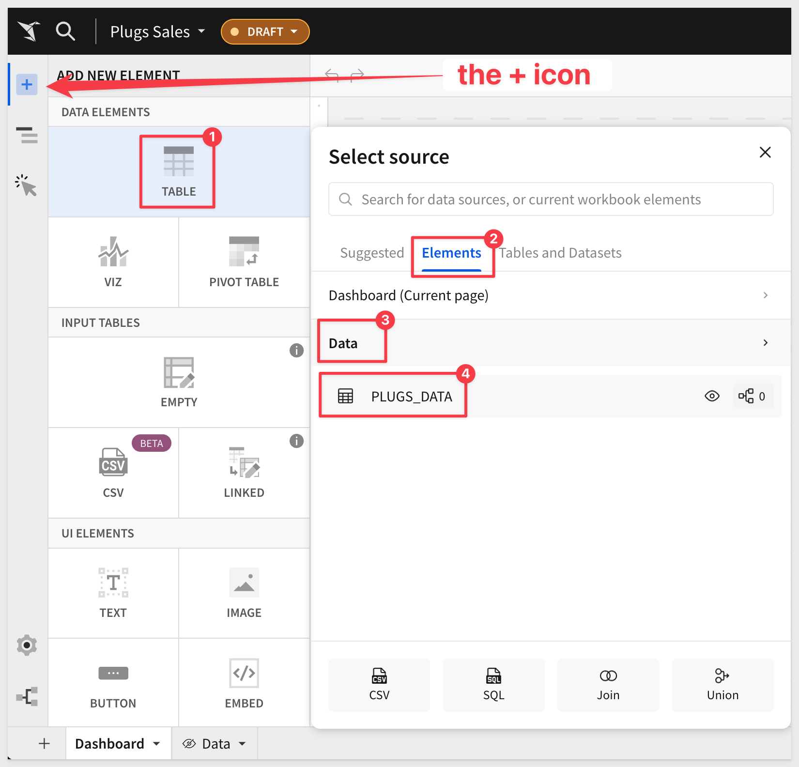

We are prompted to select the source of the data for this new table. 

The source selector is really powerful, allowing us to add data from the warehouse, existing page elements in our workbook, other Sigma datasets, CSV uploads, custom SQL, and more.

In this case, our data is already available on our `Data` page, so we want to select that:

Now we have a table that we can start to manipulate in any way we might desire. 

The benefit of this method is that the warehouse was queried once to get the data for the `Data` page’s table, and we are now just reusing that data, saving both time and warehouse compute costs.

Our workbook now looks like this:

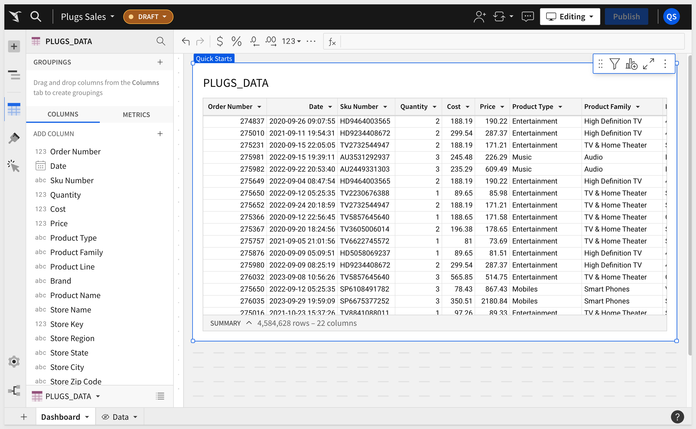

Click `Publish`.


<!-- END OF PAGES -->

## Containers
Duration: 6

While this QuickStart is mainly focused on high-level features of Sigma, we want to include the container element up front in the discussion. 

Sigma's container feature allows you to organize workbook pages by grouping elements within a customizable container. 

This provides an intuitive way to manage layouts, ensuring that related elements remain visually cohesive. Containers not only streamline the design process by enabling you to adjust and style grouped components collectively but also enhance flexibility when rearranging or resizing elements on the canvas. This powerful feature simplifies complex workbook structures, making it easier to maintain consistency in both functionality and appearance.

By using containers, workbook design takes on a whole new meaning. 

In the animation below, we show how containers are dramatically improve the appearance of existing Sigma workbooks.


We won't focus on using containers as we go along, as they are really easy to use and very flexible. Feel free to add them to your work as you go, if you have a flair for design!

Adding a container element is shown below:

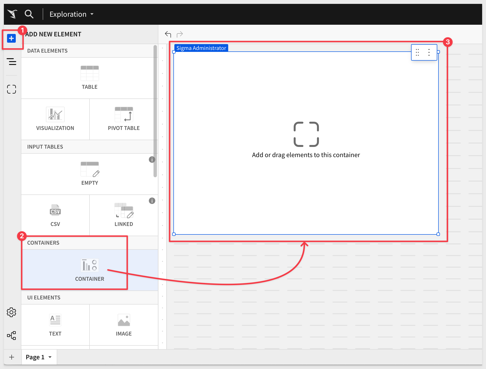

To learn more about using containers, [see here.](https://help.sigmacomputing.com/docs/organize-workbook-layouts-with-containers)


<!-- END OF PAGES -->

## Sharing with Others
Duration: 6

Sigma users are always looking at the most recent data using governed workbooks in a familiar interface. Sharing workbooks is an important part of enforcing that amongst the user community.

Sharing is very easy, and permissions to access a Sigma document can be shared, modified, or revoked by either the individual document’s owner or an organization admin. 

Sigma’s licensing model includes three tiers that define the usage terms of your organization members: `Lite`, `Essential`, and `Pro`. 

Each license tier establishes a different set of available permissions that enable access to Sigma’s features and capabilities. 

There are three default account types: `Lite`, `Essential` and `Pro`.
<ul>
  <li><strong>Lite:</strong> is a read only user who can view, create a copy, send and schedule exports.</li>
  <li><strong>Essential:</strong> is a user who wants to perform additional analysis in an unconstrained fashion</li>
  <li><strong>Pro:</strong> allows the original workbook to be altered as if they were the owner.</li>
</ul>

As an `administrator`, we can see these default account types by navigating to `Administration` > `Account Types`.

Here we see the three default types, description and can also create a new custom account type:

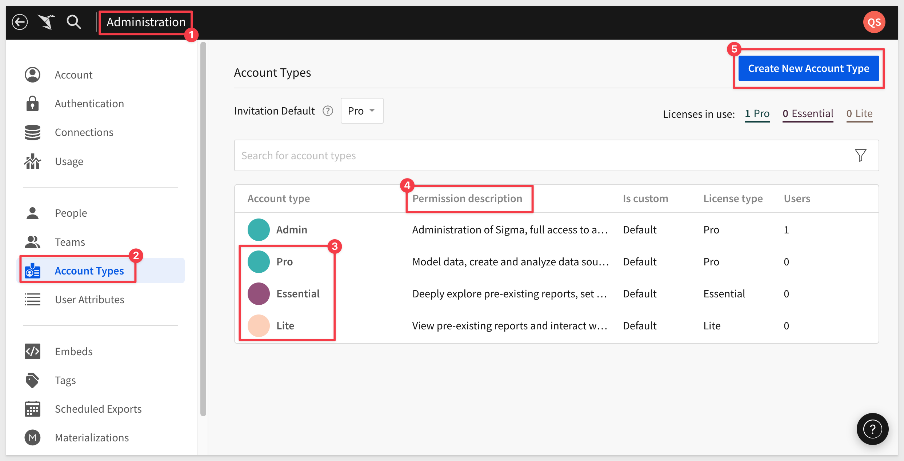

Custom account types provide the ability to define a granular permission level using `Account Types`. In the example below, the license consumed is `Essential` because both `Lite` and `Essential` are selected:

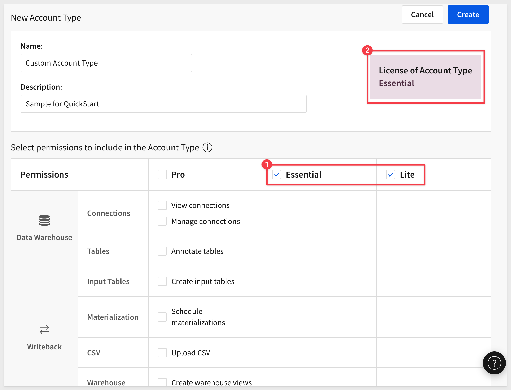

To read more about [account types and licensing, click here.](https://help.sigmacomputing.com/docs/license-and-account-type-overview)

Return to the `Plugs Sales` workbook and click the `Share` icon as shown:

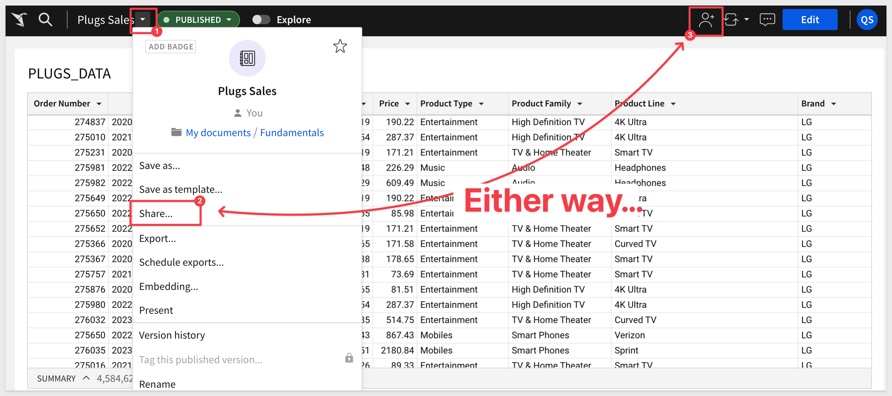

In the share modal we select the team or member that we want to share the workbook, and at what permission level.

In this case, we shared the workbook with a sample `Pro` account type user, and sent them a welcome email that has a link back to the workbook.

Since this users license is `Pro`, that we can pick from three different permissions:

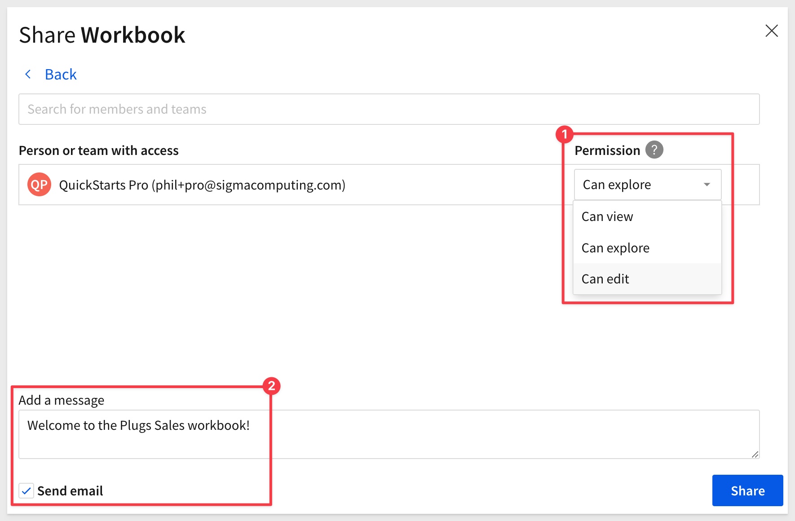

The `Share Workbook` modal shows who has access and their permission level. There are also a few other options to grant access via link (#2).

We granted the second use `edit` permission for now, so they can edit the workbook.

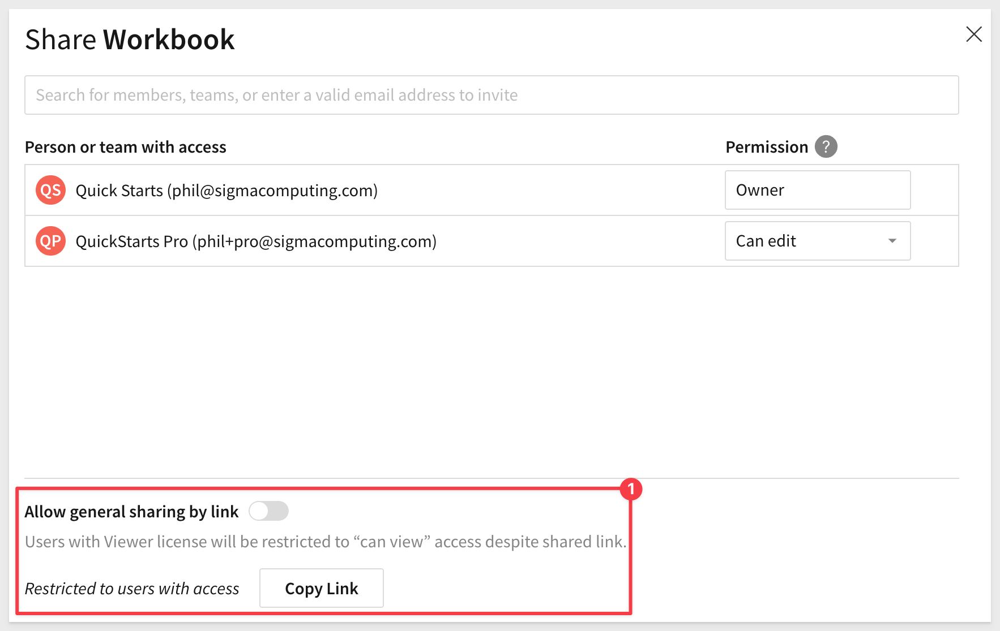


<!-- END OF SHARING -->

## Live Edit
Duration: 6

Sigma is all about collaboration and `Live Edit` takes that to another level. 

Our customers told us they wanted the ability to work on the same document simultaneously with others, allowing their businesses to use Sigma to move faster than ever.

**Live Edits allows multiple users to work on the same workbook in real time, with all editors sharing one live draft.** 

<aside class="negative">
<strong>NOTE:</strong> This feature requires another user in the Sigma trial. As an administrator, you can add one if you like, or simply follow along. 
</aside>

Navigate to `Home` / `Administration` / `People`. 

Click the `Invite People` button.

Fill out the pop-up:

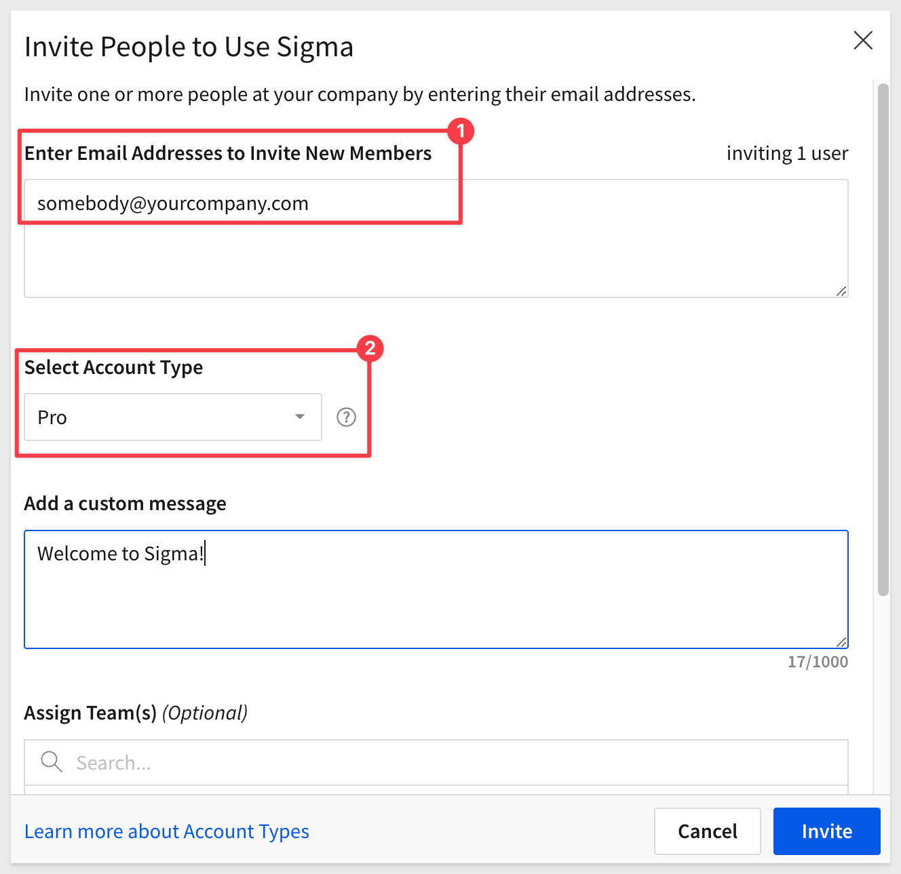

Have the new user accept the email invitation from Sigma, and set up their account. 

So we could have both accounts logged into Sigma at the same time, we use two browsers, Chrome for one, and Firefox for the other. You could also use the private browsing mode of your preferred browser to accomplish the same thing.

<aside class="positive">
<strong>IMPORTANT:</strong> Using your original Sigma trial account, share the Plugs Sales workbook with the new user. This was shown earlier and go back if you don’t remember the steps. Take care which permission level you set; for Live Edit the second user needs a Pro license with "Can Edit" access. 
</aside>

Using Firefox (and logged in as the second user) we can see that the Plugs Sales workbook has been shared on the `Shared with Me` page:

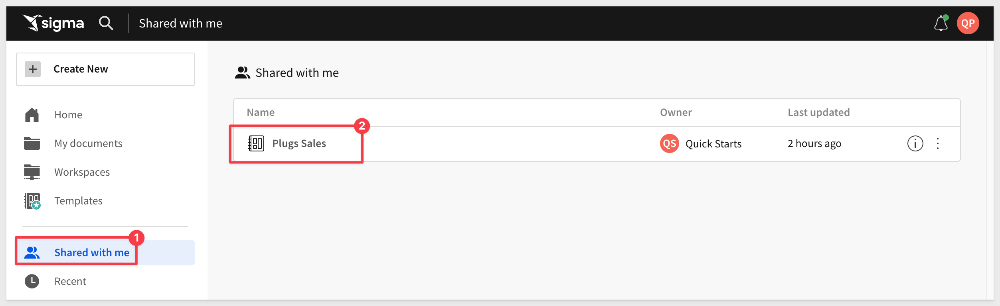

**Put the workbook into "Edit" mode in both browsers.** 

Notice that in Chrome, the user `Quick Starts` is identified by their initials (#1) the second user is `QP` (#2). 

In this way, Sigma informs you that another person has the workbook open, and in edit mode.

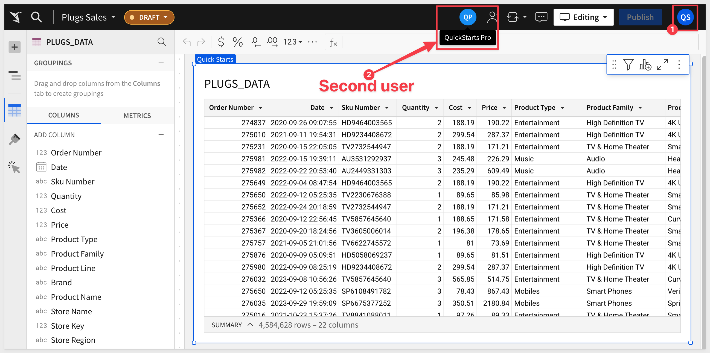

**But which part of the Workbook is each user active in?**

In both browsers, `click the table`. 

Sigma will now show that both users have selected the `PLUGS_DATA` table:

For this example, there are two users:
```code
Firstname:    Lastname:
Quick         Start
QuickStarts   Pro
```

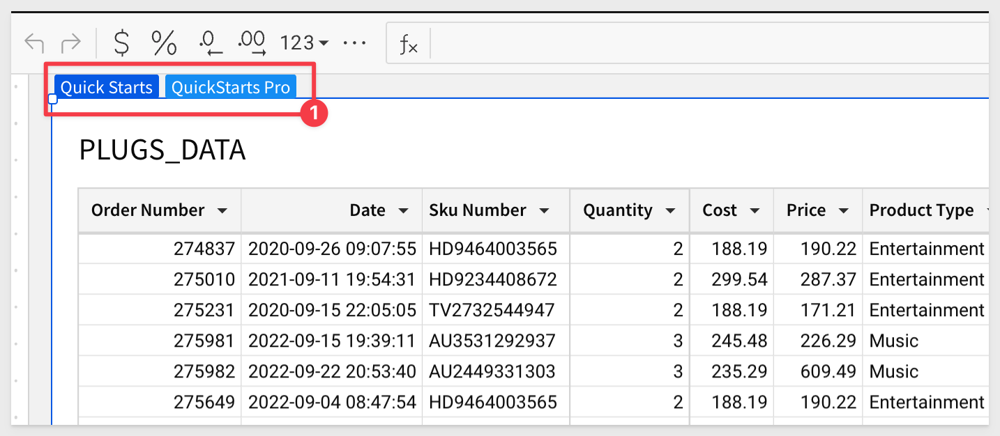

[For more information on Live Edit click here.](https://help.sigmacomputing.com/hc/en-us/articles/9384868843027-Workbook-Live-Edit)


<!-- END OF LIVE EDIT -->

## Scheduling
Duration: 6

Sigma workbooks support the ability to export data immediately or on a user-defined schedule.

Open the workbooks menu and select `Schedule exports`:

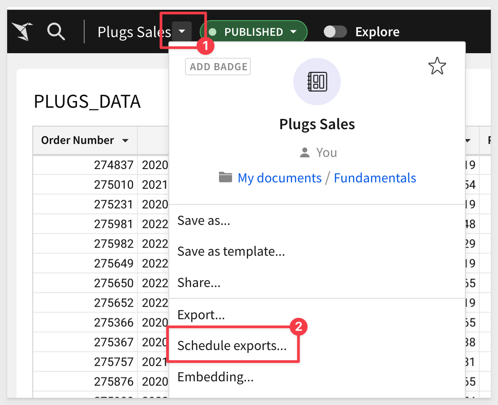

In the modal window, click `Add Schedule`

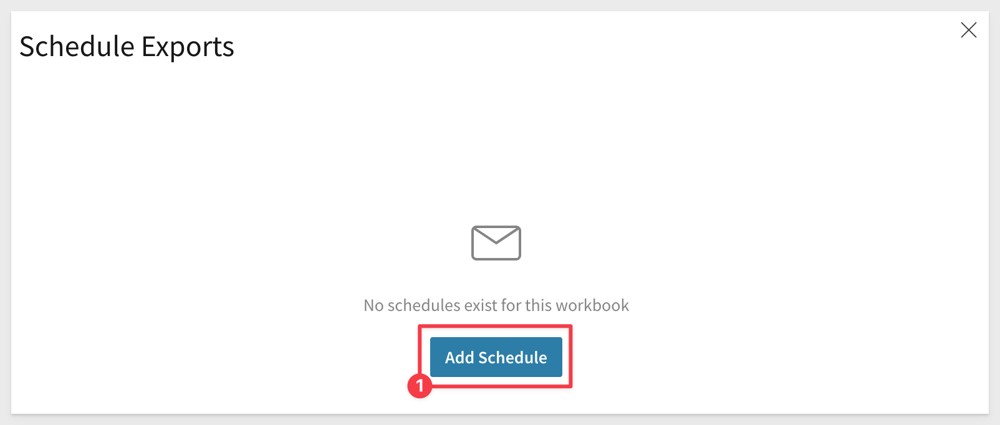

We are able to customize several areas of this operation. 

Feel free to try it, as the Sigma trial is a live system, and will act on your instructions. 

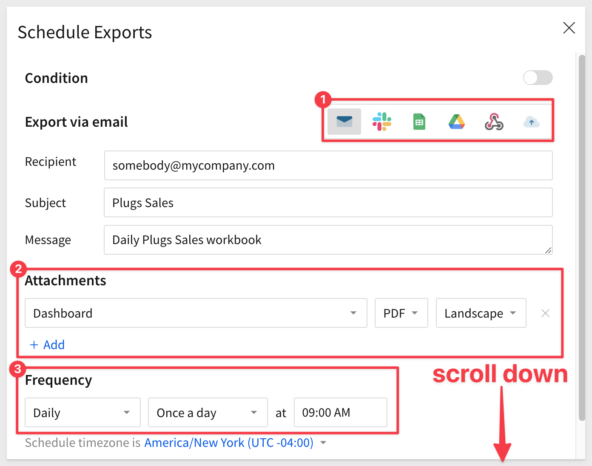

We can get granular on which part of the workbook is sent and what format to send it in. 

Use the  `+ Add another attachment` to build a message from more than one part of a workbook.

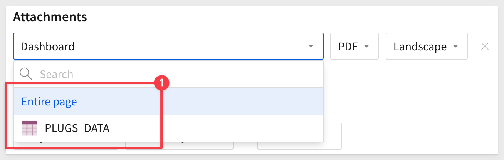

For workbooks that have parameter-driven data based on the user, sent items can be run with data filtered for the recipient:

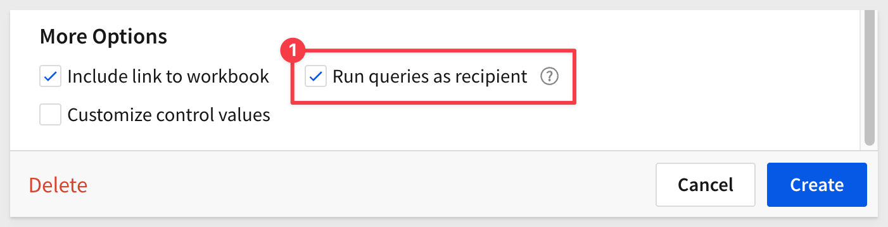

A very powerful feature of scheduling allows us to deliver reports deterministically, based on parameters.

We can even test if the condition is met or not, against the existing data.

For example, if we want to be notified when a specific customer places and order, we can easily set that up as:

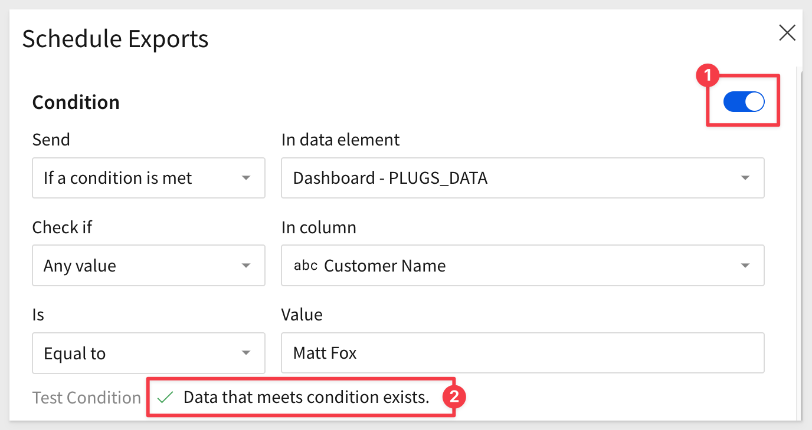

There is a lot of power and flexibility in this operation, and it is really simple for any user to understand.

The message received has a link the Sigma workbook (whatever was selected to send), as well as the attachment in PDF:

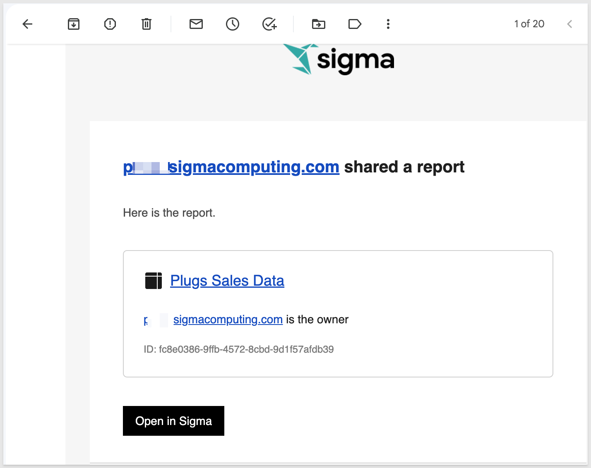<br><br>

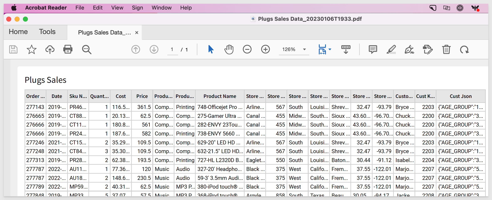

Once created, administrators can see it on the list of available `Scheduled Exports` in the `Administration` section:

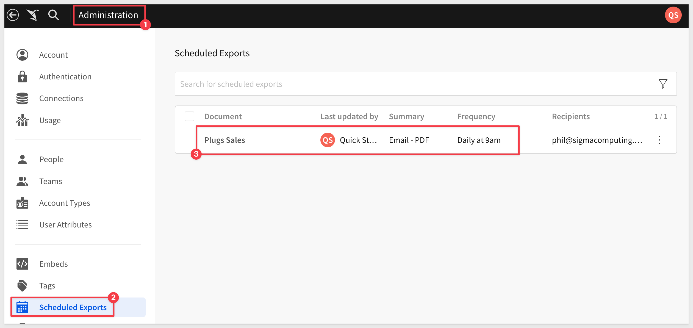

Here, you can edit, delete, pause or send-now any listed export job (use the `3-dot` menu):

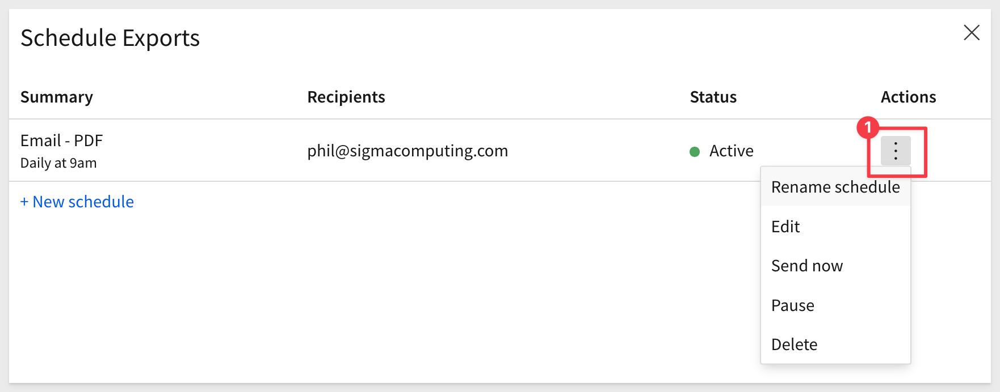

### Export element
There is also a method to export the data for any single workbook element.

For example, our workbook has one table, `PLUGS_DATA`. 

We can access the element menu for this table and select `Export` to download up to one million rows of data in the available format.

We can also send the data to several supported destinations, or schedule an export as previously described.


[For more information on Exporting to email, click here](https://help.sigmacomputing.com/docs/export-to-email)

[For more information on Exporting to Google Sheets or Drive, click here](https://help.sigmacomputing.com/docs/export-to-google-sheets-or-drive)

[For more information on Exporting to cloud storage, click here](https://help.sigmacomputing.com/docs/export-to-cloud-storage)

[For more information on Exporting to webhook, click here](https://help.sigmacomputing.com/docs/export-to-webhook)


<!-- END OF SCHEDULING -->

## What we've covered
Duration: 6

In this QuickStart we covered navigating the Sigma user interface, common terminology and some of the most common functionality. 

This is where we left our `Fundamentals` workbook, in preparation for the next QuickStart:

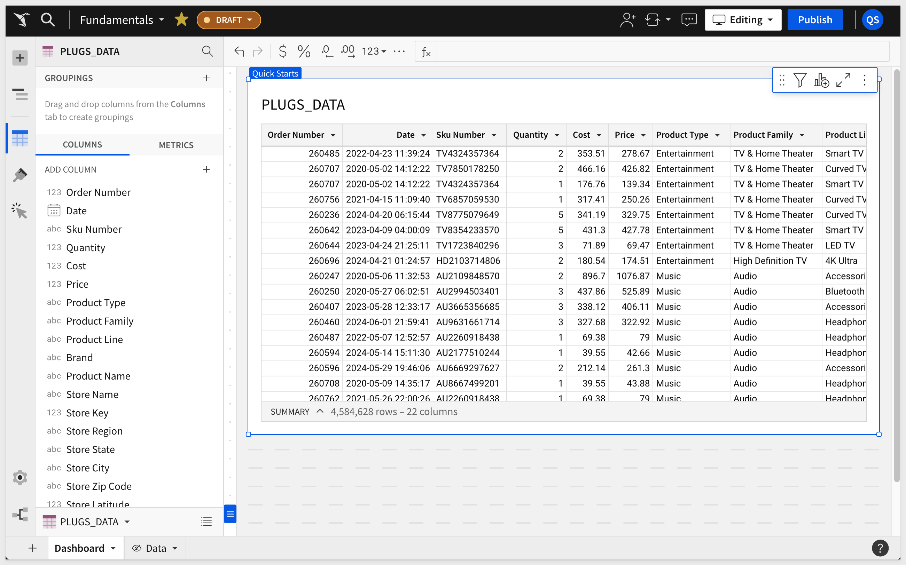

[Click here to move to the next QuickStart in this series.](https://quickstarts.sigmacomputing.com/guide/fundamentals-2-working-with-tables-v2/index.html)

**Additional Resource Links**

Be sure to check out all the latest developments at [Sigma's First Friday Feature page!](https://quickstarts.sigmacomputing.com/firstfridayfeatures/)

[Help Center Home](https://help.sigmacomputing.com)<br>
[Sigma Community](https://community.sigmacomputing.com/)<br>
[Sigma Blog](https://www.sigmacomputing.com/blog/)<br>
<br>

[](https://twitter.com/sigmacomputing)&emsp;
[](https://www.linkedin.com/company/sigmacomputing)&emsp;
[](https://www.facebook.com/sigmacomputing)


<!-- END OF WHAT WE COVERED -->
<!-- END OF QUICKSTART -->
