summary: Fundamentals for new users and Sigma Tables
id: fundamentals-2-working-with-tables
categories: fundamentals
status: Published
feedback link: https://github.com/sigmacomputing/sigmaquickstarts/issues
tags: Getting Started, Analytics, Data Engineering, BI, Business Intelligence, Sigma, Sigma Computing, Snowflake, Dashboarding, Visualization, Analysis, Excel, Spreadsheet
authors: Phil Ballai - Sigma Computing

# Fundamentals 2: Working with Tables
<!-- ------------------------ -->

## Overview 
Duration: 6

This QuickStart is part of a series designed to instruct new users how to use Sigma to explore and analyze data using Tables. 

**This QuickStart assumes you have already taken the QuickStart “Fundamentals 1: Getting Around” and are now familiar with Sigma’s user interface (UI). Given this, some steps are assumed to be known and may not be shown in detail.** 

If you're familiar with traditional spreadsheet tools, such as Excel, you are likely to associate data and formulas with individual cells. While Sigma Tables are very spreadsheet-like, data is managed at the column level rather than on individual cells.  This means actions such as calculations and formatting changes are applied to every cell in a column.

Managing data at the column level ensures consistency and accuracy, and prevents common errors, across large and ever-growing sets of data.

We will be working with some common sales data from our fictitious company ‘Plugs Electronics’. This data is provided to you automatically. We will look at sales data, but throughout the course of other QuickStarts will incorporate more sources from associated store, product, and customer data.

The other “Fundamental” QuickStarts explore topics such as working with Visualizations, Pivot Tables, Dashboards and more. We have broken these QuickStarts up so that they can be taken in any order you want, except the “Getting Around” QuickStart should be taken first.

 ### Target Audience
Sigma combines the unlimited power of the cloud data warehouse and the familiar feel of a spreadsheet; no limit on the amount of data you wish to analyze. Sigma is awesome for users of Excel and even better for customers who have millions of rows of data.

Typical audience for this QuickStart is users of Excel, common Business Intelligence or Reporting tools and semi-technical users who want to try out or learn Sigma. Everything is done in a browser so you already know how to use that. No SQL or technical skills are needed to do this QuickStart.

### Prerequisites
<ul>
  <li>A computer with a current browser. It does not matter which browser you want to use.</li>
  <li>Completion of the QuickStart “Fundamentals 1: Getting Around”</li>
  <li>Access to your Sigma environment. A Sigma trial environment is acceptable and preferred.</li>
  <li>If have not already, you can sign up for a Sigma Trial here:</li>
</ul>

<button>[Free Trial](https://www.sigmacomputing.com/free-trial/)</button>

### What You’ll Learn
Through this QuickStart we will walk through how to access sample data to build a table, add new calculated columns, group and filter data and apply conditional formatting.

### What You’ll Build
We will be working with some common sales data from our fictitious company ‘Plugs Electronics’. This data is provided to you automatically. We will build a table that looks like this:

<!-- END OF OVERVIEW -->

## **Table Basics**
Duration: 6

Our starting point is the “Plugs Sales” Workbook created in the “Fundamentals 1: Getting Around” QuickStart. 

In Sigma, open the Workbook `Plugs Sales` and place it in edit mode. We should still have the Page tab called `Data` that has the “Plugs Sales” Table on it. 

Add a `new Page` and name it `Tables`. Your Workbook should look like this:

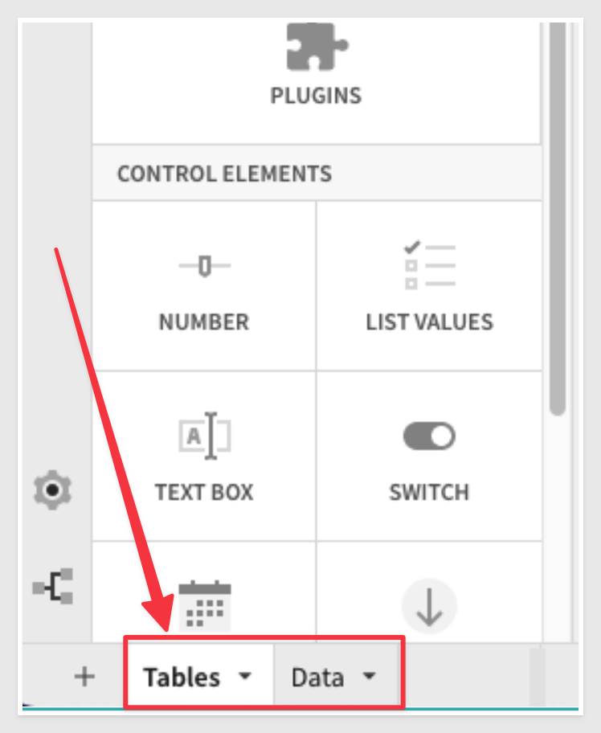

Click the `+ icon` to open the Editor Panel. This panel gives you access to all the objects possible to add to a Page. 
Select `Table` and for the source of data; we will use the Table on the Data page

Notice that there are a few options for the source data. Reusing data that has already been queried from the Connection can help improve performance by limiting the number of queries sent to the Cloud Data Warehouse (CDW).

<aside class="positive">
<strong>Browser Query:</strong> 
While Sigma does push queries to the CDW to take advantage of its scale and speed, Sigma is unique in that it first does an evaluation to see if the query or operation can be done in the end user’s browser using the data in the browser cache. This functionality is called Browser Query and leads to near-instant results and a faster, better user experience. 

Browser Query can perform operations like queries, filters, and sorts. And it is important to note that it is NOT a desktop data extract or summary as is the case with many other BI tools. Browser Query uses fresh data from the CDW and as soon as the browser is closed, the cache is flushed and the data does not persist, eliminating security or governance risk.
</aside>

<ul>
  <li><strong>New:</strong> Allows you to obtain data from any of your Connections.</li>
  <li><strong>In Use:</strong> Allow you use source data that is already in use on another Page in this Workbook</li>
  <li><strong>Page Elements:</strong> Table and visualization elements can be selected as a source from the open Workbook</li>
</ul>

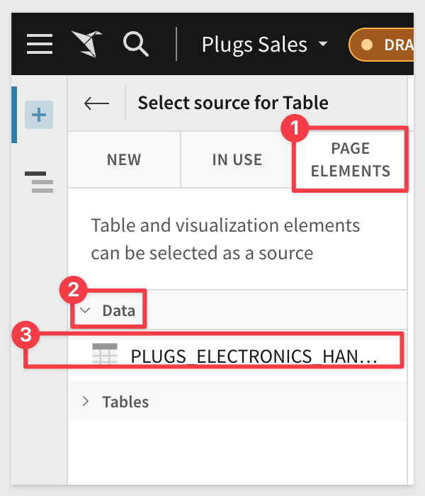

We now have our table and can begin working just like a normal spreadsheet. Get ready, you may be pleasantly surprised by how easy this is in Sigma.

<aside class="positive">
<strong>Spreadsheet-like, Tabular Interface:</strong> 
Sigma is unique in empowering users to do analysis in an interface they already know and love: the spreadsheet. It also uses familiar functions found in spreadsheets. No need for SQL knowledge as the Sigma interface automatically, and behind the scenes, converts all user actions into optimized SQL. This spreadsheet-like interface helps speed up user adoption and success, especially with non-technical business users. This interface appears when working with tables or clicking into the underlying data powering a visualization. 
</aside>

First, let’s truncate the Date column to Month. You can do this by selecting the dropdown on the header column for `Date` and select `Truncate date` and click `Month`.

 
<aside class="negative">
<strong>NOTE:</strong>  Sigma does not ever change the underlying data, we simply added a DateTrunc() Function in the Function bar.
</aside>

We want Cost of Goods Sold (COGS) but that column is not in the data. Let’s add it. Click the `Price columns drop list` and select `Add a new column`. 

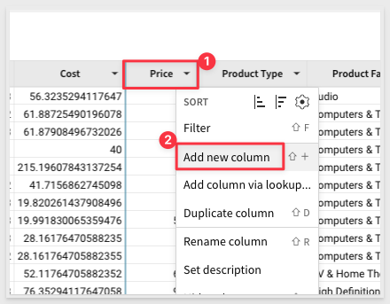

Using the same click path (you see the pattern now…) Rename the column `COGS`. 

In the Function bar start typing `Cost`...notice that Sigma is automatically giving you a list of options from the existing columns. 

You can just select from the list or complete typing. We want the formula `[Cost] * [Quantity]`. It should look like this now:

You can change the Quantity, Price and COGS columns to currency and loose the trailing digits using the function bar:

<!-- END OF TABLE BASICS -->

## **Behind the Scenes**
Duration: 6

Sigma makes things easy for you but there is a ton of power being applied in the background to make it that way. 

At any time you can click on the dropdown next to the refresh icon and select the query history to see exactly what is being run each time a change is made. This can be very useful for those with knowledge of SQL.

Clicking into the first `Query` gives every last detail:

<aside class="negative">
<strong>NOTE:</strong> You may have noticed a blue line moving across the screen after inputting the calculating and hitting Enter.  In Sigma, every action is transformed into SQL and sent to the data warehouse to be executed and to retrieve the results.  This ensures your data in Sigma is always live and up to date with the latest results. 
</aside>

<aside class="positive">
<strong>IMPORTANT:</strong>  Sigma is unique versus many other BI products in that Sigma is fully-managed SaaS, offers a direct connection to the Cloud Data Warehouse (CDW), and pushes all queries to the CDW for execution. Benefits of this include:

Data accessed by Sigma is always live and accurate
Unlimited query speed and scale as Sigma leverages the compute resources of the CDW. Queries across millions of rows are performant.
Stronger security and governance as data never leaves the CDW and it is easy to control permissions via a single point of access. 

With many other BI products, data is extracted out of the CDW to local desktops/servers for analysis which leads to stale data, limited scale and speed, and security issues with extracts scattered across many desktops and file shares.
</aside>

Related to the last item there is another feature that lets you “peek” behind a column to see some useful information. `Click on the column Store Region’s` drop list and click `Column Details`. This will display a pop-up to help you see things like Top Values and if nulls exist and more:

<!-- END OF BEHIND THE SCENES -->

## **Calculated Columns**
Duration: 6

Now, let’s add a few more columns using calculations. Click the column dropdown from the `Price` column and select `Add New Column`. 

Rename the new column `Revenue`

Enter the formula:
[Price] * [Quant] 
		
This is an intentional mistake in our formula; `Quant is not a valid column` and it does not exist anywhere else in the Workbook. What happened?

Sigma makes you immediately aware the Function has a problem:

Easy to fix, just adjust the column name to `Quantity` and `click the checkmark at the end of the Function bar`. Simple! 

Did you notice the columns being highlighted as you add them to the formula? Lots of little things to make you more efficient:

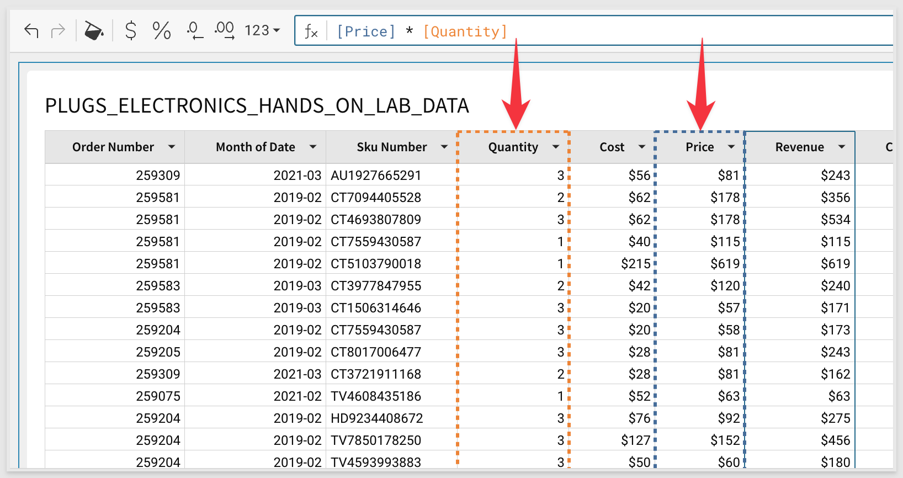

<aside class="negative">
<strong>NOTE:</strong> You may want to reorder the columns. Just drag and drop the columns to reorder them anyway you want. You can also hide columns you are not interested in anytime. Unhide them using the Element Panel.
</aside>

Now that we have our COGS and Revenue we should be able to calculate our `profit`. You can do this one yourself now:

`[Revenue] - [COGS]  `

Now that we know our profit made for each transaction, we may also be interested to know the `profit margin` percentage on each item:

`[Profit] / [Revenue]` 

Rename the column `Profit Margin`  In this case, `change the formatting to a %`.

Your Page should now look similar to this:

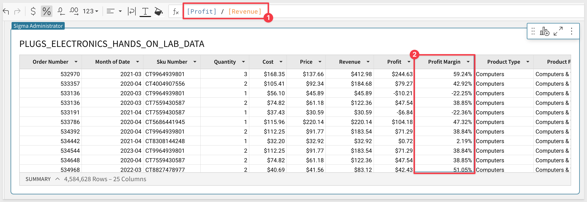

Some of these functions have been pretty easy, but Sigma is capable of performing the most commonly used functions available in excel/google sheets or SQL. We will get into some more advanced functions later, but you can always check out the complete list by clicking the ‘Help’ button  in the lower right hand corner and selecting [Function Index](https://help.sigmacomputing.com/hc/en-us/categories/360002442993-Function-Index)

<!-- END OF CALCULATED COLUMNS -->

## **Grouping Data**
Duration: 6

So far we have done some pretty simple operations. Let's go a bit deeper and group the data, building on the work we just did. There are two ways to group data. One is selecting the column and using the drop list and clicking “Group column”. 

This works fine but there is another method that introduces you to using the Element Configuration Panel.

Using the `Element Panel` (and with the Table selected) just drag and drop the `Month of Date` column up to the `GROUPINGS`	section as shown below:

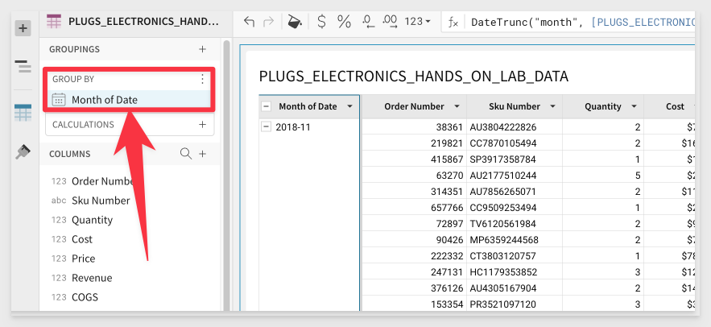

The table will automatically group on this column which allows us to perform calculations at his level of grouping.

Add a new column and rename it `Monthly Profit` using the following formula:

`Sum([Profit])`

<aside class="negative">
<strong>NOTE:</strong>  Did you notice that you can just double-click a column header to rename it?
</aside>

We now have the profit aggregate to the monthly level. You can at any point collapse a single month, or all the months to hide the underlying data. You can do this by clicking the minimize hash next to the column header of `Month of Date` or any Monthly values.  

Click on the minimize hash next to `Month of Date` to collapse all the Months.

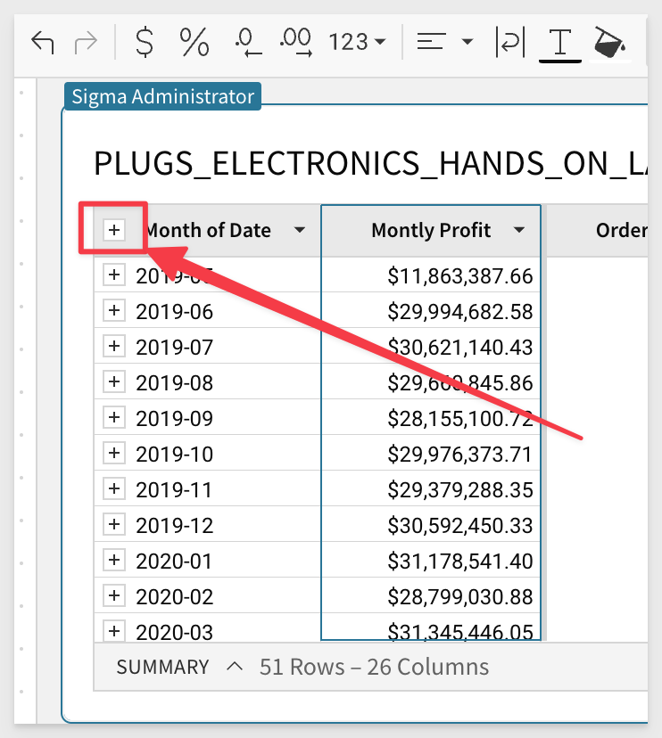

Scrolling to the right of the table, find the column `Store Region`.  Using the dropdown, select `Group column`.

Scrolling back to the left, you see that we have created another grouping below the Month grouping.  We can now perform calculations at this grouping level.  

Let's add a new column next to `Store Region` for `Region Profit` using the formula:

`Sum([Profit])`

Next, we can maximize the `Month of Date` column to see the data for our months and regions. You can do this by clicking on the maximize hash next to `Month of Date`.

We can now see all our months and regional profits for those months.

Taking this one step further we can also do formulas across the different grouping levels.

Clicking the dropdown next to `Region Profit`, select `Add new column`. Use the formula: 

`[Region Profit] / [Monthly Profit]` and format this as a percentage.

Rename the column `Contribution`

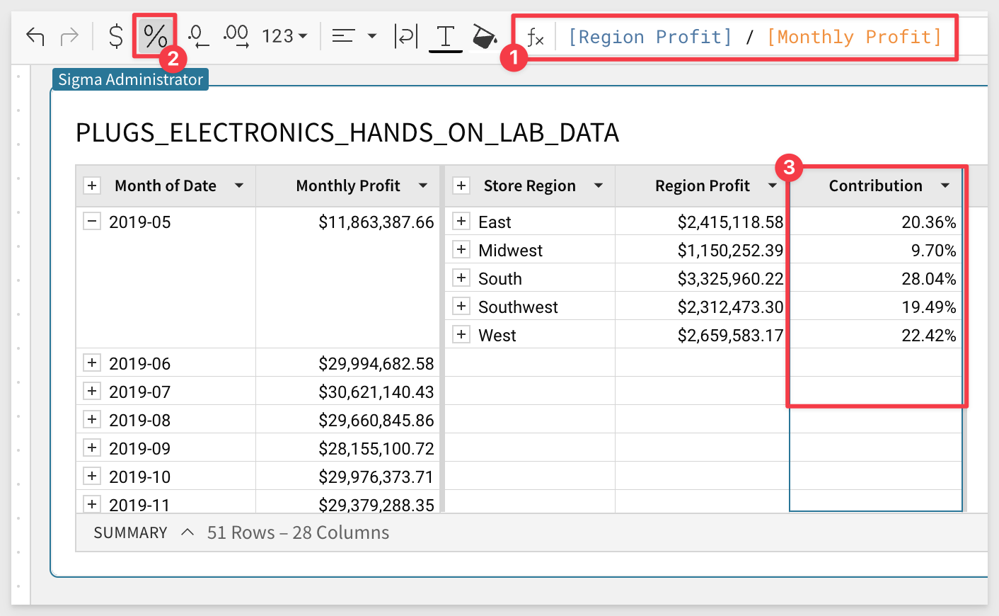

We can now see exactly how much each region is contributing to the monthly profit. There are no limitations in Sigma Workbooks Tables for how many groupings you can have. You can also at any time swap the order of the groupings in the left hand pane using a simple drag and drop method. We will leave the groupings alone for now.

<!-- END OF GROUPING DATA -->

## **Table Totals**
Duration: 6

Sigma Workbook Tables have many ways to get totals, sub-totals, and summary values.  We will explore them now.

First, from the `Store Region` column header dropdown, select `Show Totals`. 

You can now see we have totals aggregated at the Regional levels:

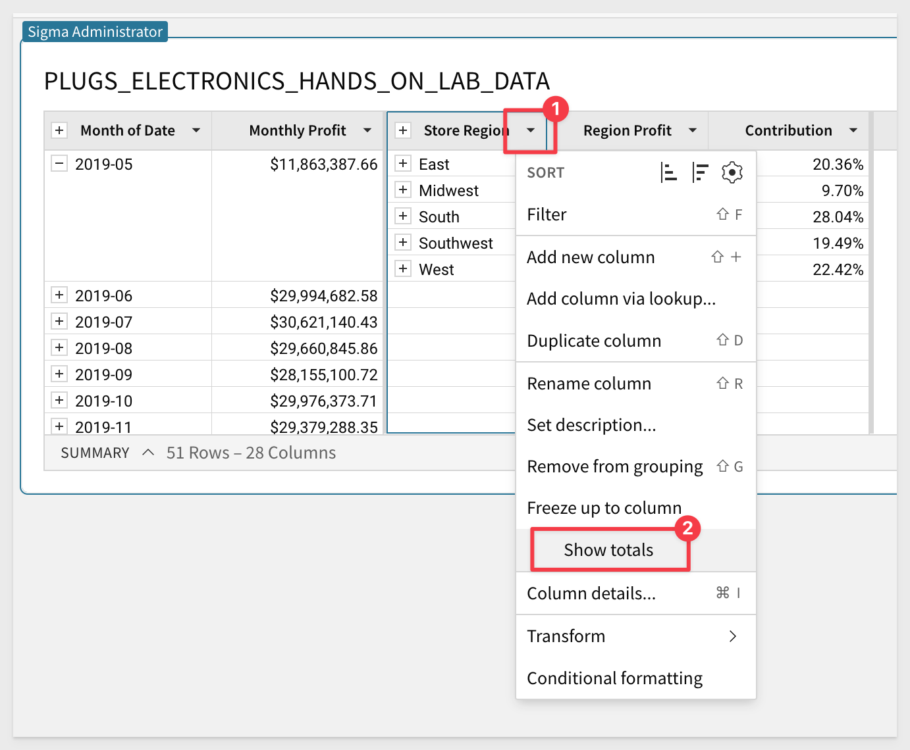

Taking this a step further we can do the same thing for our months.  From the `Month of Date` column header dropdown, select `Show Totals`.

We now have totals at the Monthly level as well.

<!-- END OF TABLE TOTALS -->

## **Conditional Formatting**
Duration: 6

Sigma Workbook Tables can use colors to give the user a more comfortable experience, drawing their eyes to important information through the use of Conditional Formatting. 

Using the drop-down on the `Contribution` select `Conditional Formatting`. Sigma automatically applies a base color scheme to the column. You can use the Elements Panel to adjust to suit your needs. 

In the left-hand pane, select `Single Color` and set the values as shown below. We can now see which regions had a Contribution lower than 10% in red.

There are many things you can do to enhance your Table; feel free to experiment and see what you can come up with. 

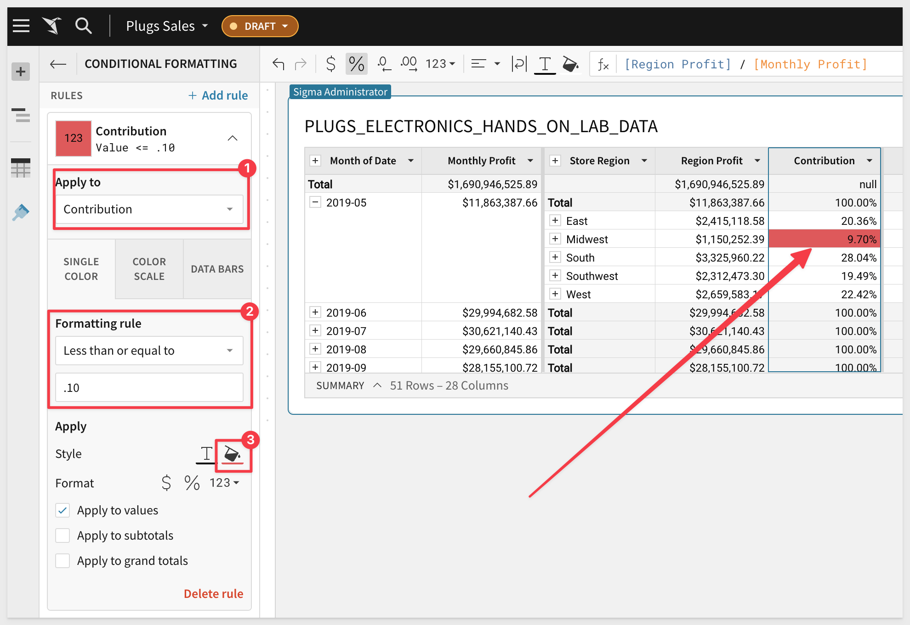

<!-- END OF CONDITIONAL FORMATTING -->

## **Summarizing Data**
Duration: 6

Sigma also has the ability to create Summary Values or KPIs across the entire Table.  At the bottom of the table you will see a line that says `Summary` which shows the number of rows as well as the number of columns.

At the bottom left corner of the Table click on the carrot and select the `+ button`. 

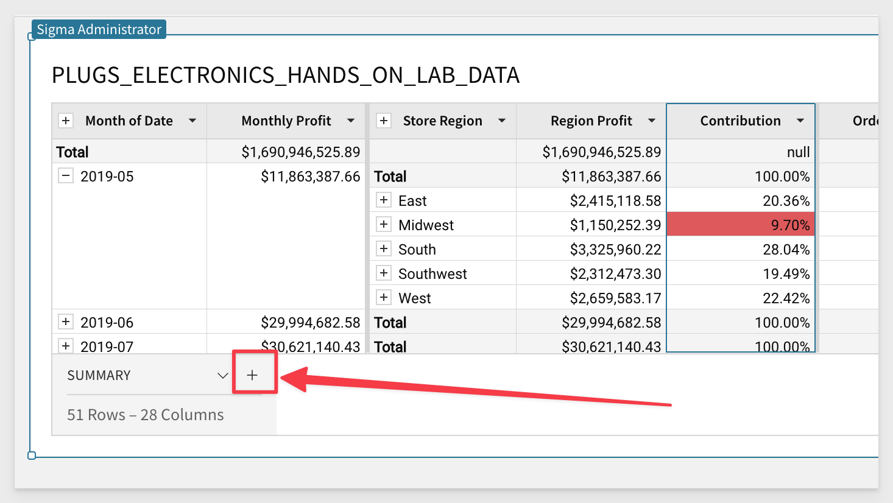

Select the `Revenue` column. Sigma will automatically Sum the column. You can adjust this formula at any time from the formula bar to be anything you want. We also renamed the Summary as shown:

&emsp;&emsp;&emsp;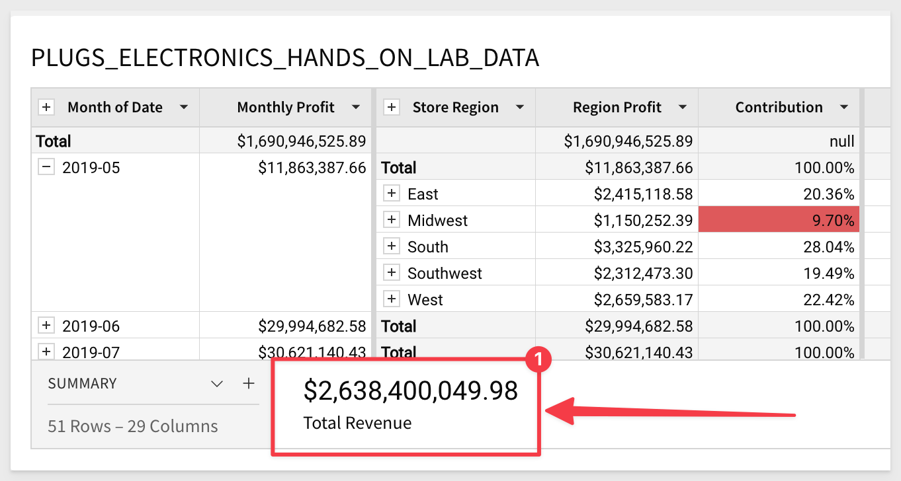

These Summary Values can now be accessed in any formula (by name) anywhere in the Table and can also be leveraged with our KPI visualizations.

Add one more summary for our COGS.  

<aside class="negative">
<strong>NOTE:</strong> Sigma will reference Summaries by name so in the next step if your names for “Total Revenue” and “Total COGS” the formula for the new Summary will fail. 
</aside>

Lastly, let's create one more Summary value by clicking on the carrot `^`, and selecting the `+ button`.  This time Select `New Summary`. This will give us a blank summary which we can write a function for:

In the function bar, enter the formula bar enter `[Total Revenue] - [COGS]` and hit enter.  Also rename this Summary to `Total Profit`.

It may also be helpful to have the total number of orders represented in the data. Sigma has a Function for that. Add another summary and set the formula to:

`GrandTotal(CountDistinct([Order Number]))`

<!-- END OF SUMMARIES -->

## **Filtering Data**
Duration: 6

Sigma also has the ability to easily filter Table data. Lets filter for only stores in the South region. 

Click on the `Store Region` column and select Filter. Notice that a `FILTERS & CONTROLS` panel opens and if auto-populates with the available distinct list of Store Regions. Also notice that under number 3 there is a small filter icon with a 1 next to it. This lets you know that the table has a filter set against it. This will come in handy to know as you work.

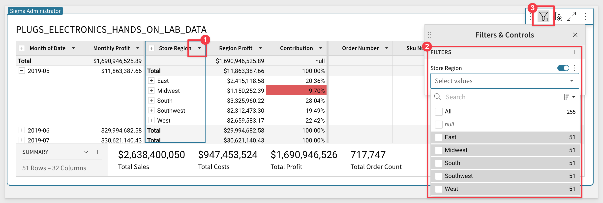

Click the checkbox for `East` and see the table update for just the East region. **The Summaries are also updated.** 

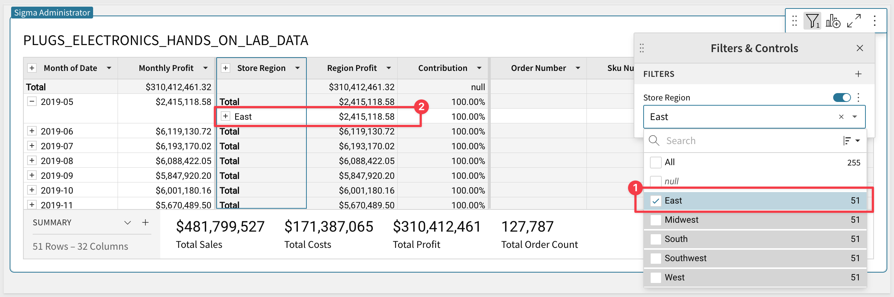

Would'nt it be great if I could just have this filter as as drop down on the Page? No problem. Just click the vertical 3-dots and click “Convert to Page Control”. Now the Table can be filtered by using the dropdown filter list as shown below:

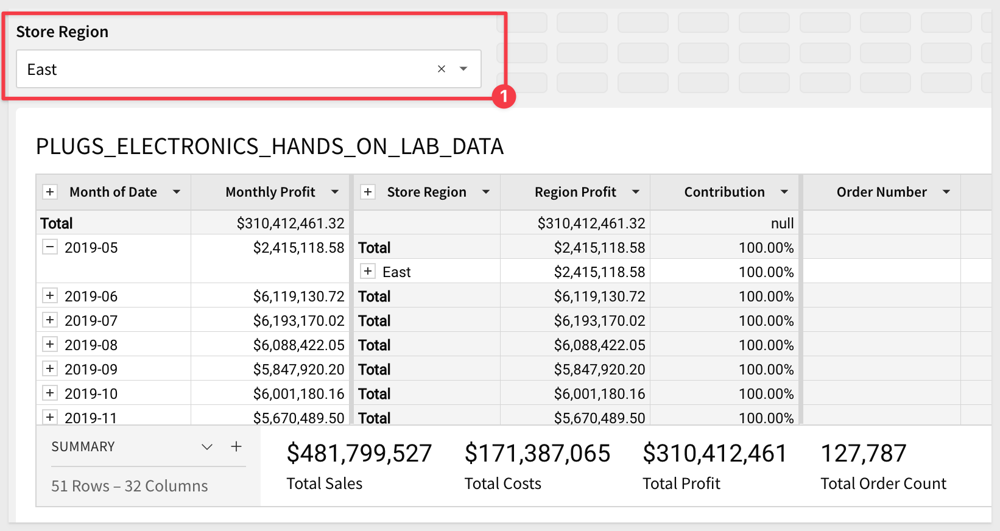 

You may want a totally different Page layout and we will cover that along with more information on Page Controls in the Dashboard QuickStart.

<!-- END OF FILTERING -->

## What we've covered
Duration: 6

In this QuickStart we covered how to access sample data to build a table, add new calculated columns, group and filter data and apply conditional formatting and filter the result set. 

[Click here to move to the next QuickStart in this series.](https://quickstarts.sigmacomputing.com/guide/fundamentals-3-working-with-visualizations/index.html)

**Additional Resource Links**

[Help Center Home](https://help.sigmacomputing.com/hc/en-us) 
[Sigma Community](https://community.sigmacomputing.com/) 
[Sigma Blog](https://www.sigmacomputing.com/blog/) 
 

&emsp;

<!-- END OF WHAT WE COVERED -->
<!-- END OF QUICKSTART -->