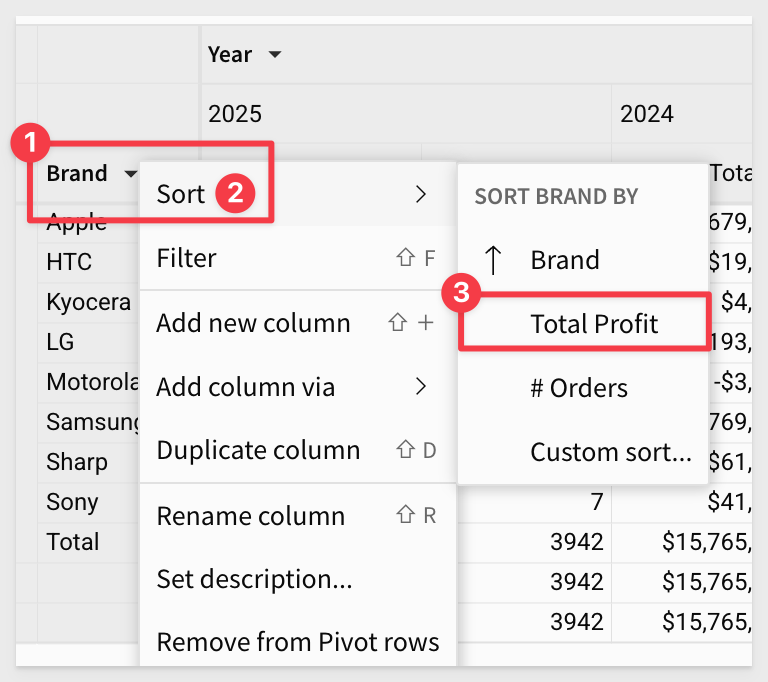
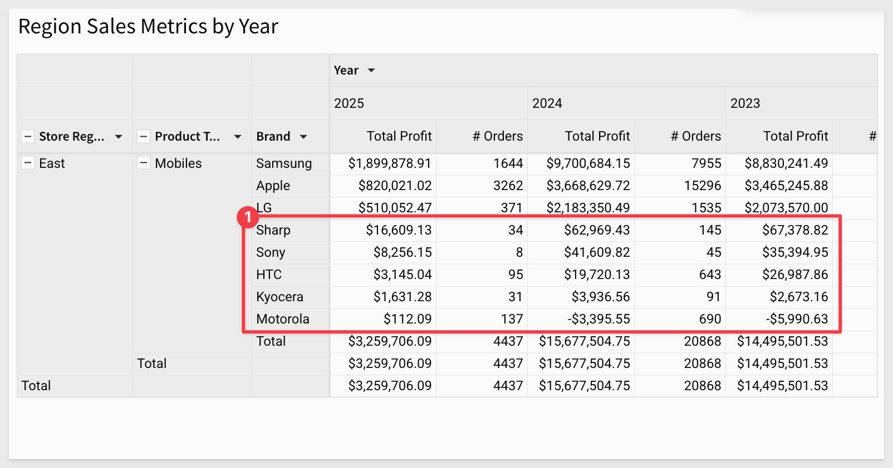
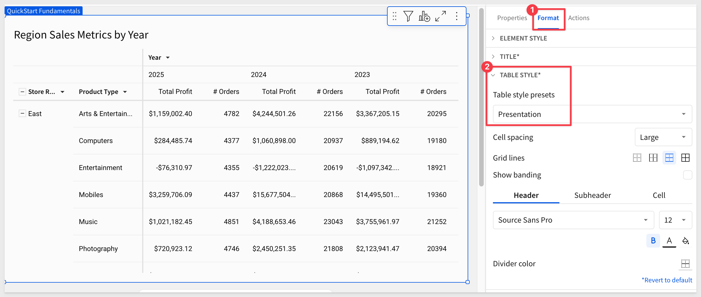
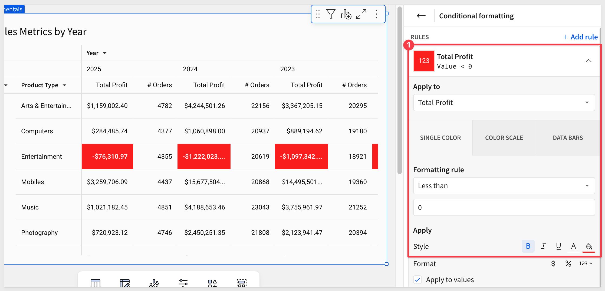

author: pballai
summary: fundamentals_3_data_pivot_tables_v3
id: fundamentals_3_data_pivot_tables_v3
categories: fundamentals
status: Published
feedback link: https://github.com/sigmacomputing/sigmaquickstarts/issues
tags: default
authors: PhilB
lastUpdated: 2025-03-13

# Fundamentals 3: Data - Pivot Tables
<!-- ------------------------ -->

## Overview 
Duration: 5

This QuickStart is part of a series of QuickStarts designed to instruct new users how to use Sigma to explore and analyze data using pivot tables.

Through this QuickStart, we will walk through why to use a pivot table, how to create one in Sigma, how to add conditional formatting, and how to drill down on table data.

We will be working with some common sales data from our fictitious company `Plugs Electronics`, reusing content we created in the QuickStart [Fundamentals 1: Getting Around.](https://quickstarts.sigmacomputing.com/guide/fundamentals-1-getting-around-v2/index.html?index=..%2F..index#0)

<aside class="positive">
<strong>IMPORTANT:</strong><br> This QuickStart assumes you have already completed Fundamentals 1 and 2 and are now generally familiar with Sigma.
</aside>

<aside class="positive">
<strong>IMPORTANT:</strong><br> Some screens in Sigma may appear slightly different from those shown in QuickStarts. This is because Sigma is continuously adding and enhancing functionality. Rest assured, Sigma’s intuitive interface ensures that any differences will not prevent you from successfully completing any QuickStart.
</aside>

For more information on Sigma's product release strategy, see [Sigma product releases.](https://help.sigmacomputing.com/docs/sigma-product-releases)

 ### Target Audience
The typical audience for this QuickStart includes users of Excel, common Business Intelligence or Reporting tools, and semi-technical users who want to try out or learn Sigma.

### Prerequisites
<ul>
  <li>A computer with a current browser. It does not matter which browser you want to use.</li>
  <li>Completion of the QuickStart “Fundamentals 1: Getting Around”</li>
  <li>Completion of the QuickStart “Fundamentals 2: Data”</li>
  <li>Access to your Sigma environment. A Sigma trial environment is acceptable and preferred.</li>
  <li>If you have not already, you can sign up for a Sigma Trial here:</li>
</ul>

<button>[Free Trial](https://www.sigmacomputing.com/free-trial/)</button>

<aside class="positive">
<strong>IMPORTANT:</strong><br> Sigma recommends using non-production resources when completing QuickStarts.
</aside>


<!-- END OF OVERVIEW -->

## Pivot Table Defined
Duration: 10

A pivot table is an interactive tool for quickly summarizing large amounts of data, allowing for deeper analysis and answering unanticipated questions. It is particularly useful for:

- Querying large datasets in a user-friendly way.
- Subtotaling, aggregating, and summarizing data by categories and subcategories.
- Creating custom calculations and formulas.
- Expanding and collapsing data levels to focus on specific details.
- Pivoting rows to columns (or vice versa) to view data from different perspectives.
- Presenting clear, concise, and well-annotated reports.

In contrast, standard tables typically offer a flat data structure. While grouping and other features can enhance organization, these differences may not be immediately obvious to all users.

It is also important to understand that there is a strong case for using tables instead of pivot tables.

A discussion of this is outside the scope of a fundamentals QuickStart, but if you are interested, review the Sigma community post, [Best practice 1](https://community.sigmacomputing.com/docs?topic=3285) for that information.


<!-- END OF PIVOT TABLE BASICS -->

## Use Case
If we want to analyze total profit and order quantities over multiple years, categorized by store region and product type, we can retrieve the necessary columns from our `Plugs_Store_Sales` table on the `Data` page.

While grouping the data in a standard table could technically satisfy this requirement, the result may not be intuitive for the viewer. Users might need to make multiple clicks to rearrange the table to fit their needs.

For example, with standard table grouping, the output might look something like this:

(Insert example table here)

This view can be useful, but it may still require additional effort to navigate and interpret effectively.


Let's create a pivot table instead.


<!-- END OF PIVOT TABLE BASICS -->

## Creating a Pivot Table
Duration: 10

In Sigma, open the workbook `Fundamentals` and place it in edit mode. We should still have the page called `Data` that has the `Plugs_Store_Sales` table on it. 

Add a `New page` and rename it `Fundamentals 3`. 

Using the `Element bar` > `Data` add a new pivot table element to the page. 

Click `Select source` and select the `Plugs_Store_Sales` table from the `Elements` > `Data` page.

Now we need to configure the pivot table.

Drag the `Store Region` column to `PIVOT ROWS` in the `Element panel`.

Do the same with `Product Type`.

At this point, `Product Type` is nested under `Store Region`. 

Click this icon **(#3 in image below)** to display the two columns separately.


Add `Month of Date` to the `PIVOT COLUMNS` section in the element panel.

Let's adjust the `Month of Date` pivot column to `Year` by using the `DateTrunc` function:
``` code
DateTrunc("year", [Plugs_Store_Sales/Month of Date])
```

Our pivot table now looks like this:


Add the `Profit` and `Order Number` columns to the `VALUES` grouping.

Set the aggregation method for the `Order Number` column to `CountDistinct`:


Rename these `VALUE` columns to `Total Profit` and `# Orders`.

Rename the pivot table's title to `Region Sales Metrics by Year` and also change name of the `Year of Month of Date` column to `Year`.

Our pivot table now looks like this:


<aside class="positive">
<strong>IMPORTANT:</strong><br> Adding new columns to a pivot table follows the same steps as adding them to a standard table. 
</aside>


<!-- END OF DRILL ANYWHERE  -->

## Drill Anywhere
Duration: 10

The presentation of the pivot is just the starting point for the user who most likely cares about spotting problems or trends and taking action. 

Sigma allows users to access all the data they are permitted to see, so they get to use their business knowledge, unconstrained by the analytics.

In the pivot table `right click` on `East` > `Mobiles` cell and select `Drill down`:


On the `Drill down` modal, select `Brand`:


`Brand` is added to the pivot table, and we can see sales figures accordingly:


We might want to see the most recent year first. That is simple enough. 

Click on the `Year` > `Year (ie: 2020)` and select sort and descending (down arrow):


We also want to sort `Brand` by `Total Profit`, so we can more easily see the bottom dwellers:



Now it is clear which vendors are performing poorly:



The action of drilling down on `Brand` added the column as a pivot row (#1 in the image below). We can keep that or remove it just as easily using the `Brand's` column menu.

The drill-down action also created two filters that we can keep or disable.


<aside class="negative">
<strong>NOTE:</strong><br> Two filters were created since we selected Mobiles in the East region so both were added as filters.
</aside>

Our pivot table now looks like this **(after disabling the two filters and removing the Brand pivot row.)**:


Click `Publish`.


<!-- END OF DRILL ANYWHERE  -->


## Customization / Styles
Duration: 5

Following the same workflow we used in the tables QuickStart, we can apply customizations to our pivot table to make it easier on the user's eyes.

In the `Element panel` > `Format`, we can adjust the various items in the pivot to suit our needs.

In the `TABLES STYLES` section, we can easily make adjustments as shown in the image below. Note that there are separate configurations for `Header` and `Subheader` in this section:

Each section will display an asterisk when the defaults have been changed::



Experiment as much as you want. Each section has the option to `Restore to default.`

Click `Publish`.


<!-- END -->

## Conditional Formatting
Duration: 5

Just like we did when working with standard tables, we can apply conditional formatting to the pivot table, based on values in cells.

### Color Scales
Click the pivot table to select it, then click the `Format` in the `Element panel`. 

Then click `Conditional formatting`:


This opens the conditional formatting panel. We use this to create "rules" that will allow different styling effects to be applied based on the the evaluation of the rule.

For example; show all transactions where the margin in negative (sold at a loss) with a red cell background and white/bold text.

In our case, we will configure a simple rule to drive the cell colors used in the `Total Profit` column.

The rule is applied automatically and we now can see which product types are underperforming:



### Data Bars
We can also apply a progress bar inside of a column's cells. This can be color based and include a min/max value range.

Click the link for `+ Add rule`.

Click the `DATA BARS` box.

Select the `Total Profit` column. 

The fill colors are already set for us; we can just use those.

If we wanted to set min/max values, we would click the `Customize Domain` checkbox.

Now we can see the relative profits of the product types that are making profits but the ones loosing money are still front-and-center in full red.

Our pivot table now looks like this:


Click `Publish`.

There are many more features designed to improve the usability of pivot tables and to meet specific use cases.

Here are just a few example that customers have found useful:

- Empty cell display value (on/off)
- Repeat row labels
- Swap pivot columns and rows
- Change the aggregation of values
- Display multiple pivot rows as separate columns
- Define values hierarchy in a pivot table
- Maximize a pivot table to view the flattened table

For more information, see [Working with pivot tables](https://help.sigmacomputing.com/docs/working-with-pivot-tables)

## What we've covered
Duration: 5

In this QuickStart, we covered why you might use a pivot table, how to use Sigma to create one, add conditional formatting, and drill down on table data and more.

The next QuickStart in this series covers using [input tables in Sigma](https://quickstarts.sigmacomputing.com/guide/fundamentals_4_input_v3/index.html?index=..%2F..index#0)

**Additional Resource Links**

Be sure to check out all the latest developments at [Sigma's First Friday Feature page!](https://quickstarts.sigmacomputing.com/firstfridayfeatures/)

[Help Center Home](https://help.sigmacomputing.com)<br>
[Sigma Community](https://community.sigmacomputing.com/)<br>
[Sigma Blog](https://www.sigmacomputing.com/blog/)<br>
<br>

[](https://twitter.com/sigmacomputing)&emsp;
[](https://www.linkedin.com/company/sigmacomputing)&emsp;
[](https://www.facebook.com/sigmacomputing)


<!-- END OF WHAT WE COVERED -->
<!-- END OF QUICKSTART -->
