summary: Fundamentals for new users and Sigma Visualizations
id: fundamentals-3-working-with-visualizations-v2
categories: fundamentals
status: hidden
feedback link: https://github.com/sigmacomputing/sigmaquickstarts/issues
tags: 
authors: pballai
lastUpdated: 2024-06-31

# Fundamentals 3: Working with Visualizations v2

## Overview 
Duration: 5

This QuickStart is part of a series of QuickStarts designed to instruct new users how to use Sigma to explore and analyze data using Visualizations (**Viz**). 

We will be working with some common sales data from our fictitious company `Plugs Electronics`, reusing content we created in the QuickStart [Fundamentals 1: Getting Around.](https://quickstarts.sigmacomputing.com/guide/fundamentals-1-getting-around-v2/index.html?index=..%2F..index#0)

<aside class="positive">
<strong>IMPORTANT:</strong><br> This QuickStart assumes you have already taken the QuickStart Fundamentals 1 and 2, and are now generally familiar with Sigma. Given this, some steps are assumed to be known and may not be shown in detail.
</aside>

Sigma supports a wide variety of types, and are adding others so be sure to check our documentation for the latest list:

<table>
    <thead>
        <tr>
            <th colspan="2"><strong>Supported Visualizations Types:</strong></th>
        </tr>
    </thead>
    <tbody>
        <tr>
            <td> 
              <ul>
                <li><strong>Area chart</strong></li>
                <li><strong>Bar chart</strong></li>
                <li><strong>Box and Whisker chart</strong></li>
                <li><strong>Combo chart</strong></li>                
                <li><strong>Pie / Donut chart</strong></li>
                <li><strong>Funnel chart</strong></li>
                <li><strong>Gauge chart</strong></li>
                <li><strong>Geography Map</strong></li>                
              </ul>
            </td>
            <td>
            <ul>
                <li><strong>KPI chart</strong></li>                
                <li><strong>Line chart</strong></li>
                <li><strong>Maps – by region, point (lat/long), or GeoJSON</strong></li>
                <li><strong>Point map</strong></li>                
                <li><strong>Sankey diagram</strong></li>                
                <li><strong>Scatter plot</strong></li>
                <li><strong>Single value visualizations</strong></li>
                <li><strong>Dynamic text value</strong></li>
              </ul>
              </td>
        </tr>
    </tbody>
</table>

For the latest list of supported Viz types, [click here.](https://help.sigmacomputing.com/docs/intro-to-visualizations)

 ### Target Audience
Sigma combines with the unlimited power of the cloud data warehouse and the familiar feel of a spreadsheet; no limit on the amount of data you wish to analyze. Sigma is awesome for users of Excel and even better for customers who have millions of rows of data.

Typical audience for this QuickStart are users of Excel, common Business Intelligence or Reporting tools and semi-technical users who want to try out or learn Sigma. Everything is done in a browser so you already know how to use that. No SQL or technical skills are needed to do this QuickStart.

### Prerequisites
<ul>
  <li>A computer with a current browser. It does not matter which browser you want to use.</li>
  <li>Completion of the QuickStarts Fundamentals 1 and 2</li>
  <li>Access to your Sigma environment. A Sigma trial environment is acceptable and preferred.</li>
  <li>If have not already, you can sign up for a Sigma Trial here:</li>
</ul>

<button>[Free Trial](https://www.sigmacomputing.com/free-trial/)</button>

<aside class="postive">
<strong>IMPORTANT:</strong><br> Sigma recommends that you use non-production resources when doing QuickStarts.
</aside>

### What You’ll Learn
Through this QuickStart, we will walk through how to use Sigma to create beautiful charts and maps, changing configuration parameters to suit your needs.


<!-- END OF OVERVIEW -->

## Viz Basics
Duration: 30

Our starting point is the workbook created in the QuickStart, [Fundamentals 2: Working with Tables](https://quickstarts.sigmacomputing.com/guide/fundamentals-2-working-with-tables-v2/index.html?index=..%2F..index#0)

It is often easier to spot trends, outliers, or insights that lead to further questions when viewing data in a visualization.

Sigma makes it easy to create visualizations of your data while also enabling you to dig into the data that makes up those visualizations.

In Sigma, open the Workbook `Fundamentals` and place it in `edit mode`.

### Visualization as Child

Our workbook has a page called `Data`.

Click on the table's icon, as shown below, and click `Create Child Element`. 

Select `Visualization` from the drop list.

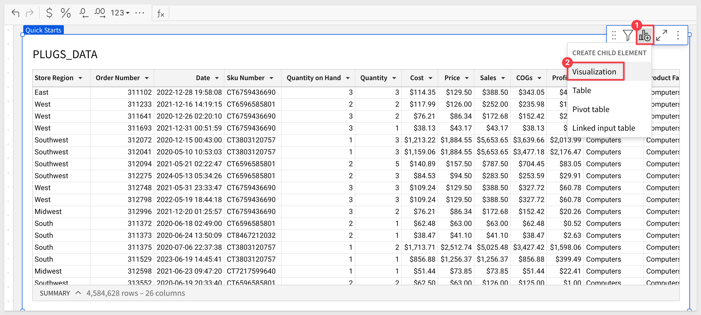

Sigma creates a new page element below the table as an un-configured placeholder for the new visualization.

Move the Viz to the `Dashboard` page:

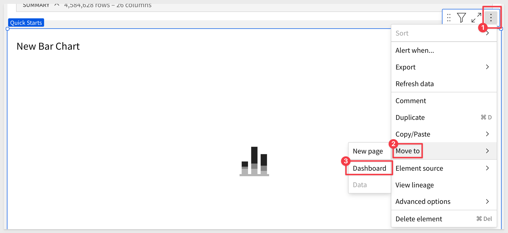

Drag the Viz above the table:


This placeholder is a child of the table, as it references everything in the parent table, making it easy to build whatever visualization we want from that data.

<aside class="positive">
<strong>NOTE:</strong><br> This is awesome because it means someone who knows the underlying data could make this table available with careful curation, and others can just use it.
</aside>

Rename this bar chart reflect `Profit and Sales by Store Region`.

Now that you have completed the first two QuickStarts in this series, you know how easy it is to use the element panel to configure elements on the canvas. 

Use the element panel to configure the bar chart as shown below:


We have our first Viz:


<aside class="negative">
<strong>NOTE:</strong><br> Sigma automatically summed the sales and profit columns to create an aggregate. You can change the type of aggregate at any time using the dropdown, or if you do not wish to aggregate the values, you can uncheck the “Aggregate Values” checkbox.
</aside>


### Customizations

We can further customize many of the bar chart's attributes using the `Element panel` > `Chart` icon:

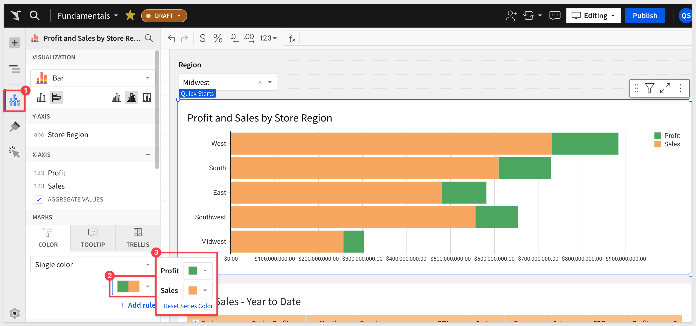

Explore both the `Chart` and `Paint Brush` (below the chart icon) icons to see what can be customized for the selected chart.

<aside class="negative">
<strong>NOTE:</strong><br> The available customizations are driven by the type of Viz that is currently selected. 
</aside>

### Adding a new Viz

Another way to create a new Viz is by selecting the `+ icon` on the top left panel next to the `Page Elements` title, and selecting `VIZ`:


After selecting the ‘VIZ’ icon, Sigma prompts us to select a source to use for that ‘Viz’.

We will use the same `source selector` that we used when we added a table in Fundamentals #2.


We now have a new chart below our bar chart. 

Drag the new Viz to be side by side with the bar chart, and use the `element panel` to configure it as a pie chart:


Sort the `Brand` column by `Sum of Profit`.

<aside class="negative">
<strong>NOTE:</strong> Always make sure you have the correct canvas element selected when making changes. You don't want to change the first chart you made by accident.
</aside>

Now we have two charts:


We want the two charts to change, when the `Region` control is changed by the user. 

This is done by adding the two new charts as `Targets` of the control:

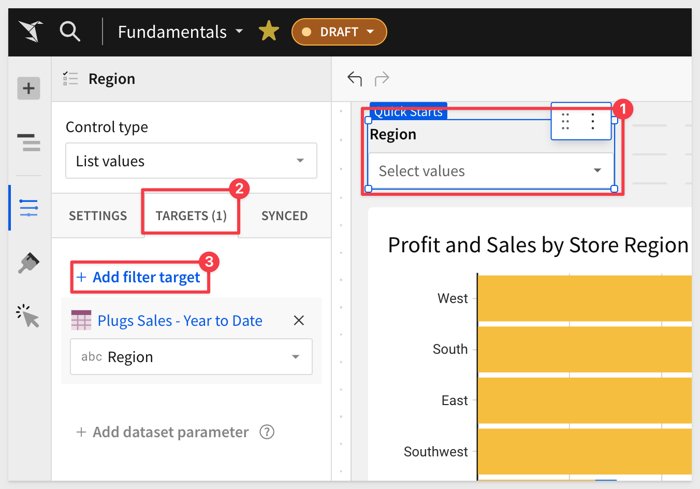

Go ahead and add both the charts as targets:

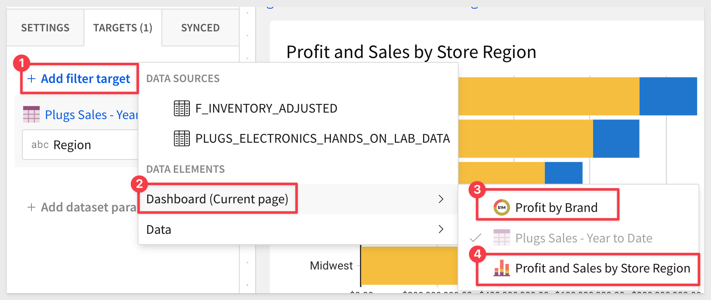

Change the `Region` control to `West`. 

The `Profit by Brand` chart now shows `No Data`. **What happened?**

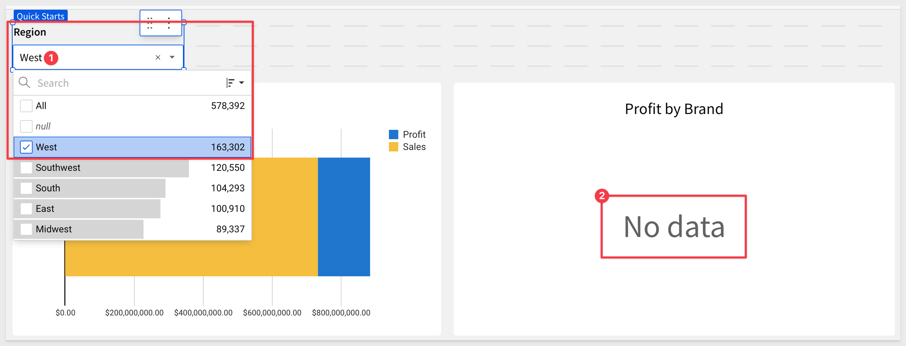

That chart does not have the `Region` column, so the  query returns no data. 

For now we can simply remove that chart from the target list to fix the issue. 

Now, setting the `Region` control to `West` updates the table and bar chart only:

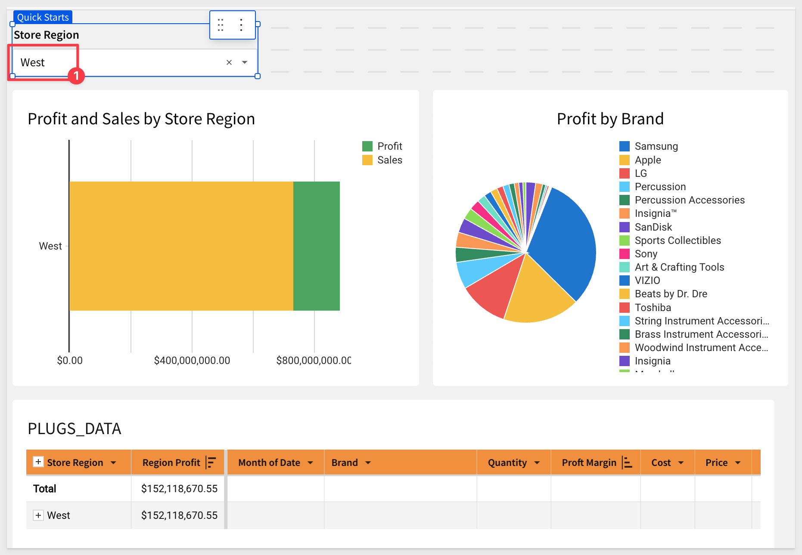

Click `Publish`.

There are many different chart-type visualizations available to experiment with; we will not cover them all since they are all added and configured as we have already done. 

<aside class="positive">
<strong>IMPORTANT:</strong><br> This consistency of design is really important to Sigma; it makes working with data easy!
</aside>


<!-- END OF VIZ BASICS -->

## KPI Charts
Duration: 5

As you have seen, there are many different types of visualizations available, and they all follow the same basic workflow. Once you know how to create one, the others will be obvious.

For example, let's say we want a `KPI` that shows `Revenue`, and compare the current month with the same month from the previous year. 

Add a new Viz, set its data source to the `PLUGS_DATA` table on the `Data` page, and change the `VISUALIZATION` type to `KPI`.

Now simply use the element panel as before to configure the KPI as shown below:

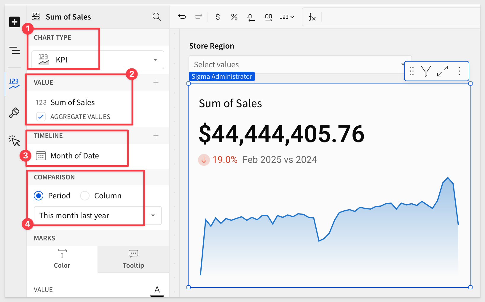

These steps are very much like ones that we have already done, which makes this straightforward. 

The exception might be how to get the value formatted as in millions, instead of the default.

In the `VALUE` element, open the menu for `Sum of Sales` > `Format` and select `Custom`:

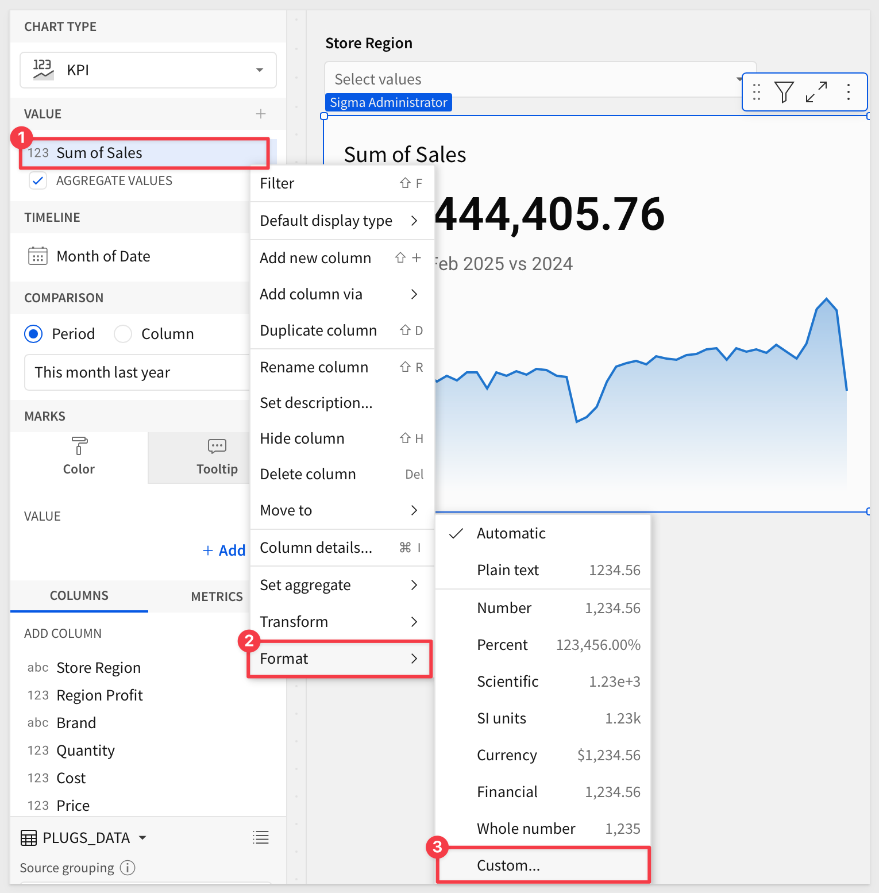

The `Custom Format` modal lets us adjust how the data is displayed using standard formatting, based on D3.js (D3). [D3 is a free, open-source JavaScript library.](https://d3js.org/what-is-d3)

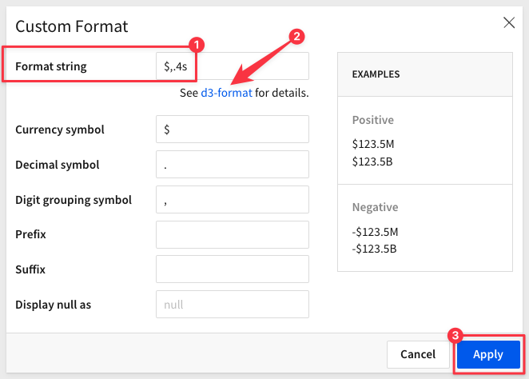

The `Dashboard` should now look similar to this:

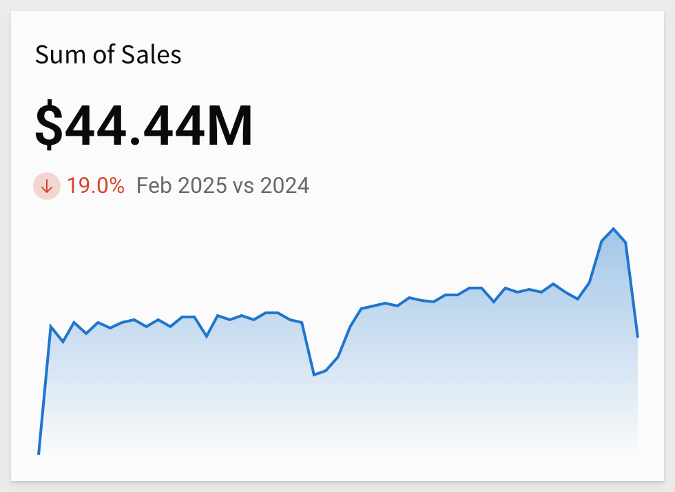

Click `Publish`.

Add other KPIs as you like; for example, `COGS`, `Profit` and `Profit Margin` would be good to add:

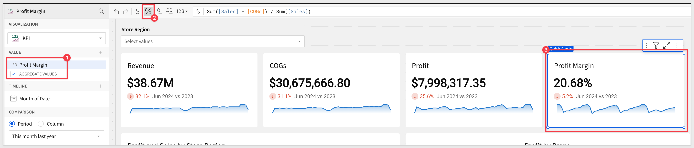

One way to do this is simply use the `Revenue` KPI menu and select `Duplicate` to quickly create copies. 

COGS and Profit are done by swapping the `VALUE` column from `Sum of Sales` to `COGS` and `Profit` respectively.

However, this does not work for the `Profit Margin` column. **Why not?**

In looking at our `Data` page > `PLUGS_DATA` table, we have a column for `Profit` but that is profit in dollars. We are looking for margin.

<aside class="positive">
<strong>IMPORTANT:</strong><br> Thoughtful source data design can save time for the designer and users later, by avoiding having to add things later. We want users using curated data as much as possible to avoid mistakes in calculations later. 
</aside>

We could add `Profit Margin` to our source data (and that is best practice) but in this case, we will add the formula in the KPI, just to demonstration that functionality exists:

Use the following formula for the `Profit Margin` columns value:
```code
Sum([Sales] - [COGs]) / Sum([Sales])
```


The `Dashboard` should now look similar to this:

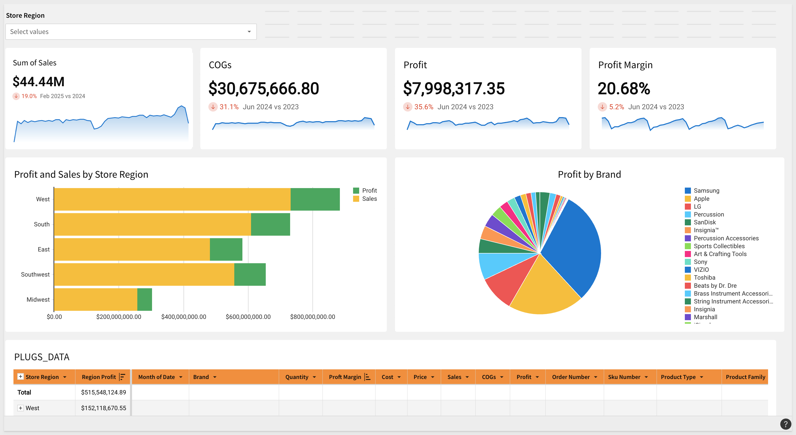

Click `Publish`.

Read more about [KPI charts here.](https://help.sigmacomputing.com/docs/build-a-kpi-chart)


<!-- END OF KPI -->

## Maps
Duration: 15

Geographic data can tell a powerful story. Whether analyzing regional trends or plotting sites, maps are packed with insights generated from your location data. Sigma Maps help contextualize geospatial information and provide greater understanding when analyzing data. With Sigma, you can create interactive maps using regions, latitude and longitude, or map paths and areas utilizing GeoJSON.

<aside class="negative">
<strong>NOTE:</strong><br> If maps are not used in your role, feel free to skip this section. 
</aside>

Workbooks support three distinct map types: **Region**, **Point** and **Geography**:

 <ul>
      <li><strong>Region: </strong>Require a single text column on the map's REGION field. For example, you can use a column “US State” to distinguish between “regions” or states in this example</li>
      <li><strong>Point: </strong>Require a number column on both the map's LATITUDE and LONGITUDE fields. For example, you may want to show store locations on a map.</li>
      <li><strong>Geography: </strong>Support datasets with geography data (WKT format) or variant data (GeoJSON format) and are typically used to illustrate geospatial objects on a map.<li>
</ul>

Our `PLUGS_DATA` table has columns for the `Region` and `Point` map types:

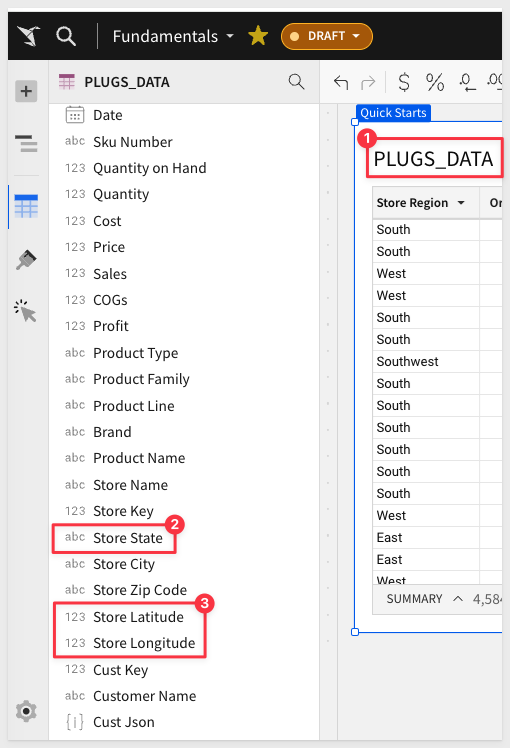

### Json Data
You many have noticed there is a column called `Cust Json` that has some odd looking cell data in it:

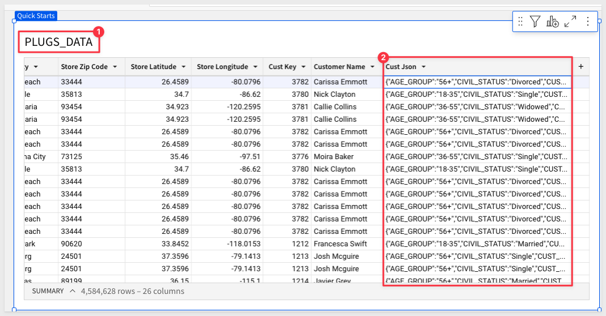

In the case of mapping, this json data contains state and region fields we might want to use for a map.

This data is stored in the warehouse using the `Json` format. It is common to see data stored this way and this can present a challenge as it needs to be transformed somewhere in an organizations data management workflows. We have seen many instances where data is received from a third party in this format and everything slows down as importing it can be problematic. 

Sigma can extract json data in seconds. To read more about that, [see the Parsing JSON Data in Seconds QuickStart.](https://quickstarts.sigmacomputing.com/guide/tables_json_parsing/index.html?index=..%2F..index#0)

If we just want to see what is "inside" the json data, just double-click one of the column cells:

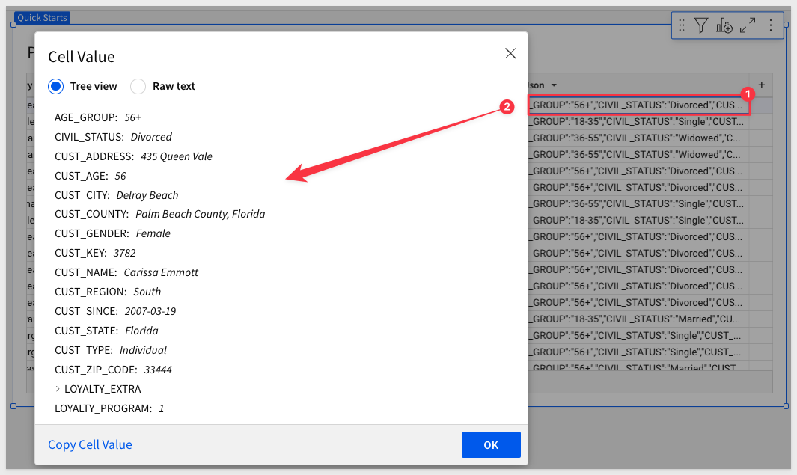

Since our `PLUGS_DATA` table already has `Store State` we can just use that for demonstration.

### Map by Region (State)
Add a new Viz, set its data source to the `PLUGS_DATA` table on the `Data` page, and change the `VISUALIZATION` type to `Map-Region`.

Now simply use the element panel as before to configure the map as shown below:

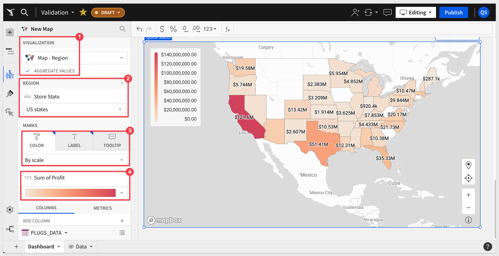

We also want to configure `LABEL` and `TOOLIP` options in the element panel:

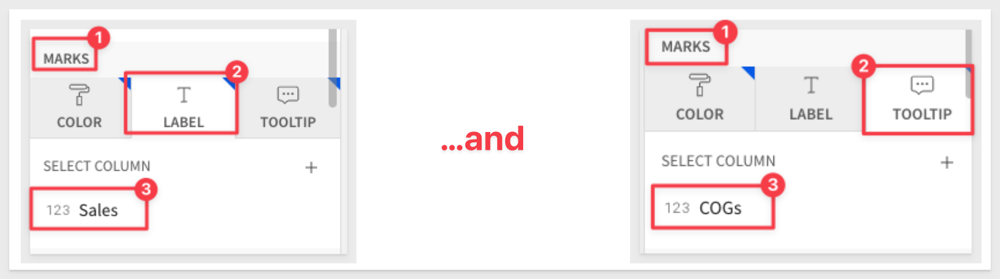

When you hover over each State, the values configured into our `Label` and `Tooltip` are shown: 

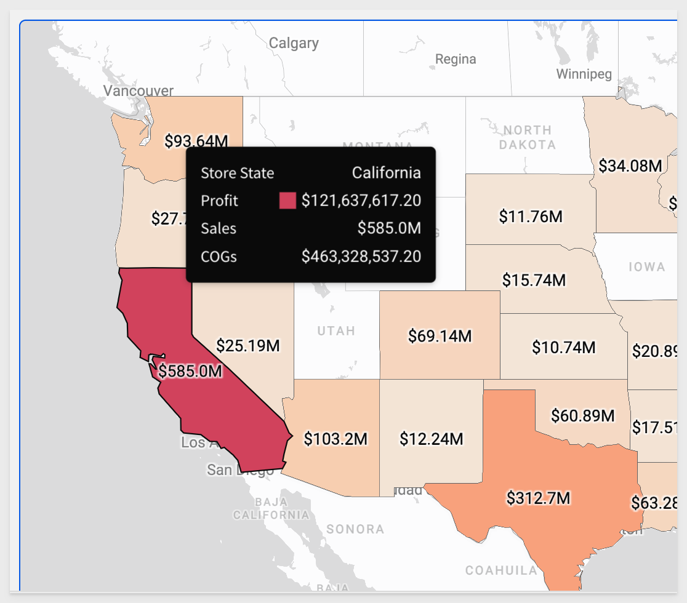

Right clicking on any State allows you to include/exclude it from the dataset or drill down to underlying data.

<aside class="positive">
<strong>Drill Anywhere: </strong><br>The ability to drill anywhere did not have to be programmed ahead of time by a developer. Unconstrained, ad-hoc analysis gives the user the power to explore the data beyond what was originally intended and as they see fit.
</aside>

Click on the `expand` icon in the upper right corner of the map:

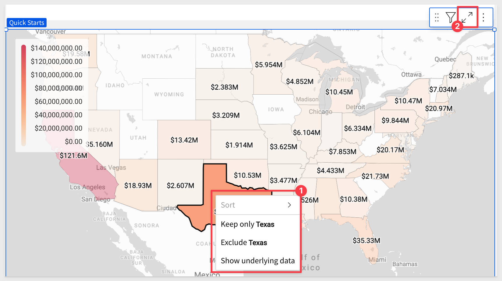

Now we can work with the underlying data, which has been grouped and aggregated for us, based on the map's configuration. 

We can browse the data or duplicate it to create different views for our own analysis.

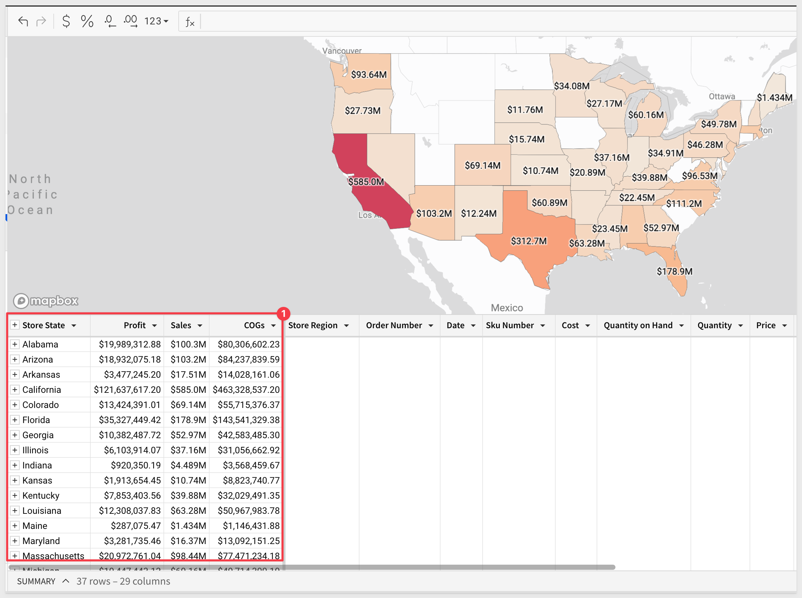

To revert back to the map view by clicking the 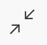 icon.

The `Dashboard` should now look similar to this:

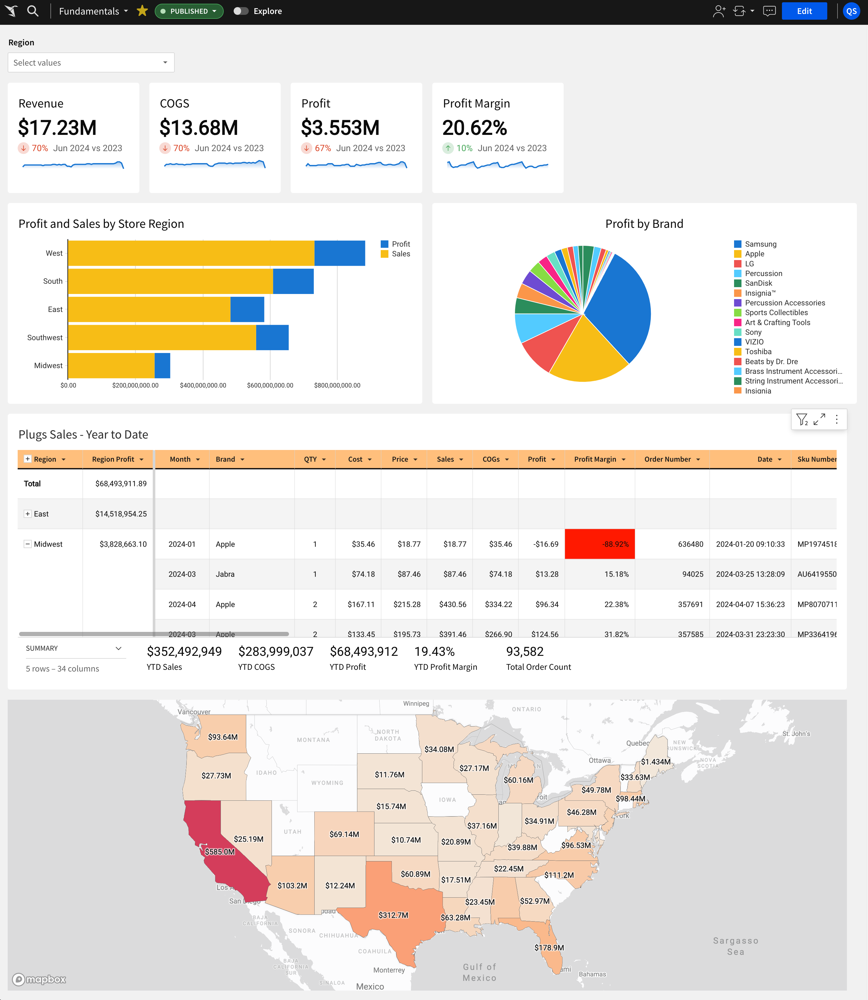

Click `Publish`.


<!-- END OF MAPS -->

## Dynamic Text
Duration: 15

Adding a sentence at the top of a dashboard that summarizes important information is really easy in Sigma. 

We do this by adding a `Text` element to the Dashboard:

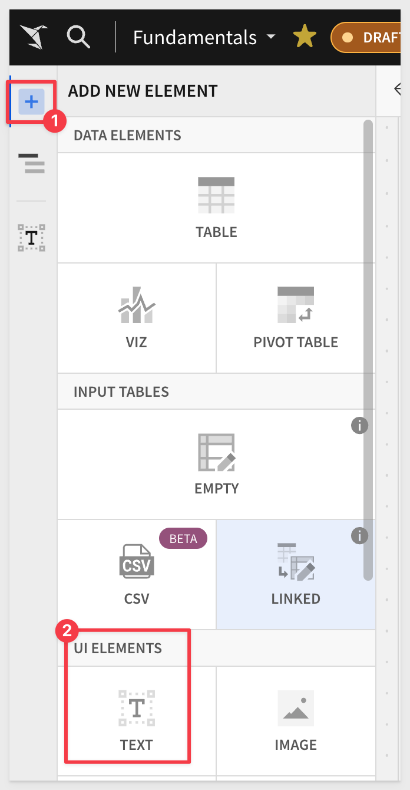

In the function bar, copy and paste the following text:
```code
Current year-to-date gross margin sits at value, driven by value in revenue and value in COGS.
```

We left the word `value` in the text so that we can demonstrate how to make it dynamic.

After selecting the new text element, double-click on the first instance of the word `value`:

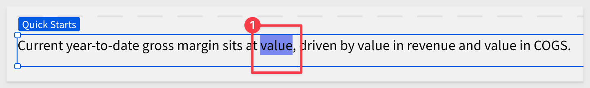

Press the `=` key on your keyboard. 

This opens the function editor, where we can write a formula to be used in place of the text.

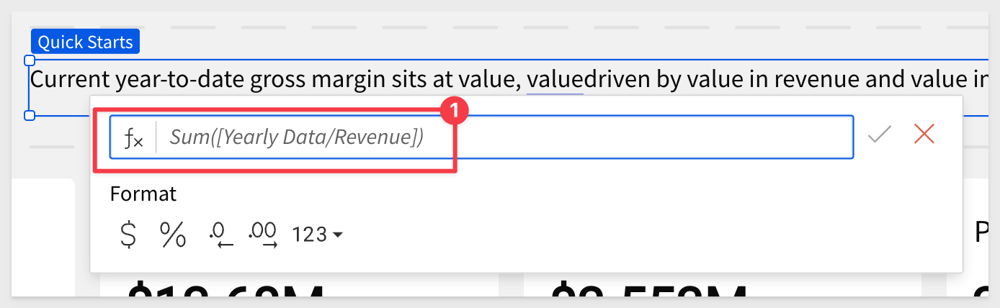

In this case, we need `YTD Gross Margin`. Since we have that in the dashboard table as a summary value already, we can just reference that. 

```code
[Plugs Sales - Year to Date/YTD Profit Margin]
```

<aside class="negative">
<strong>NOTE:</strong><br> We could also have just started to type in the function bar and selected from the list of available items or written a formula to calculate “YTD Profit Margin” from any data that is available to this workbook.
</aside>

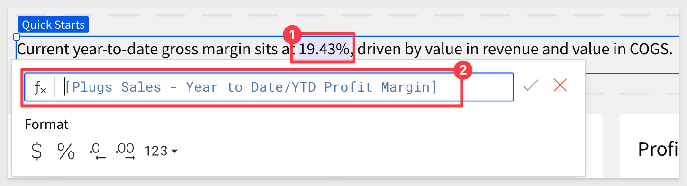

Now replace the other two instances of `value` with the correct values, using the summaries under the `Plugs Sales - Year to Date` table.

We now have a working example of dynamic text. 

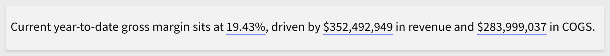

We can use the toolbar to change text size, colors and more.

To learn more about [Dynamic Text, click here.](https://help.sigmacomputing.com/docs/text-elements#add-dynamic-text-based-on-your-data)

### Add a logo
To wrap up this section, lets add a logo to the Dashboard.

Add another element to the Dashboard, using the `Element panel` > `IMAGE`.

Here is a sample image URL we can use:

```code
https://sigma-quickstarts-main.s3.us-west-1.amazonaws.com/shared_images/plugs_logo.png
```

Configure it as follows, using this sample image (or any other image you prefer):

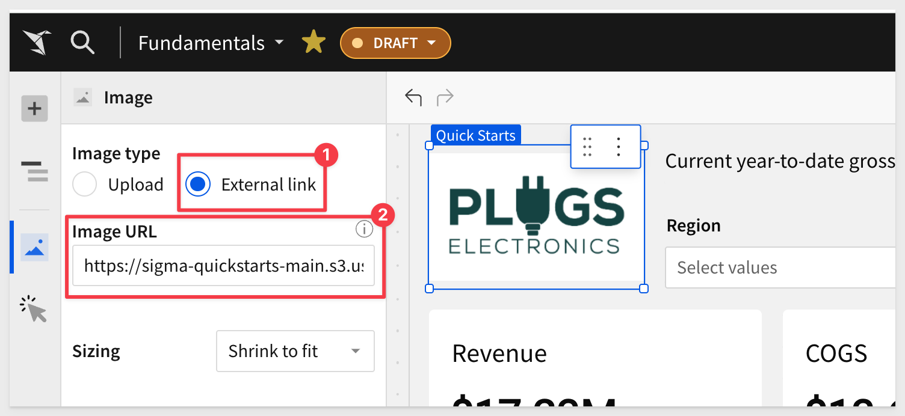

Click `Publish` and `Go to published version`.

After some repositioning of elements, our Dashboard should look something like this:

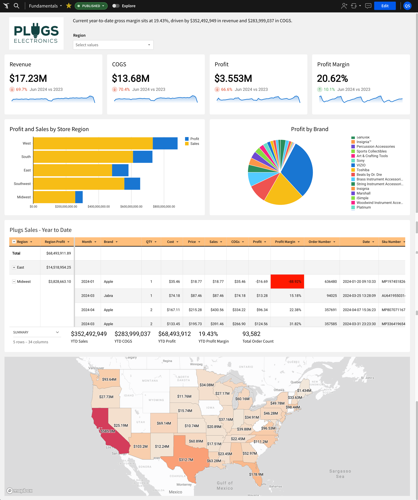

Click `Publish`.

## Workbook Styling
Now is a good time to pause and mention that Sigma workbooks can be stylized using `Themes`.

Sigma provides several preset themes we can just use right away. 

With a just a few clicks, we can change our workbook to a dark theme:

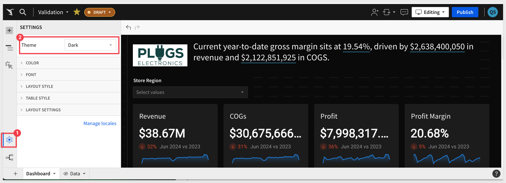

Administrators can set a default theme for all workbooks in an organization.

This is done in the `Administration` section of Sigma:

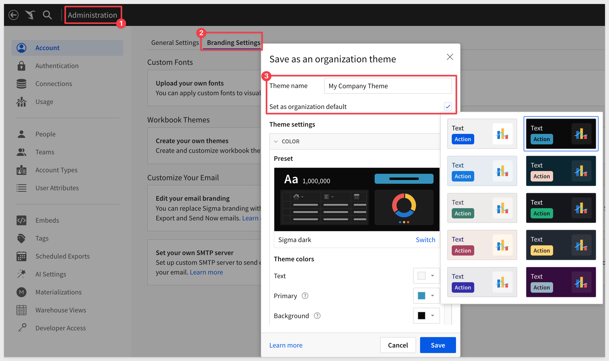

Creating custom themes is also supported.

[Read more about workbook themes here.](https://help.sigmacomputing.com/docs/create-and-manage-workbook-themes)

Sigma also supports [custom fonts](https://help.sigmacomputing.com/docs/custom-fonts) for workbooks, worksheet visualizations, and dashboards. Custom fonts can be uploaded at the organization level and used on any workbooks, worksheet visualizations, and dashboards in that organization.


<!-- END -->

## What we've covered
Duration: 5

In this QuickStart we learned how to use Sigma to create beautiful charts, KPIs, maps and more.

[Click here to move to the next QuickStart in this series.](https://quickstarts.sigmacomputing.com/guide/fundamentals-4-working-with-pivot-tables-v2/index.html)

**Additional Resource Links**

Be sure to check out all the latest developments at [Sigma's First Friday Feature page!](https://quickstarts.sigmacomputing.com/firstfridayfeatures/)

[Help Center Home](https://help.sigmacomputing.com)<br>
[Sigma Community](https://community.sigmacomputing.com/)<br>
[Sigma Blog](https://www.sigmacomputing.com/blog/)<br>
<br>

[](https://twitter.com/sigmacomputing)&emsp;
[](https://www.linkedin.com/company/sigmacomputing)&emsp;
[](https://www.facebook.com/sigmacomputing)


<!-- END OF WHAT WE COVERED -->
<!-- END OF QUICKSTART -->
