summary: Fundamentals for new users and Sigma Visualizations
id: fundamentals-3-working-with-visualizations
categories: fundamentals
status: Published
feedback link: https://github.com/sigmacomputing/sigmaquickstarts/issues
tags: default
authors: Phil Ballai - Sigma Computing
lastUpdated: 2023-07-19

# Fundamentals 3: Working with Visualizations

## Overview 
Duration: 5

This QuickStart is part of a series of QuickStarts designed to instruct new users how to use Sigma to explore and analyze data using Visualizations (Viz). Sigma supports a wide variety of types, and are adding others so be sure to check our documentation for the latest list:

<table>
    <thead>
        <tr>
            <th colspan="2"><strong>Supported Visualizations Types:</strong></th>
        </tr>
    </thead>
    <tbody>
        <tr>
            <td> 
              <ul>
                <li><strong>Area charts</strong></li>
                <li><strong>Bar charts</strong></li>
                <li><strong>Box and Whisker charts</strong></li>
                <li><strong>Combo chart</strong></li>                
                <li><strong>Donut / Pie charts</strong></li>
                <li><strong>Funnel charts</strong></li>
                <li><strong>Gauge charts</strong></li>
                <li><strong>Geography Map</strong></li>                
              </ul>
            </td>
            <td>
            <ul>
                <li><strong>KPI chart</strong></li>                
                <li><strong>Line charts</strong></li>
                <li><strong>Maps – by region, point (lat/long), or GeoJSON</strong></li>
                <li><strong>Point chart</strong></li>                
                <li><strong>Sankey</strong></li>                
                <li><strong>Scatter charts</strong></li>
                <li><strong>Single value visualizations</strong></li>
              </ul>
              </td>
        </tr>
    </tbody>
</table>

For the latest list of supported viz types, [click here.](https://help.sigmacomputing.com/docs/intro-to-visualizations)

This QuickStart assumes you have already taken the Fundamentals 1 & 2 QuickStarts, and are now familiar with Sigma’s user interface (UI). Given this, some steps are assumed to be known and may not be shown in detail. 

We will be working with some common sales data from our fictitious company ‘Plugs Electronics’. This data is provided to you automatically. We will look at sales data, but throughout the course of other QuickStarts will incorporate more sources from associated store, product, and customer data.

The other “Fundamental Series” QuickStarts explore topics such as working with tables, pivot tables, dashboards and more. We have broken these QuickStarts up so that they can be taken in any order you want, except the “Fundamentals 1: Getting Around” QuickStart should be taken first.

 ### Target Audience
Sigma combines with the unlimited power of the cloud data warehouse and the familiar feel of a spreadsheet; no limit on the amount of data you wish to analyze. Sigma is awesome for users of Excel and even better for customers who have millions of rows of data.

Typical audience for this QuickStart are users of Excel, common Business Intelligence or Reporting tools and semi-technical users who want to try out or learn Sigma. Everything is done in a browser so you already know how to use that. No SQL or technical skills are needed to do this QuickStart.

### Prerequisites
<ul>
  <li>A computer with a current browser. It does not matter which browser you want to use.</li>
  <li>Completion of the QuickStart “Fundamentals 1: Getting Around”</li>
  <li>Access to your Sigma environment. A Sigma trial environment is acceptable and preferred.</li>
  <li>If have not already, you can sign up for a Sigma Trial here:</li>
</ul>

<button>[Free Trial](https://www.sigmacomputing.com/free-trial/)</button>

<aside class="postive">
<strong>IMPORTANT:</strong><br> Sigma recommends that you use non-production resources when doing QuickStarts.
</aside>

### What You’ll Learn
Through this QuickStart we will walk through how to use Sigma to create beautiful charts and maps, changing configuration parameters to suit your needs.

### What You’ll Build
We will be working with some common sales data from our fictitious company ‘Plugs Electronics’. This data is provided to you automatically. 

We will build a Sigma workbook that looks like this:

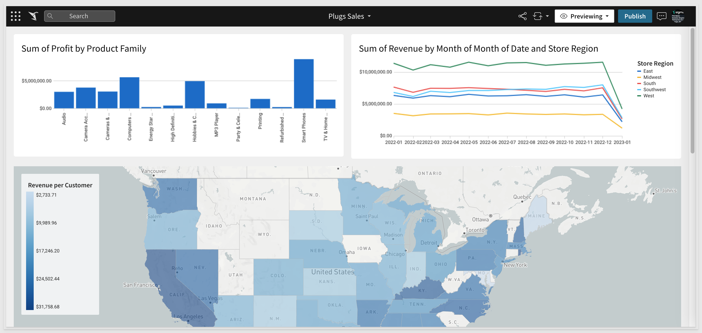


<!-- END OF OVERVIEW -->

## **Viz Basics**
Duration: 30

Our starting point is the “Plugs Sales” Workbook created in the “Fundamentals 2: Working with Tables” QuickStart. It is often easier to spot trends, outliers, or insights which lead to further questions when viewing data in a visualization.  Sigma makes it easy to create visualizations of your data while also enabling you to dig into the data that makes up that visualization.

In Sigma, open the Workbook `Plugs Sales` and place it in `edit mode`.

You should have the Page from the “Getting Around” QuickStart called “Data” already. If not, review that QuickStart to create it.

Create a `new Page` called `Viz`.

You are probably thinking we will use the Element Panel to add a Viz, (as we learned in the tables QuickStart) and we could do that, but let's try a different workflow.

Open the Workbook’s `Data Page`. Click on the icon as shown below and click `Create Child Element`. Select `Visualization` from the drop list.

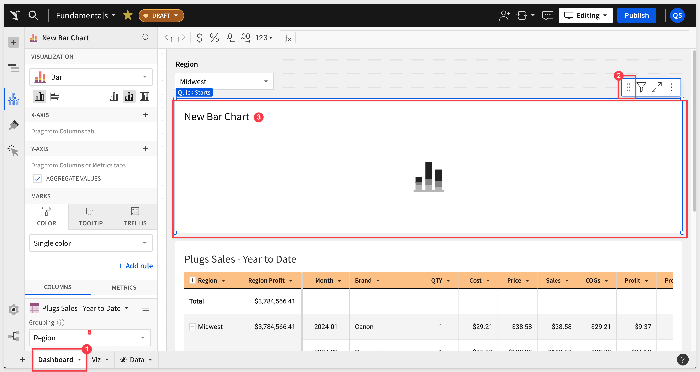

Sigma has created a new Page Element below the Table as an un-configured placeholder for the new Viz. This placeholder is a child of the table as it references everything in the parent table so it is now easy to build whatever Viz we want from that data. 

<aside class="positive">
<strong>NOTE:</strong><br> This is awesome because it means someone who knows the underlying data could make this table available with careful curation, and others could just use it. There are other ways to create curated datasets that you will learn later.
</aside>

We prefer that this new Viz is on its own page so click the `vertical dot menu` and select `Move to` and then click `Viz`. The Viz is now on the `Viz` page and it is open for us.

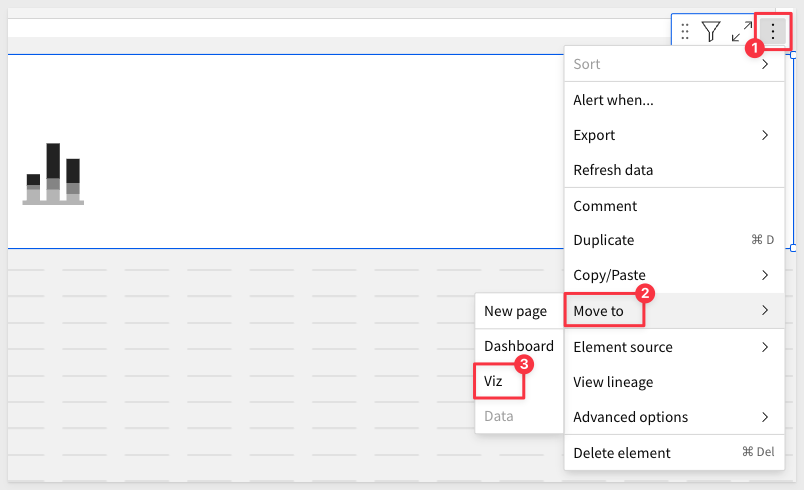

Let's make this bar chart reflect `Profits by Region`.

In the `Element Panel` click on the + of the `X-Axis` and select `Store Region` as below. Use the search feature when you have a large number of columns to save scrolling time:

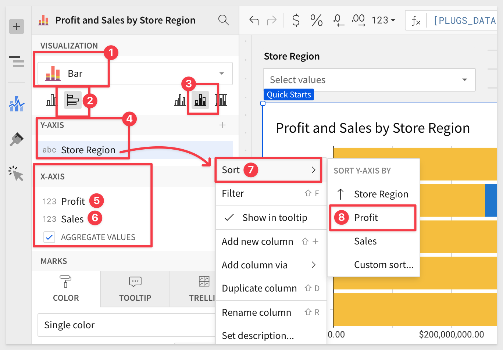

We can also **drag values onto the axis** instead of using the add button.  

Drag and drop the `Profit` column to the `Y-AXIS`.

We have our first Chart:

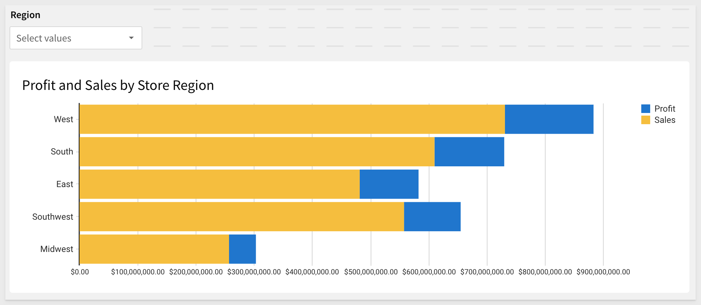

<aside class="negative">
<strong>NOTE:</strong><br> Sigma automatically summed the profit to create an aggregate.  You can change the type of aggregate at any time using the dropdown, or if you do not wish to aggregate the values you can uncheck the ‘Aggregate Values’ checkbox.
</aside>

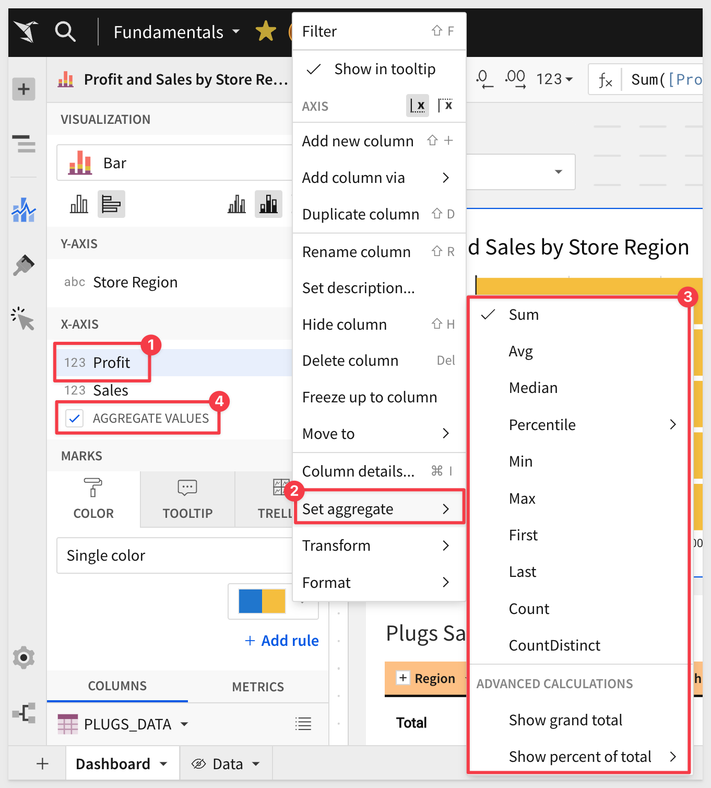

Now let's look at our profits over time to get an understanding of how we are trending. 

Another way to create a new chart is by selecting the `+ icon` on the top left panel next to the `Page Elements` title:

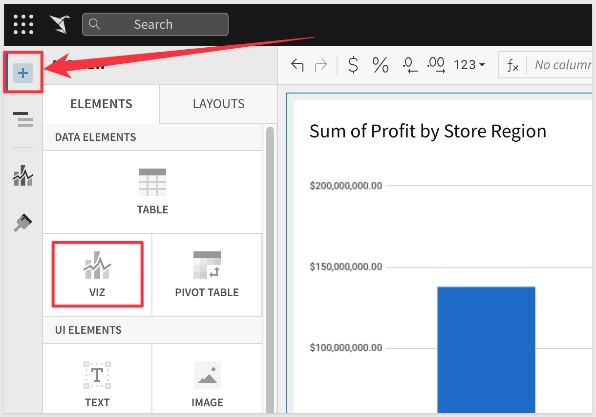

After selecting the ‘Viz’ icon, you will be prompted to select a source to use for that ‘Viz’.  

You can see tabs for selecting:

 <ul>
      <li><strong>In Use: </strong>Sources that are currently being used by other elements in the workbook.</li>
      <li><strong>New: </strong>A new source that could be a table, dataset, sql, or uploaded csv.</li>
      <li><strong>Page Elements: </strong>Any data elements already in the workbook such as the bar chart we created.<li>
</ul>

From the `Select Sources...` tab select `PAGE ELEMENTS` and `Data` Page and `PLUGS_ELECTRONICS_Hand...` as the desired source. You could have also used the `IN USE` tab if the source was already in use elsewhere in the workbook:

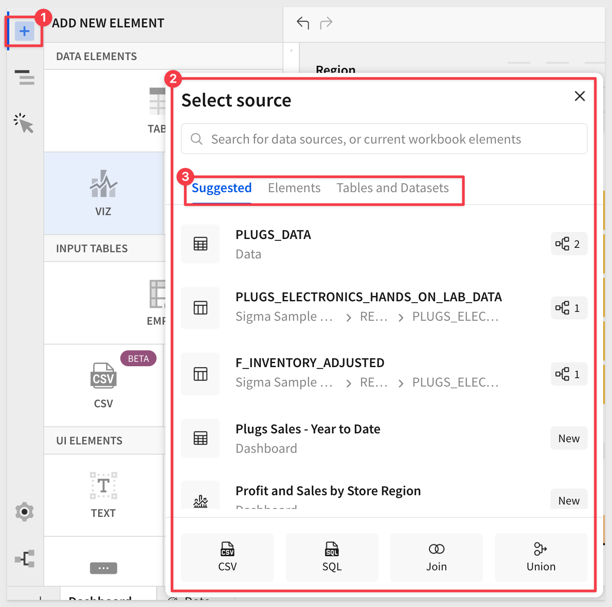

We now have a new chart below our bar chart. If like you can select the new Viz and use the hand control to drag the new Viz to be side by side with the bar chart:

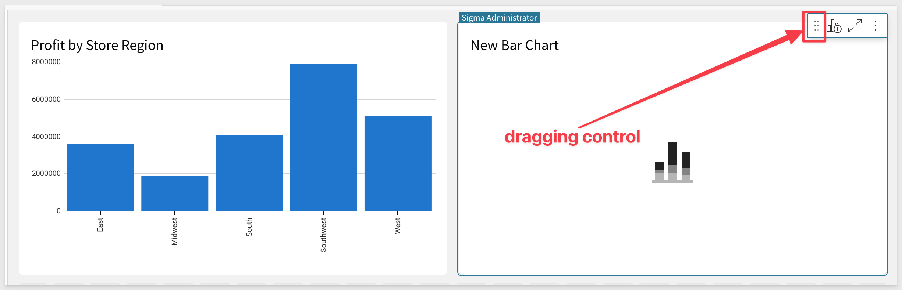

This time, using the Visualization dropdown, select a line chart. 

<aside class="negative">
<strong>NOTE:</strong> Make sure you have the new, empty chart selected. You don't want to change the first chart you made by accident.
</aside>

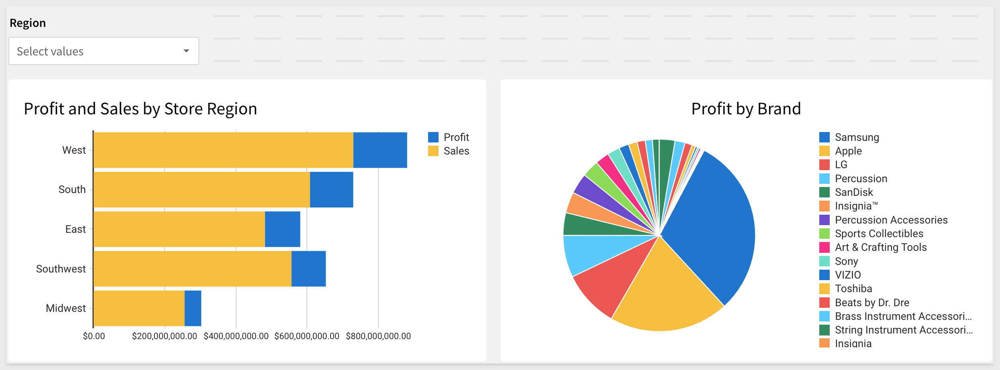

To create the line chart, the operations are the same as the bar chart, dragging and dropping (or selecting from the axis drop down menu) to select the data columns. 

Let's drag the `Date` column into the `X-Axis` and truncate it to `Month`:

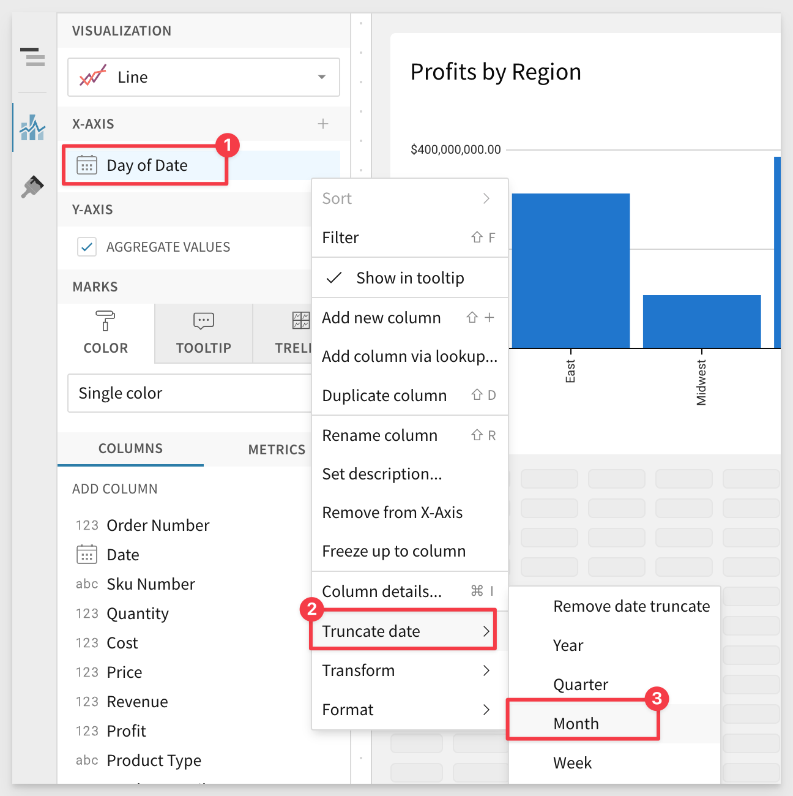

Next we can place our `Profit` column on the `Y-Axis` to see our profit over time. Again, Sigma has automatically applied aggregation (in this case, sum) to the monthly level.

The Line chart should look like this now:

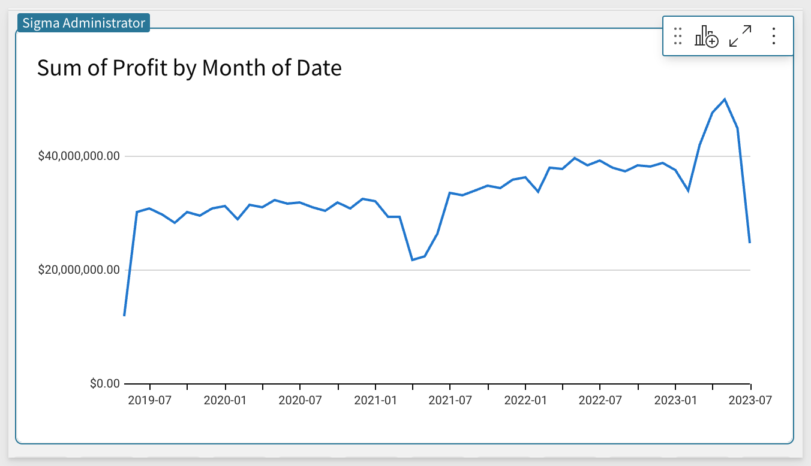

Taking this one step further, we can compare our different regions by placing `Store Region` on color.  You can do this by finding the `Store Region` column in the `Columns` tray and dragging it into the `Color tab` in the `Elements Panel`.

Rename the chart to `Profit by Month per Store Region`.

We now have a multi-line chart showing our Revenue over time by Store Region:

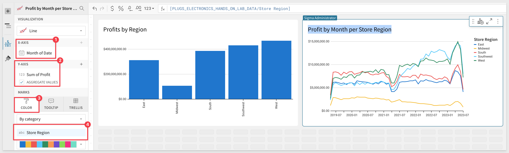


<!-- END OF VIZ BASICS -->

## **Maps**
Duration: 15

Geographic data can tell a powerful story. Whether analyzing regional trends or plotting sites, maps are packed with insights generated from your location data. Sigma Maps help contextualize geospatial information and provide greater understanding when analyzing data. With Sigma, you can create interactive maps using regions, latitude and longitude, or map paths and areas utilizing geoJSON.

 <ul>
      <li><strong>Region maps: </strong>Require a single text column on the map's REGION field. For example, you can use a column “US State” to distinguish between “regions” or states in this example</li>
      <li><strong>Point maps: </strong>Require a number column on both the map's LATITUDE and LONGITUDE fields. For example, you may want to show store locations on a map.</li>
      <li><strong>GeoJSON blobs: </strong>Allow for storage of more complex geographical data than simple numeric lat/long columns.<li>
</ul>

Add a `new Viz`to the ` Viz` page and set its source of data to the `Workbook Element / Plugs Sales / Data table`.

Change the `Visualization type` to `Map-Region`.

Set the Region to `Store State` and in the region type dropdown below, choose `US States`.

We now have a map that shows the data grouped by US-State:

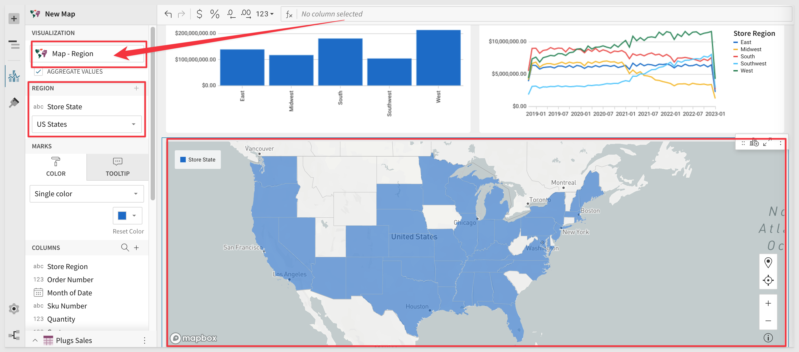

We can make this more useful by adding an additional grouping to make the high and low performing regions stand out visually. Let’s assume we want to see how each region is performing by revenue per customer. 	

Click the button in the upper right corner of the map to show the underlying data:

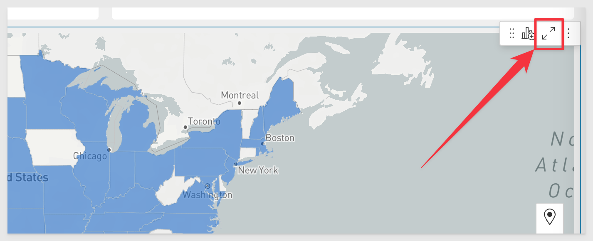

Notice that the underlying data is already grouped by US State. Add a `new column` called `Revenue per Customer`. 

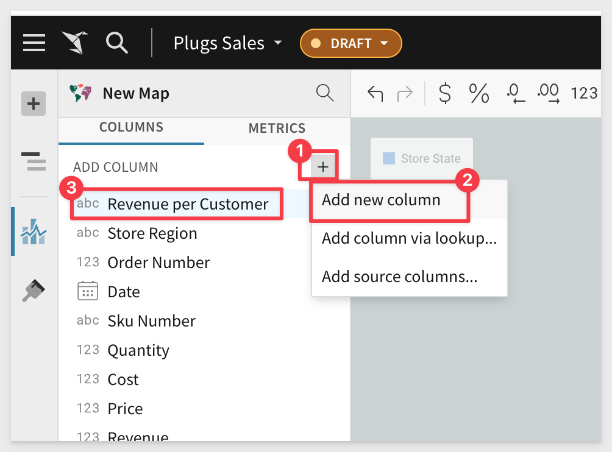

We want this column to calculate the total revenue for each unique customer so set the formula for this new column to:
```plaintext
Sum([Price]) / CountDistinct([Cust Key])
```

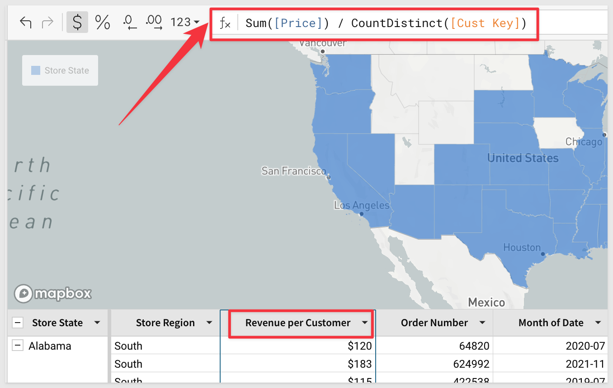

Add the new column `Revenue per Customer` to the `Map color scale` as shown, selecting "By scale" from the drop-list:

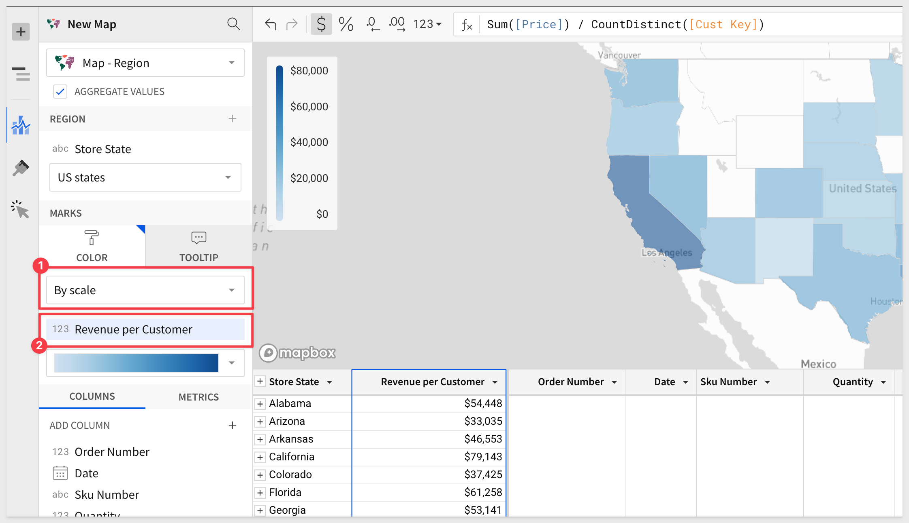

<aside class="negative">
<strong>NOTE:</strong><br> When you hover over each US-State, the States data value is shown for us. Right clicking on any State allows you to include/exclude it from the dataset or drill down to the underlying data. 
</aside>

<aside class="positive">
<strong>Drill Anywhere: </strong><br>The ability to drill anywhere did not have to be programmed ahead of time by a developer.
Unconstrained, ad-hoc analysis gives you the power to explore the data beyond what was originally intended and as you see fit.
</aside>

Right-click on `California` and `Keep only` California. Now we can work with only the California data. We can browse the data or duplicate it to create different views for our own analysis. 

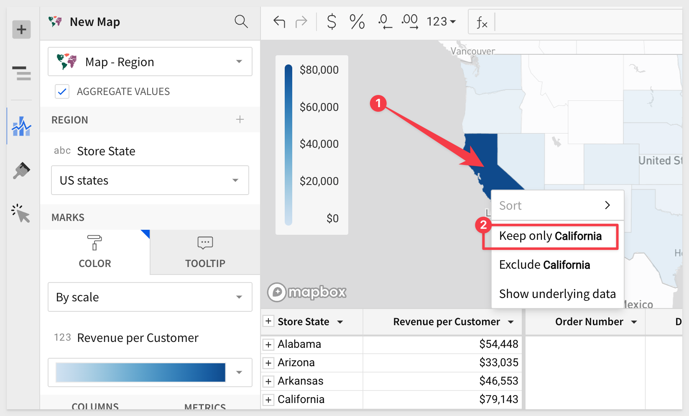

To revert the Map you can either click the `Back icon` on the control bar or delete the `Map Filter`:

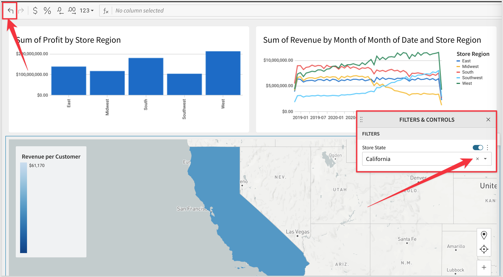


<!-- END OF MAPS -->

## **Single Value KPI**
Duration: 5

As you have seen, there are many different types of Viz available and they all follow the same basic workflow, so once you know how to do one, the others will seem obvious. 

For example, let's say we want a `Single Value KPI` that shows `Total Sales` at the top of the Page. Just use the same workflow to add a new Viz, set its data source and change the Viz type to Single Value. 

From there you want to add `Revenue` to the value. It will automatically be named `Sum of Revenue`, but we can rename it `Total Sales` instead. 

If the data is not formatted as currency, you can easily change it and truncate the trailing decimals for a cleaner look.

We have done all this before on the bar and line charts, so you already know how. Sigma is designed from the ground up to be as easy as 1-2-3!

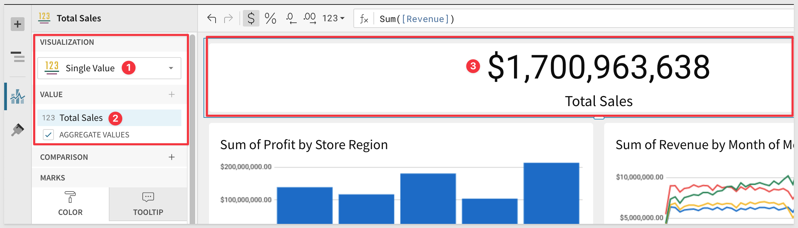

There are many configuration options for charts that can be accessed by clicking on the `paintbrush` icon:

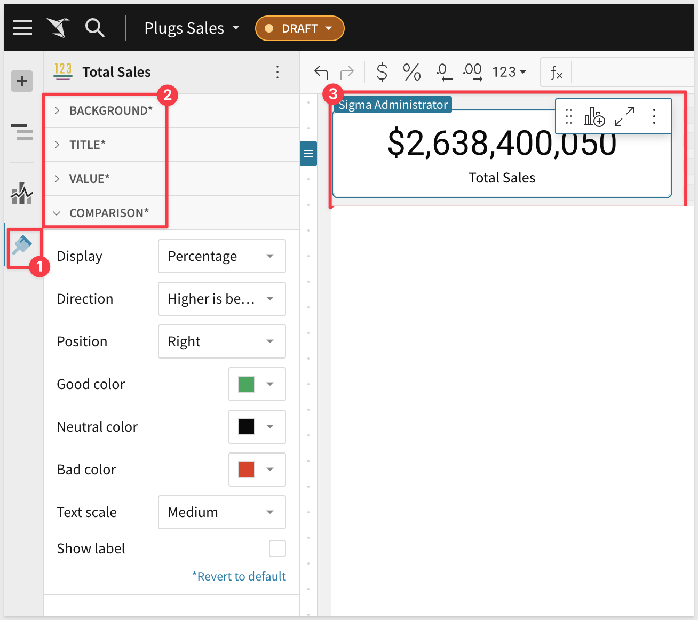

Add as many KPI as you like; for example, total profit, total order count and Total COGs would be good to add.

If you are interested in having a KPI that also shows trend data, [checkout the KPI Chart viz](https://help.sigmacomputing.com/docs/build-a-kpi-chart)


<!-- END OF KPI -->

## What we've covered
Duration: 5

In this QuickStart we learned how to use Sigma to create beautiful charts and maps and how to make configuration changes to the Elements to obtain the desired results.

[Click here to move to the next QuickStart in this series.](https://quickstarts.sigmacomputing.com/guide/fundamentals-4-working-with-pivot-tables/index.html)

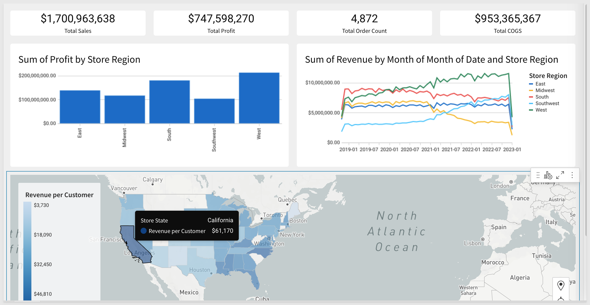

**Additional Resource Links**

Be sure to check out all the latest developments at [Sigma's First Friday Feature page!](https://quickstarts.sigmacomputing.com/firstfridayfeatures/)

[Help Center Home](https://help.sigmacomputing.com)<br>
[Sigma Community](https://community.sigmacomputing.com/)<br>
[Sigma Blog](https://www.sigmacomputing.com/blog/)<br>
<br>

[](https://twitter.com/sigmacomputing)&emsp;
[](https://www.linkedin.com/company/sigmacomputing)&emsp;
[](https://www.facebook.com/sigmacomputing)


<!-- END OF WHAT WE COVERED -->
<!-- END OF QUICKSTART -->
