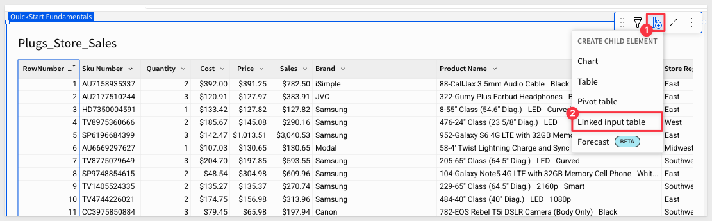
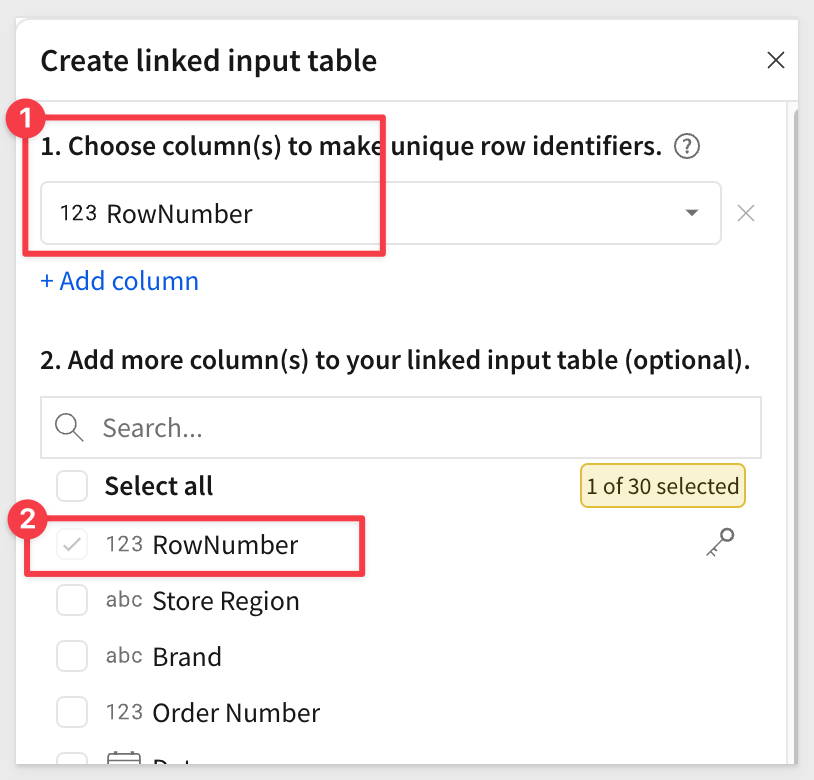
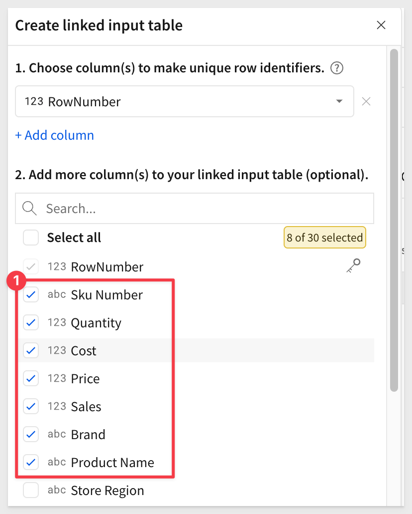
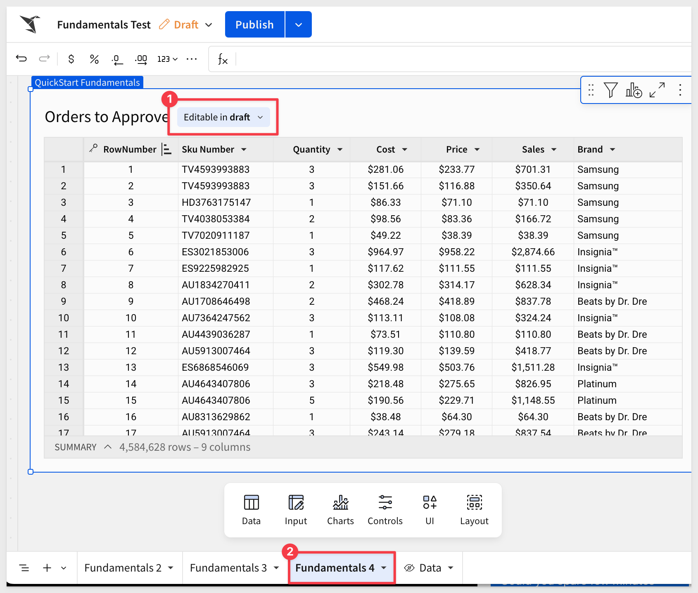
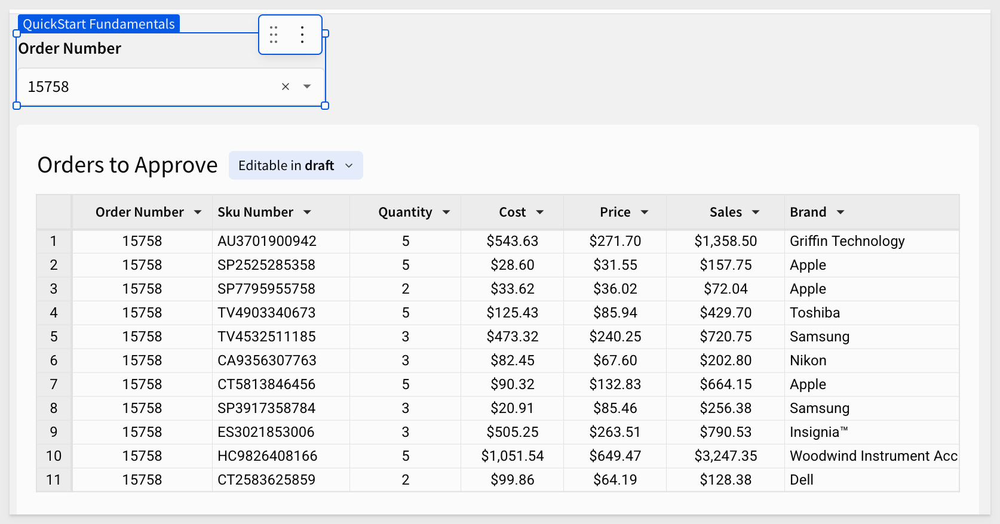

author: pballai
summary: fundamentals_4_input_v3
id: fundamentals_4_input_v3
categories: fundamentals
status: Published
feedback link: https://github.com/sigmacomputing/sigmaquickstarts/issues
tags: default
authors: PhilB
lastUpdated: 2025-03-13

# Fundamentals 4: Input
<!-- ------------------------ -->

## Overview 
Duration: 5

This QuickStart is part of a series of QuickStarts designed to instruct new users how to use Sigma.

The main goal of this QuickStart is to introduce input tables, explore some of the key features, and get you thinking about how you may use them in your business.

There is a dedicated [QuickStart](https://quickstarts.sigmacomputing.com/guide/input_tables_use_cases/index.html?index=..%2F..index#5) on input tables that covers several different use cases like Forecast Adjustment, Territory Planning and Data Collection.

To get the latest information on input tables, see [Intro to input tables](https://help.sigmacomputing.com/docs/intro-to-input-tables#how-input-table-data-is-handled)

<aside class="positive">
<strong>IMPORTANT:</strong><br> This QuickStart assumes you have already taken the QuickStart Fundamentals 1 and 2, and are now generally familiar with Sigma. Given this, some steps are assumed to be known and may not be shown in detail.
</aside>

<aside class="positive">
<strong>IMPORTANT:</strong><br> Some screens in Sigma may appear slightly different from those shown in QuickStarts. This is because Sigma is continuously adding and enhancing functionality. Rest assured, Sigma’s intuitive interface ensures that any differences will not prevent you from successfully completing any QuickStart.
</aside>

For more information on Sigma's product release strategy, see [Sigma product releases.](https://help.sigmacomputing.com/docs/sigma-product-releases)

If something is not working as you expect, here is how to [contact Sigma support.](https://help.sigmacomputing.com/docs/sigma-support)

<aside class="positive">
<strong>IMPORTANT:</strong><br> Some features may carry the "Beta" tag. Beta features are subject to quick, iterative changes. As a result, the latest product version may differ from the contents of this document.
</aside>

 ### Target Audience
Typical audience for this QuickStart are users of Excel, common Business Intelligence or Reporting tools and semi-technical users who want to try out or learn Sigma. Everything is done in a browser so you already know how to use that. No SQL or technical skills are needed to do this QuickStart.

### Prerequisites
<ul>
  <li>A computer with a current browser. It does not matter which browser you want to use.</li>
  <li>Completion of the QuickStart “Fundamentals 1: Getting Around”</li>
  <li>Completion of the QuickStart “Fundamentals 2: Data”</li>
  <li>Access to your Sigma environment. A Sigma trial environment is acceptable and preferred.</li>
  <li>If you have not already, you can sign up for a Sigma Trial here:</li>
</ul>

<button>[Free Trial](https://www.sigmacomputing.com/free-trial/)</button>

<aside class="positive">
<strong>IMPORTANT:</strong><br> Sigma recommends using non-production resources when completing QuickStarts.
</aside>


<!-- END OF OVERVIEW -->

## What is an Input Table?
At first glance, an input table can look a lot like a standard table, but they are so much more than that.

Input tables are dynamic workbook elements that support structured data entry. 

They allow you to integrate new data points into your analysis and augment existing data from your warehouse to capture critical data at the point of knowledge; the user.

Sigma supports three types of input tables today:

- Empty: Exactly what it says; you configure everything, and you know the column names/types that are required.
- Linked: Based on another workbook table, selecting only columns of interest.
- CSV: Import data from a standard comma-delimited file. Columns are named manually or created from the CSV header.

Input tables can be used as sources for tables, pivot tables, and visualizations, or incorporate data using lookups and joins. 

When you create warehouse views for input tables, you can reuse the manually entered data across your broader data ecosystem.

Since input tables provide the opportunity for more interactivity, we cover some of that in a later Fundamentals QuickStart using forms.

If you are after an even more sophisticated example of input tables in action, see [Approvals](https://quickstarts.sigmacomputing.com/guide/dataapps_approvals_flow/index.html?index=..%2F..index#1)


<!-- END OF SECTION -->

## Our First Input Table
Duration: 5

Return to the `Fundamentals` workbook and add a new page. Rename the page to `Fundamentals 4`.

Open the `Data` page where our `Plugs_Store_Sales` source data is located. 

### Unique Key
It is often useful to create a key that uniquely identifies any single row of data in a table. In the case of our `Plugs_Store_Sales` table, we can't use `Order Number` because there are many orders that have more than one `SKU` on them. 

There are several ways to create this "row uniqueness" in Sigma. The very simplest way is to use the [Row Number]() function.

Add a new column, and set the formula to:
```code
RowNumber(https://help.sigmacomputing.com/docs/rownumber#syntax)
```

Now we have a value that is unique for every row.

There are a few ways to place an input table in the page.

One way is to just drag and drop one from the `Element bar` > `Input` group.

In our case, it is faster to create it directly from the `Plugs_Store_Sales` table, since that is the "link" we wish to create.

Create a `Linked Input Table` from the `PLUGS_ELECTRONICS_HANDS_ON_LAB_DATA` table.



We must select a column to be the unique "connection" between the two tables.

Select the `Row Number` column as the unique row identifier.



Then we need to select the other columns that we want to appear in the linked input table.

To make things cleaner, let's select the columns that are not really needed for this demonstration and leave only the ones shown in the screenshot below. (Yes, we reordered the columns in the `Plugs_Store_Sales` table so it was more clear in this step).

<aside class="negative">
<strong>NOTE:</strong><br> You may notice some column formatting and reordering in the screenshots. We will not specifically cover this, as it is assumed you are familiar with making these adjustments. Additionally, it is not essential for the functionality of this workflow.
</aside>



Click `Create input table`.

Rename the input table to `Orders to Approve`.

Move the new input table to the `Fundamentals 4`

The `Fundamentals 4` page now looks like this:



Notice that the linked input table ("input table") indicates that it is `Editable in draft`. Who can edit input table data and under what circumstances is a detailed topic that is too broad to cover here.

For information on the rules surrounding input table edits, see [Edit existing input table columns](https://help.sigmacomputing.com/docs/edit-existing-input-table-columns)

For information on data entry permissions and governance, see [Configure data governance options in input tables](https://help.sigmacomputing.com/docs/configure-data-governance-options-in-input-tables)

For this QuickStart, we will work in draft mode. 


<!-- END OF SECTION-->

## Some Basics
Duration: 5

Hide the `Row Number` column. We can still reference it if needed, but users don't need to see it.

With our sample data in place, we want to give the user a way to target a specific order number.

We just realized that the `Order Number` column was one we needed. 

Click on the icon (#1 in the screenshot), and add the `Order Number` column:


Using the `Order Number` column, create a filter and `Change filter type` to `List`:


Then convert it to a `Page control`:


We can adjust the `Order Number` control as shown to clean things up to our preferences:


Selecting `Order number` > `15758` filters the input table just like it would a standard table or pivot table too. It also demonstrates that one order can have many `Sku Numbers`.



### Tracking who made changes
All input tables include two optional row history columns. Add these by clicking on the + icon and selecting `Last updated at` and `Last updated by`. 


<aside class="negative">
<strong>NOTE:</strong><br> These columns will be empty since no edits have been made yet.
</aside>

### Adding comments
Add a new `Text` column next to `Sales`:


Rename it to `Comments`.

Now simply add some information for any row(s) you like.


As each comment is added to a row, Sigma has saved that information automatically to the warehouse, based on the connection that the input table was configured to use. 

At the same time, the tracking fields were updated.

Input table data is maintained separately from the "original source data"--Plugs_Store_Sales, so that the integrity of your data in the warehouse is maintained.

No data was stored in Sigma; your data stays in your warehouse.

**Now that is incredibly cool!**


<!-- END OF SECTION-->

## CSV Import
Duration: 5

It is really simple to create an input table from a CSV file. Once imported, the input table can be edited directly, joined to other tables, used as source for other Sigma elements and participate in complex workflows using actions. 

<aside class="positive">
<strong>IMPORTANT:</strong><br>At the time of this QuickStart, CSV import data supports a maximum of 200 MB and UTF-8 file format only.
</aside>

To demonstrate, we can download some sample data using this button:

<button>[Sample CSV File](https://sigma-quickstarts-main.s3.us-west-1.amazonaws.com/csv/sample_tradeshow_leads.csv)</button>

The file is named `sample_tradeshow_leads.csv`.

On the `Fundamentals 4` page, add a new `Input` element > `CSV` from the `Element bar`.

Set the `Connection` to the `Sigma Sample Database` and browse to locate the sample csv we downloaded (likely in the `Downloads` folder...). 

Sigma will import that data, parse it, and display it:


Click `Save`.


After renaming the input table, we can start working with the data directly just like any other input table. 


<!-- END OF SECTION-->

## What we've covered
Duration: 5

In this QuickStart, we covered why you might use a pivot table, how to use Sigma to create one, add conditional formatting, and drill down on table data.

The next QuickStart in this series covers using [charts in Sigma](https://quickstarts.sigmacomputing.com/guide/fundamentals_5_charts_v3/index.html?index=..%2F..index#0)

**Additional Resource Links**

Be sure to check out all the latest developments at [Sigma's First Friday Feature page!](https://quickstarts.sigmacomputing.com/firstfridayfeatures/)

[Help Center Home](https://help.sigmacomputing.com)<br>
[Sigma Community](https://community.sigmacomputing.com/)<br>
[Sigma Blog](https://www.sigmacomputing.com/blog/)<br>
<br>

[](https://twitter.com/sigmacomputing)&emsp;
[](https://www.linkedin.com/company/sigmacomputing)&emsp;
[](https://www.facebook.com/sigmacomputing)


<!-- END OF WHAT WE COVERED -->
<!-- END OF QUICKSTART -->