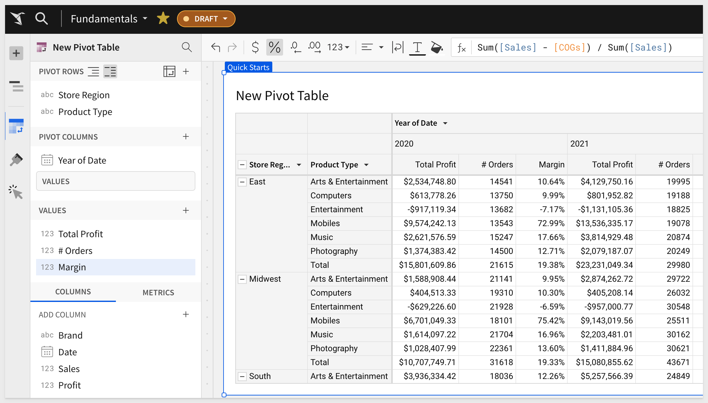

summary: QuickStart for new users and Sigma Pivot Tables
id: fundamentals-4-working-with-pivot-tables-v2
categories: fundamentals
status: Published
feedback link: https://github.com/sigmacomputing/sigmaquickstarts/issues
tags: default
authors: PhilB
lastUpdated: 2023-03-29

# Fundamentals 4: Working with Pivot Tables v2
<!-- ------------------------ -->

## Overview 
Duration: 5

This QuickStart is part of a series of QuickStarts designed to instruct new users how to use Sigma to explore and analyze data using pivot tables.

Through this QuickStart we will walk through why use a Pivot Table, how to use Sigma to create one adding conditional formatting and drilling down on table data.

We will be working with some common sales data from our fictitious company `Plugs Electronics`, reusing content we created in the QuickStart [Fundamentals 1: Getting Around.](https://quickstarts.sigmacomputing.com/guide/fundamentals-1-getting-around-v2/index.html?index=..%2F..index#0)

<aside class="positive">
<strong>IMPORTANT:</strong><br> This QuickStart assumes you have already taken the QuickStart Fundamentals 1 and 2, and are now generally familiar with Sigma. Given this, some steps are assumed to be known and may not be shown in detail.
</aside>

 ### Target Audience
Sigma combines with the unlimited power of the cloud data warehouse and the familiar feel of a spreadsheet; no limit on the amount of data you wish to analyze. Sigma is awesome for users of Excel and even better for customers who have millions of rows of data.

Typical audience for this QuickStart are users of Excel, common Business Intelligence or Reporting tools and semi-technical users who want to try out or learn Sigma. Everything is done in a browser so you already know how to use that. No SQL or technical skills are needed to do this QuickStart.

### Prerequisites
<ul>
  <li>A computer with a current browser. It does not matter which browser you want to use.</li>
  <li>Completion of the QuickStart “Fundamentals 1: Getting Around”</li>
  <li>Access to your Sigma environment. A Sigma trial environment is acceptable and preferred.</li>
  <li>If have not already, you can sign up for a Sigma Trial here:</li>
</ul>

<button>[Free Trial](https://www.sigmacomputing.com/free-trial/)</button>

<aside class="postive">
<strong>IMPORTANT:</strong><br> Sigma recommends that you use non-production resources when doing QuickStarts.
</aside>


<!-- END OF OVERVIEW -->

## Pivot Table Defined
Duration: 10

It is important to understand what a Pivot Table **(Pivot)** is and how it is different from a typical table that might use grouping to provide the desired result set.

A Pivot Table is an interactive way to quickly **summarize** large amounts of data. You can use a Pivot Table to analyze numerical data in detail, and answer unanticipated questions about your data. A Pivot Table is especially designed for:

 <ul>
      <li>Querying large amounts of data in a user-friendly way.</li>
      <li>Subtotaling and aggregating numeric data, summarizing data by categories and subcategories, and creating custom calculations and formulas.</li>
      <li>Expanding and collapsing levels of data to focus your results, and drilling down to details from the summary data for areas of interest to you.</li>
      <li>Moving rows to columns or columns to rows (or "pivoting") to see different summaries of the source data.</li>
      <li>Presenting concise, attractive, and annotated online or printed reports.</li>
</ul>

Tables tend to provide a flat organization of the data, although grouping and other features can make less obvious to users who are unfamiliar with the differences. 

It is important to understand that a strong case can be made to use tables instead of pivots. A discussion of this is outside the scope of a fundamentals QuickStart, but if you are interested, review the Sigma community post, [Best practice 1](https://community.sigmacomputing.com/docs?topic=3285) for that information. 

Lets assume we want to look at a breakdown of Profit, Margin and Order quantities by Store Region, Product type and month.

We have the required columns in our `PLUGS_DATA` table and could **possibly** satisfy the requirement by grouping the data but the end result will not be easy for the viewer to interpret and they may have to make multiple clicks to orient the table to suit their interests. 


The grouped output of this may look something like this and you can easily see how the consumer may be frustrated:


Let's create a Pivot instead.


<!-- END OF PIVOT TABLE BASICS -->

## Creating a Pivot Table
Duration: 10

In Sigma, open the workbook `Fundamentals` and place it in edit mode. We should still have the Page tab called `Data` that has the `PLUGS_DATA` table on it. 

Add a `New page` and name it `Pivot Table`. 

Add a new element, `PIVOT TABLE` and select the `PLUGS_DATA` table on the `Data` page as its source.


Drag the `Store Region` column to `PIVOT ROWS` in the element panel:


Do the same with `Product Type`:


At this point, `Product Type` is nested under `Store Region`. 

Click this icon (#1 in image below) to switch to columnar instead:


Add `Date` to the `PIVOT COLUMNS` section in the element panel.

Sigma warns us that there more than 1,000 columns and we need to filter to reduce the number. This makes sense as the `Day` column needs to be a period of time like month, quarter or year.


Lets adjust the `Day of Date` pivot column to `year` by using the `DateTrnuc` function:
``` code
DateTrunc("year", [Date])
```


Sigma has also provided all the most common functions (ie: write the function for you!) as menu options off of a column, so you could have just applied that too:


Our pivot table now looks like this:


Add the `Profit` and `Order Number` columns to `VALUES`.

We need to set the aggregation method on the `Order Number` column to `CountDistinct`:


Rename these `VALUE` columns to `Total Profit` and `# Orders`.

Our pivot table now looks like this:


### Missing Columns
We want to include `Margin` in this pivot, but it does not exist in our `PLUGS_DATA` table.

Click the `+` icon in the element panel > `VALUES` and search for `Mar`; no columns exist so we can click `Add new column`:


<aside class="positive">
<strong>IMPORTANT:</strong><br> New columns are not written into the cloud data warehouse. These new columns are metadata that Sigma automatically manages for you and are typically used for calculations and transformations of existing warehouse columns.
</aside>

Set the formula to:
```code
Sum([Sales] - [COGS]) / Sum([Sales])
```

Rename the new column to `Margin` and set it to `Percentage (%)`:



Our pivot table now looks like this:


<!-- END OF DRILL ANYWHERE  -->

## Drill Anywhere
Duration: 10

The presentation of the pivot is just the starting point for the user who most likely cares about spotting problems or trends and taking action. 

Sigma allows users to access all the data they are permitted to see, so they get to use their business knowledge, unconstrained by the analytics.

In the pivot table `right click` on `East` > `Mobiles` cell and select `Drill down`:


On the `Drill down` modal, select `Brand`:


`Brand` is added to the pivot table and we can see sales figures accordingly. 

We might want to see the most recent year first. That is simple enough. 

Click on the `Year of Date` > `Year (ie: 2020)` and select sort and descending.


We also want to sort `Brand` by `Total Profit` so we can more easily see the bottom dwellers:


Now it is plainly clear which vendors are performing poorly:


The action of drilling down on `Brand` added the column as a pivot row (#1 in the image below). We can keep that or remove it just as easily using the `Brand's` column menu.

The drill down action also created two filters that we can keep, or disable as shown below (#2-#4). 


<aside class="negative">
<strong>NOTE:</strong><br> Two filters were created since we selected Mobiles in the East region so both were added as filters.
</aside>

Our pivot table now looks like this **(after disabling the two filters)**:


<!-- END OF DRILL ANYWHERE  -->


## Conditional Formatting
Duration: 5


<!-- END -->

## What we've covered
Duration: 5

In this QuickStart we covered why you might use a Pivot Table, how to use Sigma to create one adding conditional formatting and drilling down on table data.

**Additional Resource Links**

Be sure to check out all the latest developments at [Sigma's First Friday Feature page!](https://quickstarts.sigmacomputing.com/firstfridayfeatures/)

[Help Center Home](https://help.sigmacomputing.com)<br>
[Sigma Community](https://community.sigmacomputing.com/)<br>
[Sigma Blog](https://www.sigmacomputing.com/blog/)<br>
<br>

[](https://twitter.com/sigmacomputing)&emsp;
[](https://www.linkedin.com/company/sigmacomputing)&emsp;
[](https://www.facebook.com/sigmacomputing)


<!-- END OF WHAT WE COVERED -->
<!-- END OF QUICKSTART -->
