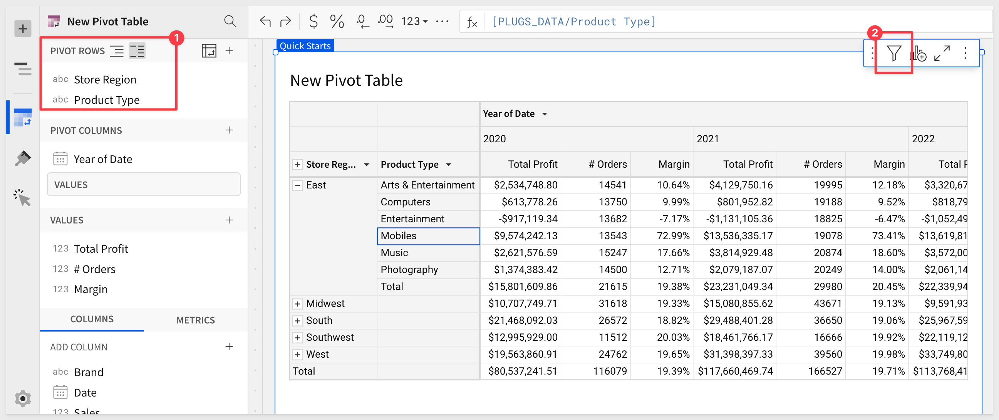

summary: QuickStart for new users and Sigma Pivot Tables
id: fundamentals-4-working-with-pivot-tables-v2
categories: fundamentals
status: hidden
feedback link: https://github.com/sigmacomputing/sigmaquickstarts/issues
tags: default
authors: PhilB
lastUpdated: 2023-03-29

# Fundamentals 4: Working with Pivot Tables v2
<!-- ------------------------ -->

## Overview 
Duration: 5

This QuickStart is part of a series of QuickStarts designed to instruct new users how to use Sigma to explore and analyze data using pivot tables.

Through this QuickStart, we will walk through why to use a pivot table, how to use Sigma to create one, adding conditional formatting, and drilling down on table data.

We will be working with some common sales data from our fictitious company `Plugs Electronics`, reusing content we created in the QuickStart [Fundamentals 1: Getting Around.](https://quickstarts.sigmacomputing.com/guide/fundamentals-1-getting-around-v2/index.html?index=..%2F..index#0)

<aside class="positive">
<strong>IMPORTANT:</strong><br> This QuickStart assumes you have already taken the QuickStart Fundamentals 1 and 2, and are now generally familiar with Sigma. Given this, some steps are assumed to be known and may not be shown in detail.
</aside>

 ### Target Audience
Sigma combines with the unlimited power of the cloud data warehouse and the familiar feel of a spreadsheet; no limit on the amount of data you wish to analyze. Sigma is awesome for users of Excel and even better for customers who have millions of rows of data.

Typical audience for this QuickStart are users of Excel, common Business Intelligence or Reporting tools and semi-technical users who want to try out or learn Sigma. Everything is done in a browser so you already know how to use that. No SQL or technical skills are needed to do this QuickStart.

### Prerequisites
<ul>
  <li>A computer with a current browser. It does not matter which browser you want to use.</li>
  <li>Completion of the QuickStart “Fundamentals 1: Getting Around”</li>
  <li>Access to your Sigma environment. A Sigma trial environment is acceptable and preferred.</li>
  <li>If have not already, you can sign up for a Sigma Trial here:</li>
</ul>

<button>[Free Trial](https://www.sigmacomputing.com/free-trial/)</button>

<aside class="postive">
<strong>IMPORTANT:</strong><br> Sigma recommends that you use non-production resources when doing QuickStarts.
</aside>


<!-- END OF OVERVIEW -->

## Pivot Table Defined
Duration: 10

It is important to understand what a pivot table is and how it differs from a typical table that might use grouping to provide the desired result set.

A pivot table is an interactive way to quickly summarize large amounts of data. You can use a pivot table to analyze numerical data in detail and answer unanticipated questions about your data. A pivot table is especially designed for:

 <ul>
      <li>Querying large amounts of data in a user-friendly way.</li>
      <li>Subtotaling and aggregating numeric data, summarizing data by categories and subcategories, and creating custom calculations and formulas.</li>
      <li>Expanding and collapsing levels of data to focus your results, and drilling down to details from the summary data for areas of interest to you.</li>
      <li>Moving rows to columns or columns to rows (or "pivoting") to see different summaries of the source data.</li>
      <li>Presenting concise, attractive, and annotated online or printed reports.</li>
</ul>

Tables tend to provide a flat organization of the data, although grouping and other features can make less obvious to users who are unfamiliar with the differences. 

It is also important to understand that a strong case can be made to use tables instead of pivots. A discussion of this is outside the scope of a fundamentals QuickStart, but if you are interested, review the Sigma community post, [Best practice 1](https://community.sigmacomputing.com/docs?topic=3285) for that information.


<!-- END OF PIVOT TABLE BASICS -->

## Use Case
Lets assume we want to look at a breakdown of Profit, Margin and Order quantities by Store Region, Product type and month.

We have the required columns in our `PLUGS_DATA` table and could **possibly** satisfy the requirement by grouping the data but the end result will not be easy for the viewer to interpret and they may have to make multiple clicks to orient the table to suit their interests. 


The grouped output of this may look something like this and you can easily see how the consumer may be frustrated:


Let's create a pivot table instead.


<!-- END OF PIVOT TABLE BASICS -->

## Creating a Pivot Table
Duration: 10

In Sigma, open the workbook `Fundamentals` and place it in edit mode. We should still have the page called `Data` that has the `PLUGS_DATA` table on it. 

Add a `New page` and rename it `Pivot Table`. 

Add a new element, `PIVOT TABLE` and select the `PLUGS_DATA` table from the `Data` page as its source.


Drag the `Store Region` column to `PIVOT ROWS` in the element panel:


Do the same with `Product Type`:


At this point, `Product Type` is nested under `Store Region`. 

Click this icon (#1 in image below) to switch to columnar instead:


Add `Date` to the `PIVOT COLUMNS` section in the element panel.

Sigma warns us that there more than 1,000 columns; we need to filter to reduce the number. This makes sense as we are currently using the `Day of Date` column. This needs to be a period of time like month, quarter or year.


Lets adjust the `Day of Date` pivot column to `year` by using the `DateTrnuc` function:
``` code
DateTrunc("year", [Date])
```


Sigma has also provided all the most common functions (ie: write the function for you!) as menu options off of a column, so you could have just applied that too:


Our pivot table now looks like this:


Add the `Profit` and `Order Number` columns to `VALUES`.

We need to set the aggregation method on the `Order Number` column to `CountDistinct`:


Rename these `VALUE` columns to `Total Profit` and `# Orders`.

Our pivot table now looks like this:


### Missing Columns
We want to include `Margin` in this pivot, but it does not exist in our `PLUGS_DATA` table.

Click the `+` icon in the element panel > `VALUES` and search for `Mar`; no columns exist so we can click `Add new column`:


<aside class="positive">
<strong>IMPORTANT:</strong><br> New columns are not written into the cloud data warehouse. These new columns are metadata that Sigma automatically manages for you and are typically used for calculations and transformations of existing warehouse columns.
</aside>

Set the formula to:
```code
Sum([Sales] - [COGS]) / Sum([Sales])
```

Rename the new column to `Margin` and set it to `Percentage (%)`.

Our pivot table now looks like this:


<!-- END OF DRILL ANYWHERE  -->

## Drill Anywhere
Duration: 10

The presentation of the pivot is just the starting point for the user who most likely cares about spotting problems or trends and taking action. 

Sigma allows users to access all the data they are permitted to see, so they get to use their business knowledge, unconstrained by the analytics.

In the pivot table `right click` on `East` > `Mobiles` cell and select `Drill down`:


On the `Drill down` modal, select `Brand`:


`Brand` is added to the pivot table and we can see sales figures accordingly. 

We might want to see the most recent year first. That is simple enough. 

Click on the `Year of Date` > `Year (ie: 2020)` and select sort and descending (down arrow):


We also want to sort `Brand` by `Total Profit`, so we can more easily see the bottom dwellers:


Now it is plainly clear which vendors are performing poorly:


The action of drilling down on `Brand` added the column as a pivot row (#1 in the image below). We can keep that or remove it just as easily using the `Brand's` column menu.

The drill down action also created two filters that we can keep, or disable as shown below (#2-#4). 


<aside class="negative">
<strong>NOTE:</strong><br> Two filters were created since we selected Mobiles in the East region so both were added as filters.
</aside>

Our pivot table now looks like this **(after disabling the two filters)**:




<!-- END OF DRILL ANYWHERE  -->


## Customization / Styles
Duration: 5

Following the same workflow we used in the tables and visualization QuickStarts, we can apply customizations to our pivot table to make it easier on the user's eyes.

Using the `Element panel` > `Paintbrush` icon, we can adjust the various items in the pivot to suit our needs.

In the `TABLES STYLES` section, we can easily make adjustments as shown in the image below. Note that there are separate configurations for `Header`, `Subheader` and `Cell` in this section:


Each section will carry an asterisk when the defaults have been changed:


Experiment as much as you want. Each section has the option to `Restore to default.`


<!-- END -->

## Control Filter
Duration: 5

It may be useful to include a page control so that users can look at a subset of the data that interests them.

Lets add a control that allows users to select the time period that the pivot is using. There are many controls but we will use a segmented control in this case.

Add a new `SEGMENTED CONTROL` to the `Pivot Tables` page and drag it above the table.


In the tables fundamental QuickStart we used a table column to populate the list control (ie: East, West, South...).

We will do something a little different in this case, to demonstrate just some of the flexibility in Sigma.

With the new control selected on the canvas, configure it as shown below:


The `Control ID` is a critical value as that is how we can reference the current value the user has set the control to.

Our control is now configured, but the pivot table is not aware of it yet.

We need to configure the pivot table to handle the time period values when the user changes the time period contol. 

In the tables QuickStart, we just used a column (Store Region) in the table and the user used a control to pick a valid value. 

We do not have a column in this pivot for `time period`, but we don't need one either. We can use a function to work around that using the existing `Date` column.

<aside class="positive">
<strong>IMPORTANT:</strong><br> Sigma functions have the flexibility you expect and may already be familiar with if if you are an experienced Excel or Google Sheets user.
</aside>

Click anywhere on the pivot table to select it and then click the `Year of Date` on the element panel.

We want to replace formula (#2 in the image below) to the following code:

```code
If([p_date_dimension] = "Month", Concat(Text(DatePart("year", [Date])), "-", Text(DatePart("month", [Date]))), If([p_date_dimension] = "Quarter", Concat("Q", Text(Quarter([Date])), " ", Text(Year([Date]))), If([p_date_dimension] = "Year", Text(DatePart("year", [Date])))))
```


Lets pause and explore the formula and it's parts.

Here is the code again, but formatted for readability:

**1: Month Section of Code**<br>
If([p_date_dimension] = "Month", Concat(Text(DatePart("year", [Date])), "-", Text(DatePart("month", [Date]))), 

**Explanation:**<br>
Formats the date as YYYY-MM using [DATEPART()](https://help.sigmacomputing.com/docs/datepart) to extract the year and month, ensuring correct sorting.<br>
Creates a string value using the [TEXT()](https://help.sigmacomputing.com/docs/text) function to combine year-month.

**2: Quarter Section of Code**<br>
If([p_date_dimension] = "Quarter", Concat("Q", Text(Quarter([Date])), " ", Text(Year([Date]))), 

**Explanation:**<br>
Formats the date as Qn YYYY, where n is the quarter number, ensuring readability and correct sorting.<br>
Creates a string value using the TEXT() function to combine "Q" and the quarter number plus the year in YYYY format.

**3: Year Section of Code**<br>
If([p_date_dimension] = "Year", Text(DatePart("year", [Date])))))

**Explanation:**<br>
Formats the date as YYYY, showing only the year.

After copy/pasting the code, click the green checkmark:


<aside class="positive">
<strong>IMPORTANT:</strong><br> Whenever editing values in the function bar, if the green checkmark is not active, there is some problem with the formula being used. Syntax errors such as missing brackets or commas are things to look for. Sigma provides guides to syntax under the function bar as you type.
</aside>

Clicking the `Select a Time Period` control > `Year` will make the pivot table display pivot columns in years.

Click one of the years, and change the sort from ascending to descending:


Clicking on `Month` or `Quarter` will orient the pivot columns accordingly.

Our pivot table can now be filtered by the time period control:


<!-- END -->

## Conditional Formatting
Duration: 5

Lets apply some conditional formatting to the pivot table, based on values in cells.

### Color Scales

Click the pivot table to select it, then click the `Paint brush` icon in the element panel. Then click `Conditional formatting`:


This opens the conditional formatting panel. We use this to create "rules" that will allow different styling effects to be applied based on the the evaluation of the rule.

For example; show all transactions in red where the margin in negative (sold at a loss).

In our case, we will configure a simple rule to drive the cell colors used in the `Margin` column:


The rule is applied automatically and we now can see which products are green (happy) and which are red (sad).

### Data Bars
We can also apply a progress bar inside of a column's cells. This can be color based and include a min/max value range.

Click the link for `Add rule`.

Click the `DATA BARS` box.

Select the `Total Profit` and `Order Qty` columns. 

Deselect the `Margin` column (if it is selected).

The fill colors are already set for us; we can just use those.

It we wanted to set min/max values, click the `Customize Domain` checkbox.

Our pivot table now looks like this:


## Dynamic Text - Pivot Title

we did touch on this topic in the previous QuickStart (by referencing table summary values), we want to reinforce an important point.

The `Control ID` for a Sigma control can be accessed anywhere in a workbook by using the name in a formula, to return the current value of the control.
 
For this example, we will dynamically adjust the title of the pivot table so that the user has a better idea of what the table represents, when a specific time period it set.

Click on the pivot table's title and backspace over it. Sigma now prompts you to either enter a title or press `=` to add dynamic text:


Our time period control's ID is `p_date_dimension` so we can copy and paste the formula below to get it's current value, and append some text to it:

** Be sure to first type `=` and then paste the code.**


```code
[p_date_dimension] & "ly " & "Product Breakdown"
```

Now we have a title that changes when the time period control changes:


To learn more about [pivot tables in Sigma, see here.](https://help.sigmacomputing.com/docs/working-with-pivot-tables)


<!-- END -->

## What we've covered
Duration: 5

In this QuickStart, we covered why you might use a pivot table, how to use Sigma to create one, add conditional formatting, and drill down on table data.

**Additional Resource Links**

Be sure to check out all the latest developments at [Sigma's First Friday Feature page!](https://quickstarts.sigmacomputing.com/firstfridayfeatures/)

[Help Center Home](https://help.sigmacomputing.com)<br>
[Sigma Community](https://community.sigmacomputing.com/)<br>
[Sigma Blog](https://www.sigmacomputing.com/blog/)<br>
<br>

[](https://twitter.com/sigmacomputing)&emsp;
[](https://www.linkedin.com/company/sigmacomputing)&emsp;
[](https://www.facebook.com/sigmacomputing)


<!-- END OF WHAT WE COVERED -->
<!-- END OF QUICKSTART -->
