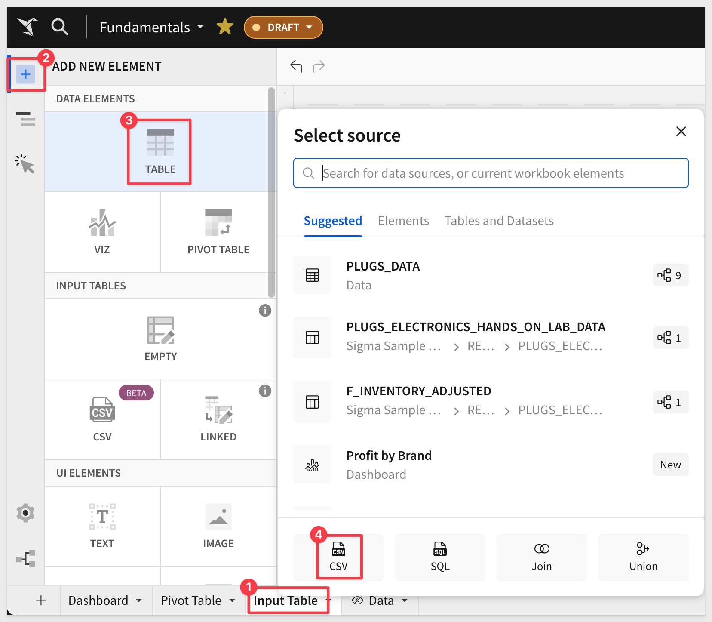
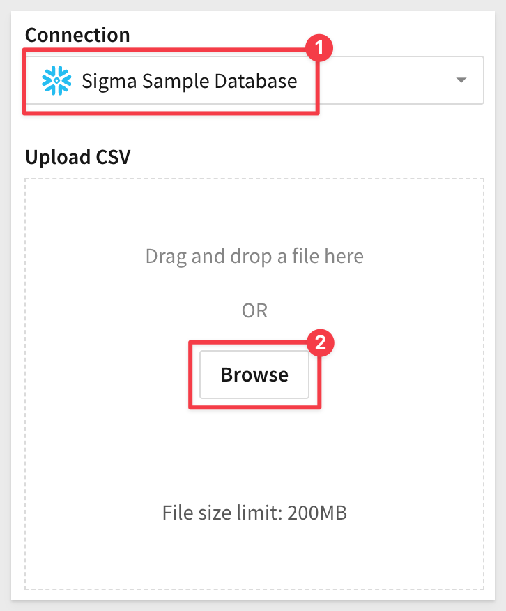
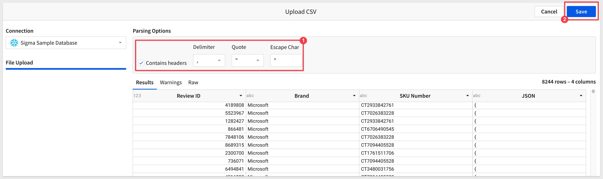

author: pballai
id: fundamentals_5_input_tables
summary: fundamentals_5_input_tables
categories: Fundamentals
environments: web
status: Hidden
feedback link: https://github.com/sigmacomputing/sigmaquickstarts/issues
tags: default
lastUpdated: 2024-06-31

# Fundamentals 5: Input Tables

## Overview 
Duration: 5 

This QuickStart is part of a series of QuickStarts designed to instruct new users on how to use Sigma’s unique data capture feature, input tables.

Sigma is the first and only platform to allow users to securely write back data to rows or columns without overwriting the data in the warehouse.

Input tables are Sigma-managed warehouse tables through which users can add their own data and integrate it into their analysis.

Through this QuickStart, we will walk through why to use an input table, how to use Sigma to create one, import data, and join input table data with existing warehouse data.

We will be working with some common sales data from our fictitious company `Plugs Electronics`, reusing content we created in the QuickStart [Fundamentals 1: Getting Around.](https://quickstarts.sigmacomputing.com/guide/fundamentals-1-getting-around-v2/index.html?index=..%2F..index#0)

<aside class="positive">
<strong>IMPORTANT:</strong>  This QuickStart assumes you have already taken the QuickStart Fundamentals 1 and 2, and are now generally familiar with Sigma. Given this, some steps are assumed to be known and may not be shown in detail.
</aside>

 ### Target Audience
Sigma combines with the unlimited power of the cloud data warehouse and the familiar feel of a spreadsheet; no limit on the amount of data you wish to analyze. Sigma is awesome for users of Excel and even better for customers who have millions of rows of data.

Typical audience for this QuickStart are users of Excel, common Business Intelligence or Reporting tools and semi-technical users who want to try out or learn Sigma. Everything is done in a browser so you already know how to use that. No SQL or technical skills are needed to do this QuickStart.

### Prerequisites
<ul>
  <li>A computer with a current browser. It does not matter which browser you want to use.</li>
  <li>Completion of the QuickStart “Fundamentals 1: Getting Around”</li>
  <li>Access to your Sigma environment. A Sigma trial environment is acceptable and preferred.</li>
  <li>If have not already, you can sign up for a Sigma Trial here:</li>
</ul>

<button>[Free Trial](https://www.sigmacomputing.com/free-trial/)</button>

<aside class="postive">
<strong>IMPORTANT:</strong>  Sigma recommends that you use non-production resources when doing QuickStarts.
</aside>

### Target Audience
Anyone who is trying to create QS content using Sigma and wants to augment, adjust, interact and create "what-if" scenarios.

### Prerequisites

<ul>
  <li>A computer with a current browser. It does not matter which browser you want to use.</li>
  <li>Access to your Sigma environment. A Sigma trial environment is acceptable and preferred.</li>
  <li>Some familiarity with Sigma is assumed. Not all steps will be shown as the basics are assumed to be understood.</li>
  <li>Downloadable project files discussed later in this document.</li>
  <li>A Snowflake account with the proper administrative and security admin access.</li>
  <li>Microsoft Excel or Google Sheets (for accessing the provided sample data)</li>
</ul>

<button>[Sigma Free Trial](https://www.sigmacomputing.com/free-trial/)</button> <button>[Snowflake Free Trial](https://signup.snowflake.com/)</button>

## Why Use Input Tables?
Duration: 5 

When data isn’t in the warehouse, it usually requires a cumbersome technical and people process to ETL data into the warehouse. Now users who need to add data to the warehouse are able to do so directly.

With input tables, what can be built in Sigma changes from one-way transformations of raw data (traditional BI) into a bi-directional data application platform. 

Input tables give users the power to augment, adjust, interact and create "what-if" scenarios in real-time, without changing the source data.

Input tables can also be use as sources for tables, pivot tables, and visualizations, or incorporate the data using [lookups](https://help.sigmacomputing.com/docs/join-types#lookup) and joins. And when you create [warehouse views](https://help.sigmacomputing.com/docs/create-and-manage-workbook-warehouse-views) for input tables, you can reuse the manually entered data across your broader data ecosystem.

Sigma customers already use input tables for:
<ul>
  <li>Manual data entry of key values</li>
  <li>Analytic Modeling
        <ul>
        <li>scenario</li>
        <li>forecast</li>
        <li>territory planning</li>
        <li>sales planning</li>
        <li>supply chain</li>
        <li>categorizations</li>
        <li>many more...</li>
        </ul>
    </li>
</ul>

<aside class="negative">
<strong>NOTE:</strong>  Input tables are currently supported by Snowflake and Databricks connections only.
</aside>

There is a [QuickStart](https://quickstarts.sigmacomputing.com/guide/input_tables_use_cases/index.html?index=..%2F..index#0) that walks through how to build various common use cases.

## Example Use Case
Duration: 5

For our sample use case, let’s assume we are a Brand Manager for a fictitious company, Plugs Electronics.

Management has requested a review of the bottom ten under-performing brands to decide which should be retained or dropped from the product line.

In the past, this has been a very manual process involving importing/exporting text files and Excel. This has proven to be both slow and prone to unreliable data with many points of potential human error.

We have just received survey results from a third-party service that contains brand ratings. As is typical, the results were delivered in a comma-separated-value text file (CSV).

Management is impatient for these recommendations, so we need to move faster.

Let’s see how this can be done faster in Sigma, with better results too.

## Workbook
Duration: 5 

Open the `Fundamentals` workbook and add another page. Rename the page to `Input Table`.

[Download the third-party review CSV file to your local computer](https://sigma-quickstarts-main.s3.us-west-1.amazonaws.com/csv/product_ratings_bottom10.csv)

Add a new `Table` (not an Input Table just yet!) to the `Input Tables` page and choose `CSV` as its source.

Use the `Sigma Sample Database` and browse to locate the CSV file we just downloaded (called product_ratings_bottom.csv):

Sigma auto-detects the `Parsing Options` for us, so we can just click `Save`:

## asdad
Duration: 5 

## asdad
Duration: 5 

## What we've covered
Duration: 5

<!-- END OF NEXT SECTION-->

In this QuickStart we covered three popular used cases for Sigma Input Tables in great detail. 

<!-- THE FOLLOWING ADDITIONAL RESOURCES IS REQUIRED AS IS FOR ALL QUICKSTARTS -->
**Additional Resource Links**

Be sure to check out all the latest developments at [Sigma's First Friday Feature page!](https://quickstarts.sigmacomputing.com/firstfridayfeatures/)

[Help Center Home](https://help.sigmacomputing.com) 
[Sigma Community](https://community.sigmacomputing.com/) 
[Sigma Blog](https://www.sigmacomputing.com/blog/) 
 

&emsp;
&emsp;

<!-- END OF WHAT WE COVERED -->
<!-- END OF QUICKSTART -->
