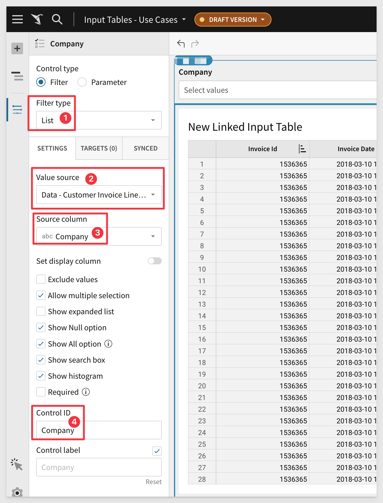
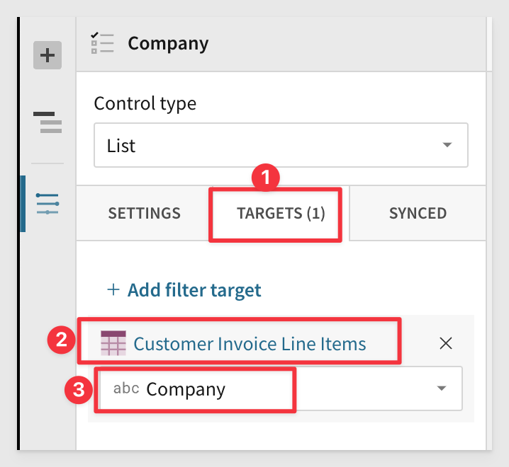
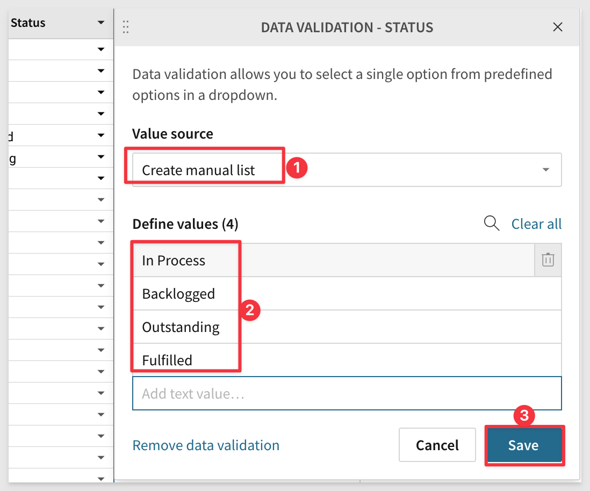
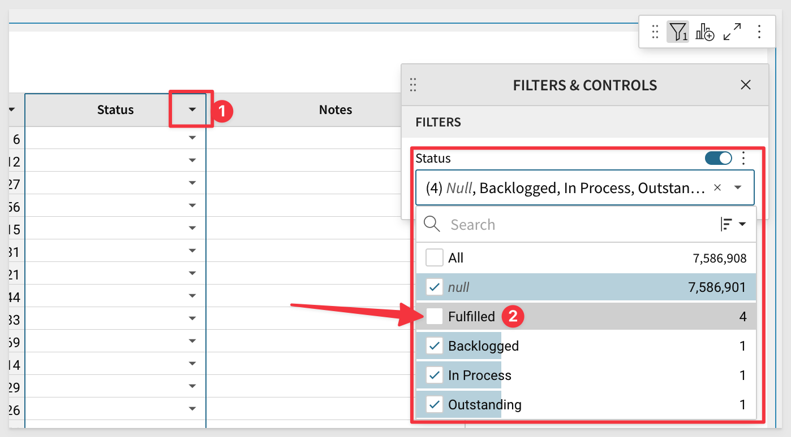
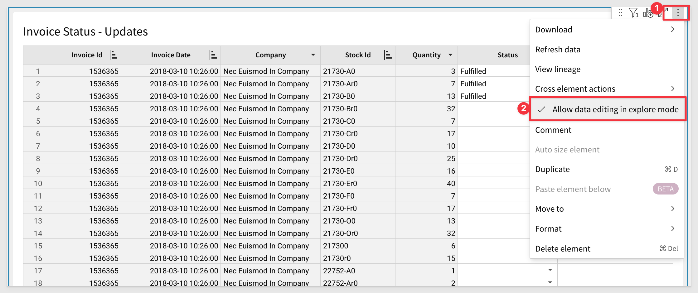
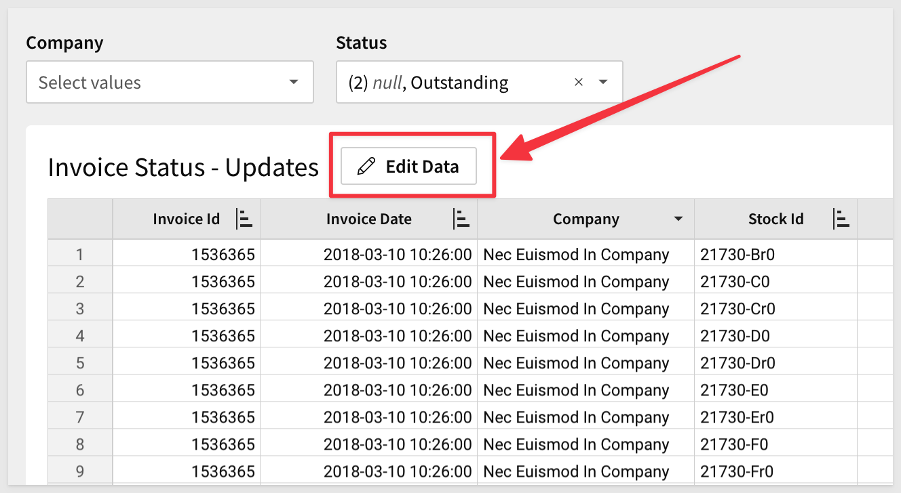
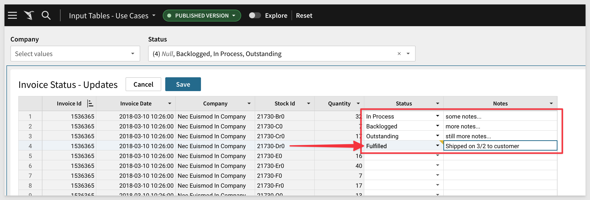

author: pballai
id: fundamentals_5_input_tables
summary: fundamentals_5_input_tables
categories: Fundamentals
environments: web
status: Hidden
feedback link: https://github.com/sigmacomputing/sigmaquickstarts/issues
tags: default
lastUpdated: 2024-06-31

# Fundamentals 5: Input Tables

## Overview 
Duration: 5 

This QuickStart is part of a series of QuickStarts designed to instruct new users on how to use Sigma’s unique data capture feature, input tables.

Sigma is the first and only platform to allow users to securely write back data to rows or columns without overwriting the data in the warehouse.

Input tables are Sigma-managed warehouse tables through which users can add their own data and integrate it into their analysis.

Through this QuickStart, we will walk through why to use an input table, how to use Sigma to create one, import data, and join input table data with existing warehouse data.

We will be working with some common sales data from our fictitious company `Plugs Electronics`, reusing content we created in the QuickStart [Fundamentals 1: Getting Around.](https://quickstarts.sigmacomputing.com/guide/fundamentals-1-getting-around-v2/index.html?index=..%2F..index#0)

<aside class="positive">
<strong>IMPORTANT:</strong>  This QuickStart assumes you have already taken the QuickStart Fundamentals 1 and 2, and are now generally familiar with Sigma. Given this, some steps are assumed to be known and may not be shown in detail.
</aside>

 ### Target Audience
Sigma combines with the unlimited power of the cloud data warehouse and the familiar feel of a spreadsheet; no limit on the amount of data you wish to analyze. Sigma is awesome for users of Excel and even better for customers who have millions of rows of data.

Typical audience for this QuickStart are users of Excel, common Business Intelligence or Reporting tools and semi-technical users who want to try out or learn Sigma. Everything is done in a browser so you already know how to use that. No SQL or technical skills are needed to do this QuickStart.

### Prerequisites
<ul>
  <li>A computer with a current browser. It does not matter which browser you want to use.</li>
  <li>Completion of the QuickStart “Fundamentals 1: Getting Around”</li>
  <li>Access to your Sigma environment. A Sigma trial environment is acceptable and preferred.</li>
  <li>If have not already, you can sign up for a Sigma Trial here:</li>
</ul>

<aside class="positive">
<strong>IMPORTANT:</strong>  Sigma trial instances provide a sample database in Snowflake and write access for input tables is already configured for you. Production environments need to have write access configured by your Sigma administrator. It only takes a few minutes!
</aside>

<button>[Free Trial](https://www.sigmacomputing.com/free-trial/)</button>

<aside class="postive">
<strong>IMPORTANT:</strong>  Sigma recommends that you use non-production resources when doing QuickStarts.
</aside>

### Target Audience
Anyone who is trying to create QS content using Sigma and wants to augment, adjust, interact and create "what-if" scenarios.

### Prerequisites

<ul>
  <li>A computer with a current browser. It does not matter which browser you want to use.</li>
  <li>Access to your Sigma environment. A Sigma trial environment is acceptable and preferred.</li>
  <li>Some familiarity with Sigma is assumed. Not all steps will be shown as the basics are assumed to be understood.</li>
  <li>Downloadable project files discussed later in this document.</li>
  <li>A Snowflake account with the proper administrative and security admin access.</li>
  <li>Microsoft Excel or Google Sheets (for accessing the provided sample data)</li>
</ul>

<button>[Sigma Free Trial](https://www.sigmacomputing.com/free-trial/)</button> <button>[Snowflake Free Trial](https://signup.snowflake.com/)</button>

## Why Use Input Tables?
Duration: 5 

When data isn’t in the warehouse, it usually requires a cumbersome technical and people process to ETL data into the warehouse. Now users who need to add data to the warehouse are able to do so directly.

With input tables, what can be built in Sigma changes from one-way transformations of raw data (traditional BI) into a bi-directional data application platform. 

Input tables give users the power to augment, adjust, interact and create "what-if" scenarios in real-time, without changing the source data.

Input tables can also be use as sources for tables, pivot tables, and visualizations, or incorporate the data using [lookups](https://help.sigmacomputing.com/docs/join-types#lookup) and joins. And when you create [warehouse views](https://help.sigmacomputing.com/docs/create-and-manage-workbook-warehouse-views) for input tables, you can reuse the manually entered data across your broader data ecosystem.

Sigma customers already use input tables for:
<ul>
  <li>Manual data entry of key values</li>
  <li>Analytic Modeling
        <ul>
        <li>scenario</li>
        <li>forecast</li>
        <li>territory planning</li>
        <li>sales planning</li>
        <li>supply chain</li>
        <li>categorizations</li>
        <li>many more...</li>
        </ul>
    </li>
</ul>

<aside class="negative">
<strong>NOTE:</strong>  Input tables are currently supported by Snowflake and Databricks connections only.
</aside>

There is a [QuickStart](https://quickstarts.sigmacomputing.com/guide/input_tables_use_cases/index.html?index=..%2F..index#0) that walks through how to build various common use cases.

## One Use Case
Duration: 20

There are times when capturing a small amount of data from a Sigma user can be very valuable to the business. 

However, this can also present some challenges:

<ul>
      <li><strong>Will you have to build some new application to capture the data?</strong></li>
      <li><strong>When is the right time to capture the data?</strong></li>
      <li><strong>Can we tell who changed the data?</strong></li>
      <li><strong>Can we restrict this functionality to a few users?</strong></li>
      <li><strong>Will the users accept another tool?</strong></li>
      <li><strong>Once we have the data, how will it relate to existing warehouse data?</strong></li>
      <li><strong>Lots of other questions to be sure!</strong></li>
</ul>

Since users are already using Sigma (**or spreadsheets and should be using Sigma instead!**), input tables can help solve this problem. 

Why not just create a Sigma workbook and augment it with the ability for the user to enter small amounts of data in real time?

Sigma will do the heavy lifting of presenting a familiar user interface, restrict the functionality to those permitted to use it and store the new data in your warehouse. 

<aside class="postive">
<strong>IMPORTANT:</strong>  Sigma does not store data and with input tables outside of your warehouse. Data is stored in your warehouse only, where you specify. Existing data is NEVER changed in any way.
</aside>

Allowing users to add/supplement warehouse data opens a world of possibilities. We can demonstrate how this can be done we will use a very simple example.

### Use case description

There is a need for various employees to to update the delivery status of orders, adding comments/notes, but don't want to provide access to the accounting system to employees outside of accounting.

Sigma can easily solve this challenge using input tables and our curated warehouse table, `PLUGS_DATA`, without wasting software developers or database administrators valuable time.

<!-- END OF SECTION-->

## How to Build It

In our workbook, create a new page and rename it to `Input Tables`. 

Click the `+` icon and scroll to `INPUT TABLES` and select `LINKED`.

In the source selector, click to select the `PLUGS_DATA` table on the `Data` page:

There are actually three types of input tables to choose from. 

 <ul>
      <li><strong>EMPTY:</strong> supports data entry independent of existing data.</li>
      <li><strong>CSV:</strong> supports data entry with pre-populate editable data from a CSV upload.</li>
      <li><strong>LINKED:</strong> supports data entry alongside existing data from other elements in the same workbook, via a lookup.</li>
</ul>

Choose the following columns from the list of available and click `Create Input Table`:

We now have an input table with columns from the `PLUGS_DATA` table:

Rename the input table to `Order Status`.

Observe that the columns that have been linked from the `PLUGS_DATA` table have a key icon (#1 in the image below) while there is another column (#2 in the image below) that does not.

The lock indicates that those columns are not editable. The `Text` column was added by Sigma as an starting point for adding more input table columns.

We also reordered our columns assuming that an employee might be on the phone with a customer and want to easily locate the customer's order by name, order number and have a few order details on-hand too.

Lets center the `Order Number` and `Quantity` columns:

Click `Publish`.

<!-- END OF SECTION-->

## Order Status - Data Validation
Duration: 20

We don't want employees making mistakes manually typing the order status. We want them to pick from a valid list.

Change the `Text` column name to `Order Status` by double-clicking the word "Text".

Click the `Order Status` menu and select `Data validation`:

We will use a manual list, but the option can also be data driven if preferred:

Now the users can just select from a list of validate status, or clear the cell out as well (#2 in the image below):

Click `Publish`.

Out `Order Status` page now looks like this, when looking at the published version:

Notice that in the published version, we cannot change any cells until we click the `Edit` button.

This means that viewers can still work with the data, but only users with the `edit` permission will be able to change the status of any orders.

<!-- END OF SECTION-->

### Where is all the data coming from?
Duration: 20

Sigma workbooks can get really expansive and it can be useful to see add the source data and relationships visually.

Sigma provides a quick way to see that using the `view lineage` option:

Lineage allows you to quickly see all the elements and their relationships:

Clicking the `Show controls` checkbox also will show any control elements and their targets:

<!-- END OF SECTION-->

### Governance columns
Duration: 20

<!-- END OF SECTION-->

We want the user to be able to filter the Input Table Table to specific Companies.

Add a new Element / Control Element / List Value element and configure it as follows:

Set the `Target` as:

<aside class="negative">
<strong>NOTE:</strong>  Notice that we are not targeting the Input Table but rather the Table on the hidden Data Page that is linked to the Input Table. This can also be used to drive Row Level Security.
</aside>

We now are ready to add our columns that are enabled for data capture.

Add a new Column to the Input Table called `Status`.

Add another new Column to the Input Table called `Notes`.

We did Data Validation in an earlier use case but this time will just limit the `Status` column to values we will manually provide:

We want the user to "work" the data down so we need another Input List to filter the table, not showing rows that have a Status = Fulfilled,

Set a Filter on the Table to only show rows that have not been Fulfilled:

Now we can filter by Company, adjust the Status and add notes.

Last step before we test is to enable editing in Explorer Mode:

Publish the Workbook and go to the Publish version so that we are looking at this Page as the end-user would see and work with it.

Now we have an `Edit Data` button. Click that:

Lets test by updating the first four records as shown for each Status:

Click the `Save` button.

Each time we save, any records set `Fulfilled` are longer visible. Looking at `Column Details` for `Status` we see that there are no rows where Status = Fulfilled. 

In this way, the user can just do the updates they need and not be concerned about records that are completed.

<aside class="postive">
<strong>Image the Possibilities:</strong>  The ability to capture and save data to the warehouse breaks the traditional BI model of providing static pages. Sigma unlocks the power of data trapped in cloud warehouses. With Input Tables you can now capture information that is trapped in the end user's minds without investing in another application. Think of the possibilities.
</aside>

<!-- END OF SECTION-->

## What we've covered
Duration: 5

<!-- END OF NEXT SECTION-->

In this QuickStart we covered three popular used cases for Sigma Input Tables in great detail. 

<!-- THE FOLLOWING ADDITIONAL RESOURCES IS REQUIRED AS IS FOR ALL QUICKSTARTS -->
**Additional Resource Links**

Be sure to check out all the latest developments at [Sigma's First Friday Feature page!](https://quickstarts.sigmacomputing.com/firstfridayfeatures/)

[Help Center Home](https://help.sigmacomputing.com) 
[Sigma Community](https://community.sigmacomputing.com/) 
[Sigma Blog](https://www.sigmacomputing.com/blog/) 
 

&emsp;
&emsp;

<!-- END OF WHAT WE COVERED -->
<!-- END OF QUICKSTART -->
