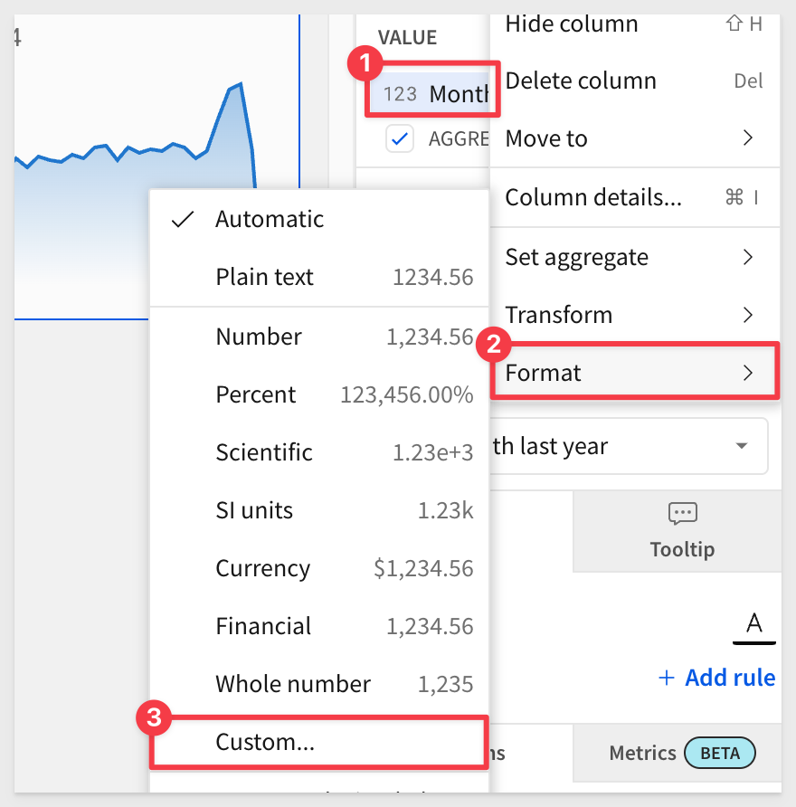
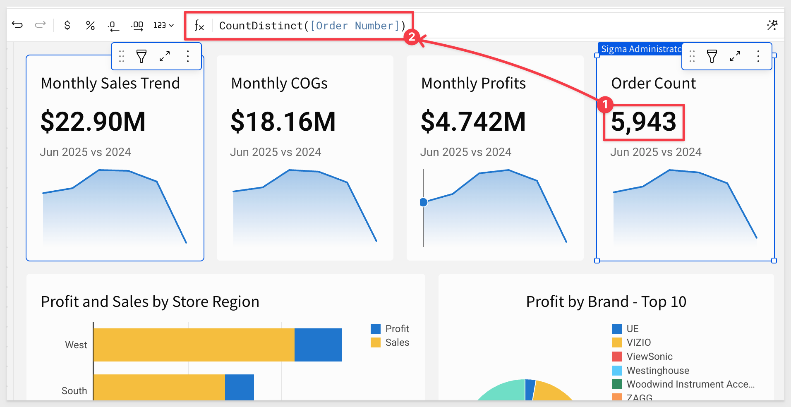

author: pballai
summary: fundamentals_5_charts_v3
id: fundamentals_5_charts_v3
categories: fundamentals
status: Published
feedback link: https://github.com/sigmacomputing/sigmaquickstarts/issues
tags: default
authors: pballai
lastUpdated: 2025-03-13

# Fundamentals 05: Charts

## Overview 
Duration: 5

This QuickStart is part of a series designed to help new users explore and analyze data in Sigma using charts.

We will be working with some common sales data from our fictitious company `Plugs Electronics`, reusing content we created in the QuickStart fundamentals 1 and 2.

<aside class="positive">
<strong>IMPORTANT:</strong><br> This QuickStart assumes you have already taken the QuickStart Fundamentals 1 and 2, and are now generally familiar with Sigma. Given this, some steps are assumed to be known and may not be shown in detail.
</aside>

Sigma supports a wide variety of types so be sure to check our documentation for the latest list:

<table>
    <thead>
        <tr>
            <th colspan="2"><strong>Supported Charts Types:</strong></th>
        </tr>
    </thead>
    <tbody>
        <tr>
<td>
  <ul>
    <li><strong>Area chart</strong></li>
    <li><strong>Bar chart</strong></li>
    <li><strong>Box and Whisker chart</strong></li>
    <li><strong>Combo chart</strong></li>
    <li><strong>Dynamic text value</strong></li>
    <li><strong>Funnel chart</strong></li>
    <li><strong>Gauge chart</strong></li>
    <li><strong>Geography Map</strong></li>
    <li><strong>KPI chart</strong></li>
  </ul>
</td>
<td>
  <ul>
    <li><strong>Line chart</strong></li>
    <li><strong>Maps – by region, point (lat/long), or GeoJSON</strong></li>
    <li><strong>Pie / Donut chart</strong></li>
    <li><strong>Point map</strong></li>
    <li><strong>Region map</strong></li>
    <li><strong>Sankey diagram</strong></li>
    <li><strong>Scatter plot</strong></li>
    <li><strong>Single value charts</strong></li>
    <li><strong>Waterfall chart</strong></li>
  </ul>
</td>
     </tr>
    </tbody>
</table>

For the latest list of supported chart types, see [Intro to charts](https://help.sigmacomputing.com/docs/intro-to-visualizations)

<aside class="positive">
<strong>IMPORTANT:</strong><br> Some screens in Sigma may appear slightly different from those shown in QuickStarts. This is because Sigma is continuously adding and enhancing functionality. Rest assured, Sigma’s intuitive interface ensures that any differences will not prevent you from successfully completing any QuickStart.
</aside>

For more information on Sigma's product release strategy, see [Sigma product releases](https://help.sigmacomputing.com/docs/sigma-product-releases)

If something is not working as you expect, here is how to [contact Sigma support](https://help.sigmacomputing.com/docs/sigma-support)

<aside class="positive">
<strong>IMPORTANT:</strong><br> Some features may carry the "Beta" tag. Beta features are subject to quick, iterative changes. As a result, the latest product version may differ from the contents of this document.
</aside>

 ### Target Audience
The typical audience for this QuickStart includes users of Excel, common Business Intelligence or Reporting tools, and semi-technical users who want to try out or learn Sigma.

### Prerequisites
<ul>
  <li>A computer with a current browser. It does not matter which browser you want to use.</li>
  <li>Completion of the QuickStarts Fundamentals 1 and 2</li>
  <li>Access to your Sigma environment. A Sigma trial environment is acceptable and preferred.</li>
  <li>If have not already, you can sign up for a Sigma Trial here:</li>
</ul>

<button>[Free Trial](https://www.sigmacomputing.com/free-trial/)</button>

<aside class="positive">
<strong>IMPORTANT:</strong><br> Sigma recommends using non-production resources when completing QuickStarts.
</aside>

### What You’ll Learn
Through this QuickStart, we will walk through how to use Sigma to create beautiful charts and maps, changing configuration parameters to suit your needs.


<!-- END OF OVERVIEW -->

## Chart Basics
Duration: 30

Our starting point is the workbook created in the QuickStart, [Fundamentals 2: Working with Data](https://quickstarts.sigmacomputing.com/guide/fundamentals_2_data_v3/index.html?index=..%2F..index#0)

It is often easier to spot trends, outliers, or insights that lead to further questions when viewing data in a chart.

Sigma makes it easy to create charts of your data while also enabling you to dig into the data that makes up those charts.

In Sigma, open the workbook `Fundamentals` and place it in `edit mode`.

Add a new page and rename it to `Fundamentals 5`.

### Chart as child
Our workbook has a page called `Data`; navigate to that.

Click on the icon as shown below, and select `Create Child Element`. 

Select `Chart` from the drop list.


Sigma creates a chart element below the table. The chart now needs to be configured.

We used this workflow to demonstrate one way to add a chart, connecting it immediately to a source table. We could have also selected a chart from the `Element bar` and configured its data connection afterwards. Either way is fine:


<aside class="positive">
<strong>NOTE:</strong><br> This is awesome because it means someone who knows the underlying data could make this table available with careful curation, and others can just use it.
</aside>

Move the chart to the `Fundamentals 5` page.

Rename this bar chart to reflect `Profit and Sales by Store Region`.

<aside class="negative">
<strong>NOTE:</strong><br> We think it is really nice that every element is configured using the same basic design patterns. After a few  uses, it just feels natural regardless of element type.
</aside>

Since you have completed other QuickStarts in this series, you know how easy it is to use the element panel to configure elements on the canvas. 

Use the element panel to configure the bar chart as shown below:


We have our first chart (sort by profit by right-clicking on any profit bar and selecting profit from the list):


<aside class="negative">
<strong>NOTE:</strong><br> Sigma automatically summed the sales and profit columns to create an aggregate. You can change the type of aggregate at any time using the dropdown. 

If you do not wish to aggregate the values, you can uncheck the “AGGREGATE VALUES” checkbox.
</aside>

For example, opening the column menu for `Sales` in the `X_AXIS` group in the `Element panel` and selecting `Set aggregate` shows all the options:


### Customizations
We can further customize many of the bar chart's attributes using the `Element panel` > `Format` menu.

For example, enable tool tips with a single click:


<aside class="positive">
<strong>IMPORTANT:</strong><br> The available customizations are driven by the type of chart that is currently selected. 
</aside>

To learn more about the many chart format options, navigate to [Intro to charts](https://help.sigmacomputing.com/docs/intro-to-visualizations) and look at the section under `Customize a chart` that interests you:


### Adding another chart
This time, open the `Element bar` > `Charts` group and select a `Pie` chart. Drag it alongside the existing chart.


Click `Select source`, and choose the `Plugs_Store_Sales` table from the `Data` page.

Configure the pie chart as shown. Since the data has some many brands, lets assume (and filter for) the top 10 only:


Click `Publish`.

There are many different chart types available to experiment with; we will not cover them all since they are all added and configured as we have already done.

<aside class="positive">
<strong>IMPORTANT:</strong><br> This consistency of design is really important to Sigma; it makes working with data easy!
</aside>

Let's explore a few of the more popular ones.


<!-- END OF VIZ BASICS -->

## KPI Charts
Duration: 5

As you have seen, there are many different types of charts available, and they all follow the same basic workflow. 

Once you know how to create one, the others will be straightforward.

For example, let's say we want a `KPI` that shows `Revenue`, and compare the current month with the same month from the previous year. 

Using the `Element panel`, add a new `KPI` chart, set its data source to the `Plugs_Store_Sales` table on the `Data` page

Now simply configure the KPI as shown below. Use the `Sales` column for `VALUE` and rename it to `Monthly Sales Trend`. Also, set a `Comparison` period:


These steps are very much like ones that we have already done, which makes this straightforward. 

The exception might be how to get the value formatted as in millions, instead of the default.

In the `VALUE` element, open the menu for `Sales` > `Format` and select `Custom`:



The `Custom Format` modal lets us adjust how the data is displayed using standard formatting, based on D3.js (D3). 

[D3 is a free, open-source JavaScript library.](https://d3js.org/what-is-d3)

Set the `Format string` to:
```code
$,.4s
```


The `Fundamentals 5` page should now look similar to this:


Click `Publish`.

### More KPIs
Add other KPIs as you like; for example, `COGS`, `Profit` and `Order Count` would be good to add.

One way to do this is simply use the `Monthly Sales Trend` KPI menu and select `Duplicate` to quickly create copies. 

`COGS` and `Profit` are done by swapping the `VALUE` column from `Monthly Sales Trend` to `COGS` and `Profit` columns respectively.

`Order Count` is the same as the others but the formula is not `SUM` but rather `CountDistinct`.

Select all four KPI at once and drag them about the charts, resizing to suit.

The `Fundamentals 5` should now look similar to this:



Click `Publish`.

For more information, see [Build a KPI chart](https://help.sigmacomputing.com/docs/build-a-kpi-chart)


<!-- END OF KPI -->

## Maps
Duration: 15

Geographic data can tell a powerful story. Whether analyzing regional trends or plotting sites, maps are packed with insights generated from your location data. 

Sigma Maps help contextualize geospatial information and provide greater understanding when analyzing data. With Sigma, you can create interactive maps using regions, latitude and longitude, or map paths and areas utilizing GeoJSON.

<aside class="negative">
<strong>NOTE:</strong><br> If maps are not used in your role, feel free to skip this section. 
</aside>

Workbooks support three distinct map types: **Region**, **Point** and **Geography**:

 <ul>
      <li><strong>Region: </strong>Require a single text column on the map's REGION field. For example, you can use a column “US State” to distinguish between “regions” or states in this example</li>
      <li><strong>Point: </strong>Require a number column on both the map's LATITUDE and LONGITUDE fields. For example, you may want to show store locations on a map.</li>
      <li><strong>Geography: </strong>Support datasets with geography data (WKT format) or variant data (GeoJSON format) and are typically used to illustrate geospatial objects on a map.<li>
</ul>

Our `Plugs_Store_Sales` table has the columns we an use for `Region` and `Point` map types:


### Map by Region (State)
Add a `Region` chart, set its data source to the `Plugs_Store_Sales` table on the `Data` page, and change the `CHART` type to `Map-Region`.

<aside class="negative">
<strong>NOTE:</strong><br> The Map-Region chart is named "Region" in the charts grouping of the element panel.
</aside>

Now simply use the `Element panel` to configure the map as shown below:


<aside class="negative">
<strong>NOTE:</strong><br> We also disabled the legend and added a "Label" using the "Sales" column.
</aside>

Right clicking on any state allows you to include/exclude it from the dataset or drill down to underlying data:


<aside class="positive">
<strong>Drill Anywhere: </strong><br>The ability to drill anywhere did not have to be programmed ahead of time by a developer. Unconstrained, ad-hoc analysis gives the user the power to explore the data beyond what was originally intended and as they see fit.
</aside>

Click on the `expand-contract` icon in the upper right corner of the map:


Now we can work with the underlying data, which has been grouped and aggregated for us, based on the map's configuration. 

We can browse the data or duplicate it to create different views for our own analysis:


The `Fundamentals 5` page should now look similar to this:


Click `Publish`.


<!-- END OF MAPS -->

## Map - Point
Duration: 15

Adding a map with pins representing store locations, color-coded by sales, takes just a few clicks.

By now, the steps should be really familiar so here is the end result, along with the element panel configuration:


<aside class="positive">
<strong>KEY TAKEAWAY:</strong><br> Creating charts in Sigma is really easy once you know what you want to visualize. 
</aside>

Click `Publish`.


<!-- END OF MAPS -->

## Plug-in Charts
Duration: 15

There are many chart libraries available on the internet, and these can be the basis for adding a chart type that does not exist in Sigma via a [Plug-in](https://help.sigmacomputing.com/docs/get-started-with-custom-plugins)

For example:

[Chart.js:](https://www.chartjs.org/) Simple yet flexible JavaScript charting library for the modern web.

[D3.js:](https://d3js.org) Create custom dynamic visualizations with unparalleled flexibility

There is also a QuickStart on this topic; see [Extend Sigma with Plugins](https://quickstarts.sigmacomputing.com/guide/developers_plugins/index.html?index=..%2F..index#0)

In the QuickStart, there are instructions on how to access the public git repository containing example plugins.

Some really amazing visuals can be created via plugin. For example:


<!-- END OF MAPS -->

## What we've covered
Duration: 5

In this QuickStart we learned how to use Sigma to create beautiful charts, KPIs, maps and more.

The next QuickStart in this series covers using [controls in Sigma](https://quickstarts.sigmacomputing.com/guide/fundamentals_6_controls_v3/index.html?index=..%2F..index#0)

**Additional Resource Links**

Be sure to check out all the latest developments at [Sigma's First Friday Feature page!](https://quickstarts.sigmacomputing.com/firstfridayfeatures/)

[Sigma Community](https://community.sigmacomputing.com/)<br>
[Sigma Blog](https://www.sigmacomputing.com/blog/)<br>
<br>

[](https://twitter.com/sigmacomputing)&emsp;
[](https://www.linkedin.com/company/sigmacomputing)&emsp;
[](https://www.facebook.com/sigmacomputing)


<!-- END OF WHAT WE COVERED -->
<!-- END OF QUICKSTART -->
