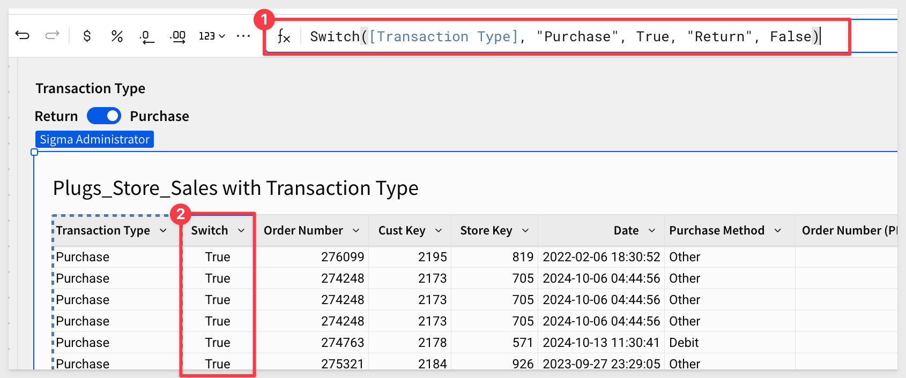
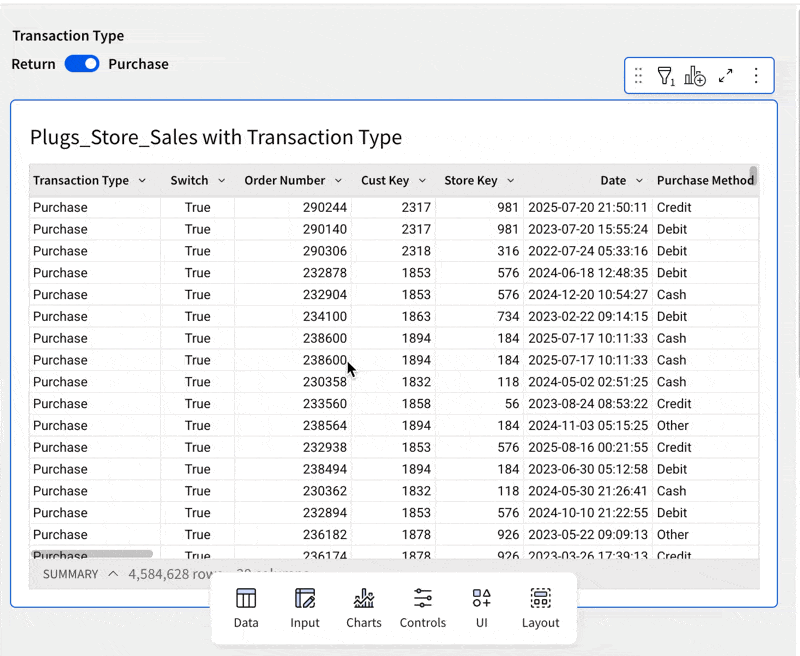

author: pballai
id: fundamentals_6_controls_v3
summary: fundamentals_6_controls_v3
categories: Fundamentals
environments: web
status: Published
feedback link: https://github.com/sigmacomputing/sigmaquickstarts/issues
tags: default
lastUpdated: 2025-03-13

# Fundamentals 06: Controls

## Overview 
Duration: 5 

This QuickStart is part of a series of QuickStarts designed to instruct new users on how to use the variety of controls Sigma offers.

Control elements (controls) and data elements work hand-in-hand in Sigma. 

Data elements display the data (ie: tables or charts), and controls manipulate the displayed data by filtering and/or using parameters. 

Controls are basically filters, and sometimes the terminology is interchangeable. 

The line gets blurred more since controls can also be used as parameters.

To read more about [creating flexible reports with parameters, see here.](https://help.sigmacomputing.com/docs/create-flexible-reports-with-parameters)

If you already completed QuickStart fundamentals 1-5, you have already used controls. 

In [Fundamentals 2 - Data](http://localhost:8000/guide/fundamentals-2-data/index.html?index=..%2F..index#2), we created a filter directly from a table column (Store Region), and converted that filter into a page control. This control is an example of a `List control`.

Selecting the correct control is often more art than science, as there are many controls to choose from.

In general, if using the control is obvious to the user, requires the minimum number of clicks, and produces the desired results, it is a good choice.

<aside class="positive">
<strong>IMPORTANT:</strong><br> In some cases, performance should be considered when using data-driven controls. Care should be taken such that any control does not use a source column that has too many values. While technically possible, this may impact performance and also frustrate users.
</aside>

<aside class="positive">
<strong>IMPORTANT:</strong><br> Some screens in Sigma may appear slightly different from those shown in QuickStarts. This is because Sigma is continuously adding and enhancing functionality. Rest assured, Sigma’s intuitive interface ensures that any differences will not prevent you from successfully completing any QuickStart.
</aside>

For more information on Sigma's product release strategy, see [Sigma product releases](https://help.sigmacomputing.com/docs/sigma-product-releases)

If something is not working as you expect, here is how to [contact Sigma support](https://help.sigmacomputing.com/docs/sigma-support)

 ### Target Audience
The typical audience for this QuickStart includes users of Excel, common Business Intelligence or Reporting tools, and semi-technical users who want to try out or learn Sigma.

### Prerequisites
<ul>
  <li>A computer with a current browser. It does not matter which browser you want to use.</li>
  <li>Completion of the QuickStarts Fundamentals 1 and 2.</li>
  <li>Access to your Sigma environment. A Sigma trial environment is acceptable and preferred.</li>
  <li>If have not already, you can sign up for a Sigma Trial here:</li>
</ul>

<button>[Free Trial](https://www.sigmacomputing.com/free-trial/)</button>

<aside class="positive">
<strong>IMPORTANT:</strong><br> Sigma recommends using non-production resources when completing QuickStarts.
</aside>


## Controls Overview
Duration: 5 

Open the `Fundamentals` workbook created in earlier fundamentals QuickStarts.

Add a new page and rename it to `Fundamentals 6`.

Add a new `Table` from the `Element bar` and set the source to the `Plugs_Store_Sales` table on the `Data` page.

Opening the `Controls` group in the in the `Element bar`, we can see that there are many different controls available:


 <ul>
      <li><strong>List Values:</strong> Include or exclude selected values in a list. Up to 200 values can be displayed in the list control.</li>
      <li><strong>Text Input:</strong> Search values in the targeted data element column(s) for full and partial matches between the text input and your data’s values.</li>
      <li><strong>Text Area:</strong> Search for full and partial matches between the inputted text and the targeted data values. Also useful for providing text input to a formula by referencing the control as a parameter.</li>
      <li><strong>Segmented Control:</strong> Provide a single-select limited set of options for users to select from.</li>
      <li><strong>Date:</strong> Choose a single date to use to filter a column or use as a parameter. Both fixed (2024-12-12) and relative (Now minus 7 days) dates are supported.</li>
      <li><strong>Date Range:</strong> Select a date range to use to filter a targeted data element, or use the selected date range as a parameter, for example to filter a custom SQL statement.</li>
      <li><strong>Number input:</strong> Enter a single number to filter a data element, or use as a parameter in custom SQL or a formula.</li>
      <li><strong>Number range:</strong> Enter a minimum number and/or a maximum number for a range to filter the results in targeted data elements. The range is inclusive of the entered numbers.</li>
      <li><strong>Slider:</strong> Select a number from a specific range using a slider. Similar to the number input control, the slider option lets you restrict the available input options.</li>
      <li><strong>Range Slider:</strong> Specify a number range within a designated range using a slider. Similar to the number range control, the range slider lets you restrict the available input options.</li>
      <li><strong>Switch:</strong> Turn on or turn off a toggle switch to let users choose between True (turned on) or False (turned off) values.</li>
      <li><strong>Checkbox:</strong> Select or deselect a checkbox to represent True (selected) or False (deselected) values.</li>
      <li><strong>Top N:</strong> Limit the available data according to a ranking, such as top 15 or bottom 10%.</li>
      <li><strong>Drill Down:</strong> Let a user drill into a pre-defined layer of data, such as one level higher or lower in data granularity. A drill down control enables double click to drill.</li>
      <li><strong>Legend:</strong> Add a legend to target one or more charts.</li>
</ul>

The process for adding and configuring any control to the canvas is very similar, regardless which control is selected. 


## Slider
Duration: 5 

The slider control enables users to select a single value from a continuous range by sliding a handle along a track.

Add a new `Slider` control to the page

Configure the control:


Pay attention to the setting for `Control ID`. The value used uniquely identifies the control and allows it to be used in formulas, actions and other areas of a workbook. It is a good practice to select a pattern that makes sense to you and others and stick with it.

For example, we used f6-c-slider-sales, which we translate to "the slider control on the Fundamentals 6 page that targets the sales column.

Set the `Target` of the control to the `Fundamentals 6` > `Plugs_Store_Sales` table:


Select the `Sales` as the column to target.

Slide the control to around 20k. These "big-spender" customers might make a good list for a marketing campaign:


However, big spend does not always mean big profit. We should evaluate for both to refine our marketing target list.

### Duplicate controls
Sigma makes it really simple to add copies of existing controls, saving you time.

Lets say we want to also get all the rows sold at high margin, amongst the list of "big spenders".

Open the slider control's menu and click `Duplicate`.

Drag the control to be side-by-side with the `Sales` control.

Configure the slider to allow the user to quickly return all the orders with a profit greater than (or equal to) the value configured.

Modify the target for the new control targets the `Plugs_Store_Sales` table > `Profit` column and rename the control to `Profit`.

We checked and found there are some orders sold at big losses, so we set the minimum value to `-10,000` for the `Profit` slider.

Also set the `Control ID` for `Profit` to `profit-slider`.

<aside class="positive">
<strong>IMPORTANT:</strong><br> BBe sure to pay attention to the Control ID used for each control. Each ID must be unique, and Sigma will ensure this if you don’t specify one. We can reference the current value that a control is set to by referring to it's Control ID. This can be useful in a variety of use cases, especially in formulas.
</aside>

Now adjust the `Profit` slider to be around $6500. These are are target high-value customers:


### Sanity Check
When creating controls, it is always a good idea to make sure the row counts are what is expected. 

We want to ensure that we did not inadvertently create a filter that does not initially show all the rows, based on its configuration (unless that was intended).

We would expect the table to have the same row count as our un-filtered source table, and it is easy to compare the two, as a quick validation. 

Reset both controls to show all rows, and verify the total row count matches the total row count on the `Data` page > `Plugs_Store_Sales` source table.

Check that the values match:


Click `Publish`.


## Range Slider
Duration: 5 

This control is very similar to the slider, except that the user is able to adjust both the min and max values in the control itself.

For example, we might want to target customers who spent a fair amount of money on computers, to see if we can sell them upgrades or accessories.

We can easily filter for computers:


Add a `Range Slider` control, configure it, set the target to the `Sales` column, rename it to `Sales Hi-Low Range` and then adjust the configuration to:


We now have a target list for our campaign.

Reset the range slider control and disable the filter for `Computers` to show all rows: 


Click `Publish`:


## Date Range
Duration: 5 

Add a `Date Range` control to the page.

Give it a target of `Fundamentals 6` > `Plugs_Store_Sales` > `Month of Date` and a unique `Control ID`:


Already, we can see that the steps are common between different controls. This design pattern makes using controls much easier to do.

The default for the date control is `Between` two dates.

Opening the date options menu exposes all the other selection criteria available to the user, including a custom option:


The date control's options make it really simple to get to the data that you need quickly:


Clicking the `x` in most controls will clear the control's selected value:


Reset the controls to show all rows again, and click `Publish`:


## Top N
Duration: 5 

The `Top N` control provides the user the ability to select from four different groupings of values.

If you have done any of the other sections, you know how to make the `Top N` control work. 

Here is what that might look like, targeting the `Profit` column:


Reset the controls to show all rows again, and click `Publish`:


## Switch
Duration: 5 

The `Switch control` in Sigma allows users to toggle between `True` and `False` values, and then filter for matching records. 

It is a simple "on/off" toggle that can be used to dynamically adjust the rows within a dashboard, based on a binary choice.

Lets create a simple example, based on filtering our `Plugs_Store_Sales` by transaction type.

### Scenario:
Imagine Plugs users want to analyze sales transactions, differentiating between `Purchase` and `Returns`. 

By using the switch control, users can easily toggle between `Purchase` and `Returns`, within a dashboard. From there, users can drill further into the data to gain the insights that interest them.

A problem we notice right away is that our `Plugs_Store_Sales` table is missing the `transaction type` column; we need to add that. 

Sigma is flexible, and the decision of where to add this column has some implications. 

We could add it to the existing `Plugs_Store_Sales` on the `Data` page, so that all the other "child elements" of `Plugs_Store_Sales` would be able to use it.

Instead, let's just add it to the `Plugs_Store_Sales` table on the `Fundamentals 6` page.

On the `Plugs_Store_Sales` table, open the menu and select `Element source` and `Join`:


Using the source selector, search for `F_Sales` and click to select it:


Click `Select`.

Notice that Sigma makes table suggestions to save time. In this case, we searched and selected the `F_SALES` table. 

Sigma suggests that we might want to join on matching `ORDER_NUMBER` columns. We don't have to accept that, but since it is correct, we click to select that join condition and then click `Preview output`:


The next step shows us the current join configuration ("lineage"), allowing us to make adjustments, add more sources, and view the results.

Click `Preview Output`.

In the next page, we want to only select the `Transaction Type` column. 

Collapse the `PLUGS_ELECTRON....`, deselect all columns from `F_SALES`, and check the box for `Transaction Type`.


Click `Done`:

The column is added to the last position on the `PLUGS_DATA` table. We moved it to first column for the screenshot and renamed the table to `Plugs_Store_Sales with Transaction Type`.

Also notice that the `DATA SOURCE` indicates `+ 1` to let us know that there is a joined table


### Add the switch control
Add a `Switch` control to the page, rename it `Transaction Type` and set it's `Control ID` to `f6-c-switch-transaction-type`.

We can now toggle the switch control on and off, but the table is "aware" of it yet.

We need to make the table respond to this controls value, as it is changed.

Add a new column next to `Transaction Type`, rename it to `Switch`, and set its formula to:

```code
If([f6-c-switch-transaction-type], If([Transaction Type] = "Purchase", True, False), [Transaction Type] = "Return", True, False)
```



<aside class="negative">
<strong>NOTE:</strong><br> This function allows for dynamic filtering based on the state of a switch control and the type of transaction. When the switch is TRUE, it filters for “Purchase” transactions. When the switch is FALSE, it filters for “Return” transactions. 
</aside>

#### How It Works in Detail:
  <li><strong>When [f6-c-switch-transaction-type] is TRUE:</strong> 
    <ul>
        <li>The function checks if Transaction Type is “Purchase”.</li>
        <li>If Transaction Type is “Purchase”, the function returns TRUE.</li>
        <li>If Transaction Type is not “Purchase”, the function returns FALSE.</li>
        </ul>
    </li>
    <li><strong>When [switch-example] is FALSE:</strong> 
        <ul>
        <li>The function checks if Transaction Type is “Return”.</li>
        <li>If Transaction Type is “Return”, the function returns TRUE.</li>
        <li>If Transaction Type is not “Return”, the function returns FALSE.</li>
        </ul>
    </li>
</ul>


The last step is to add a table filter on the `Switch` column so that it responds to changes from the control.

Be sure to select only the True value, as that is what the control should be set to while we create this filter.

<aside class="negative">
<strong>NOTE:</strong><br> We made sure all the other controls we set to allow all 4.5M rows appear in the table. You may have to refresh your browser if they count is not as expected, once the controls are set.
</aside>


Now we can toggle between `Purchase` and `Return` transactions:



Now that it works, we can hide the `Switch` column, as users do not need to see that.

Click `Publish`.


## Synced Copies
Duration: 5 

A `Synced control` is different than a `Duplicate` copy. 


<aside class="positive">
<strong>IMPORTANT:</strong><br> Synced copies can help maintain context when a control affects elements across several workbook pages. 
</aside>

For example, you may want to track your organization’s high-level sales data on one page and drill down into region-specific data on another.

If the same filter control targets elements on both pages, we recommend that you display the control on both pages. 

This enables you and your workbook's viewers to edit the control value from either page, instead of switching back and forth.

There are a few use cases where this functionality can be useful:

1: Two controls, one target.<br>
2: Maintaining context across pages.<br>
3: Preselecting control values for users.

For more about, see [Synced controls](https://help.sigmacomputing.com/docs/synced-controls)


## Reference Controls in Formula
Duration: 5 

As we saw with the switch control, we know that the current value of a control can be used in formulas. This is incredibly useful.

It is also true that the values used by a control can be created based on a formula too. That seems strange and kind of cool too. 

Lets explore that concept.

For this exercise, let's reduce the available data shown by `Plugs_Store_Sales with Transaction Type` down, so that refresh is as fast as possible.

<aside class="positive">
<strong>IMPORTANT:</strong><br> Sigma is optimized for cloud operations. Sigma trial instances use a Snowflake x-small warehouse, so while performance is still good for our 4.5M+ record PLUGS_DATA table, the cloud compute size will "bottle-neck" our performance to some extent. 

Reducing the size of the data will allow us to move as fast as possible in our demonstration. 

Consideration of what data the user requires vs. performance and cost optimization is important to keep in mind.

[Best practices when working with large data sets](https://www.sigmacomputing.com/resources/product-faq/best-practices-when-working-with-large-data-sets)

[How to improve workbook performance](https://community.sigmacomputing.com/t/how-to-improve-workbook-performance/2456)
</aside>

Filter the `Date` column to the `current year only` and the `Transaction Type` to `True`, to reduce the data to around 257K records.


Add a `List values` control to the page and configure as:


Make sure the `Control ID` is set to `f6-c-stack-by`; we will reference that in our formula, so syntax matters.

Next, we will add a column to the table that will reference the current value of the control. 

This is how the table "targets" the control, as opposed to the control managing the target.

Add a new column to the table, in the first position. Rename it to `Stack By` and set it's formula to:
```code
Switch([f6-c-stack-by], "State", [Store State], "Store Region", [Store Region], "Brand", [Brand])
```

This formula will change the `Stack By` column's value, based on the selection made in the control. 


As a last step, we can `Group` the table by `Stack By`, and test it out. How slick is that!


Click `Publish`.


## What we've covered
Duration: 5

In this QuickStart, we covered the the variety of the more popular controls provided by Sigma. We explored using them to manipulate sample data and demonstrated just how easy it can be to solve business problems.

For more information, see [Intro to control elements
Suggest Edits](https://help.sigmacomputing.com/docs/intro-to-control-elements)

The next QuickStart in this series covers [design elements in Sigma](https://quickstarts.sigmacomputing.com/guide/fundamentals_7_design_v3/index.html?index=..%2F..index#0)

<!-- THE FOLLOWING ADDITIONAL RESOURCES IS REQUIRED AS IS FOR ALL QUICKSTARTS -->
**Additional Resource Links**

Be sure to check out all the latest developments at [Sigma's First Friday Feature page!](https://quickstarts.sigmacomputing.com/firstfridayfeatures/)

[Help Center Home](https://help.sigmacomputing.com)<br>
[Sigma Community](https://community.sigmacomputing.com/)<br>
[Sigma Blog](https://www.sigmacomputing.com/blog/)<br>
<br>

[](https://twitter.com/sigmacomputing)&emsp;
[](https://www.linkedin.com/company/sigmacomputing)&emsp;
[](https://www.facebook.com/sigmacomputing)


<!-- END OF WHAT WE COVERED -->
<!-- END OF QUICKSTART -->
