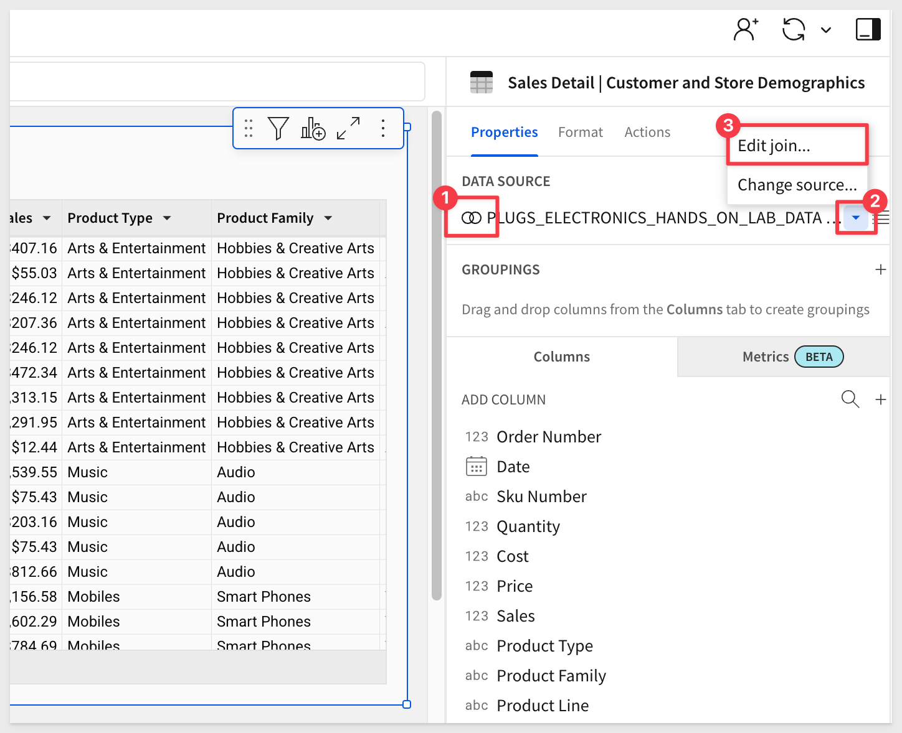
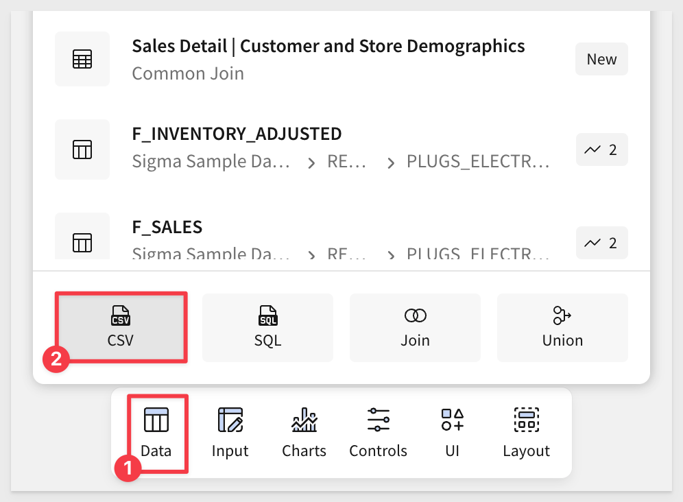
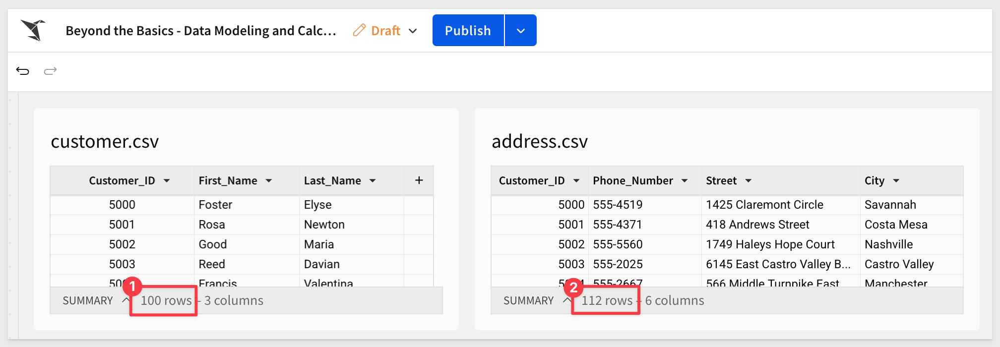
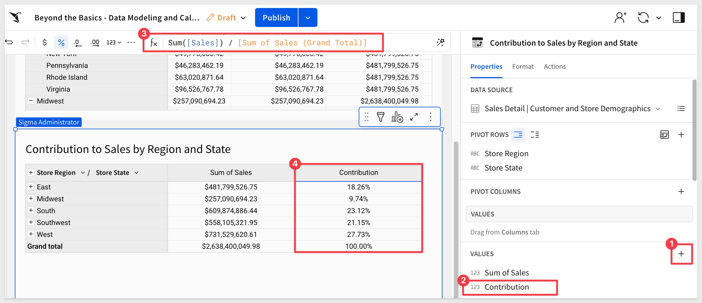

author: pballai
id: fundamentals_9_beyond_the_basics_v3
summary: fundamentals_9_beyond_the_basics_v3
categories: Fundamentals
environments: web
status: published
feedback link: https://github.com/sigmacomputing/sigmaquickstarts/issues
tags: default
lastUpdated: 2025-03-13

# Fundamentals 09: Beyond the Basics

## Overview 
Duration: 5 

This QuickStart covers some of the most common questions we receive from Sigma customers.

It is not comprehensive, but is intended to present topics that often arise after users have completed the [QuickStart Fundamentals](https://quickstarts.sigmacomputing.com/?cat=fundamentals) and begin using Sigma with their own data.

We welcome feedback and suggestions on additional QuickStart topics that may interest you. 

If you have comments, feel free to [open an issue here.](https://github.com/sigmacomputing/sigmaquickstarts/issues)

<aside class="positive">
<strong>IMPORTANT:</strong><br> Some screens in Sigma may appear slightly different from those shown in QuickStarts. This is because Sigma is continuously adding and enhancing functionality. Rest assured, Sigma’s intuitive interface ensures that any differences will not prevent you from successfully completing any QuickStart.
</aside>

For more information on Sigma's product release strategy, see [Sigma product releases](https://help.sigmacomputing.com/docs/sigma-product-releases)

If something is not working as you expect, here is how to [contact Sigma support](https://help.sigmacomputing.com/docs/sigma-support)

<aside class="positive">
<strong>IMPORTANT:</strong><br> Some features may carry the "Beta" tag. Beta features are subject to quick, iterative changes. As a result, the latest product version may differ from the contents of this document.
</aside>

### Target Audience
Sigma users who have recently completed the [QuickStart Fundamentals](https://quickstarts.sigmacomputing.com/?cat=fundamentals) or have some experience using Sigma in general. 

### Prerequisites

<ul>
  <li>A computer with a current browser. It does not matter which browser you want to use.</li>
  <li>Access to your Sigma environment.</li>
  <li>Some familiarity with Sigma is assumed. Not all steps will be shown as the basics are assumed to be understood.</li>
</ul>

<aside class="positive">
<strong>IMPORTANT:</strong><br> Sigma recommends using non-production resources when completing QuickStarts.
</aside>

<button>[Sigma Free Trial](https://www.sigmacomputing.com/free-trial/)</button>
 


## A Simple Join
Duration: 5 

Sigma makes simple data modeling highly user-friendly, as we will demonstrate using sample data.

For those looking for a more comprehensive data modeling solution, see [Fundamentals 10: Data Modeling](https://quickstarts.sigmacomputing.com/guide/fundamentals_10_data_modeling/index.html?index=..%2F..index#0)

Log into Sigma and create a new workbook.

Add a new `Table` from the `Element bar` > `Data` group.

In the search bar, enter `Hands` and select the `PLUGS_ELECTRONICS_HANDS_ON_LAB_DATA` table, from the `RETAIL` schema:


At this point, we have `1 source` that has about `4.5 million rows` of data in `22 columns`.

This data currently has retail transaction data, but let's assume we want to add additional customer demographic and store data to it. This will allow users to leverage one table to drive a variety of user cases.

Open the tables menu and select `Element source` > `Join`:


We are now in the `Create join` interface. 

We know the data is available in two additional tables, so we need to join them. 

In the search bar, enter `d_customer` and select the `D_CUSTOMER` table from the `RETAIL` schema:


Deselect all columns and select only the columns required by the business users. Click `Select`:


<aside class="positive">
<strong>IMPORTANT:</strong><br> It is best practice to select only the columns necessary to achieve the required functionality. Doing this can potentially reduce warehouse cost and optimize performance. 
</aside>

The numbered items in the screenshot below highlight the important elements on this interface.

- 1: The join is 2 source tables with a combined 26 columns.
- 2: We are joining `D_CUSTOMER` to `PLUGS_ELECTRONICS_HANDS_ON_LAB_DATA` on `Cust Key` using `Left outer join`.
- 3: For every order in the `PLUGS_ELECTRONICS_HANDS_ON_LAB_DATA.` sales table, `D_CUSTOMER` has a matching customer. There are some customers (105) that have not placed an order.


We could now click `Preview output`, but our requirement was to also provide store detail. Click the `+` icon to add another table.

In the search bar, enter `D_STORE` and select the `D_STORE` table.

Ensure you select the `D_STORE` table from the `RETAIL` schema. This time, we will include all columns; click `Select`:


We now have `3 sources - 41 columns`, and should be matching on `Store_Key` (change if not), and every sales has a matching store and customer:


Click `Preview output`.

We are presented with the `lineage`, that graphically represents how our data is joined:


Click `Done`.

Notice that the row count still has the expected value (around 4.5 million rows) that we had at the start. This makes sense since the base table is retail sales, each sale having a customer and a store. 

<aside class="positive">
<strong>IMPORTANT:</strong><br> Paying attention to how your join affects row count can be a clue to potential problems in join types, join keys or other configuration issues. 
</aside>

Our joined tables have a generic name; change the name of the new table to something more descriptive. We used `Sales Detail | Customer and Store Demographics`.

<aside class="negative">
<strong>NOTE:</strong><br> For readers less familiar with impact of different join types, there is built in help to guide you in selecting the best choice for your needs.
</aside>

Add a new column, rename it to `Sales` and set its formula to:
```code
Sum([Quantity] * [Price])
```

Change the format of the `Sales` column to `Currency`.

We need this column in later sections.

Also click `Save As` and name the workbook `Beyond the Basics - Data Modeling and Calculations`.

Sigma makes it easy to see that this data originates from joined tables (number 1 in the screenshot). 
Editing the join is equally simple (number 2/3):



Rename the `Page 1` tab to `Common Join`, then `Publish` the workbook.


<!-- END OF SECTION-->

## Unexpected Join Results
Duration: 5 

A common request we get to our support team is how to handle data that is "dirty" or has problems that are exposed as tables are joined together. 

<aside class="negative">
<strong>NOTE:</strong><br> Not all data is "dirty" and joins that seem to behave normally can still contain data that is "dirty" too. 

This demonstration will deal with a simple example and approach, but we understand this can also be confused with solving the problem, which often can go deeper upon closed inspection of the detail data. 
</aside>

While there are many possibilities in this area, we will present a simple example, using two CSV files. When these files are imported into Sigma and joined, there will be duplicate rows. We need to know how to easily identify them, and a method to deal with them.

<aside class="negative">
<strong>NOTE:</strong><br> The methods shown are a simulation using sample data and only one way of handling this issue. There are other possibilities depending on the specifics of your data and warehouse too. Feel free to contact Sigma support to discuss your specific use case; we are here to help. 
</aside>

Before we can do anything, we need to download the sample CSV files. These are really small samples, so the files are equally small in size.

<button>[Download Sample Data](https://sigma-quickstarts-main.s3.us-west-1.amazonaws.com/csv/Fundamentals-8-Beyond-the+Basics.zip)</button>

Once the compressed file is downloaded, extract the csv files. 

<aside class="negative">
<strong>NOTE:</strong><br> There are a few extra csv files included. These are for later on in this QuickStart.
</aside>

The two files we are interested in are:

- **customer.csv:** This is a list of 100 random first and last names with a unique customerID per row.
- **address.csv:** This is a list of randomly generated US addresses, each with a customerID that corresponds to the customer.csv table. 

### Marketing promotion
Let's assume that this data is coming from a promotion that marketing is running for new customers only. There is a web site that allows registration, and new customers are informed that they can only register one time for the promotion, although the web site does not actually enforce that restriction.

Sounds pretty straight-forward so far, but lets see what happens when we import these into Sigma and join them together.

### Import and Join
We already joined data in the first section, so the steps in Sigma are mostly the same, except this time we will use the csv files as sources instead of Sigma's sample data.

In Sigma, return to the workbook and add a new page. Rename it to `Dirty Data`. 

Add a new table to the page, but this time, select the `CSV` option:



Drag and drop (or browse to find) the `customer.csv` file from the extracted download:


Sigma will show us the contents of the file. Click `Save`.

The file is imported and we can see the three columns mentioned earlier. Notice that the icon for the table (#2 in the screenshot) indicating that it's source was a CSV. These icons are good to know.


Repeat the same process, but this time use the `address.csv` file as the source of data:



We now have the two files as tables in Sigma. If we take care to observe the row counts for each table, we may notice that there are 100 customers, but 112 addresses. There are cases where that may be fine, however it largely depends on the context in which this data is being used. 

While this is a clue that there may be some problems, lets join them and see what happens in Sigma. 

Add another table, but this time select `Join` as the source:


Our `customer.csv` table will be on the list under `Elements`; select that and click `Select`.

In the `Create join` interface, click the `+` to add another source:


Our `address.csv` table will be on the list; select that and click `Select`.

We are now in the familiar `Create join` interface, where we can adjust the join conditions to suit our needs. 

We can leave all columns selected, as that is not important for this demonstration.

What is important is that Sigma has identified that there are join keys in both tables that have more than 1 match.

This may not always be a problem as discussed, but is another clue that we need to be ready to verify the results against our expectations.


Click `Preview output` and then `Done` on the next (lineage) screen:


<aside class="positive">
<strong>IMPORTANT:</strong><br> It is at this point where we see that the join has resulted in 112 rows of data. If we use this new table as a source to join additional tables, the 12 extra rows may produce an escalating problem as more joins are added. 
</aside>

We need to resolve this issue now before it escalates.


### Identify, Organize and Action
Lets dig deeper into the data and see what we find.

Rename the new table to `Customers and Addresses` for clarity.

#### Sorting
Sort the table, `ascending` on `CustomerId`.  

We can now see that `CustomerID 5000` has multiple entries, and upon closer inspection has registered the same address with different phone numbers:


#### Grouping
Grouping the table on `Customer_ID` we can now scroll down to see which other customers have multiple entries in the table. 

For example, CustomerID 5049 and 5054 both have more than one entry:


<aside class="positive">
<strong>IMPORTANT:</strong><br> In our sample table, the extra rows are created because the same CustomerID has different phone numbers. The same situation can occur in many other ways too. For example, the same Customer_ID may have more than one address or the address may even have slightly different spelling in two tables that were joined. Data can become "dirty" in so many different ways but the result is always the same when tables are joined; an unexpected "explosion" of rows. 

In the case of our marketing promotion, we suspect these three customers are "gaming the system", by registering multiple times, with different phone numbers.
</aside>

#### One path forward
How can we address the extra registrations and report the "dirty data" back to the data team, so they can clean it up at the source as well?

There is a simple way to handle the extra registrations that resulted from the join, using the [RowNumber() function](https://help.sigmacomputing.com/docs/rownumber).

Add a new column outside of the grouping set its formula to:
```code
RowNumber([Customer_ID])
```

Sort the table by the new column:


Now we can see how many times each `Customer_ID` appears in the table.

Additionally, we can filter on the new `Row_Number` column, and set the maximum value to `1`, to filter out the extra rows. 

Notice that we now have the expected 100 rows of data too:


While this may solve our immediate needs, it doesn't resolve the dirty data issue and it would be ideal if we could help with that too.

Duplicate the `Customer and Addresses` table and rename the new table to `Dirty Data`:


Set the filter on the `Dirty Data` table to show only the "bad" rows:


These are the 12 registrations we want to alert the data team about.

`Publish` the workbook.

#### Conditional alerts
Lets assume this is a workflow that will run for some time, with new records being added as new customers register for the promotion.

We want to both alert the data team and attach the new records that have more than one entry for the same Customer_ID (for example).

Now we can simply click the dropdown arrow next to the title, select a `Schedule exports` and share this with the data team, if the table has any data:


After clicking `Add schedule`, we want to scroll down to enable `Condition` and the rest is very straight-forward:


Based on our schedule, anytime there are new extra rows in the `Dirty Data` table, the data team will get an email with the list attached in Excel. Of course, there are other methods supported too, so that the process of remediation can be automated to suit your organization's needs.

To learn more about [scheduling exports, see here.](https://help.sigmacomputing.com/docs/schedule-a-conditional-export-or-alert)


<!-- END OF SECTION-->

## Full Outer Join
Duration: 5 

Another very common use case is finding the data that is common between `Table A` and `Table B`,  what appeared in `Table A` that did not appear in `Table B`, and vice versa.

For example, maybe we want to find customers (common to both tables), new customers (unique to Table B), and churned customers (unique to Table A).

Using unions in Sigma is very simple, and the workflow is basically the same as we have already done.

In our use case, we have already found and handled customers who registered multiple times. However, our promotion is for new customers only, so we need a way to check against our existing customer table too.

On the `Dirty Data` page, create a duplicate of the `Customers and Addresses` table, ungroup the data and rename the table `Customers and Addresses Ungrouped`.

Also disable the filter:


Create a new page in the workbook, and rename it to `Full Outer Join`.

Add the `D_CUSTOMER` table to the page.

Now that we have `D_Customer`, we can add a join directly from it.

In `Elements`, select the `Customers and Addresses Ungrouped` table from the `Dirty Data` page:


Set the `Join type` to `Full outer join`:


Our `Customers and Addresses Ungrouped` table will not have `Customer_ID` values that match to our `D_Customers` table, as they are coming from our website promotion, which was unaware of our internal customers data.

In our use case, we want to ensure that the person registering is not an existing customer, so perhaps we can check their name and address against our existing customer data to see if there is a match (for example). While this may not be a perfect method, it will get us close enough for this demonstration.

Set the `Join keys` to:
```code
Cust Address = Street
```

To avoid people with the same names, we need to add a second `Join key` and use a custom formula that concatenates the first and last names of the customer in the `Customers and Addresses Ungrouped` table, since they are separate columns.

The second join key is on `Cust Name` and the formula:
```code
[First_Name] & " " & [Last_Name]
```

<aside class="positive">
<strong>IMPORTANT:</strong><br> Sigma allows the use of formulas and operators in join keys. This allows joins to perform complex operations similar to that of custom SQL, but using a method that is more familiar to users of Excel or Google Sheets.
</aside>

For more information about [operators in Sigma, see here](https://help.sigmacomputing.com/docs/operators-overview)

Click `Preview` and `Done`.

Add a `New column`, rename it to `Exists In` and set its formula to:
```code
If(IsNull([Street]), "Exists ONLY in D_CUSTOMER", IsNull([Cust Address]), "Exists ONLY in CSV", "Exists in BOTH")
```

This formula is used to determine where a particular record exists by checking if certain fields are empty (null). 

It returns the custom text if a record exists only in the D_CUSTOMER table, only in the CSV file, or in both.

Set a filter on the new `Exists in` column and check the box for `Exists in both`:

We can now see that there is one row of data that is common to both, which means that this user both registered for the promotion and is an existing customer. 


Not only was this pretty simple, it underscores some of the power of Sigma.


<!-- END OF SECTION-->

## Union Tables
Duration: 5 

For this demonstration, let's assume that each month we receive sales data for the previous month in .CSV format. We need to report against the quarter, so we need to first join this data together.

We have previously added table elements based on .CSV file uploads, so we can do this ourselves now.

Create a new page in our `Beyond the Basics - Data Modeling and Calculations` workbook, and rename it to `Union`.

In our sample data that we downloaded earlier, upload the three .CSV files as new tables. When done, our new page should look like this:


Now that we have the data in Sigma, we can add a new `Table` and select the `Union` option:


For the source of data, we will use the tables we just imported:


Because we selected `Union`, Sigma now gives us the option to add more sources:


This page also allows us to change the column mapping should it be required.

Click the `+` to add the next source table, this time selecting the `Feb Sales.csv` table.

Repeat the process one more time to add the `Mar Sales.csv` table. The result will look like this:


Notice that there is no match in the `Mar Sales.csv` data for `Profit`?

While this is a problem, we can still complete the union. Sigma will add `null` values to the cells with no match. 

Click `Done`.


Instead of reporting the issue, we can simply change the `Profit` column's formula to calculate the correct profit:
```code
([Price] * [Quantity]) - [Cost]
```
<aside class="negative">
<strong>NOTE:</strong><br> The calculation shown here is done so for example only. Your organization may have standard calculations (metrics) that need to be adhered to, in order to ensure consistent results.
</aside>

Now we have the data for the quarter, ready for analysis.

Rename the new table `Q1 Sales Detail`.

Click `Publish`.

### Lineage
As workbooks become more complex, it can be really useful to see graphically how the data is sourced. 

Sigma provides this `Lineage` automatically and it is accessed by clicking the icon in the lower corner of the workbook:


Because we had the `Q1 Sales Detail` table selected, the lineage is focused on that. `Show control` will also make any Sigma control elements in the workbook appear:


For more information, see [View workbook data lineage.](https://help.sigmacomputing.com/docs/workbook-data-lineage)


<!-- END OF SECTION-->

## Period over Period
Duration: 5 

If you have ever had to do "date math" in SQL or other tools, you have probably found it frustrating. It can be really challenging, as it requires both a good understanding of the data and the proper use of tools to ensure the correct result.

Sigma has added functionality to directly address this, giving users a simple workflow to make it easy, while retaining the ability to manually adjust calculations too.

Create a new page and rename it to `Period over Period`.

Add a new `Table` element to the page, reusing the `Common Join` > `Sales Detail | Customer and Store Demographics` table on the `Common Join` page.

Rename the new table `Period over Period`.

Now click on the `Order Number` column's menu and select `Add column via` > `Period over period comparison`


This provides us a simple way to `Add Comparison` to our table.

We can easily sum `Sales` and also select to compare the `Date` columns value to the `Same quarter last year`:


<aside class="positive">
<strong>IMPORTANT:</strong><br> Sigma automatically provides a long list of time comparison options. This saves you time you would otherwise have to spend manually writing formulas.
</aside>

Also check the `Output` boxes on for `Difference`, `% difference` and `Value`. This will create columns for each of these options.

<aside class="negative">
<strong>NOTE:</strong><br> Columns that are "created" in this way in Sigma are added by making calculations in your local browser. They are not stored in your cloud data warehouse and do not affect your source data in any way.
</aside>

Click `Done`.

What happened? 

Sigma grouped the table by `Quarter of Date` (number 1 in the screenshot below) and added the results of three new calculated columns (number 2).

Click the `+` icon (number 4) to collapse the table's detail data:


Click on the column `Sum of Sales (1 year ago)` to see its formula, which is:
```code
DateLookback(Sum([Sales]), [Quarter of Date], 1, "year")
```

The Sigma function [DateLookback](https://help.sigmacomputing.com/docs/datelookback) is what is working behind the scene to make this possible.


If you need more information on functions in Sigma, we have included a link for your convenience:


There is also a QuickStart on [Common Date Functions and Use Cases.](https://quickstarts.sigmacomputing.com/guide/common_date_functions_and_use_cases/index.html?index=..%2F..index#0)

`Publish` the workbook.


<!-- END OF SECTION-->

## Cumulative Sum
Duration: 5 

The cumulative sum function in Sigma helps solve problems related to tracking the running total of a set of values over time or across a sequence of data points. 

This is particularly useful in scenarios where you want to observe trends, changes, or cumulative impacts over a period.

By using the cumulative sum function, Sigma allows users to convert individual data points into an aggregated running total, which provides a clearer view of trends and patterns over time, making data analysis more insightful.

For example, you may need to analyze cumulative sales figures to understand how sales build up over days, weeks, or months, allowing for better forecasting and performance tracking.

<aside class="positive">
<strong>IMPORTANT:</strong><br> We want to create a solution that does not require on-going maintenance as the years change. This is both a time-waster and also may not get done, creating user frustration.
</aside>

Let's dig into that example, using our sample data.

Create a new page in workbook, and rename it to `Cumulative Sum`.

Add a new `Table` element to the page, reusing the `Sales Detail | Customer and Store Demographics` table on the `Common Join` page.

Add a new column and set it's formula to:
```code
DatePart("year", [Date])
```

This will give us just the `year` from the `Date` column.

Repeat this for another new column and set the formula to get the `month` this time:
```code
DatePart("month", [Date])
```


`Group` the table by `Year of Date`

Add another `Grouping`, this time using `Month of Date`:


Add the `Sales` columns to the `Month of Date` > `CALCULATIONS` and change it's name to `Monthly Sales`:

`Hide` all the other columns.

Rename the table to `Cumulative Sales`.

Our table now shows each `year` and `month`, grouped together:


Add another column under next to `Monthly Sales`, setting the it's formula to:
```code
CumulativeSum([Monthly Sales])
```
Our table now matches the screenshot below. Notice how the values in `CumulativeSum of Monthly Sales` build upon the previous cell's value?

For example, the value for `2024-1` just it repeated for `CumulativeSum of Monthly Sales`.

The value for `2021-1` is added to the the previous `CumulativeSum of Monthly Sales` value, and so on, until the year changes to `2022`, when the pattern restarts:


This is pretty cool, but business users would prefer to see this graphically. We can do that with a line chart.

`Publish` the workbook.

### Visualize it

Click to add a `Child` > `Chart` from the `Cumulative Sales` table:


Configure the line chart as shown:


We can clean up the legend formatting of the year. From the `Year of Date` column, select `Format` and then `Custom`:


and


Now, users can easily see how sales are doing year over year and month over month:


When it goes into a new year, a new data point will be made with a different color, and we never have to touch this chart again, to account for the new year.


<!-- END OF SECTION-->

## Pivot Tables
Duration: 5 

Lets take a look at a few areas of using pivot tables that customers contacting Sigma support frequently ask about.

### Setup our pivot
Create a new page in our workbook, and rename it to `Pivot Table`.

Add a new `PIVOT TABLE` element to the page, reusing the `Sales Detail | Customer and Store Demographics` table on the `Common Join` page.

Configure the new pivot as shown:


At this point, we have a simple pivot table.

<aside class="positive">
<strong>IMPORTANT:</strong><br> It is important to understand that Sigma is performing some additional calculations that are being created in the background, as we configure our pivot table. We can use these calculations in other calculations or expose their values, as is, in our pivot table.
</aside>

### Expose background calculations as columns
Add a another copy of the `Sales` column, in the `VALUES` section:


Change the column's formula by typing in `[Sales` and selecting `[Sum of Sales (Row Total)]` from the list of available:


Repeat the process, adding `[Sum of Sales (Parent Row Total)]` and `[Sum of Sales (Grand Total)]`.

After a little column renaming, our table looks like this:


`Publish` the workbook.

This is mildly interesting, but how are these automatically generated values useful in practice?

### Use background calculations in a pivot
Duplicate the existing pivot table, renaming the new one to `Sales with Contribution`.

Delete the three extra columns in the `VALUES` element panel, leaving `Sum of Sales`.

Out pivot currently shows sales at both the `Store Region` and `Store State` level.

Lets assume we also want to know what each region and states contribution is to that `Total` of `2,638,400,049.98`. 

<aside class="negative">
<strong>NOTE:</strong><br> Your total may be different. Sigma adjusts our sample data to account for dates moving forward into the future.
</aside>

We can do that easily by leveraging one of the background calculations that we just reviewed.

Add a new column in the `VALUES` section of `PIVOT COLUMNS` and set it's formula to:
```code
Sum([Sales]) / [Sum of Sales (Grand Total)]
```

Rename the new column `Contribution` and set its format to `Percentage`:



Rename the new pivot `Contribution to Sales by Region and State` and `Publish` the workbook.

For more information, see [Working with pivot tables](https://help.sigmacomputing.com/docs/working-with-pivot-tables)

There is also a QuickStart, [Fundamentals 4: Working with Pivot Tables v2](https://quickstarts.sigmacomputing.com/guide/fundamentals-4-working-with-pivot-tables-v2/index.html?index=..%2F..index#0)


<!-- END OF SECTION-->

## What we've covered
Duration: 5

In this QuickStart, we covered some of the more common questions we receive from Sigma customers.

**Additional Resource Links**

[Blog](https://www.sigmacomputing.com/blog/)<br>
[Community](https://community.sigmacomputing.com/)<br>
[Help Center](https://help.sigmacomputing.com/hc/en-us)<br>
[QuickStarts](https://quickstarts.sigmacomputing.com/)<br>


Be sure to check out all the latest developments at [Sigma's First Friday Feature page!](https://quickstarts.sigmacomputing.com/firstfridayfeatures/)
<br>

[](https://twitter.com/sigmacomputing)&emsp;
[](https://www.linkedin.com/company/sigmacomputing)&emsp;
[](https://www.facebook.com/sigmacomputing)


<!-- END OF WHAT WE COVERED -->
<!-- END OF QUICKSTART -->
