author: pballai
id: fundamentals_11_pixel_perfect_reporting
summary: fundamentals_11_pixel_perfect_reporting
categories: fundamentals
environments: web
status: published
feedback link: https://github.com/sigmacomputing/sigmaquickstarts/issues
tags: default
lastUpdated: 2026-01-06

# Fundamentals 11: Pixel Perfect Reporting

## Overview
Duration: 5

Pixel Perfect Reporting (PPR) has been a cornerstone of business intelligence for decades, enabling organizations to create precisely formatted, print-ready reports. While PPR is well-established across BI platforms, Sigma revolutionizes the experience with **extreme ease of use** and the power of cloud-scale data.

In this QuickStart, you'll explore how Sigma makes creating professional, branded reports effortless—without sacrificing the precision and control that pixel-perfect formatting demands. Using a real-world example of an annual report for Plugs Electronics (a fictional retailer), you'll see how Sigma combines intuitive design with enterprise-grade capabilities.

### Common use cases for Pixel Perfect Reports

Across industries, organizations rely on pixel-perfect reports for scenarios where formatting, branding, and precise layout are critical:

**Financial Services & Compliance**
- Regulatory filings and compliance reports (SEC, SOX, etc.)
- Quarterly and annual financial statements
- Audit documentation and trail reports
- Client portfolio statements and performance summaries

**Healthcare & Life Sciences**
- Patient discharge summaries and medical reports
- Lab results and diagnostic reports
- Insurance claims and explanation of benefits (EOB)
- Regulatory compliance documentation (HIPAA, FDA)

**Retail & Consumer Goods**
- Sales performance reports by region and store
- Inventory and supply chain reports
- Customer invoices and statements
- Executive dashboards for board presentations

**Manufacturing & Operations**
- Production reports and quality control documentation
- Maintenance and equipment performance reports
- Supply chain and logistics reports
- Safety and compliance reporting

**Professional Services**
- Client invoices and billing statements
- Project status reports and deliverables
- Contract summaries and legal documentation
- Performance analytics for stakeholder reviews

### Why Sigma for Pixel Perfect Reporting?

While traditional PPR tools require extensive technical expertise and manual formatting, Sigma offers:

- **Intuitive Design**: Build reports using familiar spreadsheet-like controls
- **Cloud-Scale Data**: Connect directly to your data warehouse without extracts
- **Dynamic Content**: Reports update automatically with live data
- **Email Bursting**: Automatically distribute personalized reports to hundreds or thousands of recipients
- **Brand Control**: Maintain precise formatting, colors, fonts, and layouts
- **Export & Schedule**: Generate PDFs on-demand or via automated schedules

<aside class="positive">
<strong>IMPORTANT:</strong><br> Some screens in Sigma may appear slightly different from those shown in QuickStarts. This is because Sigma continuously adds and enhances functionality. Rest assured, Sigma's intuitive interface ensures that any differences will not prevent you from successfully completing any QuickStart.
</aside>

For more information on Sigma's product release strategy, see [Sigma product releases](https://help.sigmacomputing.com/docs/sigma-product-releases)

If something doesn't work as expected, here's how to [contact Sigma support](https://help.sigmacomputing.com/docs/sigma-support)

### Target Audience
This QuickStart is designed for report writers, business analysts, and anyone interested in delivering professional pixel-perfect reports more easily—while leveraging data at scale and advanced features like email bursting.

### Prerequisites

<ul>
  <li>Any modern browser is acceptable.</li>
  <li>Access to your Sigma environment.</li>
  <li>Some familiarity with Sigma is assumed. Not all steps will be shown, as the basics are assumed to be understood.</li>
</ul>

<aside class="positive">
<strong>IMPORTANT:</strong><br> Sigma recommends using non-production resources when completing QuickStarts.
</aside>

<button>[Sigma Free Trial](https://www.sigmacomputing.com/free-trial/)</button>

<aside class="negative">
<strong>IMPORTANT:</strong><br> Some features may carry a "Beta" tag. Beta features are subject to quick, iterative changes. As a result, the latest product version may differ from the contents of this document.
</aside>


## Create a New Report
Duration: 5

In this section, we'll create a new Sigma report and prepare it for our Plugs Electronics annual report. Creating a report is not too different from creating anything else in Sigma. We designed it this way to make it really easy to get going quickly. 

Log into Sigma and click the `Create new` button and select the `Report` type.

The layout for the page is very similar to a workbook with an element bar, element panel on the left. What is different is the left sidebar which allows us to navigate the pages of our report. Since this is new, there is one blank page to start.

It is a good idea to configure the preferred settings that will apply to the report in general. 

For our report, we will just use most of the default settings, but we could use a theme too.  

<aside class="negative">
<strong>BEST PRACTICE:</strong><br> Create a standard report theme to be used on all reports for your organization.
</aside>

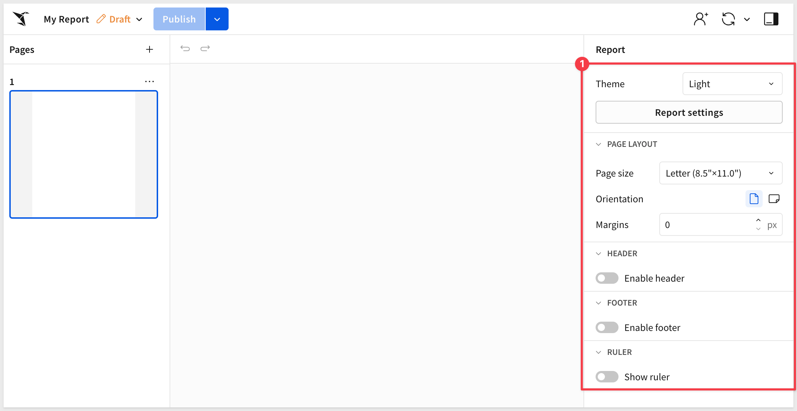

We want our report to have the page count in the footer, so enable the `Footer`:

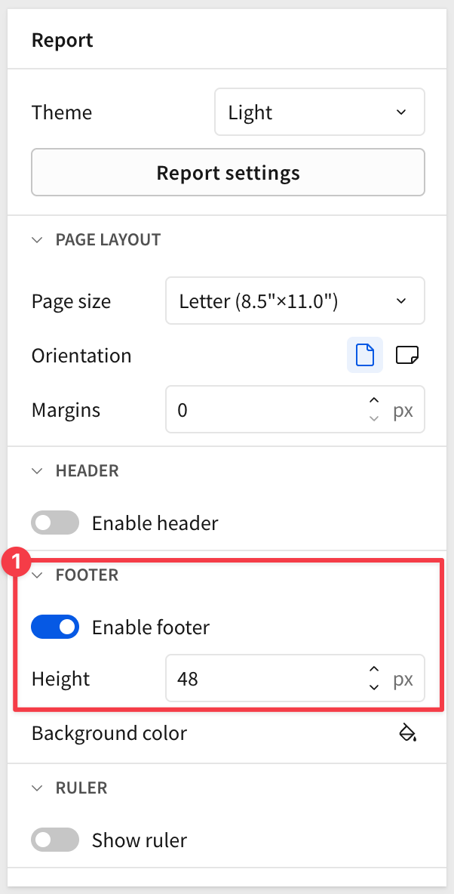

Add the `Page number` control to the footer:

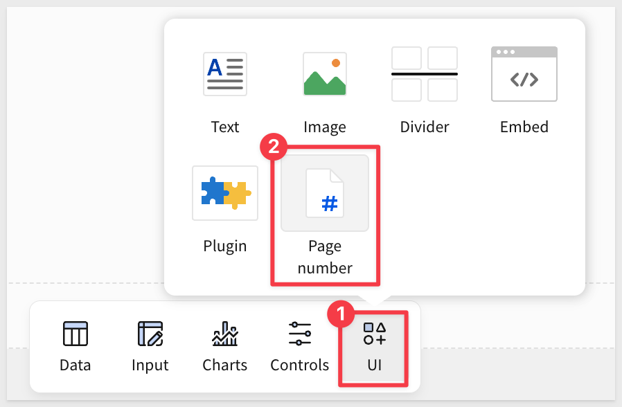

We can center the text by dragging the left and right bounding box to the edges of the page and then centering the text:

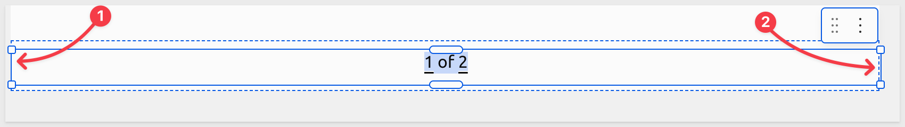

The footer (and header too) areas are automatically repeating on all pages.

We can also get more granular by clicking the `Report Settings` button. 

For example, in the `FONT` section, we can set our text and data font to `Ubuntu`:

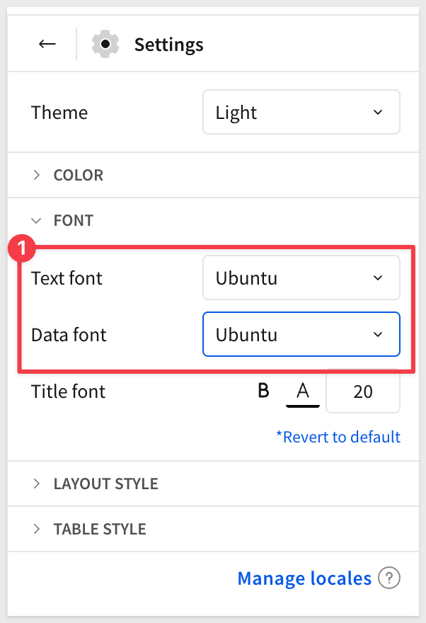

In the `LAYOUT` section we can enable `Padding`.

In the `TABLE STYLE` section, notice that the preferred font was automatically changed to `Ubuntu`, but we can change it if we like for each section of a table.

### Source data
Reports can be built in many ways but it is helpful to first build a page to hold our source data. This allows us to reference it in elements we add to other pages later. 

<aside class="negative">
<strong>IMPORTANT:</strong><br> Just like in a workbook, the data page in a report will be marked `hidden` so that we can use the data but it is not exposed in the published report. 
</aside>

Using the `Element bar` select `Data` > `Table` search for `Hands` and select the `PLUGS_ELECTRONICS_HANDS_ON_LAB_DATA` table from the `RETAIL` > `PLUGS_ELECTRONICS` schema:

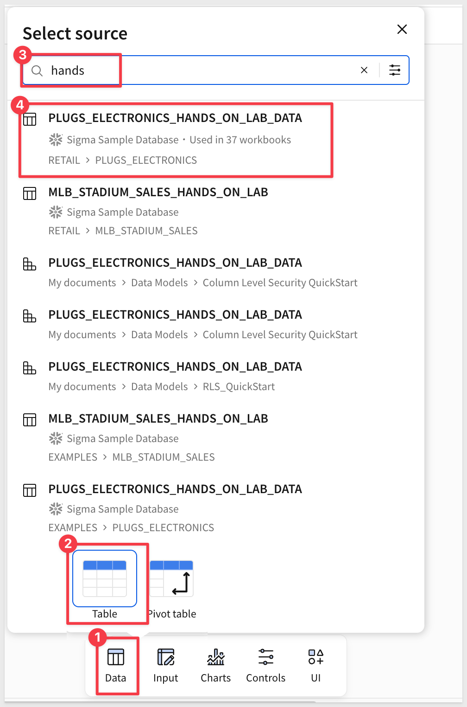

Working with the table is no different than in a workbook. 

Add a new column and set its formula to:
```code
([Price] * [Quantity]) - [Cost]
```

Group the table by `Store Name`.

Move the `Calc` column that we just added to the `CALCULATIONS` under the `Store Name` group and rename the column to `Store Profit`.

Set it to currency and remove the trailing cents:

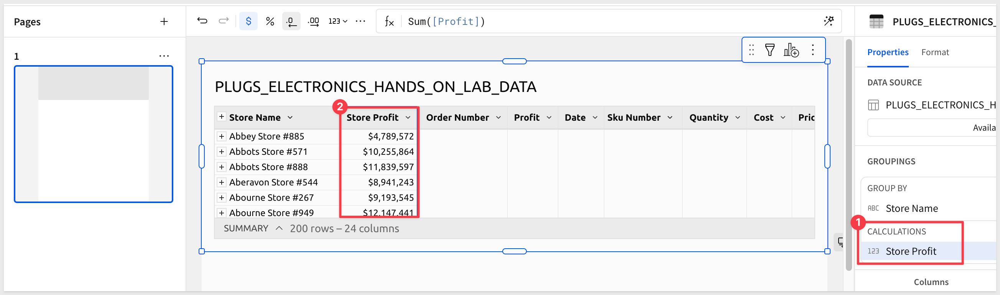

Also make sure to rename the `Calc` column in the list of table columns to `Profit`.

Add a filter on the `Region` column and select `Southwest`:

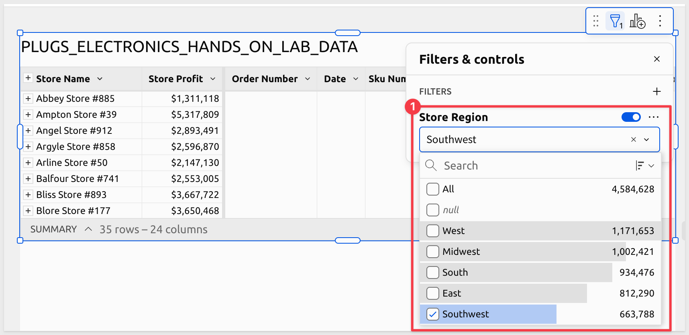

Convert the filter to a `page control` and note that its `Control ID` is `Store-Region`.

### Table summaries
We also need some additional metrics from the table so that we can expose them in the report. We will use the table's `SUMMARY` feature for that.

At the base of the table, click the `^` icon and then the `+` icon to the right of `SUMMARY`, click `+ New Summary` from the menu and set the formula to:
```code
Round(SumIf([Profit], Year([Date]) = 2024), -3)
```

Rename the new summary to `2024 Profit`.

Add three more summaries using the following formulas and names:
```code
Formula                                                    Name
Round(SumIf([Profit], Year([Date]) = 2023), -3)            2023 Profit
CountDistinctIf([Order Number], Year([Date]) = 2024)       2024 Orders
CountDistinctIf([Order Number], Year([Date]) = 2023)       2023 Orders
```

When done, the summary row will look like this:

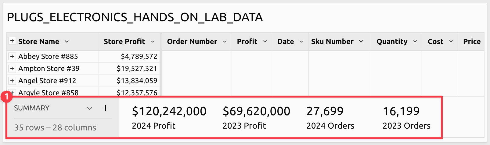

### Add a single page header
Using the `Format` menu, enable padding (if not already enabled) and set a 1px black border.

While doing this, we see a new section that allows us to control the `POSITION` of the selected element (the table) by one pixel increments. This allows us to achieve the fine control required to produce our pixel-perfect report. Since this page is intended to be hidden, we don't need to configure that. 

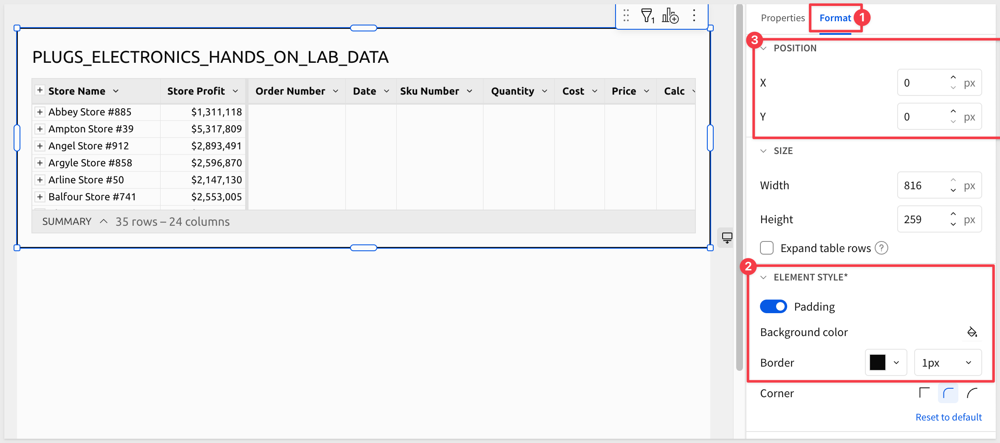

Let's add a `UI` >`Text` element to the page to let other editors understand what this page is for.

If you have ever built workbooks in Sigma, you will immediately see a difference. The new text control does not automatically try to prevent interfering with other page elements. This is by design as we have ultimate control of elements on the page. 

We do have to be really careful to design our layout exactly as we want it to appear in the report.

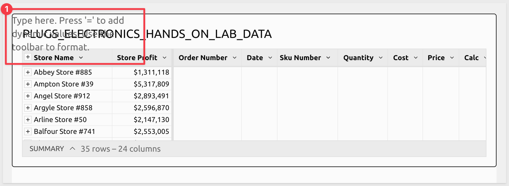

Fortunately, that is easy enough in Sigma, so we can drag the control and table under the text and get the design we prefer. 

Use this text for the new element:
```code
This is the source data page and should be hidden at all times.
```

After some minor font styling we have:

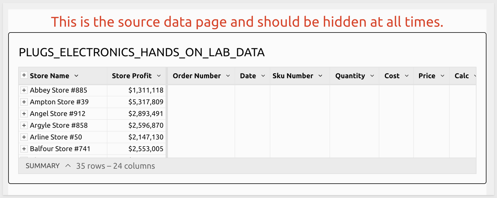

<aside class="negative">
<strong>NOTE:</strong><br> Since this text is not technically a `header`, it is not repeating on other pages. 
</aside>

Before going any further, **rename** the report to `Pixel-Perfect Annual Report QuickStart` and click `Publish`. 


<!-- END OF SECTION-->

## Build the Cover Page
Duration: 10

With some of the basics covered, let's add some branded headers with the Plugs Electronics logo, and background images. 

Add a second page:

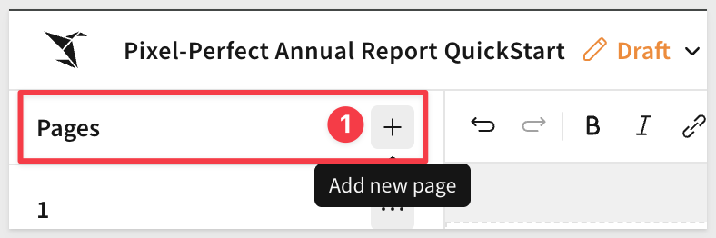

Enable the page header and place the `Plugs logo` in the upper left corner using an `UI` >`Image` element from the element bar.

Configure the image to use this `URL`:
```code
https://sigma-quickstarts-main.s3.us-west-1.amazonaws.com/shared_images/plugs_logo.png
```

Since the logo background is white, we can change the `Header` background to match:

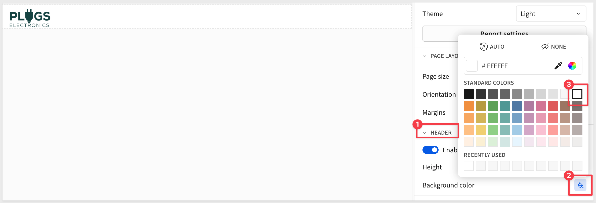

We can add more images but we can also use the `Text` element and change its background color to add styling too.

Add a `UI` > `Text` element to the first page, under the header section and change its color (whatever you prefer is fine).

Resize the text elemenmty to cover the page top to bottom.

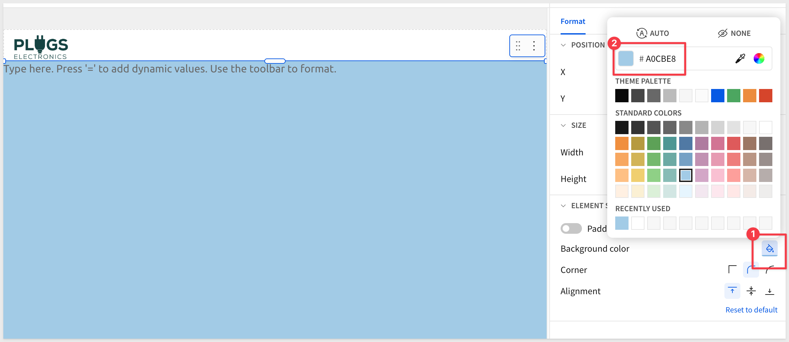

Now let's add a `UI` > `Image` and use this URL:
```code
https://sigma-quickstarts-main.s3.us-west-1.amazonaws.com/shared_images/artificial-intelligence-3382507_1280.jpg
```

Configure the image:

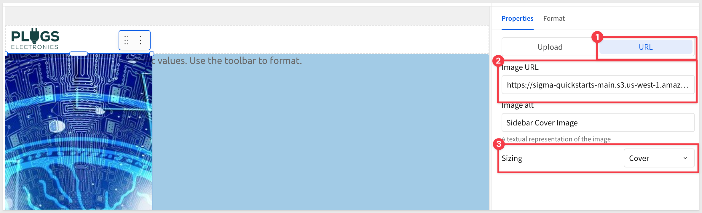

Resize the image to cover the page top to bottom, but only the left portion of the page.

### Add a dynamic report title
When we created the data page, we set a filter on the table, targeted at the Southwest region. That's cool but reports are usually distributed automatically (using email typically) and we want the report title to reflect the region that it is delivered to. We can leverage that region filter to accomplish this dynamically. 

For example, we add a `UI` > `Text` element to the cover page and for its value, press `=` and use the following formula:
```code
Upper(Coalesce([PLUGS_ELECTRONICS_HANDS_ON_LAB_DATA/Store Region], "Group"))
```

<aside class="positive">
<strong>FORMULA EXPLANATION:</strong><br>
The formula above returns the store region in uppercase, with a fallback.

Specifically:
- If [Store Region] has a value → return it in ALL CAPS
- If [Store Region] is null → return "GROUP" (also in caps)

Coalesce handles the null fallback, and Upper normalizes the casing so the output is consistent.
</aside>

When we configure scheduled report delivery, we can use the `Store-Region` control value to target the correct region for a set of recipients. More on that later.

We can add some text before and after the formula as shown:

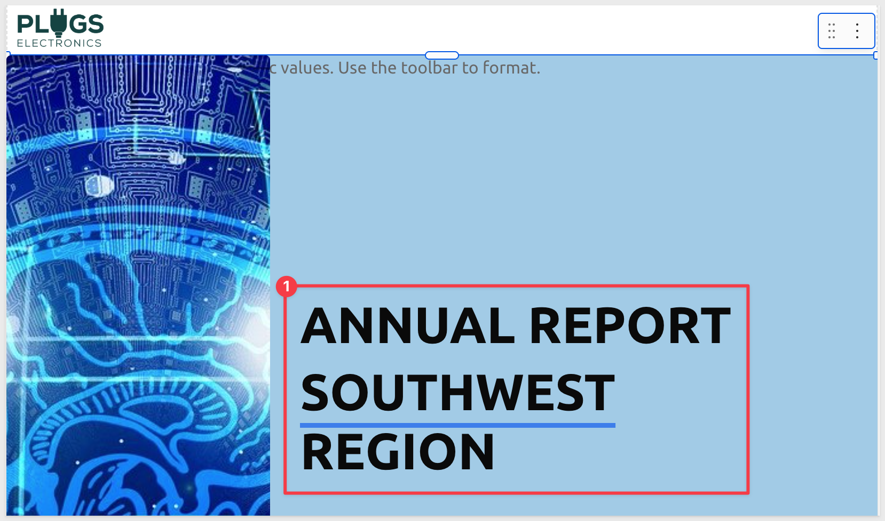

Our dynamic cover page is done. Click `Publish`.


<!-- END OF SECTION-->

## Create the Contents Page
Duration: 5

You can easily reorder pages by just dragging/dropping a page on the left page navigator.

Drag the `Data` page to be last and then add another new page and place it after `Page 1`. 

At this point we already know how to style a page by adding text, images, controls and so on. 

<aside class="negative">
<strong>NOTE:</strong><br> Creating pixel-perfect reports in Sigma is made easy so you can spend more time on the design and content rather than wasting time trying to make the tool do what you need.
</aside>

Using the same elements we already learned, our contents page looks like this:

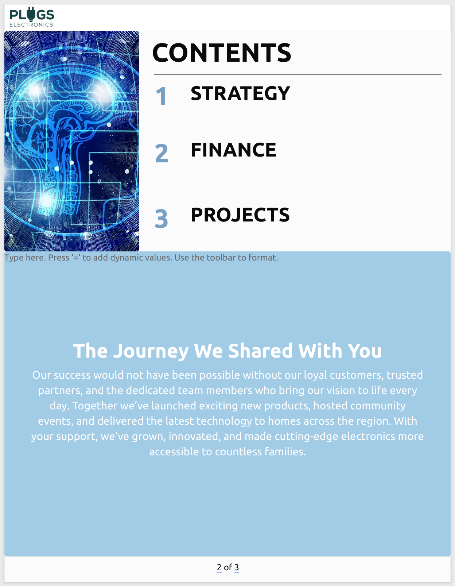

If you get stuck, go back and review the cover page again.

If you are really stuck, you can always use Sigma's in-product chat feature to speak to us directly:

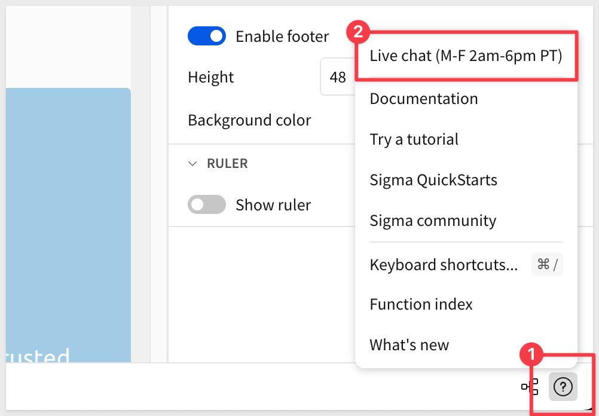


<!-- END OF SECTION-->

## Create Strategy Page with KPIs
Duration: 15

Add another new page after `Page 2` to use for the `Strategy` data. 

Style it like this, using this image if you prefer:
```code
https://sigma-quickstarts-main.s3.us-west-1.amazonaws.com/shared_images/beach_entrance.png
```

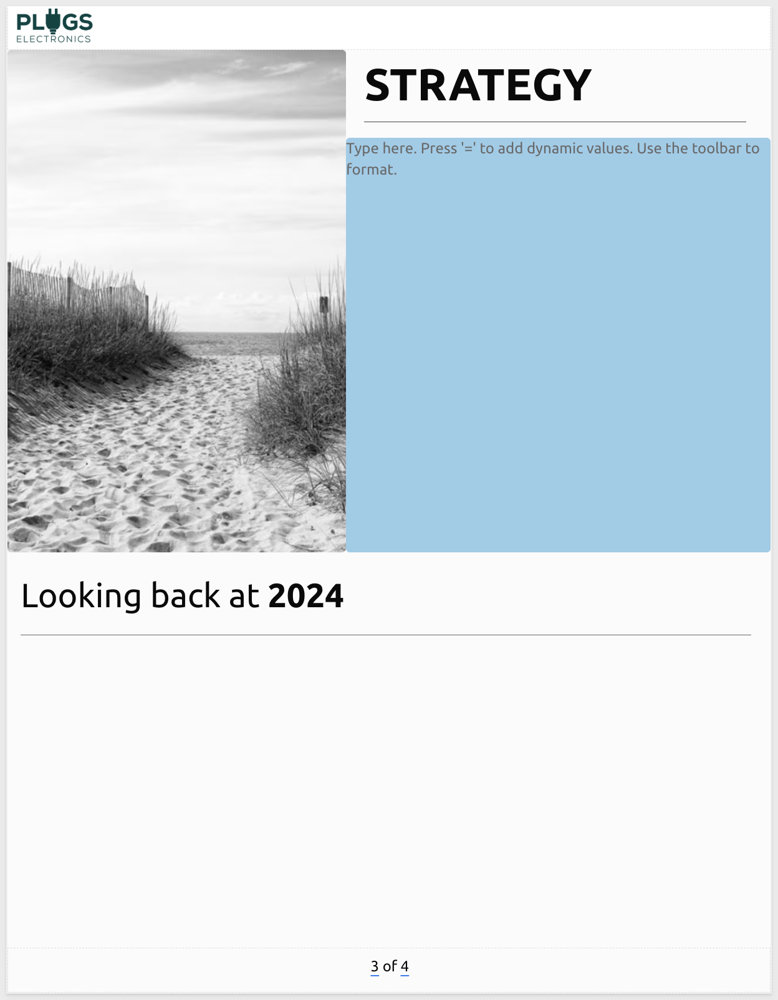

In the `Looking back at 2024` section, let's add several metrics using KPI charts. 

The first will be for `Sales & Operations` and make use of a metric from our data tables summary row value for `Units Sold` in 2024.

Add a `KPI` from the `Element bar` > `Charts` group and resize it smaller on the page.

Select our data table as the source:

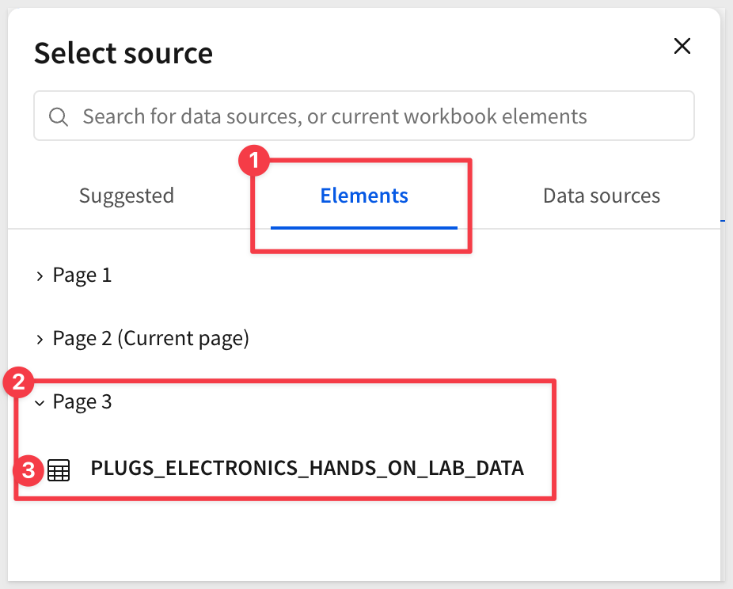

Sigma has exposed the summary columns from our table for us. However, we want all the columns so we can calculate values for our KPIs. 

In the `Source grouping` option, select `All source columns` from the select list:

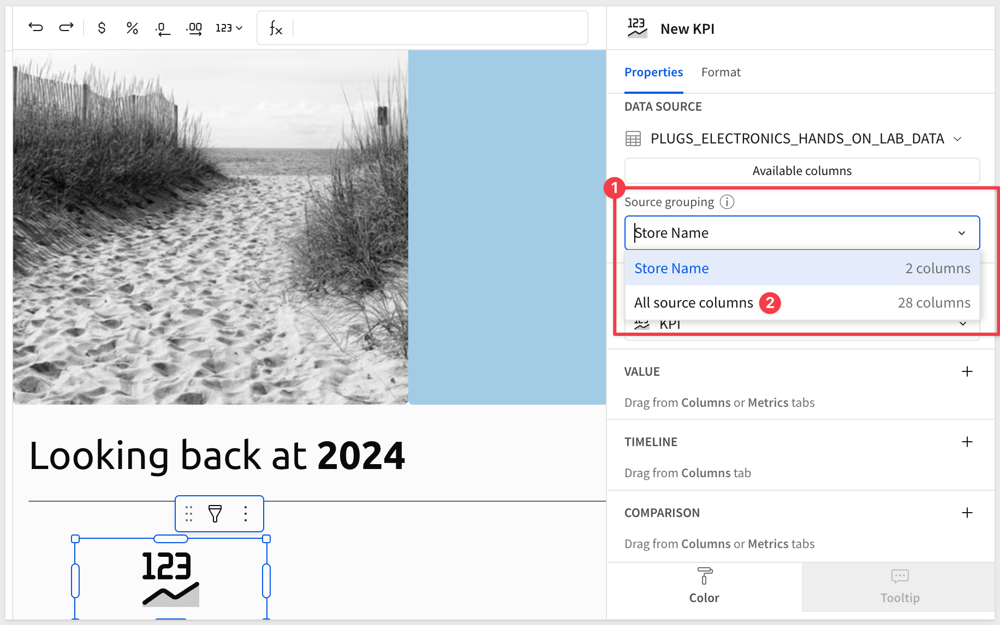

Now that we have access to all the table columns, configure the first KPI like this, using the `2024 Orders` summary column:

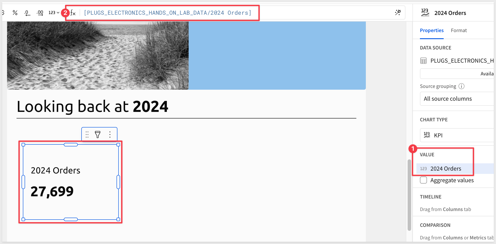

We also should style the KPI better:


We can add some visual interest using an icon with a heading. 

Add an image and set the URL to:
```code
https://sigma-quickstarts-main.s3.us-west-1.amazonaws.com/shared_images/units_sold.png
```

Notice that the image is shown in-front of the KPI? We want the objects really close together but the KPI should be on top of the image since the image has a fair size white border.

Right-click on the image and select `Order` > `Send backward`:

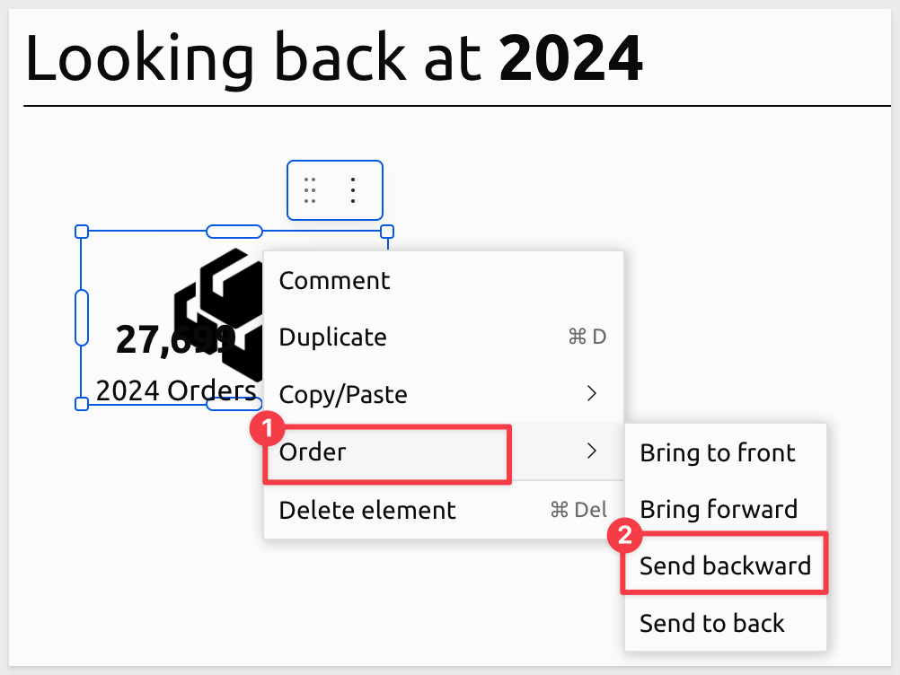

To get the effect we really want, we still need to set the backgroud color (in Element styles) to `None` for the KPI:

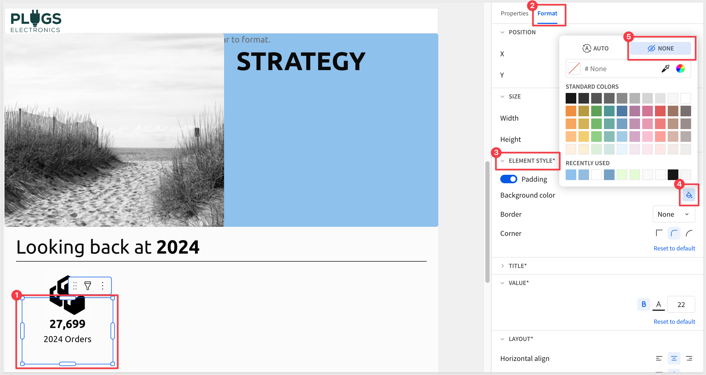

Add a `Text` element above the image for a title `Sales & Operations`:

Now we have a nice looking visualization on the page:

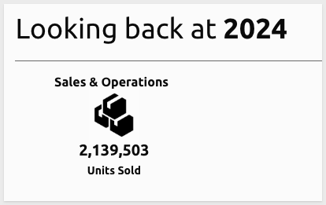

The process to add more is exactly the same with different formulas, images and text. That information is supplied below if you want to practice more but the workflow is repetitive so if you feel comfortable, move to the section `More Charts`.

Once all KPI are added, the final result for this section of the page:

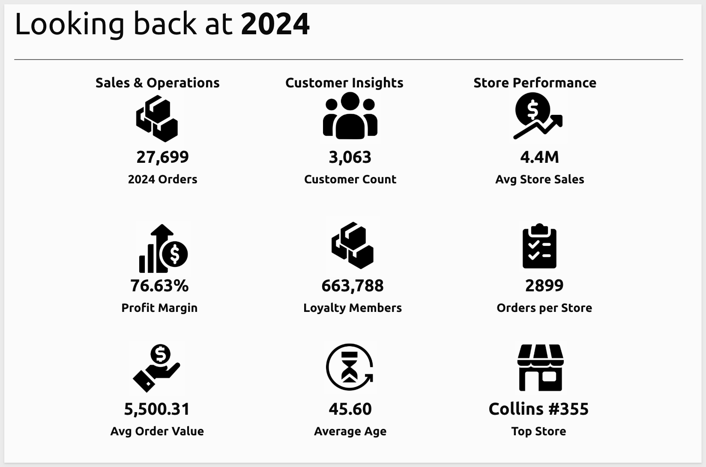


<!-- END OF SECTION-->

## Remaining KPI (optional)
Duration: 10

### Configuration details for all KPIs
It can be faster to `Duplicate` existing elements and adjust their configuration than to create from scratch. Using the left mouse button, drag a box around the three elements that make up the KPI and select `Duplicate`:

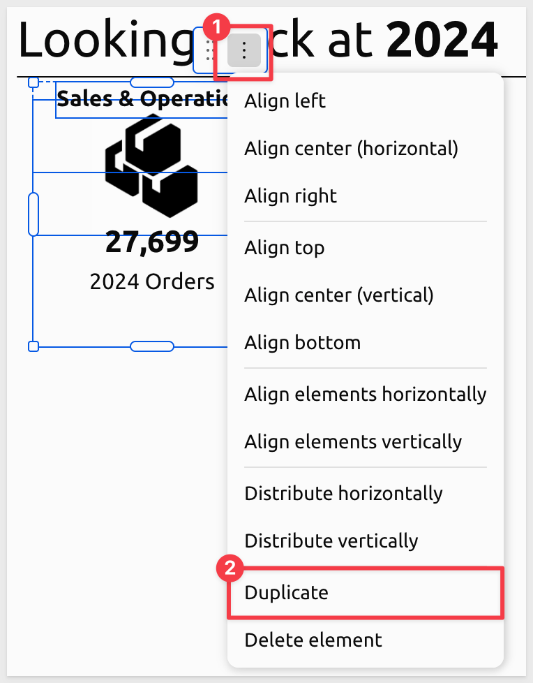

<aside class="negative">
<strong>NOTE:</strong><br> You may have noticed that the menu that we used to duplicate had the full variety of alignment options to make positioning elements easy. This is especially useful when working with multiple page elements.
</aside>

Use alignment tools, ruler guides, and precise positioning to create a polished, professional layout throughout the report.

### Extract extra columns from json column
There is one column in our data that is formatted as JSON. Getting data from other systems and incorporating it has been time-consuming and problematic in the past but in Sigma, this is easy.

Return to the data page, locate the `Cust Json` column in the column list and select `Extract columns` from its menu:

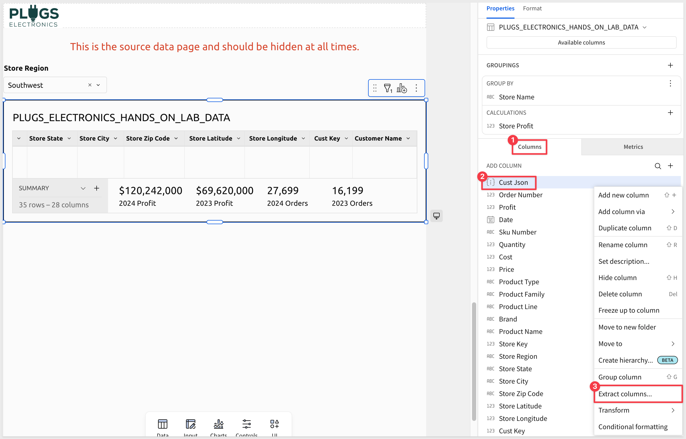

Sigma provides a list of the columns that are included in the JSON and allows us to select the ones we want.

Select `CUST_AGE` and `LOYALTY_PROGRAM` and click `Confirm`:

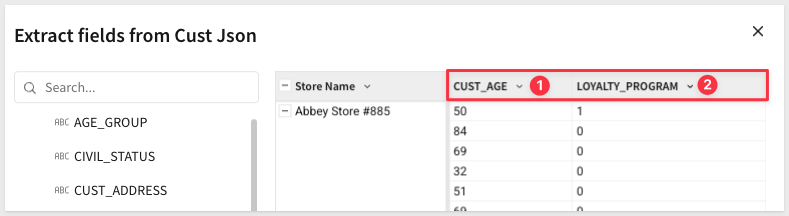

Now these columns are available for use with our KPI.

Here are the titles, formulas and image URLs needed to create the full page:

### First row KPI
**Customer Count:**<br>
```code
CountDistinct([Cust Key])
```
https://sigma-quickstarts-main.s3.us-west-1.amazonaws.com/shared_images/customer_count.png


**Avg Store Sales:**<br>
```code
Round(SumIf([Price] * [Quantity], Year([Date]) = 2024) / CountDistinctIf([Store Key], Year([Date]) = 2024), -3)
```
https://sigma-quickstarts-main.s3.us-west-1.amazonaws.com/shared_images/avg_store_sales.png


### Second row KPI<br>
**Profit Margin:**<br>
```code
Sum([Profit]) / Sum([Price] * [Quantity])
```
https://sigma-quickstarts-main.s3.us-west-1.amazonaws.com/shared_images/profit_margin.png
Format value as `Percentage`.


**Loyalty Members:**<br>
```code
Count([LOYALTY_PROGRAM] = "1")
```
https://sigma-quickstarts-main.s3.us-west-1.amazonaws.com/shared_images/loyalty_members.png


**Orders per Store:**<br>
```code
CountDistinct([Order Number]) / CountDistinct([Store Key])
```
https://sigma-quickstarts-main.s3.us-west-1.amazonaws.com/shared_images/order_per_store.png


### Third row KPI
**Average Order Value:**<br>
```code
Sum([Price] * [Quantity]) / CountDistinct([Order Number])
```
https://sigma-quickstarts-main.s3.us-west-1.amazonaws.com/shared_images/avg_order_value.png


**Average Age:**<br>
```code
Avg(Number([CUST_AGE]))
```
https://sigma-quickstarts-main.s3.us-west-1.amazonaws.com/shared_images/average_age.png


**Top Store:**<br>
```code
Replace(If(Max([PLUGS_ELECTRONICS_HANDS_ON_LAB_DATA/Store Profit]) = [PLUGS_ELECTRONICS_HANDS_ON_LAB_DATA/Store Profit], [PLUGS_ELECTRONICS_HANDS_ON_LAB_DATA/Store Name]), " Store", "")
```
https://sigma-quickstarts-main.s3.us-west-1.amazonaws.com/shared_images/top_store.png


**Final result:**


<!-- END OF SECTION-->

## More Charts
Duration: 10

Adding other chart types is not much different than what we already did for KPI. 

Add another page and make it look like this:

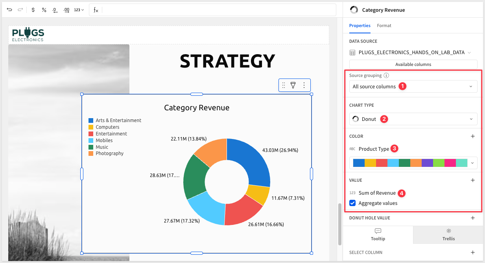

Image url:
```code
https://sigma-quickstarts-main.s3.us-west-1.amazonaws.com/shared_images/beach_entrance.png
```

At this point we can see that creating page elements is just like workbooks and we have access to the full library of Sigma elements to choose from. 

Let's stop here and review how we can distribute our sample report to one or many people.


<!-- END OF SECTION-->


## Report delivery
Duration: 10

Configuring a report for delivery in Sigma is just like scheduling for a workbook. 

For more information on basic export scheduling, see [Send or schedule export](https://help.sigmacomputing.com/docs/send-or-schedule-workbook-exports)

A more likely scenario is that a report is scheduled to be delivered in-mass (aka Bursting).

There are some rules that apply for both the report and the bursting job. 

[Report Limitations](https://help.sigmacomputing.com/docs/reports-overview#limitations)

[Bursting Limitations](https://help.sigmacomputing.com/docs/export-as-email-burst#limitations)

### Grouping recipients
It is ideal to have a single report design support a large population of users and restrict the data based on some parameter(s).

For example, restrictions based on role, geography or even product family may make sense for a burst. 

In our example report, we have a filter applied to the base table for `Store-Region`. In this way, the same report can be reused but the data filtered based on the recipient's region. 

<aside class="positive">
<strong>CONSIDERATIONS:</strong><br> Sigma can burst emails based on table data, even if the data is stored in different structures.

For example, the table may have a users email address and region in the same row of data. 

Alternately, it may be that for each region all the addresses are listed in one cell using comma-delimited format. 

There are many variations to this, but Sigma is really flexible and can handle unusual use-cases.

Ideally, configuring a burst to leverage an email distribution list that is maintained in the corporate email system solves many issues and maintains distribution governance. 
</aside>

There is a [Export Bursting QuickStart](https://quickstarts.sigmacomputing.com/guide/administration_export_bursting/index.html?index=..%2F..index#0) that covers the topic in detail. 


<!-- END OF SECTION-->

## Schedule the report
Duration: 5

Since we don't have a list of recipients to burst to, we can just test sending our report to ourselves, but configure the job to send using different regions. 

Select `Share and export` > `Schedule exports` from the report name menu:

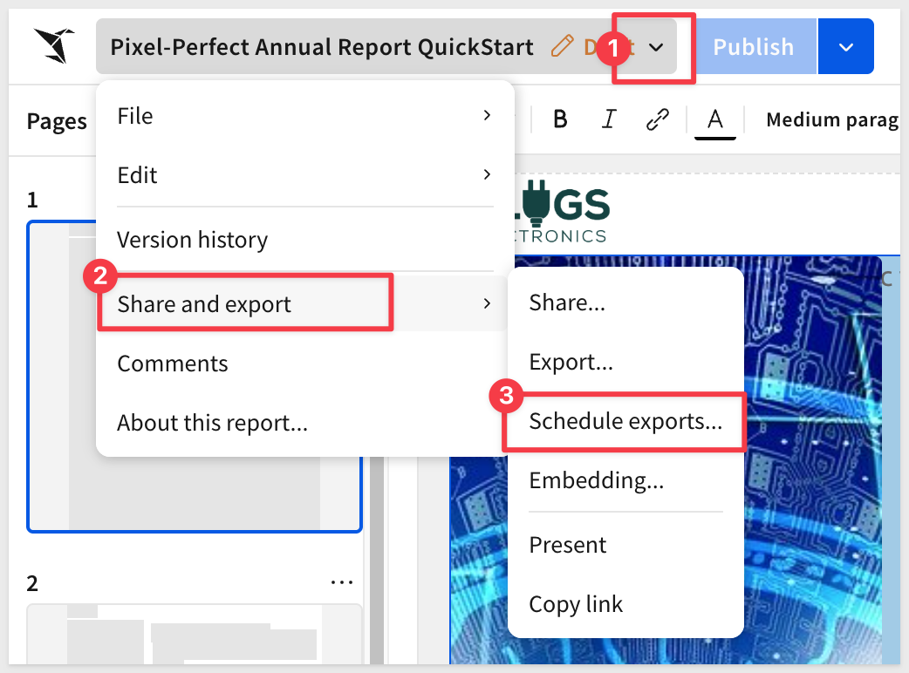

Click `Create new schedule`.

In the list of export methods, select `Email`.

Enter your email address and in the `Message` box enter `Southwest Region`.

Check the box for `Customize control values`:

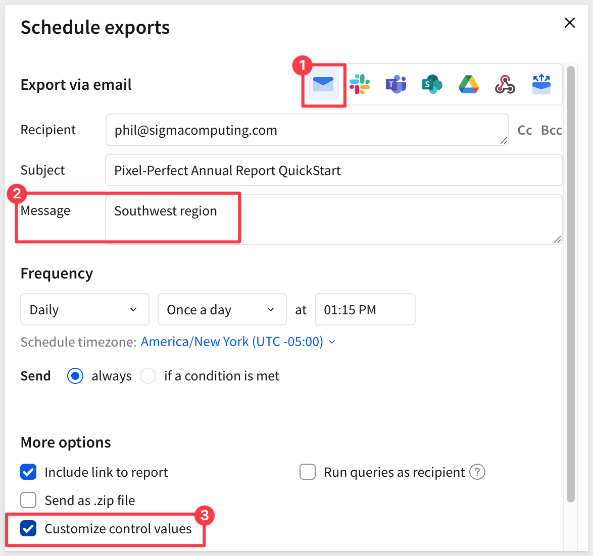

In the control box, select `Store-Region` and target the `Southwest` region. This forces the report to filter the data appropriately for the intended recipient.

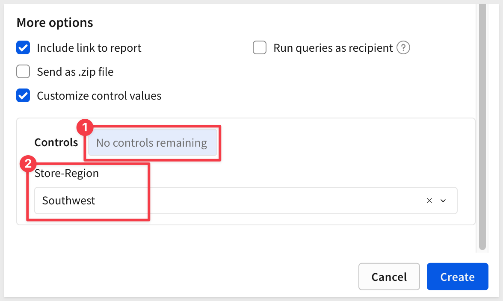

Click `Create`.

Once the job is created, we can request it immediately for our test:

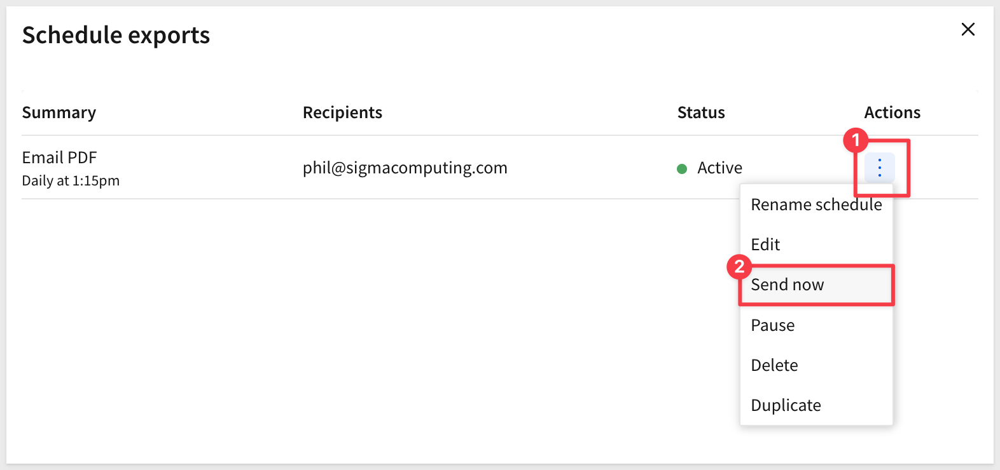

Once our report arrives, we can see the attached PDF. There is also a link back to the report but we can disable that option if preferred:

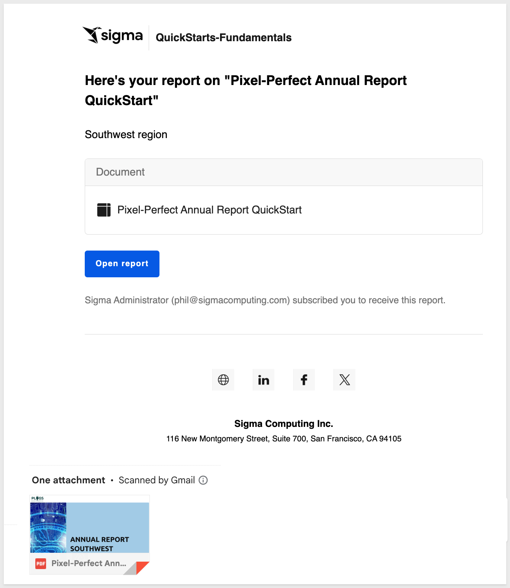

We left the data page visible (you may have noticed!) so we can check that the control value is indeed set to `Southwest`. In practice, the data page would be hidden:

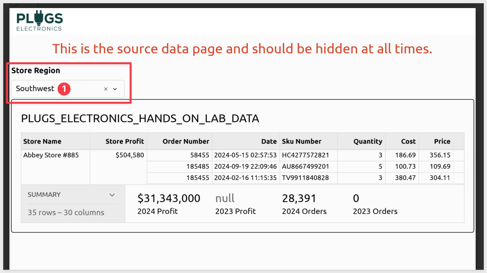

Lets assume we have an email distribution list for each region. In that case, we can just rename this job appropriately, duplicate it and adjust the new job for a different region:

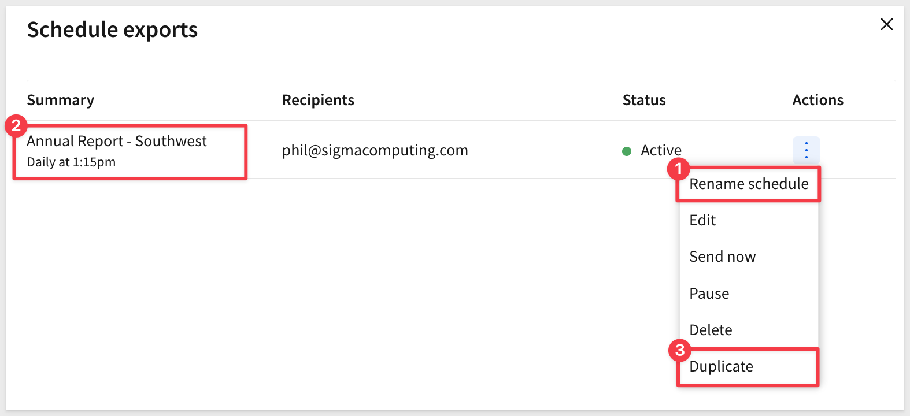

With our new job created and renamed, we adjusted the target to `East` and updated the message to say `East` too.

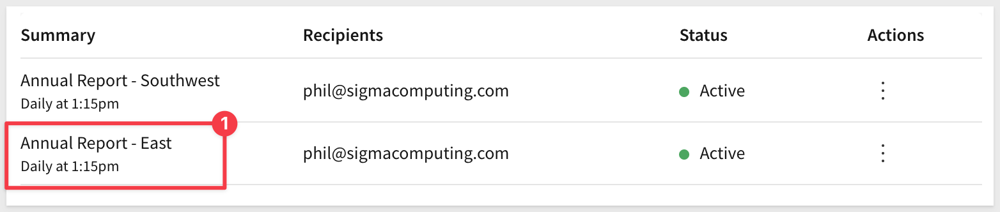

Now when we test send it, the report is filtered for the `East` region as expected:

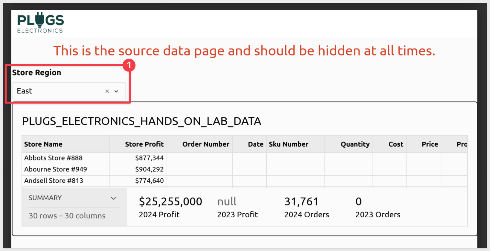

A benefit of the the bursting configuration is `Dynamic recipients` which matches the `Store-Region` (in our example) to an email address from a table:


There is more information on this feature in the QuickStart and help documentation mentioned earlier. 

<aside class="positive">
<strong>IMPORTANT:</strong><br> Don't forget to hide pages to prevent users from seeing elements you did not intend.
</aside>


<!-- END OF SECTION-->

## What we've covered
Duration: 5

In this QuickStart, we explored how Sigma makes Pixel Perfect Reporting effortless while maintaining enterprise-grade capabilities. Using the Plugs Electronics Southwest Annual Report as a real-world example, you learned how to:

**Key Takeaways:**
- Create a new report and configure page setup with branded headers and footers
- Build professional cover and contents pages with precise formatting and background images
- Work with data tables and leverage table summaries for aggregated metrics
- Extract and use columns from JSON data sources
- Create dynamic, data-driven titles using formulas and controls
- Build KPI visualizations with custom styling and element layering
- Apply alignment tools and ruler guides for pixel-perfect positioning
- Configure email bursting to distribute personalized, region-specific reports to multiple recipients
- Export reports to PDF and schedule automated delivery

**Additional Resource Links**

[Blog](https://www.sigmacomputing.com/blog/)<br>
[Community](https://community.sigmacomputing.com/)<br>
[Help Center](https://help.sigmacomputing.com/hc/en-us)<br>
[QuickStarts](https://quickstarts.sigmacomputing.com/)<br>
[Reports Overview](https://help.sigmacomputing.com/docs/reports-overview)<br>

Be sure to check out all the latest developments at [Sigma's First Friday Feature page!](https://quickstarts.sigmacomputing.com/firstfridayfeatures/)
<br>

[](https://twitter.com/sigmacomputing)&emsp;
[](https://www.linkedin.com/company/sigmacomputing)&emsp;
[](https://www.facebook.com/sigmacomputing)


<!-- END OF WHAT WE COVERED -->
<!-- END OF QUICKSTART -->
