author: pballai
id: Fundamentals_12_repeater_single_row_containers
summary: Fundamentals_12_repeater_single_row_containers
categories: Fundamentals
environments: web
status: Published
feedback link: https://github.com/sigmacomputing/sigmaquickstarts/issues
tags: Default
lastUpdated: 2026-06-20

# Fundamentals 12: Build App-Style Layouts in Sigma

## Overview
Duration: 5

This QuickStart introduces...

Along the way you'll learn how to:
- ...
- ...


<aside class="positive">
<strong>IMPORTANT:</strong><br> Some screens in Sigma may appear slightly different from those shown in QuickStarts. This is because Sigma continuously adds and enhances functionality. Rest assured, Sigma's intuitive interface ensures that any differences will not prevent you from successfully completing any QuickStart.
</aside>

For more information on Sigma's product release strategy, see [Sigma product releases](https://help.sigmacomputing.com/docs/sigma-product-releases)

If something doesn't work as expected, here's how to [contact Sigma support](https://help.sigmacomputing.com/docs/sigma-support)

### Target Audience
The typical audience for this QuickStart includes users of Excel, common Business Intelligence or Reporting tools, and semi-technical users who want to try out or learn Sigma.

### Prerequisites

<ul>
  <li>Any modern browser is acceptable.</li>
  <li>Access to your Sigma environment.</li>
  <li>Some familiarity with Sigma is assumed. Not all steps will be shown, as the basics are assumed to be understood.</li>
 </ul>

<aside class="positive">
<strong>IMPORTANT:</strong><br> Sigma recommends using non-production resources when completing QuickStarts.
</aside>

<button>[Sigma Free Trial](https://www.sigmacomputing.com/free-trial/)</button>

<aside class="negative">
<strong>IMPORTANT:</strong><br> Some features may carry a "Beta" tag. Beta features are subject to quick, iterative changes. As a result, the latest product version may differ from the contents of this document.
</aside>


## Set Up the Data Source
Duration: 5

We'll build a visual product catalog using Sigma's sample `COLD_PROVISIONS` database. The `PRODUCTS` table is a strong fit — it has image URLs, descriptive attributes, pricing, and brand colors that let us design rich card layouts without any external image hosting or data prep.

**Create a new workbook:**

- From the Sigma home page, click `Create new` > `Workbook`
- Add a new page element from the element bar and choose `Table`
- In the data source picker, browse to your sample data connection and select `COLD_PROVISIONS` > `PRODUCTS`

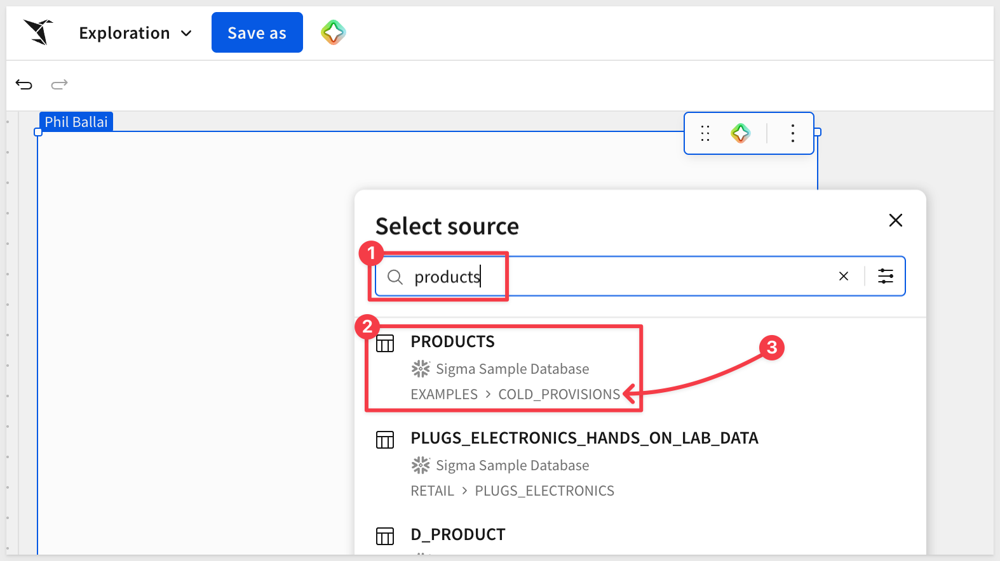

The `PRODUCTS` table contains everything needed to power both the gallery and the detail view:

- `MAIN_IMAGE_URL` and `ALTERNATE_IMAGE_URL`: image references Sigma will render directly on each card
- `PRIMARY_COLOR_HEX`: a brand color used for accents and conditional styling
- `TAGS`, `ALLERGENS`, `CATEGORY`, `PRODUCT_LINE`: attributes that drive filters and sorting
- `COST_PER_UNIT_USD`: numeric value for the card's price label
- `IS_FROZEN`: boolean used later for a conditional badge
- `DISCONTINUED_DATE`: lets us hide retired products from the gallery by default

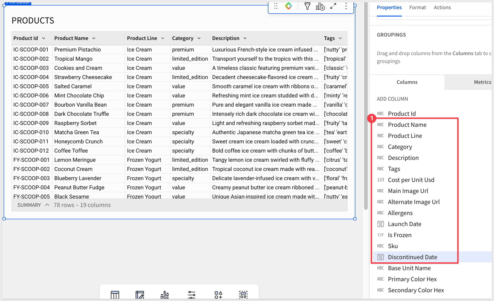

**Format the cost column:**

The raw `COST_PER_UNIT_USD` values carry many decimal places (e.g., `1.322736457`), which won't read well on a card. Clean it at the source so it's right everywhere downstream:

- Click the `COST_PER_UNIT_USD` column header and open the column menu
- Choose `Format` and set Type to `Currency` with `2` decimal places:

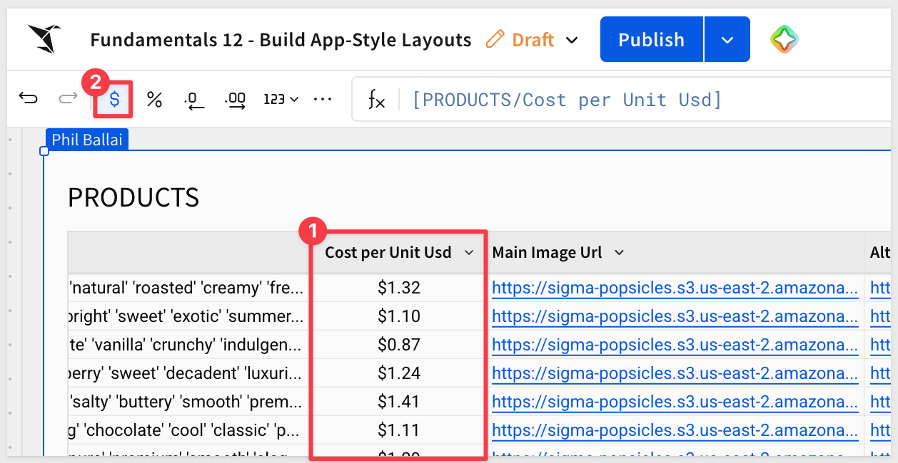

This is realistic data prep — get the source view right once, then build on top of it.

Throughout this QuickStart, we'll follow a familiar app pattern:

- **Master view (Repeater Container):** a scrollable gallery of cards, one per product
- **Detail view (Single Row Container):** a focused layout for a single product, opened from a card

This is the same pattern users see in real estate apps, product catalogs, project boards, and CRM record pages. The same building blocks scale from ten records to thousands.

Before proceeding, let's save the workbook.

- Click `Save as` in the workbook toolbar
- Name the workbook:
```copy-code
Fundamentals 12 - Build App-Style Layouts
``` 

Select a destination folder of your choice.

- Click `Save` to commit

<aside class="positive">
<strong>WHY IT MATTERS:</strong><br> Repeater and Single Row containers turn any well-structured table into an app-like browsing experience. You design one card template, and Sigma scales it across every record — no front-end code, no manual layout per row.
</aside>


<!-- END OF SECTION-->

## Build the Repeated Container
Duration: 10

Before building the gallery, separate the data from the UI by splitting them across two pages. This keeps the raw `PRODUCTS` table available for reference while giving the app its own clean surface.

**Set up your workbook pages:**

- Rename the current page from `Page 1` to `Data` — this is where the source `PRODUCTS` table lives
- Add a new page and name it `Catalog` — the gallery and detail view will be built here

**Add the Repeated container:**

The `Repeated container` takes the `PRODUCTS` table and renders one card per row using a single template you design. Whatever you place inside the template cell — images, text, formatted values — Sigma scales across the full dataset.

- On the `Catalog` page, open the `Element bar` and select `Repeated container` from the `Layout` group:

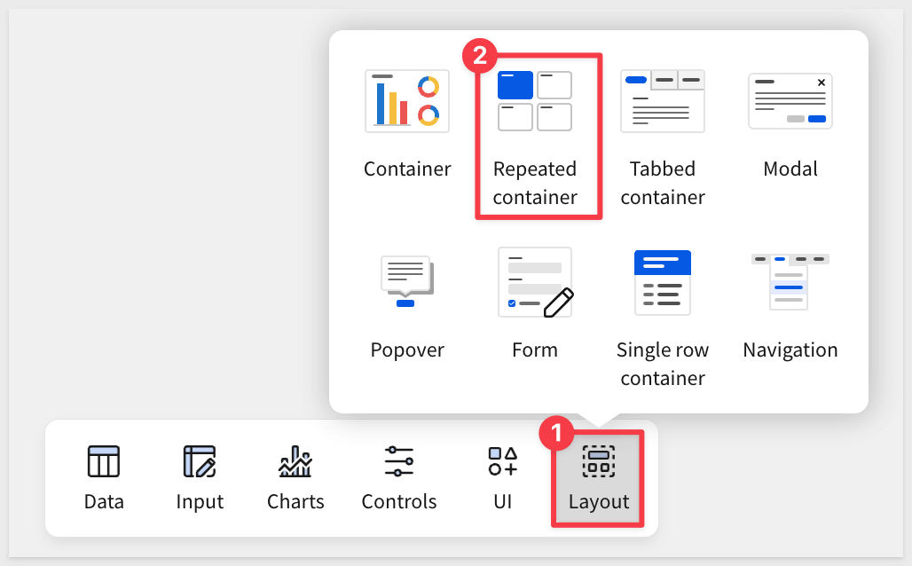

- Choose `PRODUCTS` from the `Data` page as the data source for the container:

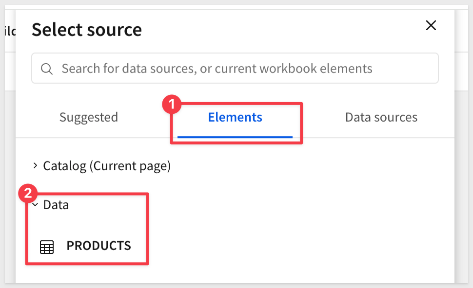

The container will appear on the page as a blank template cell with a placeholder:

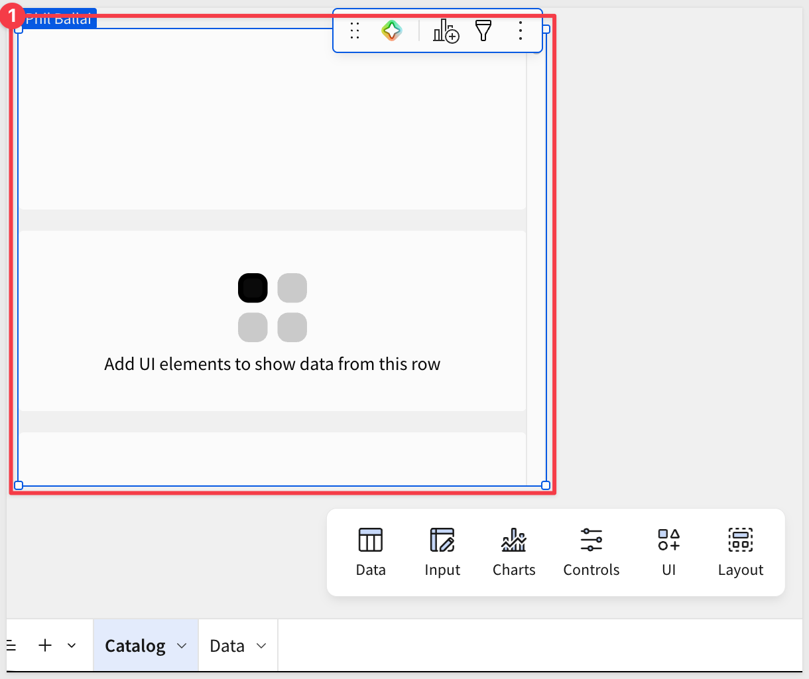

**Design the card template:**

Now we can use the card, placing elements inside the template cell. Each element you add becomes part of the per-row design Sigma clones across the dataset.

- Experioment with the `Format` options to suit your preference:

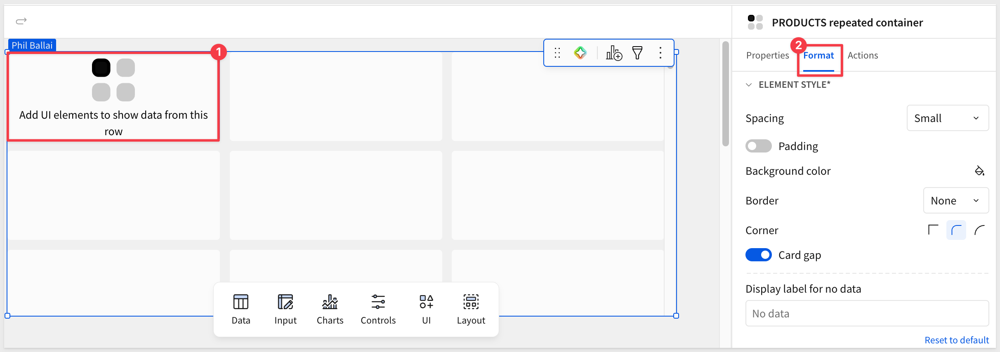

- Add an `Image` element from the `UI` group, centering it nicely in a cell. Don't fret over the design yet, it's best to place all the elements first and tweak the design last:

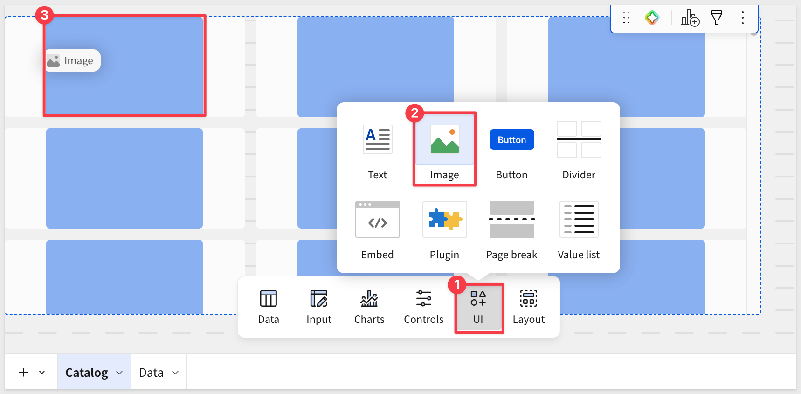

- Reference `MAIN_IMAGE_URL` as the source; size it to occupy the upper portion of the card:

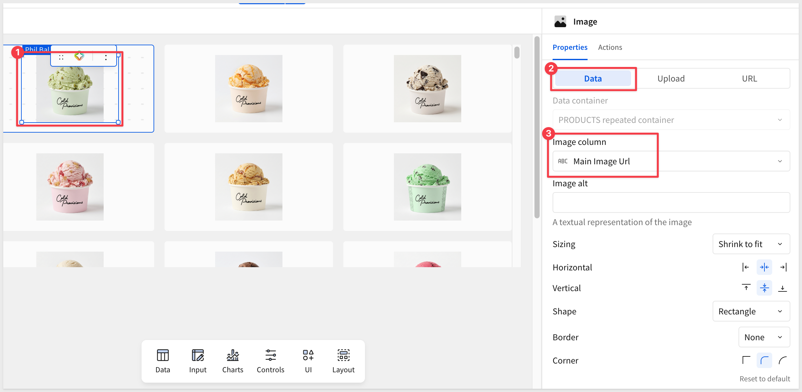

- Add a `Text` element bound to `PRODUCT_NAME` for the primary card label:

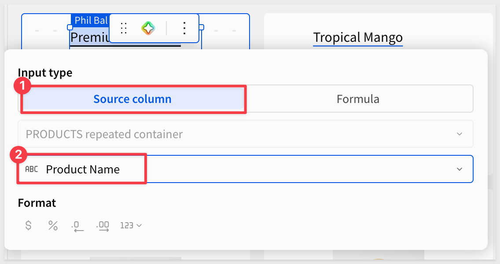

<aside class="positive">
<strong>PRO TIP:</strong><br> Bind any text element by column for the simple case, or switch to the `Formula` option to combine fields, apply conditional logic, or transform values inline. For example, <code>[PRODUCT_NAME] & " — " & [PRODUCT_LINE]</code> builds a richer label without modifying the source table — turning every label on the card into a programmable surface rather than a fixed column display.
</aside>

- Add a second `Text` element from the `UI` group, then switch the `Input type` to `Formula`. Sigma references columns inside a Repeated container by their full path — `[Container name/Column display name]`:

```copy-code
[PRODUCTS repeated container/Product Line] & " — $" & Text(Round([PRODUCTS repeated container/Cost per Unit Usd], 2))
```

This combines the product line and the price into a single subtitle (for example, `Ice Cream — $1.32`).

<aside class="positive">
<strong>NOTE:</strong><br> You might ask: didn't we already format this column as currency on the <code>Data</code> page? Yes — but column-level formatting only applies when the value is referenced directly through <code>Source column</code> mode. Inside a <code>Formula</code>, Sigma operates on the raw underlying number, which is why <code>Round</code> is used here to control the decimal places.
</aside>

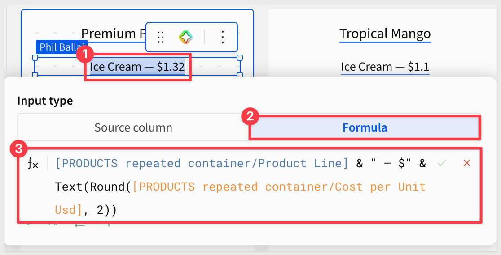

**Preview the gallery:**

Sigma now renders one card per product across the full table. Now is a good time to play with the various configuration optios for both the Repeater element and the image element embedded inside it.

Of course, there is a link to `Reset to default` if things get to far afield.

For example:

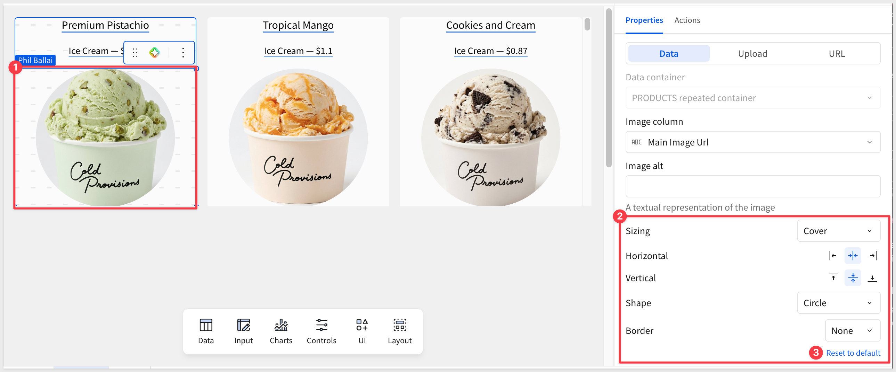

`Publish` the workbook and `Go to published version`:

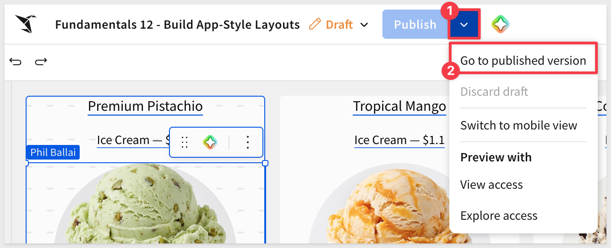

Scroll the container to confirm every row in `PRODUCTS` is reflected as its own card — no manual duplication, no row-by-row work:

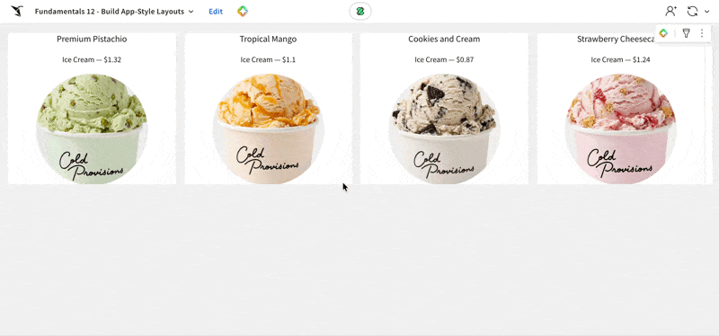

<aside class="positive">
<strong>WHY IT MATTERS:</strong><br> One template, many cards. New products added to the source table automatically appear in the gallery, and the layout reflows across screen widths — no maintenance as the catalog grows, and no extra work for mobile or embedded views.
</aside>


<!-- END OF SECTION-->

## Filter and Sort the Gallery
Duration: 5

A closer look at the gallery reveals a small problem: discontinued products are mixed in with active ones. We missed this in the data prep — no big deal, since Sigma lets us fix it at the source and have every downstream element pick up the change automatically. Once that's sorted, we'll add a category control and a default sort so users can shape the view.

**Add an "Is Active" indicator column at the source:**

Rather than filter directly on the date, create a named calculated column that resolves to true or false. A self-documenting boolean makes the intent obvious to anyone opening the workbook later — and the same column can power any future view that needs to scope to active products.

- Switch to the `Data` page and select the `PRODUCTS` table
- Add a new column to the right of the existing columns and name it `Is Active`
- Enter the following as the column formula:

```copy-code
IsNull([Discontinued Date])
```

The column resolves to `true` for active products and `false` for discontinued ones.

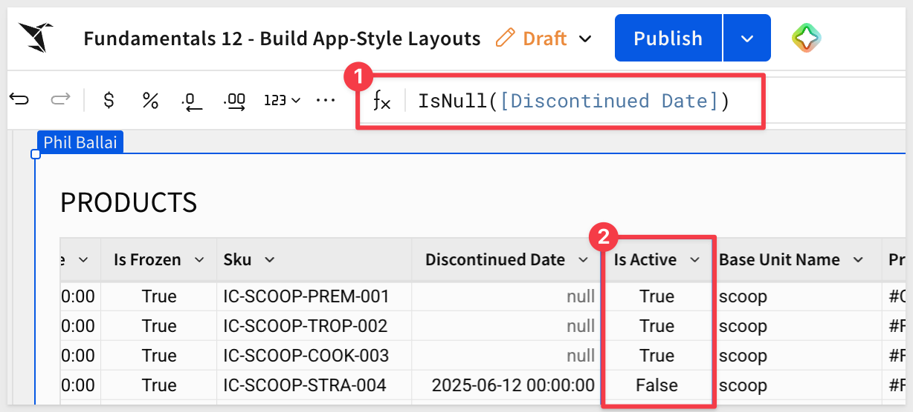

**Filter the source table on the new column:**

- With the `PRODUCTS` table selected, open the `Element panel` and choose `Filters`
- Add a filter on `Is Active` and configure it to keep rows where the value is `true`:

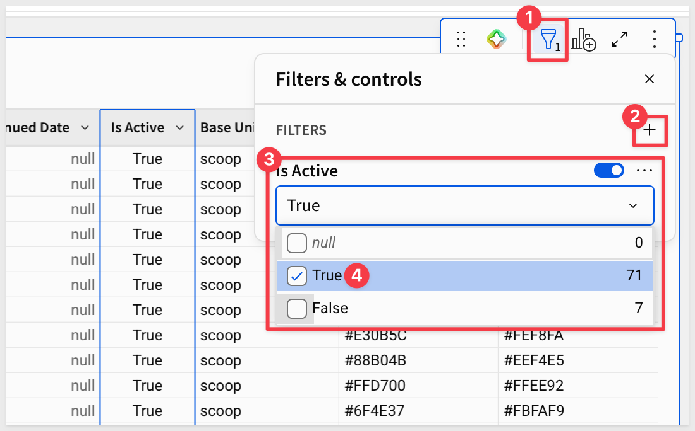

Return to the `Catalog` page — the gallery has refreshed to hide retired products. No changes needed to the Repeated container itself.

**Add a category control:**

Let users narrow the gallery to a category — this is the kind of interactivity that turns a static layout into a usable app.

- From the `Element bar`, add a `Controls` > `List value` element above the gallery
- Set the data source to `PRODUCTS` and the column to `CATEGORY`
- In the control's `Targets` section, target the Repeated container so the selection drives the filter

<!-- rst_12.png -->

Test it by selecting a category and watching the gallery refresh to only the matching cards.

**Sort the gallery:**

By default, Sigma renders cards in source-table order. For a catalog, alphabetical by name is a better default.

- On the Repeated container's `Element panel`, choose `Sort`
- Add `PRODUCT_NAME` ascending

<!-- rst_13.png -->

<aside class="positive">
<strong>WHY IT MATTERS:</strong><br> Built-in filters control what the gallery shows by default; interactive controls give end users the power to shape their view. The combination is what makes the container behave like a real app instead of a static report.
</aside>


<!-- END OF SECTION-->

## Build the Single Row Container
Duration: 10

<!-- Section 6 draft pending -->


<!-- END OF SECTION-->

## Add an Action Layer
Duration: 10

<!-- Section 7 draft pending — optional; reassess after Sections 3-6 -->


<!-- END OF SECTION-->

## What we've covered
Duration: 5

In this QuickStart, we ...

- ...
- ...

**Additional Resource Links**

[Blog](https://www.sigmacomputing.com/blog/)<br>
[Community](https://community.sigmacomputing.com/)<br>
[Help Center](https://help.sigmacomputing.com/hc/en-us)<br>
[QuickStarts](https://quickstarts.sigmacomputing.com/)<br>

Be sure to check out all the latest developments at [Sigma's First Friday Feature page!](https://quickstarts.sigmacomputing.com/firstfridayfeatures/)
<br>

[](https://twitter.com/sigmacomputing)&emsp;
[](https://www.linkedin.com/company/sigmacomputing)&emsp;
[](https://www.facebook.com/sigmacomputing)


<!-- END OF WHAT WE COVERED -->
<!-- END OF QUICKSTART -->
