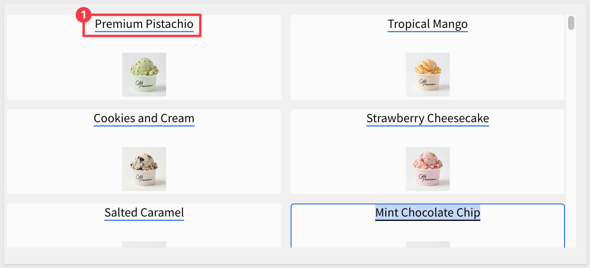
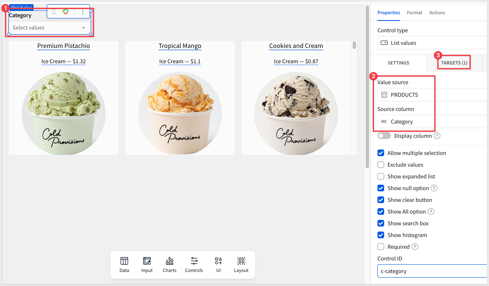
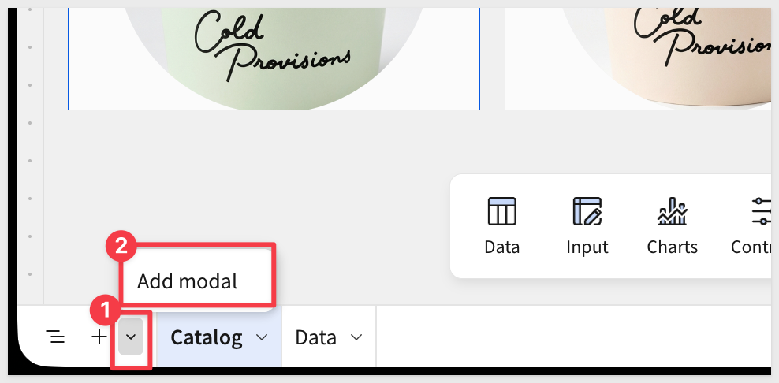
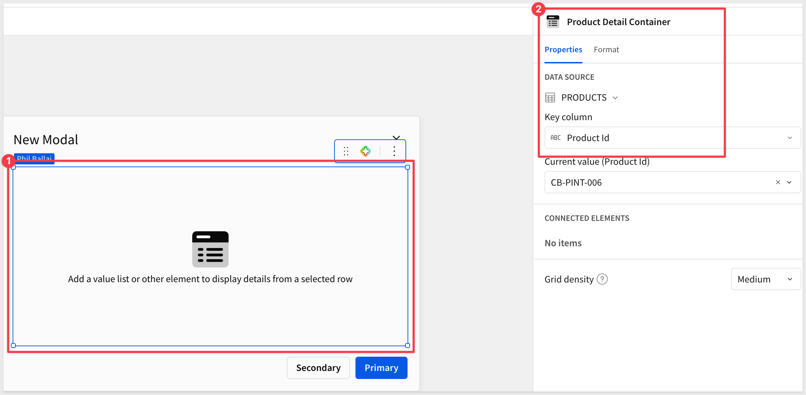
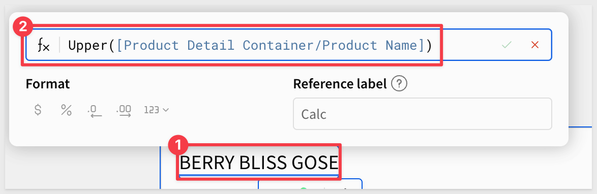
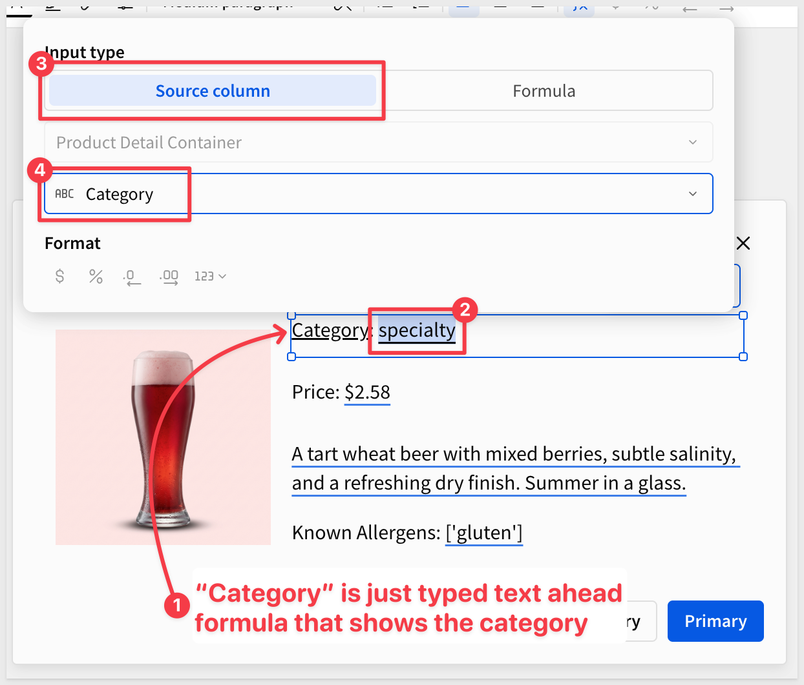
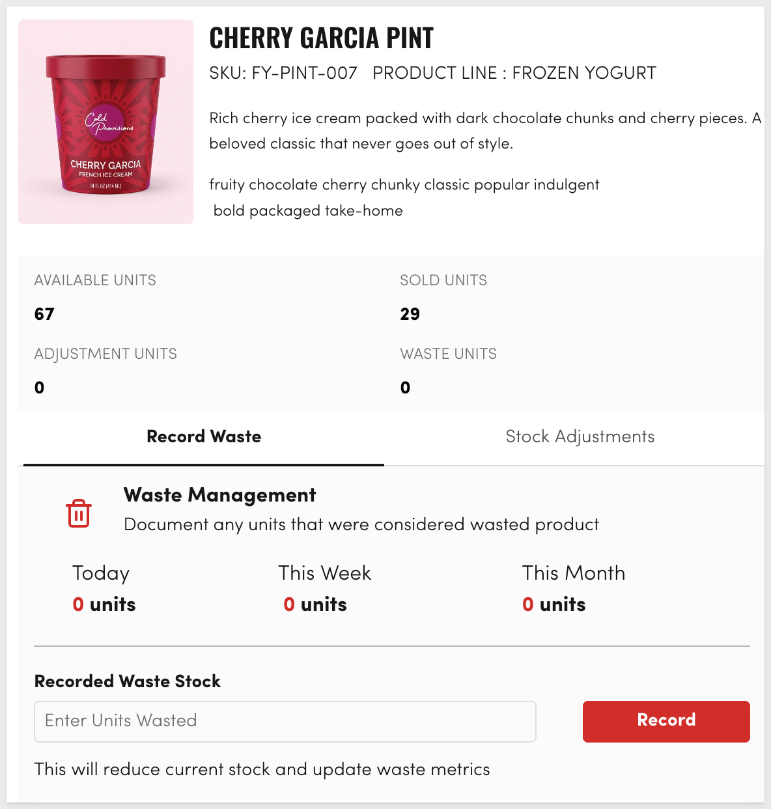
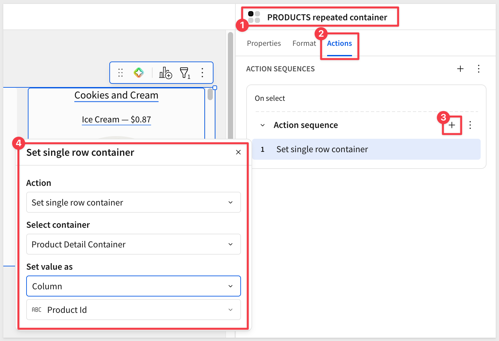
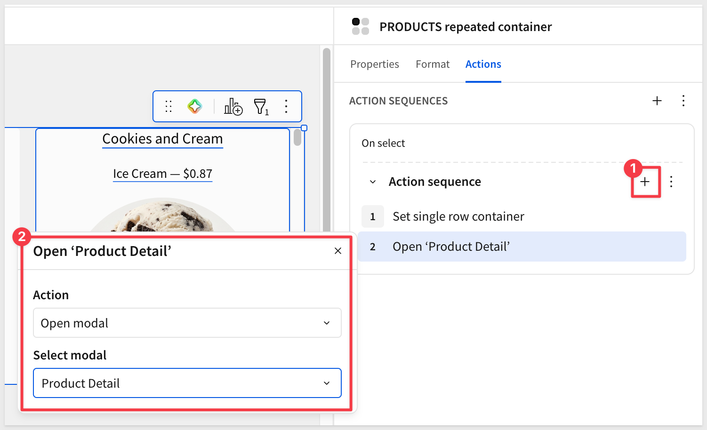
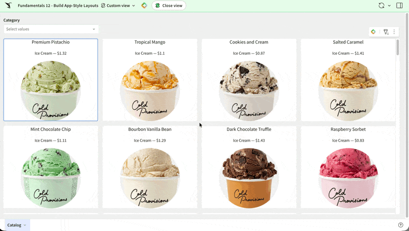

author: pballai
id: Fundamentals_12_repeater_single_row_containers
summary: Fundamentals_12_repeater_single_row_containers
categories: Fundamentals
environments: web
status: Published
feedback link: https://github.com/sigmacomputing/sigmaquickstarts/issues
tags: Default
lastUpdated: 2026-05-29

# Fundamentals 12: Build App-Style Layouts in Sigma

## Overview
Duration: 5

In this QuickStart, we will build a card-based product catalog in Sigma using Repeater and Single Row containers. 

We'll design one card template, let Sigma render it across every row in the source table, and wire a click action that opens a focused detail modal for any product. 

The same pattern works for any browseable record set — products, employees, locations, projects.

Along the way you'll learn how to:
- Apply source-level data prep — column formatting, calculated columns, and filters — so every downstream element inherits a clean view
- Build a `Repeated container` that renders one card per row from a single template
- Use the `Formula` input type to combine fields and transform values inline
- Add interactive filter and sort controls so users can shape the gallery
- Build a `Single Row container` inside a `Modal` to deliver focused product detail
- Wire card clicks to the detail view using Sigma's `Set single row container` action

Throughout this QuickStart, we'll follow a familiar app pattern:

- **Master view (Repeater Container):** a scrollable gallery of cards, one per product
- **Detail view (Single Row Container):** a focused layout for a single product, opened from a card

This is the same pattern users see in real estate apps, product catalogs, project boards, and CRM record pages. The same building blocks scale from ten records to thousands.

<aside class="positive">
<strong>WHY IT MATTERS:</strong><br> Repeater and Single Row containers turn any well-structured table into an app-like browsing experience. You design one card template, and Sigma scales it across every record — no front-end code, no manual layout per row.
</aside>

While that sounds like a lot, you'll likely spend more time thinking about the design; Sigma makes the rest simple.

<aside class="positive">
<strong>IMPORTANT:</strong><br> Some screens in Sigma may appear slightly different from those shown in QuickStarts. This is because Sigma continuously adds and enhances functionality. Rest assured, Sigma's intuitive interface ensures that any differences will not prevent you from successfully completing any QuickStart.
</aside>

For more information on Sigma's product release strategy, see [Sigma product releases](https://help.sigmacomputing.com/docs/sigma-product-releases)

If something doesn't work as expected, here's how to [contact Sigma support](https://help.sigmacomputing.com/docs/sigma-support)

### Target Audience
The typical audience for this QuickStart includes users of Excel, common Business Intelligence or Reporting tools, and semi-technical users who want to try out or learn Sigma.

### Prerequisites

<ul>
  <li>Any modern browser is acceptable.</li>
  <li>Access to your Sigma environment.</li>
  <li>Some familiarity with Sigma is assumed. Not all steps will be shown, as the basics are assumed to be understood.</li>
 </ul>

<aside class="positive">
<strong>IMPORTANT:</strong><br> Sigma recommends using non-production resources when completing QuickStarts.
</aside>

<button>[Sigma Free Trial](https://www.sigmacomputing.com/free-trial/)</button>

<aside class="negative">
<strong>IMPORTANT:</strong><br> Some features may carry a "Beta" tag. Beta features are subject to quick, iterative changes. As a result, the latest product version may differ from the contents of this document.
</aside>


## Set Up the Data Source
Duration: 5

We'll build a visual product catalog using Sigma's sample `COLD_PROVISIONS` database. The `PRODUCTS` table is a strong fit — it has image URLs, descriptive attributes, pricing, and brand colors that let us design rich card layouts without any external image hosting or data prep.

**Create a new workbook:**

- From the Sigma home page, click `Create new` > `Workbook`
- Add a new `Table` element from the element bar, `Data` group.
- In the data source picker, browse to your sample data connection and select `COLD_PROVISIONS` > `PRODUCTS`


The `PRODUCTS` table contains everything needed to power both the gallery and the detail view:

- `MAIN_IMAGE_URL` and `ALTERNATE_IMAGE_URL`: image references Sigma will render directly on each card
- `PRIMARY_COLOR_HEX`: a brand color used for accents and conditional styling
- `TAGS`, `ALLERGENS`, `CATEGORY`, `PRODUCT_LINE`: attributes that drive filters and sorting
- `COST_PER_UNIT_USD`: numeric value for the card's price label
- `IS_FROZEN`: boolean used later for a conditional badge
- `DISCONTINUED_DATE`: lets us hide retired products from the gallery by default


**Format the cost column:**

The raw `COST_PER_UNIT_USD` values carry many decimal places (e.g., `1.322736457`), which won't read well on a card. Clean it at the source so it's right everywhere downstream:

- Click the `COST_PER_UNIT_USD` column header and open the column menu
- Choose `Format` and select `$`:


While a simple example, it is best practice to handle data prep here — get the source view right once, then build on top of it.

Before proceeding, let's save the workbook.

- Click `Save as` in the workbook toolbar
- Name the workbook:
```copy-code
Fundamentals 12 - Build App-Style Layouts
``` 

Select a destination folder of your choice.

- Click `Save` to commit


<!-- END OF SECTION-->

## Build the Repeated Container
Duration: 10

Before building the gallery, separate the data from the UI by splitting them across two pages. This keeps the raw `PRODUCTS` table available for reference while giving the app its own clean surface.

**Set up your workbook pages:**

- Rename the current page from `Page 1` to `Data` — this is where the source `PRODUCTS` table lives
- Add a new page and name it `Catalog` — the gallery and detail view will be built here
- Right-click on the `Data` page tab and select `Hide page`. This prevents users without permission from seeing this page.

**Add the Repeated container:**

The `Repeated container` takes the `PRODUCTS` table and renders one card per row using a single template you design. Whatever you place inside the template cell — images, text, formatted values — Sigma scales across the full dataset.

- On the `Catalog` page, add a `Repeated container` from the `Element bar` > `Layout` group:


- Choose `PRODUCTS` from the `Data` page as the data source for the container:


The container will appear on the page as a blank template cell with a placeholder:


**Design the card template:**

Now we can use the card, placing elements inside the template cell. Each element you add becomes part of the per-row design Sigma clones across the dataset.

- Experiment with the `Format` options to suit your preference:


- Add an `Image` element from the `UI` group, centering it nicely in a cell. Don't fret over the design yet, it's best to place all the elements first and tweak the design last:


- Reference `MAIN_IMAGE_URL` as the source; size it to occupy the upper portion of the card:


- Add a `Text` element from the `UI` group and bind it to `PRODUCT_NAME` for the primary card label (press the `=` key to access the configuration panel):


<aside class="positive">
<strong>PRO TIP:</strong><br> Bind any text element by column for the simple case, or switch to the `Formula` option to combine fields, apply conditional logic, or transform values inline. For example, <code>[PRODUCT_NAME] & " — " & [PRODUCT_LINE]</code> builds a richer label without modifying the source table — turning every label on the card into a programmable surface rather than a fixed column display.
</aside>



- Add a second `Text` element from the `UI` group, then switch the `Input type` to `Formula`. Sigma references columns inside a Repeated container by their full path — `[Container name/Column display name]`:

```copy-code
[PRODUCTS repeated container/Product Line] & " — $" & Text(Round([PRODUCTS repeated container/Cost per Unit Usd], 2))
```

This combines the product line and the price into a single subtitle (for example, `Ice Cream — $1.32`).

<aside class="positive">
<strong>NOTE:</strong><br> You might ask: didn't we already format this column as currency on the <code>Data</code> page? Yes — but column-level formatting only applies when the value is referenced directly through <code>Source column</code> mode. Inside a <code>Formula</code>, Sigma operates on the raw underlying number, which is why <code>Round</code> is used here to control the decimal places.
</aside>


**Preview the gallery:**

Sigma now renders one card per product across the full table. Now is a good time to play with the various configuration options for both the Repeater element and the image element embedded inside it.

Of course, there is a link to `Reset to default` if things get too far afield.

For example:


`Publish` the workbook and `Go to published version`:


Scroll the container to confirm every row in `PRODUCTS` is reflected as its own card — no manual duplication, no row-by-row work:


<aside class="positive">
<strong>WHY IT MATTERS:</strong><br> One template, many cards. New products added to the source table automatically appear in the gallery, and the layout reflows across screen widths — no maintenance as the catalog grows, and no extra work for mobile or embedded views.
</aside>


<!-- END OF SECTION-->

## Filter and Sort the Gallery
Duration: 5

A closer look at the gallery and data table reveals a small problem: discontinued products are mixed in with active ones. These are the ones with valid dates in the `Discontinued Date` column.

We missed this in the data prep — no big deal, since Sigma lets us fix it at the source and have every downstream element pick up the change automatically. Once that's sorted, we'll add a category control and a default sort so users can shape the view.

**Add an "Is Active" indicator column at the source:**

Rather than filter directly on the date, create a named calculated column that resolves to true or false. A self-documenting boolean makes the intent obvious to anyone opening the workbook later — and the same column can power any future view that needs to scope to active products.

- Switch to the `Data` page and select the `PRODUCTS` table
- Add a new column to the right of the existing columns and name it `Is Active`
- Enter the following as the column formula:

```copy-code
IsNull([Discontinued Date])
```

The column resolves to `true` for active products and `false` for discontinued ones.


**Filter the source table on the new column:**

- Add a filter on `Is Active` and configure it to keep rows where the value is `true`:


Return to the `Catalog` page — the gallery has refreshed to hide retired products. No changes needed to the Repeated container itself as the data is filtered at the source.

**Add a category control:**

Let users narrow the gallery to a category — this is the kind of interactivity that turns a static layout into a usable app.

- From the `Element bar`, add a `Controls` > `List value` element above the gallery
- Set the data source to `PRODUCTS` and the column to `Category`
- In the control's `Targets` section, target the `PRODUCTS repeated container` and `Category` column, so the selection drives the filter:



Test it by selecting a category and watching the gallery refresh to only the matching cards.

<aside class="positive">
<strong>WHY IT MATTERS:</strong><br> Built-in filters control what the gallery shows by default; interactive controls give end users the power to shape their view. The combination is what makes the container behave like a real app instead of a static report.
</aside>


<!-- END OF SECTION-->

## Build the Single Row Container
Duration: 10

The Repeated container gave us a browsable gallery. Now we'll add a detail view — a `Single Row container` that focuses on one product at a time, opened from a card. The detail lives inside a `Modal` so the gallery stays in context behind it.

**Add a modal:**

- Add a `Modal` to use as the single row container page:



- Name the modal's page tab `Product Detail`
- Modals stay hidden until triggered; users never see this page tab.

**Add a Single Row container inside the modal:**

- On the `Product Detail` modal page, add a `Single Row container` from the `Layout` group inside the modal
- Set the data source to `PRODUCTS` on the `Data` page
- Choose `Product Id` as the unique identifier
- Rename the container `Product Detail Container` in the upper right corner — the click action wired up later will target this container by name:



**Design the detail layout:**

A typical detail layout uses two columns — a larger image on the left, an attribute stack on the right. This is just a suggestion; there are no strict rules, so be creative.

- Select the `New Modal` text, delete the text and press the `=` key to access the formula editor. Use this formula, which resolves to the selected product's name:
```copy-code
Upper([Product Detail Container/Product Name])
```



<aside class="negative">
<strong>NOTE:</strong><br> Until the click action is wired up below, the Single Row container has no row selected, so this formula returns a default or empty value. Once the action is in place, the formula resolves to the clicked product's name.
</aside>

- Left side: an `Image` element bound to `MAIN_IMAGE_URL` as shown earlier
- Right side, stacked from top to bottom:
  - A `Text` element bound to `CATEGORY`, styled as a heading
  - A `Text` element bound to `Cost per Unit Usd`:

  - A `Text` element bound to `DESCRIPTION`
  - A `Text` element bound to `ALLERGENS`:



Make the layout your own; there are no wrong answers, just make it as easy and obvious for the users as possible.

Here is a different example that is more built-out, using a few more data elements, design and actions:



**Wire the card click to set the row and open the modal:**

Sigma has a purpose-built action — `Set single row container` — that hands the clicked row off to the detail view. No source-table filters, no duplicate datasets, no state cleanup. 

The click runs a short sequence: first set the row, then open the modal.

- Return to the `Catalog` page and select the Repeated container's template cell, taking care to select the whole individual cell or an element inside a cell
- In the `Element panel`, choose `Actions`
- Configure the default `Action Sequence` with two actions, in order:
  - Action 1: `Set single row container` — select `Product Detail Container` and set value from the `Product Id` column:



  - Action 2: `Open modal` — select `Product Detail`



`Publish` the workbook and `Go to published version`.

Click any card in the gallery — the modal opens and the Single Row container displays that product's row. Closing the modal needs no extra action; the next click simply overwrites the selected row:



<aside class="positive">
<strong>WHY IT MATTERS:</strong><br> `Set single row container` is Sigma's purpose-built handoff between master and detail views. One action targets the detail container, the next opens the modal — no source-table filtering, no reset logic, no extra plumbing. 

This is the master/detail pattern wired the way Sigma designed it, and the same approach scales to inline detail panels, side-by-side comparisons, or any other "focus on one record" interaction.
</aside>


<!-- END OF SECTION-->

## What we've covered
Duration: 5

In this QuickStart, you turned a structured product table into an app-like catalog — a scrollable gallery of cards, each clickable to reveal a focused detail view. The card geometry was designed once and scaled automatically across every row in the source, and the same source table drives both the gallery and the detail through Sigma's reactive data flow.

The patterns are broadly reusable across any domain with a meaningful "thing" — products, employees, locations, projects, customers:

- The `Repeated container` turns a well-structured table into a card gallery with one template and zero per-row work, and reflows automatically across screen widths
- The `Single Row container` paired with a `Modal` delivers focused detail without leaving the workbook or duplicating data
- The `Set single row container` action is Sigma's purpose-built handoff between master and detail — no source-table filters, no state cleanup
- Source-level data prep (column formatting, calculated columns, filters on the source table) keeps the rules in one place so every downstream element inherits a clean view
- The `Formula` input type turns text elements into programmable surfaces, combining fields and transforming values inline

The bigger takeaway is what wasn't required:
- No front-end code. 
- No separate detail dataset. 
- No state management to remember which row is selected. 

Sigma's containers, actions, and reactive data flow handle the wiring, so the time goes into the product experience instead of the plumbing — which is what moves teams from operational reporting to operational apps.

**Additional Resource Links**

[Blog](https://www.sigmacomputing.com/blog/)<br>
[Community](https://community.sigmacomputing.com/)<br>
[Help Center](https://help.sigmacomputing.com/hc/en-us)<br>
[QuickStarts](https://quickstarts.sigmacomputing.com/)<br>

Be sure to check out all the latest developments at [Sigma's First Friday Feature page!](https://quickstarts.sigmacomputing.com/firstfridayfeatures/)
<br>

[](https://twitter.com/sigmacomputing)&emsp;
[](https://www.linkedin.com/company/sigmacomputing)&emsp;
[](https://www.facebook.com/sigmacomputing)


<!-- END OF WHAT WE COVERED -->
<!-- END OF QUICKSTART -->
