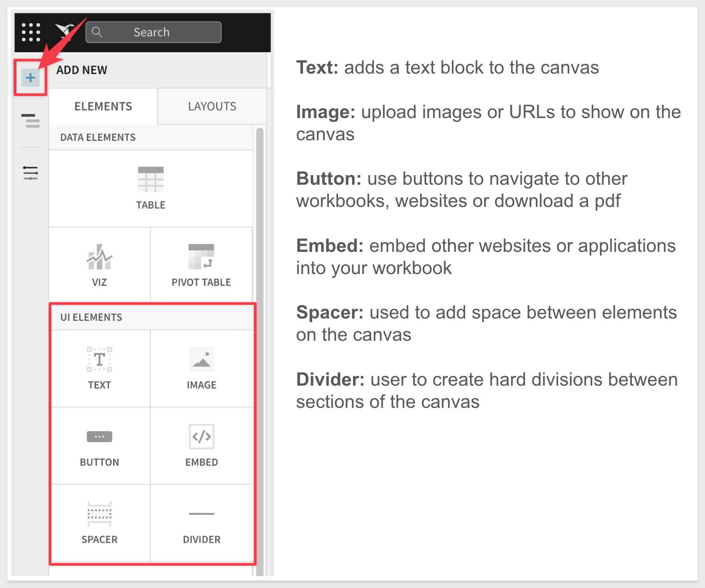

author: pballai
id: Fundamentals 5: Working with Dashboards
summary: New and trial users who want to learn about creating Dashboards in Sigma
categories: fundamentals
environments: web
status: Published
feedback link: https://github.com/sigmacomputing/sigmaquickstarts/issues
tags: Getting Started, Analytics, Data Engineering, BI, Business Intelligence, Sigma, Sigma Computing, Snowflake, Dashboards, Visualization, Analysis, Excel, Spreadsheet
lastUpdated: 2023-03-15

# Fundamentals 5: Working with Dashboards

## Overview 
Duration: 5 

This QuickStart is part of a series designed to instruct new users how to use Sigma Dashboards, combining learning from previous QuickStarts and going further still.

This QuickStart assumes you have already taken the “Fundamentals 1: Getting Around” QuickStart and are now familiar with Sigma’s user interface (UI). Given this, some steps are assumed to be known and may not be shown in detail. 

We will be working with some common sales data from our fictitious company ‘Plugs Electronics’. This data is provided to you automatically. We will look at sales data, but throughout the course of other QuickStarts will incorporate more sources from associated store, product, and customer data.

The other “Fundamentals” QuickStarts explore topics such as working with Tables, Pivot Tables, Visualizations and more. We have broken these QuickStarts up so that they can be taken in any order you want, except the “Getting Around” QuickStart should be taken first and this QuickStart last.

 ### Target Audience
Sigma combines with the unlimited power of the cloud data warehouse and the familiar feel of a spreadsheet; no limit on the amount of data you wish to analyze. Sigma is awesome for users of Excel and even better for customers who have millions of rows of data.

Typical audience for this QuickStart is users of Excel, common Business Intelligence or Reporting tools and semi-technical users who want to try out or learn Sigma. Everything is done in a browser so you already know how to use that. No SQL or technical skills are needed to do this QuickStart.

### Prerequisites

<ul>
  <li>A computer with a current browser. It does not matter which browser you want to use.</li>
  <li>Completion of the QuickStart “Fundamentals 1: - Getting Around”</li>
  <li>Access to your Sigma environment. A Sigma trial environment is acceptable and preferred.</li>
  <li>If have not already, you can sign up for a Sigma Trial here:</li>
</ul>

<button>[Free Trial](https://www.sigmacomputing.com/free-trial/)</button>
  
### What You’ll Learn
Through this QuickStart we will build a Dashboard, building on previous Fundamental QuickStarts content. We will learn how to place Elements on the Dashboard Page, move them around, resize them and add Controls to enhance and filter the Dashboard. 

### What You’ll Build
We will be working with some common sales data from our fictitious company ‘Plugs Electronics’. This data is provided to you automatically. 

We will build a Dashboard that looks like this:

<!-- END OF OVERVIEW -->

## **Basics**
Duration: 5

Dashboards are a great way to show and share a set of Elements that are meant to be looked at together. This could be a high level executive summary down to a very specific set of visualizations to analyze a specific part of the business. In this QuickStart we will use the work from the previous module to assemble a dashboard.

<aside class="postive">
<strong>IMPORTANT:</strong>  In Sigma, an entire canvas or just a subset of elements on the canvas can be turned into a Dashboard for others to view. You have full control on how end viewers can interact with the dashboard.
</aside>

 In this QuickStart the viewers can drill into the dashboard to explore the underlying data powering it, but optionally the dashboard could be “locked down” so end viewers cannot drill through the dashboard to underlying data.

A fully built Dashboard has been provided to you as part of your Sigma Trial. It is called Plugs Sales Performance and looks like below. In the other QuickStarts we have built examples of many of the Elements shown and putting them all together will be easy!

It is also considered a best practice to include a Workbook Page with information about the Dashboard along with anything else that the user may want to know about the way the data is represented (ie: data is refreshed every 15 min). For example, including a Workbook Page called “Tips and Tricks” like below will help the user know some simple but useful things.

<!-- END -->

## **Creating a Dashboard**
Duration: 10

Our starting point is the “Plugs Sales” Workbook created and built upon during the other QuickStarts. By reusing this Workbook, you should be able to leverage the Elements you already built into your Dashboard.

In Sigma, `open the Workbook “Plugs Sales”` and place it in `edit mode`. If you completed the other “Getting Started” QuickStarts you will have a few Pages as below. We are going to consolidate the Elements we built onto a new Page called Dashboard.

Create a `new Workbook Page` and rename it to `Dashboard`.

For each Page that has an Element we want to move to the Dashboard, follow the same steps. Navigate to the Tables Page and using the Elements menu, click to move the Table to the Dashboard as shown below:

We moved Elements from the Pages named Tables, Viz, Maps and PivotTable. **You may not have all these Pages if you did not complete the other Getting Started QuickStarts.** That is ok, the workflow is what we want you to understand and you could build Elements directly on the Dashboard Page anytime too. Sigma is flexible and you can work how you want once you understand some of the options. 

Since we moved Elements (instead of making copies) we don't really need the old Pages so we can delete them but **don’t delete the “Data” Page** as all our Elements reference that. 

We now have all Elements on the Dashboard page but they laid out full size on top of each other: 

Every Element that has been added to a canvas can easily be moved around and arranged in any manner you like. 

Click anywhere on the Table and you can see a small `“grab-bar”` in the center of the bottom border. We can grab this and shrink the vertical size of the Table. 

You can also move Elements around by `clicking to select` them and then `dragging` them around the Canvas to drop them where a black line appears. You will notice a small `hand icon` that appears (hover over the `3-dot` menu on the right top corner of any Element) letting you know you can move an Element. 

<aside class="negative">
<strong>NOTE:</strong>  For some elements, such as visualizations and text, only the margins will allow dragging.  In the case of map visualizations, clicking and dragging instead pans the map within the element. Note that when any element is moused over, a set of icons appears in the top right corner; the double vertical dotted line icon within this set is always available to be clicked and dragged.  
</aside>

Drag the two Chart Viz to the top of the page and next to each other as below:

Experiment moving and placing your Elements till you are satisfied. It is easy to adjust the layout of the Canvas to suit your needs by using Canvas Elements.
Click the `+ Add New icon` in the `Element menu`. You will see there are several UI Elements that you can use to adjust and enhance your Dashboard’s Canvas:

<!-- END -->

## **Add Text / Labels**
Duration: 10

Next, let’s give this dashboard some context for our users. Using our `Text elements`, we can give the page a title, as well as let users know what this dashboard is used for, giving them context. 

`Clicking the ‘+’` icon on the upper left-hand pane next to `Page Elements`, select `Text`. This will add a Text box to the canvas. `Drag the text box` to the top of the canvas and give it the name `Sales Performance`. 

<aside class="negative">
<strong>NOTE:</strong>  You can adjust the font, color and size by selecting the text and using the control bar at the top of the Dashboard.
</aside>

Let’s add one more text box and drag it below the title. This time we want to use it to display text and the total revenue. Edit the Text box and type "Total Revenue YTD is" and then type the `=` sign. This allows you to add an inline formula. Use the formula: `Sum([Plugs Sales/Revenue])'. Hit Enter.

## **Add Controls**
Duration: 10

Next let’s add a control element to our canvas. Controls enable interactions with the chart such as filter the charts when in use. Clicking the `‘+’ icon` on the upper left hand pane next to `Page Elements`, select `Date`. This will add a Date control to the canvas.

After adding the `Date control`, let’s `drag it` to the right of the description text box and `update the control_id` to say `Date-Range` and update the `control label` to say `Select a Date Range`:

Next we need to tell the control which elements we want the control to apply to. 

`Clicking on the filter control`, we have some options in the left hand pane. Select `Targets`. Then select `Add Target` and select our bar chart.

Let's do this for the other Elements on the Dashboard. When done you should have 4 Targets (assuming you have 4 items on your Dashboard) all filter each Elements [date] field. 

Now users that are interacting with the canvas can use the date control to filter data as they see fit. Below the Date filter is shown set for a 1 year range and the other Page Elements all adjust automatically:

<!-- END -->

## **Add Hide Data Page**
Duration: 5

Lastly, before we share this with others, we may not want them to see the data tab from which we are pulling these charts from. 

If you click the dropdown in the bottom left hand corner on the “Data” page, we can `hide the “Data”` page from other users who may be viewing or exploring our dashboard.

`Click the dropdown and select Hide`. 

The Workbook Page label now shows the Page as hidden but we can still see it. This is because we are in Edit mode. Once the Page is Published and viewed, the hidden Pages will not be visible to the user.

<!-- END -->

## **Drill Down**
Duration: 10

Right Click on one of the bars in the bar chart. Notice that there is a drill-down option? Do you recall configuring this somewhere? We did not; **with Sigma users are free to explore in an unconstrained fashion without having to ask for an additional (ad-hoc) report.** 

After clicking” Drill Down” we are presented on all available data columns...select `Profit Margin`.

<aside class="postive">
<strong>Go Beyond the Dashboard:</strong>  Sigma is unique in that with a single click a user can go from a dashboard visualization down to a table view of the underlying data and lowest level of data that powers that visualization. This is critical because visualizations, when viewed, typically generate more questions, and it is key for users to be able to dive into the data in a self-service manner to quickly answer these new questions.

With many other BI tools, dashboards are static and end viewers cannot click into them to get to the underlying data. When the dashboards generate more questions for users, it can take hours or days, and involve BI tool administrators, to get answers.
</aside>

The Chart reorients to show Profit based on `Profit Margin`:

Want to see the row level detail? No problem; just click the arrow icon as shown below and the Chart opens along with the underlying data for further analysis:

We can now see profit margin line item detail:

<!-- END -->

## What we've covered
Duration: 5

This QuickStart covered Dashboard basics, building on previous Fundamentals QuickStarts content. We learned how to place Elements on the Dashboard Page, move them around, resize them and add Controls to enhance and filter the Dashboard. 

The final product should have looked something like this:

<!-- THE FOLLOWING ADDITIONAL RESOURCES IS REQUIRED AS IS FOR ALL QUICKSTARTS -->
**Additional Resource Links**

[Help Center Home](https://help.sigmacomputing.com/hc/en-us) 
[Sigma Community](https://community.sigmacomputing.com/) 
[Sigma Blog](https://www.sigmacomputing.com/blog/) 
 

&emsp;

<!-- END OF WHAT WE COVERED -->
<!-- END OF QUICKSTART -->