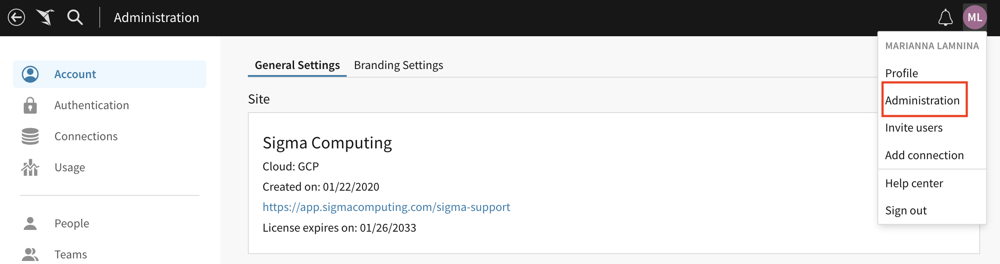
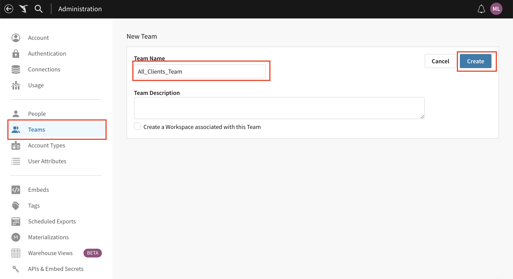
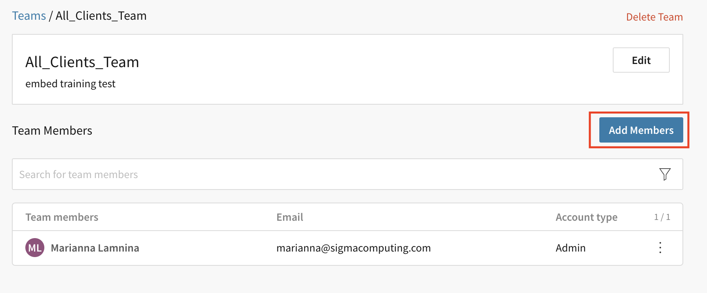
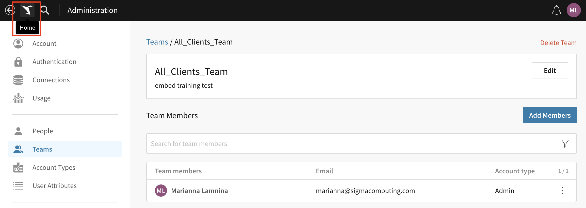
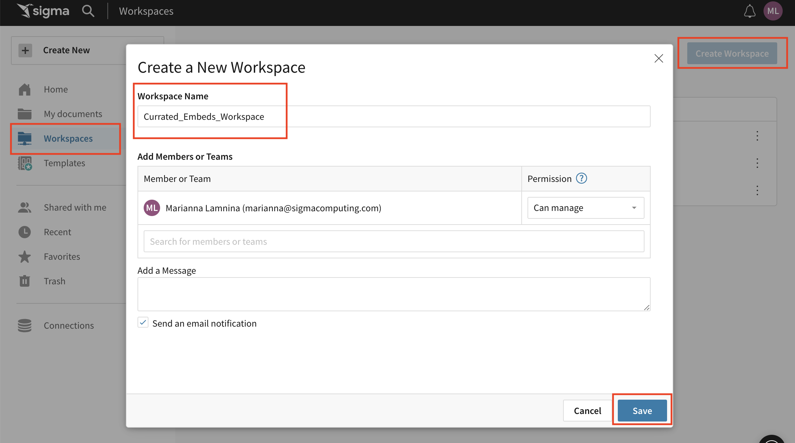
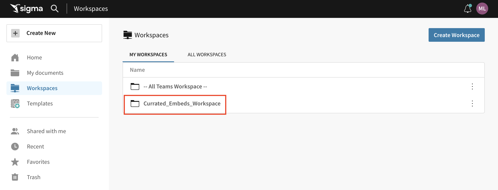
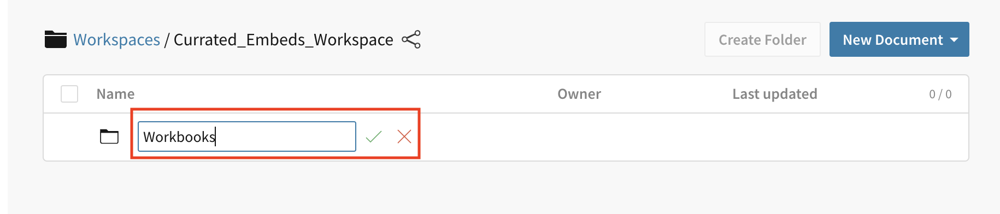
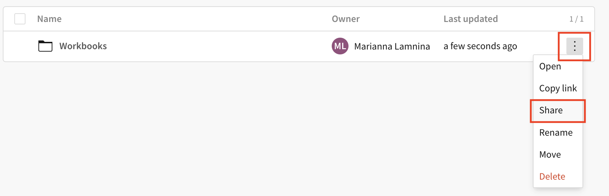
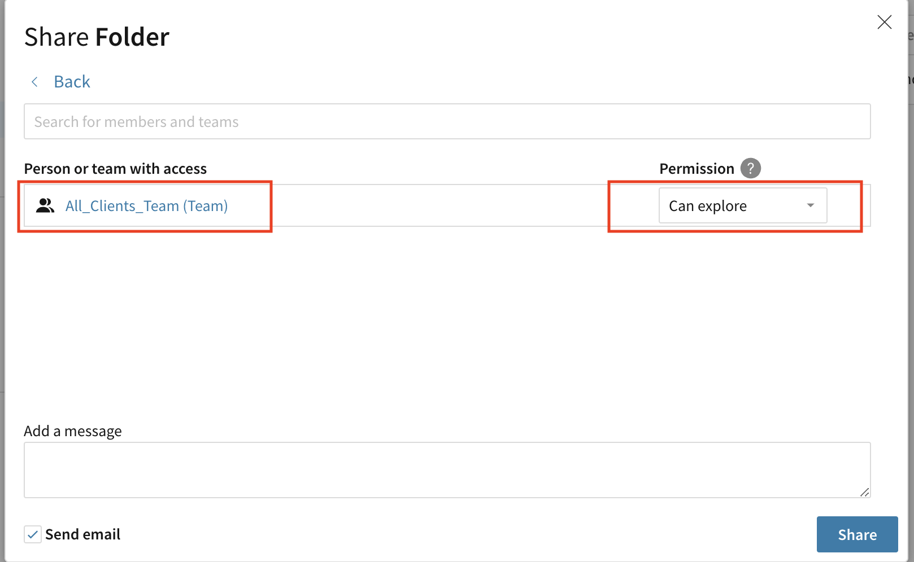

author: 123marianna123
id: ml_embedmodule1_quickstart
summary: A lab for Advanced Embedding Module 1, Lesson 1.
categories: Embedding
environments: web
status: Hidden
feedback link: https://github.com/sigmacomputing/sigmaquickstarts/issues
tags: 

<!-- 
SETTING THE AVAILABLE CATEGORIES WILL MAKE YOUR QUICKSTART PART OF A GROUP THAT USERS CAN FILTER ON IN THE QUICKSTART PORTAL.

AVAILABLE CATEGORIES ARE:
Administration
Embedding
Functions
Fundamentals
Partners
Snowflake
Tables (include pivot and input tables for now)
Use-cases

PLEASE REVIEW THE SIGMA QUICKSTART STYLE GUIDE. ALL QUICKSTART SHOULD SHARE A COMMON LOOK AND FEEL. 

YOU MAY WANT TO REVIEW A PUBLISHED GUIDE FIRST SO THAT YOU ARE FAMILIAR WITH HOW COMMON MARKDOWN IS APPLIED YOU CAN ACCESS THE SIGMA QUICKSTART STYLE GUIDE HERE:
http://localhost:8000/guide/sigma-style-guide/index.html?index=..%2F..internal#0
-->

# Setting Up Teams and Workspaces for Embedding
<!-- The above name is what appears on the website and is searchable. -->

## Overview 
Duration: 5 
<!--Duration is deprecated and no longer required, however the code still expects to see it so include it for each section. The actual time value does not matter. -->

This lab will guide you through the process of content segregation to prepare data for embedding.

### Target Audience
Sigma partners who will be helping customers with embedding.

### Prerequisites

<ul>
  <li>A sigma account with admin access.</li>
  <li>Previous experience with Sigma, including creating workbooks and workspaces.</li>
  <li>A broad understanding of what embedding is and the different types of embedding available with Sigma.</li>
</ul>
  
### What You’ll Learn
How to set up workspaces, folders, and teams to prepare data for embedding.

<!-- NOTE: SIGMA LOGO REQUIRED AT END OF EACH ## SECTION -->
<!-- END OF OVERVIEW -->

## Data for All Clients
Duration: 20

### Create a team of all clients.
1. Go to Sigma and open the administration screen.

2. Click `teams`.
3. Click `Create Team`.
4. Update the team name to `All_Clients_Team`
5. Click `Create`.

6. Click `Add Members`.

7. Select all the clients.
8. Click `Add`.

### Create a new workspace.
1. Go to the homepage.

2. Click `Workspaces`.
3. Click `Create Workspace`.
4. Change the name to `Curated_Embeds_Workspace`
5. Click `Save`.

### Create folders in your workspace.
1. Open the `Curated_Embeds_Workspace`.

2. Click `Create Folder`.
3. Update the title to `Workbooks`.

4. Click the menu.
5. Click `share`.

6. Select `All_Clients_Team`.
7. Under permission, select `Can Explore`.

8. Repeat steps 1-3, but make the title of this folder `Datasets`.

<aside class="positive">
<strong>IMPORTANT:</strong>  Make sure you always giving access to the folder, and not to the workspace, because you’ll later put other content in the workspace, that you only want some clients to access.
</aside>

<!-- END OF SECTION-->

## Data for Select Teams
Duration: 20

### Create teams.
1. Go to the administration screen.
2. Click `teams`.
3. Click `Create Team`
4. Update the team name to `East_team`
5. Select the team members in the `East` region.
6. Click `Create`.
7. Repeat steps 1-6, for  `West_team`, `Southwest_team`, `Midwest_team`, and`South_team`.

### Create folders
1. Go back to the `Curated_Embeds_Workspace`.
2. Click `New Folder`.
3. Update the title to `West_Workbooks`.
4. Click the menu.
5. Click `share`.
6. Select `West_team`.
7. Under permission, select `Can Explore`.
8. Repeat steps 1-7, for the remaining teams.

<!-- END OF SECTION-->

## Allow clients to create dashboards
**Special use case**: Your customers want their clients to be able to create their own dashboards. This is less common, but still possible. 

To properly set up for this use case:
1. Create a separate workspace and team for each client, using the `ClientName_Team` format. 
2. Give the team `can contribute` access to the appropriate workspace.

<aside class="negative">
<strong>NOTE:</strong>  This use case is rare!
</aside>

## What we've covered
Duration: 5

In this lab we learned how to set up our workspaces, folders, and teams to make embedding seamless.

<!-- THE FOLLOWING ADDITIONAL RESOURCES IS REQUIRED AS IS FOR ALL QUICKSTARTS -->
**Additional Resource Links**

[Help Center Home](https://help.sigmacomputing.com/hc/en-us) 
[Sigma Community](https://community.sigmacomputing.com/) 
[Sigma Blog](https://www.sigmacomputing.com/blog/) 
 

&emsp;

<!-- END OF WHAT WE COVERED -->
<!-- END OF QUICKSTART -->
