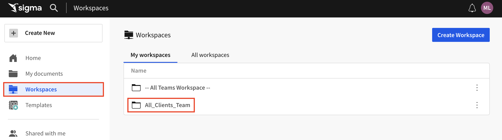
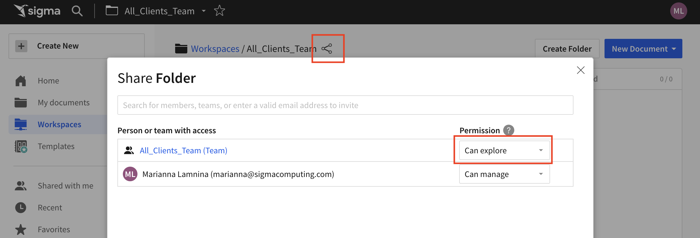
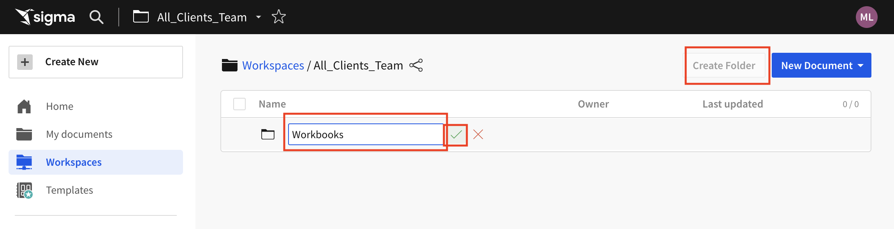
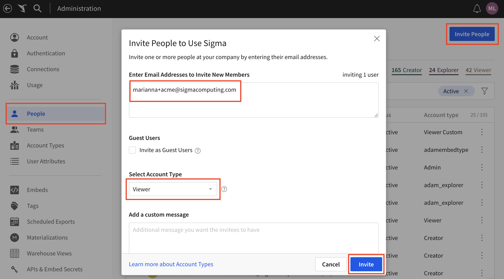

author: 123marianna123
id: ml_embed_m1_l1
summary: Embedding ONDEMAND Module 2, Lesson 1 Lab
categories: Embedding
environments: web
status: Hidden
feedback link: https://github.com/sigmacomputing/sigmaquickstarts/issues
tags:

# Setting Up Teams and Workspaces for Embedding
<!-- The above name is what appears on the website and is searchable. -->

## Overview
Duration: 5

This lab will guide you through the process of content segregation to prepare data for embedding.

### Target Audience
- Fullstack developers
- Admins
- Workbook developers

### Prerequisites

<ul>
  <li>Intermediate full-stack software development and Sigma admin experience.</li>
  <li>Knowledge of how to create a Sigma workbook.</li>
  <li>Basic knowledge of Sigma teams, workspaces, datasets and workbooks.</li>
</ul>

### What You’ll Learn
How to set up workspaces, folders, and teams to prepare data for embedding.

<!-- END OF OVERVIEW -->

## Data for All Clients
Duration: 20

### Create a team and workspace for all clients.
1. Go to Sigma and open the administration screen.

2. Click `Teams`.
3. Click `Create Team`.
4. Update the team name to `All_Clients_Team`
5. Check off `Create a Workspace associated with this Team`.
6. Click `Create`.

### Grant appropriate access.
1. From the Sigma homepage, click `Workspaces`.
2. Open the Workspace you just created by clicking on it.

3. Click the share icon next to the workspace name.
4. Change the access for the `All_Clients_Team` to `Can Explore`.

### Create folders in your workspace.
1. Open the `All_Clients_Workspace`.
2. Click `Create Folder`.
3. Update the title to `Workbooks`.
4. Click the green checkmark.

5. Repeat steps 1-4, but make the title of this folder `Datasets`.

<!-- END OF SECTION-->

## Data for Select Teams
Duration: 20
### Create client-specific teams and workspaces.
1. From the administration screen, click `Teams`.
2. Click `Create Team`
3. Update the team name to `Acme_team`
4. Check off `Create a Workspace associated with this Team`.
5. Click `Create`.
6. Repeat steps 1-5 for `Mrsupply_team`.

### Add members.
1. Go to the administration screen and click `People`.
2. Click  `Invite People`.
3. Enter a dummy email address by adding `+keyword` to your email. For example, `marianna+acme@sigmacomputing.com`.
4. Keep the default account type: `Viewer`.
5. Scroll down and select `Acme_team` and  `All_Clients_Team` under `Assign Team(s)`.
6. Click `Invite`.

7. Log in to your email and accept the invitation by clicking `Set up your account`.
8. Enter your name and create a password.
9. Then sign out and sign back into your main account.
10. Repeat this process to add a different user to the Mr.Supply team.

<!-- END OF SECTION-->

## What we've covered
Duration: 5

In this lab we learned how to set up our workspaces, folders, and teams to make embedding seamless.

**Additional Resource Links**

Be sure to check out all the latest developments at [Sigma's First Friday Feature page!](https://quickstarts.sigmacomputing.com/firstfridayfeatures/)

[Help Center Home](https://help.sigmacomputing.com/hc/en-us) 
[Sigma Community](https://community.sigmacomputing.com/) 
[Sigma Blog](https://www.sigmacomputing.com/blog/) 
 

&emsp;
&emsp;

<!-- END OF WHAT WE COVERED -->
<!-- END OF QUICKSTART -->
