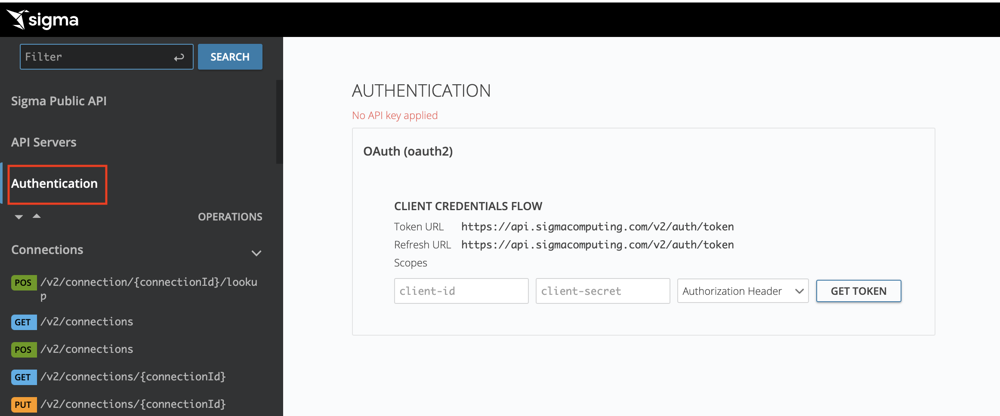
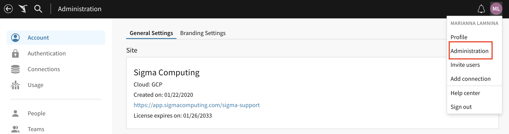
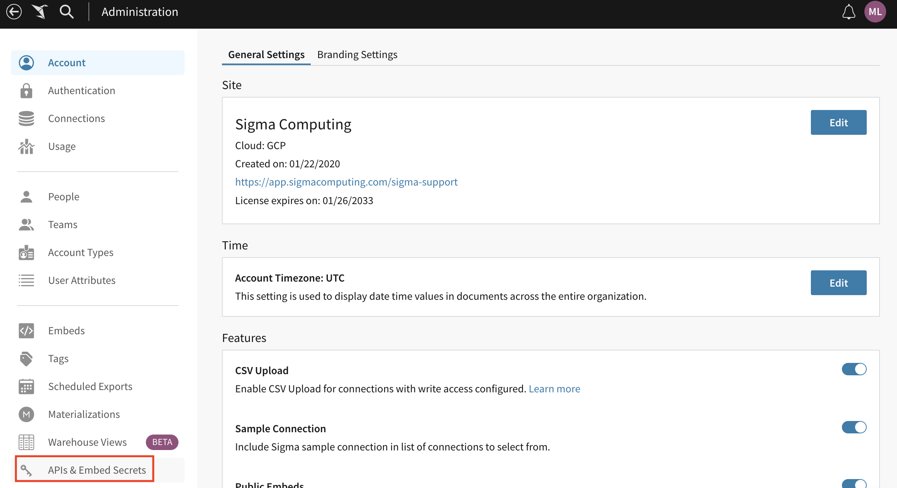
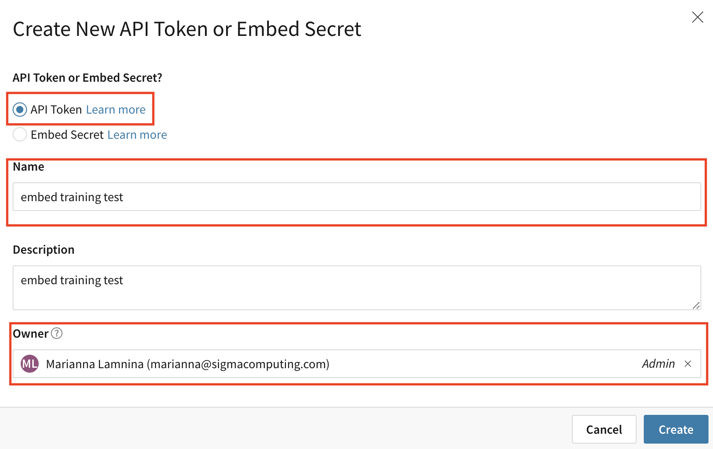
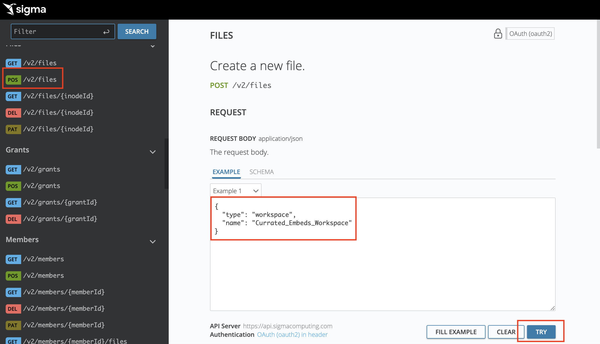
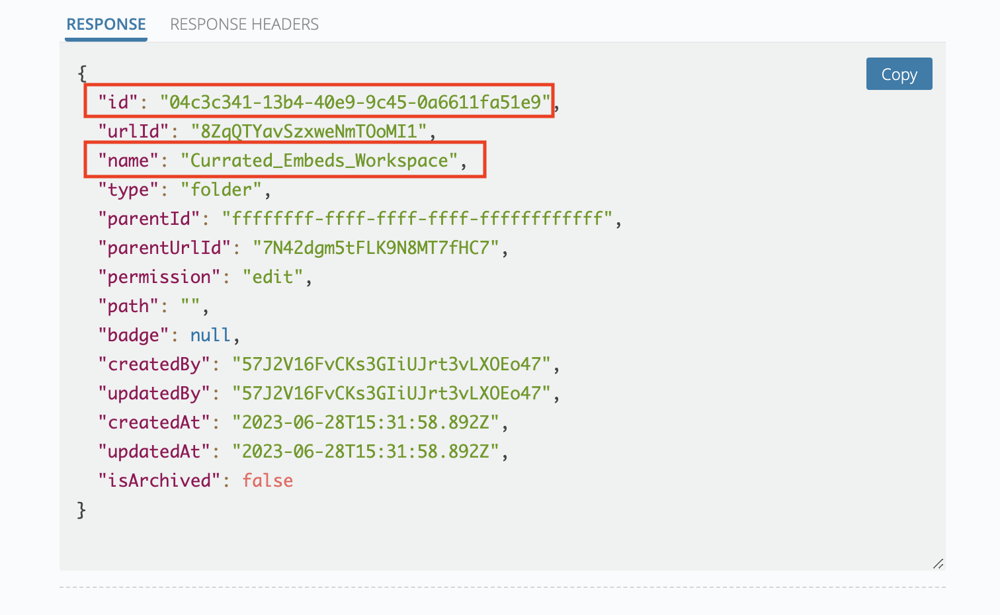
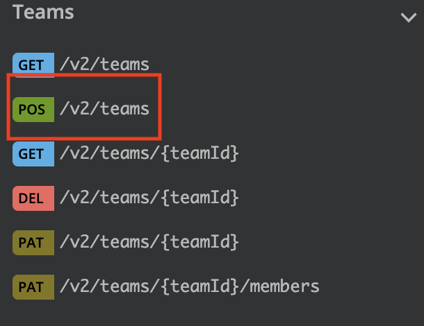

author: 123marianna123
id: ml_embed_m1_l2
summary: This is a sample Sigma Guide
categories: Embedding
environments: web
status: Hidden
feedback link: https://github.com/sigmacomputing/sigmaquickstarts/issues
tags: 

<!-- 
SETTING THE AVAILABLE CATEGORIES WILL MAKE YOUR QUICKSTART PART OF A GROUP THAT USERS CAN FILTER ON IN THE QUICKSTART PORTAL.

AVAILABLE CATEGORIES ARE:
Administration
Embedding
Functions
Fundamentals
Partners
Snowflake
Tables (include pivot and input tables for now)
Use-cases

PLEASE REVIEW THE SIGMA QUICKSTART STYLE GUIDE. ALL QUICKSTART SHOULD SHARE A COMMON LOOK AND FEEL. 

YOU MAY WANT TO REVIEW A PUBLISHED GUIDE FIRST SO THAT YOU ARE FAMILIAR WITH HOW COMMON MARKDOWN IS APPLIED YOU CAN ACCESS THE SIGMA QUICKSTART STYLE GUIDE HERE:
http://localhost:8000/guide/sigma-style-guide/index.html?index=..%2F..internal#0
-->

# Content Segregation with Swagger
<!-- The above name is what appears on the website and is searchable. -->

## Overview 
Duration: 5 
<!--Duration is deprecated and no longer required, however the code still expects to see it so include it for each section. The actual time value does not matter. -->

Now that you’ve learned about best practices for setting up your workspaces, folders, and teams to prepare for embedding Sigma, let’s take a look at how we can automate this process.

In this lab, we’ll use a tool called Swagger to create workspaces, folders, and teams using Sigma’s API directly from the browser.

 ### Target Audience
Sigma partners who will be helping customers with embedding.

### Prerequisites
<ul>
  <li>A sigma account with admin access.</li>
  <li>Previous experience with Sigma, including creating workbooks and workspaces.</li>
  <li>A broad understanding of what embedding is and the different types of embedding available with Sigma.</li>
</ul>

### What You’ll Learn

How to set up workspaces, folders, and teams to prepare data for embedding using Swagger.

## **Authenticate in Swagger**
Duration: 20

1. Click https://docs.sigmacomputing.com/api/v2/ to open Swagger.
2. Open the `authentication` page from the left panel.

3. Go to Sigma.
4. Navigate to the `Administration` page.

5. Click `APIs and Embed secrets`.

6. Click `Create New`.
7. Select `API Token`.
8. Give the secret a name and choose yourself as the owner. Click `create`.

7. Copy and paste the client ID and client secret from Sigma into Swagger.
8. Click `GET TOKEN `.

<aside class="positive">
<strong>IMPORTANT:</strong><br>  Save the client ID and client secret in a safe location, since you won’t be able to find them again. In a production environment, it's safest to store this in an encrypted key vault approved by your security and governance team.
</aside>

## **Create A Workspace with Folders**
1. In the left-hand panel, click on `POS /v2/files`. 
2. Update the JSON to create the workspace you need. Update the type to say `workspace` and update the name to say `Curated_Embeds_Workspace`.
3. Click `Try`. 

4. Scroll down to the response. If you see a workspace ID, name and created and updated by details, you’ve successfully created a workspace! 


<aside class="negative">
<strong>NOTE:</strong><br> You might also see a message that says `Token missing or malformed` or a code that says `unauthorized`. That means you haven’t properly authenticated through Sigma. To correct this, go back to authentication and enter your client ID and client secret.
</aside>


5. Update the JSON again to say `folder` instead of `workspace` and `Datasets` instead of `Curated_Embeds_Workspace.`
6. Click `Try.`
7. Repeat steps 5 and 6 three more times to create the following folders: `Workbooks`, `Sales_Workbooks`, `HR_Workbooks`.


<aside class="negative">
<strong>NOTE:</strong><br> Alternatively, you can create the workspace by running the curl command here in your terminal. It’ll work the same way. You can also add a python script to loop through the command and create all the workspaces and folders you need at once.

We’ve included a script for you below, so you don’t have to write it yourself.
</aside>

```#!/user/bin/env python3

import argparse
import csv

import requests

def get_base_url(cloud: str):
	""" Creates the base url 
		:cloud:       the cloud provider for the organization
		:returns:     base url that will be used for authentication
	"""

	print(cloud)
	base_url = ''
	if cloud == 'gcp':
		base_url = 'https://api.sigmacomputing.com'
	elif cloud == 'aws':
		base_url = 'https://aws-api.sigmacomputing.com'
	elif cloud == 'azure':
		base_url = 'https://api.us.azure.sigmacomputing.com'
	return base_url
	

def get_access_token(base_url, client_id, client_secret):
	""" Gets the access token from Sigma
		:client id:      Client id generated from Sigma
		:client_secret:  Client secret generated from Sigma
		:returns:        Access token
	"""
	payload = {
        "grant_type": "client_credentials",
        "client_id": client_id,
        "client_secret": client_secret
    }
	response = requests.post(f"{base_url}/v2/auth/token", data=payload)
	data = response.json()
	return data["access_token"]


def get_headers(access_token):
    """ Gets headers for API requests
        :access_token:  Generated access token
        :returns:       Headers for API requests
    """
    return {"Authorization": "Bearer " + access_token}


def create_workspace(base_url, headers, name):
	''' Creates a new workspace 
		:base_url:     Base URL based on the cloud provider
		:headers:      Header containing access token
		:name:         Name of the workspace
		:returns:      workspaceId of the created workspace
	'''

	payload = {
		"name": name
	}

	try:
		response = requests.post(f"{base_url}/v2/workspaces", headers = headers, json=payload)
		response.raise_for_status()
	except requests.exceptions.RequestException as e:
		print(f"Error: {e}")
	else:
		workspace_data = response.json()
		workspace_id = workspace_data['workspaceId']
		print(f"Workspace {name} created with id {workspace_id}")
		return workspace_id
	

def create_team(base_url, headers, name):
	''' Creates a new team
		:base_url:     Base URL based on the cloud provider
		:headers:      Header containing access token
		:name:         Name of the team
		:returns:      teamId of the created team
	'''

	payload = {
		"name": name
	}

	try:
		response = requests.post(f"{base_url}/v2/teams", headers = headers, json = payload)
		response.raise_for_status()
	except requests.exceptions.RequestException as e:
		print(f"Error: {e}")
	else:
		team_data = response.json()
		team_id = team_data['teamId']
		print(f"Team {name} created with id {team_id}")
		return team_id
	
def create_folder(base_url, headers, name, parent_id):
	''' Creates a new folder
		:base_url:     Base URL based on the cloud provider
		:headers:      Header containing access token
		:name:         Name of the folder
		:parent_id:    ID of the parent workspace this will be added to
		:returns:      folderId of the created folder
	'''

	payload = {
		"type": "folder",
		"name": name,
		"parentId": parent_id
	}

	try:
		response = requests.post(f"{base_url}/v2/files", headers = headers, json = payload)
		response.raise_for_status()
	except requests.exceptions.RequestException as e:
		print(f"Error: {e}")
	else:
		folder_data = response.json()
		folder_id = folder_data['id']
		print(f"Folder {name} created with id {folder_id}")
		return folder_id


def create_grant(base_url, headers, team_id, node_id, permission):
	''' Grants a team access to a file
		:base_url:     Base URL based on the cloud provider
		:headers:      Header containing access token
		:team_id:      Id of the team that we are adding the permissions
		:node_id:      Id of the file that we are granting permission to 
	'''

	payload = {
		"grantee" : {
			"teamId" : team_id
		},
		"permission": permission,
		"inodeId": node_id 
	}

	try: 
		response = requests.post(f"{base_url}/v2/grants", headers = headers, json = payload)
		response.raise_for_status()
	except requests.exceptions.RequestException as e:
		print(f"Error: {e}")
	else:
		print(f"Team with ID {team_id} granted {permission} access to folder with ID {node_id}")


def main():
	parser = argparse.ArgumentParser(
		'Create Workspace')
	parser.add_argument(
		'--env', type = str, required = True, help = 'env to use: [production | staging].')
	parser.add_argument(
        	'--cloud', type=str, required=True, help='Cloud to use: [aws | gcp]')
	parser.add_argument(
       		'--client_id', type=str, required=True, help='Client ID generated from within Sigma')
	parser.add_argument(
        	'--client_secret', type=str, required=True, help='Client secret API token generated from within Sigma')
	parser.add_argument(
        '--csv', type=str, required=True, help='CSV file containing Workspaces, Folders, Teams and Permissions.  Column names are case sensitive')

	args = parser.parse_args()

	#Getting URL and Headers
	base_url = get_base_url(cloud = args.cloud)
	access_token = get_access_token(base_url, args.client_id, args.client_secret)
	headers = get_headers(access_token)

	#Getting list of workpaces to see if workspace is created
	workspaces = requests.get(f"{base_url}/v2/workspaces", headers = headers)
	workspaces_data = workspaces.json()
	#Store in the following dictionary
	workspaces_dict = {}
	for w in workspaces_data:
		workspaces_dict[w['name']] = w["workspaceId"]

	#Getting list of teams in order to check if teams exist
	teams = requests.get(f"{base_url}/v2/teams", headers = headers)
	teams_data = teams.json()
	#Store existing teams in the following dictionary
	teams_dict = {}
	for t in teams_data:
		teams_dict[t['name'].lower()] = t['teamId']
	
	
	updated_grants = []
	with open(args.csv) as csvfile:
		reader = csv.DictReader(csvfile)
		for row in reader:
			updated_grants.append(row)

	
	for m in updated_grants:
		try: 
			if len(m['Workspace']) > 1:
				workspace_name = m['Workspace']
			else: 
				workspace_name = None
		except KeyError:
			print(f"\u2717 CSV FILE ERROR!")
			print("A column named \"Workspace\" is required in the csv.")
			raise SystemExit("Script Aborted")

		try: 
			if len(m['Folder']) > 1:
				folder_name = m['Folder']
			else: 
				folder_name = None
		except KeyError:
			print(f"\u2717 CSV FILE ERROR!")
			print("A column named \"Folder\" is required in the csv.")
			raise SystemExit("Script Aborted")

		try: 
			if len(m['Team']) > 1:
				team_name = m['Team']
			else: 
				team_name = None
		except KeyError:
			print(f"\u2717 CSV FILE ERROR!")
			print("A column named \"Team\" is required in the csv.")
			raise SystemExit("Script Aborted")

		try: 
			if len(m['Permission']) > 1:
				permission = m['Permission']
			else: 
				permission = None
		except KeyError:
			print(f"\u2717 CSV FILE ERROR!")
			print("A column named \"Permission\" is required in the csv.")
			raise SystemExit("Script Aborted")
		
		if workspace_name in workspaces_dict:
			workspace_id = workspaces_dict[workspace_name]
		else:
			workspace_id = create_workspace(base_url, headers, workspace_name)
			workspaces_dict[workspace_name] = workspace_id
		
		folder_id = create_folder(base_url, headers, folder_name, workspace_id)

		if team_name.lower() in teams_dict:
			new_team = teams_dict[team_name.lower()]
		else:
			new_team = create_team(base_url, headers, team_name)
	
		create_grant(base_url, headers, new_team, folder_id, permission)


if __name__ == '__main__':
	main()

```


## Create and Assign Teams
1. Click on POS /v2/teams and updating the JSON as to create the following teams:`All_Clients_Team`, `East_team` `Southwest_team`, `Midwest_team`, `South_team`, and `West_team`,




2. Assign these teams by [insert steps here]. We’ll give the `All_Clients_Team` `can explore` access to the `workbooks` folder, the `East_Team` `can explore` access to the `East_workbooks` folder, etc.


<!-- END OF SECTION-->

## What we've covered
Duration: 5

In this lab we learned how to set up Workspaces, Folders, and Teams for embedding using Swagger.


<!-- THE FOLLOWING ADDITIONAL RESOURCES IS REQUIRED AS IS FOR ALL QUICKSTARTS -->
**Additional Resource Links**

[Help Center Home](https://help.sigmacomputing.com/hc/en-us)<br>
[Sigma Community](https://community.sigmacomputing.com/)<br>
[Sigma Blog](https://www.sigmacomputing.com/blog/)<br>
<br>

[](https://twitter.com/sigmacomputing)&emsp;
[](https://www.linkedin.com/company/sigmacomputing)
[](https://www.facebook.com/sigmacomputing)


<!-- END OF WHAT WE COVERED -->
<!-- END OF QUICKSTART -->
