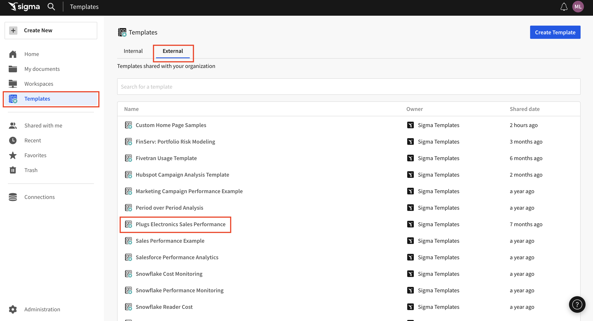
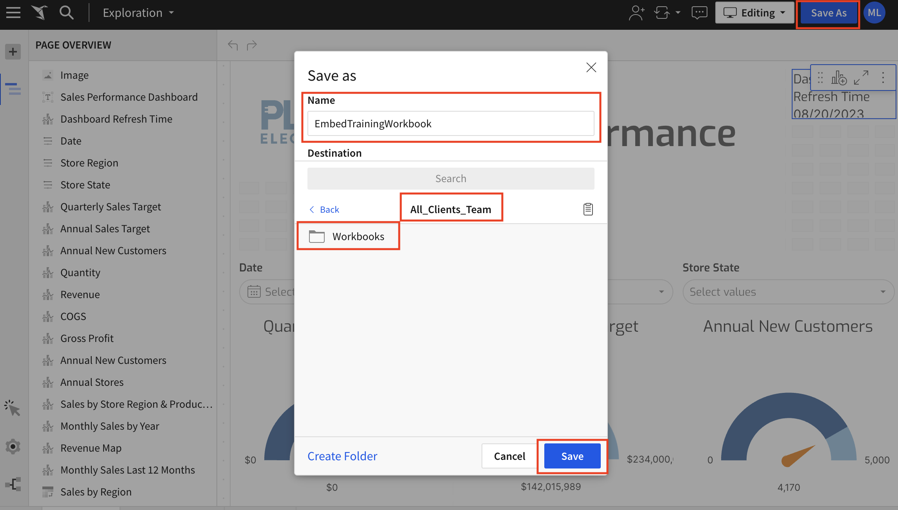
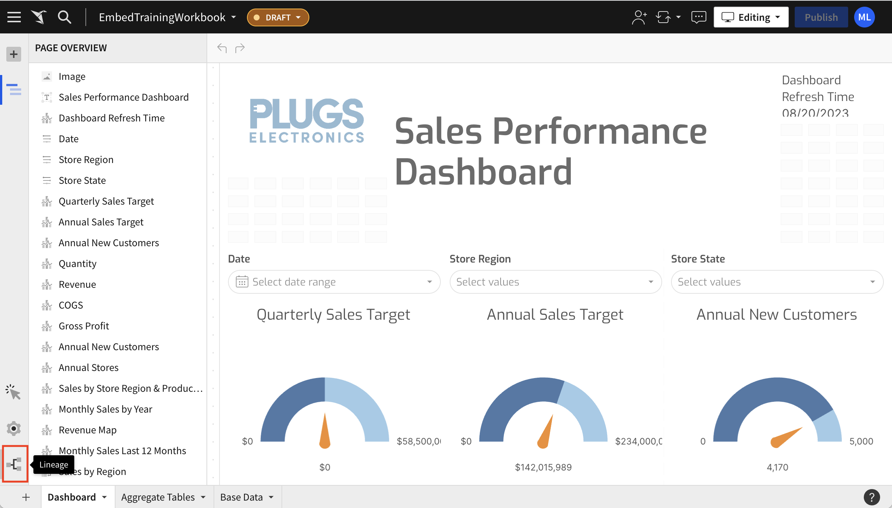
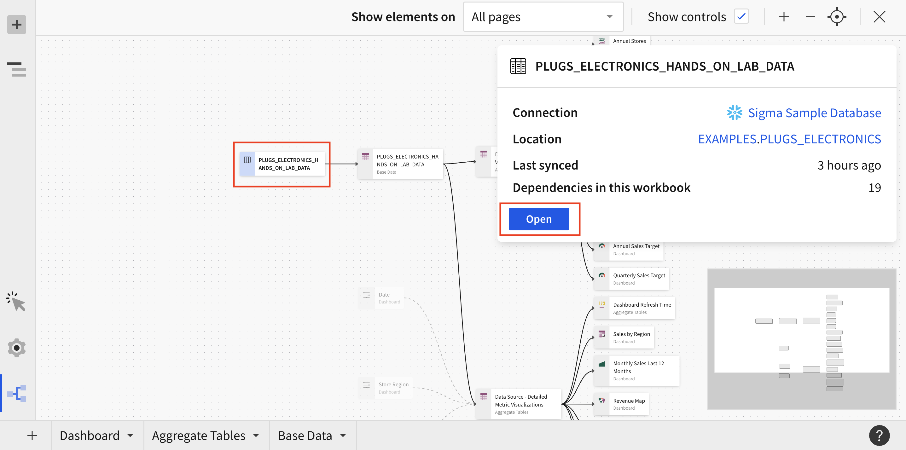
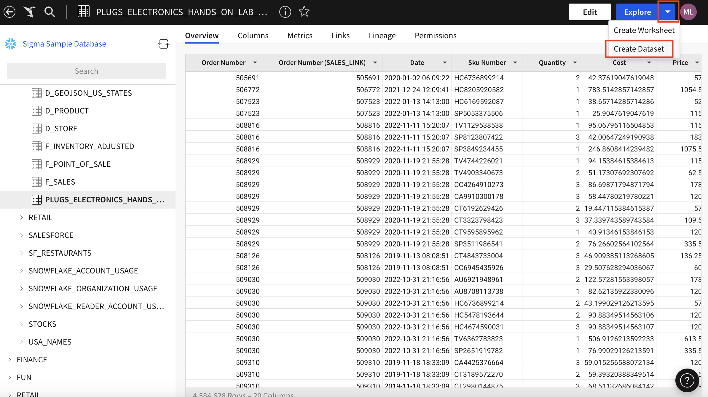
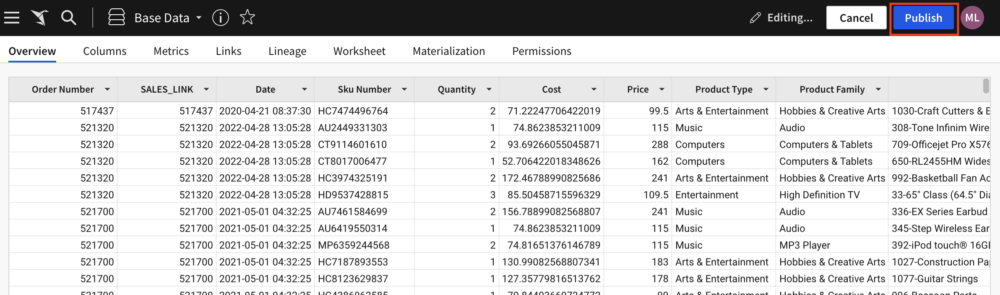
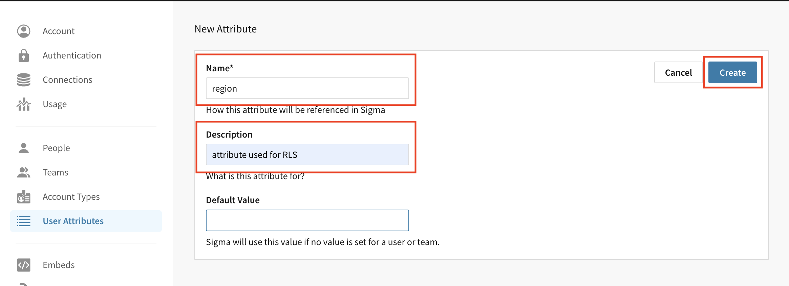

author: 123marianna123
id: ml_m2_l2
summary: Lab for module 2, lesson 2 of embedding partner training
categories: Embedding
environments: web
status: Hidden
feedback link: https://github.com/sigmacomputing/sigmaquickstarts/issues
tags: 

<!-- 
SETTING THE AVAILABLE CATEGORIES WILL MAKE YOUR QUICKSTART PART OF A GROUP THAT USERS CAN FILTER ON IN THE QUICKSTART PORTAL.

AVAILABLE CATEGORIES ARE:
Administration
Embedding
Functions
Fundamentals
Partners
Snowflake
Tables (include pivot and input tables for now)
Use-cases

PLEASE REVIEW THE SIGMA QUICKSTART STYLE GUIDE. ALL QUICKSTART SHOULD SHARE A COMMON LOOK AND FEEL. 

YOU MAY WANT TO REVIEW A PUBLISHED GUIDE FIRST SO THAT YOU ARE FAMILIAR WITH HOW COMMON MARKDOWN IS APPLIED YOU CAN ACCESS THE SIGMA QUICKSTART STYLE GUIDE HERE:
http://localhost:8000/guide/sigma-style-guide/index.html?index=..%2F..internal#0
-->

# Implement Row-Level Security for the Multi-Tenant Table Design Pattern
<!-- The above name is what appears on the website and is searchable. -->

## Overview 
Duration: 5 
<!--Duration is deprecated and no longer required, however the code still expects to see it so include it for each section. The actual time value does not matter. -->

Now that you have a plan for row-level security based on your design pattern, it’s time to implement it.

In this lab, you’ll set up your data for RLS for the multi-tenant table design pattern. We’ll go over RLS for OPT in the next lab.

 ### Target Audience
- Fullstack developers
- Admins
- Workbook developers

### Prerequisites
<ul>
  <li>Intermediate full-stack software development and Sigma admin experience.</li>
  <li>Knowledge of how to create a Sigma workbook.</li>
  <li>Basic knowledge of Sigma teams, workspaces, datasets and workbooks.</li>
</ul>

### What You’ll Learn
How to implement RLS for MTT design patterns.

## **Create a workbook.**
Duration: 20
1. From the homepage, click `Templates`.
2. Under `External` click `Plugs Electronics Sales Performance`.

3. Click `Save as`.
4. Give the workbook a name. 
5. Navigate to the `Workbooks` folder in the `All_Clients_Team` Workspace.
6. Click `Save`.

7. Click the lineage icon.

<aside class="negative">
<strong>NOTE:</strong><br> If this icon is not visible, make sure you enter "Editing" mode in the top right hand corner.
</aside>
8. Select the table `PLUGS_ELECTRONICS_HANDS_ON_LAB_DATA`. This will be the first box in the lineage.
9. Click `Open`.


10. Click the arrow next to `Explore`.
11. Click `Create Dataset`.


12. Name it `Base Data`.
13. Save it to the `Datasets` folder in the `All_Clients_Team` Workspace.
14. Click `Publish`.'

14. Return to your workbook in the `Workbooks` folder in the `All_Clients_Team` Workspace.
15. CLick the arrow next to the workbook title.
17. Click `Swap data sources...`
18. Click `No match` next to `Base Data` and select `Match manually...`
19. Click `Select Source`.
20. Locate your dataset and click `Select`.

## **RLS Step 1: Create a user attribute.**
Duration: 20
1. Navigate to the administration panel.
2. Click `user attributes` on the left hand side. 

3. Click `create attribute` and give it a name and description. For this example, name it `region` and in the description write `attribute used for RLS`.
4. Click `create`.


5. Click `Assign value`.
6. Assign the `MrSupply_Team` the attribute `West` and the `Acme_Team` the attribute `East`.

<aside class="positive">
<strong>IMPORTANT:</strong><br> Make sure you always enforce RLS at the Dataset level, not the Workbook level, since a user can remove the filter at the Workbook level.
</aside>


<!-- END OF SECTION-->

## **RLS Step 2: Create an RLS filter column.**
Duration: 20
1. Navigate to the `Datasets` folder in the `All_Clients_Team` Workspace.

2. Open your dataset.
3. Right-click on any column and click `Add new column`.


4. Right click on the column and click `rename`. Name this column `RLS_filter`.
5. Enter the following formula:
```
CurrentUserAttributeText("Region Attribute") = [Store Region]
```
This will return `True` if the user attribute matches the `Store Region` of that row and false if it doesn't.

6. On the left-hand side, add a filter and select only `True` from the `RLS_filter` column.
7. Click `Publish` and select `Columns`.
8. Under `Visibility` select `Restricted`.
9. Click `Publish`.


<!-- END OF SECTION-->

## What we've covered
Duration: 5

In this lab we learned how to plan RLS for the MTT design pattern.

<!-- THE FOLLOWING ADDITIONAL RESOURCES IS REQUIRED AS IS FOR ALL QUICKSTARTS -->
**Additional Resource Links**

[Help Center Home](https://help.sigmacomputing.com/hc/en-us)<br>
[Sigma Community](https://community.sigmacomputing.com/)<br>
[Sigma Blog](https://www.sigmacomputing.com/blog/)<br>
<br>

[](https://twitter.com/sigmacomputing)&emsp;
[](https://www.linkedin.com/company/sigmacomputing)
[](https://www.facebook.com/sigmacomputing)


<!-- END OF WHAT WE COVERED -->
<!-- END OF QUICKSTART -->
