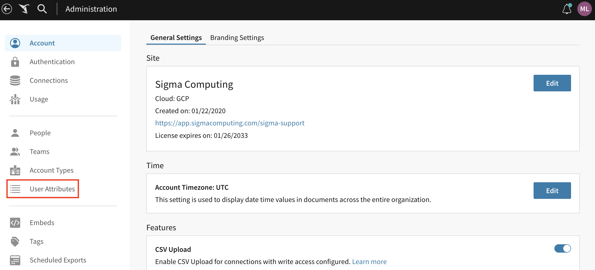
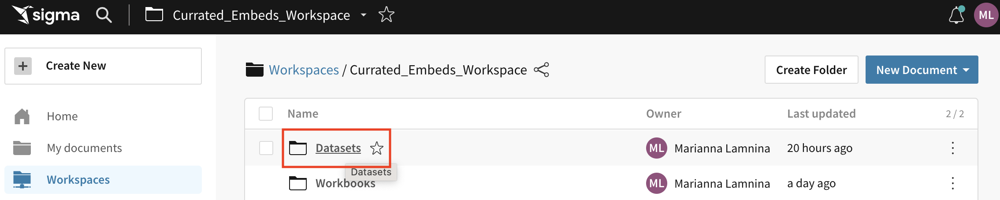
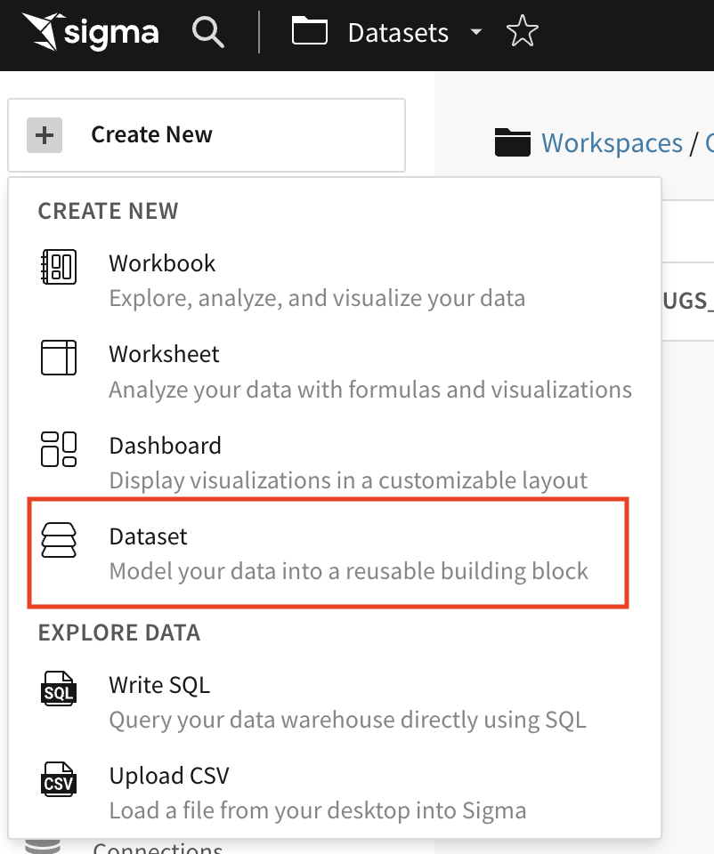
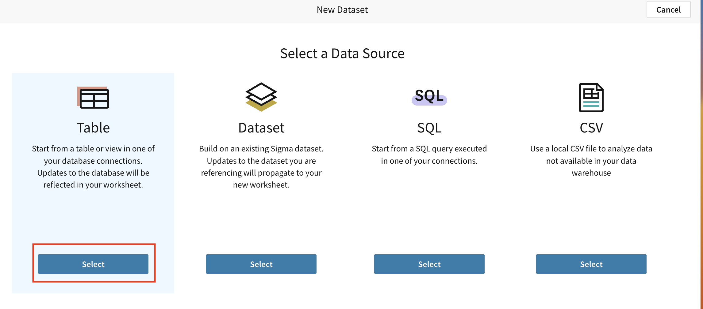
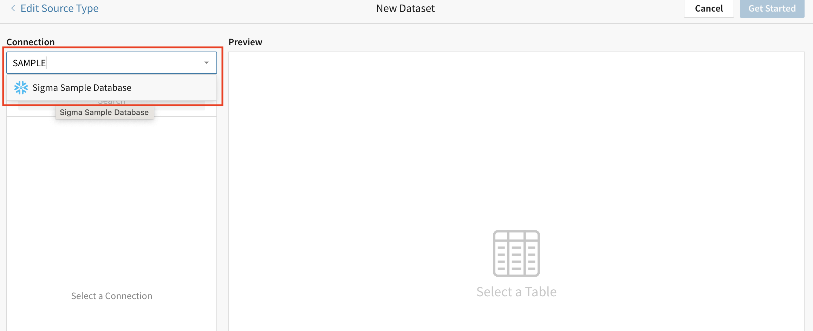
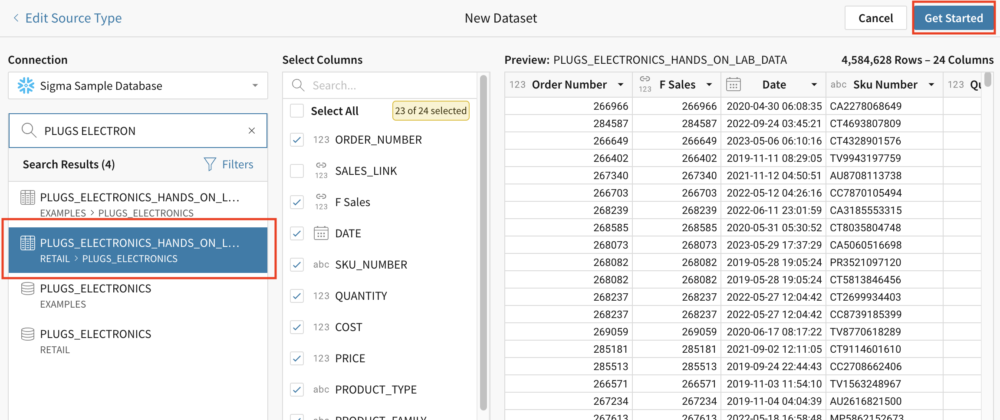
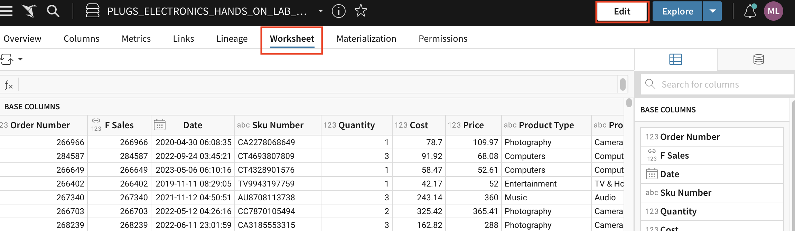
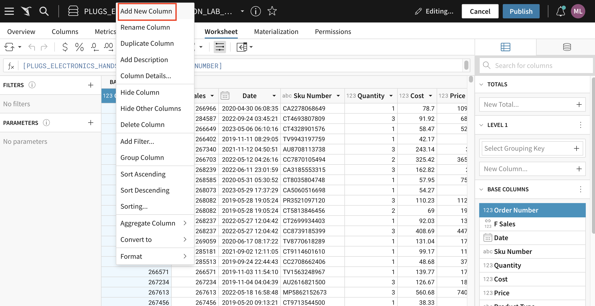

author: 123marianna123
id: ml_m2_l2
summary: Lab for module 2, lesson 2 of embedding partner training
categories: Embedding
environments: web
status: Hidden
feedback link: https://github.com/sigmacomputing/sigmaquickstarts/issues
tags: default

<!-- 
SETTING THE AVAILABLE CATEGORIES WILL MAKE YOUR QUICKSTART PART OF A GROUP THAT USERS CAN FILTER ON IN THE QUICKSTART PORTAL.

AVAILABLE CATEGORIES ARE:
Administration
Embedding
Functions
Fundamentals
Partners
Snowflake
Tables (include pivot and input tables for now)
Use-cases

PLEASE REVIEW THE SIGMA QUICKSTART STYLE GUIDE. ALL QUICKSTART SHOULD SHARE A COMMON LOOK AND FEEL. 

YOU MAY WANT TO REVIEW A PUBLISHED GUIDE FIRST SO THAT YOU ARE FAMILIAR WITH HOW COMMON MARKDOWN IS APPLIED YOU CAN ACCESS THE SIGMA QUICKSTART STYLE GUIDE HERE:
http://localhost:8000/guide/sigma-style-guide/index.html?index=..%2F..internal#0
-->

# Implement Row-Level Security for the Multi-Tenant Table Design Pattern
<!-- The above name is what appears on the website and is searchable. -->

## Overview 
Duration: 5 
<!--Duration is deprecated and no longer required, however the code still expects to see it so include it for each section. The actual time value does not matter. -->

Now that you have a plan for row-level security for your customer based on their design pattern, it’s time to implement it. It’s best to do this before building dashboards, to avoid additional work later.

In this lab, you’ll set up your data for RLS for the multi-tenant table design pattern. We’ll go over RLS for OPT and APT in the next lab.

 ### Target Audience
Sigma partners who will be helping customers with embedding.

### Prerequisites
<ul>
  <li>A sigma account with admin access.</li>
  <li>Completion of Module 2, Lesson 1 of partner training.</li>
  <li>A broad understanding of what embedding is and the different types of embedding available with Sigma.</li>
</ul>

### What You’ll Learn
How to implement RLS for MTT design patterns.

## **Step 1: Create a user attribute.**
Duration: 20
1. Navigate to the administration panel.
2. Click `user attributes` on the left hand side. 

3. Click `create attribute` and give it a name and description. For this example, name it `region` and in the description write `attribute used for RLS`.
4. Click `create`.


<!-- END OF SECTION-->

## **Step 2: Create a dataset with an RLS filter column.**
Duration: 20
1. Navigate to the `Datasets` folder in the `Curated_Embeds_Workspace`.

2. Click `Create New`.
3. Click `Dataset`.



4. Click `Select` under `Table`.



5. Under connection, choose `Sigma Sample Database`.



6. Search for and select the `Plugs Electronics retail` data.
7. Click `Get Started`.



8. Go to the `Worksheet` tab.
9. Click `Edit` in the top right corner.



10. Right-click on any column and click `Add new column`.



11. Right click on the column and click `rename`. Name this column `User attribute`.
12. Enter the following calculation in the formula bar.
```Contains(Concat(“,”, CurrentUserAtributeText(“region”),”,”), Concat(“,”,[Store Region], “,”)) or CurrentUserInTeam(“internal_team)```
13. Add another column and call it `RLS_filter`.
14. On the left-hand side, add a filter and select only `True` from the `User attribute` column.


<!-- END OF SECTION-->

## What we've covered
Duration: 5

In this lab we learned how to plan RLS for the MTT design pattern.

<!-- THE FOLLOWING ADDITIONAL RESOURCES IS REQUIRED AS IS FOR ALL QUICKSTARTS -->
**Additional Resource Links**

[Help Center Home](https://help.sigmacomputing.com/hc/en-us)<br>
[Sigma Community](https://community.sigmacomputing.com/)<br>
[Sigma Blog](https://www.sigmacomputing.com/blog/)<br>
<br>

[](https://twitter.com/sigmacomputing)&emsp;
[](https://www.linkedin.com/company/sigmacomputing)
[](https://www.facebook.com/sigmacomputing)


<!-- END OF WHAT WE COVERED -->
<!-- END OF QUICKSTART -->