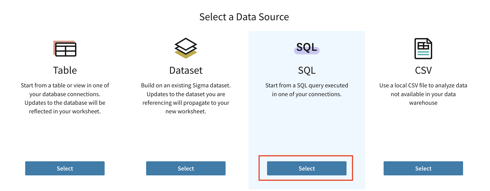
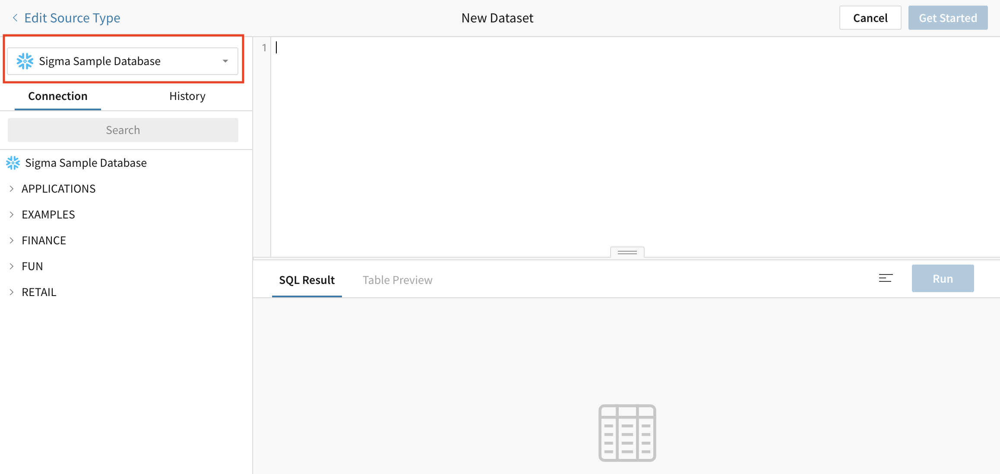
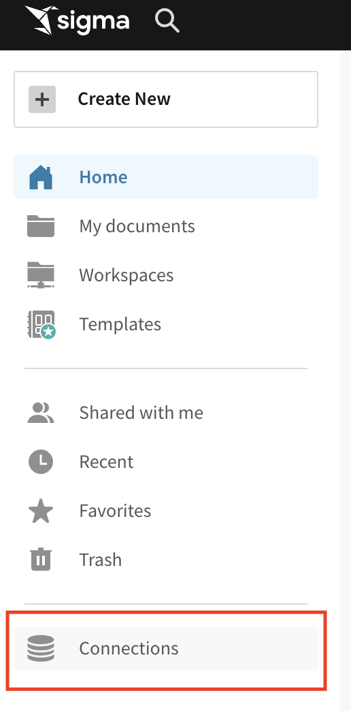
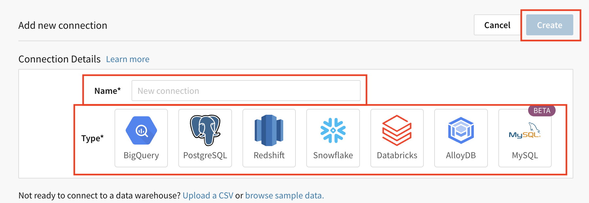

author: 123marianna123
id: ml_m2_l3
summary: Lab for module 2, lesson 3 of embedding partner training
categories: Embedding
environments: web
status: Hidden
feedback link: https://github.com/sigmacomputing/sigmaquickstarts/issues
tags: 

# Implement Row-Level Security for the OPT and APT Design Patterns
<!-- The above name is what appears on the website and is searchable. -->

## Overview 
Duration: 5 
<!--Duration is deprecated and no longer required, however the code still expects to see it so include it for each section. The actual time value does not matter. -->

In the previous lesson, we implemented row-level security for an MTT design pattern. We’ll now take a look at how to do this for OPT, or object per tenant, and APT, or account per tenant, design patterns.


 ### Target Audience
Sigma partners who will be helping customers with embedding.

### Prerequisites
<ul>
  <li>A sigma account with admin access.</li>
  <li>Completion of Module 2, Lessons 1 and 2 of partner training.</li>
  <li>A broad understanding of what embedding is and the different types of embedding available with Sigma.</li>
</ul>

### What You’ll Learn
How to implement RLS for OPT and APT design patterns.


<!-- NOTE: SIGMA LOGO REQUIRED AT END OF EACH ## SECTION -->
<!-- END OF OVERVIEW -->

## **Plan RLS for the OPT design pattern.**
Duration: 20

### Step 1: Create a user attribute.
<aside class="negative">
<strong>NOTE:</strong><br> This process for OPT is the same process used for MTT.
</aside>

1. Navigate to the administration panel.
2. Click `user attributes` on the left hand side. 
3. Click `create attribute` and give it a name and description. For this example, name it `region` and in the description write `attribute used for RLS`.
4. Click `create`.

### Step 2: Create a dataset using Custom SQL.
1. Navigate to the `Datasets` folder in the `Curated_Embeds_Workspace`.
2. Click `Create New`.
3. Click `Dataset`.
4. Click `Select` under `SQL`.

5. Select `Sigma Sample Database` as your connection

6. At the top of the page enter a SQL query following this structure:

```
SELECT *
FROM
database.{{#raw system::CurrentUserAttributeText::attributename}}.TABLENAME
```

```
SELECT *
FROM
database.{{#raw system::CurrentUserAttributeText::region}}.plugs_... LOOK THIS UP, CHANGE ATTRIBUTE NAME, TABLE NAME, AND DATABSE NAME
```
<aside class="negative">
<strong>NOTE:</strong><br> The content inside the double curly brackets parameterizes the database. You can also similarly append this to the table name and parameterize the table instead.
</aside>


<!-- END OF SECTION-->

## **Plan RLS for the APT design pattern.**
Duration: 20

<aside class="negative">
<strong>NOTE:</strong><br> In this training, we won't connect to warehouse accounts, but below are the steps for doing so. You can follow these steps if working with a customer with an APT design pattern.
</aside>

### Step 1: Connect to cloud data warehouse accounts.
1. From the homepage, click `connections`.



2. Click `create connection`.
3. Give the connection a name and select your customer's warehouse.
4. Fill out the connection credentials.
5. Click `connect`.



6. Repeat steps 2-5 for each cloud data warehouse account.

### Step 2: Find the unique identifier of each connection.
1. Click on each connection in Sigma.
2. Find the unique identifier is in the URL after `connections/`.

### Snowflake-specific alternative
1. Set user attributes.
2. When setting up the connection, instead of hard-coding the role, specify the user attribute.
3. Go into Snowflake and set row access policies based on the user attributes. 

>  To learn how to set access policies, check out Snowflake’s documentation, linked below.
>
> https://docs.snowflake.com/en/user-guide/security-row-using


<!-- END OF SECTION-->


## What we've covered
Duration: 5

In this lab we learned how to setup your data for RLS for the OPT and APT design patterns.

<!-- THE FOLLOWING ADDITIONAL RESOURCES IS REQUIRED AS IS FOR ALL QUICKSTARTS -->
**Additional Resource Links**

Be sure to check out all the latest developments at [Sigma's First Friday Feature page!](https://quickstarts.sigmacomputing.com/firstfridayfeatures/)

[Help Center Home](https://help.sigmacomputing.com/hc/en-us)<br>
[Sigma Community](https://community.sigmacomputing.com/)<br>
[Sigma Blog](https://www.sigmacomputing.com/blog/)<br>
<br>

[](https://twitter.com/sigmacomputing)&emsp;
[](https://www.linkedin.com/company/sigmacomputing)&emsp;
[](https://www.facebook.com/sigmacomputing)


<!-- END OF WHAT WE COVERED -->
<!-- END OF QUICKSTART -->