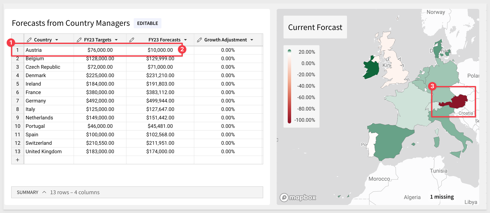
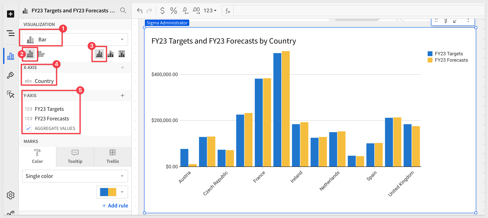
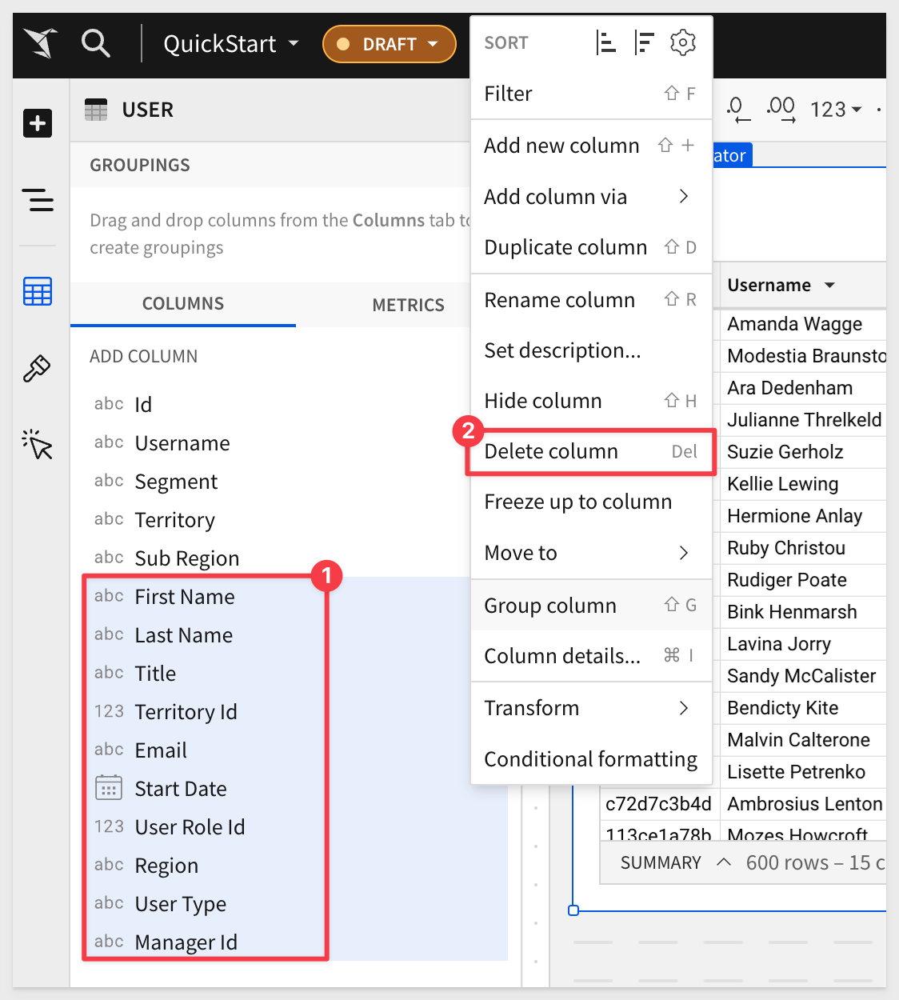
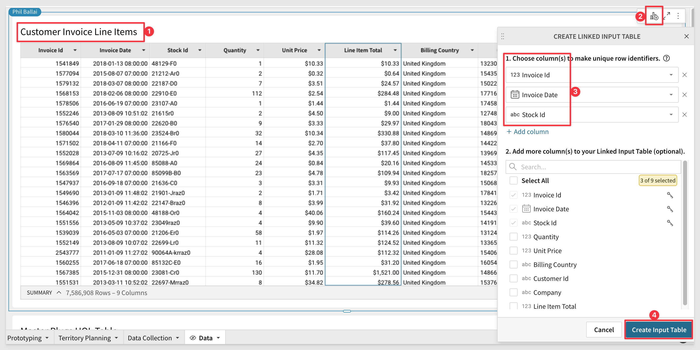

author: pballai
id: input_tables_use_cases
summary: Examples of using Sigma Use Cases
categories: Tables
environments: web
status: Published
feedback link: https://github.com/sigmacomputing/sigmaquickstarts/issues
tags: default
lastUpdated: 2024-07-24

# Sigma Input Tables: Use Cases

## Overview 
Duration: 5 

This QuickStart **QS** provides an overview and the steps required to recreate three unique use cases that leverage Sigma input tables. 

input tables are Sigma-managed warehouse tables, through which users can add their own data and integrate into their own analysis.

<aside class="postive">
<strong>Why use input tables?</strong><br> With input tables, what you build in Sigma changes from one-way transformations of raw data (traditional BI) into a bi-directional data analysis platform. input tables give users the power to augment, adjust, interact and create "what-if" scenarios in real-time, without changing the source data.
</aside>

When data isn’t in the warehouse, it usually requires a cumbersome technical and people process to ETL data into the warehouse. Now users who need to add data to the warehouse are able to do so directly.

Sigma customers already use input tables for:
<ul>
  <li>Manual data entry of key values</li>
  <li>Analytic Modeling
        <ul>
        <li>scenarios</li>
        <li>forecasts</li>
        <li>territory planning</li>
        <li>sales planning</li>
        <li>supply chain modeling</li>
        <li>categorizations</li>
        </ul>
    </li>
</ul>

### Target Audience
Anyone who is trying to create QS content using Sigma and wants to augment, adjust, interact and create "what-if" scenarios.

### Prerequisites

<ul>
  <li>A computer with a current browser. It does not matter which browser you want to use.</li>
  <li>Access to your Sigma environment. A Sigma trial environment is acceptable and preferred.</li>
  <li>Some familiarity with Sigma is assumed. Not all steps will be shown as the basics are assumed to be understood.</li>
  <li>Downloadable project files discussed later in this document.</li>
  <li>A Snowflake account with the proper administrative and security admin access.</li>
  <li>Microsoft Excel or Google Sheets (for accessing the provided sample data)</li>
</ul>

<button>[Sigma Free Trial](https://www.sigmacomputing.com/free-trial/)</button> <button>[Snowflake Free Trial](https://signup.snowflake.com/)</button>
  
### What You’ll Learn
We will review a few different ways customers are using input tables already and show you how to make them work in your own Sigma environment.

### What You’ll Build

 <li><strong>We will review these three use cases:</strong>
    <ol type="n"> 
      <li><strong>Forecasting</strong></li>
      <li><strong>Rapid Data Prototyping</strong></li>
      <li><strong>Territory Planning</strong></li>
    </ol>
  </li>


## Forecast Adjustment
Duration: 20

In our first use case, Paula, the VP of EMEA sales, is running her forecast call, where her country managers each call out the final numbers for the year, and any adjustments that they may want to make. 

This has traditionally been done on a spreadsheet that Paula created by merging multiple spreadsheets together.

She's also planning out the next year and adds growth numbers for each country. 

The spreadsheet work is a time-waster for her and can also be error prone.

### Input tables to the rescue

Open Sigma and create a new workbook.

Change the name of the workbook to `Input Table Use Cases`.

Add a new page to our workbook and rename it to `Forecast Adjustment`.

<button>[Download the sample Country Manager data](https://sigma-quickstarts-main.s3.us-west-1.amazonaws.com/csv/Forecasts-from-Country-Managers.csv)</button>

Add a new `CSV Input Table` to the page and rename it `Forecasts from Country Managers`:


Use Sigma to import the downloaded file, import it and click `Save`:


<aside class="negative">
<strong>NOTE:</strong><br> Input tables store data back to the selected warehouse. Write access is required to support this functionality. Sigma is storing input table data separately and only using the warehouse connection you specify. Other warehouse data is unaffected. 
</aside>

[Click here for information on setting up Write access.](https://help.sigmacomputing.com/docs/set-up-write-access)

Rename the new input table to `Forecasts from Country Managers`.

Notice that Sigma automatically identified the data types for you, saving time.


Add a new `Visualization` to the page, use the input table as it data source, set it to `Map - Region` and drag the `Country` column up the Regions.

We want this map to show different colors for `FY23 Targets vs FY23 Forecasts`, so we need to add a new column to the data that represents this calculated value.

In the Element Panel / Columns click the `+` icon and select `new column`.


Rename the column to `Forecast to Target` and set the formula to:
```plaintext
(([FY23 Forecasts] - [FY23 Targets]) / [FY23 Targets])
```
Adjust the element panel, so that the map appears as shown below:


The manager in `Austria` tells you she's cutting her forecast `down to $10k` because there was a strike at one of the factories.

Update the input table and see the map change. 

<aside class="postive">
<strong>IMPORTANT:</strong><br> Changes to input table data requires the workbook be in edit mode
</aside>

Change the `FY23 Forecast` value for `Austria` down to `$10K` and hit `Enter`.

The map changes automatically to reflect this revision.



### Real-time modelling
Paula wants to make her own adjustments after the call and wants to be able to just experiment with making adjustments while considering the impact of small changes in a visualization before making a final decision.

#### Bar chart

Lets add a bar chart to give Paula the visualization she is wanting, and start by comparing the `FY23 and FY24 forecasts (by country)`.

Add a visualization and configure it as follows:



Lets add the `Growth Adjustment` column to the Y-Axis. At the moment, all the values in this column are zero and that is fine, we will adjust the formula.

We want this new bar on the chart to show the `FY23 forecast` after the growth adjustment is made in the input table. In this way, Paula can quickly see how a small percentage gain (or loss) will impact the country forecast.

Set the formula bar for this new column to:
```plaintext
[FY23 Forecasts] + ([Growth Adjustment] * [FY23 Forecasts])
```

Rename the new Column to `Paula's Adjustment`.

Paula has done some reasearch and thinks that the strike in Austria is not going to happen. She also has been speaking to a large customer in Austria and found that a very large order is coming in that is not forecast. 

She reverts the `FY23 forecast` back to `$74655` and also adjusts the growth to `50%`, so she can see the impact:


<aside class="postive">
<strong>The VP Loves it!</strong><br> input tables allows the VP to not only review the current and next year forecast for her territory, it also allows her to update it for real changes as well as do some "what-if-analysis" to help her make critical decisions in real time. 

Corporate governance is maintained since the source data does not change and everything stays in the corporate cloud data warehouse, even the input table and its values.
</aside>


## Rapid Data Prototyping
Duration: 20

In our second use case, Lucy is a merchandiser at a brick and mortar (B&M) electronics retailer. 

She's launching their online store which is powered by Shopify. 

Although their B&M data is in the warehouse, the Shopify data is too new and hasn't gone through the modeling process, which takes time.

**She can't wait 6 months and has to know now how the new online store is doing.** 

She has the Shopify data in google sheets where she's been playing around with it. But, it only shows part of the picture. 

She needs to see the data from B&M against Shopify in real time.

Sigma allows Lucy to copy and paste the Shopify data into an input table and then is able to compare online vs B&M sales by category and SKU. 

This informs her about the strengths and weakness of the online business vs the established B&M, right away.

### How to build it:

<button>[Download the sample Shopify Data](https://sigma-quickstarts-main.s3.us-west-1.amazonaws.com/input_tables/Shopify_Transactions+.xls)</button>

Open the downloaded file in Excel (or Google Sheets). There should be 5 columns and 82 rows.

We will copy this data into a Sigma input table later.

Add a new page to our Sigma workbook, and rename it to `Rapid Data Prototyping`.

We will add two tables from the warehouse to the page. One for `Product Information` and another for `Brick and Mortar Sales`. 

For `Product Information` we will use the `Sigma Sample Database` and the `D_Product` table as shown. 

Rename the table to "Product Information".


Create a second workbook Page and rename it `Data`. We will use this page to hold master reference data that will be reused for this use case and the later ones too. 

On the new `Data` page, add a new table as shown:


Rename the table to `Brick and Mortar Sales`.

At this point your workbook should look like this:


Return to the `Rapid Data Prototyping` page.

Add a new `Empty input table` to the Page.


Use the `Sigma Sample Database`.

Rename the new input table `Shopify Data`.

Copy all rows and columns from the downloaded Excel file and paste them into the new input table as we did in the first use case.


The column headers are automatically set by Sigma.


Now that we have the B&M and the online product details, we want to be able to compare them.

In the `Product Information` table, click the `Sku Number` column drop and add a Column Lookup. 


Configure the Lookup as shown:


Many products have not been sold online yet, so right click on the first cell with a null and select `Exclude null`:


Rename this new column `Shopify Reveune` and format it as `Currency`.

Add another new column and use the same workflow. 

This time we want to pull in the revenue from the B&M table. However, the column `Revenue` does not exist in the warehouse table `Brick and Mortar Sales`, so we need to add that first.

Click on the `Data` page tab and add the new column to the `Brick and Mortar Sales` table.

select `Add a new column` and set the formula of that column to (it does not matter the order of the columns in this case):
```plaintext
Sum([Quantity] * [Price])
```

Rename the new column `Revenue` and set the format to `Currency`. 


Now we can add a new column to the `Product Information` table called `B&M Revenue` using the same workflow for `Add a new column via lookup...`:


Rename the new column `B&M Revenue`.

Now that we have the data ready we want to add a new Visualization (Bar Chart in this case) to compare the revenue streams by category for B&M vs. online.

Add a Child Element / Visualization (from the Product Information Table) and set the X and Y axis as shown:


Doing a tiny bit of additional clean-up, we have our chart:


What the chart shows is the relative strength of in-store sales vs. online for each category. 

Lucy (our merchandiser) can begin to see which catagories are not selling well online or where to invest more marketing dollars.

<aside class="postive">
<strong>IMPORTANT:</strong><br> Lucy loves how she can leverage input tables and the power of Sigma to let move at the speed of the online world making business decisions based on live data at scale.
</aside>


## Territory Planning
Duration: 20

This next use case is a bit more sophisticated, using **Linked input tables and data validation** to allow the user to make on-the-fly adjustments to a sales territory.

Mike, is VP of Sales for the US. His company has grown quickly and the regions need to be rebalanced. 

Using Salesforce data in Snowflake, he's able to leverage the power of Sigma and see that the West region has brought in the most revenue. 

Specifically, California sales are leading the charts. 

Using a linked input table, Mike can dynamically get a list of states and regions based on the latest assignments. 

This allows Mike to experiment with the re-balancing, instantly seeing how revenue would change by region based on the new mapping. 

The final build will look like this:


In Sigma, create a new Page in our `input tables Demo` workbook and rename it `Territory Planning`.

We will add tables to the page from the `Sigma Sample Database` / `Applications` / `Salesforce` data source. 

<aside class="negative">
<strong>NOTE:</strong><br> You can cull the use only the columns shown to make the UI easier to work with or bring them all; it is up to preference. Be sure to minimally include the ones shown below.
</aside>

Add `USERS`, culling the column list as shown:



Add `OPPORTUNITY` as shown:


Since the `Opportunity` table does not contain `Region` or `Territory` we we add them using Sigma's `Lookup` function.

From the `Opportunity` table and click `Add a new column via lookup` as shown:

a

...and configure it as follows:


Do the same steps but this time add the `USERS` column `SubRegion`:


Your page should now look like this:


Let's add a chart that shows the current distribution of `Sales by Region`, so that we can evaluate what adjustments to territories may be needed.

Create a `Child Element` / `Visualization` from the `Opportunity` table. Configure it as follows to show the total sales by region:


Our chart is sorted by `Sum of Amount` to have the largest on top. Rename the chart to `Sum of Amount by New Sub Region - BEFORE`

We are ready to add a method for users to reassign territories, and see the effect in real-time in terms of total regional sales.

Create a new `Linked input table` off the `USER` table:


<br>
<br>


In the new Linked Table, click the `Sub Region` column drop and add a new Text Column:


Now copy the values from the `Sub Region` column (click the column and use ctl+v or command+c) and then paste into the new column (use ctl+v or command+v).

Rename the new column to `New Sub Region`.


Now that we have a column where a user can change the value of region, we should add `Data Validation` 

<aside class="positive">
<strong>NOTE:</strong><br> Data Validation prevents users from making mistakes and also ensures that if regions are added later, they are automatically available to the user on a select list. It is also possible to create a manual lists or load lists from any other Sigma data source.
</aside>

In the new input table, click the new column `New Sub Region` and select `Data Validation` from the list:


...and configure it as follows:


Now users are limited to selecting valid values from data that exists in `USERS` table. 

Even though we configured the new column's data validation to point to the input table, the `Sub Region` column is "linked" to the data coming from the `Users` table, so it will always be up to date.

Next we want to add a `New column via lookup` to the `Opportunities` table.

Configure it as follows We should see 100% match (item #4):


Rename the new column from `New Sub Region (New Linked Input Table)` to `New Sub Region`.

The Page now looks like this (after some re-sizing and arranging to suit your preference). Use any layout you want.


Lastly, we will add another visualization (as a child of the `Opportunities`  table) to represent the **"after"** state of user changes on the linked input table. 

Add a new `Child Visualization` and configure it as follows:


Rename the chart to `Sum of Amount by New Sub Region - AFTER`.

We are ready to evaluate the `Territory`, and make some adjustments. 

First. we need to see why the `Midwest` so much larger than the TOLA in terms of sales. We want to close this gap if we can. 

In the `Before` chart, click the Midwest bar and `Drill down` into `Territory`.


We can now see that Missouri is top of the chart. We wonder what if we reassigned it to TOLA? 

Locate the Missouri in the `New Linked Input Table` / `Territory` column and change it's assignment in `New Sub Region`.

You can see that the **AFTER** chart recalcuates and TOLA is now larger with MidWest smaller but still not close enough. 


Also change the `New Sub Region` for `Iowa` to be in `TOLA`.


The gap is much better now, Mike is happy.

<aside class="postive">
<strong>IMPORTANT:</strong><br> input tables allow end users to quickly iterate over "what-if-scenarios` with violating corporate governance rules; making better decisions based on actual data.
</aside>


<!-- END -->

## Embedding Input Tables
Duration: 20

Many customers are embedding content in their internal and external business applications. Now you can also embed input tables and really take it to the next level for your users. With input tables your applications can become more than just a way to communicate **TO** your users. Capturing small amounts of critical data from your customers opens up that "conversation" to be two-way.

This QuickStart assumes familiarity with how to embed in Sigma. 

<aside class="negative"><strong>NOTE:</strong><br> We will not review the steps to setup Embedding here, but rather show the relevant screens. To learn more about Sigma Embedding, visit the Embedding Series QuickStarts which cover the topic extensively.</aside>

<aside class="postive"><strong>IMPORTANT:</strong><br> Embed users with the appropriate role can make edits to allow cells on an input table. Users who lack the appropriate role can't edit data, but can view the input table and latest edits.</aside></aside>

Create a new workbook and add a new empty input table table to the page. You will be prompted to provide a location to save the input table date. We will use the `Sigma Sample Database`. 

<aside class="negative"><strong>NOTE:</strong><br> Input table data is stored automatically and is not editable outside of the Sigma workbook. It can be joined to other Sigma elements to drive more sophisticated workflows as shown in the territory planning use case of this QuickStart. </aside>

Now add another column and set it's type to `number`.

Enter a line of data and your page should now look like this:


Click the input tables menu and enable `Allow data editing in explore mode`. 

Publish the workbook. 

Make sure that the workbook is Shared to the Creator team with `Explore` or `Creator` rights:


Using the methods outlined in the Quickstart `Embedding 3: Application Embedding`, configure this workbook page into an embed.

<aside class="postive"><strong>IMPORTANT:</strong><br> When using the Sigma UI to create the Embed path, be sure to select the Page and not the input table itself.</aside></aside>


We will need to adjust `server.js` for the `Embed Path`, `User Team` and `Account Type`:


Assuming you started Terminal and ran `supervisor server.js` without error, browser to `http://localhost:3000`. You should see your embedded input table. 

Enter some text and click `Save`.


Adjust `server.js` for the `User Team` and `Account Type` to lower the access to `Viewer`:


Refresh the browser and see that the information is as we entered it but there is no `Edit` functionality for this `Viewer` user.


If you recall, we enabled `Allow data editing in explore mode`. Lets test that.

In the workbook / Sharing change the Viewer to use the `Explore` role:


Update `server.js` for `account_type` and `external_user_team` and save the file:


Refresh the browser and see that we have the `Edit` button.


<!-- END OF SECTION-->

## Data Collection
Duration: 20

There are times when capturing a small amount of data from a Sigma user can be very valuable to the business. This presents some challenges:

<ul>
      <li><strong>Will you have to build some new application to capture the data?</strong></li>
      <li><strong>When is the right time to capture the data?</strong></li>
      <li><strong>Will the users accept another tool?</strong></li>
      <li><strong>Once we have the data, how will it relate to existing warehouse data?</strong></li>
      <li><strong>Lots of other questions to be sure!</strong></li>
</ul>

Since users are already using Sigma (**or spreadsheets and should be using Sigma instead!**), input tables can help solve this problem. 
Why not just create a Sigma workbook and augment it with the ability for the user to enter small amounts of data in real time?
Sigma will do the heavy lifting of UI and data operations to store the data in your warehouse. 

<aside class="postive">
<strong>IMPORTANT:</strong><br> Sigma does not store data and with input tables, data is stored in your warehouse but adjacent to your existing data. Existing data is NEVER changed in any way.
</aside>

Allowing users to add/supplement warehouse data opens a world of possibilities. We can demonstrate how this can be done we will use a very simple example.

There is a need for accounting to update the status of Invoices, adding comments/notes but don't want to give the data entry clerk access to the accounting system.

We solution this in Sigma using input tables without involving developers or database administrators valuable time.

In our workbook, create a new Page and rename it to `Data Collection`. 

We need to use different data for this use case, joining two tables. 

<aside class="negative">
<strong>NOTE:</strong><br> Did you know you can see the data linage of a workbook Element? Sometimes it is really useful to visually see the path the data is taking as it sourced to your Element.
</aside>

In our use case, the final lineage for the source data table looks like this:


In Edit mode, navigate to the `Data` page. 

Add a new table for `INVOICE_LINE_ITEMS` as shown:


Join the `CUSTOMERS` table to this `INVOICE_LINE_ITEMS` as shown:


Configure the `Join` as follows:


After clicking `Preview` to look at the result set, click `Done`:


We don't need every column so let's delete the ones we wont require:


Rename the new table to `Customer Invoice Line Items`.

Now create a `Linked Input Table`, selecting the columns as shown:



Move the new input table to the page `Data Collection`:


We want the user to be able to filter the input table to specific `Companies`.

Add a new `Element` / `Control Element` / `List Value` element and configure it as follows:


Set the `Target` as:


<aside class="negative">
<strong>NOTE:</strong><br> Notice that we are not targeting the input table but rather the Table on the hidden data page that is linked to the input table. This can also be used to drive row level security.
</aside>

We now are ready to add our columns that are enabled for data capture.

Add a new Column to the input table called `Status`.

Add another new Column to the input table called `Notes`.

We demonstrated data validation in an earlier use case, but this time will just limit the `Status` column to values we will manually provide:


Now we can filter by `Company`, select a `Status` and add `Notes`.

The last step before we test, is to set the data entry permission:


Sigma presents two choices explaining who can edit the input table:


Select `Only on Published version (view/explore mode)` and click `Save`.

`Publish` the workbook and go to the published version, so that we are looking at this as the end-user would see and work with it.


Now we have an `Edit Data` button. Click that:


Lets test by updating the first four records as shown for each Status:


Click the `Save` button.

<aside class="postive">
<strong>Image the Possibilities:</strong><br> The ability to capture and save data to the warehouse breaks the traditional BI model of providing static pages. Sigma unlocks the power of data trapped in cloud warehouses. With input tables you can now capture information that is trapped in the end user's minds without investing in another application. Think of the possibilities.
</aside>


<!-- END OF SECTION-->

## What we've covered
Duration: 5

In this QuickStart we covered three popular used cases for Sigma input tables in great detail. 

<!-- THE FOLLOWING ADDITIONAL RESOURCES IS REQUIRED AS IS FOR ALL QUICKSTARTS -->
**Additional Resource Links**

Be sure to check out all the latest developments at [Sigma's First Friday Feature page!](https://quickstarts.sigmacomputing.com/firstfridayfeatures/)

[Help Center Home](https://help.sigmacomputing.com)<br>
[Sigma Community](https://community.sigmacomputing.com/)<br>
[Sigma Blog](https://www.sigmacomputing.com/blog/)<br>
<br>

[](https://twitter.com/sigmacomputing)&emsp;
[](https://www.linkedin.com/company/sigmacomputing)&emsp;
[](https://www.facebook.com/sigmacomputing)


<!-- END OF WHAT WE COVERED -->
<!-- END OF QUICKSTART -->
