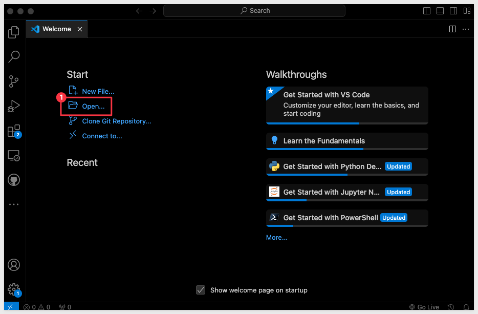
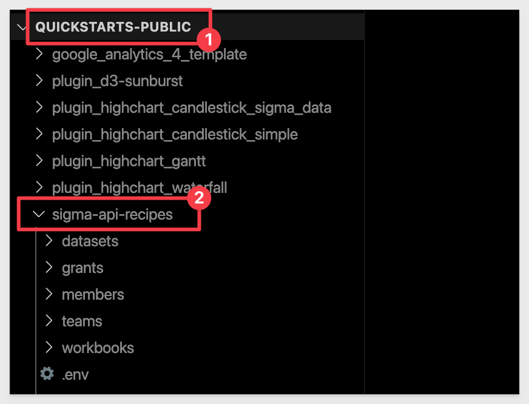
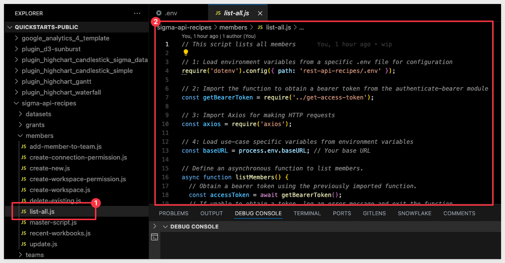
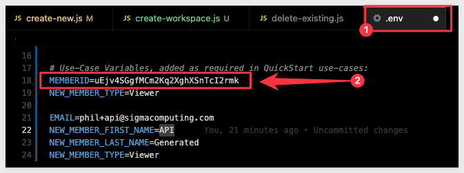

author: pballai
id: administration_api_code_samples
summary: administration_api_code_samples
categories: Administration
environments: web
status: Published
feedback link: https://github.com/sigmacomputing/sigmaquickstarts/issues
tags: default
lastUpdated: 2024-03-01

# Sigma REST API Code Samples

## Overview 
Duration: 5 

This QuickStart is designed to support Sigma's [API Code Samples](https://help.sigmacomputing.com/recipes) and will demonstrate some common operations that customers may use the REST API for.

The actual code shown is available in Sigma's [quickstart-public git repository](https://github.com/sigmacomputing/quickstarts-public)

All code samples provided here are based on javaScript, although [Sigma's Swagger](https://help.sigmacomputing.com/reference/explanation) provides code snippets for all the most common languages, including [curl.](https://curl.se/)

### Target Audience
Developers who are evaluating or working with Sigma's REST API. 

### Prerequisites

<ul>
  <li>A computer with a current browser. It does not matter which browser you want to use.</li>
  <li>Administrative access to your Sigma environment.</li>
  <li>Some familiarity with Sigma is assumed. Not all steps will be shown as the basics are assumed to be understood.</li>
  <li>A development environment of choice. We will demonstrate with Microsoft VSCode and related extensions</li>
</ul>

<aside class="postive">
<strong>IMPORTANT:</strong><br> Sigma recommends that you use non-production resources when doing QuickStarts.
</aside>

<button>[Sigma Free Trial](https://www.sigmacomputing.com/free-trial/)</button>

## Environment Setup

### Create Sigma Project Folder

Create a new folder on your local computer called `Sigma_QuickStart_Public_Repo`. It does not matter where, as long as you can navigate to it easily.

### Source Code Editor - VSCode 

For this QuickStart, we will demonstrate using Visual Studio Code (VSCode), but you may use any IDE you prefer. 

VSCode, is a source-code editor developed by Microsoft for Windows, Linux and macOS. Features include support for debugging, syntax highlighting, intelligent code completion, snippets, code refactoring, and embedded Git.

[Install VSCode from Microsoft's download site.](https://code.visualstudio.com/download)

Run the installation with all defaults.

Open VSCode and make sure it loads without error and open the folder `Sigma_QuickStart_Public_Repo` we created earlier:



### Runtime Environment - Node.js
Duration: 20

While developers can use any language to communicate with the Sigma REST API, we will use the popular framework [Node.js. ](https://nodejs.org/en) for our examples.

Node.js (Node) is an open-source, cross-platform, back-end JavaScript runtime environment that runs on a JavaScript engine and executes JavaScript plaintext outside a web browser, which was designed to build scalable network applications.
 
[Download and install Node.js from here:](https://Nodejs.org/en/download/)

Use the LTS (long term supported) version appropriate for your operating system.

Run the installer selecting all the defaults. **We do not need to specify our project folder for this installation.**

This will install both `Node` and the `Node package manager` (which manages optional Node components, which add more functionality). 

The package manager is abbreviated to `npm` when running commands.

You can verify your installation using VSCode's built-in Terminal:


**Run the command:**
```code
node -v
```

This should return the version number as below:


<aside class="negative">
<strong>NOTE:</strong><br> You version number will likely vary from what is shown in the screenshot, based on when you installed Node.
</aside>

You can leave the Terminal session open as we will use that in the next section.

### Node modules

We need to install a few Node modules **in our local folder.**

This process is the same for many Node modules. We will start with two, but in later use-cases we may require others to be installed, so watch for that along the way.

### Axios

The first module we will install is called `Axios`, and is one of the most popular JavaScript libraries in the world. It is an HTTP client that can be used to make requests from both browsers and NodeJS. We will use this to make calls to the Sigma REST API, via a Javascript.

In VSCode Terminal, run:
```
npm install axios
```


No errors should be returned. 

### dotenv

[dotenv](https://www.npmjs.com/package/dotenv) is a popular Node. js module that allows you to load environment variables from a `.env` file into your Node. js application. This will simplify our project code. 

Run the following command in Terminal:
```code
npm install dotenv
```

No errors should be returned. 

### Project Files

To save you time, we have stored all the required project files in Git, so you can just download them, and explore the use cases that interest you. This QuickStart will guide you, based on use case name, so feel free to skip to the section that interests you most.

<aside class="positive">
<strong>IMPORTANT:</strong><br> The section named "Get Bearer Token Script" is a must read, as proper authentication is required in all use cases. Do that section once you finish this section.
</aside>

To clone the Git repository in VSCode, open the `Command palette`:


Type `Clo` into the command palette bar and then click `Git: Clone`:


Paste this URL and hit enter:
```code
https://github.com/sigmacomputing/quickstarts-public.git
```

VSCode will prompt for the location to store the files on your computer. Navigate to the `Sigma_QuickStart_Public_Repo` folder and click the `Select as Repository Destination` button.


If prompted to open the cloned repository, click `Open`.

The repository contains other code samples you can explore, but we are interested in the `rest-api-recipes` folder:



### Environment Variables
We need to update the file that stores our environment variables. 

First, you will need to provide the values for `ClientID`, `Secret`, `Base` and `AuthURL`. [Instructions can be found in the API Swagger if needed.](https://help.sigmacomputing.com/reference/explanation)

This file keeps our keys out of our scripts and also contains other variables we may want to change in different use-cases:


Replace the placeholders for `YourClientID` and `YourAPISecret`. The values for auth and baseURL are for Sigma instances hosted in AWS-US. You may need to change these based on where your instance is running. If you are not sure, check the instructions mentioned above (in the API Swagger).

Save the file.


<!-- END OF SECTION-->

## Authentication - REQUIRED
This section demonstrates the code that was provided on the `API Code Samples` > `Authentication: Get Access Token` page, [located here.](https://help.sigmacomputing.com/recipes/authentication-get-access-token)

In this step, we will look at a script that authenticates to the [get access token endpoint](https://help.sigmacomputing.com/reference/token) and returns a bearer token (token).

<aside class="positive">
<strong>IMPORTANT:</strong><br> The token is valid for 3599 seconds (just under one hour) and needs to be refreshed.
</aside>

It also exports a Javascript function to request a bearer token (token) each time it is called. 

We reference this function from other API scripts we create later, saving time and simplifying code.

<aside class="positive">
<strong>IMPORTANT:</strong><br> The token is valid for 3599 seconds (just under one hour) and needs to be refreshed. Our Javascript function will handle that.
</aside>


In the project root directory, open the file `get-access-token.js` and review it's contents. Each section is commented so it can be understood. 

Start the VSCode debugger against this code by pressing `F5` on your keyboard.

If prompted by VSCode to select a debugger, select `Node.js`.

The VSCode debugger console will show this API response if the .env variables are configured correctly:


The script is configured to run standalone as well as export a function that we can call from other scripts too. 

This is why we show the bearer token twice in the response. Other scripts that call this one, will only show the token one time in the console.

The ability to run it standalone is only for convenience, so that we can verify it obtains a token.

We can now move on to use cases, leveraging the `getBearerToken` function:


<!-- END OF SECTION-->

## Members: List
Duration: 20

We will start with a very simple example that calls the `Members` > `Get` endpoint, [found here.](https://help.sigmacomputing.com/reference/listmembers-1)

This section demonstrates the code that was provided on the `API Code Samples` > `Member: List` page, [located here.](https://help.sigmacomputing.com/recipes/members-list)

<aside class="positive">
<strong>IMPORTANT:</strong><br> This script will call the get-access-token > getBearerToken function to get a new/refreshed token automatically so there is no need to do anything else, assuming you have completed the section of this QuickStart "Authentication - REQUIRED" and ensured your .env file is configured correctly.
</aside>

### Running the Script
Open the file `list-simple.js` in the `members` folder:



Each code block is commented to explain what operations are being performed. 

Press `F5` to run the script with VSCode's debugger. 

The expected response is:


<!-- END OF SECTION-->

## Members: Update
Duration: 20

This section demonstrates the code that was provided on the `API Code Samples` > `Member: Update` page, [located here.](https://help.sigmacomputing.com/recipes/members-update)

<aside class="positive">
<strong>IMPORTANT:</strong><br> This script will call the get-access-token > getBearerToken function to get a new/refreshed token automatically so there is no need to do anything else, assuming you have completed the section of this QuickStart "Authentication - REQUIRED" and ensured your .env file is configured correctly.
</aside>

### Create Test Member
Let's create new member in Sigma to test with. 

<aside class="negative">
<strong>NOTE:</strong><br> We could also do this with the API, but we will use the UI to create a test member. We want to use the UI to verify API changes we make via API too.
</aside>

If you prefer, you can use any non-production user you want, but we recommend creating a test user for this purpose. 

If you are not sure how to create a user (member) in Sigma, [please refer to this documentation.](https://help.sigmacomputing.com/docs/invite-people-to-your-organization).

We created a test user using [Gmail's email alias](https://gmail.googleblog.com/2008/03/2-hidden-ways-to-get-more-from-your.html) feature. 

Our test user is called `sales_rep`.

Make a note of the test user's memberId. Again, we could get this using the API, but in this example, we will just copy it from the URL, when looking at the user's profile from the `Administration` > `People` list:


In this case, the memberId is `KteJXJQfHuei5GxxY9hQOnFZHP91A`. Yours will be different.

Add these values to the .env file we created and save the change.
```code
MEMBER_ID=KteJXJQfHuei5GxxY9hQOnFZHP91A
NEW_MEMBER_TYPE=Creator
```


### Change Test Members' Account Type
Our test user is currently a `Viewer` account type. We want to call the Sigma API endpoint to `Update the specified member` account type to `Creator`.


We will be using the [Update the specified member](https://help.sigmacomputing.com/reference/updatemember-1) endpoint.

### Running the Script
Open the file `update.js` in the `members` folder:


Each code block is commented to explain what operations are being performed. 

Press `F5` to run the script with VSCode's debugger. 

The expected response is:


A quick check against the member in Sigma shows them having the `Creator` account type now:


<!-- END OF SECTION-->

## Members: Recent Workbooks
Duration: 20

This section demonstrates the code that was provided on the `API Code Samples` > `Member: Recent Workbooks` page, [located here.](https://help.sigmacomputing.com/recipes/members-recent-workbooks)

<aside class="positive">
<strong>IMPORTANT:</strong><br> This script will call the get-access-token > getBearerToken function to get a new/refreshed token automatically so there is no need to do anything else, assuming you have completed the section of this QuickStart "Authentication - REQUIRED" and ensured your .env file is configured correctly.
</aside>


In this use case, we want to return a list of the Workbooks (by name), the permission and when they last accessed for each Workbook, ordered by most recent first.

Open the file called `.env` and ensure that the memberID is set for someone who has accessed Workbooks in your Sigma instance. In a trial environment, pick someone who is very active or yourself if that is the case. As long as there is activity, it does not matter otherwise.

If you are not sure how to obtain a memberID, review the section called `Create Test Member` in the step called `Member: Update`.

Open the file called `recent-workbooks.js` in the `members` folder.

Each code block is commented to explain what operations are being performed. 

Press `F5` to run the script with VSCode's debugger. 

The expected response is:


<!-- END OF SECTION-->

## Members: Pagination   NEEDS WORK AND CLARIFICATION FROM SAM S.
Duration: 20

This section demonstrates the code that was provided on the `API Code Samples` > `Members: Pagination` page, [located here.](https://help.sigmacomputing.com/recipes/members-paginatation)

<aside class="positive">
<strong>IMPORTANT:</strong><br> This script will call the get-access-token > getBearerToken function to get a new/refreshed token automatically so there is no need to do anything else, assuming you have completed the section of this QuickStart "Authentication - REQUIRED" and ensured your .env file is configured correctly.
</aside>

Query parameters page and limit are commonly used together in APIs to implement pagination. This mechanism allows clients to request data in discrete chunks or "pages", making it easier to handle large datasets. Here's how these parameters typically work together in API use cases:

Many of Sigma's API operations support `page` and `limit` as query parameters. 

These parameters can be used in different ways but generally they are used to:

1: Reduces the load on the server and the amount of data transmitted over the network at any one time.
2: Make it easier for clients to consume data in manageable chunks, especially important for user interfaces where users scroll through lists or tables of data.
3: Provide flexibility so customers can adjust the limit based on their current needs or capabilities/ For example, requesting more data on a powerful desktop browser or less on a mobile device with limited bandwidth.

### The Page parameter
The page parameter indicates the current page of data to retrieve.

In Sigma, this is a `string` value. 


### The Limit parameter


### Used Together


<!-- END OF SECTION-->

## Members: Create New
Duration: 20

This section demonstrates the code that was provided on the `API Code Samples` > `Member: Create New` page, [located here.](https://help.sigmacomputing.com/recipes/members-create-new/members-list)

### Required Body Parameters
Open the `.env` file and add the required parameters. You will need to provide different values as shown below:
```code
EMAIL={your example email}
NEW_MEMBER_FIRST_NAME=API
NEW_MEMBER_LAST_NAME=Generated
NEW_MEMBER_TYPE=Viewer
```

<aside class="positive">
<strong>IMPORTANT:</strong><br> For email, we use the value provided in "EMAIL" as a base address. The script is designed to make the address unique, automatically by leveraging the Gmail alias feature. In this way, we always are creating a new member while testing.<br>

We recommend you use the UI to delete these members later, if desired. In a Sigma trial environment, this cleanup is not required.  
</aside>


Save the changes.

### Running the "create-new.js" script

Open the file `create-new.js` in the `members` folder:

Each code block is commented to explain what operations are being performed. 

Press `F5` to run the script with VSCode's debugger. 

The expected response is:


Copy the `memberId` provided in the response. We will use that in the next step.

Checking in the UI, we can see the new member has been added. This member does not have a `Workspace`, the rights to one, or rights to any data (Connections). We will do each of these in steps first. Then will will put it all together in a script we will call `Member: Onboarding"


### Running the "create-workspace.js" script

Update `.env` with the `memmberId` we received in the `create-new` script response:



Open the file `create-workspace.js` in the `members` folder.

Each code block is commented to explain what operations are being performed. 

Press `F5` to run the script with VSCode's debugger. 

The expected response is:


Copy the `WorkspaceId` in the response. We will use that in the next step.

Checking in the Sigma UI we can see the new Workspace:


### Running the "create-workspace-permission.js" script

Open the file `.env` and update the value for `WORKSPACEID` that we recieved from the `create-workspace.js` script

Save the change.

Open the file `create-workspace-permission.js` in the `members` folder.

Each code block is commented to explain what operations are being performed. 

<aside class="negative">
<strong>NOTE:</strong><br> We give this member "View" permission to the workspace because we created the member with "Viewer" rights earlier. This can be adjusted to suit whatever use case is required.
</aside>

Press `F5` to run the script with VSCode's debugger. 

The expected response is:
```code
URL sent to Sigma: https://aws-api.sigmacomputing.com/v2/workspaces/678ba3ea-00c8-4702-871e-6418279e9796/grants
create-workspace-permission.js:27
New workspace permission added successfully: {}
```

Checking in the Sigma UI we can check the Workspace sharing permissions:


STOPPED HERE. 

### Running the "create-connection-permission.js" script


<!-- END OF SECTION-->

## export_workbook.py
Duration: 20


<!-- END OF SECTION-->


## onboard_member.py
Duration: 20


<!-- END OF SECTION-->


## Hold content
Duration: 20

The [Sigma API Reference Swagger](https://help.sigmacomputing.com/reference/explanation) provides sample code for all the popular programming languages, so definitely check that out:


<!-- END OF SECTION-->


## What we've covered
Duration: 5

In this lab we learned how to.........

INSERT FINAL IMAGE OF BUILD IF APPROPRIATE

<!-- THE FOLLOWING ADDITIONAL RESOURCES IS REQUIRED AS IS FOR ALL QUICKSTARTS -->
**Additional Resource Links**

[Blog](https://www.sigmacomputing.com/blog/)<br>
[Community](https://community.sigmacomputing.com/)<br>
[Help Center](https://help.sigmacomputing.com/hc/en-us)<br>
[QuickStarts](https://quickstarts.sigmacomputing.com/)<br>

Be sure to check out all the latest developments at [Sigma's First Friday Feature page!](https://quickstarts.sigmacomputing.com/firstfridayfeatures/)
<br>

[](https://twitter.com/sigmacomputing)&emsp;
[](https://www.linkedin.com/company/sigmacomputing)&emsp;
[](https://www.facebook.com/sigmacomputing)


<!-- END OF WHAT WE COVERED -->
<!-- END OF QUICKSTART -->