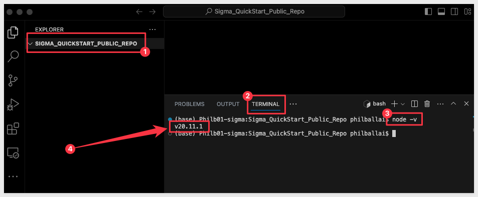
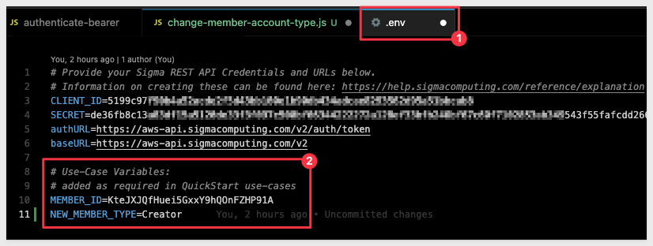
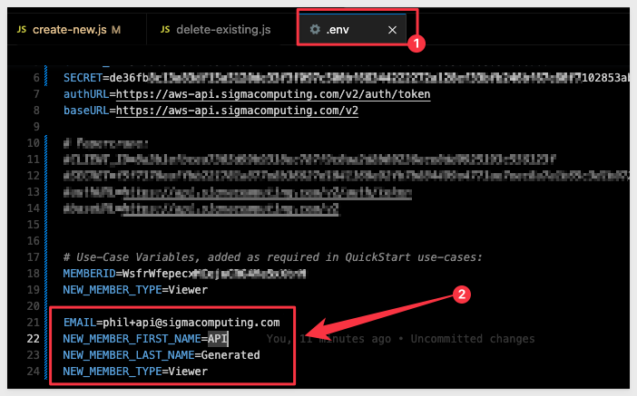
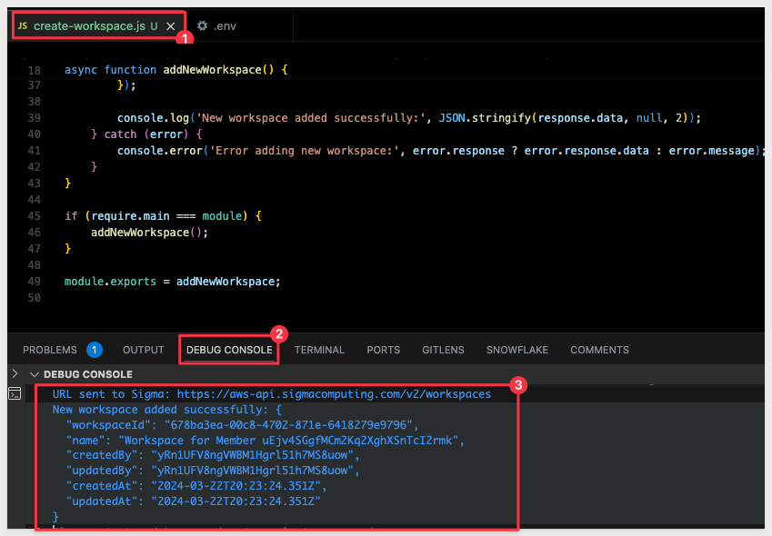
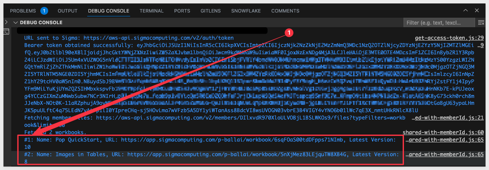

author: pballai
id: administration_api_code_samples
summary: administration_api_code_samples
categories: Administration
environments: web
status: hidden
feedback link: https://github.com/sigmacomputing/sigmaquickstarts/issues
tags: 
lastUpdated: 2024-03-01

# Sigma REST API Code Samples

## Overview 
Duration: 5 

This QuickStart is designed to support Sigma's [API Code Samples](https://help.sigmacomputing.com/recipes) and will demonstrate some common operations that customers may use the REST API for.

The actual code shown is available in Sigma's [quickstart-public git repository](https://github.com/sigmacomputing/quickstarts-public)

All code samples provided here are based on javaScript, although [Sigma's Swagger](https://help.sigmacomputing.com/reference/explanation) provides code snippets for all the most common languages, including [curl.](https://curl.se/)

### Target Audience
Developers who are evaluating or working with Sigma's REST API. 

### Prerequisites

<ul>
  <li>A computer with a current browser. It does not matter which browser you want to use.</li>
  <li>Administrative access to your Sigma environment.</li>
  <li>Some familiarity with Sigma is assumed. Not all steps will be shown as the basics are assumed to be understood.</li>
  <li>A development environment of choice. We will demonstrate with Microsoft VSCode and related extensions</li>
</ul>

<aside class="postive">
<strong>IMPORTANT:</strong><br> Sigma recommends that you use non-production resources when doing QuickStarts.
</aside>

<button>[Sigma Free Trial](https://www.sigmacomputing.com/free-trial/)</button>

## Environment Setup

### Create Sigma Project Folder

Create a new folder on your local computer called `Sigma_QuickStart_Public_Repo`. It does not matter where, as long as you can navigate to it easily.

### Source Code Editor - VSCode 

For this QuickStart, we will demonstrate using Visual Studio Code (VSCode), but you may use any IDE you prefer. 

VSCode, is a source-code editor developed by Microsoft for Windows, Linux and macOS. Features include support for debugging, syntax highlighting, intelligent code completion, snippets, code refactoring, and embedded Git.

[Install VSCode from Microsoft's download site.](https://code.visualstudio.com/download)

Run the installation with all defaults.

Open VSCode and make sure it loads without error and open the folder `Sigma_QuickStart_Public_Repo` we created earlier:


### Runtime Environment - Node.js
Duration: 20

While developers can use any language to communicate with the Sigma REST API, we will use the popular framework [Node.js. ](https://nodejs.org/en) for our examples.

Node.js (Node) is an open-source, cross-platform, back-end JavaScript runtime environment that runs on a JavaScript engine and executes JavaScript plaintext outside a web browser, which was designed to build scalable network applications.
 
[Download and install Node.js from here:](https://Nodejs.org/en/download/)

Use the LTS (long term supported) version appropriate for your operating system.

Run the installer selecting all the defaults. **We do not need to specify our project folder for this installation.**

This will install both `Node` and the `Node package manager` (which manages optional Node components, which add more functionality). 

The package manager is abbreviated to `npm` when running commands.

You can verify your installation using VSCode's built-in Terminal:


**Run the command:**
```code
node -v
```

This should return the version number as below:



<aside class="negative">
<strong>NOTE:</strong><br> You version number will likely vary from what is shown in the screenshot, based on when you installed Node.
</aside>

You can leave the Terminal session open as we will use that in the next section.

### Node modules

We need to install a few Node modules **in our local folder.**

This process is the same for many Node modules. We will start with two, but in later use-cases we may require others to be installed, so watch for that along the way.

### Axios

The first module we will install is called `Axios`, and is one of the most popular JavaScript libraries in the world. It is an HTTP client that can be used to make requests from both browsers and NodeJS. We will use this to make calls to the Sigma REST API, via a Javascript.

In VSCode Terminal, run:
```
npm install axios
```


No errors should be returned. 

### dotenv

[dotenv](https://www.npmjs.com/package/dotenv) is a popular Node. js module that allows you to load environment variables from a `.env` file into your Node. js application. This will simplify our project code. 

Run the following command in Terminal:
```code
npm install dotenv
```

No errors should be returned. 

### Project Files

To save you time, we have stored all the required project files in Git, so you can just download them, and explore the use cases that interest you. This QuickStart will guide you, based on use case name, so feel free to skip to the section that interests you most.

<aside class="positive">
<strong>IMPORTANT:</strong><br> The section named "Get Bearer Token Script" is a must read, as proper authentication is required in all use cases. Do that section once you finish this section.
</aside>

To clone the Git repository in VSCode, open the `Command palette`:


Type `Clo` into the command palette bar and then click `Git: Clone`:


Paste this URL and hit enter:
```code
https://github.com/sigmacomputing/quickstarts-public.git
```

VSCode will prompt for the location to store the files on your computer. Navigate to the `Sigma_QuickStart_Public_Repo` folder and click the `Select as Repository Destination` button.


If prompted to open the cloned repository, click `Open`.

The repository contains other code samples you can explore, but we are interested in the `rest-api-recipes` folder:


### Environment Variables
We need to update the file that stores our environment variables. 

First, you will need to provide the values for `ClientID`, `Secret`, `Base` and `AuthURL`. [Instructions can be found in the API Swagger if needed.](https://help.sigmacomputing.com/reference/explanation)

This file keeps our keys out of our scripts and also contains other variables we may want to change in different use-cases:


Replace the placeholders for `YourClientID` and `YourAPISecret`. The values for auth and baseURL are for Sigma instances hosted in AWS-US. You may need to change these based on where your instance is running. If you are not sure, check the instructions mentioned above (in the API Swagger).

Save the file.


<!-- END OF SECTION-->

## Authentication - REQUIRED
This section demonstrates the code that was provided on the `API Code Samples` > `Authentication: Get Access Token` page, [located here.](https://help.sigmacomputing.com/recipes/authentication-get-access-token)

### Description
This script retrieves a bearer token from the Sigma API using client credentials authentication. It extracts required credentials from environment variables, sends a POST request to the authentication endpoint, and logs the obtained token. The function getBearerToken can be imported into other scripts for accessing protected resources.

This actual javascript is available as part of the git repository mentioned earlier or is available to copy directly from our API Code Samples site under: [Authentication: Get Access Token](https://help.sigmacomputing.com/recipes/authentication-get-access-token) and returns a bearer token (token).
It also exports a Javascript function to request a bearer token (token) each time it is called. 

<aside class="positive">
<strong>IMPORTANT:</strong><br> The token is valid for 3599 seconds (just under one hour) and needs to be refreshed. Our Javascript function will handle that.
</aside>
`
In the project root directory, open the file `get-access-token.js` and review it's contents. Each section is commented so it can be understood. 

Start the VSCode debugger against this code by pressing `F5` on your keyboard.

If prompted by VSCode to select a debugger, select `Node.js`.

The VSCode debugger console will show this API response if the .env variables are configured correctly:


The script is configured to run standalone, as well as export a function that we can call from other scripts too. 

This is why we show the bearer token twice in the response. Other scripts that call this one, will only show the token one time in the console.

The ability to run it standalone is only for convenience, so that we can verify it obtains a token.

We can now move on to use cases, leveraging the `getBearerToken` function:


<!-- END OF SECTION-->

## Members: List All
Duration: 20

### Description

We will start with a very simple example that calls the `Members` > `Get` endpoint, [found here.](https://help.sigmacomputing.com/reference/listmembers-1)

This section demonstrates the code that was provided on the `API Code Samples` > `Member`> `list-all` page, [located here.](https://help.sigmacomputing.com/recipes/members-list-all)

This script retrieves all members from the Sigma API by making GET requests with pagination until all members are fetched. It first obtains a bearer token for authentication, then iterates through each page of member data, concatenating the results into an array. Finally, it logs the fetched members to the console in a readable JSON format. Errors during the process are logged with detailed error messages

<aside class="positive">
<strong>IMPORTANT:</strong><br> This script will call the get-access-token > getBearerToken function to get a new/refreshed token automatically so there is no need to do anything else, assuming you have completed the section of this QuickStart "Authentication - REQUIRED" and ensured your .env file is configured correctly.
</aside>

### Running the Script
Open the file `list-all.js` in the `members` folder:


Each code block is commented to explain what operations are being performed. 

Press `F5` to run the script with VSCode's debugger. 

The expected response is:


<!-- END OF SECTION-->

## Members: Update
Duration: 20

This section demonstrates the code that was provided on the `API Code Samples` > `Member: Update` page, [located here.](https://help.sigmacomputing.com/recipes/members-update)

### Description
This script updates the account type of a member on the Sigma platform by sending a PATCH request to the API with the new member type. It retrieves the necessary information such as the member ID and new member type from environment variables and constructs the request URL accordingly. Finally, it makes the API call to update the member's account type.

<aside class="positive">
<strong>IMPORTANT:</strong><br> This script will call the get-access-token > getBearerToken function to get a new/refreshed token automatically so there is no need to do anything else, assuming you have completed the section of this QuickStart "Authentication - REQUIRED" and ensured your .env file is configured correctly.
</aside>

### Create Test Member
Let's create new member in Sigma to test with. 

<aside class="negative">
<strong>NOTE:</strong><br> We could also do this with the API, but we will use the UI to create a test member. We want to use the UI to verify API changes we make via API too.
</aside>

If you prefer, you can use any non-production user you want, but we recommend creating a test user for this purpose. 

If you are not sure how to create a user (member) in Sigma, [please refer to this documentation.](https://help.sigmacomputing.com/docs/invite-people-to-your-organization).

We created a test user using [Gmail's email alias](https://gmail.googleblog.com/2008/03/2-hidden-ways-to-get-more-from-your.html) feature. 

Our test user is called `sales_rep`.

Make a note of the test user's memberId. Again, we could get this using the API, but in this example, we will just copy it from the URL, when looking at the user's profile from the `Administration` > `People` list:


In this case, the memberId is `KteJXJQfHuei5GxxY9hQOnFZHP91A`. Yours will be different.

Add these values to the .env file we created and save the change.
```code
MEMBER_ID=KteJXJQfHuei5GxxY9hQOnFZHP91A
NEW_MEMBER_TYPE=Creator
```



### Change Test Members' Account Type
Our test user is currently a `Viewer` account type. We want to call the Sigma API endpoint to `Update the specified member` account type to `Creator`.


We will be using the [Update the specified member](https://help.sigmacomputing.com/reference/updatemember-1) endpoint.

### Running the Script
Open the file `update.js` in the `members` folder:


Each code block is commented to explain what operations are being performed. 

Press `F5` to run the script with VSCode's debugger. 

The expected response is:


A quick check against the member in Sigma shows them having the `Creator` account type now:


<!-- END OF SECTION-->

## Members: Recent Workbooks
Duration: 20

This section demonstrates the code that was provided on the `API Code Samples` > `Member: Recent Workbooks` page, [located here.](https://help.sigmacomputing.com/recipes/members-recent-workbooks)

<aside class="positive">
<strong>IMPORTANT:</strong><br> This script will call the get-access-token > getBearerToken function to get a new/refreshed token automatically so there is no need to do anything else, assuming you have completed the section of this QuickStart "Authentication - REQUIRED" and ensured your .env file is configured correctly.
</aside>

### Description
This script fetches recent documents and folders for a specified member from the Sigma API. It retrieves a bearer token for authentication, constructs the API endpoint URL, and makes a GET request to fetch the recent items. The response is then processed to extract relevant information and sorted by the last interaction date in descending order before logging the results.
In this use case, we want to return a list of the Workbooks (by name), the permission and when they last accessed for each Workbook, ordered by most recent first.

### Running the Script
Open the file called `.env` and ensure that the memberID is set for someone who has accessed Workbooks in your Sigma instance. In a trial environment, pick someone who is very active or yourself if that is the case. As long as there is activity, it does not matter otherwise.

If you are not sure how to obtain a memberID, review the section called `Create Test Member` in the step called `Member: Update`.

Open the file called `recent-workbooks.js` in the `members` folder.

Each code block is commented to explain what operations are being performed. 

Press `F5` to run the script with VSCode's debugger. 

The expected response is:


<!-- END OF SECTION-->

## Members: Pagination   NEEDS WORK AND CLARIFICATION FROM SAM S.
Duration: 20

This section demonstrates the code that was provided on the `API Code Samples` > `Members: Pagination` page, [located here.](https://help.sigmacomputing.com/recipes/members-paginatation)

<aside class="positive">
<strong>IMPORTANT:</strong><br> This script will call the get-access-token > getBearerToken function to get a new/refreshed token automatically so there is no need to do anything else, assuming you have completed the section of this QuickStart "Authentication - REQUIRED" and ensured your .env file is configured correctly.
</aside>

### Description
This script fetches all members from the Sigma API, handling pagination for large datasets. It retrieves a bearer token for authentication, constructs the API endpoint URL with pagination parameters, and iteratively fetches members until all pages are retrieved. The fetched member data is then formatted into a table for display in the console. If an error occurs during the process, it is logged accordingly.

Query parameters page and limit are commonly used together in APIs to implement pagination. This mechanism allows clients to request data in discrete chunks or "pages", making it easier to handle large datasets. Here's how these parameters typically work together in API use cases:

Many of Sigma's API operations support `page` and `limit` as query parameters. 

These parameters can be used in different ways but generally they are used to:

1: Reduces the load on the server and the amount of data transmitted over the network at any one time.
2: Make it easier for clients to consume data in manageable chunks, especially important for user interfaces where users scroll through lists or tables of data.
3: Provide flexibility so customers can adjust the limit based on their current needs or capabilities/ For example, requesting more data on a powerful desktop browser or less on a mobile device with limited bandwidth.

### The Page Parameter
The page parameter indicates the current page of data to retrieve.

In Sigma, this is a `string` value. 


### The Limit parameter


### Used Together


<!-- END OF SECTION-->

## Members: Onboarding
Duration: 20

This section demonstrates the common steps to add a new member (user) to Sigma, via the API. 

### Description
This script creates a new member in Sigma by sending a POST request to the API endpoint. It dynamically generates a unique email address for the new member to ensure uniqueness during testing. 

The script utilizes environment variables to specify the base URL, email, first name, last name, and member type. 

Upon successful creation, it logs the newly added member's details, and in case of an error, it logs the error message.

We will break each step into it's own script and once each step is verified to work, we will run them as one step.

The steps are:
1: Create a unique, new member
2: Create a new Workspace for the member
3: Grant permission to the workspace to the new member
4: Add the member to a team
5: Grant permission to a connection (data) to the member

In each section, we export the script to a Javascript function so that when we are done, we can put it all together to run as one script.

### Required Body Parameters
Open the `.env` file and add the required parameters. You will need to provide different values as shown below:
```code
EMAIL={your example email}
NEW_MEMBER_FIRST_NAME=API
NEW_MEMBER_LAST_NAME=Generated
NEW_MEMBER_TYPE=Viewer

WORKSPACEID=
TEAMID=
CONNECTIONID=
```

<aside class="positive">
<strong>IMPORTANT:</strong><br> For email, we use the value provided in "EMAIL" as a base address. The script is designed to make the address unique, automatically by leveraging the Gmail alias feature. In this way, we always are creating a new member while testing.<br>

We recommend you use the UI to delete these members later, if desired. In a Sigma trial environment, this cleanup is not required.  
</aside>



Save the changes.

### Running the "create-new.js" script

Open the file `create-new.js` in the `members` folder:

Each code block is commented to explain what operations are being performed. 

Note the line of code that uses the [Javascript split function](https://developer.mozilla.org/en-US/docs/Web/JavaScript/Reference/Global_Objects/String/split) to ensure that the members's email address is unique:
```code
const newMemberEmail = `${baseEmail.split('@')[0]}+${new Date().getTime()}@${baseEmail.split('@')[1]}`;
```

Press `F5` to run the script with VSCode's debugger. 

The expected response is:


Copy the `memberId` provided in the response. We will use that in the next step.

Checking in the UI, we can see the new member has been added. This member does not have a `Workspace`, the rights to one, or rights to any data (Connections). We will do each of these in steps first. Then will will put it all together in a script we will call `Member: Onboarding"


### Running the "create-workspace.js" script

Update `.env` with the `memmberId` we received in the `create-new` script response:


Open the file `create-workspace.js` in the `members` folder.

Each code block is commented to explain what operations are being performed. 

Press `F5` to run the script with VSCode's debugger. 

The expected response is:



Copy the `WorkspaceId` in the response. We will use that in the next step.

Checking in the Sigma UI we can see the new Workspace:


### Running the "create-workspace-permission.js" script

Open the file `.env` and update the value for `WORKSPACEID` that we received from the `create-workspace.js` script

Save the change.

Open the file `create-workspace-permission.js` in the `members` folder.

Each code block is commented to explain what operations are being performed. 

<aside class="negative">
<strong>NOTE:</strong><br> We give this member "View" permission to the workspace because we created the member with "Viewer" rights earlier. This can be adjusted to suit whatever use case is required.
</aside>

Press `F5` to run the script with VSCode's debugger. 

The expected response is:
```code
URL sent to Sigma: https://aws-api.sigmacomputing.com/v2/workspaces/678ba3ea-00c8-4702-871e-6418279e9796/grants
New workspace permission added successfully: {}
```

Checking in the Sigma UI we can check the Workspace sharing permissions:


### Running the "add-member-to-team" script 

For this script we will need to have a `TeamId` is Sigma that we want to assign the new member to.

We already have a script we built in section 5, and we can use that to update the member's team assignment.  We can grab the TeamId for one from the UI for this demonstration:


Open the file `.env` and update the value for `TEAMID`, using your value.

Save the change.

Open the file `add-member-to-team.js` in the `members` folder.

Each code block is commented to explain what operations are being performed. 

Press `F5` to run the script with VSCode's debugger. 

The expected response is:
```code
URL sent to Sigma: https://aws-api.sigmacomputing.com/v2/teams/25d48b2e-b36b-4db2-98a9-2c474f4144da/members
Member successfully added to team: {}
```

Checking in the Sigma UI we can check the Workspace sharing permissions:


### Running the "create-connection-permission.js" script

For this script we will need to have a Connection is Sigma that we want to grant the new member permission to use. 

There is an endpoint to [GET all connections](https://help.sigmacomputing.com/reference/listconnections-1), but we can also just grab the connectionId for one from the UI for this demonstration:


The connection shown above has no grants yet and the connectionId is in the URL (#2 in the image).

Open the file `.env` and update the value for `CONNECTIONID`, using your value.

Save the change.

Open the file `create-connection-permission.js` in the `members` folder.

Each code block is commented to explain what operations are being performed. 

<aside class="negative">
<strong>NOTE:</strong><br> We give this member "View" permission to the workspace because we created the member with "Viewer" rights earlier. This can be adjusted to suit whatever use case is required.
</aside>

Press `F5` to run the script with VSCode's debugger. 

The expected response is:
```code
URL sent to Sigma: https://aws-api.sigmacomputing.com/v2/workspaces/678ba3ea-00c8-4702-871e-6418279e9796/grants
New workspace permission added successfully: {}
```

Checking in the Sigma UI (from `Home` > `Connections`) we see our new member has connection permission:


### Putting it all together

Now that each step is working as expected, we can create a master script that calls each step's module and just one run script to onboard a new member.

We are faced with a challenge in that we do not know the memberId until the first script is run. Previously, we hard-coded this value and for the sake of not changing any of the other scripts, we will manually run the `create-new.js` script and then run all the other scripts from one master script. 

This method strikes a balance between demonstrating individual script functions and showing how they can be integrated into a larger workflow with a simple manual step bridging the gap. 

<aside class="negative">
<strong>NOTE:</strong><br> Recall that our new member script automatically creates a unique email address, so now changes are required to .env file. 
</aside>

Open the file `create-new.js` in the `members` folder:

Press `F5` to run the script with VSCode's debugger. 

Copy the `memberId` provided in the response, and update the `MEMBERID` with this new value.

Next, open the file `master-script.js` and press `F5` to run the script with VSCode's debugger. 

Each code block is commented to explain what operations are being performed. 

<aside class="negative">
<strong>NOTE:</strong><br> We will also reuse the TeamId and ConnectionId from the .env file, assuming that all new members would go use these. In practice, these values could also be made dynamic from some other system of record.  
</aside>

Press `F5` to run the script with VSCode's debugger. 

The expected response is:
```code
URL sent to Sigma: https://aws-api.sigmacomputing.com/v2/workspaces/678ba3ea-00c8-4702-871e-6418279e9796/grants
New workspace permission added successfully: {}
Connection permissions granted successfully.
Onboarding process completed successfully.
```

Verify the new member is created in the UI, has workspace permission, is a member of the expected team, and has connection permission.


<!-- END OF SECTION-->

## Workbooks: List All
Duration: 20

This section demonstrates the code that was provided on the `API Code Samples` > `Workbooks: List All` page, [located here.](https://help.sigmacomputing.com/recipes/workbooks-list-all)

<aside class="positive">
<strong>IMPORTANT:</strong><br> This script will call the get-access-token > getBearerToken function to get a new/refreshed token automatically so there is no need to do anything else, assuming you have completed the section of this QuickStart "Authentication - REQUIRED" and ensured your .env file is configured correctly.
</aside>

### Description
This script fetches all workbooks accessible to a specific member based on their memberId. It retrieves the member's files, filters out the workbooks, and then lists their names, URLs, and version numbers.

### Running the Script
Open the file `list-all.js` in the `workbooks` folder:

Each code block is commented to explain what operations are being performed. 

Press `F5` to run the script with VSCode's debugger. 

The expected response is:


<!-- END OF SECTION-->

## Workbooks: Shared with Me
Duration: 20

A common use case is to provide the user a list of workbooks that are shared with, and have the list hyperlinked to the workbook so the user can just click and go.

This section demonstrates the code that was provided on the `API Code Samples` > `Workbooks: Shared with Me` page, [located here.](https://help.sigmacomputing.com/recipes/workbook-shared-with-me)

<aside class="positive">
<strong>IMPORTANT:</strong><br> This script will call the get-access-token > getBearerToken function to get a new/refreshed token automatically so there is no need to do anything else, assuming you have completed the section of this QuickStart "Authentication - REQUIRED" and ensured your .env file is configured correctly.
</aside>

### Description
This script fetches all workbooks accessible to a specific member based on their memberId. It retrieves the member's files, filters out the workbooks, and then lists their names, URLs, and version numbers.

### Running the Script
Open the file `shared-with-memberId.js` in the `workbooks` folder:

Each code block is commented to explain what operations are being performed. 

Press `F5` to run the script with VSCode's debugger. 

The expected response is:




<!-- END OF SECTION-->

## Workbooks: Initiate a Materialization
Duration: 20

A common use case is to programmatically initiate an existing materialization job in Sigma, via API.

This section demonstrates the code that was provided on the `API Code Samples` > `Workbooks: Workbook: Initiate Materialization Job` page, [located here.](https://help.sigmacomputing.com/recipes/workbook-initiate-materialization-job)

<aside class="positive">
<strong>IMPORTANT:</strong><br> This script will call the get-access-token > getBearerToken function to get a new/refreshed token automatically so there is no need to do anything else, assuming you have completed the section of this QuickStart "Authentication - REQUIRED" and ensured your .env file is configured correctly.
</aside>

### Description

This script initiates a materialization job for a specified workbook. 

It retrieves required the sheet ID, from the materialization schedules of the workbook. Then, it starts the materialization job using the workbookId and sheet ID. 

After initiating the job, it continually checks the status of the materialization until it either completes successfully or fails. Once the status indicates that the materialization is "ready", the script stops execution, indicating that the job has been completed successfully.

<aside class="negative">
<strong>NOTE:</strong><br> This script will use "WORKBOOKID" from the .env file, and requires that a schedule has already been created in Sigma.
</aside>

Then, it starts the materialization job using the workbookId and sheet ID. After initiating the job, it continually checks the status of the materialization until it either completes successfully or fails. 

Once the status indicates that the materialization is "ready", the script stops execution, indicating that the job has been completed successfully.

### Create a Materialization Schedule

Log into Sigma as an `Administrator`. 

Navigate to a Workbook that you want to materialize. We created a simple workbook that has two pages, one for a `Dashboard` and one for the source data, which is based on the `Sigma Sample Database` > `Retail` > `Plugs Electronics` > `Plugs Electronics Hands On Lab` table. This second page is labeled `Data`. 

<aside class="negative">
<strong>NOTE:</strong><br> We selected to materialize this table since it is small (4.5M rows) and the runtime to materialize will be less than 20 seconds in our test environment.
</aside>

On the `Data` page, we select `Schedule materialization` as shown:


We configured the schedule to run once a month:


The materialization job ("Job") needs to run to success the first time, and then is available to the API.


We can check the status of all Jobs by navigating to `Administration` > `Materializations`:


We can now call this Job using the API.

### Running the Script
Open the file `initiate-materialization.js` in the `workbooks` folder:

Each code block is commented to explain what operations are being performed. 

Press `F5` to run the script with VSCode's debugger. 

As the script runs the materialization status is checked and goes through three states, pending, building and ready.

Pending indicates job is queued.

Building indicates the job is running.

Ready indicated the job is completed to success.

The expected response looks like this:


If we want to check the status of this Job, we can use the UI, by navigating to `Administration` > `Materializations`.

<aside class="positive">
<strong>IMPORTANT:</strong><br> As a best practice, remove (or suspend) any materialization jobs that are no longer needed. 
</aside>


<!-- END OF SECTION-->

## Workbooks: List all Input Tables
Duration: 20

This section demonstrates the code that was provided on the `API Code Samples` > `Workbooks: List all Input Tables` page, [located here.](https://help.sigmacomputing.com/recipes/workbooks-list-all-input-tables)

<aside class="positive">
<strong>IMPORTANT:</strong><br> This script will call the get-access-token > getBearerToken function to get a new/refreshed token automatically so there is no need to do anything else, assuming you have completed the section of this QuickStart "Authentication - REQUIRED" and ensured your .env file is configured correctly.
</aside>

### Description
This script performs a targeted search across all workbooks for an organization, looking specifically for elements of the type "input-table." 

It logs concise details about each found element, including the workbook's name and path, the page's name, and the input table's name and ID. 

It's designed to run silently, only outputting information when relevant elements are discovered, and includes basic error handling to manage issues quietly without interrupting the process.

### Running the Script
Open the file `all-input-tables.js` in the `workbooks` folder:

Each code block is commented to explain what operations are being performed. 

Press `F5` to run the script with VSCode's debugger. 

The expected response is:


<aside class="positive">
<strong>IMPORTANT:</strong><br> It is possible to alter this script to retrieve other types of elements. For example, other type are can be: "control", "text", "visualization", "table" and so on.
</aside>


<!-- END OF SECTION-->

## What we've covered
Duration: 5

In this lab we learned how to.........

INSERT FINAL IMAGE OF BUILD IF APPROPRIATE

<!-- THE FOLLOWING ADDITIONAL RESOURCES IS REQUIRED AS IS FOR ALL QUICKSTARTS -->
**Additional Resource Links**

[Blog](https://www.sigmacomputing.com/blog/)<br>
[Community](https://community.sigmacomputing.com/)<br>
[Help Center](https://help.sigmacomputing.com/hc/en-us)<br>
[QuickStarts](https://quickstarts.sigmacomputing.com/)<br>

Be sure to check out all the latest developments at [Sigma's First Friday Feature page!](https://quickstarts.sigmacomputing.com/firstfridayfeatures/)
<br>

[](https://twitter.com/sigmacomputing)&emsp;
[](https://www.linkedin.com/company/sigmacomputing)&emsp;
[](https://www.facebook.com/sigmacomputing)


<!-- END OF WHAT WE COVERED -->
<!-- END OF QUICKSTART -->