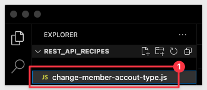

author: pballai
id: administration_api_code_samples
summary: administration_api_code_samples
categories: Administration
environments: web
status: Published
feedback link: https://github.com/sigmacomputing/sigmaquickstarts/issues
tags: default
lastUpdated: 2024-03-01

# Sigma REST API Code Samples

## Overview 
Duration: 5 
<!--Duration is deprecated and no longer required, however the code still expects to see it so include it for each section. The actual time value does not matter. -->

This QuickStart **QS** provides all the common Markup to be used in new QS. 

Sample code and examples are shown for each item.

We encourage you to review the QS called 

This QuickStart assumes you........

 ### Target Audience
Anyone who is trying to create QS content for Sigma. 

### Prerequisites

<ul>
  <li>A computer with a current browser. It does not matter which browser you want to use.</li>
  <li>Access to your Sigma environment.</li>
  <li>Some familiarity with Sigma is assumed. Not all steps will be shown as the basics are assumed to be understood.</li>
  <li>A development environment of choice. We will demonstrate with Microsoft VSCode and related extensions</li>
</ul>

<aside class="postive">
<strong>IMPORTANT:</strong><br> Sigma recommends that you use non-production resources when doing QuickStarts.
</aside>

<button>[Sigma Free Trial](https://www.sigmacomputing.com/free-trial/)</button>
  
### What You’ll Learn
How to apply Sigma approved Markdown for your QS.

### What You’ll Build
[I good example of the Sigma style that we want to try to adhere to is here](https://quickstarts.sigmacomputing.com/guide/administration_audit_logging/index.html?index=..%2F..index#0)

INSERT IMAGE OF FINAL BUILD IF APPROPRIATE.........


<!-- NOTE: SIGMA LOGO REQUIRED AT END OF EACH ## SECTION -->
<!-- END OF OVERVIEW -->


## Environment Setup

### Create Project Folder

Create a new folder on your local computer called `rest_api_recipes`. It does not matter where, as long as you can navigate to it easily.

### Source Code Editor - VSCode 

For this QuickStart, we will demonstrate using Visual Studio Code (VSCode), but you may use any IDE you prefer. 

VSCode, is a source-code editor developed by Microsoft for Windows, Linux and macOS. Features include support for debugging, syntax highlighting, intelligent code completion, snippets, code refactoring, and embedded Git.

[Install VSCode from Microsoft's download site.](https://code.visualstudio.com/download)

Run the installation with all defaults.

Open VSCode and make sure it loads without error and open the folder `rest_api_recipes` we created earlier:


### Runtime Environment - Node.js
Duration: 20

While developers can use any language to communicate with the Sigma REST API, we will use the popular framework [Node.js. ](https://nodejs.org/en) for our examples.

Node.js (Node) is an open-source, cross-platform, back-end JavaScript runtime environment that runs on a JavaScript engine and executes JavaScript plaintext outside a web browser, which was designed to build scalable network applications.
 
[Download and install Node.js from here:](https://Nodejs.org/en/download/)

Use the LTS (long term supported) version appropriate for your operating system.

Run the installer selecting all the defaults. **We do not need to specify our project folder for this installation.**

This will install both `Node` and the `Node package manager` (which manages optional Node components, which add more functionality). 

The package manager is abbreviated to `npm` when running commands.

You can verify your installation using VSCode's built-in Terminal:


**Run the command:**
```code
node -v
```

This should return the version number as below:


<aside class="negative">
<strong>NOTE:</strong><br> You version number will likely vary from what is shown in the screenshot, based on when you installed Node.
</aside>

<aside class="positive">
<strong>IMPORTANT:</strong><br> Use Node version 20.6.1 or higher. This allows us to avoid installing a module (typically DotENV) to manage environment variables (for example: our API Secret). Since Node v20.6.1, the ability to reference a specific file containing environment variables from the command line is supported.
</aside>

You can leave the Terminal session open as we will use that in the next section.

### Node module

We need to install a few Node modules **in our local folder** with the associated project files.

This process is the same when installing common Node modules. We will start with two, but in later use-cases we may require others to be installed so watch for that along the way, in other sections of this QuickStart.

### Axios

The first module we will install is called `Axios`, and is one of the most popular JavaScript libraries in the world. It is an HTTP client that can be used to make requests from both browsers and NodeJS. We will use this to make calls to the Sigma REST API, via a Javascript.

In VSCode Terminal, run:
```
npm install axios
```


No errors should be returned. 


<!-- END OF SECTION-->

### Environment Variables

We need to create a file to store our environment variables. These variables will change as we work with each use-case. 

This file keeps our bearer token out of our scripts. 

<aside class="positive">
<strong>IMPORTANT:</strong><br> The token value will need to be refreshed each hour.
</aside>

## Change a Members's Account Type
Duration: 20

With our system setup, we can try our first script. 

We want to call the Sigma API endpoint to `Update the specified member` account type.

For this use case, we will be using [this endpoint.](https://help.sigmacomputing.com/reference/updatemember-1)

In VSCode, click to create a new file in our project folder:



Next, paste the following code into the codeblock section as shown.
```code

```


<!-- END OF SECTION-->

## **NEXT SECTION**
Duration: 20


<!-- END OF SECTION-->

## **NEXT SECTION**
Duration: 20


<!-- END OF SECTION-->

## **NEXT SECTION**
Duration: 20


<!-- END OF SECTION-->

## **NEXT SECTION**
Duration: 20


<!-- END OF SECTION-->

## Hold content
Duration: 20

The [Sigma API Reference Swagger](https://help.sigmacomputing.com/reference/explanation) provides sample code for all the popular programming languages, so definitely check that out:


<!-- END OF SECTION-->


## What we've covered
Duration: 5

In this lab we learned how to.........

INSERT FINAL IMAGE OF BUILD IF APPROPRIATE

<!-- THE FOLLOWING ADDITIONAL RESOURCES IS REQUIRED AS IS FOR ALL QUICKSTARTS -->
**Additional Resource Links**

[Blog](https://www.sigmacomputing.com/blog/)<br>
[Community](https://community.sigmacomputing.com/)<br>
[Help Center](https://help.sigmacomputing.com/hc/en-us)<br>
[QuickStarts](https://quickstarts.sigmacomputing.com/)<br>
=======
Be sure to check out all the latest developments at [Sigma's First Friday Feature page!](https://quickstarts.sigmacomputing.com/firstfridayfeatures/)
<br>

[](https://twitter.com/sigmacomputing)&emsp;
[](https://www.linkedin.com/company/sigmacomputing)&emsp;
[](https://www.facebook.com/sigmacomputing)


<!-- END OF WHAT WE COVERED -->
<!-- END OF QUICKSTART -->