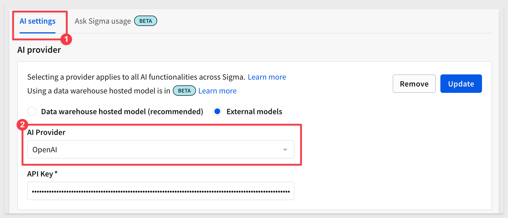
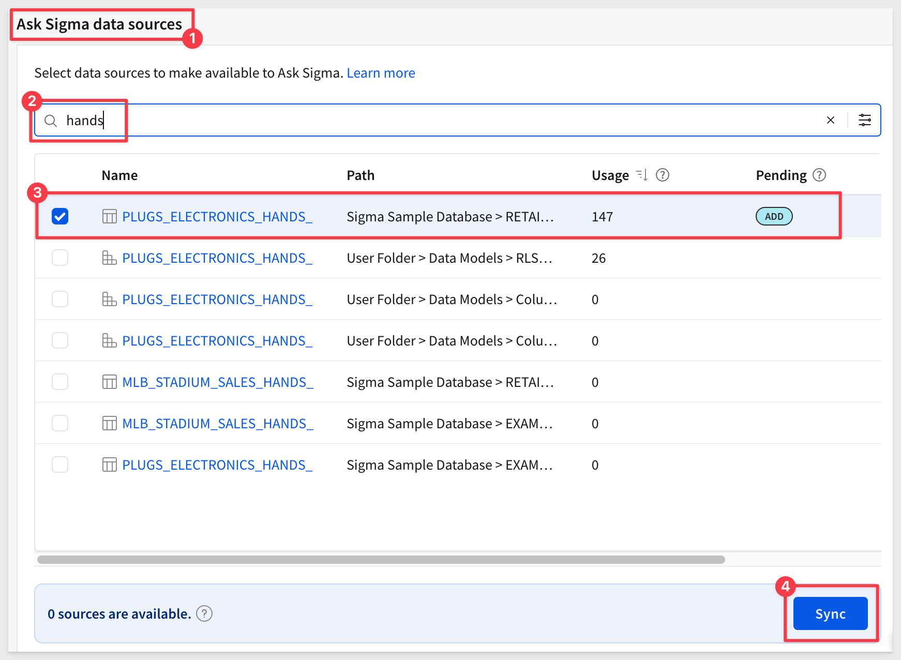
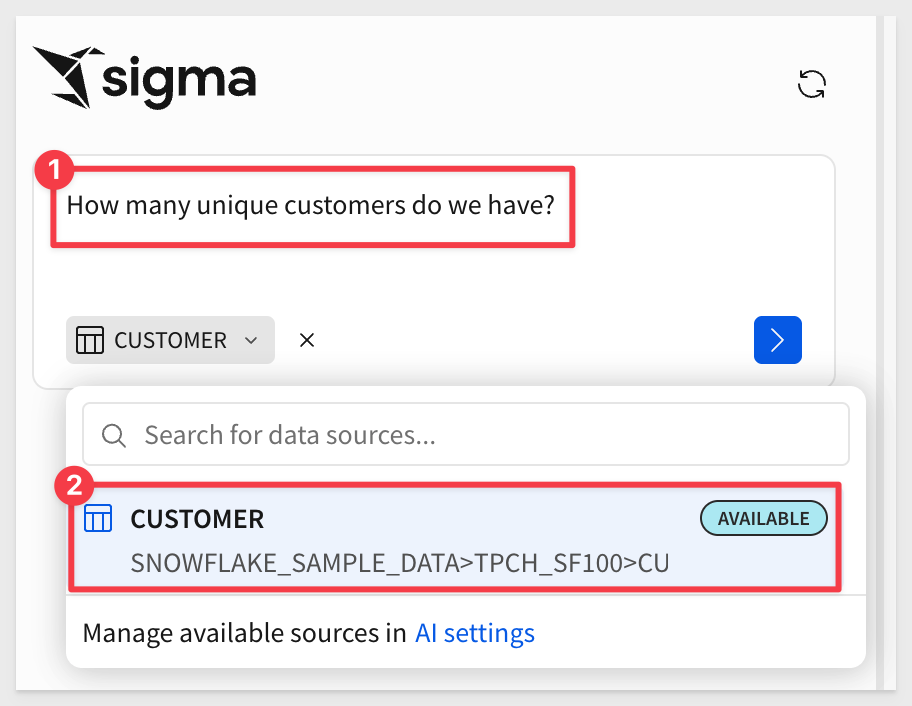
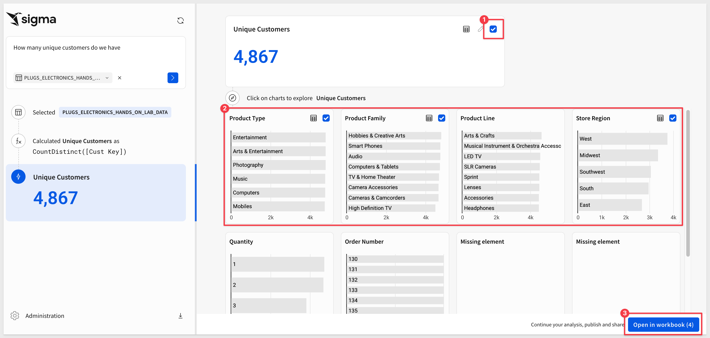
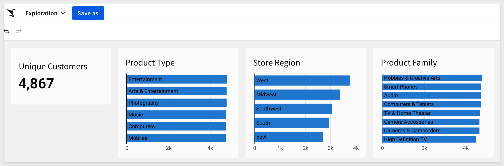

author: pballai
id: administration_ask_sigma_usage_dashboard
summary: administration_ask_sigma_usage_dashboard
categories: administration
environments: web
status: published
feedback link: https://github.com/sigmacomputing/sigmaquickstarts/issues
tags: default
lastUpdated: 2025-06-16

# Create an Ask Sigma Usage Dashboard

## Overview 
Duration: 5 

If you've used it before, you know that Sigma's approach to AI is unique, allowing users to launch selected AI results into a workbook for further analysis or sharing immediately after asking a question.

Ask Sigma breaks down every step AI took to generate its answer. This lets you double-check results, edit any step of the analysis, and work more confidently with AI.


### Usage dashboards
Like any other data, user questions can be mined for patterns that may allow improvements in the way content is designed. For example, what are the users asking about most often? That insight could justify a pre-built asset, saving users the need to search.

### Security
Ask Sigma usage data is not visible in any of the standard Sigma usage dashboards or audit logs, and requires separate configuration to ensure data security.

This is because the data includes user names as well as the full text of their questions. Sigma recommends configuring a dedicated schema in your warehouse to store this data and granting view privileges to that schema to only the admins who should be able to see this data.

### How Ask Sigma Logs Are Stored and Accessed
When you enable Ask Sigma history logging in the admin panel, Sigma automatically creates two components in Snowflake:

**1. Write-Back Table**<br>
Sigma logs every Ask Sigma query to a Snowflake table.

This table is created in a schema you specify as the write-back destination (e.g., ASK.HISTORY).

Sigma will not expose this schema in the UI.

The schema must have CREATE TABLE privileges.

**2. Auto-Generated View**<br>
Sigma automatically creates a view over the log table so it can be used in dashboards and workbooks.

This view is created in a separate schema of your choosing — typically a schema where Sigma Input Tables and views already live (e.g., QUICKSTARTS.WRITE).

The schema must allow CREATE VIEW, and must not be the write-back schema, or Sigma will ignore it.

<aside class="positive">
<strong>IMPORTANT:</strong><br> You do not need to create the view manually. Sigma handles it as long as the permissions and schema locations are valid.
</aside>

Once enabled, Sigma provides a pre-built dashboard that is available to administrative users.

<aside class="positive">
<strong>IMPORTANT:</strong><br> Some screens in Sigma may appear slightly different from those shown in QuickStarts. This is because Sigma continuously adds and enhances functionality. Rest assured, Sigma’s intuitive interface ensures that any differences will not prevent you from successfully completing any QuickStart.
</aside>

For more information on Sigma's product release strategy, see [Sigma product releases](https://help.sigmacomputing.com/docs/sigma-product-releases)

If something doesn’t work as expected, here's how to [contact Sigma support](https://help.sigmacomputing.com/docs/sigma-support)

### Target Audience
Administrators, data analysts, or others looking to monitor Ask Sigma activities and details related to Sigma.

### Prerequisites

<ul>
  <li>Any modern browser is acceptable.</li>
  <li>Access to your Sigma environment.</li>
  <li>Access to a Snowflake environment.</li>
  <li>Some familiarity with Sigma is assumed. Not all steps will be shown, as basic familiarity is assumed.</li>
 </ul>

<aside class="positive">
<strong>IMPORTANT:</strong><br> Sigma recommends using non-production resources when completing QuickStarts.
</aside>

<button>[Sigma Free Trial](https://www.sigmacomputing.com/free-trial/)</button> <button>[Snowflake Free Trial](https://signup.snowflake.com/)</button>

<aside class="negative">
<strong>IMPORTANT:</strong><br> Some features may carry a "Beta" tag. Beta features are subject to quick, iterative changes. As a result, the latest product version may differ from the contents of this document.
</aside>
 


## Snowflake Setup
Duration: 5

Before configuring Ask Sigma, we need a location to store the prompts (questions) that users are asking. We want to ensure this information is isolated in the cloud data warehouse as it contains sensitive information like usernames.

<aside class="positive">
<strong>IMPORTANT:</strong><br> Sigma does not store this data outside the customer warehouse.
</aside>

We will use Snowflake in this QuickStart, but instructions for other warehouses are available [here.](https://help.sigmacomputing.com/docs/configure-a-usage-dashboard-for-ask-sigma#configure-a-destination-in-your-warehouse-to-store-ask-sigma-usage-data)

Let's also assume that we want to completely isolate this information from other users in Snowflake and in Sigma. Do accomplish that we will create dedicated Snowflake role and Sigma connection.

Log into Snowflake as `ACCOUNTADMIN`.

Copy and paste the following SQL script into a new Snowflake SQL worksheet:
```code
-- Use full privileges to create and configure objects
USE ROLE ACCOUNTADMIN;
USE WAREHOUSE COMPUTE_WH;

-- Step 1: Create a dedicated role for Sigma access
CREATE ROLE IF NOT EXISTS ASK_ADMIN_ROLE;

-- STEP 2: SETUP FOR SIGMA WRITE-BACK CONNECTION
-- Create database and schema for Sigma Input Tables
CREATE DATABASE IF NOT EXISTS QUICKSTARTS;
CREATE SCHEMA IF NOT EXISTS QUICKSTARTS.WRITE;

-- Grant write-back permissions to the role
GRANT USAGE ON DATABASE QUICKSTARTS TO ROLE ASK_ADMIN_ROLE;
GRANT USAGE ON SCHEMA QUICKSTARTS.WRITE TO ROLE ASK_ADMIN_ROLE;
GRANT CREATE TABLE, CREATE VIEW, CREATE STAGE ON SCHEMA QUICKSTARTS.WRITE TO ROLE ASK_ADMIN_ROLE;

-- STEP 3: SETUP FOR ASK SIGMA DASHBOARD LOGGING
-- Create database and schema for Ask Sigma history
CREATE DATABASE IF NOT EXISTS ASK;
CREATE SCHEMA IF NOT EXISTS ASK.HISTORY;

-- Grant privileges to access Ask Sigma logs
GRANT USAGE ON DATABASE ASK TO ROLE ASK_ADMIN_ROLE;
GRANT USAGE ON SCHEMA ASK.HISTORY TO ROLE ASK_ADMIN_ROLE;
GRANT CREATE TABLE, CREATE VIEW ON SCHEMA ASK.HISTORY TO ROLE ASK_ADMIN_ROLE;
```

Click the `Run All` option:


<!-- END OF SECTION-->

## Sigma Connection
Duration: 5

Log into Sigma as an administrator and navigate to `Administration` > `Connections`, and click `Create Connection`.

<aside class="positive">
<strong>IMPORTANT:</strong><br> At the time of this QuickStart, Snowflake announced that they will require key pair authentication for service users starting in November 2025. This will be a mandatory requirement, and single-factor password authentication will no longer be supported. This change is part of Snowflake's broader initiative to enhance security and enforce multi-factor authentication (MFA) for all users.
</aside>

In light of the security changes above, we’ll use key pair authentication for this demonstration. There is a QuickStart: [Snowflake Key-pair Authorization](https://quickstarts.sigmacomputing.com/guide/security_snowflake_keypair_rotation/index.html?index=..%2F..index#0) if you need assistance setting it up.

Configure the connection as shown, replacing the example values with your own:


<aside class="negative">
<strong>NOTE:</strong><br> In the screenshot above, we used a service account user created during the key pair authentication setup.
</aside>

Be sure to enable write access:


Click `Create connection`. Sigma will validate the connection. Once complete, we can move on to the next step.


<!-- END OF SECTION-->

## Enable AI
Duration: 5

To use AI features in Sigma, you’ll need to select and configure an AI provider. We’ll use OpenAI for this example, but other providers are supported.

For more information, see [Configure an AI provider](https://help.sigmacomputing.com/docs/configure-ai-features-for-your-organization#configure-an-ai-provider)

<aside class="positive">
<strong>IMPORTANT:</strong><br> Customers who have sensitive data may want to use their own warehouse provider in order to prevent exposing data to third party providers.

To keep data under your control, Sigma also supports warehouse-hosted AI models.
</aside>

For more information, see [Configure warehouse AI model integration](https://help.sigmacomputing.com/docs/configure-warehouse-ai-model-integration)

Navigate to `Administration` > `AI settings`, select an AI provider and enter a valid `API key`:



Also configure `Ask Sigma usage` logging. Once done, a message will appear; click `Close`:


For more information, see [Configure AI features for your organization](https://help.sigmacomputing.com/docs/configure-ai-features-for-your-organization)

### Select data sources to make available to Ask Sigma
Now we need to tell Sigma which data sources Ask Sigma can use. Since we are using third-party AI services like OpenAI, we want to carefully control which data is accessible. This step ensures access is limited to approved or non-sensitive data.

For example, if we want Ask Sigma to have access to the `Sigma Sample Database > RETAIL > PLUGS_ELECTRONICS_HANDS_ON_LAB_DATA` just search for it, select the source, and click `Sync`:



Once the sync is complete, you can filter by `Available` to confirm it’s ready for Ask Sigma.


<!-- END OF SECTION-->

## Ask Sigma
Duration: 5

At this point, we follow the `Ask` workflow rather than the typical Sigma `Create New Workbook` process.

Click the  icon, and then select `Ask Sigma`:

We’ll ask a simple question — "How many unique customers do we have?" and direct the AI to use the `CUSTOMER` table. 



<aside class="positive">
<strong>PRO TIP:</strong><br> Directing the AI to specific data sources will result in faster and more accurate responses.
</aside>

Once Sigma generates results, the user can choose which visualizations to include in a workbook:

For example, select a few checkboxes and click `Open in workbook`:



Once it's in an exploration, we can rearrange, style, or use any of Sigma’s many powerful features and then save it as a new workbook:




<!-- END OF SECTION-->

## Ask Sigma Dashboard
Duration: 5

Now that we have a question, we can see the results on the Ask Sigma usage page.

Navigate to `Administration` > `AI settings` > `Ask Sigma usage`.

While we currently have only one record, we can see that Sigma provides a wealth of useful information about questions users are asking, who is asking them (Users), which sources are most used, and overall performance:


With all of this information, customers can deliver a more tailored Sigma experience based on the trends while also working to keep query costs down. 


<!-- END OF SECTION-->

## What we've covered
Duration: 5

In this QuickStart, we explored how to securely enable and monitor Ask Sigma usage in your organization. You now have the foundation to deploy Ask Sigma securely, monitor its usage, and tailor your content strategy based on real user questions.

**Additional Resource Links**

[Blog](https://www.sigmacomputing.com/blog/)<br>
[Community](https://community.sigmacomputing.com/)<br>
[Help Center](https://help.sigmacomputing.com/hc/en-us)<br>
[QuickStarts](https://quickstarts.sigmacomputing.com/)<br>

Be sure to check out all the latest developments at [Sigma's First Friday Feature page!](https://quickstarts.sigmacomputing.com/firstfridayfeatures/)
<br>

[](https://twitter.com/sigmacomputing)&emsp;
[](https://www.linkedin.com/company/sigmacomputing)&emsp;
[](https://www.facebook.com/sigmacomputing)


<!-- END OF WHAT WE COVERED -->
<!-- END OF QUICKSTART -->
