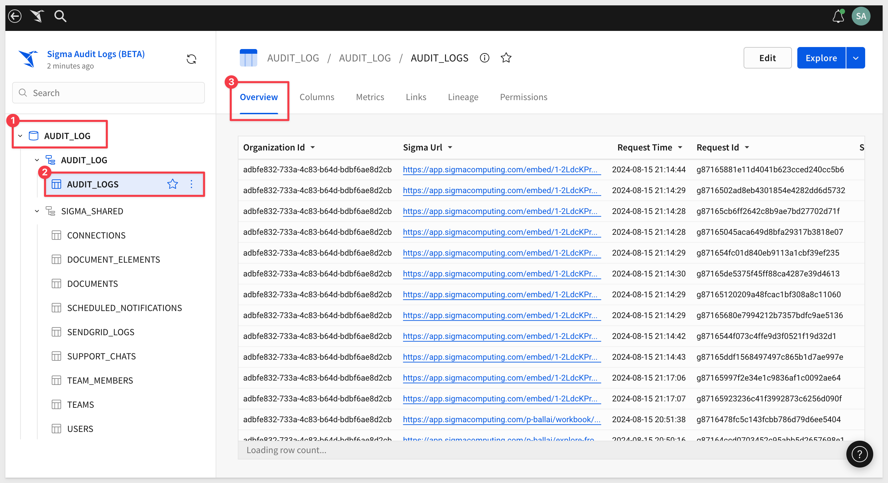
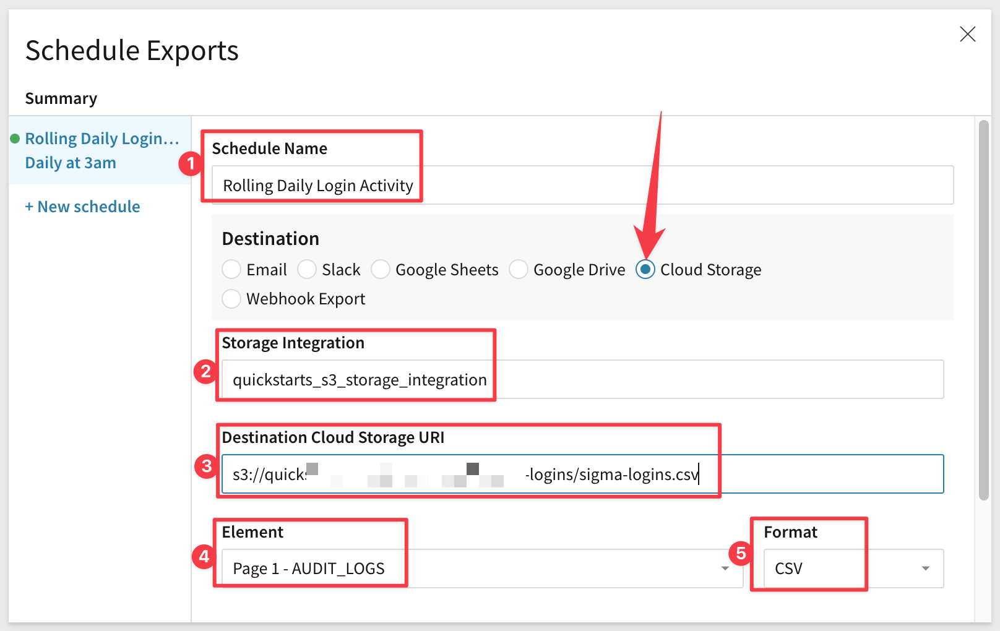
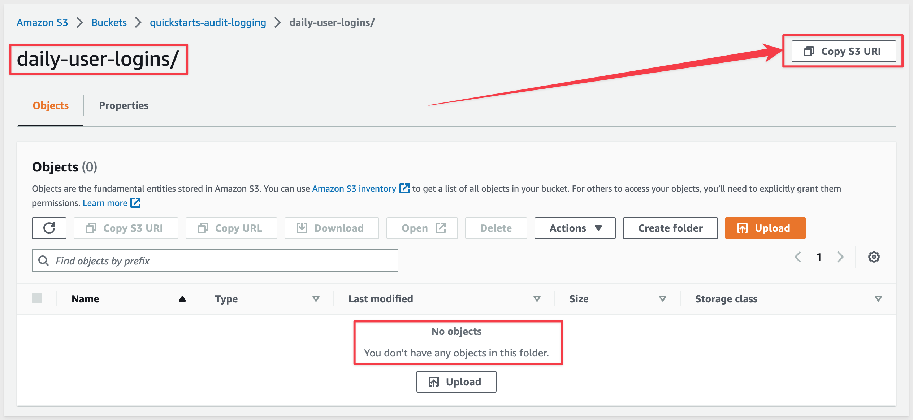

author: pballai
id: administration_audit_logging
summary: administration_audit_logging
categories: administration
environments: web
status: Published
feedback link: https://github.com/sigmacomputing/sigmaquickstarts/issues
tags: Getting Started, Analytics, Data Engineering, BI, Business Intelligence, Sigma, Sigma Computing, Snowflake, Dashboarding, Visualization, Analysis, Excel, Spreadsheet, Embedding

# Audit Logging

## Overview 
Duration: 5 

This QuickStart **QS** provides an overview of Audit Logging in Sigma. When Audit Logs are enabled for your organization, an additional Snowflake connection will appear to administrative users. This connection provides read access to data related to user-initiated events that occur within your Sigma organization. 

The Audit Log is useful when needing to troubleshoot issues or monitor user activity for security and compliance purposes. 

For example, a user may report they never received the invitation email that the administrator sent to allow access to Sigma. The Audit Log will show that the message was sent to the user and is likely "trapped" elsewhere (is: spam folder).

Since the data is available as a Sigma connection, we can explore it in a Sigma workbook to analyze how users across your organization utilize Sigma.

<aside class="postive">
<strong>IMPORTANT:</strong><br> No customer data is stored in the Audit Log. Only events/actions and context is logged. 
</aside>


### Target Audience
Anyone who is trying to monitor lower level activities and details related to Sigma.

### Prerequisites

<ul>
  <li>A computer with a current browser. It does not matter which browser you want to use.</li>
  <li>Access to your Sigma environment. A Sigma trial environment is acceptable and preferred.</li>
  <li>Some familiarity with Sigma is assumed. Not all steps will be shown as the basics are assumed to be understood.</li>
</ul>

<button>[Sigma Free Trial](https://www.sigmacomputing.com/free-trial/)</button>

<aside class="negative">
<strong>NOTE:</strong><br> If the "Audit Log" connection is not available in Sigma (when logged in as Administrator), please contact Sigma support and request it be enabled.
</aside>

### What You’ll Learn
How to access and explore audit logs in Sigma.

### What You’ll Build

We will build a chart showing daily user logins (success and failure) as demonstration but much more is possible. 


<!-- END OF OVERVIEW -->

## Browse Audit Logs
Duration: 20

Log into Sigma as `Administrator` and click `Connections` in the left sidebar.

There should be an entry called `Sigma Audit Logs`. Click into that connection:


From here, we are able to:

 <li>
    <ol type="n"> 
      <li>Browse into the "Audit Logs" table directly.</li>
      <li>Grant permission for another user to access the log table.</li>
      <li>Manage the connection (not recommended to do.)</li>
    </ol>
  </li>

<aside class="positive">
<strong>IMPORTANT:</strong><br> The audit log connection is provided and managed by Sigma. Changing connection parameters may cause the feature to stop working.
</aside>


Click into the `AUDIT_LOGS` table and we are now in a page layout that is very familiar to Sigma users. 



Your table will have different row information as Sigma is logging events for your organization. 

Sliding right on the table to see more columns we see some columns have data and some do not (nulls). This is normal and expected as each event will have different characteristics and therefore record different details. 

<aside class="positive">
<strong>IMPORTANT:</strong><br> Audit Logs are 90 days in duration by default. In order to retain entries for an extended period of time, we recommend saving the AUDIT_LOGS table as a Workbook and scheduling exports to a cloud-based storage service.
</aside>


<!-- END OF SECTION-->

## Structure of Data
Duration: 20

Audit log records each event into one of several categories. This allows easy analysis and visualization of events in Sigma.

These categories are stored in the column, `Event Type`:

 <ul>
      <li><strong>ACCESS_SIGMA:</strong> User access and interactions with passwords.</li>
      <li><strong>USER_ACCOUNTS:</strong> Admin interactions with member accounts and user invitations.</li>
      <li><strong>ACCOUNT_TYPES:</strong> Admin interactions with account type configurations and member assignments.</li>
      <li><strong>TEAMS:</strong> Admin interactions with team settings and member assignments.</li>
      <li><strong>CONNECTIONS:</strong>	Admin interactions with database connection configurations.</li>
</ul>

For all events, there is a set of `Base Data` that is included for each row of data.

Each category has distinct `Events` and `Event Entry Data` that is related to the category.

As there is a large number of options and they are subject to change over time, we will not list them here. 

[The current list is available here.](https://help.sigmacomputing.com/hc/en-us/articles/14113810205715)


<!-- END OF SECTION-->

## **Exploring the Audit Log**
Duration: 20

It is important to understand that Audit Logging does not capture event data in real time. There is a short lag as data is batched into the log from multiple cloud-based background services, depending on event type. **Expect a lag of up to ten minutes between event and log entry becoming available.** The actual time will most likely be less than this. Refresh the browser to see the latest log entries. 

Since your Log may not have much data if you are in a Sigma Trial, we will use a Sigma internal instance to demonstrate how to use the Audit Log to see how many daily login attempts have occurred, both successful and failed. The methods will apply to any other instance of Sigma but with different log data.

<aside class="positive">
<strong>IMPORTANT:</strong><br> Exploring the Audit Log is no different than using Sigma against any other data source so this is a breeze.
</aside>

Back in Sigma, click the `Explore` button to open the `AUDIT_LOG` table in a Sigma Workbook:


Let's see what is going on with user logins, both success and failures.

Create a new `Child Vizualization` from the AUDIT_LOGS table:


Drag the `Request Time` column up the the X-AXIS (on the Element Panel, left sidebar). It will automatically truncate to `Day of Request Time` and this is what we want.

Create two new columns from the Y-AXIS and rename them as:


For the Y-AXIS columns we will use these formulas for each:

```plaintext
COLUMN          FORMULA
Success         CountIf([Event Type] = "LOGIN", [Event Status] = "SUCCESS")
Failure         CountIf([Event Type] = "LOGIN", [Event Status] = "FAILURE")
```

For example we will place the Success formula as shown:


Lastly, change the chart type to `Combo`. We now can see how many users are active each day and also how many failed login attempts are happening using a line instead of bar. 


Save the Workbook as `Daily Login Activity`:


Let's explore the results. Click the `expand` icon to work with the chart and it's underlying data directly:


03-16-2023 has the most login failures so right-click on that bar and select to `keep only` it's data:


Notice that we have a single bar but the table below it shows the underlying data for 03-16-2023 only. This is Sigma `Drill Anywhere` in action.


<aside class="positive">
<strong>IMPORTANT:</strong><br> Drill Anywhere is unique and powerful. We did not explicitly plan for how a user might want to explore deep into the data ahead of time, it just works by default. This increases user adoption, satisfaction and reduces the number of changes the development team needs to do after the fact.
</aside>

At this point we could further explore the data table for insights but that is not the goal of this QuickStart.


<!-- END OF SECTION-->

## **Exporting Audit Log Data**
Duration: 20

There may be reasons to store Audit Log data outside of Sigma. A few examples are:

 <ul>
      <li><strong>Extended retention period:</strong> Sigma stores Audit Logs for 90 days only.</li>
      <li><strong>Provide access to third party tool:</strong> Many organizations have central anomaly detection tools they prefer to use.</li>
      <li><strong>To meet governance requirements:</strong> Any requirement that enforces direct control over logging activities.<li>
</ul>

Let's assume that we are required to retain a rolling history of daily logins (success and failure) for 5 years. Sigma retains 90 days worth of information so we will need to export log data to meet this requirement.

Building on the last exercise, we have what we need in the `Daily Login Activity` Workbook we built and just need to configure an export schedule to handle the rest.

<aside class="negative">
<strong>NOTE:</strong><br> Some additional configuration is required depending on the destination for that daily export job. 
</aside>

Click the report name and select `Schedule exports`:


Click `Add Schedule` from the pop-up.

Provide values for each numbered item as shown:



For `Storage Integration` we will be using a method that provides a secure connection between Snowflake (where the Audit Log export is stored) to AWS S3.

This requires some configuration in Sigma, Snowflake and AWS in order for the scheduled job to securely delivery data to S3, from Snowflake (where the Audit Log is stored).

<aside class="positive">
<strong>IMPORTANT:</strong><br> When using the Sigma export option "Cloud Storage" it is required to request Sigma support to assist in the Snowflake configuration as Audit Logs are held inside Sigma's Snowflake account. 
</aside>

The high-level workflow looks like this:


[For more information on how to configure secure access to S3 from Snowflake, click here](https://docs.snowflake.com/en/user-guide/data-load-s3-config)

For `Destination Cloud Storage URI`, use the link to `Copy S3 URI` in AWS S3 to get this string:



We will use the Sigma Workbook Page Element and .csv format for the export.

Scrolling down, we want each export to use the current date/time in the filename. The rest of this schedule is up to you. For demonstration, we will invoke this job to `Run now` so we can see the results land in S3. 


Click `Save Schedule`.

Open the scheduled job and click `Run now`:


If everything is configured correctly, the file lands in S3 for extended retention as a comma delimited format:


<!-- END OF SECTION-->

## What we've covered
Duration: 5

In this QuickStart we learned how Sigma Audit Logs are structured and can be used to provide detailed information about events as users interact with Sigma including scheduled jobs.

<!-- THE FOLLOWING ADDITIONAL RESOURCES IS REQUIRED AS IS FOR ALL QUICKSTARTS -->
**Additional Resource Links**

[Help Center Home](https://help.sigmacomputing.com/hc/en-us)<br>
[Sigma Community](https://community.sigmacomputing.com/)<br>
[Sigma Blog](https://www.sigmacomputing.com/blog/)<br>
<br>

[](https://twitter.com/sigmacomputing)&emsp;
[](https://www.linkedin.com/company/sigmacomputing)
[](https://www.facebook.com/sigmacomputing)


<!-- END OF WHAT WE COVERED -->
<!-- END OF QUICKSTART -->