author: pballai
id: administration_azure_private_link
summary: administration_azure_private_link
categories: administration
environments: web
status: Published
feedback link: https://github.com/sigmacomputing/sigmaquickstarts/issues
tags: Getting Started, Analytics, Data Engineering, BI, Business Intelligence, Sigma, Sigma Computing, Snowflake, Dashboarding, Visualization, Analysis, Excel, Spreadsheet, Embedding, API

# Azure Private Link
<!-- The above name is what appears on the website and is searchable. -->

## Overview 
Duration: 5 

For Sigma organizations running on Microsoft Azure (Azure), we can securely connect to your data using Azure Private Link. Azure Private Link is a security feature available for Azure accounts. It will allows connections between your Azure Virtual Network (VNet) and other services, without sending traffic over the public internet. In this case, the Secure Link will be created between Sigma and your data warehouse, all inside Azure.

The Azure private link service enables Sigma, which runs in a isolated private virtual network in Azure, to reach customer data via Azure's internal network such that no traffic is transmitted over the public internet. 

Azure Private Link provides enhanced security, reduced network latency, simplified networking, cost-effectiveness, and compliance with regulations.

Sigma currently supports creating private links to three kinds of data warehouse that runs in Azure; Snowflake, Databricks and Postgesql. 

**[Please check here for the latest information on supported connections](NEEDS LINK)**

Standing up a Private Link requires customer's cloud administrator (or similar role) to provide specific configuration detail with Sigma so that the Private Link connection can be established. This is covered in each section later and depends on data warehouse type. 

The process of creating the Private Link can take 2-3 business days once the request is acknowledged by Sigma. 

 ### Target Audience
Administrators who require secure, private connections between Sigma and data in a warehouse.

### Prerequisites

<ul>
  <li>A computer with a current browser. It does not matter which browser you want to use.</li>
  <li>Access to your Sigma environment. A Sigma trial environment is not supported for Private Link.</li>
  <li>Some familiarity with Sigma is assumed. Not all steps will be shown as the basics are assumed to be understood.</li>
  <li>Administrative access to the data warehouse private link connects to.</li>
  <li>A Microsoft Azure account with Administrative access.</li>
</ul>

### What You’ll Learn
How to establish a secure connection between Sigma and an Azure data warehouse.

## Snowflake
Duration: 20

Azure Private Link provides private connectivity to Snowflake by ensuring that access to Snowflake is through a private IP address. 

Azure Private Link is not a service provided by Snowflake. It is a Microsoft service that Snowflake enables for use with your Snowflake account.

Once provisioned, traffic will only occur from Sigma to the Snowflake using the Microsoft backbone to avoid the public Internet. 

This keeps access rules private while providing secure and private communication.

[You may also want to review Snowflakes Private Link documentation for related details (ie: Blocking Public Access).](https://docs.snowflake.com/en/user-guide/privatelink-azure)

<aside class="positive">
<strong>IMPORTANT:</strong><br> Your Snowflake account must be Business Critical tier to use Private Link.
</aside>

### Provide Snowflake Info to Sigma

Begin by logging into Snowflake as `ACCOUNTADMIN` and clicking the `+` to create a new Worksheet and select `SQL Worksheet`:

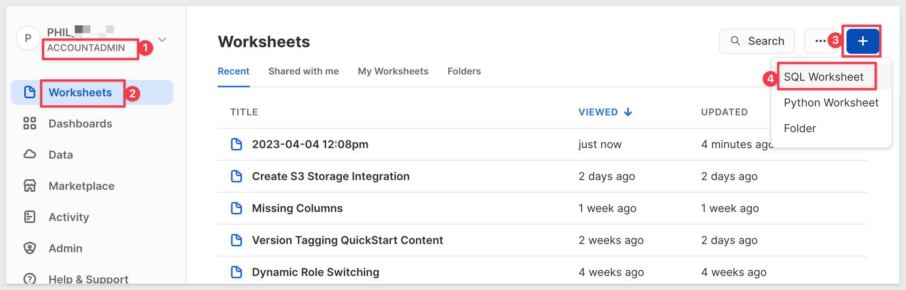

Copy and paste the following command and run it
```plaintext
select system$get_privatelink_config();
```

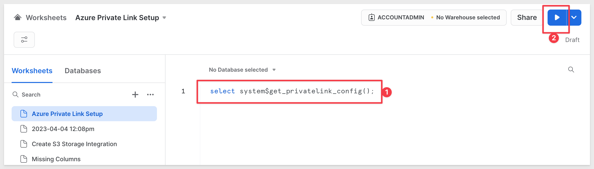

Below is the output from the SQL query. In the example above, the required output is highlighted: 

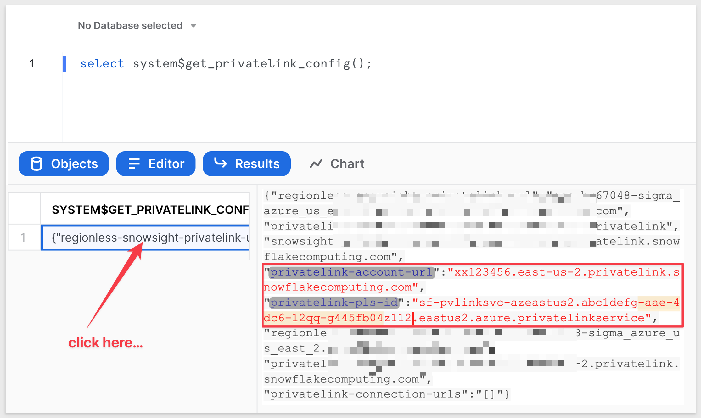

In the example above, private-pls-id is:
```plaintext
xx123456.east-us-2.privatelink.snowflakecomputing.com
```

and the privatelink_ocsp-url is:
```plaintext
sf-pvlinksvc-azeastus2.abc1defg-aae-4dc6-12qq-g445fb04z112.eastus2.azure.privatelinkservice
```

Copy the values generated for **your** Snowflake account and send these to your Sigma account manager.

Sigma will create a Private Link and alert you when the link is active.

<aside class="negative">
<strong>NOTE:</strong><br> The connection in Sigma cannot be created until you are notified by Sigma that the Private Link is ready.
</aside>

Once you receive notification from Sigma (in email) yow can create the new connection in Sigma.

<aside class="positive">
<strong>IMPORTANT:</strong><br> The notification email from Sigma may include a few extra steps depending on cloud region. Follow the instructions in the email accordingly. If you have any questions about the contents of the email, contact Sigma support. 
</aside>

### Verify the Private Link in Azure

asdasdasdasdasads


### Configure Snowflake Connection

In Sigma go to `Admin` > `Connections` > `Snowflake`.

Click Create to create a Snowflake connection:

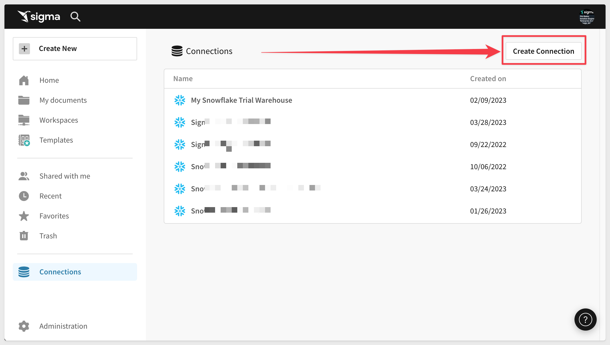

In the Account field, enter the three parts of the account URL in this format: 
```plaintext
<account>.<region_id>.privatelink
```

For example, if the account URL is (as provided by Sigma): 
```plaintext
test123.west-us-2.privatelink.snowflakecomputing.com
```

Then the Account field will be:
```plaintext
test123.west-us-2.privatelink 
```

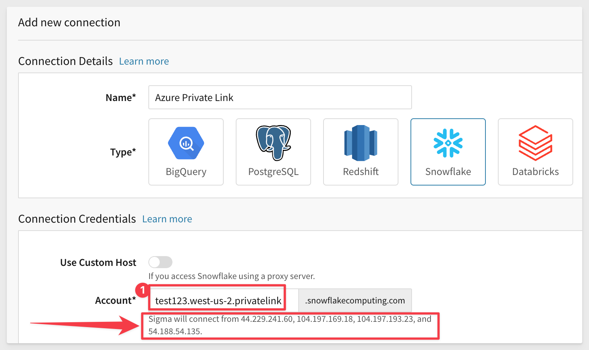

<aside class="negative">
<strong>NOTE:</strong><br> The Sigma IP addresses are shown during connection creation should your organization require them.
</aside>

[To complete the remaining configuration, follow the steps in the Snowflake Connection Guide](https://help.sigmacomputing.com/hc/en-us/articles/360037429913)

You should now be able to use the Snowflake connection (over Private Link) as you would any other connection in Sigma.


<!-- END OF SECTION-->

## **Databricks**
Duration: 20

To support Private Link for Databricks we use a Front-end Private Link, also known as user to workspace. A front-end Private Link connection allows Sigma to connect to the Azure Databricks web application over a VNet interface endpoint.

<aside class="positive">
<strong>IMPORTANT:</strong><br> Your Databricks workspace must be Premium tier.
</aside>

### Provide Databricks Resource ID to Sigma

In Azure Services, navigate to Azure Databricks:

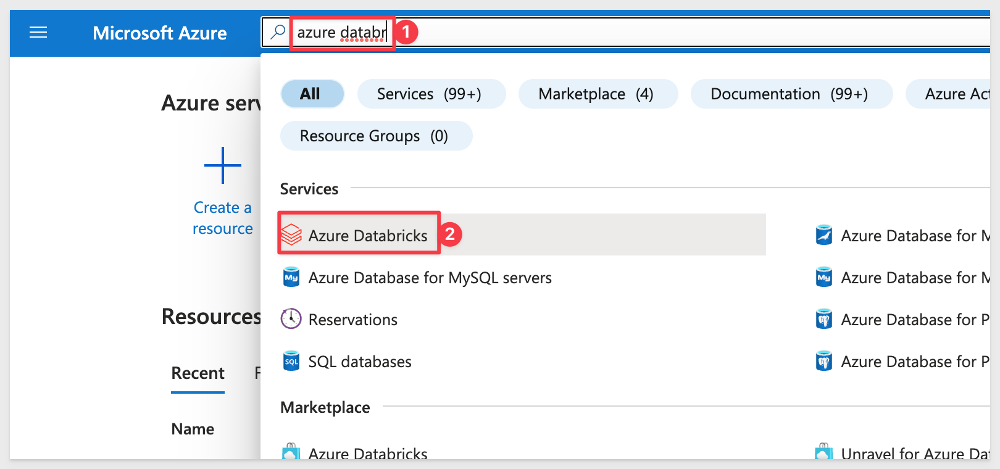

Open the Workspace you want to connect to and click to open the `JSON View`:

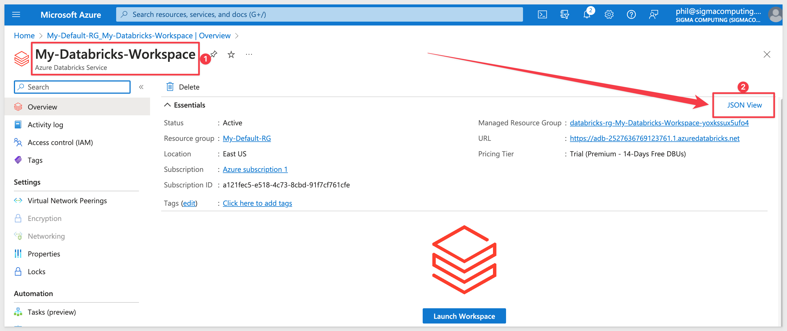

Copy the Resource ID. In Location, copy the Region Name for the Databricks warehouse: 

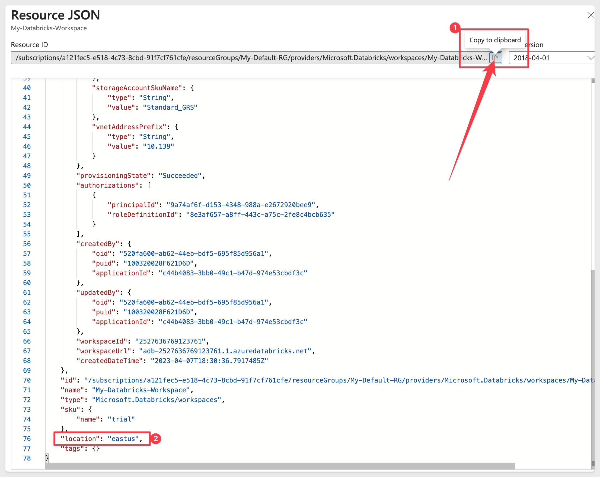

In the example above, the Resource ID is:
```plaintext
/subscriptions/a12xxxc5-xxxx-xxx-8cbd-91fxxf761cfe/resourceGroups/My-Default-RG/providers/Microsoft.Databricks/workspaces/My-Databricks-Workspace
```

and the region name is:
```plaintext
East US
```

Copy the values generated for **your** Snowflake account and send these to your Sigma account manager.

Sigma will create a Private Link and alert you when the link is active.

<aside class="negative">
<strong>NOTE:</strong><br> The connection in Sigma cannot be created until you are notified by Sigma that the Private Link is ready.
</aside>

Once you receive notification from Sigma (in email) yow can create the new connection in Databricks.

<aside class="positive">
<strong>IMPORTANT:</strong><br> The notification email from Sigma may include a few extra steps depending on cloud region. Follow the instructions in the email accordingly. If you have any questions about the contents of the email, contact Sigma support. 
</aside>

### Configure Databricks

In the Databricks section of Azure, click on the `warehouse instance` > `Databricks Workspace`.

Click `Launch Workspace`:

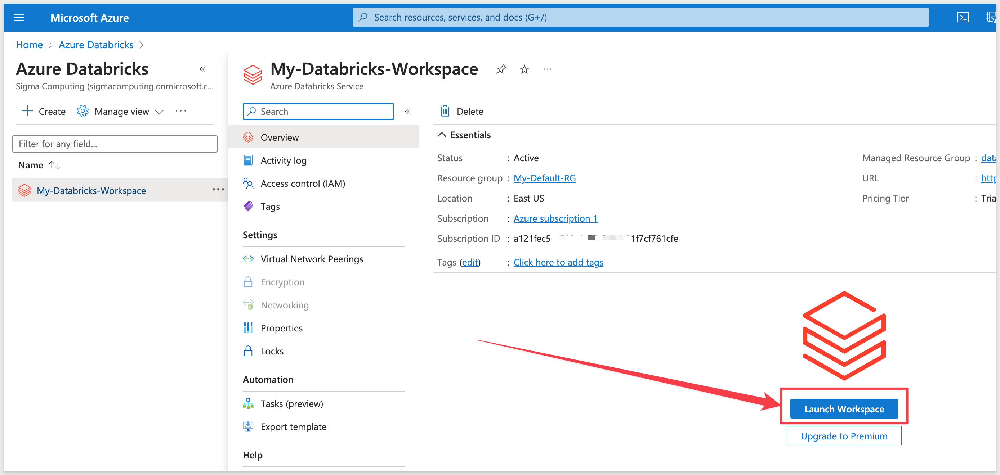

This will launch you into the Databricks console:

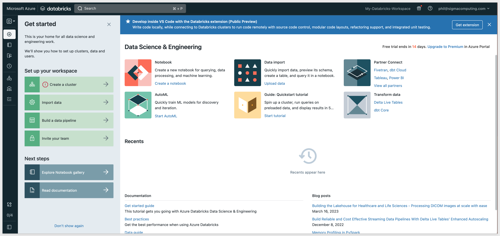

In Databricks, select the `Data Science & Engineering` dropdown and select `SQL`: 

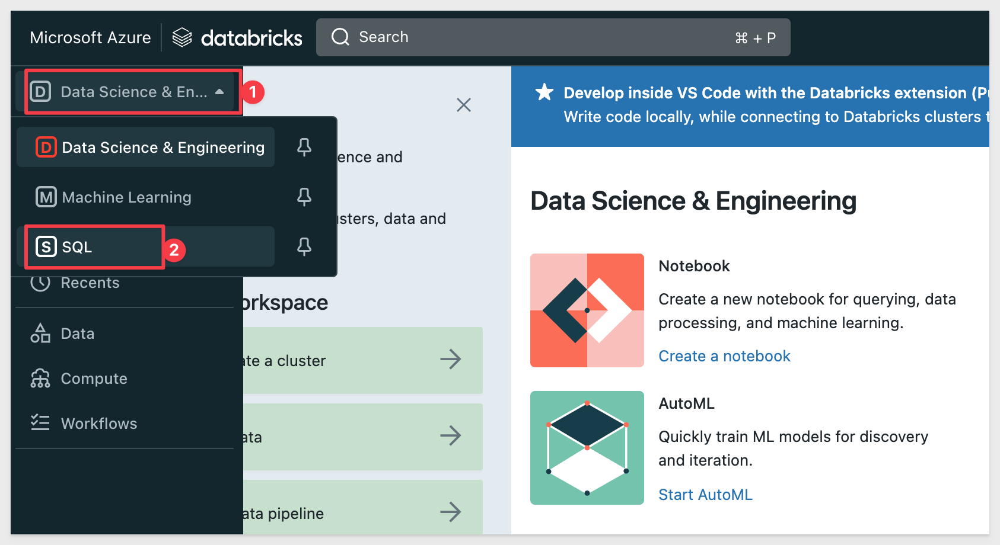

Click Review SQL Warehouses:

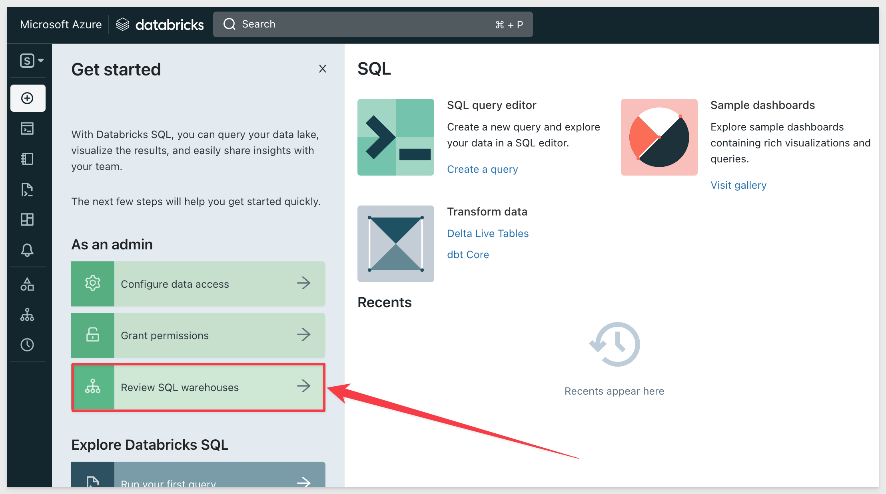

Select the `warehouse` you want to work with:

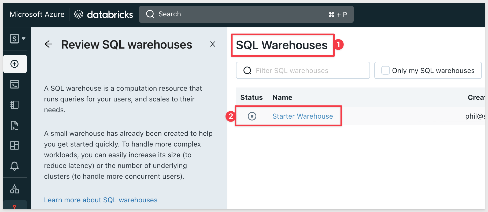

Click the `Connection details` tab. 

Copy the `Server Hostname` and `HTTP path` values in Databricks as they are required in the Sigma UI. Save them in a text file for now.

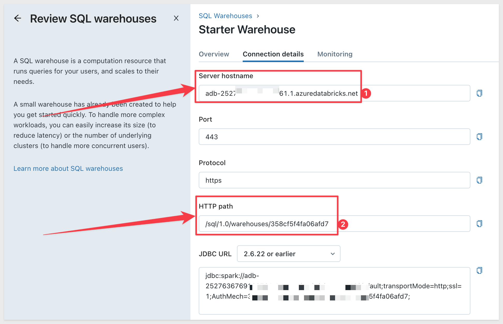

Navigate to `User Settings` in Databricks by clicking on your username:

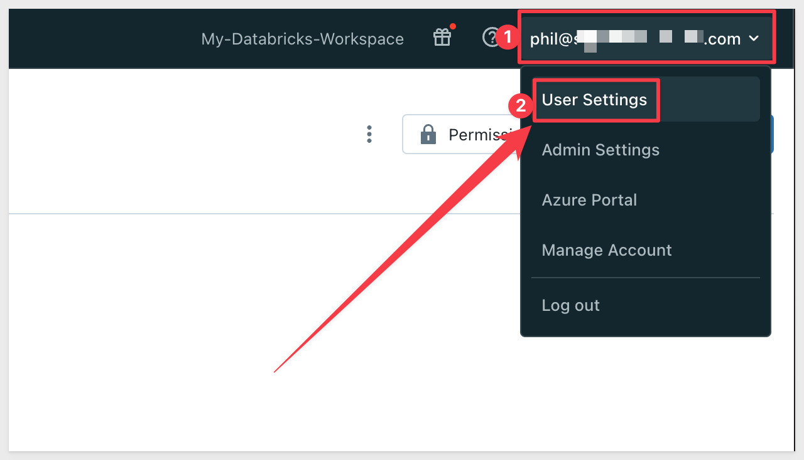

Click the Personal access tokens tab and then `Generate new token`:

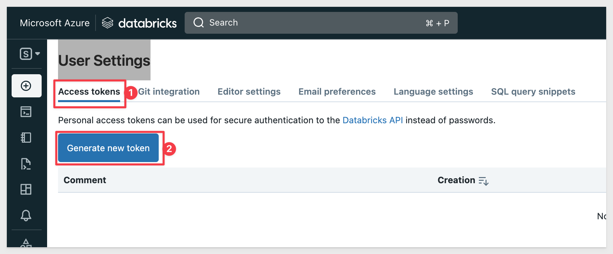

In the Lifetime field, set the token duration in days. It is a good idea to provide a comment as well. 

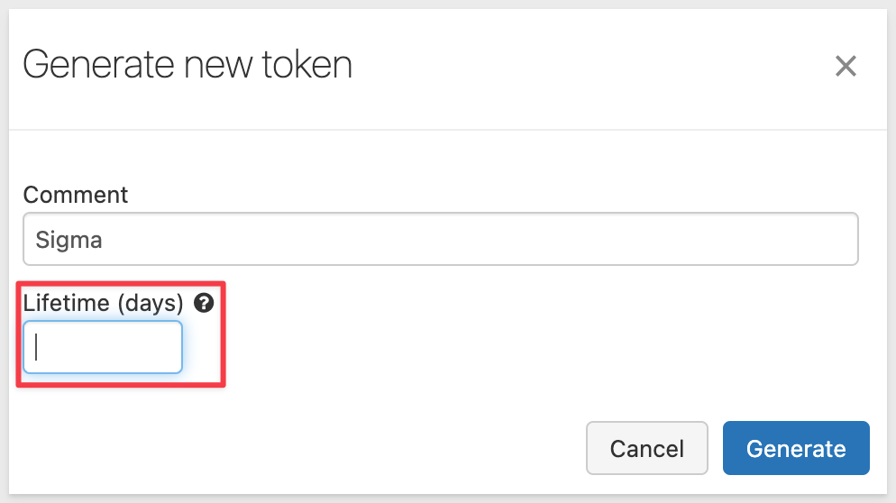

<aside class="positive">
<strong>IMPORTANT:</strong><br> If the token lifespan is unspecified, the token will live indefinitely, which is desired in this case. If a Lifetime is specified (other than blank) the Private Link will stop working when the Lifetime value is reached.
</aside>

Click `Generate`. Copy this token as it's required in the Sigma UI. Save it in a text file for now.

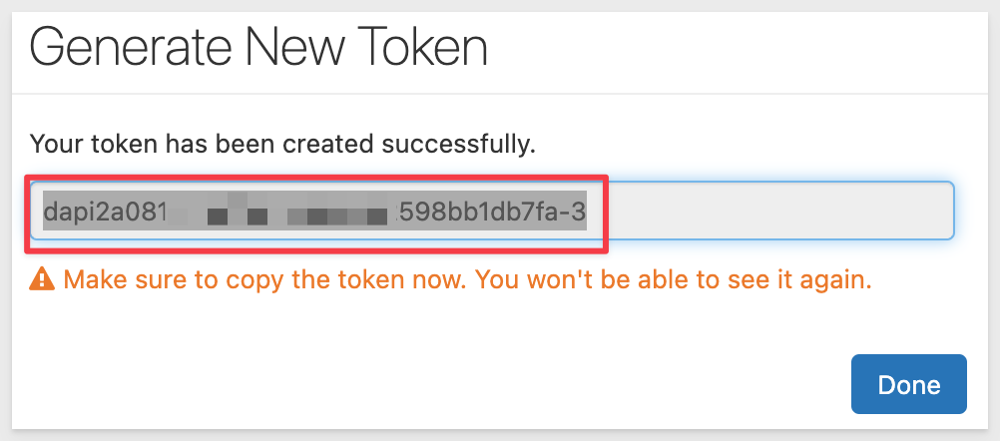

We now have a token with no expiration:

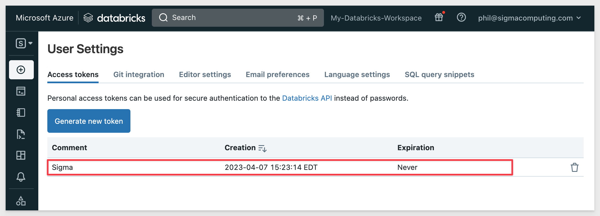

### Configure Connection in Sigma

In Sigma, go to `Administration` > `Connections` > `Databricks`:


Click Create to create a Databricks connection. 

In the `Host` field enter your domain name. 

Paste the `HTTP path` value from Azure into the `HTTP path` field in Sigma. 

Paste the `token` you created in Azure and enter into `Access token` field in Sigma. 

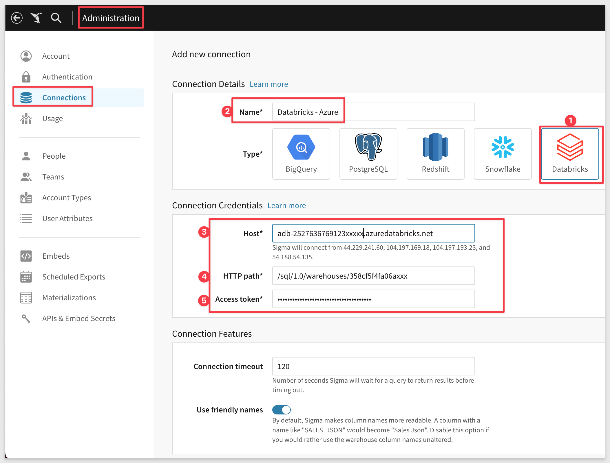

[To complete the remaining configuration, follow the steps in the Databricks Connection Guide. ](https://help.sigmacomputing.com/hc/en-us/articles/6963295723411)

You should now be able to use the Databricks connection (over Private Link) as you would any other connection in Sigma.


<!-- END OF SECTION-->

## **Postgesql**
Duration: 20

Private Link allows you to create private endpoints for Azure Database for PostgreSQL - Single server. The private endpoint exposes a private IP within a subnet that you can use to connect to your database server just like any other resource in the VNet.

<aside class="positive">
<strong>IMPORTANT:</strong><br> A Private Link connection to PostgreSQL in Azure requires the PostgreSQL server must be a single server, not a flexible server. 
</aside>

<aside class="positive">
<strong>IMPORTANT:</strong><br> The PostgreSQL instance must be General Purpose tier. 
</aside>

### Provide PostgreSQL Info to Sigma


<!-- END OF SECTION-->

## What we've covered
Duration: 5

In this lab we learned how to.........

INSERT FINAL IMAGE OF BUILD IF APPROPRIATE

<!-- THE FOLLOWING ADDITIONAL RESOURCES IS REQUIRED AS IS FOR ALL QUICKSTARTS -->
**Additional Resource Links**

[Help Center Home](https://help.sigmacomputing.com/hc/en-us)<br>
[Sigma Community](https://community.sigmacomputing.com/)<br>
[Sigma Blog](https://www.sigmacomputing.com/blog/)<br>
<br>

[](https://twitter.com/sigmacomputing)&emsp;
[](https://www.linkedin.com/company/sigmacomputing)
[](https://www.facebook.com/sigmacomputing)


<!-- END OF WHAT WE COVERED -->
<!-- END OF QUICKSTART -->