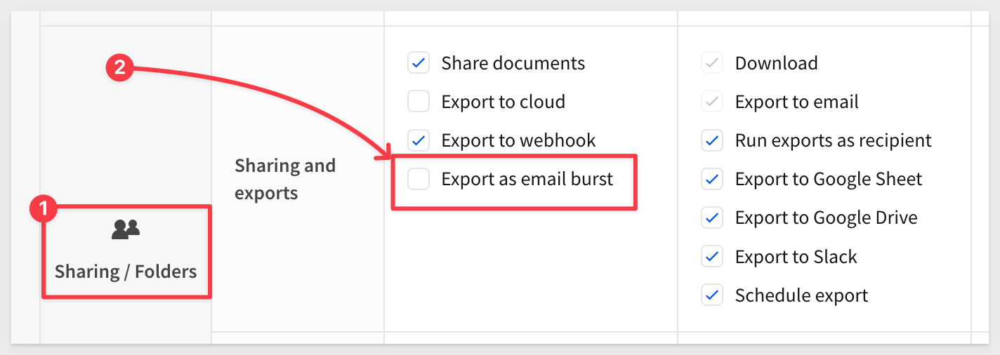
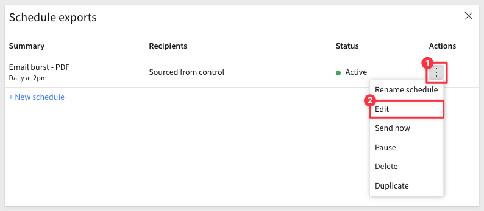

author: pballai
id: administration_export_bursting
summary: administration_export_bursting
categories: Administration
environments: web
status: Published
feedback link: https://github.com/sigmacomputing/sigmaquickstarts/issues
tags: default
lastUpdated: 2024-11-18

# Export Bursting

## Overview
Duration: 5

Export bursting ("bursting") is a powerful feature that enables automated distribution of personalized or filtered report content to a dynamic list of recipients as scheduled email bursts.

With this feature, users no longer need to create or customize reports for different audiences manually. Instead, reports are generated automatically and securely sent to the appropriate stakeholders, streamlining data delivery across teams.

This process **bursts** a single report into customized segments for each user, allowing tailored content—such as an entire workbook, specific workbook pages, or individual elements to be sent as attachments.

When coupled with [export conditions](https://help.sigmacomputing.com/docs/schedule-a-conditional-export-or-alert), customers are able to create alert functionality that unlocks a variety of valuable use cases. 

Export bursting helps organizations deliver specific insights to targeted audiences, ensuring that recipients see only the most relevant data for their role or needs.

### Benefits and Use Cases

Bursting is particularly valuable in scenarios where information needs to be disseminated quickly and efficiently, tailored for various departments or users without requiring manual intervention.

For instance, finance departments may distribute monthly reports segmented by region to regional managers, or sales teams could receive weekly performance metrics filtered by each sales representative’s territory.

This process can reduce report preparation time, increase information relevance, and promote data-driven decision-making across teams.

### Considerations for Using Export Bursting

While export bursting is highly effective, certain scenarios may benefit from alternative methods.

For example, reports containing sensitive information that require enhanced security may be better suited to more secure delivery channels, especially where regulatory compliance restricts data sharing via email.

Additionally, for frequent or high-volume email distributions, ensuring recipients receive only the most relevant information at a manageable pace can help maintain engagement. In such cases, using secure portals or leveraging Sigma’s role-based access may offer a more tailored solution.

### Target Audience

Anyone responsible for regularly distributing tailored reports to specific groups within an organization. Users who manage reporting workflows, especially those needing to deliver customized content to diverse stakeholders efficiently, will find export bursting a valuable tool for automating and streamlining report delivery.

<aside class="negative">
<strong>NOTE:</strong>  Access to this feature is controlled by the Sigma account type > export as email burst. Your Sigma administrator will need to enable your Sigma account type to enable this feature for you.
</aside>

### Prerequisites

<ul>
  <li>A computer with a current browser. It does not matter which browser you want to use.</li>
  <li>Access to your Sigma environment.</li>
  <li>Some familiarity with Sigma is assumed. Not all steps will be shown as the basics are assumed to be understood.</li>
</ul>

<aside class="postive">
<strong>IMPORTANT:</strong>  Sigma recommends that you use non-production resources when doing QuickStarts.
</aside>

<button>[Sigma Free Trial](https://www.sigmacomputing.com/free-trial/)</button>

## Requirements and Limitations
Duration: 5

### Requirements

<ul> <li><strong>Account Permissions:</strong> You must have an account type with the <em>Export as email burst</em> permission enabled.</li> <li><strong>Access Level:</strong> You need <em>Can Edit</em> or <em>Can Explore</em> access to the specific workbook being exported.</li> <li><strong>IP Allowlist or SMTP Configuration:</strong> If your organization restricts outbound email from certain IP addresses, add <code>198.37.153.185</code> to the allowlist. Alternatively, configure a custom SMTP server. (See <a href="https://help.sigmacomputing.com/docs/customize-welcome-and-invite-emails#custom-smtp-server">Custom SMTP server</a> for setup details.)</li> </ul>

### Limitations
<ul> <li><strong>Splitting Control:</strong> The control used to split recipients must be a list control with values sourced from a column. You can split by a maximum of 500 values.</li> <li><strong>Dynamic Recipients:</strong> Dynamic recipient emails must also come from a column in the same data source as the list control. The key column can be added to a source via join or lookup. You can send to a maximum of 500 dynamic recipients.</li> <li><strong>File Type:</strong> PDF, PNG, Excel, JSON and CSV files can be sent as attachments.</li> <li><strong>Size Limit:</strong> The total attachment size per email burst is limited to 30MB. If the total size of multiple attachments is more than 30 MB an attempt is made to split these attachments in several emails where possible. If this limit is exceeded, the entire export fails, and the owner of the scheduled export receives a notification. Repeatedly oversized exports are automatically paused, and the owner is notified. (Refer to <a href="LINK_TO_DOWNLOAD_LIMITATIONS">Download, export, and upload limitations</a> for more details.)</li><li><strong>Run queries as recipient:</strong> The “Run as recipient” feature is not currently supported for bursting.</li> </ul>

### Restricting export recipients
Sigma Admins can control which domains can receive emails, Google Sheets, and Google Drive exports from Sigma. **If no domains specified as authorized, users can export reports to any email address.**

<aside class="negative">
<strong>NOTE:</strong>  During scheduled exports or direct downloads, Sigma may store control values as URL parameters in trace logs for debugging. Exercise caution when exporting workbook content with filters for sensitive data. Restrict who has access to Sigma log data as best practice.
</aside>

For more information see [Restricting export recipients.](https://help.sigmacomputing.com/docs/restrict-export-recipients#restrict-domains)

<!-- END OF SECTION-->

## About Scheduling in Sigma
Sigma offers robust support for scheduled email delivery, enabling users to automate the distribution of workbooks, pages, or individual elements to designated recipients. This functionality ensures that stakeholders receive timely, relevant information without manual intervention.

### Key Features:
<ul> <li><strong>Flexible Scheduling:</strong> Users can set up exports to run on daily, weekly, monthly, or custom schedules using cron syntax, accommodating various reporting needs. <a href="https://help.sigmacomputing.com/docs/export-to-email">Export to Email</a></li> <li><strong>Conditional Exports:</strong> Sigma allows the configuration of conditions that determine when an export is sent. For instance, reports can be scheduled to send only if specific data thresholds are met, ensuring recipients receive pertinent updates. <a href="https://help.sigmacomputing.com/docs/schedule-a-conditional-export-or-alert">Schedule a Conditional Export or Alert</a></li> <li><strong>Personalized Content:</strong> By utilizing the "Run queries as recipient" option, exports can be tailored to each recipient's data access permissions, delivering customized insights. <a href="https://help.sigmacomputing.com/docs/export-to-email">Export to Email</a></li> <li><strong>Multiple Formats:</strong> Exports can be sent in various formats, including PDF, Excel, CSV, JSON and PNG, catering to different preferences and requirements. <a href="https://help.sigmacomputing.com/docs/export-to-email">Export to Email</a></li> <li><strong>Comprehensive Management:</strong> Users can view and manage their scheduled exports directly from their profile, with options to pause, edit, or delete schedules as needed. Administrators have the ability to oversee all scheduled exports across the organization, ensuring efficient management. <a href="https://help.sigmacomputing.com/docs/manage-scheduled-exports">Manage Scheduled Exports</a></li> </ul>

### Considerations:
<ul> <li><strong>Permissions:</strong> To schedule email exports, users must have the appropriate permissions assigned to their account type, such as the "Export to email" and "Schedule export" permissions. <a href="https://help.sigmacomputing.com/docs/export-to-email">Export to Email</a></li> <li><strong>Export Limits:</strong>  The total attachment size per email burst is limited to 30MB. If the total size of multiple attachments is more than 30 MB an attempt is made to split these attachments in several emails where possible. If this limit is exceeded, the entire export fails, and the owner of the scheduled export receives a notification. Repeatedly oversized exports are automatically paused, and the owner is notified. (Refer to <a href="LINK_TO_DOWNLOAD_LIMITATIONS">Download, export, and upload limitations</a> for more details.)</a></li> </ul>

By leveraging these features, Sigma users can automate the dissemination of critical information, ensuring that stakeholders receive accurate and timely data tailored to their needs.

Duration: 5

<!-- END OF SECTION-->

## Enable Bursting for an Account Type
Duration: 5

With the background out of the way, we can proceed to demonstrate (on a very small scale) bursting in Sigma.

Log into Sigma as an administrator and navigate to `Administration` > `Account Types`. 

While we might consider creating a new account type that mimics an existing one but includes bursting, we’ll simply enable it for an existing type to keep things straightforward.

For more information on account types see [License and account type overview.](https://help.sigmacomputing.com/docs/license-and-account-type-overview)

Lets enable our `Pro` users to use bursting.

Click to select the `Pro` account type and then click the `Edit` button:

Scroll down to the `Sharing / Folders` section and check on the box for `Export as email burst`:

Click `Save` at the top right corner of the page.

The permission is added to the `Pro` list:

<!-- END OF SECTION-->

## Create Something to Burst
Duration: 5

Lets create a workbook to use for our bursting test. 

Click the  icon to return to the homepage and then click `Templates` > `Plugs Electronics Profit Planning Tool`:

`Dismiss` the `Use your data` popup and click `Save as`. 

Name the workbook `Plugs Profit Planning Tool` and click `Save`. 

<!-- END OF SECTION-->

## Key Bursting Properties
Duration: 5

Lets take a quick look at the important properties of bursting before we go to far.

Open the workbook menu and select `Schedule exports`:

Click `Add schedule`.

In the `Schedule exports` modal we see many options. 

To use bursting, we need to first click the icon shown as number 1, in the `Export as email burst` row.

### Split by
Lets focus on item `2`, `Split by` for a moment. 

`Split by` allows us to restrict the data emailed to each user based on a page control value. 

<aside class="positive">
<strong>IMPORTANT:</strong>  The selection of a column from a control also exposes the other columns of the control's source data. For this to work, email address needs to exist in the source data or be joined (join or lookup) to it.
</aside>

### Dynamic recipients
Dynamic recipients each receive an email with data filtered based on the `Split by` control value setting, sent to the corresponding email address.

### Standard recipients
Email addresses specified here receive all attachments, and no segmentation of data based on the `Split by` control value. 

The remainder of the export properties are the same. 

For more information, see [Export to email](https://help.sigmacomputing.com/docs/export-to-email) 

<!-- END OF SECTION-->

## Sample Use Case
Duration: 5

Let’s assume we have two users: one who manages the `East region` and another who manages the `West`.

The `Plugs Profit Planning Tool` workbook includes a control labeled `Region`, which allows the workbook to be filtered by the selected region's data.

We will leverage this control to generate and distribute customized reports tailored to each stakeholder's specific data view and permissions.

To achieve this, we need a way to associate recipient email addresses with their respective regions. However, Sigma’s sample data does not include email addresses, which is often the case with existing datasets. For this demonstration, we will adjust our approach to handle the absence of email addresses. If email addresses were already present in the source data, we could have simply used them directly

<!-- END OF SECTION-->

## Email Lookup Table2
Duration: 5

Your organization may already have a table that can be used but in our case, we will use a Sigma [Input table](https://help.sigmacomputing.com/docs/intro-to-input-tables) to quickly add the required region-to-email assignments.

With the workbook in edit mode, select the `Data` page and add a `Empty` input table:

Select the `Sigma Sample Database` as the source and click `Create`.

Configure the input table as shown, replacing the email addresses with your own valid test addresses. 

In order to associate the email address in our new input table, we will add a [Lookup]() from the `T Transaction Details - Base` table on the `Data` page to our new input table.

Select the `T Transaction Details - Base` table and in the element panel, click the `+` > `Add column via` and `Lookup...`:

Configure as shown:

We can see the new column added, with the rows for `Store Region` aligning to the `Email Address` (showing west as example):

Perform the same steps on the `T Transaction Details - KPIs` table on the `Data` page so that both tables have the email address reference column. This ensures that all the elements on the `Profit Planning Tool` page have access to these two email addresses. 

<!-- END OF SECTION-->

## Create a bursting schedule
Duration: 5

We are ready to schedule a bursting schedual to our two email addresses. 

Open the workbooks menu and click `Schedule exports...`:

Configure the export job for bursting, `Split by` `F_Region` and set the `Dynamic recipients` to our new email column that was added via lookup earlier. We can leave all other default settings.

Click `Create`:

The schedule is created and the list of schedule jobs is shown. For my example, there is only one.

Open the actions menu and select `Send now` to test the job. 

<aside class="negative">
<strong>NOTE:</strong>  Avoid using the "Send now" option if you have configured a large number of dynamic recipients. A good practice is to first configure a single address using the "Standard recipients" option. Once you’ve validated that the email content meets your expectations, you can proceed to add the dynamic recipients.
</aside>

The result is two emails sent, one to the `east` address and one to the `west`:

The attached PDFs show only the expected data, with the `Region` control showing the filter that has been applied to the data prior to sending. 

Very nice!

<!-- END OF SECTION-->

## Conditional Exports (Alerts)
Duration: 5

If all we wanted to do was email reports based on a dynamic filter, our work would be complete.

However, a less obvious but highly effective approach is to send workbook content when your data indicates that something important has happened. This ensures employees are promptly made aware of critical events and can take immediate action, rather than discovering the issue later, which might not be ideal.

Sigma supports this via [Conditional Alerts.](https://help.sigmacomputing.com/docs/schedule-a-conditional-export-or-alert)

We could edit the scheduled export directly from the workbook, but lets do it in a different workflow.

Reopen the `Scheduled exports` modal, open the menu and click `Edit`:

Enable `Conditions` and configure as shown:

Click `Test condition`. This will evaluate if there is `Data that meets condition exists.`. 

Once satisfied, we can `Save` and the `Send now`, as we have previously done. 

Now the same reports will be delivered whenever the condition is met. 

<aside class="negative">
<strong>NOTE:</strong>  This simplified example highlights how export conditions can be leveraged to create powerful and highly effective alerts.
</aside>

<!-- END OF SECTION-->

## What we've covered

Duration: 5

In this QuickStart, we explored how to use export bursting through a simple use case. We also discussed its features, benefits, and limitations as they stand at the time of this QuickStart.

Please refer to [https://help.sigmacomputing.com/docs/export-as-email-burst.](https://help.sigmacomputing.com/docs/export-as-email-burst)

**Additional Resource Links**

[Blog](https://www.sigmacomputing.com/blog/) 
[Community](https://community.sigmacomputing.com/) 
[Help Center](https://help.sigmacomputing.com/hc/en-us) 
[QuickStarts](https://quickstarts.sigmacomputing.com/) 

Be sure to check out all the latest developments at [Sigma's First Friday Feature page!](https://quickstarts.sigmacomputing.com/firstfridayfeatures/)
 

&emsp;
&emsp;

<!-- END OF WHAT WE COVERED -->
<!-- END OF QUICKSTART -->
