author: pballai
id: administration_getting_started_guide
summary: administration_getting_started_guide
categories: administration
environments: web
status: Hidden
feedback link: https://github.com/sigmacomputing/sigmaquickstarts/issues
tags:
lastUpdated: 2026-08-06

# How to Get Started - A Guide for Sigma Administrators

## Overview
Duration: 5

This QuickStart walks new Sigma administrators through the core setup tasks needed to stand up and manage a Sigma environment.

Along the way you'll learn how to:
- Align stakeholders on your initial use case before you start building
- Set up authentication, account types, teams, workspaces, licensing, and support/security portal access
- Plan your cloud warehouse connection strategy, data security, and write-back access
- Configure AI features and set your organization's AI strategy
- Apply your organization's branding to Sigma
- Establish a versioning and promotion process (WDLC)
- Build an onboarding training plan and foster a user community
- Set up auditing and cost monitoring

<aside class="positive">
<strong>NOTE:</strong>  This guide is organized as a checklist of decisions, not a strict sequence. Skip any section that doesn't apply to your organization and return to the rest as your rollout progresses.
</aside>

<aside class="positive">
<strong>IMPORTANT:</strong>  Some screens in Sigma may appear slightly different from those shown in QuickStarts. This is because Sigma continuously adds and enhances functionality. Rest assured, Sigma's intuitive interface ensures that any differences will not prevent you from successfully completing any QuickStart.
</aside>

For more information on Sigma's product release strategy, see [Sigma product releases](https://help.sigmacomputing.com/docs/sigma-product-releases)

If something doesn't work as expected, here's how to [contact Sigma support](https://help.sigmacomputing.com/docs/sigma-support)

### Target Audience
Sigma administrators, along with the broader project team and Sigma Customer Success Manager (CSM), who are planning and implementing a new Sigma environment.

### Prerequisites

<ul>
  <li>Any modern browser is acceptable.</li>
  <li>Access to your Sigma environment.</li>
  <li>Some familiarity with Sigma is assumed. Not all steps will be shown, as the basics are assumed to be understood.</li>
 </ul>

<aside class="positive">
<strong>IMPORTANT:</strong>  Sigma recommends using non-production resources when completing QuickStarts.
</aside>

<button>[Sigma Free Trial](https://www.sigmacomputing.com/free-trial/)</button>

<aside class="negative">
<strong>IMPORTANT:</strong>  Some features may carry a "Beta" tag. Beta features are subject to quick, iterative changes. As a result, the latest product version may differ from the contents of this document.
</aside>

## Use Case Plan
Duration: 10

Before you touch a single setting in Sigma, align your stakeholders on what you're actually building. Every decision in the rest of this guide — security, connections, branding — is easier to make with a real use case in mind instead of a hypothetical one.

Bring together your project sponsor, IT or security contact, and the first group of business users, and agree on:
- Who the first use case is for — a single team, a department, or an external-facing audience
- What decision or workflow the first workbook or app needs to support
- Which data sources it depends on, and who owns access to them
- What "done" looks like, and by when

<aside class="positive">
<strong>WHY IT MATTERS:</strong>  A scoped use case turns the rest of this guide from a list of abstract settings into a checklist you can actually finish. Sigma recommends targeting a first go-live within 30 days of kickoff — pick a use case small enough to hit that window, then reuse what worked as the template for your next one.
</aside>

Document the answers somewhere your stakeholders can revisit — a shared doc or our prepared [Summary Checklist](https://quickstarts.sigmacomputing.com/guide/administration_getting_started_guide/index#9) works well for this. You'll refer back to it throughout the rest of this guide.

<button>[Download this checklist (PDF)](https://sigma-quickstarts-main.s3.us-west-1.amazonaws.com/PDFs/Summary_Checklist.pdf)</button>

If your first use case is an AI-powered app, see [AI Apps Fundamentals](https://quickstarts.sigmacomputing.com/guide/dataaps_fundamentals/index.html) for a walkthrough of what you can build.

For a general first workbook, [Fundamentals 01: Overview](https://quickstarts.sigmacomputing.com/guide/fundamentals_1_getting_around_v3/index.html) covers Sigma's core building blocks.

<!-- END OF SECTION-->

## Security
Duration: 20

Security in Sigma isn't a single switch — it's a set of interlocking decisions: how users sign in, what they're allowed to do once they're in, how they're grouped, and who can request more access. Sigma centralizes all of these controls, so your security model scales with your organization instead of becoming a growing list of one-off exceptions.

### Authentication

Decide how users will sign in and receive a license before you invite anyone. Sigma supports several authentication methods:
- Username/password (the default — least secure, avoid for production)
- SSO / SAML
- SAML + SCIM (adds automated user provisioning and deprovisioning)
- OAuth
- Manual invite
- Just-in-time (JIT) provisioning

Loop in your IT or identity team early — most organizations land on SSO/SAML or SAML+SCIM so that user lifecycle (adds, removes, role changes) stays in sync with your identity provider instead of being managed by hand in Sigma.

For example, Sigma makes it easy to configure the required values for SAML:

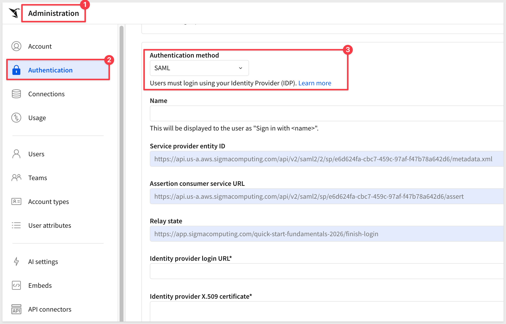

For setup steps, see [Manage authentication](https://help.sigmacomputing.com/docs/manage-authentication)

Check out the many [Quickstarts in the security category](https://quickstarts.sigmacomputing.com/?cat=security)

### Account Types
Sigma controls what a user can *do* (ie: Role-based access control) through account types.

**Account types** are named permission groupings — they control feature-level capabilities like exploring, exporting, or editing input tables across every workbook a user touches:

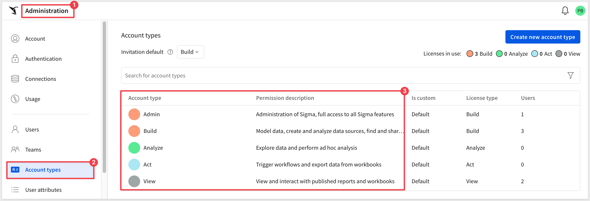

Permissions are additive, so turning on a feature like export access also grants the related capabilities that depend on it.

For example, the default `View` account type provides:

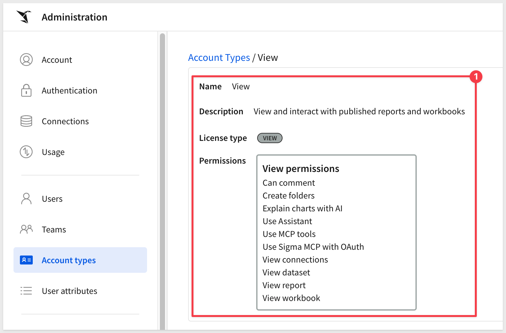

Start from Sigma's default account types, and create custom account types only when two groups of users genuinely need different feature sets — for example, we can disable `View` users from using Sigma Assistant:

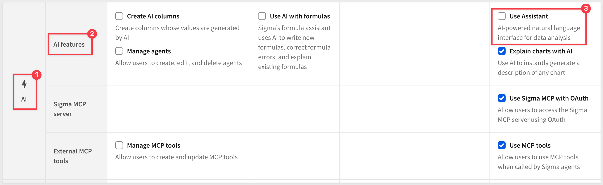

### Teams

**Teams** group users for licensing and content-sharing purposes. Align your Team structure with your planned Workspace structure (below) so permissions stay predictable as you scale:

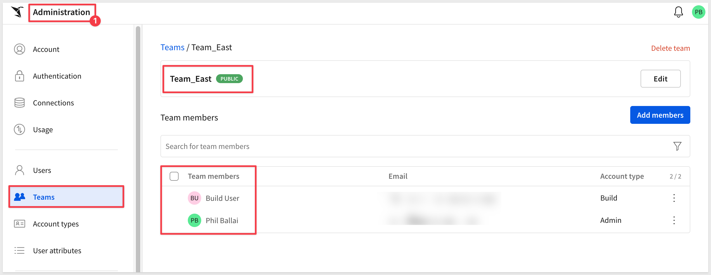

<aside class="positive">
<strong>WHY IT MATTERS:</strong>  Getting account types and Teams right up front means you're granting the minimum access each user actually needs, rather than over-provisioning and cleaning it up later. It also gives you a fast way to test access — admins can impersonate another user to confirm what they see, and non-admins can use "Preview drafted changes" to check their own view before you roll out broadly.
</aside>

For setup steps, see [Manage teams](https://help.sigmacomputing.com/docs/manage-teams)

### Workspaces

Workspaces are where your folder hierarchy and content permissions live. Structure your workspace folders to mirror your Teams, and apply workspace-level permissions so each Team only sees the folders relevant to them.

Users also have access to `Your Workspace` so they can quickly see ones they are assigned to:

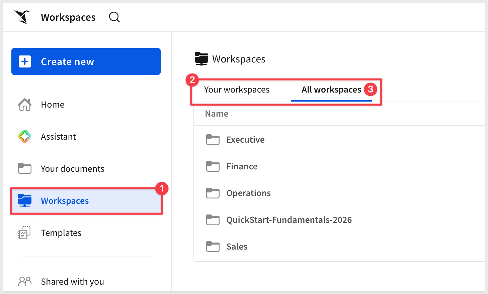

For setup steps, see [Manage workspaces](https://help.sigmacomputing.com/docs/manage-workspaces)

### Licensing and Upgrade Requests

Plan how a user asks for a higher license tier once they need more capability than their current account type allows. Common approaches:
- Sigma's native upgrade request option, built into the product
- An internal request platform or ticketing system your organization already uses
- Simple email requests routed to your Sigma admins

Pick whichever fits your existing IT request process — the goal is that users have one clear path to ask, and admins have one clear place to approve.

It is easy for admins to see and act on new requests:

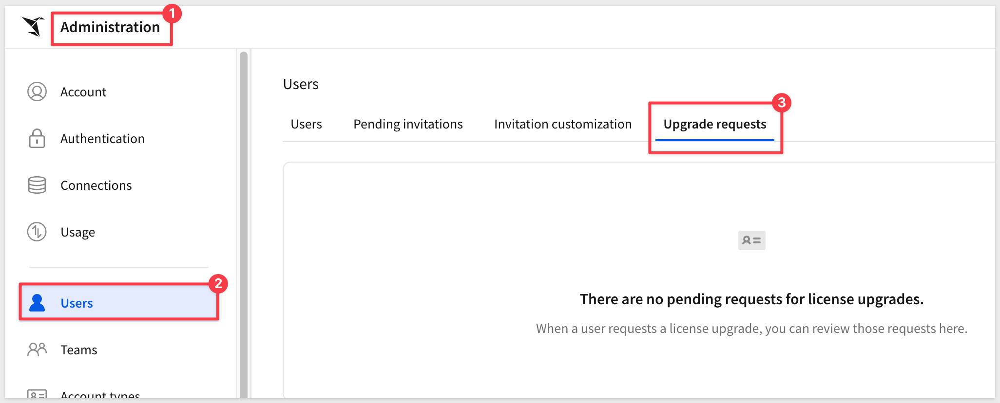

For more information, see [Account type and license overview](https://help.sigmacomputing.com/docs/account-type-and-license-overview)

To manage account upgrade requests settings, see [Enable or disable account upgrade requests](https://help.sigmacomputing.com/docs/license-upgrade-requests)

### Support and Security Portal Access

Contact your Customer Success Manager (CSM) to get your organization set up with:
- **[Sigma's Security Portal](https://security.sigmacomputing.com/)** — self-serve access to security and compliance documentation (SOC 2 reports, and similar).
- **[Sigma's Support Portal](https://support.sigmacomputing.com/hc/en-us)** — where your team can log and track support tickets.

Grant access to your admins, plus your security team if they need direct access to compliance documentation.

<!-- END OF SECTION-->

## Cloud Warehouse Connection Strategy
Duration: 15

A connection is how Sigma authenticates to your cloud data warehouse (Snowflake, Databricks, BigQuery, and others) so it can query your data live, without copying or storing it in Sigma. Every workbook, data model, and input table depends on one, so how you set connections up shapes how the rest of your organization accesses data.

### Connection Strategy

Decide how many connections to expose, and to whom. Common patterns are:
- A single shared connection for simplicity
- Multiple connections split by environment, team, or region
- Dynamic connection switching by role, so different users hit different warehouses or databases from the same workbook
- [PrivateLink](https://help.sigmacomputing.com/docs/aws-privatelink-connections#connecting-to-your-data-with-privatelink), if your network security requirements call for it
- Customized query timeouts per connection

Keep a separate connection for test/QA versus production, so you can validate changes without risking live data. Build your data models on top of these connections first — that gives you one place to centralize logic and control feature access, rather than repeating it across every workbook.

If your use case calls for it, Snowflake and Databricks connections also support Python queries through Sigma's [Python element](https://help.sigmacomputing.com/docs/write-and-run-python-code), letting builders run Python code directly against your warehouse from within a workbook. Each connection type needs its own setup for this, so decide early whether to enable it.

For setup steps, see [Connect to data sources](https://help.sigmacomputing.com/docs/connect-to-data-sources), [Set up a Snowflake connection for Python](https://help.sigmacomputing.com/docs/set-up-a-snowflake-connection-for-python), and [Set up a Databricks connection for Python](https://help.sigmacomputing.com/docs/set-up-a-databricks-connection-for-python)

### Data Security

Choose how Sigma authenticates to your warehouse, since it determines where access control is enforced:
- **Service account / password** — one shared credential handles every query; access is enforced at the Sigma level, so you'll need row-level security (RLS) or column-level security (CLS) to filter data per user.
- **OAuth** — each query runs under the querying user's own warehouse credentials; access is enforced by the warehouse itself, at the cost of managing roles there instead of in Sigma.

Within Sigma, RLS and CLS give you finer control on top of either approach:
- **Row-level security** filters rows automatically based on a Sigma user attribute matched against a column value — for example, restricting each rep to their own region. The filter reapplies every time the workbook loads.
- **Column-level security** removes restricted columns entirely at the data model level, rather than just hiding them in the workbook.

<aside class="positive">
<strong>WHY IT MATTERS:</strong>  Apply RLS and CLS at the data model level, not the workbook level. A workbook-level filter can be disabled by anyone with edit access, which quietly defeats the security you just set up.
</aside>

While you're building, test as yourself to confirm you aren't blocked by your own rules, then have another admin verify cross-team visibility before you roll out broadly.

For QuickStarts, see [Implementing Row-Level Security (RLS)](https://quickstarts.sigmacomputing.com/guide/security_row_level_security/index.html) and [Implementing Column Level Security (CLS)](https://quickstarts.sigmacomputing.com/guide/security_column_level_security/index.html)

For the very latest information, see [Set up row-level security](https://help.sigmacomputing.com/docs/set-up-row-level-security) and [Configure column-level security
](https://help.sigmacomputing.com/docs/column-level-security)

### Write-back Access

If your use case needs users to write data back into the warehouse — through input tables or forms — decide on your write-back schema strategy: one shared schema, or several split by team or purpose. If you're using OAuth, confirm the schema is reachable under each user's own warehouse role.

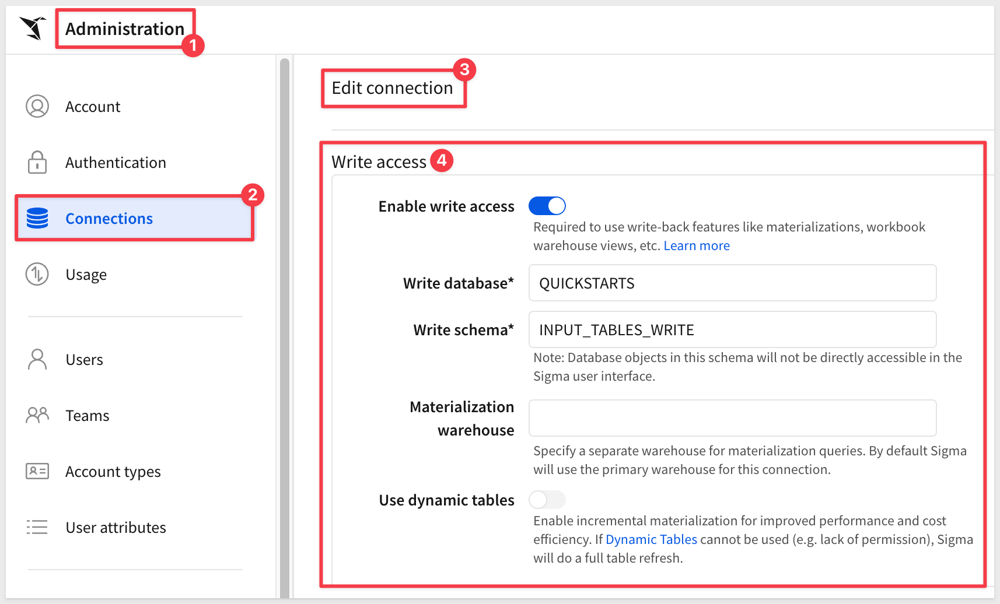

Write access requires two permissions to line up:
- **Connection level** — the write-back schema itself must be accessible (an admin-configured setting on the connection)
- **Account type level** — the user needs the "Edit input tables" feature permission

Where you want more control than a spreadsheet-style input table offers, use a form instead — forms validate entries, and you can scope which fields a given user sees with page-level visibility rules.

For setup steps, see [Set up write access](https://help.sigmacomputing.com/docs/set-up-write-access)

<!-- END OF SECTION-->

## AI Features and Strategy
Duration: 10

AI in Sigma isn't a separate, bolted-on tool — it's built into the same governed environment your team already works in, so turning it on doesn't mean opening an ungoverned side door to your data. Before any AI feature works, an administrator has to configure a provider from `Administration` > `AI settings`.

This page is organized into three tabs — General AI, Assistant, and AI columns — each controlling a different layer of your AI strategy.

### Configure an AI Provider

On the General AI tab, choose your provider hosting:
- **Data warehouse hosted model** — AI runs entirely inside your data platform (for example, Snowflake Cortex), tied to a specific connection
- **External AI provider** — OpenAI, Azure OpenAI, Google Gemini, Amazon Bedrock, and others

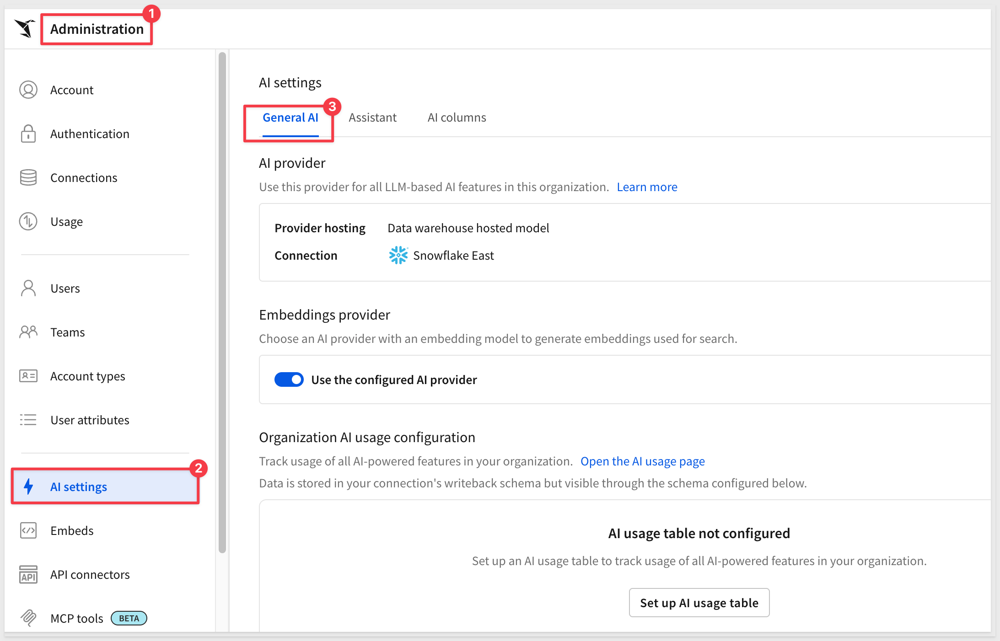

You can also choose a separate embeddings provider for search, or just reuse the AI provider you already configured.

For setup steps, see [Configure an AI provider](https://help.sigmacomputing.com/docs/configure-ai-features-for-your-organization#set-up-an-ai-provider)

### Choose Which Agents Users Can Access

On the Assistant tab, decide which agents show up in Sigma Assistant:
- **Sigma Assistant** — the standard conversational agent, accessed from the homepage
- **Warehouse agents** — agents that run natively in your warehouse (for example, a Snowflake Cortex agent), accessed from both the homepage and Sigma Agents

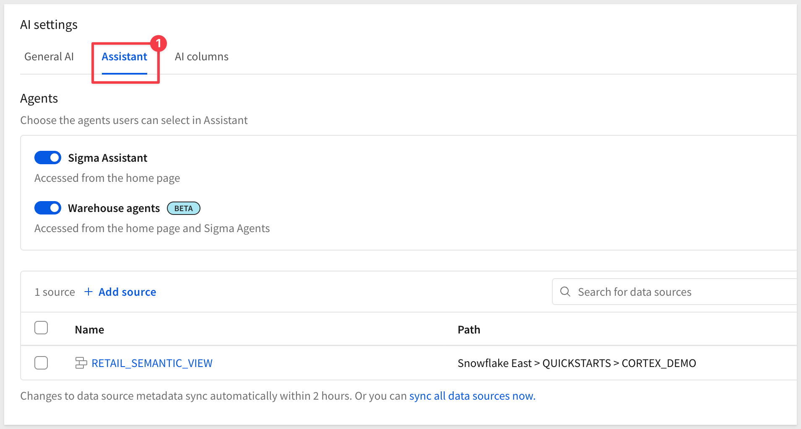

This is also where you choose which data sources Assistant can query.

<aside class="positive">
<strong>WHY IT MATTERS:</strong>  Scoping Assistant to specific, approved data sources is a governance control, not just a convenience setting. It restricts exactly what the AI can see, so your existing permissions and governance rules stay intact, and users can't inadvertently surface data through Assistant that they were never meant to access directly.
</aside>

For the full feature spectrum beyond Assistant — Formula Assistant, Building with Assistant, and Sigma agents and chat elements — see [Fundamentals 01: Overview](https://quickstarts.sigmacomputing.com/guide/fundamentals_1_getting_around_v3/index.html) and [AI Apps Fundamentals](https://quickstarts.sigmacomputing.com/guide/dataaps_fundamentals/index.html)

### Sigma MCP Server

Sigma's Model Context Protocol (MCP) support works in both directions. First, external AI tools — Claude, ChatGPT, Codex, Cortex Code, Cursor — can connect to Sigma as an MCP server, letting a user query Sigma from wherever they're already working instead of switching into the product. It supports searching for data sources, exploring their structure, and querying data without writing SQL.

Enabling it doesn't create a new permissions model to manage — it reuses your existing account types and access. Each user still needs the same view/use access they'd need in the Sigma UI (`Can view` on the documents they query, `Can use` on the connections behind them), plus a `Use Sigma MCP with OAuth` permission on their account type. If your organization uses IP allowlisting, add `API` to the allowed scope.

Users connect from `Profile` > `Integrations`, where they'll find their Sigma MCP URL to paste into their AI tool of choice.

<aside class="positive">
<strong>WHY IT MATTERS:</strong>  Because MCP inherits your existing Sigma permissions, opening this door doesn't create a new governance surface to manage — the same access rules you've already set for connections, data models, and workbooks apply here too. MCP queries are also tagged distinctly, so you can track their cost alongside everything else in your AI usage table.
</aside>

For setup steps, see [Use Sigma MCP Server](https://help.sigmacomputing.com/docs/use-sigma-mcp-server)

### MCP Tools for Sigma Agents

The other direction runs from `Administration` > `MCP tools`, where you connect external MCP-compliant tools and services — a ticketing system, a CRM, a custom internal API — for Sigma agents to call as part of their own reasoning, instead of Sigma building a custom connector for each one:

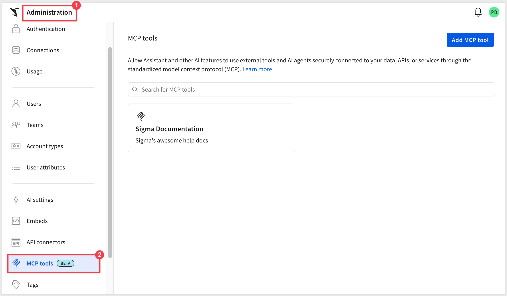

<aside class="positive">
<strong>WHY IT MATTERS:</strong>  Open MCP support lets Sigma agents reach into the systems your team already uses without custom connector code, and keeps Sigma compatible with the broader agent ecosystem — Snowflake Cortex, Databricks Genie, or any other MCP-compatible tool — rather than locking you into a single AI stack.
</aside>

For setup steps, see [Configure MCP tools](https://help.sigmacomputing.com/docs/configure-mcp-tools)

### Agent Skill Configuration

Sigma also publishes open-source agent skills — reference files that give AI coding assistants (Claude Code, OpenAI Codex, Snowflake Cortex Code, Cursor) direct knowledge of Sigma's REST API and data modeling workflows. With a skill installed, a developer can ask their coding assistant to authenticate, list workbooks, or build a data model in natural language, instead of writing the API calls by hand.

This is typically a builder's activity rather than an end-user AI feature, but it's worth planning for as an admin: it requires a Sigma API client ID and secret, plus Can Edit or Admin permission on the resources being touched — the same API connectors you set up earlier in this section.

<aside class="positive">
<strong>WHY IT MATTERS:</strong>  Agent skills don't bypass your permission model — they run through the same API credentials and access levels you already govern. It's a lightweight way to extend AI into how your organization builds against Sigma, not just how it analyzes data.
</aside>

For a hands-on walkthrough, see [Sigma Skills for AI Assistants](https://quickstarts.sigmacomputing.com/guide/developers_sigma_skill/index.html)

### Set Cost Controls

The AI columns tab is where you set monthly token limits per connection, shared across everyone in your organization:

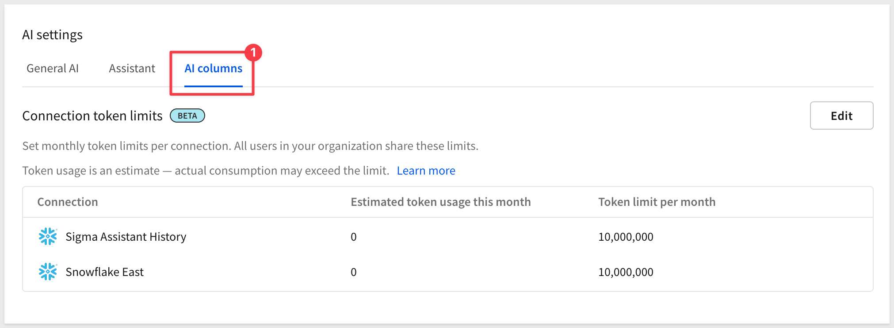

Back on the General AI tab, you can also set up an AI usage table, so token consumption is tracked and queryable like any other data in Sigma. 

For a walkthrough of building a dashboard on top of that data, see [Create a Sigma Assistant Usage Dashboard](https://quickstarts.sigmacomputing.com/guide/administration_ask_sigma_usage_dashboard/index.html) — or start from one of Sigma's ready-made AI Cost Monitoring templates (Claude, Snowflake, Snowflake Cortex AI, and OpenAI are all available in the [Templates](https://help.sigmacomputing.com/docs/get-started-with-workbook-templates) gallery) if you'd rather not build a dashboard from scratch:

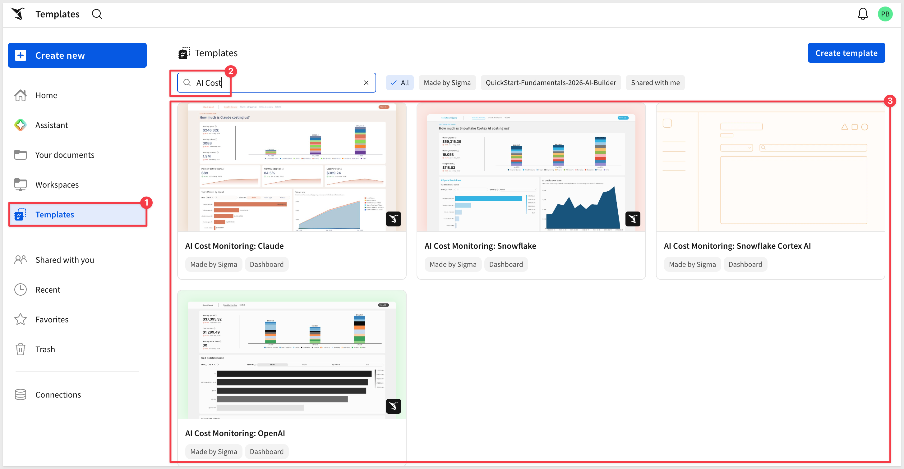

<aside class="positive">
<strong>WHY IT MATTERS:</strong>  Sigma is the governed runtime around AI: audit logs, permissions, cost controls, collaboration, and version management all come with the platform, regardless of which provider you configure. Setting token limits and an AI usage table here means you catch runaway AI costs before they show up on a warehouse bill.
</aside>

If your use case involves building AI apps that call external systems, set up your API connectors ahead of time. 

For setup steps, see [Configure API credentials and connectors in Sigma](https://help.sigmacomputing.com/docs/configure-api-credentials-and-connectors-in-sigma#add-a-new-api-credential-to-sigma) 

For a hands-on walkthrough, see [API Actions - Getting Started](https://quickstarts.sigmacomputing.com/guide/developers_api_actions_getting_started/index.html)

<!-- END OF SECTION-->

## Branding
Duration: 10

A Sigma environment that looks and feels like your organization's own tools gets adopted faster than one that looks like a generic vendor product. Custom themes, home pages, and localization take little time to configure, and they're often the first thing a new user notices — long before they open their first workbook.

### Custom Theme

Set your organization's default look and feel from `Administration` > `Account` > `Branding Settings`. A custom theme controls:
- **Color** — text, highlight, and surface colors, plus categorical, sequential, and diverging chart palettes
- **Font** — choose from Sigma's pre-installed fonts
- **Layout style** — spacing and padding defaults
- **Table style** — header, subheader, and cell formatting

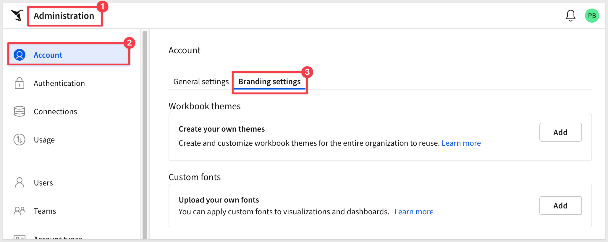

Once built, a theme can be applied to any workbook from its `Workbook settings`, and updating the theme later cascades everywhere it's used — you don't have to restyle each dashboard by hand.

For a full walkthrough, see [Fundamentals 07: Design Elements (UI & Layout)](https://quickstarts.sigmacomputing.com/guide/fundamentals_7_design_v3/index.html)

### Custom Home Pages

Sigma admins can designate a workbook to serve as a custom homepage — the first page of that workbook becomes the landing page a user or team sees the moment they sign in. It's a natural place to surface curated visualizations, onboarding links, or announcements instead of leaving everyone to find their own way to a starting point.

You'll need admin access, and the target workbook shared with at least `Can view` access to everyone it's assigned to. If the workbook queries an OAuth-authenticated connection, configure it to run under a service account so sessions don't expire mid-use.

To set it up: go to `Administration` > `Account` > `General Settings`, enable custom home pages, assign it to specific users, Teams, or everyone, and pick the workbook (optionally a tagged version):

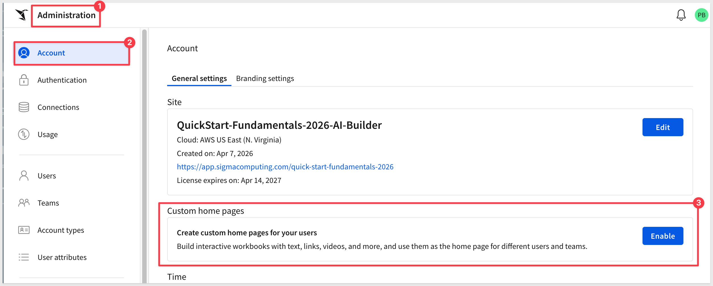

For setup steps, see [Set up custom home pages](https://help.sigmacomputing.com/docs/enable-a-custom-homepage)

### Localization

Decide your organization's defaults for time and language before you roll out broadly:
- **Account timezone** — the portal-wide default timezone (UTC unless you change it)
- **Organization locale** — the portal-wide default locale applied to documents
- **Organization translation files** — centrally managed translations for commonly used terms, so individual workbook owners aren't each re-translating the same words

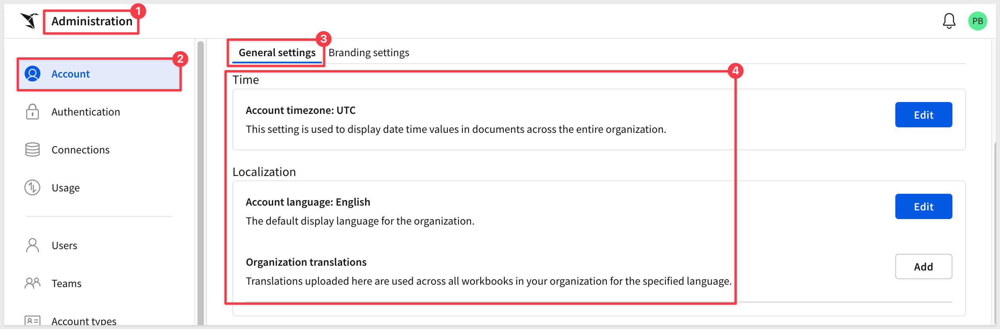

<aside class="positive">
<strong>WHY IT MATTERS:</strong>  Consistent timezone and locale defaults keep reports comparable across teams and regions, and centrally managed translations mean a term only needs to be translated once, not once per workbook.
</aside>

For setup steps, see [Change the account time zone](https://help.sigmacomputing.com/docs/account-time-zone), [Set the organization locale](https://help.sigmacomputing.com/docs/manage-organization-locale#set-the-organization-locale), and [Manage organization translation files](https://help.sigmacomputing.com/docs/manage-organization-translation-files)

If a specific workbook needs its own language settings on top of your organization defaults, see [Manage workbook localization](https://help.sigmacomputing.com/docs/manage-workbook-localization)

<!-- END OF SECTION-->

## Versioning and Promotion (WDLC)
Duration: 10

Every workbook and data model in Sigma moves through some version of Dev → QA → Production, whether or not you've set up a formal process for it. Sigma's version tagging turns that into something explicit and reviewable, instead of an informal habit of renaming workbooks or asking people not to touch one while it's being tested.

### Version Tagging

A tag freezes a workbook's state at a specific point in time, creating a version you can point users at — for example, a `Production` tag for the version everyone consumes, while a `Quality Assurance` tag holds the version still under review. Tagging doesn't duplicate your data or fork the workbook; it's a pointer to a specific version, so promoting content is just a matter of moving the tag.

For example:

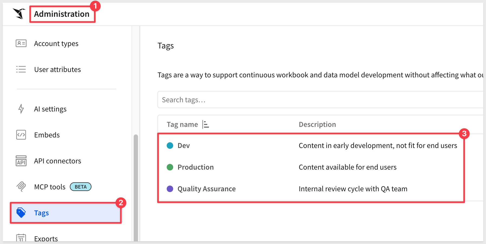

Set a tag to `Protected` if you want to control who's allowed to move it — that way, promoting a workbook to `Production` takes someone with the right permission doing it deliberately, not whoever happens to be editing.

For setup steps, see [Create and manage version tags](https://help.sigmacomputing.com/docs/create-and-manage-version-tags), and for a deeper walkthrough, see [Version Tagging with Sigma](https://quickstarts.sigmacomputing.com/guide/administration_version_tagging/index.html)

### Data Models as Code

If your data models need the same rigor — code review, CI/CD, a Git history of every change — Sigma's REST API lets you create and update data models programmatically from a JSON specification, instead of only through the UI. That means a data model change can go through a pull request and an automated deployment pipeline, the same as any other code change.

<aside class="positive">
<strong>WHY IT MATTERS:</strong>  Version tagging and API-driven data models make promotion to production a deliberate, reviewable step — not a race to remember which workbook is "the real one."
</aside>

For a hands-on walkthrough, see [Data Models as Code](https://quickstarts.sigmacomputing.com/guide/developers_data_models_as_code/index.html)

<!-- END OF SECTION-->

## Onboarding Training Plan
Duration: 10

A great configuration doesn't help anyone if your users don't know it's there. Sigma is intuitive enough that most people find their way around on their own, but a deliberate onboarding plan is what turns "available" into "actually used" — both for your initial rollout and for every person who joins after it.

### Training Plan

Decide how new users get trained, both at launch and on an ongoing basis:
- **Live Sigma-led training** — Sigma's team runs sessions for your organization
- **Internally-led training** — your own admins or champions run sessions, train-the-trainer style
- **Sigma's live webinars** — recurring public sessions covering new features
- **Sigma QuickStarts** — self-paced, hands-on guides like this one
- **Whitelabeled QuickStarts** — Sigma's QuickStart content, rebranded so it fits naturally into your own onboarding materials

If you set up a custom homepage in the Branding section above, it's a natural place to surface links to whichever of these your organization relies on.

<aside class="positive">
<strong>WHY IT MATTERS:</strong>  Combining live and self-paced options means new users can learn at whatever pace and depth fits them, instead of every question landing on your admin team.
</aside>

### Foster a User Community

Training gets people started; a community keeps them growing. Consider:
- **A champions program** — power users in each team who help others and surface feedback
- **Recurring events** — internal meetups or "Data Days" where people share what they've built
- **Content-sharing** — a shared space for tips, templates, and reusable patterns
- **Message boards or forums** — a place for peer-to-peer support outside of live sessions

Sigma runs its own version of this at the [Sigma Community](https://community.sigmacomputing.com/) — worth a look as a model for what to build internally.

<!-- END OF SECTION-->

## Auditing and Cost Monitoring
Duration: 10

Every organization eventually asks the same two questions: who did what, and what is this costing us? Sigma answers both natively — audit logs and usage data show up as regular Sigma connections, so you explore them the same way you'd explore any other data source, instead of digging through a separate admin tool.

### Audit Logs

Once enabled, Sigma exposes user activity through a dedicated `Sigma Audit Logs` connection you can query and build workbooks against like any other data source.

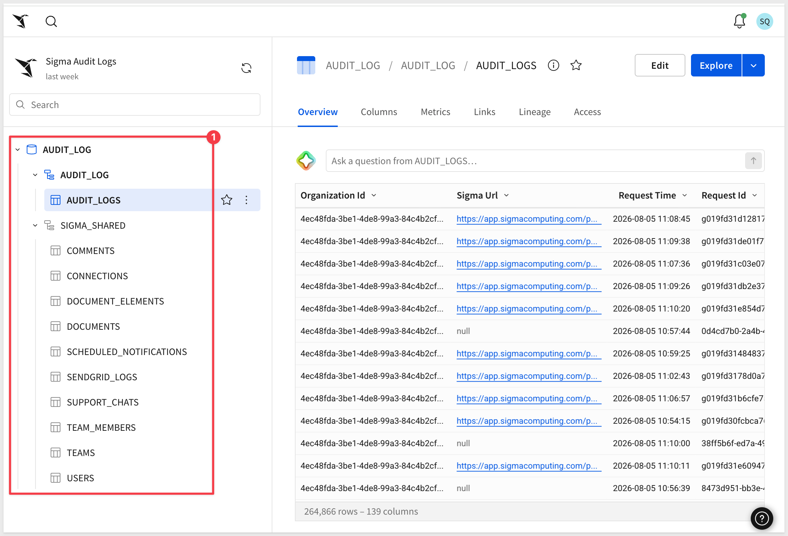

Audit logs are retained for 30 days by default, which is enough to explore but not enough to rely on for compliance or historical trend analysis. 

Enabling `Sigma Audit Logs` and setting up a storage integration are two separate steps on the same settings page — turning on logging doesn't automatically export it anywhere, so if you need longer retention, set up the storage integration too, not just the connection:

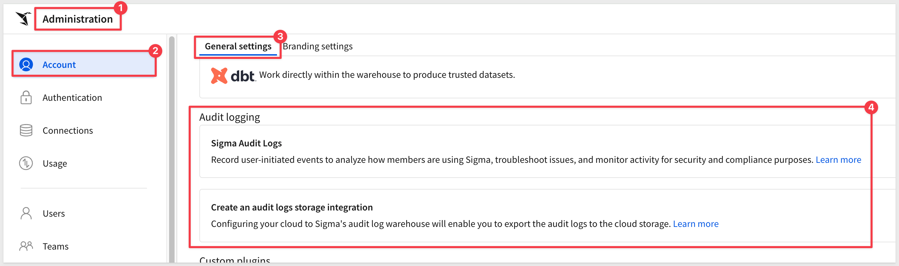

For setup steps, see [Enable audit logging](https://help.sigmacomputing.com/docs/enable-audit-logging) and [Access and explore audit logs](https://help.sigmacomputing.com/docs/access-and-explore-audit-logs). For longer retention, see [Export audit log data to cloud storage](https://help.sigmacomputing.com/docs/export-audit-log-data-to-cloud-storage)

For a hands-on walkthrough, see [Audit Logging](https://quickstarts.sigmacomputing.com/guide/administration_audit_logging/index.html)

### Monitor Usage and Warehouse Costs

Sigma's usage overview shows which features and users are most active — useful for spotting power users worth turning into champions, and for catching licenses that are going unused.

For warehouse spend specifically, Sigma publishes a Snowflake Cost per Query template: two setup steps, and you get a live dashboard showing exactly what each workbook, user, role, and warehouse is costing you: 

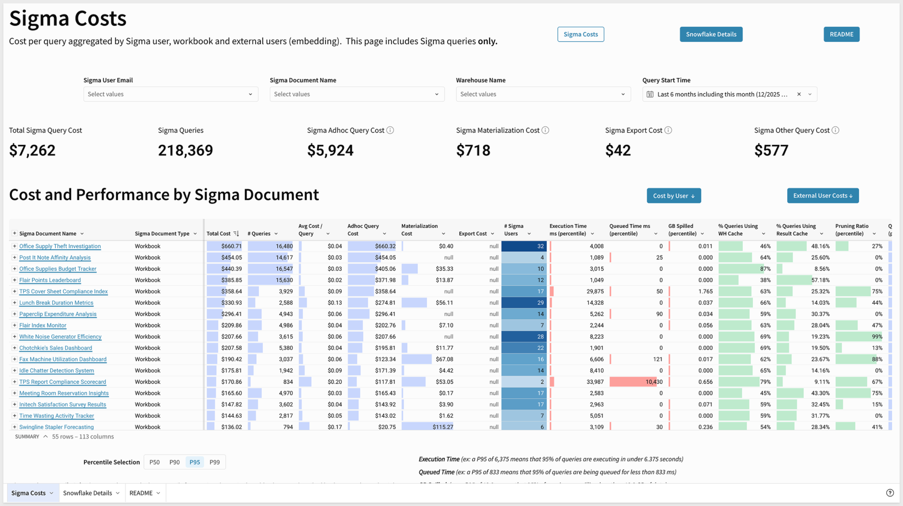

If queries are running slower or more expensively than they should, materializing the underlying datasets is usually the fastest fix, but talk to your Sigma CSM if the issue is persistent.

<aside class="positive">
<strong>WHY IT MATTERS:</strong>  Audit logs and cost data are only useful if someone's actually looking at them. Give your power users access to both, and you turn cost control from an admin chore into something the whole organization can help watch.
</aside>

For setup steps, see [Usage overview](https://help.sigmacomputing.com/docs/usage-overview). For a hands-on walkthrough of each, see [Snowflake Cost per Query Template Setup](https://quickstarts.sigmacomputing.com/guide/snowflake_cost_per_query_template_setup/index.html) and [Materialization with Sigma](https://quickstarts.sigmacomputing.com/guide/administration_materialization/index.html)

### Deprecate Unused Content

Use audit logs and usage data together to spot workbooks nobody's opened in months, and decide on a regular cadence for archiving or removing them. An environment that keeps growing without ever being pruned gets harder to navigate and costs more to run than it needs to.

<!-- END OF SECTION-->

## Summary Checklist
Duration: 5

Use this checklist to confirm you've addressed each planning area in this guide. Not every item will apply to your organization — check off only what's relevant to your use case.

<button>[Download this checklist (PDF)](https://sigma-quickstarts-main.s3.us-west-1.amazonaws.com/PDFs/Summary_Checklist.pdf)</button>

### Use Case Plan
☐ Identified who this use case is for 
☐ Defined the workflow or decision it needs to support 
☐ Confirmed data source ownership and access 
☐ Set a target go-live date

### Security
☐ Selected an authentication method 
☐ Defined account types for each group of users 
☐ Organized users into Teams 
☐ Structured Workspaces to match Teams 
☐ Established a license upgrade request process 
☐ Requested Security Portal and Support Portal access

### Cloud Warehouse Connection Strategy
☐ Decided on a connection strategy (one connection vs. multiple, sizing, PrivateLink, Python queries) 
☐ Implemented data security (RLS/CLS, OAuth vs. service account) 
☐ Configured write-back access, if needed

### AI Features and Strategy
☐ Configured an AI provider 
☐ Decided which agents users can access 
☐ Decided whether to enable the Sigma MCP Server and/or MCP tools for agents 
☐ Considered agent skill configuration for builders 
☐ Set cost controls (token limits, AI usage table) 
☐ Aligned on an AI strategy across your tech stack

### Branding
☐ Built a custom theme (colors, fonts, layout, table style) 
☐ Set up a custom homepage 
☐ Set organization timezone and locale 
☐ Configured organization translation files, if needed

### Versioning and Promotion (WDLC)
☐ Set up version tagging for Dev/QA/Prod promotion 
☐ Applied Protected tags where promotion needs controlled approval 
☐ Considered managing data models as code via the API

### Onboarding Training Plan
☐ Decided on a training plan (live, self-paced, or both) 
☐ Linked training resources from your custom homepage 
☐ Considered how to foster a user community

### Auditing and Cost Monitoring
☐ Enabled audit logging 
☐ Set up an audit logs storage integration for retention beyond 30 days 
☐ Gave power users access to usage and cost data 
☐ Set up warehouse cost monitoring 
☐ Defined a process for deprecating unused content

<!-- END OF SECTION-->

## What we've covered
Duration: 5

We worked through the full set of decisions that turn a fresh Sigma environment into one that's ready for real users — security and access, connections and data governance, AI strategy, branding, promotion process, onboarding, and cost monitoring. 

Not every decision needed an answer today; the point is to know what exists, what to decide now versus later, and where to find the details when you're ready. 

The Summary Checklist is meant to help you through that process, not just sit here as a record of today's setup — some of these decisions are one-time (branding, initial connection setup), while others are worth revisiting as adoption spreads beyond your first use case, especially licensing, Team structure, and AI strategy.

**Bring your Sigma Customer Success Manager (CSM) into the harder tradeoffs — connection strategy, security model, AI provider selection — before you commit to a path. A CSM has seen how these decisions play out across other Sigma deployments, and their input up front is far cheaper than restructuring after rollout.** They're a resource throughout your Sigma journey, not just at kickoff, so loop them back in whenever a new use case raises a question this guide didn't answer.

**Additional Resource Links**

[Blog](https://www.sigmacomputing.com/blog/) 
[Community](https://community.sigmacomputing.com/) 
[Help Center](https://help.sigmacomputing.com/hc/en-us) 
[QuickStarts](https://quickstarts.sigmacomputing.com/) 

Be sure to check out all the latest developments at [Sigma's First Friday Feature page!](https://quickstarts.sigmacomputing.com/firstfridayfeatures/)
 

&emsp;
&emsp;

<!-- END OF WHAT WE COVERED -->
<!-- END OF QUICKSTART -->
