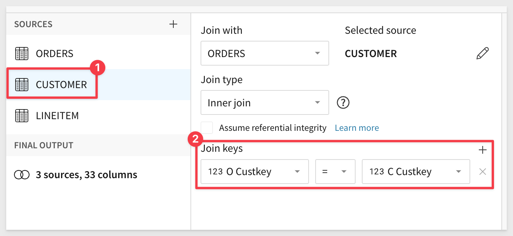
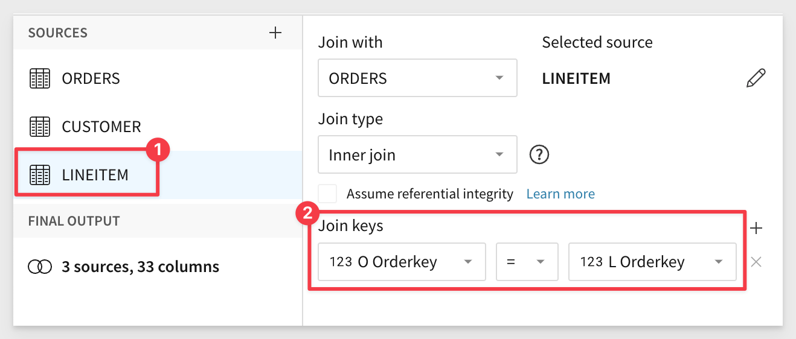
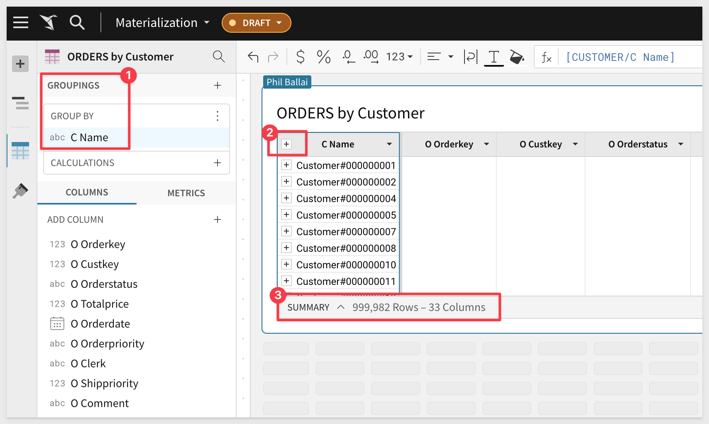
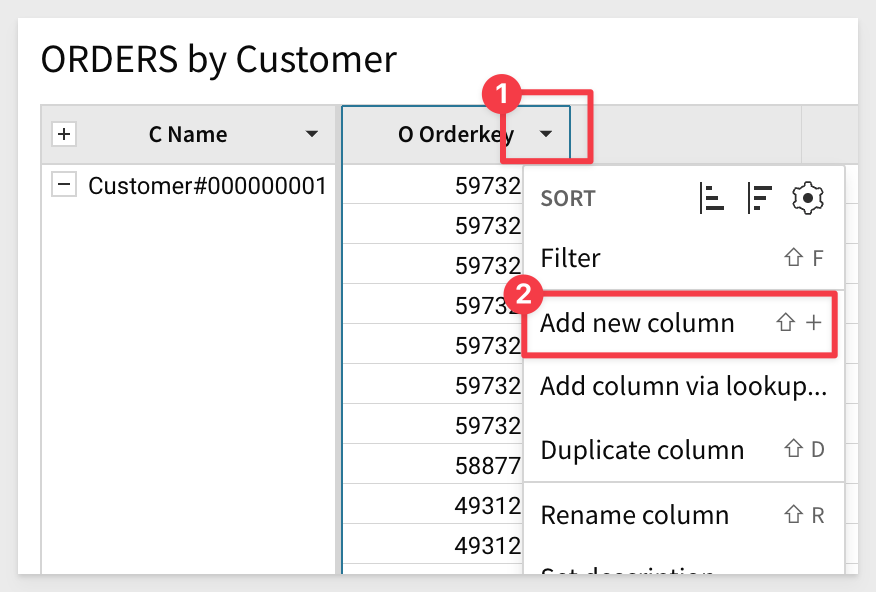
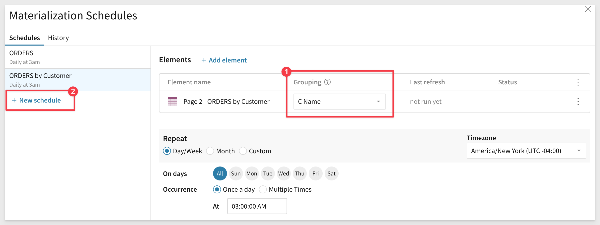

author: pballai
id: administration_materialization
summary: administration_materialization
categories: Administration
environments: web
status: Published
feedback link: https://github.com/sigmacomputing/sigmaquickstarts/issues
tags: Getting Started
lastUpdated: 2023-05-20

# Materializations
<!-- The above name is what appears on the website and is searchable. -->

## Overview 
Duration: 5 

This QuickStart is designed as primer to materialization and all the questions and issues that surround it. 

We will define it, provide some guidance on the why use it, when use it and who sets it up. 

Lastly we will step through using Sigma and Snowflake to materialize some data so that the workflow in Sigma is understood.


 ### Target Audience
Sigma administrators who are interested in improving performance when working with large datasets or just generally interest in learning more about materialization. 

### Prerequisites

<ul>
  <li>A computer with a current browser. It does not matter which browser you want to use.</li>
  <li>Access to your Sigma environment.</li>
  <li>Some familiarity with Sigma is assumed. Not all steps will be shown as the basics are assumed to be understood.</li>
  <li>A Snowflake account with the proper administrative and security admin access.</li>
  <li>Write access must be enabled on your Sigma dataset’s connection.</li>
</ul>

<aside class="postive">
<strong>IMPORTANT:</strong><br> Sigma recommends that you use non-production resources when doing QuickStarts.
</aside>

<button>[Sigma Free Trial](https://www.sigmacomputing.com/free-trial/)</button> <button>[Snowflake Free Trial](https://signup.snowflake.com/)</button>

### What You’ll Learn
This QuickStart discussed the features and benefits of using materialization in Sigma and also how to configure and schedule materializations to improve the speed and performance of your reports. 

### What You’ll Build

INSERT IMAGE OF FINAL BUILD IF APPROPRIATE.........


<!-- END OF OVERVIEW -->

## Background
Duration: 20
The fundamental concept of storing pre-calculated data for performance optimization purposes (ie: materialization) has been around for several decades, with advancements and optimizations occurring over time.

The concept of materialization is closely associated with database systems, particularly in the field of data warehousing and business intelligence. 

It involves creating temporary or permanent tables or views that store the results of complex queries or data transformations. This pre-calculated or pre-aggregated data can be accessed more efficiently and quickly than recomputing the results every time the query is executed.

In general, the main advantages of materialization are:
 <ul>
      <li><strong>Improved query performance:</strong> Materialized tables eliminate the need for repetitive computations, resulting in faster query response times.</li>
      <li><strong>Reduced resource consumption:</strong> By precomputing and storing the results, materialization reduces the computational resources required for query execution, leading to more efficient resource utilization.</li>
      <li><strong>Query optimization:</strong> Materialized tables can be indexed and optimized for specific query patterns, further enhancing performance.</li>
      <li><strong>Enhanced concurrency:</strong> Since the materialized tables store precomputed results, multiple queries can run concurrently without interfering with each other, improving overall system concurrency.</li>
      <li><strong>Simplified data pipelines:</strong> Materialization can simplify complex data pipelines by providing a straightforward way to store and reuse intermediate or final query results.</li>
</ul>


<!-- END OF SECTION-->

## When To Consider?
Duration: 20

Since materialization is a common strategy for improving performance of interactive queries, and it is most effective in certain situations.

You should consider materializing data in situations where it can provide **tangible benefits** in terms of query performance, data analysis, and resource management.

For example:

<ul>
      <li><strong>Frequently Accessed Data::</strong> If certain datasets or views are accessed frequently by multiple users or applications, materializing the data can help reduce the load on the underlying systems. By creating materialized views or tables, you can provide fast and efficient access to commonly requested data, resulting in improved overall system performance.</li>
      <li><strong>Complex and Resource-Intensive Queries:</strong> If you have queries that involve multiple tables, complex joins, aggregations, or calculations, materializing intermediate or final results can significantly improve query performance. By pre-computing and storing the results, subsequent queries can avoid the expensive computations and directly access the materialized data, leading to faster response times.</li>
      <li><strong>Data Analysis and Reporting:</strong> When you have data analysis or reporting requirements that involve aggregations, summaries, or complex transformations, materializing the results can speed up the process. By pre-calculating and storing the necessary data, analysts and decision-makers can quickly access the materialized views or tables, enabling faster insights and reporting.</li>
      <li><strong>Time-Dependent Data:</strong> If your data changes infrequently or on a regular schedule, materializing the data can be advantageous. Instead of repeatedly recomputing the results, you can update the materialized views or tables at specific intervals or trigger-based events. This approach ensures that the data remains up-to-date while reducing the computational overhead.</li>
      <li><strong>Resource Management:</strong> Materializing data can help manage computing resources more efficiently. By pre-calculating and storing intermediate results, you can balance the workload and allocate resources appropriately. Materialization allows you to offload expensive computations from the live system and use the resources for other critical tasks.</li>
      <li><strong>Matching the Grain to the Need:</strong> If the source data contains millions of transactions, but the workbook charts are only showing daily, weekly or monthly aggregates, you can use materialization to create a daily (weekly, monthly) summary table, that will be significantly smaller than the source table, improving performance. This is called "reducing the grain" or "reducing cardinality".</li>
</ul>

<aside class="positive">
<strong>IMPORTANT:</strong><br> It's important to note that materializing data comes with trade-offs. The materialization process itself requires storage space and additional maintenance efforts to keep the materialized data synchronized with the underlying source data. Therefore, you should carefully evaluate the cost and benefits before deciding to materialize data, considering factors such as query patterns, data volatility, available resources, and performance requirements
</aside> 

<aside class="negative">
<strong>NOTE:</strong><br> When materialization is done in Sigma, then regular (non-oauth) authentication should be used, where every Sigma user is logging into CDW using a single, shared CDQ logon. If a client uses oauth, they can not materialize using Sigma.</li>
      <li><strong>Some other exceptions apply:</strong> Elements that use calculations that include parameters and certain system functions (like CurrentTimeZone() , CurrentUser*() ) can not be materialized.
</aside>


<!-- END OF SECTION-->

## What Options Are There?
Duration: 20

In the software market, there are several options available for materialization, depending on your specific needs and the technology stack you are working with. 

 <li><strong>Here are some common options for materialization:</strong> 
    <ol type="n"> 
      <li><strong>Relational Database Management Systems (RDBMS):</strong> Most popular RDBMS systems, such as Oracle, Microsoft SQL Server, MySQL, and PostgreSQL, provide features for materialization. These databases offer various mechanisms like materialized views, indexed views, and temporary tables that allow you to create and manage materialized data.</li>
      <li><strong>Data Warehousing Solutions:</strong> Data warehousing platforms like Amazon Redshift, Google BigQuery, and Snowflake are designed for handling large-scale data analytics workloads. They often provide optimized features for materialization, including materialized views, caching mechanisms, and query optimization techniques to enhance query performance.</li>
      <li><strong>In-Memory Databases:</strong> In-memory databases like SAP HANA, Redis, and Apache Ignite store data in-memory rather than on disk, which can significantly improve query performance. These databases often provide built-in mechanisms for materializing data, such as columnar storage, data replication, and preloading of frequently accessed data.
</li>
      <li><strong>Caching Systems:</strong>  Caching systems like Memcached and Redis can be used to materialize frequently accessed data. By storing query results or computed data in-memory, these systems allow for quick retrieval and reduce the need for repetitive computations.</li>
      <li><strong>Business Intelligence (BI) Tools:</strong> Many BI tools, such as Sigma, Tableau, Power BI, and Looker, offer features for materialization to optimize data analysis and reporting. These tools allow you to create materialized views, derived tables, or data extracts that can be used for faster query execution and interactive visualizations.</li>
      <li><strong>Custom Data Pipelines and ETL Processes:</strong> In some cases, you may need to implement custom materialization solutions using data pipelines or Extract-Transform-Load (ETL) processes. Tools like DBT Labs, Apache Airflow, Apache Spark, or custom scripting can be utilized to schedule and automate the materialization process, ensuring that the materialized data remains up-to-date.</li>
    </ol>
  </li>

The availability and specific features of materialization options may vary depending on the software you choose. It's important to evaluate the capabilities, scalability, ease of use, and integration possibilities of these solutions based on your requirements, existing infrastructure, and the technology stack you are using in your organization.


<!-- END OF SECTION-->

## How to Decide?
Duration: 20

Given all the available choices, this can feel like a complex decision but there are some points that will help make it easier to decide.

 <li><strong>The benefit of materializing from Sigma:</strong> 
    <ol type="u"> 
      <li><strong>Setup in a browser using Sigma</strong> A very simple and quick process</li>
      <li><strong>Does not require data engineering expertise</strong> Faster development cycle</li>
      <li><strong>RBAC support</strong> Limit who can materialize</li>
    </ol>
  </li>

Some clients prefer a well governed, centralized materialization strategy, using a single, dedicated tool of their choice and that is fine too.

For some situations, both solutions can work together to save time and get projects completed faster. some clients choose to use Sigma-based materialization to support prototyping and rapid development cycles, because they almost no development time and can be done by a larger team.

For example, you can allow materialization using Sigma, during early development phases, then, later on, move some of the most used materialization logic into the warehouse. That will allow you to have a rapid development cycle, but still having a well governed environment for production usage. 

If you have chosen to use Sigma to materialize (in either scenario), it is important to control who in Sigma is able to materialize. By default, only Sigma Administrators are able to materialize. You can also create a custom account type “Creators who can Materialize” and grant them the materialization permission. 

The ability to materialize in Sigma should be governed in some way - you typically don’t want a large number of creators to materialize hundreds or thousands of potentially duplicate objects. It is common to grant the ability to materialize to a certain, smaller number of creators, using Sigma's RBAC system. 


<!-- END OF SECTION-->

## Initial Setup
Duration: 20

Materializations allows you to write datasets and workbook elements back to your warehouse as tables which can reduce compute costs. Materialization enhances query performance by allowing your data warehouse to avoid recomputing the dataset when it's used by an element or a in descendant Sigma analysis. 

Materializations are stored in your warehouse and saved in scratch workspace schema automatically managed by Sigma. Sigma's query compiler automatically and transparently uses the latest materialization.

<aside class="positive">
<strong>IMPORTANT:</strong><br> Sigma materialization requires write access must be enabled on your dataset’s connection and must be an organization Admin or be assigned a custom account type with materialize permissions.
</aside>

### Prepare Snowflake
First, we need to create a database and schema in Snowflake that we can use when materializing data with Sigma. 

Login to your Snowflake trial account as `AccountAdmin`. 

Create a new `SQL Worksheet` and copy/paste the following code into the worksheet:
```console
-- SELECT WAREHOUSE
use WAREHOUSE COMPUTE_WH;

-- CREATE DATABASE AND GRANT USAGE
CREATE DATABASE if not exists SIGMA_WRITEDB;
use DATABASE SIGMA_WRITEDB;
grant usage on database SIGMA_WRITEDB to role ACCOUNTADMIN;

-- SCHEMA AND GRANT USAGE
CREATE SCHEMA QUICKSTART;
grant usage, create table, create view, create stage on schema QUICKSTART to role ACCOUNTADMIN
```

Click the drop arrow in the upper-right corner and select `Run all`:


It should return as `Statement executed successfully`.

### Setting up Write Access
Login to Sigma and navigate to `Administration` > `Connections`. Click `Create Connection`:


scroll down and add information related to `Write Access`:


When done, click `Create`. The connection will be tested and if it passes, a success message will appear. 

[For more information on enabling write access in Sigma, click here.](https://help.sigmacomputing.com/hc/en-us/articles/360037430473-Set-Up-Write-Access)


<!-- END OF SECTION-->

## Materialization in Sigma
Duration: 20

Previously we discussed materialization in general and now we will discuss how it is implemented in Sigma.

In Sigma, materializations allow you to write `Datasets` and `Workbook elements` back to your warehouse as tables.

Materializations are stored in your warehouse and saved in scratch workspace schema, automatically managed by Sigma. Sigma's query compiler automatically and transparently uses the latest materialization.

A materialization is created through the act of scheduling a materialization. The materialization schedule will impact the data freshness. Long running queries that do not display in Sigma can still be materialized.


<!-- END OF SECTION-->

## Dataset Materialization
Duration: 20

For this exercise, we will leverage the sample database provided by Snowflake called `TPCH_SF10` which has and `ORDERS` table consisting of 9 columns and 15M rows. 

It is typical to use Sigma to join tables, add groupings and calculated columns. Doing so will create a dataset that may benefit from materialization. 

We will assume that this is the case but skip that work in this QuickStart as it is assumed to be understood. We want to focus on how to materialize the final dataset that we have created in Sigma. 

In Sigma, click the `Connections` and select `Snowflake Trial` from the connection list:


Expand the database called `SNOWFLAKE_SAMPLE_DATA` and select the `ORDERS` table. Then click `Explore`:


The `Orders` table is now open in a unsaved Workbook. All columns are selected and there are 15M rows available:


Save this workbook as `Materialization`.

Click the `hamburger icon` and select `Schedule materialization`:


On the Schedules screen, we can create one or more times when this materialization will run.

Since we only have one element in our Workbook (Page 1 - Orders), and no groupings, that is what is selected. 

Configure the schedule to be once a day, at 3am and your timezone:


Click `Save Schedules`.

The materialization will run now and once done, will show a `Status` of "Success". The UI will also show the next scheduled runtime.


Close the open schedule window.

<aside class="negative">
<strong>NOTE:</strong><br> When the CDW is updated daily, materialization should typically take place during off hours, like in the middle of the night or early morning, after any batch updates into the CDW completed.
</aside>

Navigate back to `Administration` > `Materializations` where we can see the list of our current jobs:


Here we are able to see the status of the last run and how long it took; in this case, 15M rows in 11 secs using a Snowflake X-Small warehouse. 

<aside class="positive">
<strong>IMPORTANT:</strong><br> The configuration of the target cloud data warehouse size will impact the runtime of materializations. Since Sigma makes materializations easy, you can fine tune the performance by experimenting with different configurations and evaluating results.
</aside>

Click on the `Orders` (under number 3) to go to the `Materialization` Workbook.

Clicking on the `View materialization icon` will show the latest run information and links to `Materialize now` and `View Schedule`.


<!-- END OF SECTION-->

## Materialized Table in Snowflake
Duration: 20

We are able to see that Sigma has created a new table in Snowflake, based on our 9 column, 15M row configuration but the column data is not in a readable format. This "scratch schema" is managed by Sigma and is transparent to the Sigma user.


Materialization enhances query performance by allowing your data warehouse to avoid recomputing the data when it's used by an element or in descendant Sigma analysis. 

To access this data from other applications, see Sigma’s Dataset Warehouse Views feature.

<aside class="positive">
<strong>IMPORTANT:</strong><br> Don't make changes to the materialized tables directly in your database. This can result in unexpected results or query failures.
</aside>


<!-- END OF SECTION-->

## Workbook Materialization

Workbook materialization is similar to datasets, but have some major advantages, depending on the use case needs.

 <ul>
      <li>It allows you to materialize any workbook element (table, visualization, pivot) that can be used as a data source for another element.</li>
      <li>Workbook materialization offers a smarter refresh when published. Publishing a document only refreshes the materialization if necessary. For example, if the materialized element hasn't changed, materialization doesn't run. Datasets always refresh the materialization on publish. This matters when the dataset is very large, in terms of compute cost.</li>
      <li>It offers support for different levels of reference. Grouping levels can be independently materialized. Datasets only materialize at one grouping level.</li>
      <li>Materializations are used when viewing and editing a workbook. Datasets don't use the materialization in edit mode.</li>
      <li>It pushes status changes. The workbook viewer is notified of Materialization activity in a new "alerts" center (to be integrated with in-app notifications) and toasts.</li>    
</ul>


<!-- END OF SECTION-->

## Workbook Materialization Grouping Levels

If an element contains multiple grouping levels, it is possible to select one or more grouping level to materialize. It's often unnecessary and potentially costly to materialize the most granular level of an element (indicated in the UI as All source columns).

We will demonstrate by building on the Workbook we already have. 

<aside class="positive">
<strong>IMPORTANT:</strong><br> It is fine if you prefer to just review the QuickStart steps in this section as the workflow are similar to what we have already done. What is important is the concept of materialization at different group levels. 
</aside>

First, let's pause the existing materialization schedule so it no longer will run.

Click and open the `View schedule` option:


Open the "hamburger menu" and select `Pause` and then click `Save Schedules`:


The ORDERS schedule Status will switch to "Paused". Close this dialogue.

Now lets make a duplicate of the `Orders` table and move it to a new page:


Rename the new table `ORDERS by Customer` and move it to a new page:


We now need to join the `CUSTOMER` table to `ORDERS`.

Click as shown to select `Join`:


Navigate the UI to locate the `Snowflake Trial` connection and expand the tree to select the `TPCH_SF10 / CUSTOMER` table. Click it and then click `Select`:


We want to set the `Join Keys` on `O Custkey = C Custkey`:


The result will be some customers with no orders and some with multiple. 

Click `Preview Output`.

Sigma presents the "lineage", which is a visual representation of how the data is mapped. 

<aside class="positive">
<strong>IMPORTANT:</strong><br> Sigma's Workbook lineage makes it easy to see the ancestry and relationships between data elements in a workbook. All workbooks contain a lineage display, allowing you to oversee and navigate these relationships. 
</aside>

This is an opportunity to remove any unnecessary columns. We will take them all for this exercise but best practice is to remove what is not needed to gain on performance and compute/storage costs.

Repeat the join exercise to add the `CUSTOMER` and `LINE ITEM` tables:





Click `Preview Output` and `Done`.

We now have around 60M rows of order detail by customer. 

Drag the column `C Name` to the `GROUPINGS` section, to group by the customer name:

Click the `-` in the left corner of the `C Name` column of the table to collapse the group.

We see that we have just under 1M customers:



<aside class="positive">
<strong>IMPORTANT:</strong><br> Your text here.
</aside>

There is a column that shows the value of each unique order but we want to know the final sale price per item too. We do this by adding a new calculated column. This new column does not exist in the data but once we create it, it will be calculated each time the Workbook requests data. 

Once we materialize the data, the calculated result is persisted in the materialized dataset, saving query time and therefore, better performance and less compute time cost. Granted, our example is simplistic but in large dataset with many calculations, this can have real impact.

Click the `O Orderkey` column and select `Add a new column` and rename it to `Sale Price`:



Set the formula to:
```console
Sum([L Extendedprice] - ([L Extendedprice] * [L Discount]))
```

Now that we have the table we want, we can materialize again but this time we have the additional ability to apply a different schedule to the grouping levels of the table.

For example, (and lets just assume) that we don't add new customers all that often so materializing the `CUSTOMER` level can be done once per night. However, we receive a large number of orders every day so we might want to materialize the `ORDERS` level several times per day. Sigma materialization makes this simple to setup.

Open the `Schedule materialization` UI again:


Create one schedule (once per day) based on the `C Name` grouping level:

Create another schedule (every hour) based on the Grouping of `All source columns`:




To materialize multiple grouping levels, select Add Element and add the element for each additional grouping level.


<!-- END OF SECTION-->


## What we've covered
Duration: 5

In this lab we learned how to.........

INSERT FINAL IMAGE OF BUILD IF APPROPRIATE

<!-- THE FOLLOWING ADDITIONAL RESOURCES IS REQUIRED AS IS FOR ALL QUICKSTARTS -->
**Additional Resource Links**

[Help Center Home](https://help.sigmacomputing.com/hc/en-us)<br>
[Sigma Community](https://community.sigmacomputing.com/)<br>
[Sigma Blog](https://www.sigmacomputing.com/blog/)<br>
<br>

[](https://twitter.com/sigmacomputing)&emsp;
[](https://www.linkedin.com/company/sigmacomputing)
[](https://www.facebook.com/sigmacomputing)


<!-- END OF WHAT WE COVERED -->
<!-- END OF QUICKSTART -->
