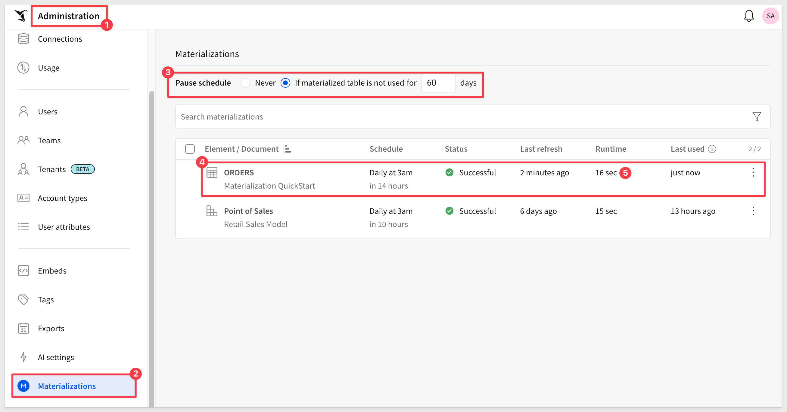
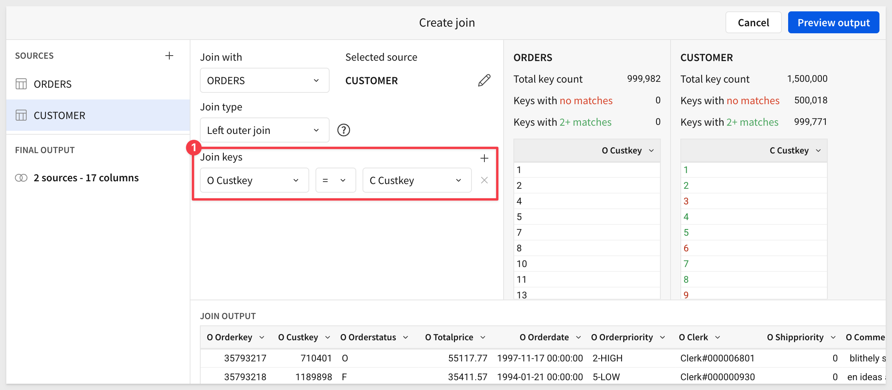
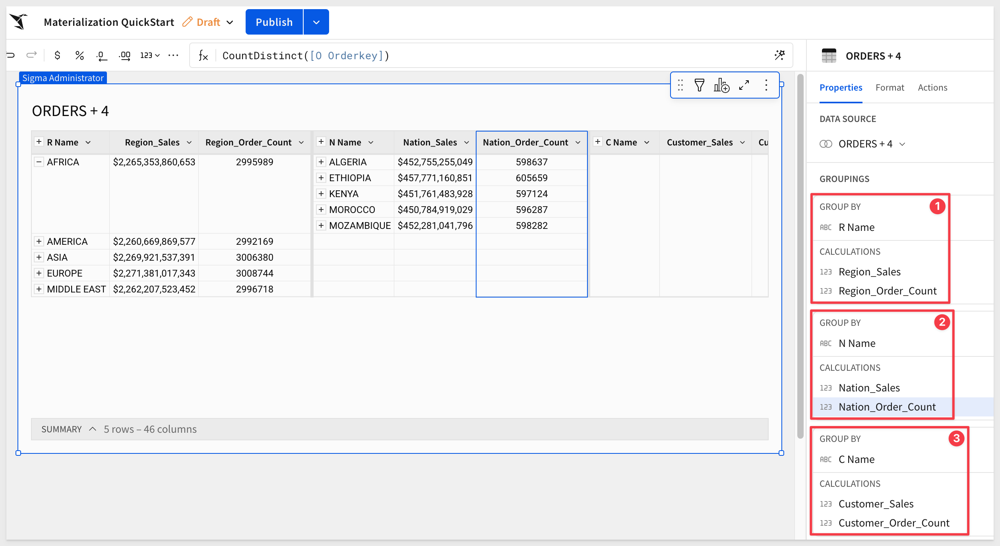

author: pballai
id: administration_materialization
summary: administration_materialization
categories: Administration
environments: web
status: Published
feedback link: https://github.com/sigmacomputing/sigmaquickstarts/issues
tags: default
lastUpdated: 2023-06-06

# Materialization with Sigma
<!-- The above name is what appears on the website and is searchable. -->

## Overview 
Duration: 5 

This QuickStart is designed as primer to materialization and the questions and issues that surround it. 

We will define it, provide some guidance on the why/when to use it and who sets it up. 

Lastly, we will step through using Sigma and Snowflake to materialize some data so that the workflow in Sigma is understood.

<aside class="positive">
<strong>IMPORTANT:</strong><br> Some screens in Sigma may appear slightly different from those shown in QuickStarts. This is because Sigma is continuously adding and enhancing functionality. Rest assured, Sigma’s intuitive interface ensures that any differences will not prevent you from successfully completing any QuickStart.
</aside>

For more information on Sigma's product release strategy, see [Sigma product releases.](https://help.sigmacomputing.com/docs/sigma-product-releases)

 ### Target Audience
Sigma administrators who are interested in improving performance when working with complex datasets or just generally interest in learning more about materialization. 

### Prerequisites

<ul>
  <li>A computer with a current browser. It does not matter which browser you want to use.</li>
  <li>Access to your Sigma environment.</li>
  <li>Some familiarity with Sigma is assumed. Not all steps will be shown as the basics are assumed to be understood.</li>
  <li>A Snowflake account with the proper administrative and security admin access.</li>
  <li>Write access must be enabled on your Sigma dataset’s connection.</li>
</ul>

<aside class="postive">
<strong>IMPORTANT:</strong><br> Sigma recommends that you use non-production resources when doing QuickStarts.
</aside>

<button>[Sigma Free Trial](https://www.sigmacomputing.com/free-trial/)</button> <button>[Snowflake Free Trial](https://signup.snowflake.com/)</button>

### What You’ll Learn
This QuickStart discussed the features and benefits of using materialization in Sigma and also how to configure and schedule materializations to improve the speed and performance of your complex reports. 

## Background
Duration: 20

The fundamental concept of storing pre-calculated data for performance optimization purposes (ie: caching) has been around for several decades, with advancements and optimizations occurring over time.

Materialization is a type of caching, where query results are written into a table in a data warehouse, and then refreshed at regular intervals (often  daily).

**This pre-calculated or pre-aggregated data can be accessed more efficiently and quickly than recomputing the results every time the query is executed.**

In general, the main advantages of materialization are:
 <ul>
      <li><strong>Improved query performance:</strong> Materialized tables eliminate the need for repetitive computations, resulting in faster query response times.</li>
      <li><strong>Reduced resource consumption:</strong> By precomputing and storing the results, materialization reduces the computational resources required for query execution, leading to more efficient resource utilization.</li>
      <li><strong>Query optimization:</strong> Materialized tables can be indexed and optimized for specific query patterns, further enhancing performance.</li>
      <li><strong>Enhanced concurrency:</strong> Since the materialized tables store precomputed results, multiple queries can run concurrently without interfering with each other, improving overall system concurrency.</li>
      <li><strong>Simplified data pipelines:</strong> Materialization can simplify complex data pipelines by providing a straightforward way to store and reuse intermediate or final query results.</li>
</ul>


<!-- END OF SECTION-->

## Considerations
Duration: 20

Materialization is a common strategy for improving performance of interactive queries, and it is most effective in certain situations.

You should consider materializing data in situations where it can provide **tangible benefits** in terms of query performance, data analysis, and resource management.

<aside class="positive">
<strong>IMPORTANT:</strong><br> Materialization is not a "go-fast" solution for tables that are already flat, regardless of their size. You should not expect performance gains when using against a flattened table alone.
</aside><br>

At Sigma, we see customers immediately benefiting from materialization in these use cases:

<ul>
      <li>Flattening complex joins</li>
      <li>Lowering the grain of data (materializing an aggregated table level)</li>
      <li>Flattening out slow calculations (like json extracts)</li>
      <li>When applying a permanent, restrictive filter. For example, when there are 100M rows, but only 50k rows are relevant to the analysis)</li>
 </ul>

There is a broad range of potential use cases that benefit from materializing. Here are the most common, should you want to know more:

<ul>
      <li><strong>Complex and Resource-Intensive Queries:</strong><br> Queries that involve multiple tables, complex joins, aggregations, or calculations, materializing intermediate or final results can significantly improve query performance. By pre-computing and storing the results, subsequent queries can avoid the expensive computations and directly access the materialized data, leading to faster response times.</li>
      <li><strong>Data Analysis and Reporting:</strong><br>  When you have data analysis or reporting requirements that involve aggregations, summaries, or complex transformations, materializing the results can speed up the process. By pre-calculating and storing the necessary data, analysts and decision-makers can quickly access the materialized views or tables, enabling faster insights and reporting.</li>
      <li><strong>Time-Dependent Data:</strong><br>  If your data changes infrequently or on a regular schedule, materializing the data can be advantageous. Instead of repeatedly recomputing the results, you can update the materialized views or tables at specific intervals or trigger-based events. This approach ensures that the data remains up-to-date while reducing the computational overhead.</li>
      <li><strong>Resource Management:</strong><br>  Materializing data can help manage computing resources more efficiently. By pre-calculating and storing intermediate results, you can balance the workload and allocate resources appropriately. Materialization allows you to offload expensive computations from the live system and use the resources for other critical tasks.</li>
      <li><strong>Matching the Grain to the Need:</strong><br>  If the source data contains millions of transactions, but the workbook charts are only showing daily, weekly or monthly aggregates, you can use materialization to create a daily (weekly, monthly) summary table, that will be significantly smaller than the source table, improving performance. This is called "reducing the grain" or "reducing cardinality".</li>
      <li><strong>Frequently Accessed Data::</strong> If certain datasets or views are accessed frequently by multiple users or applications, materializing the data can help reduce the load on the underlying systems, assuming other materialization criteria are met.</li>
</ul>

<aside class="positive">
<strong>IMPORTANT:</strong><br> It's important to note that materializing data comes with trade-offs. The materialization process itself requires storage space and additional maintenance efforts to keep the materialized data synchronized with the underlying source data. Therefore, you should carefully evaluate the cost and benefits before deciding to materialize data, considering factors such as query patterns, data volatility, available resources, and performance requirements
</aside> 

<aside class="negative">
<strong>NOTE:</strong><br> When materialization is done in Sigma, regular (non-oauth) authentication should be used, where every Sigma user is logging into the cloud data warehouse (CDW) using a single, shared CDW logon. If a client uses oauth for the CDW connection, they can not materialize using Sigma.

<strong>Some other exceptions apply:</strong><br> Elements that use calculations that include parameters and certain system functions (like CurrentTimeZone() , CurrentUser*() ) cannot be materialized.<br>

Sometimes it is useful to include a column that is populated with the date when the materialization was last run. Use the Today() function to accomplish that.
</aside>

[Help on Today() function](https://help.sigmacomputing.com/docs/today)


<!-- END OF SECTION-->

## Options
Duration: 20

In the software market, there are several options available for caching/materialization, depending on your specific needs and the technology stack you are working with. 

 <li><strong>Here are some common options for materialization:</strong> 
    <ol type="n"> 
      <li><strong>Data Warehousing Solutions (and most RDBMS):</strong><br> Data warehousing platforms like Amazon Redshift, Google BigQuery, and Snowflake are designed for handling large-scale data analytics workloads. They often provide optimized features for materialization, including materialized views, caching mechanisms, and query optimization techniques to enhance query performance.</li>
      <li><strong>In-Memory Databases:</strong><br> In-memory databases like SAP HANA, Redis, and Apache Ignite store data in-memory rather than on disk, which can significantly improve query performance. These databases often provide built-in mechanisms for materializing data, such as columnar storage, data replication, and preloading of frequently accessed data.
</li>
      <li><strong>Caching Systems:</strong><br> Caching systems like Memcached and Redis can be used to materialize frequently accessed data. By storing query results or computed data in-memory, these systems allow for quick retrieval and reduce the need for repetitive computations.</li>
      <li><strong>Custom Data Pipelines and ETL Processes:</strong> In some cases, you may need to implement custom materialization solutions using data pipelines or Extract-Transform-Load (ETL) processes. Tools like DBT Labs, Apache Airflow, Apache Spark, or custom scripting can be utilized to schedule and automate the materialization process, ensuring that the materialized data remains up-to-date.</li>
    </ol>
  </li>

The availability and specific features of materialization options may vary depending on the software you choose. It's important to evaluate the capabilities, scalability, ease of use, and integration possibilities of these solutions based on your requirements, existing infrastructure, and the technology stack you are using in your organization.

<aside class="positive">
<strong>IMPORTANT:</strong><br> Many customers prefer to use Sigma to perform materialization because our user interface makes it easy to setup, monitor and manage using a browser.
</aside>


<!-- END OF SECTION-->

## Use Sigma to Materialize?
Duration: 20

Given all the available choices, this can feel like a complex decision but there are some points that will help make it easier to decide.

Some clients prefer a well governed, centralized materialization strategy, using a single, dedicated tool of their choice and that is fine too.

For some situations, both solutions can work together to save time and get projects completed faster. some clients choose to use Sigma-based materialization to support prototyping and rapid development cycles, because they almost no development time and can be done by a larger team.

For example, you can allow materialization using Sigma, during early development phases, then, later on, move some of the most used materialization logic into the warehouse. That will allow you to have a rapid development cycle, but still having a well governed environment for production usage. 

There are some clear benefits to using Sigma to materialize.

<strong>The benefits of materializing from Sigma:</strong> 
 <ul>
      <li><strong>Setup in a browser using Sigma makes it very simple and quick process</strong></li>
      <li><strong>Does not require data engineering expertise means a faster development cycle</strong> </li>
      <li><strong>Role-base access control limits who can materialize</strong> </li>
      <li><strong>The materialized data stays in your CDW</strong> </li>
      <li><strong>Sigma manages all the complexity automatically, saving time and effort</strong> </li>
</ul>

If you have chosen to use Sigma to materialize, it is important to control who in Sigma is able to materialize. By default, only Sigma Administrators are able to materialize. You can also create a custom account type “Creators who can Materialize” and grant them the materialization permission. 

The ability to materialize in Sigma should be governed in some way - you typically don’t want a large number of creators to materialize hundreds or thousands of potentially duplicate objects. It is common to grant the ability to materialize to a certain, smaller number of creators, using Sigma's RBAC system. 


<!-- END OF SECTION-->

## Initial Setup
Duration: 20

Lets start to go deeper into using materialization with Sigma. 

Materializations allows you to write datasets and workbook elements back to your warehouse as tables which can reduce compute costs. Materialization enhances query performance by allowing your data warehouse to avoid recomputing the dataset when it's used by an element or a in descendant Sigma analysis. 

Materializations are stored in your warehouse and saved in scratch workspace schema ***automatically managed by Sigma***.

**Sigma's query compiler automatically and transparently uses the latest materialization.**

All data displayed in Sigma is queried directly from the warehouse; Snowflake in this case. 

The complexity of the base query will carry through in all subsequent queries associated with sorting, filtering, and paginating the data. To solve this, Sigma datasets can be materialized back to Snowflake. 

This is different from the dataset view object in Snowflake. 

In Sigma’s implementation, a `CREATE TABLE AS` statement is used to store the result set of the SQL query generated by the dataset. 

It is possible to materialize a Sigma table that contains multiple grouping levels by select a grouping level to materialize.

Materializations can be set on a schedule or triggered via the Sigma API. 

By materializing a dataset an extremely complex query can be flattened down into a simple `SELECT` meaning that all downstream queries are able to run under far less strain.

<aside class="positive">
<strong>IMPORTANT:</strong><br> Sigma materialization requires write access must be enabled on your dataset’s connection and must be an organization Admin or be assigned a custom account type with materialize permissions.
</aside>

### Prepare Snowflake
First, we need to create a database and schema in Snowflake that we can use when materializing data with Sigma. 

Login to your Snowflake trial account as `AccountAdmin`. 

Create a new `SQL Worksheet` and copy/paste the following code into the worksheet:
```console
-- SELECT WAREHOUSE
use WAREHOUSE COMPUTE_WH;

-- CREATE DATABASE AND GRANT USAGE
CREATE DATABASE if not exists SIGMA_WRITEDB;
use DATABASE SIGMA_WRITEDB;
grant usage on database SIGMA_WRITEDB to role ACCOUNTADMIN;

-- SCHEMA AND GRANT USAGE
CREATE SCHEMA QUICKSTART;
grant usage, create table, create view, create stage on schema QUICKSTART to role ACCOUNTADMIN
```

Click the drop arrow in the upper-right corner and select `Run all`:


It should return as `Statement executed successfully`.

### Setting up Write Access
Login to Sigma and navigate to `Administration` > `Connections`. Click `Create Connection`:


scroll down and add information related to `Write Access`:


When done, click `Create`. The connection will be tested and if it passes, a success message will appear. 

[For more information on enabling write access in Sigma, click here.](https://help.sigmacomputing.com/docs/set-up-write-access)


<!-- END OF SECTION-->

## Materialization in Sigma
Duration: 20

Previously we discussed materialization in general and now we will discuss how it is implemented in Sigma, at a high-level.

A materialization is created through the act of scheduling a materialization. The materialization schedule will impact the data freshness. Long running queries that do not display in Sigma can still be materialized.

<aside class="negative">
<strong>NOTE:</strong><br> A materialization can only have one schedule, but a schedule can have multiple materializations.
</aside>

Materializations can be paused (manually or after a user-specified period of non-use) and deleted anytime. 

<aside class="negative">
<strong>NOTE:</strong><br> Deleting a materialization schedule will result in deletion of corresponding warehouse tables in 24 hours.
</aside>

### Limitations
Materialization isn't available for datasets that use parameters or system functions, although there are a few exceptions to this. For example, the system function Today() does work. These datasets are expected to return different values when their parameters change. Materialized tables, on the other hand, always return the same value - the fixed output of the dataset at the time the materialization was run. As a result, using the materialized versions of datasets that use parameters or system functions would produce unexpected results.

Materialization is incompatible with row-level security. The materialization will error if row-level security (user attributes) functions are referenced.

Datasets referencing other datasets, by means of duplication or joins, can typically be materialized. However, this isn't true if any underlying dataset(s) cannot be materialized.


<!-- END OF SECTION-->

## Simple Materialization
Duration: 20

For this exercise, we will leverage the sample database provided by Snowflake called `TPCH_SF10` which has an `ORDERS` table consisting of 9 columns and 15M rows. 

It is typical to use Sigma to join tables, add groupings and calculated columns when materializing. As previously discussed, flat tables will not benefit from materialization. 

We will assume that our data has some joins and calculated columns, but skip that work in this section, as it is assumed to be understood how to do that in Sigma. We want to focus on how to materialize in Sigma first. 

We will do a more complex, grouped table example later.

In Sigma, click the `Connections` and select `Snowflake Trial` from the connection list:


Expand the database called `SNOWFLAKE_SAMPLE_DATA` and select the `ORDERS` table. Then click `Explore`:


The `Orders` table is now open in an unsaved Workbook. All columns are selected and there are 15M rows available:


Save this workbook as `Materialization`.

Click the `hamburger icon` (the 3-dots) and select `Schedule materialization`:


On the Schedules screen, we can create one or more times when this materialization will run.

Since we only have one element in our Workbook (Page 1 - Orders) and no groupings, that is what is selected. 

Configure the schedule to be once a day, at 3am and your timezone:


Click `Save Schedules`.

The materialization will run now and once done, will show a `Status` of "Success". The UI will also show the next scheduled runtime.


Close the open schedule window.

<aside class="negative">
<strong>NOTE:</strong><br> Materialization should typically take place during off hours, like in the middle of the night, early morning or after any batch updates into the cloud data warehouse are completed.
</aside>

Navigate back to `Administration` > `Materializations` where we can see the list of our current jobs:



Here we are able to see the status of the last run and how long it took; in this case, 15M rows in 11 secs using a Snowflake X-Small warehouse. 

<aside class="positive">
<strong>IMPORTANT:</strong><br> The configuration of the target cloud data warehouse size/clustering will impact the performance of materializations. Since Sigma makes materializations easy, you can fine tune the performance by experimenting with different configurations and evaluating results. Keep in mind, performance is just one of the reasons to materialize.
</aside>

Click on the `Orders` (under number 3) to go to the `Materialization` Workbook.

Clicking on the `View materialization icon` will show the latest run information and links to `Materialize now` and `View Schedule` pages.


<!-- END OF SECTION-->

## Materialized Table in Snowflake
Duration: 20

We are able to see that Sigma has created a new table in Snowflake, based on our 9 column, 15M row configuration but the column data is not in a readable format. This "scratch schema" is managed by Sigma and is transparent to the Sigma user.


Materialization enhances query performance by allowing your data warehouse to avoid recomputing the data when it's used by an element or in descendant Sigma analysis. 

To access this data from other applications, see [Sigma’s Dataset Warehouse Views feature.](https://help.sigmacomputing.com/docs/review-warehouse-view-details)

<aside class="positive">
<strong>IMPORTANT:</strong><br> Don't make changes to the materialized tables directly in your database. This can result in unexpected results or query failures.
</aside>


<!-- END OF SECTION-->

## Workbook Materialization

Workbook materialization is similar to datasets, but have some major advantages, depending on the use case needs.

 <ul>
      <li>It allows you to materialize any workbook element (table, visualization, pivot) that can be used as a data source for another element.</li>
      <li>Workbook materialization offers a smarter refresh when published. Publishing a document only refreshes the materialization if necessary. For example, if the materialized element hasn't changed, materialization doesn't run. Datasets always refresh the materialization on publish. This matters when the dataset is very large, in terms of warehouse cost.</li>
      <li>It offers support for different levels of reference. Grouping levels can be independently materialized. Datasets only materialize at one grouping level.</li>
      <li>Materializations are used when viewing and editing a workbook. Datasets don't use the materialization in edit mode.</li>
      <li>The workbook viewer is notified of Materialization activity in a new "alerts" center (to be integrated with in-app notifications) and toasts.</li>    
</ul>

The easiest way to demonstrate this is to use a Sigma Template as our "Workbook".

<aside class="negative">
<strong>NOTE:</strong><br> Workbook templates allow users to templatize and share workbook structures for quick and consistent reuse. This includes a set of Sigma-created examples and usage templates.
</aside>

Navigate to `Templates` and select the `Plugs Electronics Sales Performance` template.


`Dismiss` the pop-up asking if we want to use our own data.

Click the `Save As` in the upper right corner and give the Workbook any name.

If we click to drop the menu on the `Quarterly Sales` gauge we see that the underlying data that is driving the gauge can be materialized. 

Visualizations tend to have grouped data underlying them so this is our first example of materializing grouped data. In this case, Sigma will just handle the complexity for you.

It is possible to design the dashboard first, getting it "just right" and then decide what portions to materialize based on a schedule later.


<!-- END OF SECTION-->

## Aggregate Navigation

Aggregate navigation is an advanced BI design, whereby we create several materialized tables of different grain behind the scenes, then seamlessly swap the data sources between these tables, as the user changes their grain of analysis. The benefit of aggregate navigation is fast performance at the high grain of analysis, combined with the depth of the analysis at the low grain, all transparent and invisible to the end-user.

Aggregate navigation is fairly costly to create, using conventional BI tools, because you often need to manually create and populate several aggregated tables, then add an advanced, hard to write calculation to auto-navigate between them.

By contrast, aggregate navigation in Sigma is easy.

Aggregation functions or operators are applied to groups of data to calculate a consolidated value. Some common aggregation functions include sum, count, average, minimum, maximum, and median. These functions can be applied to numerical data, such as sales figures or temperature readings, as well as categorical data, such as counting the number of occurrences of different categories.

Aggregations are often used to generate reports, analyze trends, or derive meaningful statistics from datasets. For example, in a sales database, you could use aggregation to calculate the total sales for each product category, find the average revenue per customer, or determine the highest-selling region.

Aggregation can be performed on different levels, such as the entire dataset, specific groups or categories, or even across multiple dimensions. The choice of aggregation depends on the specific analysis goals and the structure of the data.

**Tables that leverage aggregate navigation are solid candidates for materialization.**

In this section, we will demonstrate building a table that consists of four joined tables and has 60M rows. You can build or just follow along; working with larger trial data may be a little slower due to the x-small Snowflake warehouse size. 

<aside class="negative">
<strong>IMPORTANT:</strong><br> It is fine if you prefer to just review the QuickStart steps in this section as the workflow are similar to what we have already done. What is important is the concept of aggregate navigation or materialization at different group levels. 
</aside>

**Some general rules:**
 <ul>
  <li></li>
   <li>Any materialization with multiple levels creates tables for the selected level and each additional level above it.
        <ul>
        <li>If you have four groupings and a base level, aggregating "all columns" will materialize five new tables total.</li>
        <li>All visualizations have at least one grouping level.</li>
        </ul>
   <li>If a user wants to materialize a single aggregated grouping level, then they can create a child table and materialize that.</li>
   <li>Materializing all of the grouping levels means that you can very easily build aggregation tables that we reference appropriately in down stream elements.</li>
    </li>
</ul>

**For example:**<br>
If we have five grouping levels in a table element, and we materialize at the third level, it creates three separate materializations - one for the top level, another for the second level and one for the third. The fourth, fifth and the base grouping levels will not be materialized. 

This is important because there is a trade off here; performance vs. storage cost for grouping levels that are in-frequently used. 

If levels four and five have hundreds of millions of records that can't be materialized, Sigma allows materialization of levels one thru three, with great performance and depth of detail when needed, albeit slower.

<aside class="positive">
<strong>IMPORTANT:</strong><br> Sigma's materialization solution provides flexibility to design a highly performant solution against very large datasets while also being prudent with storage/compute costs. This allows for a seamless tabular exploration at scale.
</aside>

We will demonstrate by building on the Workbook we already have, but extend the data.

### Sample Use Case
Users who are viewing Sigma content always want to see sales data rolled up from the `Region/Nation/Customer` level with summary sales totals and order counts broken out for each group. They rarely explore the line item detail, but want the option to do so from time to time.

First, let's pause the existing materialization schedule so it no longer will run.

Click and open the `View schedule` option:


Open the "hamburger menu" and select `Pause` and then click `Save Schedules`:


The ORDERS schedule Status will switch to "Paused". Close this dialogue.

Now lets make a duplicate of the `Orders` table and move it to a new page:


[It is also possible to copy/paste the table instead](https://help.sigmacomputing.com/docs/copy-and-paste-elements)

Rename the new table `ORDERS by Customer` and move it to a new page:


We now need to join the `CUSTOMER` table to `ORDERS`.

Click as shown to select `Join`:


Navigate the UI to locate the `Snowflake Trial` connection and expand the tree to select the `TPCH_SF10 / CUSTOMER` table. Click it and then click `Select`:


We want to set the `Join Keys` on `O Custkey = C Custkey`:



The result will be some customers with no orders and some with multiple. 

Click `Preview Output` and `Done`.

Sigma presents the "lineage", which is a visual representation of how the data is mapped. 

<aside class="positive">
<strong>IMPORTANT:</strong><br> Sigma's Workbook lineage makes it easy to see the ancestry and relationships between data elements in a workbook. All workbooks contain a lineage display, allowing you to oversee and navigate these relationships. 
</aside>


This is an opportunity to remove any unnecessary columns. We will take them all for this exercise, but best practice is to remove what is not needed to gain on performance and compute/storage costs. It also makes the user interface a bit cleaner for the users.

Repeat the join exercise to add the `Nation` table:


and...

add the `Region` table:


and...

add the `Line Item` table:


Click `Preview Output`:

Looking at the lineage, we will materialize at the `Region` level and consider the `LineItem` level as our "base" or lessor used data that we do not want to materialize.


and `Done`.

We now have about 60M rows of order detail by customer. 

To look at the row counts of each table, we created this graphic. It is typical to have the row counts increase in size such that the "detail" or "base" level is the lowest level and not grouped or materialize due to size and frequency of use:


Create the following three groups in Sigma and add calculations for `Total Sales` and `Order Counts` as shown (the formulas are provided below for convenience):



```console
CALCULATION:            FORMULA: (note: they are all the same, using the groupings)
Region Sales            Sum([O Totalprice])
Region Order Count      CountDistinct([O Orderkey])

Nation Sales            Sum([O Totalprice])
Nation Order Count      CountDistinct([O Orderkey])

Customer Sales          Sum([O Totalprice])
Customer Order Count    CountDistinct([O Orderkey])
```

<aside class="positive">
<strong>IMPORTANT:</strong><br> Once we materialize the data, the calculated columns are automatically persisted in the materialized dataset, saving query time on later requests, providing better performance and less compute time cost. Granted, our example is simplistic but in large dataset with many calculations, this can have real impact.
</aside>

Now that we have the table we want, we can materialize again, but this time we have the additional ability to select a grouping level for the table.

Open the `Schedule materialization` UI again:


Create a schedule (once per day) based on the `Customer` grouping level:


<aside class="positive">
<strong>IMPORTANT:</strong><br> Sigma automatically creates a table for the selected "grouping" as well as each grouping level above. 
</aside>

Once the materialization is completed, we can see that three new tables have been created in Snowflake. These tables are managed by Sigma and in normal operations, there is no need to look at them, but we want to show the results and make a few important points.

Upon inspection of our `Sigma WriteDB` we see that three tables have been created (notice that the last character in it's name is "_0., _1 and _3". For the last table (our highest group level) we see three columns that correspond to our first group in Sigma. 

The column names are also not "friendly names". This is by design:

<aside class="positive">
<strong>IMPORTANT:</strong><br> These tables are visible in your cloud data warehouse. However, they're not intended to be used as source tables for other applications, although it is possible. These tables are created "as new" on every new materialization run and previous tables deleted. Don't make changes to the materialized tables directly in your database. This can result in unexpected results or query failures. 
</aside>


It is possible to access this data from other applications using [Sigma’s Dataset Warehouse Views feature](https://help.sigmacomputing.com/docs/dataset-warehouse-views).

Once the materialized tables have been accessed, the exist in the warehouse cache (based on Snowflake caching rules) which also helps performance. We can see that Sigma has automatically read from warehouse cache (as shown below), by looking at the "behind the scenes" Sigma Query History.

Note how we are reading from the Sigma_WriteDB.QuickStart materialized tables, as the query builds each level of the query: 


<aside class="positive">
<strong>IMPORTANT:</strong><br> A "not so obvious" feature of Sigma materialization is that when a use interacts with a table grouping level, Sigma automatically selects the correct materialized table related to that group level (and ignores the others). This has a very postive affect on performance.
</aside>

Now our most commonly used order data is performant:


For those interested, please refer to the [Sigma on Snowflake Best Practices guide, located here:](https://www.sigmacomputing.com/sigma-on-snowflake-best-practices)


<!-- END OF SECTION-->

## What we've covered
Duration: 5

This QuickStart was designed as primer to materialization and the questions and issues that surround it. 

We defined it, provided guidance on the why/when to use it and who might set it up. 

Lastly, we stepped through using Sigma and Snowflake to materialize data using a Sigma, including grouping data.

<!-- THE FOLLOWING ADDITIONAL RESOURCES IS REQUIRED AS IS FOR ALL QUICKSTARTS -->
**Additional Resource Links**

Be sure to check out all the latest developments at [Sigma's First Friday Feature page!](https://quickstarts.sigmacomputing.com/firstfridayfeatures/)

[Help Center Home](https://help.sigmacomputing.com)<br>
[Sigma Community](https://community.sigmacomputing.com/)<br>
[Sigma Blog](https://www.sigmacomputing.com/blog/)<br>
<br>

[](https://twitter.com/sigmacomputing)&emsp;
[](https://www.linkedin.com/company/sigmacomputing)&emsp;
[](https://www.facebook.com/sigmacomputing)


<!-- END OF WHAT WE COVERED -->
<!-- END OF QUICKSTART -->
