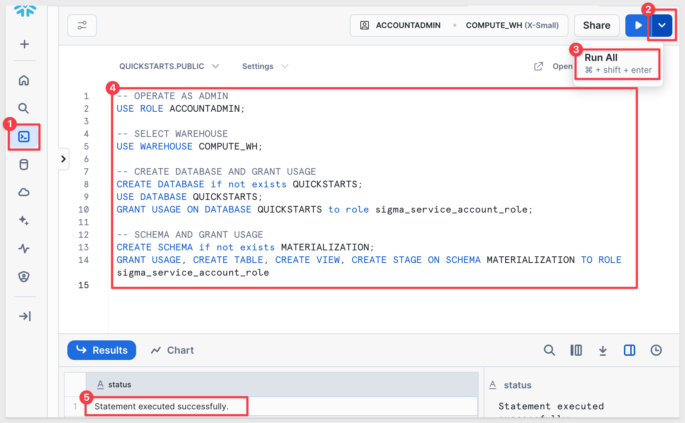
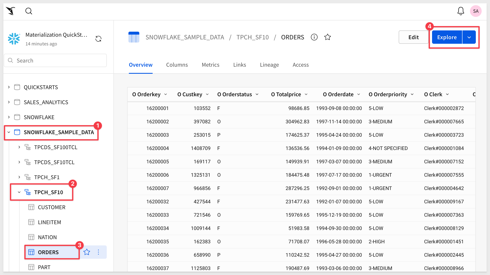
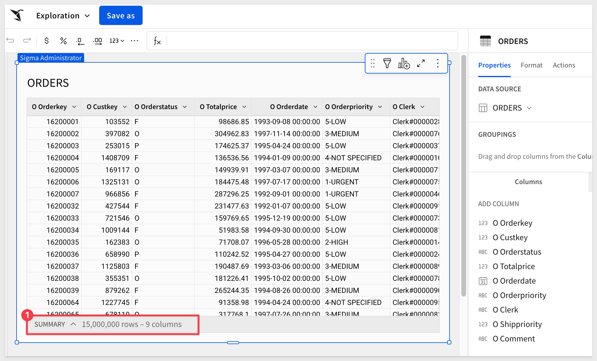
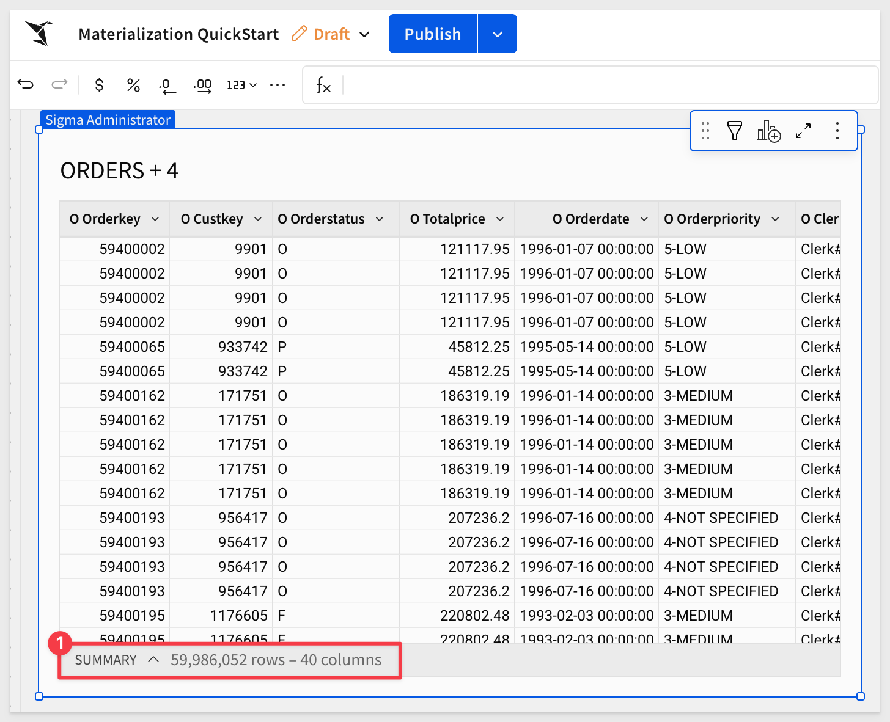
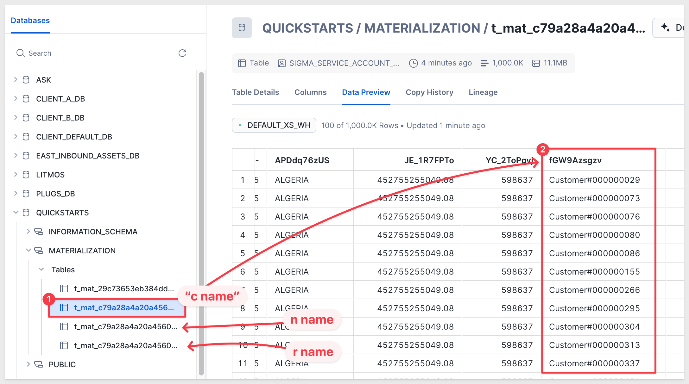

author: pballai
id: administration_materialization
summary: administration_materialization
categories: Administration
environments: web
status: Published
feedback link: https://github.com/sigmacomputing/sigmaquickstarts/issues
tags: default
lastUpdated: 2025-08-21

# Materialization with Sigma

## Overview 
Duration: 5 

This QuickStart is designed as primer to materialization and the questions and issues that surround it. 

We will define it, provide some guidance on the why/when to use it and who sets it up. 

Lastly, we will step through using Sigma and Snowflake to materialize some data so that the workflow in Sigma is understood.

<aside class="positive">
<strong>IMPORTANT:</strong><br> Some screens in Sigma may appear slightly different from those shown in QuickStarts. This is because Sigma continuously adds and enhances functionality. Rest assured, Sigma’s intuitive interface ensures that any differences will not prevent you from successfully completing any QuickStart.
</aside>

For more information on Sigma's product release strategy, see [Sigma product releases](https://help.sigmacomputing.com/docs/sigma-product-releases)

If something is not working as you expect, here's how to [contact Sigma support](https://help.sigmacomputing.com/docs/sigma-support)

### Target Audience
Sigma administrators who are interested in improving performance when working with complex datasets or just generally interest in learning more about materialization.

### Prerequisites

<ul>
  <li>A computer with a current browser. It does not matter which browser you want to use.</li>
  <li>Access to your Sigma environment.</li>
  <li>Some familiarity with Sigma is assumed. Not all steps will be shown as the basics are assumed to be understood.</li>
  <li>A Snowflake account with the proper administrative and security admin access.</li>
  <li>Write access must be enabled on the Sigma connection to the warehouse.</li>
</ul>

<aside class="postive">
<strong>IMPORTANT:</strong><br> Sigma recommends that you use non-production resources when doing QuickStarts.
</aside>

<button>[Sigma Free Trial](https://www.sigmacomputing.com/free-trial/)</button> <button>[Snowflake Free Trial](https://signup.snowflake.com/)</button>

## Background
Duration: 20

The concept of storing pre-calculated data for performance optimization (similar to caching) has been around for decades, with many advancements and refinements over time.

Materialization is a form of caching where query results are written into a table in a data warehouse and refreshed at regular intervals (often daily).

This pre-calculated or pre-aggregated data can be accessed more quickly and efficiently than recomputing results every time a query is executed.

**This pre-calculated or pre-aggregated data can be accessed more efficiently and quickly than recomputing the results every time the query is executed.**

### Advantages of Materialization
- **Improved query performance:** Eliminates repetitive computations, resulting in faster response times.

- **Reduced resource consumption:** Precomputing and storing results lowers the compute cost of running queries.

- **Query optimization:** Materialized tables can be indexed or tuned for specific query patterns.

- **Enhanced concurrency:** Precomputed results allow multiple queries to run simultaneously without contention.

- **Simplified data pipelines:** Provides a straightforward way to store and reuse intermediate or final query results.


<!-- END OF SECTION-->

## Considerations
Duration: 20

Materialization is a common strategy for improving the performance of interactive queries, but it is most effective in specific situations.

You should consider materializing data when it can provide tangible benefits in query performance, data analysis, or resource management.

<aside class="positive"> <strong>IMPORTANT:</strong><br> Materialization is not a “go-fast” solution for tables that are already flat, regardless of their size. You should not expect performance gains when materializing against a flattened table alone. </aside>

At Sigma, we see customers immediately benefit from materialization in use cases such as:
- Flattening complex joins
- Lowering the grain of data (e.g., materializing at an aggregated level)
- Flattening slow calculations (such as JSON extracts)
- Applying a permanent, restrictive filter (e.g., 100M rows exist but only 50K are relevant to the analysis)

### Common Use Cases for Materialization

**Complex and Resource-Intensive Queries**<br>
Queries involving multiple tables, joins, aggregations, or calculations benefit significantly from materialization. By precomputing and storing results, subsequent queries avoid expensive operations and return results faster.

**Data Analysis and Reporting**<br>
Reporting often involves aggregations, summaries, and transformations. Materializing these results allows analysts to access data instantly, enabling faster insights and smoother reporting workflows.

**Time-Dependent Data**<br>
For data that changes infrequently or on a predictable schedule, materialization avoids unnecessary recomputation. Materialized tables can be refreshed at regular intervals or triggered by events to balance freshness and efficiency.

**Resource Management**<br>
Materialization can optimize compute usage by offloading expensive calculations to precomputed tables, freeing live system resources for other workloads.

**Matching Grain to Need**<br>
If source data contains millions of transactions but reports only need daily, weekly, or monthly summaries, materialization can reduce the dataset to a smaller, aggregated table. This is often referred to as reducing the grain or reducing cardinality.

**Frequently Accessed Data**<br>
Datasets or views accessed repeatedly by many users are good candidates for materialization. By serving queries from precomputed tables, the load on source systems is reduced.

<aside class="positive"> <strong>IMPORTANT:</strong><br> Materializing data involves trade-offs. The process requires additional storage and ongoing maintenance to keep the materialized tables synchronized with source data. Carefully weigh costs and benefits, considering factors such as query patterns, data volatility, available resources, and performance needs. </aside> 

<aside class="negative"> <strong>NOTE:</strong><br> When materializing in Sigma, regular (non-OAuth) authentication must be used, where all Sigma users access the cloud data warehouse (CDW) with a single, shared logon. OAuth connections to the CDW are not supported for materialization.<br><br> <strong>Other limitations:</strong><br> - Elements that use parameters or system functions (e.g., <code>CurrentTimeZone()</code>, <code>CurrentUser*()</code>) cannot be materialized.

It can be helpful to include a column that records the materialization run date. Use the <code>Today()</code> function to add this automatically. </aside>

[Help on Today() function](https://help.sigmacomputing.com/docs/today)


<!-- END OF SECTION-->

## Options
Duration: 20

In the software market, there are several options available for caching and materialization, depending on your specific needs and the technology stack you are working with.

### Common Options for Materialization

**Data Warehousing Solutions (and most RDBMS)**<br>
Data warehousing platforms such as Amazon Redshift, Google BigQuery, and Snowflake are designed to handle large-scale analytics workloads. They often provide optimized features for materialization, including materialized views, caching mechanisms, and built-in query optimization techniques to improve performance.

**In-Memory Databases**<br>
In-memory databases like SAP HANA, Redis, and Apache Ignite store data in memory rather than on disk, which can significantly improve query speed. These platforms often include built-in mechanisms for materialization, such as columnar storage, data replication, and preloading frequently accessed data.

**Caching Systems**<br>
Caching systems such as Memcached and Redis can be used to materialize frequently accessed data. By storing query results or precomputed data in memory, these systems allow for quick retrieval and reduce repetitive computations.

**Custom Data Pipelines and ETL Processes**<br>
In some cases, custom materialization solutions may be required using data pipelines or ETL processes. Tools like dbt, Apache Airflow, Apache Spark, or custom scripts can be used to schedule and automate the materialization process, ensuring that materialized data remains up to date.

The availability and specific features of these options will vary depending on the software you choose. It’s important to evaluate capabilities, scalability, ease of use, and integration with your existing infrastructure and technology stack before selecting an approach.

<aside class="positive"> <strong>IMPORTANT:</strong><br> Many customers prefer to use <strong>Sigma</strong> for materialization because its user interface makes it easy to set up, monitor, and manage directly from a browser. </aside>


<!-- END OF SECTION-->

## Use Sigma to Materialize?
Duration: 20

With so many available options, deciding where to materialize data can feel complex—but there are some guidelines that can simplify the choice.

Some clients prefer a well-governed, centralized materialization strategy, using a single dedicated tool of their choice. That approach works well in many environments.

In other situations, both approaches can complement each other. For example, some clients use Sigma-based materialization for prototyping and rapid development, since it requires little to no engineering effort and can be done directly by analysts or business teams. Later, once workflows mature, materialization logic can be migrated into the warehouse for long-term production use.

This hybrid approach provides the speed and agility of Sigma during development while ensuring a governed, centralized strategy in production.
There are some clear benefits to using Sigma to materialize.

### Benefits of Using Sigma to Materialize

- Simple setup in a browser – No special tools required; start materializing in minutes
- No data engineering expertise needed – Enables faster development cycles driven by a broader team
- Role-based access control (RBAC) – Restricts who can materialize data
- Data stays in your cloud data warehouse (CDW) – No new storage systems required
- Automated complexity management – Sigma handles refreshes, dependencies, and orchestration behind the scenes

### Governance Considerations
If you choose to use Sigma for materialization, it’s important to control who has permission to materialize.

- By default, only Sigma Administrators can materialize.
- You can also create a custom account type (e.g., Creators who can Materialize) and grant that group the materialization permission.
- To avoid uncontrolled growth, it’s best to limit this ability to a smaller set of creators, rather than allowing many users to create hundreds of duplicate materializations.

Sigma’s RBAC system provides the flexibility to strike the right balance between agility and governance.


<!-- END OF SECTION-->

## Initial Setup
Duration: 20

Materialization allows you to write datasets and workbook elements back to your warehouse as tables, reducing compute costs and improving query performance. By materializing, your data warehouse avoids recomputing the dataset every time it is used in a Sigma element or descendant analysis.

Materializations are stored directly in your warehouse, inside a scratch workspace schema automatically managed by Sigma.

**Sigma’s query compiler automatically and transparently uses the latest materialization.**

All data displayed in Sigma is always queried directly from the warehouse (Snowflake in this case). However, the complexity of the base query carries through to all subsequent queries, including sorting, filtering, and pagination. To solve this, Sigma datasets can be materialized back to Snowflake.

**This is different from a dataset view object in Snowflake.**

In Sigma’s implementation, a `CREATE TABLE AS` statement is used to store the result set of the SQL query generated by the dataset. You can also materialize a Sigma table that contains multiple grouping levels by selecting a specific grouping level to materialize.

Materializations can be refreshed on a schedule or triggered programmatically via the Sigma API.

By materializing a dataset, even extremely complex queries can be flattened into a simple SELECT, meaning all downstream queries run with far less strain.

<aside class="positive"> <strong>IMPORTANT:</strong><br> To use Sigma materialization, write access must be enabled on your dataset’s connection. In addition, you must either be an **Organization Admin** or be assigned a **custom account type** with materialization permissions. </aside>

### Prepare Snowflake
First, we need to create a database and schema in Snowflake to store our materialized data.

Log in to your Snowflake trial account as `ACCOUNTADMIN`.

Open a new `SQL Worksheet`.

Copy/paste the following code:
```code
-- OPERATE AS ADMIN
USE ROLE ACCOUNTADMIN;

-- SELECT WAREHOUSE
USE WAREHOUSE COMPUTE_WH;

-- CREATE DATABASE AND GRANT USAGE
CREATE DATABASE if not exists QUICKSTARTS;
USE DATABASE QUICKSTARTS;
GRANT USAGE ON DATABASE QUICKSTARTS to role sigma_service_account_role;

-- SCHEMA AND GRANT USAGE
CREATE SCHEMA if not exists MATERIALIZATION;
GRANT USAGE, CREATE TABLE, CREATE VIEW, CREATE STAGE ON SCHEMA MATERIALIZATION TO ROLE sigma_service_account_role
```

Click the dropdown arrow in the upper-right corner and select `Run All`.



You should see: `Statement executed successfully`.

### Setting up Write Access
Log in to Sigma.

Navigate to `Administration` > `Connections`.

Click `Create Connection`.


 <aside class="positive"> <strong>IMPORTANT:</strong><br> Snowflake announced that, starting in **November 2025**, service users will be required to use **key pair authentication**. Password-based authentication will no longer be supported. This is part of Snowflake’s broader initiative to strengthen security and enforce MFA across all users. </aside>

For more information, see the QuickStart [Snowflake Key-pair Authorization](https://quickstarts.sigmacomputing.com/guide/security_snowflake_keypair_rotation/index.html?index=..%2F..index#0)

Scroll down to the `Write Access` section and enter the required information:


### Notes on Snowflake Permissions Required for Dynamic Tables
To use dynamic tables in Snowflake, the Snowflake user (or role) connected via Sigma must have the following privileges:
- USAGE on the target database and schema where the dynamic table will be created
- CREATE DYNAMIC TABLE privilege on that schema
- SELECT permission on any underlying tables or views used in the dynamic table query
- USAGE on the warehouse used to run the dynamic table refresh

Additionally, any underlying source tables used in a dynamic table must have change tracking enabled with non-zero time travel retention. Enabling or altering change tracking requires OWNERSHIP of those objects.

Click `Create`. Sigma will test the connection and, if successful, display a confirmation message.

For more information, see [Set up write access](https://help.sigmacomputing.com/docs/set-up-write-access)


<!-- END OF SECTION-->

## Materialization in Sigma
Duration: 20

Previously, we discussed materialization in general. Now, let’s look at how it is implemented in Sigma at a high level.

A materialization is created by scheduling a materialization job. The schedule you choose directly impacts data freshness. Even long-running queries that cannot display in Sigma can still be materialized.

<aside class="negative"> <strong>NOTE:</strong><br> A materialization can have only one schedule, but a single schedule can include multiple materializations. </aside>

Materializations can be paused (either manually or automatically after a user-specified period of inactivity) and can be deleted at any time.

<aside class="negative"> <strong>NOTE:</strong><br> Deleting a materialization schedule also deletes the corresponding warehouse tables within 24 hours. </aside>

### Limitations
**Parameters and system functions:**<br>
Materialization is not available for data that use parameters or most system functions, with a few exceptions. For example, the system function `Today()` does work.

Data is expected to return different values when parameters change. Materialized tables, however, always return the same fixed output generated at the time the materialization ran. Using them with parameterized datasets could produce unexpected results.

**Row-level security:**<br>
Materialization is incompatible with row-level security. If user-attribute functions are referenced, the materialization will error.

**Data referencing other data:**<br>
Data that duplicates or joins other data can usually be materialized. However, if any underlying data cannot be materialized, the dependent data cannot be either.


<!-- END OF SECTION-->

## Simple Materialization
Duration: 20

For this exercise, we’ll use the Snowflake sample database TPCH_SF10, which contains an ORDERS table with 9 columns and ~15M rows.

Typically, materialization in Sigma is applied after joining tables, adding groupings, and creating calculated columns. As discussed earlier, flat tables by themselves won’t benefit much from materialization.

For simplicity, we’ll assume that some joins and calculated columns already exist, but we’ll skip that setup here so we can focus directly on how to materialize data in Sigma. A more complex, grouped example will follow later.

In Sigma, click the  icon to return home.

Go to `Connections` and select `Materialization QuickStart` from the list:


Expand the database `SNOWFLAKE_SAMPLE_DATA` and select the `ORDERS` table. Click `Explore`:



The Orders table opens in an unsaved workbook. All 9 columns are selected, with `15M rows` available:



Save this workbook as `Materialization QuickStart`.

Click the hamburger menu (3 dots) and select `Advanced options` > `Schedule materialization:`


In the `Materialization schedules` modal, create a new schedule.

Since the workbook only contains one element (Page 1 – Orders), that element is pre-selected.

Set the schedule to run once daily at `3:00 AM` in your local timezone.


Click `Save Schedules`.

The materialization will run immediately.

Once complete, the status will show `Success` and the UI will display the next scheduled run time:


Close the schedule window.

<aside class="negative">
<strong>NOTE:</strong><br> Materialization should typically take place during off hours, like in the middle of the night, early morning or after any batch updates into the cloud data warehouse are completed.
</aside>

Navigate back to `Administration` > `Materializations` where we can see the list of our current jobs:


Here you can check the last run status, duration, and row count. In this example, the job processed `15M rows in 16 seconds` using a `Snowflake X-Small` warehouse.

<aside class="positive"> <strong>IMPORTANT:</strong><br> The size and configuration of your cloud data warehouse (e.g., warehouse size, clustering) directly impact materialization performance. Sigma makes it easy to experiment with different settings so you can balance performance, cost, and freshness. Remember, performance is just one of the reasons to materialize. </aside>

Click on the `Orders` text to return to the `Materialization QuickStart` workbook.

Click the `View materialization` icon to see:
- Details about the most recent run
- A Materialize now button
- Links to View Schedule pages


<!-- END OF SECTION-->

## Materialized Table in Snowflake
Duration: 20

Sigma creates a new table in Snowflake based on your materialization configuration (in this case, 15M rows).

The table is stored in a scratch schema that Sigma manages automatically. While the column data may not appear in a user-friendly format, this schema is fully transparent to Sigma users and is not intended for direct use.


Materialization improves query performance by allowing your data warehouse to reuse precomputed results instead of recomputing the dataset each time it is used in a Sigma element or descendant analysis.

If you need to access this data from other applications, see [Review warehouse view details](https://help.sigmacomputing.com/docs/review-warehouse-view-details)

<aside class="positive"> <strong>IMPORTANT:</strong><br> Do not modify materialized tables directly in your database. Any manual changes can cause unexpected results or query failures. </aside>


<!-- END OF SECTION-->

## Workbook Materialization
Duration: 20

Workbook materialization is similar to datasets, but has some major advantages depending on the use case.

<ul> <li>It allows you to materialize any workbook element (table, visualization, pivot) that can be used as a data source for another element.</li> <li>Workbook materialization offers a smarter refresh when published. Publishing a document only refreshes the materialization if necessary. For example, if the materialized element hasn’t changed, materialization doesn’t run. Datasets always refresh the materialization on publish. This matters when the dataset is very large, in terms of warehouse cost.</li> <li>It offers support for different levels of reference. Grouping levels can be independently materialized. Datasets only materialize at one grouping level.</li> <li>Materializations are used when viewing and editing a workbook. Datasets don’t use the materialization in edit mode.</li> <li>The workbook viewer is notified of materialization activity in a new “alerts” center (to be integrated with in-app notifications) and toasts.</li> </ul>

The easiest way to demonstrate this is to use a `Sigma Template` as our workbook.

<aside class="negative"> <strong>NOTE:</strong><br> Workbook templates allow users to templatize and share workbook structures for quick and consistent reuse. This includes a set of Sigma-created examples and usage templates. </aside>

Return to the Sigma homepage and click `Templates` > `External,` then search for `Plugs`. Click the `Plugs Electronics Sales Performance` template:


Click `Save As` in the upper-right corner and give the workbook any name.

If we click to drop the menu on the `Historical Profit and Margin` bar chart, we see that the underlying data driving the gauge can be materialized.

Charts tend to have grouped data underlying them, so this is our first example of materializing grouped data. In this case, Sigma just handles the complexity for you.

It is possible to design the dashboard first, get it just right, and then decide what portions to materialize on a schedule later.


<!-- END OF SECTION-->

## Aggregate Navigation
Duration: 20

Aggregate navigation is an advanced BI design approach where we create several materialized tables of different grain behind the scenes, then seamlessly swap the data sources between these tables as the user changes their grain of analysis. The benefit is fast performance at higher levels of aggregation, combined with the depth of analysis at lower levels — all transparent to the end-user.

Using conventional BI tools, aggregate navigation can be costly to implement, since you often need to manually create and populate several aggregated tables, then add complex logic to auto-navigate between them.

By contrast, **aggregate navigation in Sigma is straightforward.**

Aggregation functions or operators are applied to groups of data to calculate consolidated values. Some common functions include sum, count, average, minimum, maximum, and median. These can be applied to numerical data (e.g., sales figures, temperature readings) as well as categorical data (e.g., the number of occurrences by category).

Aggregations are widely used to generate reports, analyze trends, or derive meaningful statistics from datasets. For example, in a sales database, you might calculate total sales by product category, average revenue per customer, or the highest-selling region.

Aggregations can be applied at different levels — entire datasets, specific groups or categories, or across multiple dimensions. The choice depends on analysis goals and data structure.

**Tables that leverage aggregate navigation are excellent candidates for materialization.**

In this section, we’ll demonstrate building a table that joins four other tables and contains ~60M rows. You can follow along, though performance may be slower in trial accounts using an X-Small Snowflake warehouse.

<aside class="negative"> <strong>IMPORTANT:</strong><br> It’s fine if you prefer to just review the QuickStart steps in this section, since the workflows are similar to what we’ve already done. What’s most important is understanding the concept of aggregate navigation and materialization at different grouping levels. </aside>

### Some general rules:

<ul> <li>Any materialization with multiple levels creates tables for the selected level and each level above it. <ul> <li>If you have four groupings plus a base level, aggregating “all columns” will materialize five tables total.</li> <li>All visualizations have at least one grouping level.</li> </ul> </li> <li>If you want to materialize only a single aggregated grouping level, you can create a child table and materialize that.</li> <li>Materializing all grouping levels allows you to build aggregation tables that downstream elements can reference efficiently.</li> </ul>

**For example:**
If we have five grouping levels in a table element and materialize at the third level, Sigma creates three materializations: one for the top level, one for the second level, and one for the third. The fourth, fifth, and base grouping levels will not be materialized.

This trade-off matters: performance vs. storage cost. If levels four and five contain hundreds of millions of records, Sigma still allows materialization of levels one through three — delivering strong performance with the option to drill deeper when needed (though more slowly).

<aside class="positive"> <strong>IMPORTANT:</strong><br> Sigma’s materialization solution provides flexibility to design a highly performant workflow against very large datasets while being prudent with storage and compute costs. This enables seamless tabular exploration at scale. </aside>

We’ll build on the existing workbook but extend the data.

### Sample Use Case
Users viewing Sigma content often want to see sales data rolled up from the `Region/Nation/Customer` level, with summary sales totals and order counts broken out for each group. They rarely explore line item detail but want the option to do so occasionally.

First, pause the existing materialization schedule so it no longer runs.

You can do this either in the workbook or in `Administration` > `Materialization:


The `ORDERS` schedule status will switch to `Suspended`.

Click `Orders` to return to the workbook and then click `Edit`.

Now, make a duplicate of the `Orders` table:


Move the duplicate to a new page:


You can also copy/paste the table instead.

Rename the new table `ORDERS_by_Customer`.

### Join tables
Next, we’ll join the `CUSTOMER` table (from the database) to `ORDERS`.

Click `Join`:


Navigate the UI to locate the` Materialization QuickStart` connection, expand the tree, and select `TPCH_SF10` > `CUSTOMER`. Click `Select`.


Set the join keys: `O Custkey = C Custkey`.


The result will show some customers with no orders and some with multiple.

<aside class="positive"> <strong>IMPORTANT:</strong><br> This is a good opportunity to remove unnecessary columns. For this exercise we’ll keep them all, but best practice is to remove unneeded fields to improve performance, reduce compute/storage costs, and keep the interface cleaner for users. </aside>

Click the `+` icon to add another join:


Repeat the process to join the Nation table to the `Customer` table (not Orders):


Join the `Region` table to the `Nation` table:


Join the `Line Item` table to `Orders`:


Click `Preview Output`.

Sigma displays the lineage, which shows a visual representation of how the data is mapped.

Looking at the lineage, we’ll materialize at the `Region` level and treat the `LineItem` level as our “base” or less frequently used data that we won’t materialize.

 <aside class="positive"> <strong>IMPORTANT:</strong><br> Workbook lineage makes it easy to see the ancestry and relationships between data elements in a workbook. Every workbook contains a lineage display, helping you oversee and navigate these connections. </aside>

Click `Done`.

We now have about `60M rows` of order detail by customer:



### Add calculated columns
Add new columns, naming and setting each formula as shown below:
```code
NAME:                   FORMULA: (note: they are all the same, using the groupings)
Region_Sales            Sum([O Totalprice])
Region_Order_Count      CountDistinct([O Orderkey])

Nation_Sales            Sum([O Totalprice])
Nation_Order_Count      CountDistinct([O Orderkey])

Customer_Sales          Sum([O Totalprice])
Customer_Order_Count    CountDistinct([O Orderkey])
```

<aside class="positive"> <strong>IMPORTANT:</strong><br> Once materialized, calculated columns are automatically persisted in the dataset, saving query time on later requests and reducing compute cost. While our example is simple, in large datasets with many calculations this can have a real impact. </aside>

### Data grouping
Create the following three groups in Sigma:


Be sure to click `Publish` when done.

### Materialize
Now that the table is ready, we can materialize again — this time with the option to select a grouping level.

Open the `Schedule materialization` UI:


Create a schedule (once per day) based on the `Customer` grouping level:


 <aside class="positive"> <strong>IMPORTANT:</strong><br> Sigma automatically creates a table in the warehouse for the selected grouping level as well as each grouping level above it. </aside>

Once complete, three new tables will appear in Snowflake.

Looking at the Sigma WriteDB, the three tables are organized with the lowest level first, followed by the next two grouping levels. Column names are not “friendly” — this is intentional:

 <aside class="positive"> <strong>IMPORTANT:</strong><br> These tables are visible in your cloud data warehouse but are not intended as source tables for other applications. They are recreated with each new materialization run, and old tables are deleted. Do not modify materialized tables directly in your database — doing so can cause unexpected results or query failures. </aside>

It is possible to access this data from other applications using Sigma’s Dataset Warehouse Views
.

Once materialized tables are accessed, they also exist in the warehouse cache (subject to Snowflake caching rules), further improving performance.

<aside class="positive"> <strong>IMPORTANT:</strong><br> A “not-so-obvious” feature of Sigma materialization is that when a user interacts with a table grouping level, Sigma automatically selects the correct materialized table for that group level (and ignores the others). This has a very positive impact on performance. </aside>

For those interested, please refer to the [Sigma on Snowflake Best Practices guide](https://www.sigmacomputing.com/sigma-on-snowflake-best-practices)


<!-- END OF SECTION-->

## What we've covered
Duration: 5

This QuickStart was designed as a primer on materialization and the questions and considerations that surround it.

We defined what materialization is, provided guidance on when and why to use it, and discussed who typically sets it up.

Finally, we stepped through using Sigma and Snowflake to materialize data — including examples with grouped data.

<!-- THE FOLLOWING ADDITIONAL RESOURCES IS REQUIRED AS IS FOR ALL QUICKSTARTS -->
**Additional Resource Links**

Be sure to check out all the latest developments at [Sigma's First Friday Feature page!](https://quickstarts.sigmacomputing.com/firstfridayfeatures/)

[Help Center Home](https://help.sigmacomputing.com)<br>
[Sigma Community](https://community.sigmacomputing.com/)<br>
[Sigma Blog](https://www.sigmacomputing.com/blog/)<br>
<br>

[](https://twitter.com/sigmacomputing)&emsp;
[](https://www.linkedin.com/company/sigmacomputing)&emsp;
[](https://www.facebook.com/sigmacomputing)


<!-- END OF WHAT WE COVERED -->
<!-- END OF QUICKSTART -->
