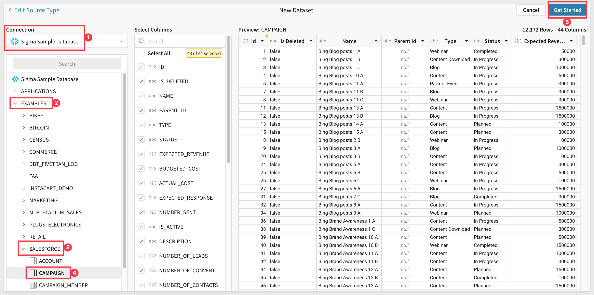
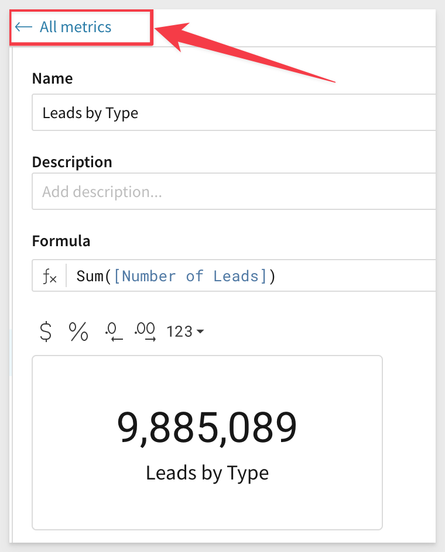

author: pballai
id: administration_metrics
summary: administration_metrics
categories: administration
environments: web
status: Published
feedback link: https://github.com/sigmacomputing/sigmaquickstarts/issues
tags: Getting Started, Metrics, Analytics, Data Engineering, BI, Business Intelligence, Sigma, Sigma Computing, Snowflake, Dashboarding, Visualization, Analysis, Excel, Spreadsheet, Embedding
# Working with Metrics
<!-- The above name is what appears on the website and is searchable. -->

## Overview 
Duration: 5 

This QuickStart **QS** discusses and demonstrates how to use Sigma Metrics against a use case we will detail later on.

Metrics in bi (business intelligence) refer to the quantitative measurements used to evaluate and analyze the performance of a business. These metrics are used to assess various aspects of a business, including financial performance, customer behavior, operational efficiency, and more.

Common metrics used in business intelligence include:

    Revenue: This metric tracks the total income generated by a business over a period of time.

    Customer retention: This metric measures the percentage of customers who continue to use a business's products or services over time.

    Net Promoter Score (NPS): This metric gauges customer satisfaction and loyalty by asking customers how likely they are to recommend a business to others.

    Conversion rate: This metric measures the percentage of website visitors who complete a desired action, such as making a purchase or filling out a form.

    Cost per acquisition (CPA): This metric calculates the cost of acquiring a new customer.

    Return on Investment (ROI): This metric calculates the financial return on a particular investment, such as a marketing campaign or product development initiative.

By tracking and analyzing these metrics, businesses can gain valuable insights into their performance and make data-driven decisions to improve their operations, better serve their customers, and increase their profitability.

Metrics in Sigma provide a way to ensure consistent metric logic across tables, visualizations, and pivot tables.

### Target Audience
Anyone who is trying to create content in Sigma and those interested in governing the calculations that are being used.

### Prerequisites

<ul>
  <li>A computer with a current browser. It does not matter which browser you want to use.</li>
  <li>Access to your Sigma environment. A Sigma trial environment is acceptable and preferred.</li>
  <li>Some familiarity with Sigma is assumed. Not all steps will be shown as the basics are assumed to be understood.</li>
</ul>

<button>[Sigma Free Trial](https://www.sigmacomputing.com/free-trial/)</button>

### What You’ll Learn
How to apply Metrics in Sigma using Sigma's sample database. 

### What You’ll Build

INSERT IMAGE OF FINAL BUILD IF APPROPRIATE.........


<!-- END OF OVERVIEW -->

## **About Sigma Metrics**
Duration: 5

Metrics in Sigma are custom aggregate calculations that can be reused across workbook data elements that share a data source (i.e., dataset or connection table). 

They can be as simple or complex as required by the use case. The person creating Sigma content does not need to know the details of the metric to use them in their Workbook and using an approved metric will accelerate their workflow. 

Metrics are defined at the data source level to promote consistent metric logic across elements and help users perform standard calculations with ease and efficiency.

There are some basic rules for creating Metrics:

**For Datasets:**
 <ul>
      <li><strong></strong> You must be assigned an account type with the Edit Dataset permission enabled.</li>
      <li><strong></strong> You must be the dataset owner or be granted Can Edit dataset permission..</li>
</ul>

**For Connection Tables:**
 <ul>
      <li><strong></strong> You must be assigned the Admin account type.</li>
</ul>


<!-- END OF SECTION-->

## **Use Case Details**
Duration: 10

Sales has requested details on how well the various Salesforce campaigns are performing. They want specifics on:

 <li><strong></strong>
    <ol type="n"> 
      <li>How many leads are coming in for each campaign.</li>
      <li>The total cost (spend) per type.</li>
      <li>How much pipeline was generated.</li>
      <li>Value of closed pipeline.</li>
      <li>Which areas of over on their budget</li>
    </ol>
  </li>

They also want the the ability to drill down into the data to get to the lowest level available. They also want to create some visuals (TBD) using the same data on their own later. 

Now that we know what the requirements are, let's create a reusable set of data that leverages metrics so that any future use of the data includes the approved (governed) calculations.


<!-- END OF SECTION -->

## **Create a Dataset**
Duration: 10

Login into Sigma and click `+ Create New` and select `Dataset`.


On the `Select a Data Source` page, select `Table`.

We will be using the Salesforce data in our cloud data warehouse, as shown:



Click `Get Started`.

We are now presented with the unpublished Dataset and we can add some metrics.


<!-- END OF SECTION -->

## **Create Metrics**
Duration: 10

Click the `Metrics` tab and click `Add Metric`:


Add new Metrics is very simple. All that is required is to provide a name and formula. The description can be very useful but it is optional. 

<aside class="negative">
<strong>NOTE:</strong><br> For formulas to work, they must be against valid table column names and use valid functions. It can be useful to test them on a separate Workbook prior to creating the final metric. 
</aside>

For this new metric, use:
```
NAME:             FORMULA:
Leads by Type     Sum([Number of Leads])
```

Notice that you can also set the default formatting for the Metric. This saves users a step later.


The metric is saved as soon as you create it. 

Click the `All Metrics` link to see a list of all available metrics in this Dataset:



From this list you are also able to modify or delete any Metric.

Now create a few more metrics so that we can build our use case out:

```
NAME:                 FORMAT:        FORMULA:
Response Rate         Percentage     Sum([Has Responded]) / (Sum([Has Responded]) + Sum([Has Not Responded]))
Pipeline Generated    Currency       Sum([Amount All Opportunities])
Total Closed Won      Currency       Sum([Amount Won Opportunities])
Budget Allocated      Currency       Sum([Budgeted Cost])
Actual $ Spend        Currency       Sum([Actual Cost])
Attributed Margin     Currency       Sum([Amount Won Opportunities] - [Actual Cost])
Under-Over Budget     Automatic      If(Sum([Actual Cost]) / Sum([Budgeted Cost]) >= 1, "Over Budget", "Under Budget")
```

Most of the metrics used are simple enough but as you can see with the `Under-Over Budget` formula, you can get as complex as needed and use any of the available Functions.

[Click here to see the available functions in Sigma](https://help.sigmacomputing.com/hc/en-us/categories/360002442993-Function-Index)

If you have not already done so, name the Dataset `Sales Campaign Dataset` and `Publish` it.

Now that we have a Dataset with some Metrics, let's build content.


<!-- END OF SECTION -->

## Using Metrics in a Workbook
Duration: 15

From the `Sales Campaign Dataset`, click the `Explore` button in the upper right corner of the page header. 


<!-- END OF SECTION -->

## What we've covered
Duration: 5

In this lab we learned how to.........

INSERT FINAL IMAGE OF BUILD IF APPROPRIATE

<!-- THE FOLLOWING ADDITIONAL RESOURCES IS REQUIRED AS IS FOR ALL QUICKSTARTS -->
**Additional Resource Links**

[Help Center Home](https://help.sigmacomputing.com/hc/en-us)<br>
[Sigma Community](https://community.sigmacomputing.com/)<br>
[Sigma Blog](https://www.sigmacomputing.com/blog/)<br>
<br>

[](https://twitter.com/sigmacomputing)&emsp;
[](https://www.linkedin.com/company/sigmacomputing)
[](https://www.facebook.com/sigmacomputing)


<!-- END OF WHAT WE COVERED -->
<!-- END OF QUICKSTART -->