author: pballai
id: administration_multitenancy
summary: administration_multitenancy
categories: Administration
environments: web
status: hidden
feedback link: https://github.com/sigmacomputing/sigmaquickstarts/issues
tags:
lastUpdated: 2026-01-16

# Sigma Tenants: Managing Isolated Organizations

## Overview
Duration: 5

Sigma Tenants allows organizations to create and manage multiple isolated Sigma environments (called "tenants") within a single parent organization. This powerful feature solves two opposing challenges that organizations face when managing analytics at scale:

**Administration Challenge**: Share documents across multiple customers or business units without creating duplicate workbooks or manually sharing each document individually.

**Collaboration Challenge**: Enable secure collaboration and sharing within each customer or business unit without exposing sensitive data to other groups.

### Why Sigma Tenants?

Sigma Tenants enables you to organize and isolate workbooks, data, users, and permissions—all within one platform. This approach is ideal when you need to:
- **Segregate environments, deployments, or data access** (e.g., dev/test/prod, regional teams, external customers)
- **Provide delegated administration** where each business unit or customer needs self-service admin capabilities without full Sigma root access
- **Maintain fully isolated data and environments** to meet security, compliance, or contractual requirements
- **Release different versions of Sigma assets** to different customers or business units
- **Support multi-region deployments** for GDPR or other data residency requirements

### Four Core Use Cases

Sigma Tenants enables four distinct organizational patterns:

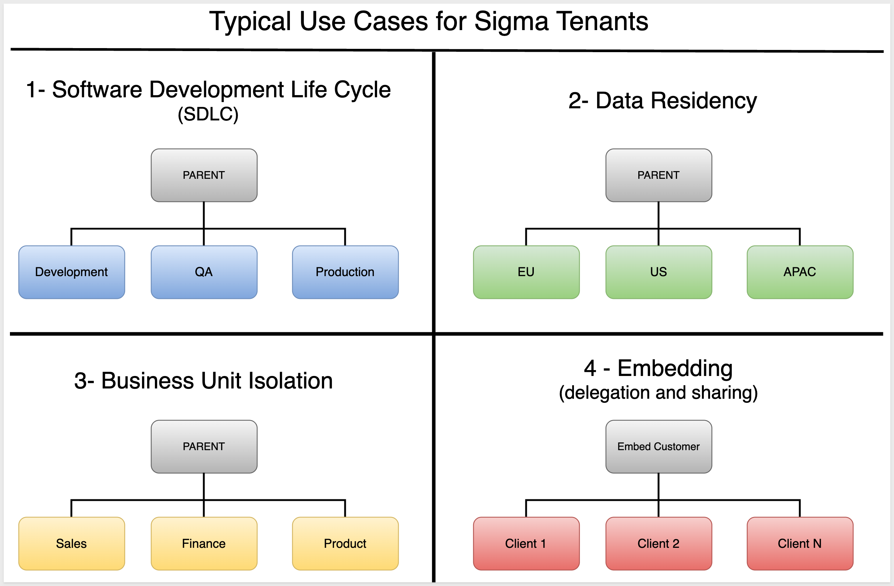

**1. SDLC (Software Development Lifecycle)**
Separate development, QA, and production environments while maintaining the same content structure. Deploy tested workbooks from Dev → QA → Prod seamlessly.

**2. Data Residency**
Comply with regional data regulations by creating tenants for different geographic regions (EU, US, APAC). Each tenant connects to region-specific data warehouses.

**3. Business Unit Isolation** ← *Focus of this QuickStart*
Organize regional sales teams (Sales-East, Sales-West) or departments (Finance, Marketing, Product) as separate tenants with their own data connections and users, while sharing standardized reports from a central team.

**4. Embed (Delegation & Sharing)**
Provide each customer of your embedded analytics with their own isolated Sigma environment, sharing the same workbooks but connected to their own data.

### How It Works

**Parent Organization**: The Sigma organization that provisions and manages all tenant organizations. It serves as the administrative hub where you control settings, users, and access for all tenants.

**Tenant Organizations**: Child Sigma organizations provisioned by the parent. Each tenant has:
- Isolated data, assets, and users
- Delegated administration (local admins manage tenant-level permissions)
- Its own configuration (email domains, Slack/Teams integrations, etc.)

**Deployments**: Share Sigma assets from the parent organization to selected tenants. When you share content with a tenant, it automatically appears in a workspace within that tenant, available to all members based on the permissions you specify.

**Connection Swap Policies**: Automatically route each tenant to their appropriate data connection. When a workbook is deployed, the connection swaps from the parent's template connection to each tenant's specific data source.

**User Attributes**: Map each tenant to their specific connection ID, enabling dynamic connection swapping at deployment time.

This QuickStart demonstrates **Business Unit Isolation** using a regional sales scenario, showing how to create tenants for Sales-East and Sales-West teams, configure their data connections with warehouse-level security, and deploy shared dashboards. 

<aside class="positive">
<strong>IMPORTANT:</strong><br> Some screens in Sigma may appear slightly different from those shown in QuickStarts. This is because Sigma continuously adds and enhances functionality. Rest assured, Sigma’s intuitive interface ensures that any differences will not prevent you from successfully completing any QuickStart.
</aside>

For more information on Sigma's product release strategy, see [Sigma product releases](https://help.sigmacomputing.com/docs/sigma-product-releases)

If something doesn’t work as expected, here's how to [contact Sigma support](https://help.sigmacomputing.com/docs/sigma-support)

### Target Audience
Product Managers and semi-technical users who will be aiding in the planning or implementation of Sigma with embedding. No SQL or technical data skills are needed to complete this QuickStart.

### Prerequisites

<ul>
  <li>Any modern browser is acceptable.</li>
  <li>Access to your Sigma environment.</li>
  <li>Some familiarity with Sigma is assumed. Not all steps will be shown, as the basics are assumed to be understood.</li>
  <li>Access to your Snowflake Environment with access to the ACCOUNTADMIN role.</li>
 </ul>

<aside class="positive">
<strong>IMPORTANT:</strong><br> Sigma recommends using non-production resources when completing QuickStarts.
</aside>

<button>[Sigma Free Trial](https://www.sigmacomputing.com/free-trial/)</button> <button>[Snowflake Free Trial](https://trial.snowflake.com)</button>

<aside class="negative">
<strong>IMPORTANT:</strong><br> Some features may carry a "Beta" tag. Beta features are subject to quick, iterative changes. As a result, the latest product version may differ from the contents of this document.
</aside>
 


## Initial Configuration
Duration: 5

<aside class="positive">
<strong>IMPORTANT:</strong><br> Sigma Tenants is a premium feature and is only available to customers in the Enterprise platform tier. If the feature is not available in your Sigma instance, please contact your Sigma account manager.
</aside>

Once enabled by Sigma, the `Tenants` option will appear in the left sidebar.

Log into Sigma as an administrator and go to `Administration` > `Tenants`: 


### Add a tenant
In this QuickStart, we'll demonstrate regional sales team isolation by creating separate tenants for Sales-East and Sales-West. Each regional sales team will have its own isolated Sigma environment with data filtered to show only their territory.

On the `Tenants` page, click `Create Tenant`.

The URL shown will match your Sigma instance and we append a tenant name to the end.

Name the new tenant `Sales-East`:

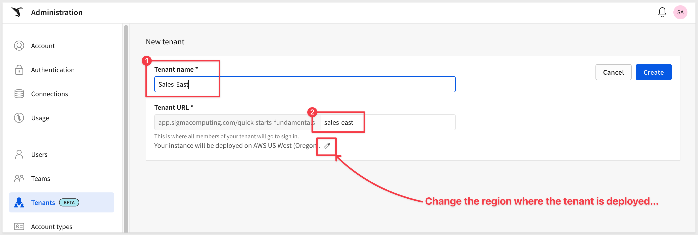

<aside class="positive">
<strong>IMPORTANT:</strong><br> The tenant can be deployed in a different cloud region to support the data residency use case. 

**This cannot be changed after creation.**
</aside>

Click `Create`:

Repeat the process for `Sales-West`.

We now have two regional sales tenants, both deployed in the AWS region `us-west-2`:

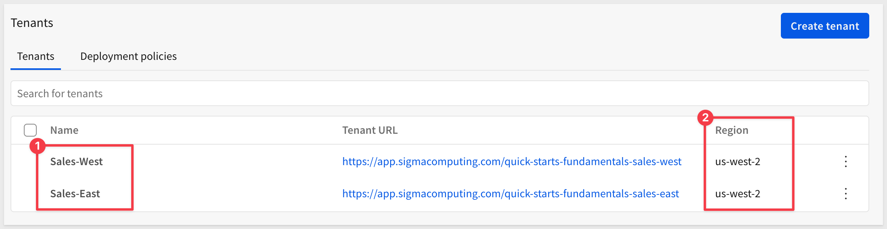

### Configure tenants
With each tenant created, we need an easy way to configure them. Sigma provides the ability for parent administrators to impersonate a tenant administrator, allowing you to set up the tenant environment without creating separate login credentials.

Open the `3-dot` menu for `Sales-East` and select `Open tenant as admin`:

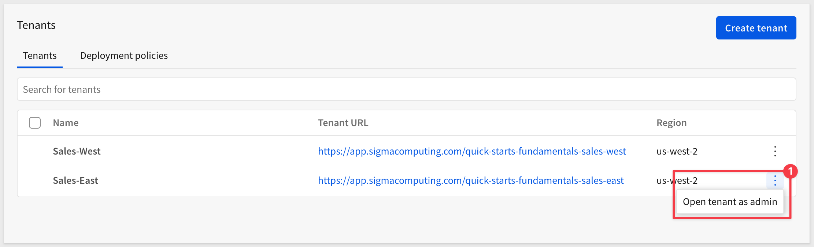

We are placed onto the Sigma landing page for `Sales-East` as if we had logged in the first time as administrator.

Note that the tenant name `sales-east` is appended to the URL:

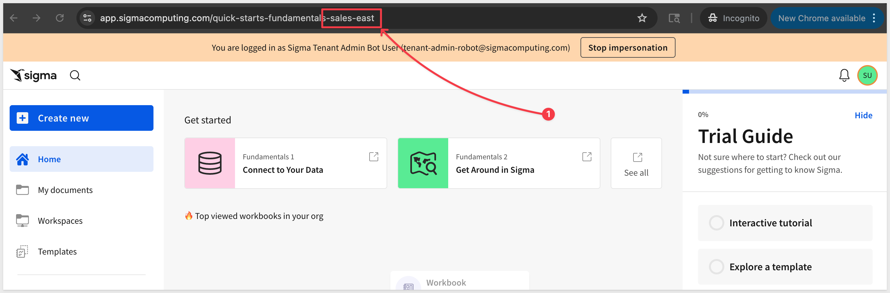

This is a completely isolated environment. Content, users, and connections created here are available only to the Sales-East tenant and not to Sales-West or any other tenant.


<!-- END OF SECTION-->

## Tenant Admin
Duration: 5

In a regional sales model, you may want to delegate administrative tasks to regional sales managers. For example, the East Regional Manager might manage users and content within the Sales-East tenant, while the West Regional Manager manages their own environment.

Since we are already impersonating `Sales-East`, we can add a tenant administrator in the same way a parent Sigma admin would. 

New tenants do not have any users (including administrators) after they are created:

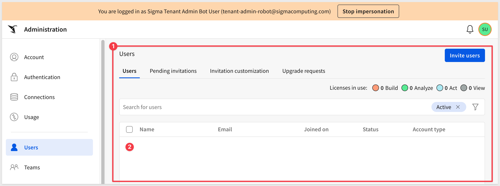

<aside class="negative">
<strong>NOTE:</strong><br> Sigma provides flexible tenant management options. You can choose to:
<ul>
<li><strong>Centralized Control</strong>: Manage all tenants entirely from the parent organization without creating tenant admins</li>
<li><strong>Delegated Management</strong>: Create tenant admins who manage their own users, content, and permissions while you maintain oversight</li>
<li><strong>Hybrid Approach</strong>: Delegate specific tasks (like user management) to tenant admins while retaining control over connections and deployments</li>
</ul>
We demonstrate tenant admin creation in this QuickStart to show the delegation capabilities. Choose the governance model that best fits your organization's needs.
</aside>

### Inviting a Tenant Admin (optional)
If we want, we can add an admin using the normal process of invitation, using an email alias so we don't need to create new email accounts.

<aside class="negative">
<strong>NOTE:</strong><br> Adding a tenant admin is optional for this QuickStart as we will be using Sigma user impersonation for testing later. We mention it here for completeness only. 
</aside>

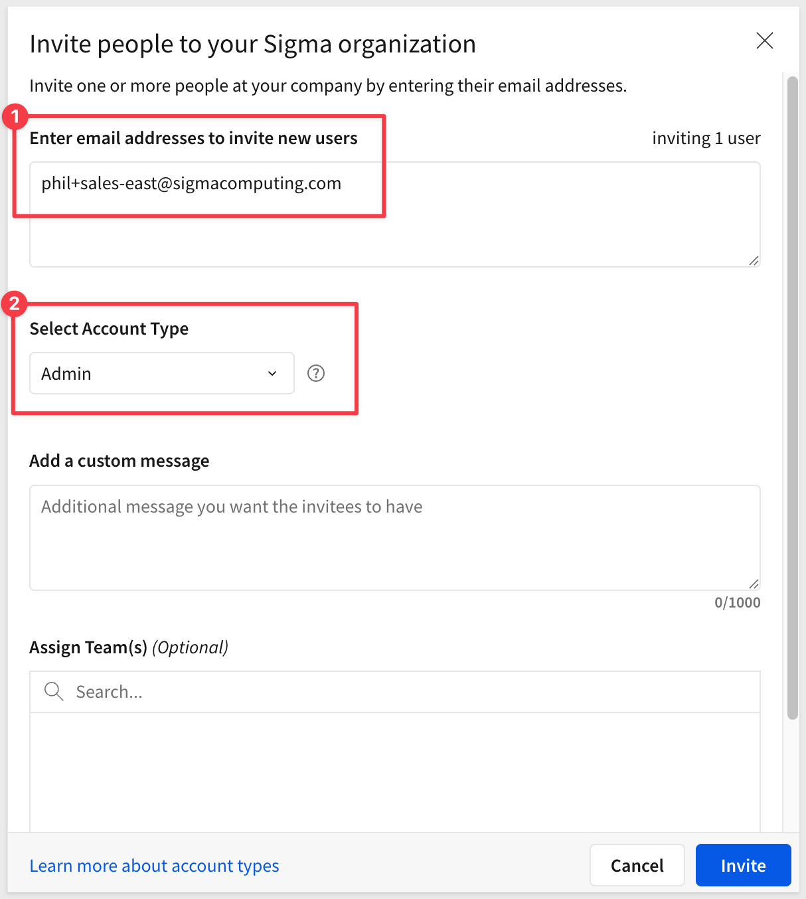

The tenant admin will receive the standard email invitation prompting them to set up their account:

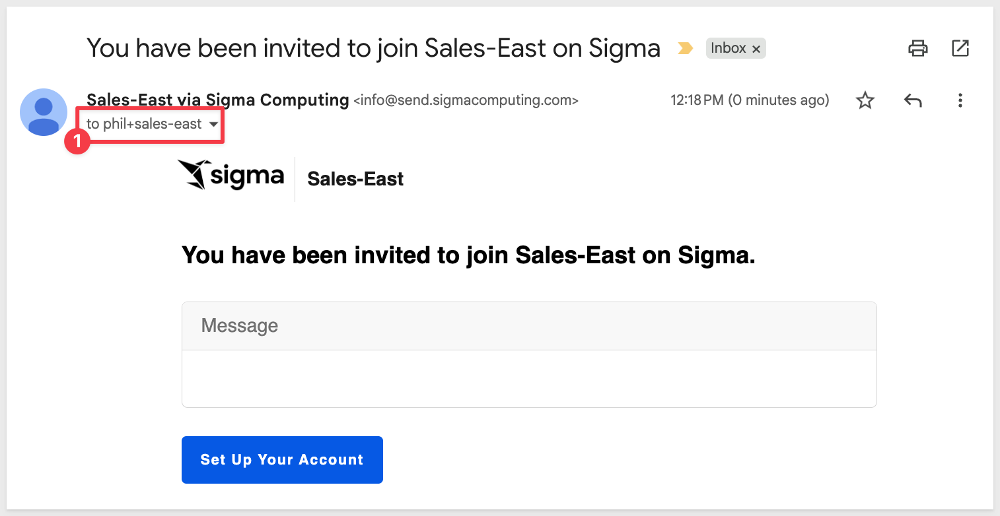

After opening the invitation and completing the new account (in a private browser so we can be logged into two Sigma sessions):

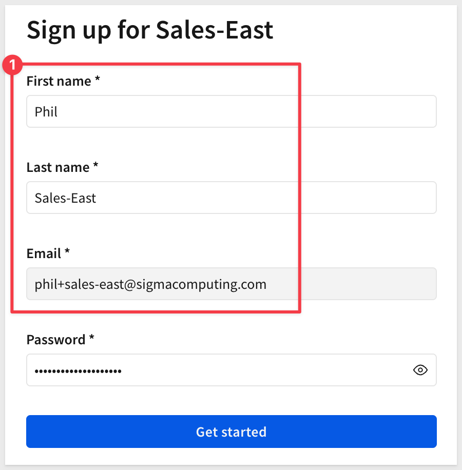

...we only see our one user:

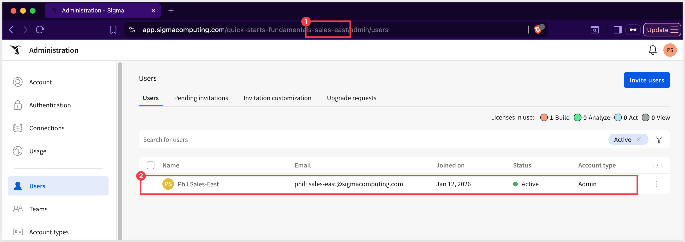

<aside class="negative">
<strong>NOTE:</strong><br> The `Tenants` feature is not available to tenant administrators.
</aside>

Click `Stop impersonation` to return to the parent Sigma instance. We can see the new admin user listed under their tenant:

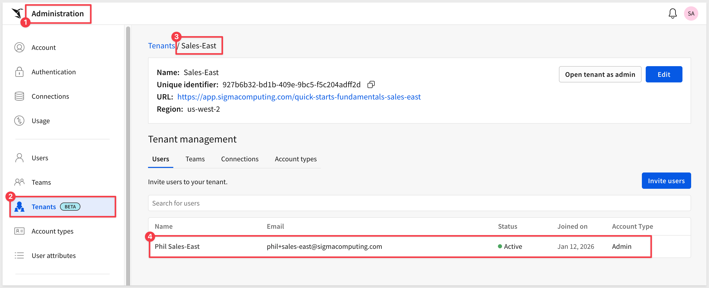

This allows the parent administrator to have visibility into tenant users and provide support if required. Details on user counts, teams, connections and account types are availble for the selected tenant.

<aside class="negative">
<strong>NOTE:</strong><br> This visibility is valuable if you're considering creating a premium service based on user counts or account types in an embedded scenario.
</aside>

For more information, see the QuickStart: [Embedding 06: Creating a Premium Service](https://quickstarts.sigmacomputing.com/guide/embedding_06_creating_a_premium_service_v3/index.html?index=..%2F..index#0)

This is also where we can `Open tenant as admin` (upper right corner) anytime the need to impersonate for a specific tenant. 


<!-- END OF SECTION-->

## Regional Sample Data
Duration: 5

To demonstrate regional sales isolation, we'll load sample store sales data for each region into separate Snowflake databases. Each tenant will connect to their own database, ensuring they only see data for their territory.

For more information, see: [Example configurations](https://help.sigmacomputing.com/docs/share-content-with-tenant-organizations#example-configurations)

We'll create two databases with identical schemas but different data:
- **SALES_EAST Database**: Contains only East region store sales data
- **SALES_WEST Database**: Contains only West region store sales data

The data is stored in CSV files on S3 and includes columns for tenant identification and store region. Each tenant will connect to their regional database, enforcing data governance at the warehouse level.

<aside class="negative">
<strong>IMPORTANT - Snowflake Authentication:</strong><br> The scripts below create Snowflake users with password authentication for simplicity in this learning environment. However, Snowflake will require key-pair authentication for service users starting in November 2025, and password authentication will no longer be supported.
<br><br>
<strong>For production implementations</strong>, use key-pair authentication instead. See the QuickStart: <a href="https://quickstarts.sigmacomputing.com/guide/security_snowflake_keypair_rotation/index.html?index=..%2F..index#0">Snowflake Key-pair Authorization</a> for implementation details.
</aside>

Log into Snowflake as `ACCOUNTADMIN`.

Open a new SQL worksheet, copy and paste the following code and click `Run All` to create the Sales-East database and load data.

This script performs the following operations:
- Creates the `SALES_EAST` database and schema
- Defines the `STORE_SALES` table structure with columns matching the CSV format
- Creates a Snowflake stage pointing to the Sales-East CSV file on S3
- Loads data from the CSV into the table
- Creates a dedicated role (`SALES_EAST_ROLE`) and user (`SALES_EAST`) with appropriate permissions
- Grants access to `ACCOUNTADMIN` role (or your service account role) for parent org workbook development
- Tests the data to verify only East region records were loaded

<aside class="positive">
<strong>NOTE:</strong><br> The script grants access to ACCOUNTADMIN for Snowflake trial accounts. If you're using a production Snowflake account with a dedicated service account (e.g., SIGMA_SERVICE_USER with SIGMA_SERVICE_ROLE), uncomment and modify the production grant examples in the script to use your actual role name instead of ACCOUNTADMIN.
</aside>

```code
// SALES-EAST REGIONAL DATABASE
// ----------------------------------------------------------------------------------------------------------
// SECTION 1: DATA CONFIGURATION
// ----------------------------------------------------------------------------------------------------------

USE ROLE ACCOUNTADMIN;
USE WAREHOUSE COMPUTE_WH;

// 1: CREATE DATABASE AND SCHEMA
CREATE OR REPLACE DATABASE SALES_EAST;
USE DATABASE SALES_EAST;

// 2: CREATE SCHEMA
CREATE SCHEMA IF NOT EXISTS SALES_EAST_SCHEMA;

// 3: CREATE TABLE SCHEMA
CREATE OR REPLACE TABLE SALES_EAST_SCHEMA.STORE_SALES (
    TENANT_NAME VARCHAR,
    "Store Region" VARCHAR,
    "Order Number" VARCHAR,
    "Date" TIMESTAMP,
    "Sku Number" VARCHAR,
    "Quantity" INT,
    "Cost" FLOAT,
    "Price" FLOAT,
    COGS FLOAT,
    "Sales" FLOAT,
    "Profit" FLOAT,
    "Profit _Margin" FLOAT,
    "Product Type" VARCHAR,
    "Product Family" VARCHAR,
    "Product Line" VARCHAR,
    "Brand" VARCHAR,
    "Product Name" VARCHAR,
    "Store Name" VARCHAR,
    "Store Key" VARCHAR,
    "Store State" VARCHAR,
    "Store City" VARCHAR,
    "Store Zip Code" VARCHAR,
    "Store Latitude" FLOAT,
    "Store Longitude" FLOAT,
    "Cust Key" INT,
    "Customer Name" VARCHAR,
    "Day" VARCHAR,
    "Week" VARCHAR,
    "Month" VARCHAR,
    "Quarter" VARCHAR,
    "Year" VARCHAR
);

// 4: CREATE STAGE FOR CSV FILE
CREATE STAGE IF NOT EXISTS SALES_EAST_STAGE
  URL='s3://sigma-quickstarts-main/embedding_2/Sales_East.csv';

// 5: CREATE CSV FILE FORMAT
CREATE OR REPLACE FILE FORMAT my_csv_format
  TYPE = 'CSV'
  FIELD_DELIMITER = ','
  SKIP_HEADER = 1
  FIELD_OPTIONALLY_ENCLOSED_BY = '"'
  ESCAPE_UNENCLOSED_FIELD = 'NONE'
  NULL_IF = ('NULL', 'null');

// 6: LOAD DATA FROM CSV
COPY INTO SALES_EAST_SCHEMA.STORE_SALES
  FROM @SALES_EAST_STAGE
  FILE_FORMAT = my_csv_format;

// 7: VERIFY DATA LOADED
SELECT * FROM SALES_EAST_SCHEMA.STORE_SALES LIMIT 10;

// ----------------------------------------------------------------------------------------------------------
// SECTION 2: ROLE AND USER CONFIGURATION
// ----------------------------------------------------------------------------------------------------------

// 1: CREATE ROLE
CREATE OR REPLACE ROLE SALES_EAST_ROLE;

// 2: CREATE USER
CREATE USER IF NOT EXISTS SALES_EAST PASSWORD = 'SALES_EAST';

// 3: GRANT ROLE TO USER
GRANT ROLE SALES_EAST_ROLE TO USER SALES_EAST;

// 4: GRANT WAREHOUSE USAGE
GRANT USAGE ON WAREHOUSE COMPUTE_WH TO ROLE SALES_EAST_ROLE;

// 5: GRANT DATABASE USAGE
GRANT USAGE ON DATABASE SALES_EAST TO ROLE SALES_EAST_ROLE;

// 6: GRANT SCHEMA USAGE
GRANT USAGE ON SCHEMA SALES_EAST_SCHEMA TO ROLE SALES_EAST_ROLE;

// 7: GRANT TABLE SELECT
GRANT SELECT ON ALL TABLES IN SCHEMA SALES_EAST_SCHEMA TO ROLE SALES_EAST_ROLE;

// 8: GRANT ACCESS FOR PARENT ORG WORKBOOK DEVELOPMENT
// This allows the parent org connection to access this tenant database for building workbooks
// For Snowflake trials: Use ACCOUNTADMIN
GRANT USAGE ON DATABASE SALES_EAST TO ROLE ACCOUNTADMIN;
GRANT USAGE ON SCHEMA SALES_EAST.SALES_EAST_SCHEMA TO ROLE ACCOUNTADMIN;
GRANT SELECT ON ALL TABLES IN SCHEMA SALES_EAST.SALES_EAST_SCHEMA TO ROLE ACCOUNTADMIN;

// For Production: Replace ACCOUNTADMIN with your service account role
// Example: GRANT USAGE ON DATABASE SALES_EAST TO ROLE SIGMA_SERVICE_ROLE;
// Example: GRANT USAGE ON SCHEMA SALES_EAST.SALES_EAST_SCHEMA TO ROLE SIGMA_SERVICE_ROLE;
// Example: GRANT SELECT ON ALL TABLES IN SCHEMA SALES_EAST.SALES_EAST_SCHEMA TO ROLE SIGMA_SERVICE_ROLE;

// ----------------------------------------------------------------------------------------------------------
// SECTION 3: TESTING
// ----------------------------------------------------------------------------------------------------------

// Verify East region data only:
SELECT TENANT_NAME, "Store Region", COUNT(*) AS ROW_COUNT
FROM SALES_EAST.SALES_EAST_SCHEMA.STORE_SALES
GROUP BY TENANT_NAME, "Store Region";
```

When done, the results should show Sales-East tenant with East region store data:

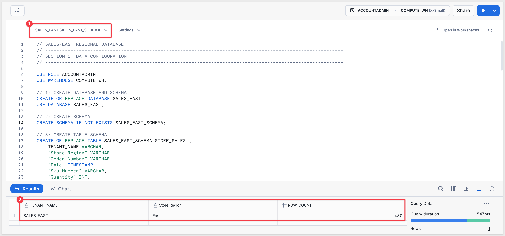

Now repeat using this script for the Sales-West region.

This script mirrors the Sales-East setup but for the West region:
- Creates the `SALES_WEST` database and schema
- Defines an identical table structure
- Loads data from the Sales-West CSV file on S3
- Creates the `SALES_WEST_ROLE` and `SALES_WEST` user
- Grants access to `ACCOUNTADMIN` role (or your service account role) for parent org workbook development
- Tests to verify only West region records were loaded

```code
// SALES-WEST REGIONAL DATABASE
// ----------------------------------------------------------------------------------------------------------
// SECTION 1: DATA CONFIGURATION
// ----------------------------------------------------------------------------------------------------------

USE ROLE ACCOUNTADMIN;
USE WAREHOUSE COMPUTE_WH;

// 1: CREATE DATABASE AND SCHEMA
CREATE OR REPLACE DATABASE SALES_WEST;
USE DATABASE SALES_WEST;

// 2: CREATE SCHEMA
CREATE SCHEMA IF NOT EXISTS SALES_WEST_SCHEMA;

// 3: CREATE TABLE SCHEMA
CREATE OR REPLACE TABLE SALES_WEST_SCHEMA.STORE_SALES (
    TENANT_NAME VARCHAR,
    "Store Region" VARCHAR,
    "Order Number" VARCHAR,
    "Date" TIMESTAMP,
    "Sku Number" VARCHAR,
    "Quantity" INT,
    "Cost" FLOAT,
    "Price" FLOAT,
    COGS FLOAT,
    "Sales" FLOAT,
    "Profit" FLOAT,
    "Profit _Margin" FLOAT,
    "Product Type" VARCHAR,
    "Product Family" VARCHAR,
    "Product Line" VARCHAR,
    "Brand" VARCHAR,
    "Product Name" VARCHAR,
    "Store Name" VARCHAR,
    "Store Key" VARCHAR,
    "Store State" VARCHAR,
    "Store City" VARCHAR,
    "Store Zip Code" VARCHAR,
    "Store Latitude" FLOAT,
    "Store Longitude" FLOAT,
    "Cust Key" INT,
    "Customer Name" VARCHAR,
    "Day" VARCHAR,
    "Week" VARCHAR,
    "Month" VARCHAR,
    "Quarter" VARCHAR,
    "Year" VARCHAR
);

// 4: CREATE STAGE FOR CSV FILE
CREATE STAGE IF NOT EXISTS SALES_WEST_STAGE
  URL='s3://sigma-quickstarts-main/embedding_2/Sales_West.csv';

// 5: CREATE CSV FILE FORMAT
CREATE OR REPLACE FILE FORMAT my_csv_format
  TYPE = 'CSV'
  FIELD_DELIMITER = ','
  SKIP_HEADER = 1
  FIELD_OPTIONALLY_ENCLOSED_BY = '"'
  ESCAPE_UNENCLOSED_FIELD = 'NONE'
  NULL_IF = ('NULL', 'null');

// 6: LOAD DATA FROM CSV
COPY INTO SALES_WEST_SCHEMA.STORE_SALES
  FROM @SALES_WEST_STAGE
  FILE_FORMAT = my_csv_format;

// 7: VERIFY DATA LOADED
SELECT * FROM SALES_WEST_SCHEMA.STORE_SALES LIMIT 10;

// ----------------------------------------------------------------------------------------------------------
// SECTION 2: ROLE AND USER CONFIGURATION
// ----------------------------------------------------------------------------------------------------------

// 1: CREATE ROLE
CREATE OR REPLACE ROLE SALES_WEST_ROLE;

// 2: CREATE USER
CREATE USER IF NOT EXISTS SALES_WEST PASSWORD = 'SALES_WEST';

// 3: GRANT ROLE TO USER
GRANT ROLE SALES_WEST_ROLE TO USER SALES_WEST;

// 4: GRANT WAREHOUSE USAGE
GRANT USAGE ON WAREHOUSE COMPUTE_WH TO ROLE SALES_WEST_ROLE;

// 5: GRANT DATABASE USAGE
GRANT USAGE ON DATABASE SALES_WEST TO ROLE SALES_WEST_ROLE;

// 6: GRANT SCHEMA USAGE
GRANT USAGE ON SCHEMA SALES_WEST_SCHEMA TO ROLE SALES_WEST_ROLE;

// 7: GRANT TABLE SELECT
GRANT SELECT ON ALL TABLES IN SCHEMA SALES_WEST_SCHEMA TO ROLE SALES_WEST_ROLE;

// 8: GRANT ACCESS FOR PARENT ORG WORKBOOK DEVELOPMENT
// This allows the parent org connection to access this tenant database for building workbooks
// For Snowflake trials: Use ACCOUNTADMIN
GRANT USAGE ON DATABASE SALES_WEST TO ROLE ACCOUNTADMIN;
GRANT USAGE ON SCHEMA SALES_WEST.SALES_WEST_SCHEMA TO ROLE ACCOUNTADMIN;
GRANT SELECT ON ALL TABLES IN SCHEMA SALES_WEST.SALES_WEST_SCHEMA TO ROLE ACCOUNTADMIN;

// For Production: Replace ACCOUNTADMIN with your service account role
// Example: GRANT USAGE ON DATABASE SALES_WEST TO ROLE SIGMA_SERVICE_ROLE;
// Example: GRANT USAGE ON SCHEMA SALES_WEST.SALES_WEST_SCHEMA TO ROLE SIGMA_SERVICE_ROLE;
// Example: GRANT SELECT ON ALL TABLES IN SCHEMA SALES_WEST.SALES_WEST_SCHEMA TO ROLE SIGMA_SERVICE_ROLE;

// ----------------------------------------------------------------------------------------------------------
// SECTION 3: TESTING
// ----------------------------------------------------------------------------------------------------------

// Verify West region data only:
SELECT TENANT_NAME, "Store Region", COUNT(*) AS ROW_COUNT
FROM SALES_WEST.SALES_WEST_SCHEMA.STORE_SALES
GROUP BY TENANT_NAME, "Store Region";
```

When done, the results should show Sales-West tenant with West region store data. Notice that Sales-West also has a few more rows:

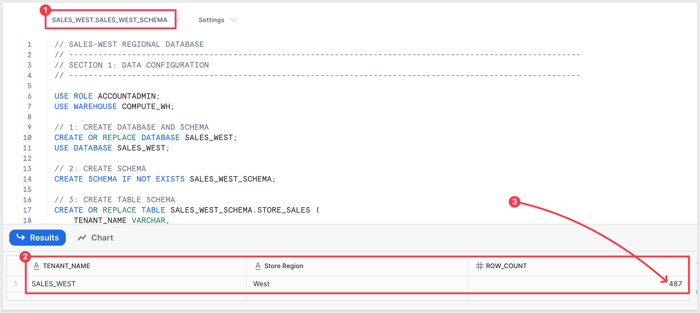

<aside class="negative">
<strong>NOTE:</strong><br> Both scripts created separate databases, roles, and user/password pairs for each regional sales team. 

The SALES_EAST and SALES_WEST credentials will be used to create isolated Sigma to Snowflake connections later.
</aside>


<!-- END OF SECTION-->

## Create Snowflake Connections
Duration: 5

Each regional sales tenant needs its own Snowflake connection pointing to its dedicated database. These connections are created inside each tenant instance. 

**We'll create these connections while impersonating each tenant administrator.**

<aside class="positive">
<strong>NOTE - Data Segregation Scenario:</strong><br> This QuickStart demonstrates tenant data segregation using <strong>separate databases within a single Snowflake account</strong> (SALES_EAST and SALES_WEST databases). This is just one of several valid approaches:
<ul>
<li><strong>Single Snowflake account, separate databases</strong> (our approach): Different database names (SALES_EAST vs SALES_WEST), potentially different schemas and tables</li>
<li><strong>Multiple Snowflake accounts</strong>: Each tenant connects to a completely separate Snowflake account (database and schema names could be identical across accounts)</li>
<li><strong>Shared database, separate schemas</strong>: Same Snowflake account and database, different schema names per tenant (e.g., PROD.TENANT_A vs PROD.TENANT_B)</li>
<li><strong>Shared schema, separate tables</strong>: Same database and schema, different table names per tenant (e.g., CLIENT_A_SALES vs CLIENT_B_SALES)</li>
</ul>
The connection swap policies support all these scenarios - choose the approach that best fits your organization's data architecture and security requirements.
</aside>

<aside class="negative">
<strong>IMPORTANT:</strong><br> Connections must be created within each tenant (via impersonation), not in the parent organization. This ensures proper data isolation between regional sales teams.
</aside>

### Sales-East Connection

Navigate to the parent Sigma instance and impersonate the `Sales-East` tenant admin (as we did in the Initial Configuration section).

Once impersonating Sales-East, go to `Administration` > `Connections` and click `Create Connection`:

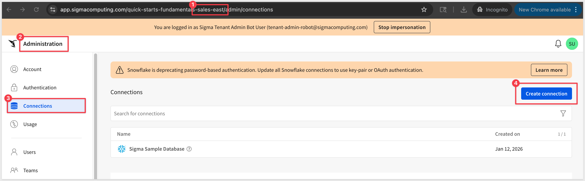


Add a new Snowflake connection using the Sales-East credentials:

```code
Name:        SALES_EAST
User:        SALES_EAST
Password:    SALES_EAST
Role:        SALES_EAST_ROLE
```

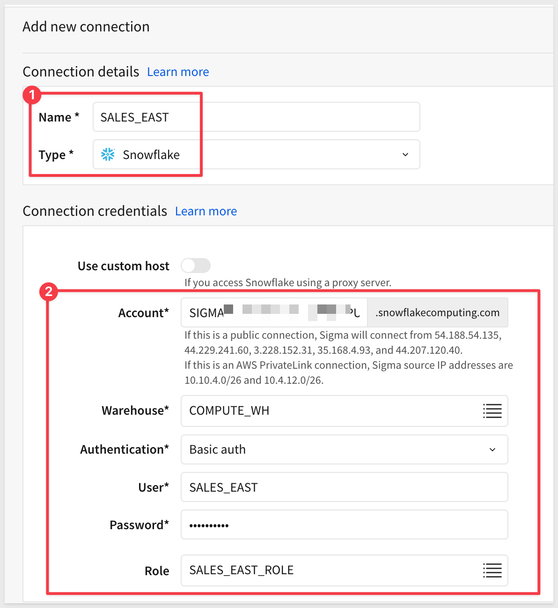

<aside class="negative">
<strong>IMPORTANT - Production Security:</strong><br> This connection uses password authentication for learning purposes. For production deployments, you must use key-pair authentication. Snowflake will require key-pair authentication for service users starting in November 2025 as part of their enhanced security requirements.
<br><br>
See the QuickStart: <a href="https://quickstarts.sigmacomputing.com/guide/security_snowflake_keypair_rotation/index.html?index=..%2F..index#0">Snowflake Key-pair Authorization</a> for implementation details.
</aside>

Once the connection is validated, copy its `Connection ID` to a text file - we'll use it later when configuring user attributes:

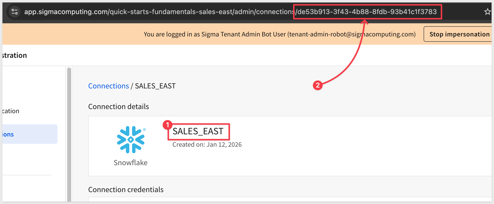

You can verify the data by clicking `Browse connection`:

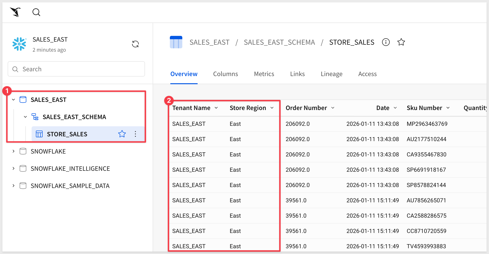

You should see the `STORE_SALES` table in the SALES_EAST_SCHEMA, showing only Sales-East tenant with East region data.

<aside class="negative">
<strong>NOTE:</strong><br> We included a `Tenant Name` column in the data only to make it easy. This is not otherwise required.
</aside>

### Sales-West Connection

Return to the parent organization (stop impersonation), then impersonate the `Sales-West` tenant admin.

Repeat the process to create a Snowflake connection for Sales-West:

```code
Name:        SALES_WEST
User:        SALES_WEST
Password:    SALES_WEST
Role:        SALES_WEST_ROLE
```

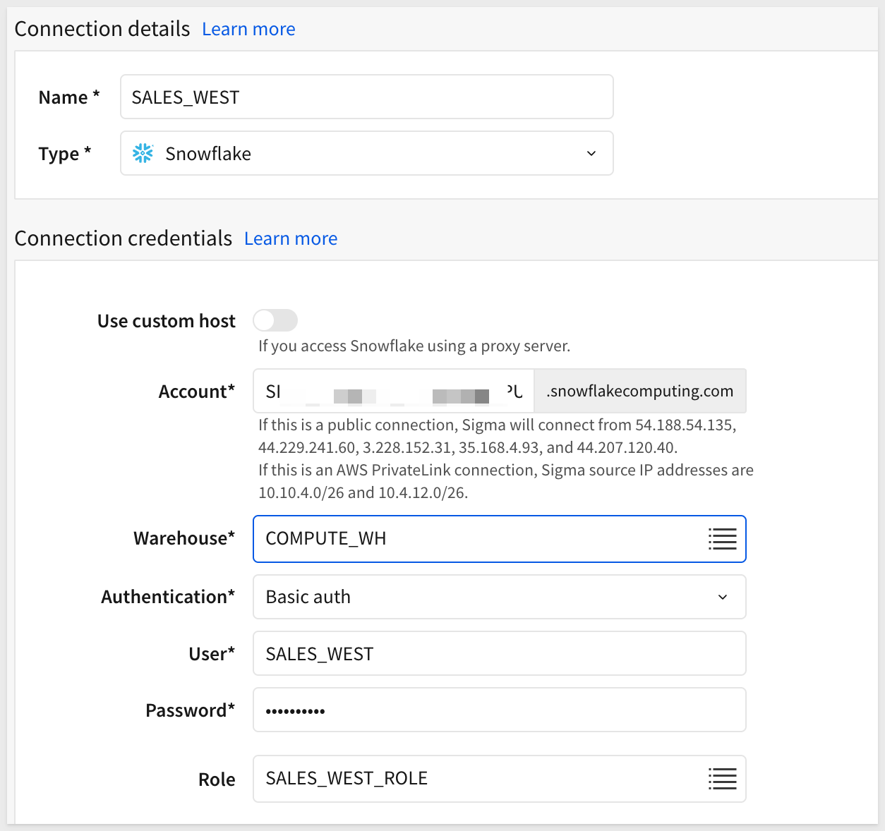

Copy the `Connection ID` for the Sales-West connection and save it for later.

You can verify that this connection only shows the `STORE_SALES` table with Sales-West tenant and West region data.

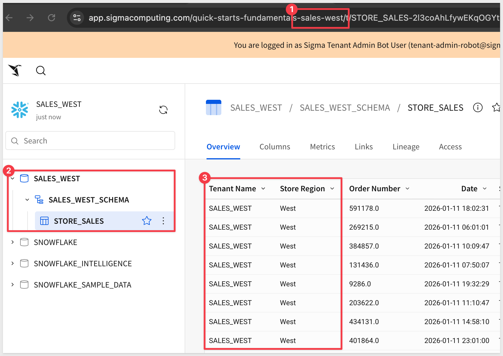


<!-- END OF SECTION-->

## Tenant User Attributes
Duration: 5

User attributes enable dynamic connection swapping when workbooks are deployed to tenants. We'll create a user attribute that maps each regional sales tenant to its specific Snowflake connection.

The user attribute maps the `Connection ID` we captured earlier to each tenant, allowing workbooks to automatically use the correct data source based on which regional sales team is accessing the content.

<aside class="negative">
<strong>NOTE:</strong><br> User attributes support assignment to users, teams, or tenants. For multitenancy, tenant-level assignment is most efficient.
<br><br>
<strong>Embedding Use Case:</strong> When embedding Sigma content in external applications, user attributes can be passed dynamically via JWT (JSON Web Token) from your host application. This enables the same connection swap mechanism to work for embedded scenarios - each customer sees only their data based on attributes passed at runtime. For example, a host application can pass a <code>customer_connection</code> attribute that automatically routes each embedded user to their organization's data connection.
<br><br>
For embedding basics, see: <a href="https://quickstarts.sigmacomputing.com/guide/embedding_01_getting_started_v3/index.html?index=..%2F..index#0">Embedding 01: Getting Started</a>
</aside>

### Create User Attributes

User attributes that map tenants to their data sources must be created in the **parent organization** (not within individual tenants).

We need to create **three user attributes** to enable complete connection swapping:
1. Connection ID (which tenant connection to use)
2. Database name (which database within that connection)
3. Schema name (which schema within that database)

In the parent Sigma instance (ensure you're not impersonating any tenant), navigate to `Administration` > `User attributes` and click `Create Attribute`.

**Create the first attribute:**

- **Name**: `regional_connection`
- **Description**: `Maps each regional sales tenant to their Snowflake connection ID`
- **Default value**: Leave blank

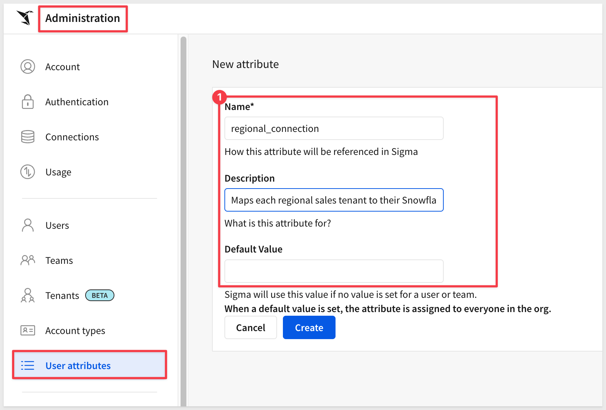


**Create the second attribute:**

- **Name**: `regional_database`
- **Description**: `Maps each regional sales tenant to their Snowflake database name`
- **Default value**: Leave blank

**Create the third attribute:**

- **Name**: `regional_schema`
- **Description**: `Maps each regional sales tenant to their Snowflake schema name`
- **Default value**: Leave blank

### Assign attributes to tenants
Now we need to assign all three user attribute values to each tenant.

**Assign regional_connection:**
Click on the `regional_connection` user attribute, then click the `Tenants Assigned` tab and click `Assign Attribute to Tenants`.

A modal appears where you can search and select the tenant to configure.

Select `Sale_East` and paste the `Connection ID` you saved earlier for the Sales-East connection. Repeat for `Sales-West`:

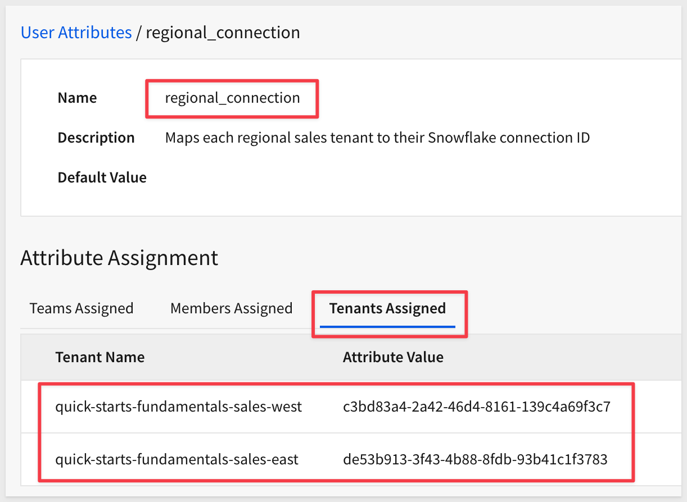

Click `Assign`.

**Assign regional_database:**

Navigate back to `User attributes`, click on `regional_database`, then click the `Tenants Assigned` tab and `Assign Attribute to Tenants`.

Select the `Sales-East` tenant and enter the database name `SALES_EAST`. Repeat for `SALES_WEST`.

Click `Assign`.

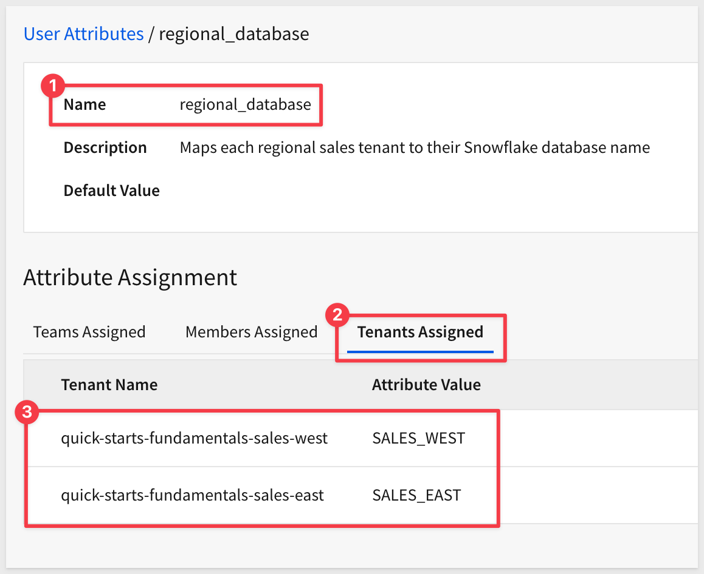

**Assign regional_schema:**

Navigate back to `User attributes`, click on `regional_schema`, then click the `Tenants Assigned` tab and `Assign Attribute to Tenants`.

Select the `Sales-East` tenant and enter the schema name `SALES_EAST_SCHEMA`. Repeat for `SALES_WEST_SCHEMA`:

Click `Assign`.

When done, each tenant should have all three attribute values configured. You can verify by viewing each user attribute and checking the `Tenants Assigned` tab.

Now we can create the connection swap policy that will use these user attributes to dynamically route data queries.


<!-- END OF SECTION-->

## Connection Swap Policy
Duration: 5

A connection's source swap policy dynamically replaces a table source based on predefined rules when users evaluate a workbook.

This is particularly useful in multitenant configurations. When you deploy a workbook from the parent organization to tenant organizations, the swap policy automatically routes each tenant to their appropriate data connection using the user attributes we configured earlier.

But what about the users who are building content at the parent level on behalf of tenants?

<aside class="positive">
<strong>NOTE - Parent Org Content Creators:</strong><br> Users in the parent organization who build workbooks for tenant deployment need:
<ul>
<li><strong>Account Type:</strong> Builders or Admin (users who create workbooks)</li>
<li><strong>Connection Access:</strong> Permission to use the source connection (Regional Sales Data) for building workbooks</li>
<li><strong>Team Assignment:</strong> Typically part of a centralized BI/Analytics team in the parent org</li>
</ul>
These parent org users are users who build and publish workbooks that will be deployed to tenants. They are NOT tenant users—tenant users only consume the deployed workbooks and never see or access the parent organization.
<br><br>
This separation allows a central team to maintain and version workbooks while each tenant gets isolated access to only their data through the deployed copies.
</aside>

<aside class="negative">
<strong>NOTE:</strong><br> Connection source swap policies are supported on Snowflake and Databricks connections at the time of this QuickStart.
</aside>

### Create Source Connection in Parent Org
So far we've created two connections—one in each tenant (Sales-East and Sales-West). Now we will create a third connection **in the parent organization** that serves as the "source" connection in the parent org for building workbooks.

When you create a workbook in the parent org, it will use this source connection. When that workbook deploys to tenants, the swap policy automatically replaces this source connection with each tenant's actual connection.

Navigate to `Administration` > `Connections` in the parent organization (ensure you're not impersonating any tenant).

Click `Create Connection` and add a Snowflake connection with the following configuration:

```code
Name:        Regional Sales Data
User:        [Your Snowflake admin or service account username]
Password:    [Your password] OR use Key-Pair Authentication
Role:        [ACCOUNTADMIN or your service role, e.g., SIGMA_SERVICE_ROLE]
```

<aside class="positive">
<strong>NOTE - Source Connection Credentials:</strong><br>
<strong>Snowflake Trial Users:</strong> Use your ACCOUNTADMIN credentials with password authentication.
<br><br>
<strong>Production Users:</strong> Use your dedicated Sigma service account credentials (e.g., SIGMA_SERVICE_USER with SIGMA_SERVICE_ROLE) and key-pair authentication. Ensure you modified the grant statements in the earlier Snowflake scripts to grant access to your service role instead of ACCOUNTADMIN. This service account should have read access to <strong>all tenant databases</strong>, which allows workbook developers in the parent organization to:
<ul>
<li>Build and test workbooks using actual data from multiple tenants</li>
<li>Validate that connection swapping works correctly across all tenant data structures</li>
<li>Preview data from different regions during development</li>
</ul>
The grants you added in the earlier Snowflake scripts to your service role (or ACCOUNTADMIN for trials) provide this access.
</aside>

Click `Create`.

### Configure Swap Policy
Once the connection is created and validated, click `Source swap policies` (scroll down the left sidebar in `Administration`) and click `Create policy`.

Configure the swap policy:

Click `+ Add source swap policy`.

A `New source swap policy (deployment)` dialog opens. Configure it:

**Policy name:** `regional_connection`<br>
**From:** Select `Regional Sales Data` (the parent connection we created)<br>
**To:** Select `regional_connection`, the user attribute to use for swapping (this determines which tenant connection to use)<br>

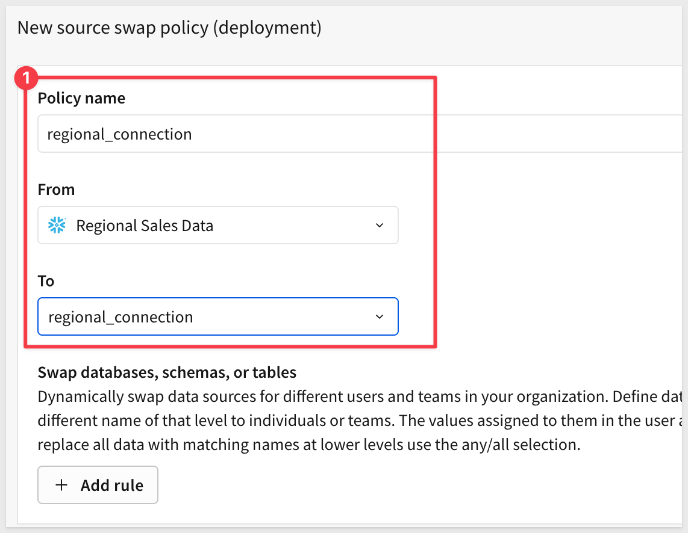

Click `+ Add rule` to define the swap rule:

**From:**
- Database: `SALES_EAST`<br>
- Schema: `SALES_EAST_SCHEMA`<br>
- Table: `STORE_SALES`<br>

**To:**
- Database: Select `User attribute` and choose `regional_database`<br>
- Schema: Select `User attribute` and choose `regional_schema`<br>
- Table: Enter `STORE_SALES` (fixed name - same across all tenants in this case)<br>

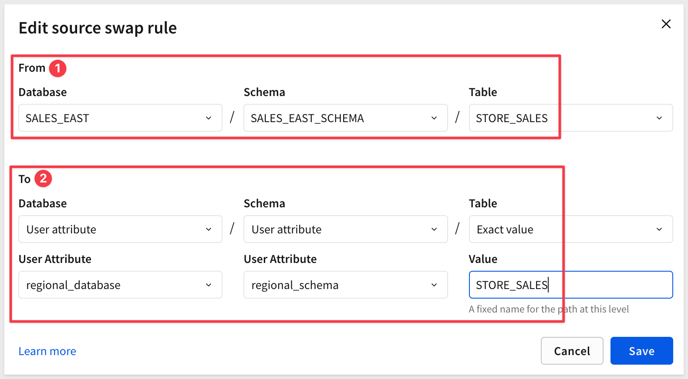

<aside class="positive">
<strong>NOTE - Data Segregation Flexibility:</strong><br> Source swap policies support multiple data segregation strategies to accommodate how different organizations structure their tenant data:

<ul>
<li><strong>Separate Databases</strong>: Swap entire connections (our approach - SALES_EAST database vs SALES_WEST database)</li>
<li><strong>Shared Database, Separate Schemas</strong>: Swap schema names within the same database (e.g., PROD.TENANT1 vs PROD.TENANT2)</li>
<li><strong>Shared Schema, Separate Tables</strong>: Swap only table names (e.g., PROD.SHARED.TENANT1_DATA vs PROD.SHARED.TENANT2_DATA)</li>
<li><strong>Mixed Paths</strong>: Combine different swap levels (e.g., DEV.SCHEMA.TABLE → PROD.SCHEMA.TABLE for environment promotion)</li>
<li><strong>Per-Tenant Configuration</strong>: Define different swap rules for different tenants within the same policy</li>
</ul>

These flexible swap rules eliminate the need for custom SQL parameters to handle tenant data segregation. A single swap policy can support all your workbooks regardless of how tenant data is structured in your warehouse.
</aside>

** Be sure to click `Save`.

### How It Works

When you deploy a workbook that uses the `Regional Sales Data` connection:

1. **In the parent org**: The workbook connects to `Regional Sales Data` → SALES_EAST → SALES_EAST_SCHEMA → STORE_SALES

2. **When deployed to Sales-East tenant**: The swap policy automatically routes the query using three user attributes:
   - **Connection**: Swaps to the Sales-East connection ID (from `regional_connection` user attribute)
   - **Database**: Swaps to SALES_EAST (from `regional_database` user attribute)
   - **Schema**: Swaps to SALES_EAST_SCHEMA (from `regional_schema` user attribute)
   - **Table**: STORE_SALES (remains the same)

3. **When deployed to Sales-West tenant**: The swap policy automatically routes the query using:
   - **Connection**: Swaps to the Sales-West connection ID (from `regional_connection` user attribute)
   - **Database**: Swaps to SALES_WEST (from `regional_database` user attribute)
   - **Schema**: Swaps to SALES_WEST_SCHEMA (from `regional_schema` user attribute)
   - **Table**: STORE_SALES (remains the same)

This ensures that each regional sales team only sees their own data, even though they're using the same workbook. The swap happens dynamically at query time based on which tenant is viewing the workbook.


<!-- END OF SECTION-->

## Shared Workbook
Duration: 5

Now we'll create a workbook in the parent organization that will be shared with both regional sales tenants.

This workbook uses the `Regional Sales Data` source connection, which will automatically swap to each tenant's specific connection, database, and schema when deployed—routing Sales-East to their data and Sales-West to theirs.

### Create the Workbook
In the parent organization (not impersonating any tenant), navigate to `Home` and click `Create New` > `Workbook`.

Click `Add new` > `Table` and select the `Regional Sales Data` connection we created earlier.

Browse to `SALES_EAST` > `SALES_EAST_SCHEMA` and select the `STORE_SALES` table:

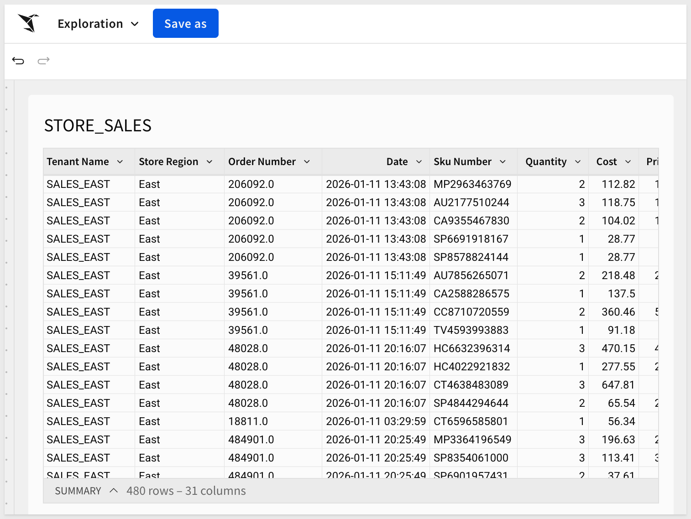

<aside class="positive">
<strong>NOTE:</strong><br> We're browsing to SALES_EAST database here for building the workbook in the parent org. When deployed to tenants, the swap policy will automatically route each tenant to their respective database based on their user attributes (as explained in the previous section).
</aside>

Click `Publish` in the top right and name the workbook `Multi_Tenant_QuickStart` and save it to a folder accessible in the parent organization.

<aside class="negative">
<strong>IMPORTANT:</strong><br> Make sure the workbook is published before deploying it to tenants. Only published workbooks can be deployed.
</aside>

The workbook is now ready to be deployed to the Sales-East and Sales-West tenants.

When deployed, the swap policy will dynamically route each tenant to their respective connection, database, and schema—ensuring complete data isolation at the warehouse level.


<!-- END OF SECTION-->

## Deployment
Duration: 5

Deployment policies enable **automatic distribution** of content from the parent organization to selected tenant organizations. Once you add content to a deployment policy and share it with tenants, Sigma automatically creates copies in each tenant's workspace—no manual deployment action required.

When deployed, the connection swap policy **automatically** routes each tenant to their appropriate data connection.

### Create Deployment Policy
In the parent organization, navigate to `Administration` > `Tenants` > `Deployments policies` (tab next to `Tenants`).

Click `Create deployment policy`.

Configure the deployment policy as:<br>
- **Name:** `Regional Sales Deployment`<br>
- **Use a different name in tenants:** Leave unchecked (workbook will keep same name)<br>
- **Version tag:** Select `Published`<br>
- **Swap data sources:** Enable this toggle (should be on)<br>

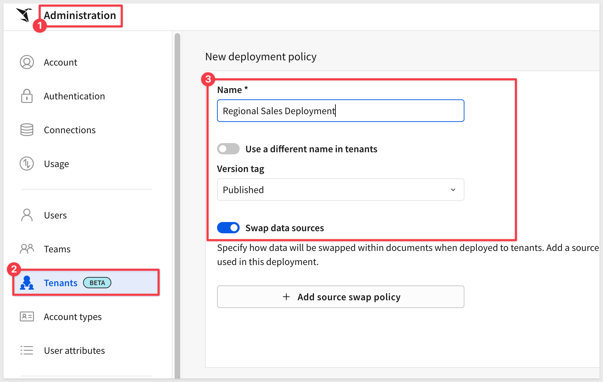

Click `+ Add source swap policy`.

Select the `regional_connection` policy we created earlier:


Click `Create` to create the deployment policy.

### Add Workbook and Share with Tenants
Once the deployment policy is created, you'll add content to the policy and share them with tenants:

Click `Add document`:

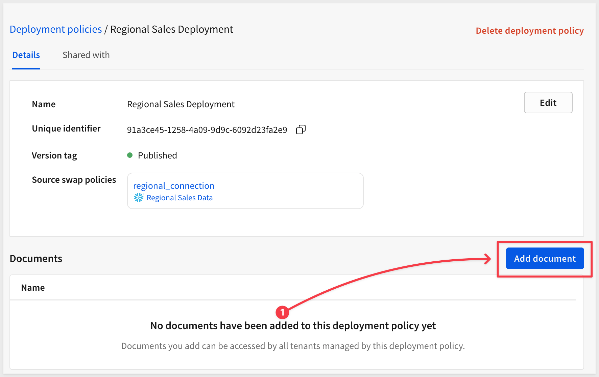

Select the `Multi_Tenant_QuickStart` from the `Recent` list and click `Add`.

**Share with Tenants**

Click the `Shared with` tab and the `Add tenant` button. Add both tenants we created earlier:

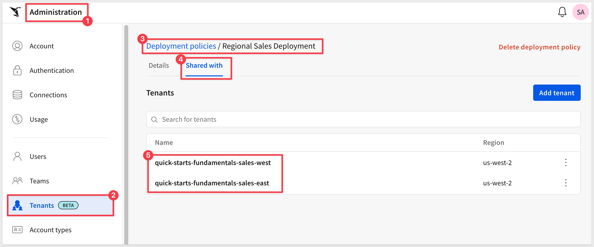

<aside class="positive">
<strong>NOTE - Automatic Deployment:</strong><br> As soon as you add tenants in the "Shared with" tab, Sigma <strong>automatically deploys</strong> the workbook to those tenants' workspaces. There's no separate "Deploy" button to click—the deployment happens immediately and automatically.
<br><br>
Future updates to the workbook will also deploy automatically based on the version tag configured in the deployment policy. For example, when you publish a new version of the workbook with the "Published" tag, it will automatically sync to all tenants in this deployment policy.
</aside>

### Check for Deployment Errors
After adding tenants, Sigma automatically creates copies of the workbook in each tenant organization.

If any deployments fail, you can check for errors in the deployment policy's `Errors` tab:

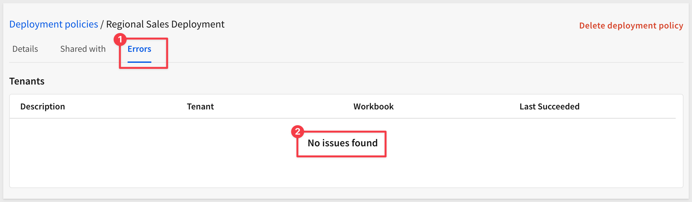


<!-- END OF SECTION-->

## Validation
Duration: 5

Now we'll verify that the connection swap policy is working correctly by impersonating each tenant and confirming they see only their regional data.

### Test Sales-East Tenant

From the parent organization, impersonate the Sales-East tenant using `Administration` > `Tenants` as before.

Navigate to the `Regional Sales Deployment` workspace where the `Multi_Tenant_QuickStart` workbook was deployed:

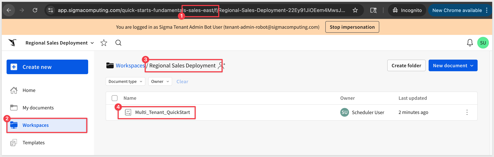

Open the workbook and verify:
- The dashboard loads successfully
- The TENANT_NAME shows `Sales-East`
- The `Store Region` column shows only `East` values

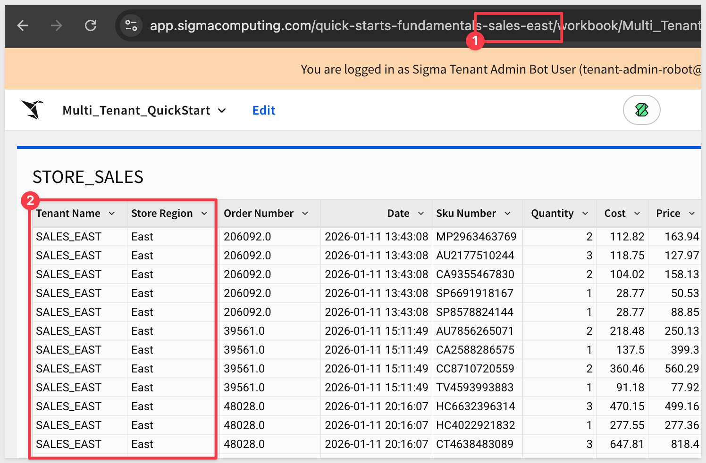

Stop impersonation.

### Test Sales-West Tenant
Now impersonate the Sales-West tenant.

Open the same `Multi_Tenant_QuickStart` workbook in the Sales-West tenant.

It will show the expected Sales_West data:

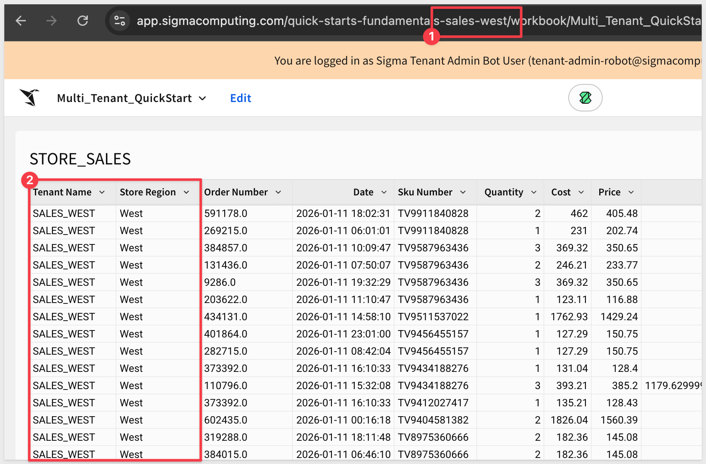

<aside class="positive">
<strong>SUCCESS!</strong><br> If both tenants see only their respective regional data, your Sigma Tenants configuration is working correctly. The connection swap policy is automatically routing each tenant to their appropriate database.
</aside>

### What Just Happened?
When you opened the workbook in each tenant:

1. **Sales-East**: The `Regional Sales Data` connection swapped to the `Sales-East` connection → queries `SALES_EAST.SALES_EAST_SCHEMA.STORE_SALES` → shows only `Sales-East` tenant with East region data

2. **Sales-West**: The same connection swapped to the Sales-West connection → queries `SALES_WEST.SALES_WEST_SCHEMA.STORE_SALES` → shows only `Sales-West` tenant with `West` region data

This demonstrates **warehouse-level data security** - each tenant is restricted to their data through separate Snowflake databases and roles, not just Sigma permissions.


<!-- END OF SECTION-->

## Applying Sigma Tenants to Other Use Cases
Duration: 5

The features you've learned in this QuickStart—tenant creation, user attributes, connection swap policies, and deployments—apply to all four Sigma Tenants use cases. Here's how to adapt what you've built:

### SDLC (Software Development Lifecycle)

**Scenario**: Separate Dev, QA, and Production environments

**How to Apply:**

1. **Tenant Setup**: Create three tenants: `Development`, `QA`, and `Production`

2. **Data Strategy**: All environments connect to the **same data structure**, but different instances:
   - Dev → `DEV_DATABASE` (test/sample data)
   - QA → `QA_DATABASE` (staging data)
   - Prod → `PROD_DATABASE` (production data)

3. **User Attributes**: Create `environment_connection`, `environment_database`, `environment_schema` mapping each environment to their data paths

4. **Swap Policy**: Same as we built—swap connection, database, and schema based on user attribute values

5. **Version Tags**: Tag your workbooks to control promotion through environments:
   - **Development**: Tag workbooks in progress as `Development`
   - **Published**: Tag tested workbooks as `Published` (ready for QA)
   - **Production**: Tag validated workbooks as `Production` (ready for Prod)

6. **Deployment Policies**: Create separate deployment policies for each environment that target specific version tags:
   - **Dev Deployment Policy**: Version tag = `Development` → deploys to Dev tenant
   - **QA Deployment Policy**: Version tag = `Published` → deploys to QA tenant
   - **Prod Deployment Policy**: Version tag = `Production` → deploys to Prod tenant

7. **Promotion Workflow**:
   - Develop and test workbook in parent org
   - Tag as `Development` → auto-deploys to Dev tenant
   - After Dev testing, change tag to `Published` → auto-deploys to QA tenant
   - After QA validation, change tag to `Production` → auto-deploys to Prod tenant
   - **Check for errors** in each deployment policy's `Errors` tab if promotion fails

**Key Difference**: Same data schema across environments, focus on content promotion and testing workflows using version tags to control deployment lifecycle.

### Data Residency

**Scenario**: Comply with regional data regulations (EU, US, APAC)

**How to Apply:**

1. **Tenant Setup**: Create regional tenants: `EU-Region`, `US-Region`, `APAC-Region`
2. **Data Strategy**: Each region connects to **geographically isolated** warehouses:
   - EU → Snowflake account in EU (Frankfurt, Ireland)
   - US → Snowflake account in US (Virginia, Oregon)
   - APAC → Snowflake account in APAC (Singapore, Sydney)
3. **User Attributes**: Create `region_connection` mapping regions to their warehouse connections
4. **Swap Policy**: Same mechanism—swap based on user's region attribute
5. **Deployment**: Deploy same analytics to all regions, data stays in respective jurisdictions
6. **Compliance**: Each tenant's data never leaves its geographic boundary

**Key Difference**: Focus on geographic data isolation and regulatory compliance, not functional data differences.

### Embed (Delegation & Sharing)

**Scenario**: Provide each customer their own isolated analytics environment

**How to Apply:**

1. **Tenant Setup**: Create one tenant per customer: `Customer-Acme`, `Customer-GlobalCorp`, etc.
2. **Data Strategy**: Each customer has their own database/schema:
   - Acme → `CUSTOMER_ACME` schema or database
   - GlobalCorp → `CUSTOMER_GLOBALCORP` schema or database
3. **User Attributes**: Create `customer_connection` mapping each customer tenant to their connection ID
4. **Swap Policy**: Same pattern—swap based on customer's user attribute
5. **Deployment**: Deploy standard dashboards to all customers, each sees only their data
6. **Scaling**:
   - Use Sigma's embedding API to generate signed URLs for customer users
   - Automatically create new tenants as customers onboard
   - Check deployment policy `Errors` tabs to identify any failed customer deployments

**Key Difference**: Many tenants (one per customer), combined with embedding for external user access.

### Common Pattern Across All Use Cases

Regardless of the use case, the workflow is:

1. **Create isolated tenants** (different purposes: regions, environments, customers, business units)
2. **Configure data connections** specific to each tenant's needs
3. **Map tenants to connections** via user attributes
4. **Set up connection swap policies** for automatic routing
5. **Deploy content once, render dynamically** for each tenant
6. **Manage centrally** from parent organization (check deployment policy `Errors` tabs for troubleshooting)

The same features enable different organizational patterns—what changes is the **semantic meaning** of tenants and the **data isolation strategy**, not the technical implementation.


<!-- END OF SECTION-->

## What we've covered
Duration: 5

In this QuickStart, we demonstrated **Business Unit Isolation** using Sigma Tenants with a regional sales team scenario.

**Key Concepts Covered:**

- **Sigma Tenants Architecture**: Creating and managing isolated tenant organizations (Sales-East and Sales-West) within a single Sigma instance
- **Tenant Impersonation**: Accessing tenant environments as an administrator without separate credentials
- **Warehouse-Level Security**: Using separate Snowflake databases to enforce data isolation at the database level, ensuring each region only queries their permitted data
- **Connection Swap Policies**: Automatically routing tenants to their specific data connections using user attributes
- **User Attributes**: Mapping tenants to connection IDs for dynamic content rendering
- **Workbook Deployments**: Pushing shared dashboards from parent to multiple tenants with automatic connection swapping

**What You Built:**

1. Two tenant organizations representing regional sales teams
2. Separate Snowflake databases with regional sample data loaded from CSV files (East and West regions)
3. Separate Snowflake roles and users for each region
4. Tenant-specific connections to their dedicated databases
5. Three user attributes (`regional_connection`, `regional_database`, `regional_schema`) mapping tenants to their data paths
6. A connection swap policy enabling automatic data routing across connection, database, and schema
7. A shared dashboard deployed to both tenants showing region-specific data

**Business Value:**

This architecture enables organizations to:
- Share standardized analytics across teams while maintaining strict data boundaries
- Enforce data governance at the warehouse level, not just the BI layer
- Manage content centrally while giving each team their own isolated environment
- Scale efficiently by deploying once to multiple tenants
- Delegate tenant administration to regional managers

**Next Steps:**

- Explore other Sigma Tenants use cases (SDLC, Data Residency, Embed)
- Configure auto-sync for deployments to keep tenants updated automatically
- Add more complex connection swap policies with conditional logic
- Integrate with your organization's SSO for tenant user management 

**Additional Resource Links**

[Blog](https://www.sigmacomputing.com/blog/)<br>
[Community](https://community.sigmacomputing.com/)<br>
[Help Center](https://help.sigmacomputing.com/hc/en-us)<br>
[QuickStarts](https://quickstarts.sigmacomputing.com/)<br>

Be sure to check out all the latest developments at [Sigma's First Friday Feature page!](https://quickstarts.sigmacomputing.com/firstfridayfeatures/)
<br>

[](https://twitter.com/sigmacomputing)&emsp;
[](https://www.linkedin.com/company/sigmacomputing)&emsp;
[](https://www.facebook.com/sigmacomputing)


<!-- END OF WHAT WE COVERED -->
<!-- END OF QUICKSTART -->
