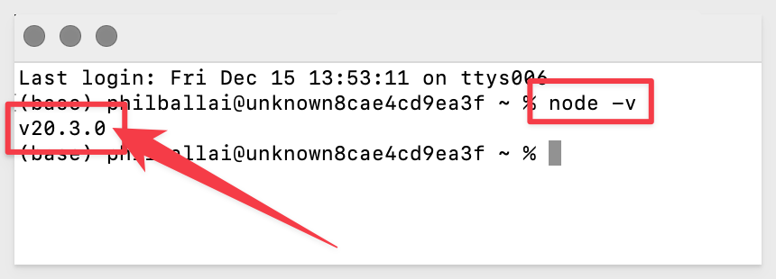
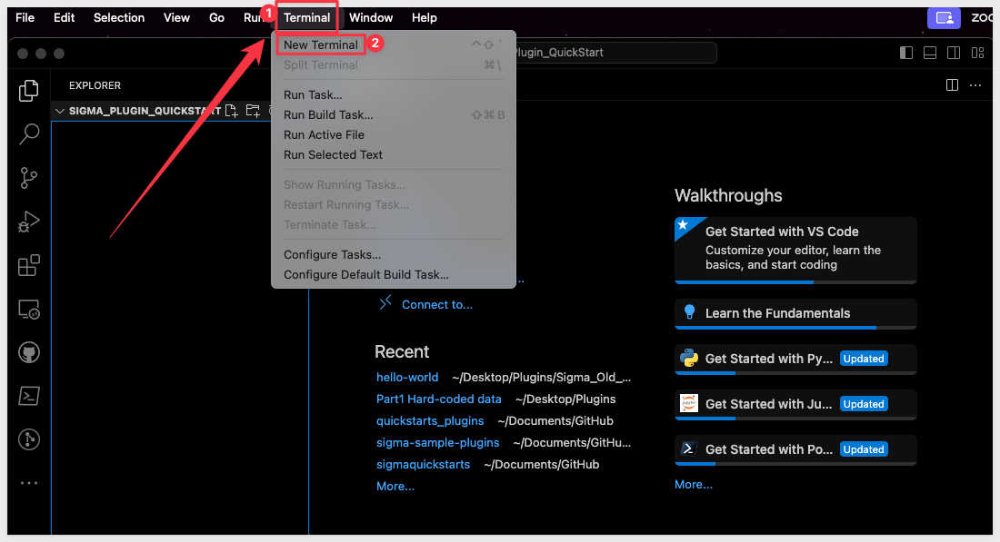
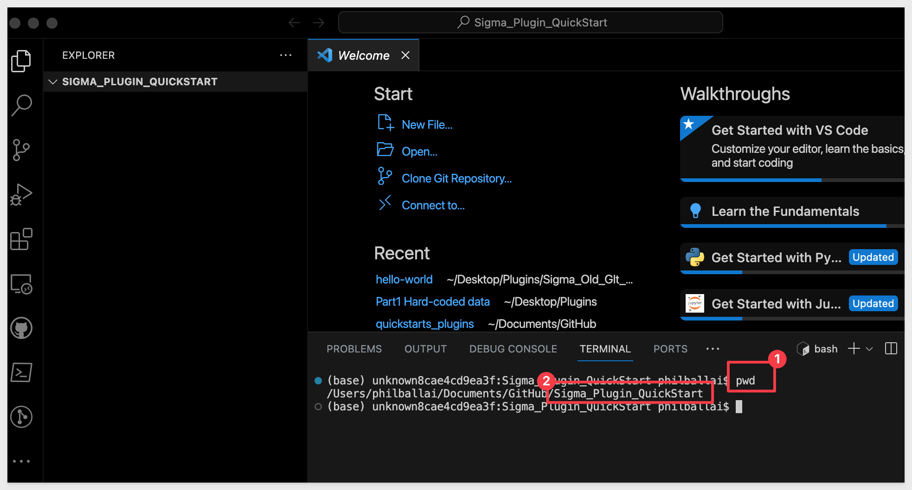
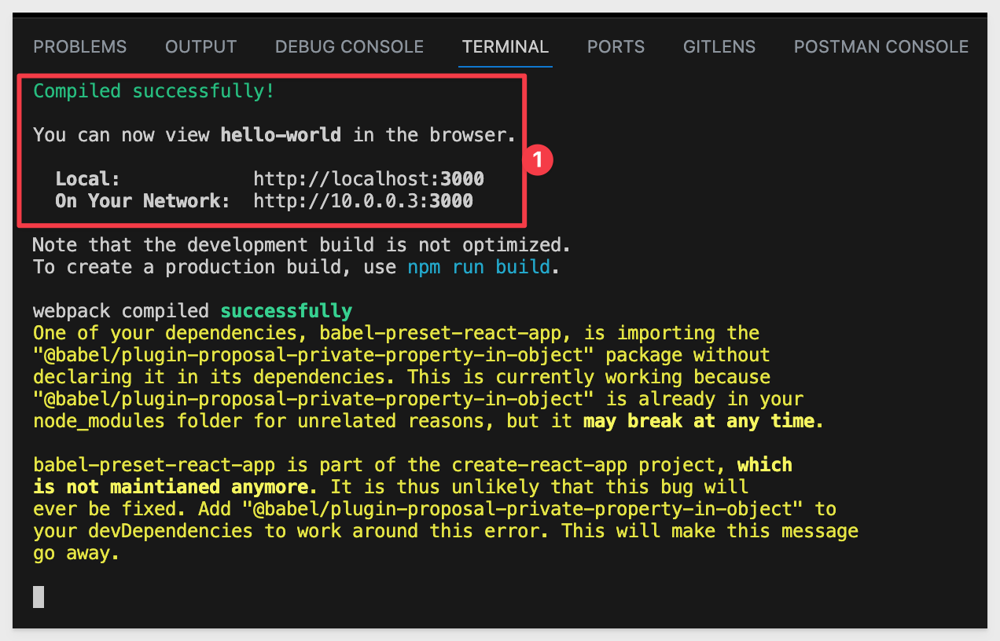
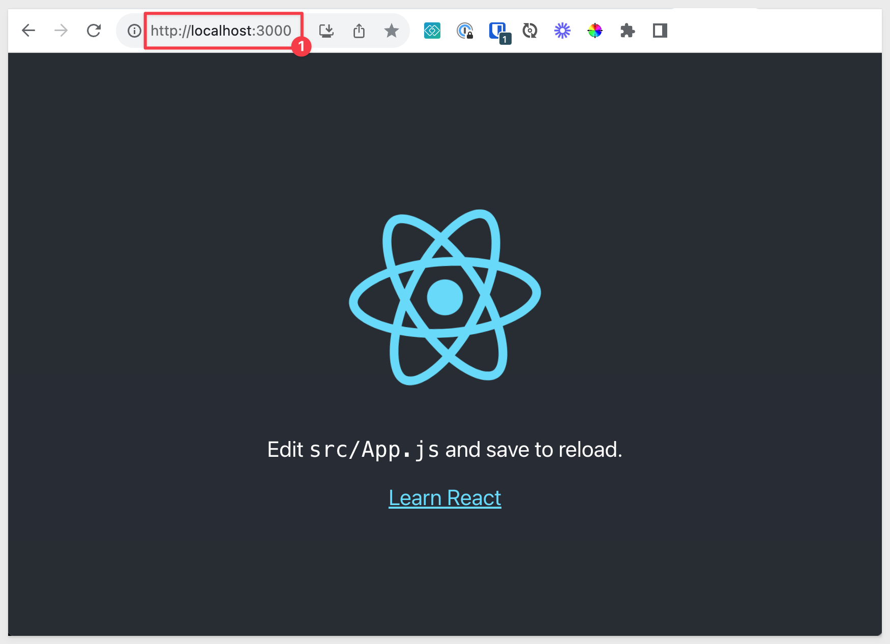

author: pballai
id: administration_plugins
summary: administration_plugins
categories: Administration
environments: web
status: Published
feedback link: https://github.com/sigmacomputing/sigmaquickstarts/issues
tags: default
lastUpdated: 2023-12-9

# Extend Sigma with Plugins

## Overview 
Duration: 5 

This QuickStart is designed to help both the experienced developer as well as those who never worked with open source charting libraries. Feel free to skip sections that do not apply to you.

In either case we assume you have some experience with software development, even if only a little. 

<aside class="negative">
<strong>NOTE:</strong><br> Not every step will be shown in detail although we will make it as simple as possible so that you can build an working example.
</aside>

### Why use a plugin?
There are times when Sigma (or any analytics platform) will not have the visualization a use case requires, or the one that is available is not able to be customized to the extent that is required.

The choice to build a custom plugin for use in Sigma has some considerations that customers should be aware of:

<li>
  <li>Does the development team have the skills and resources available to manage the on-going iterations and support that analytics applications often require?</li>
  <li>Will a 3rd party component meet all the specific project requirements?</li>
  <li>How easy will the visualization integrates into the workflow?</li>
  <li>Can the 3rd party component connect to the data?</li>
</li>

Custom chart building offers unparalleled flexibility and customization but requires more technical expertise and development effort.

In contrast, Sigma provides quick, user-friendly solutions with far less technical overhead.

In cases like this, developing a plugin is a viable option for many customers.

We will make use of the two popular charting libraries; open source:[D3.js](https://d3js.org/) and commercial: [Highcharts.js](https://www.highcharts.com/)

There are many others including Chart.js, Apache ECharts

<aside class="positive">
<strong>IMPORTANT:</strong><br> The information provided here is meant to demonstrate the basic techniques to creating and deploying a Sigma plugin. The actual development of any plugin is solely the customer's responsibility.
</aside>

### Target Audience
Programmers who want to enhance Sigma's functionality using third-party plugins.

### Prerequisites

<ul>
  <li>A computer with a current browser. It does not matter which browser you want to use.</li>
  <li>Access to your Sigma environment.</li>
  <li>Some familiarity with Sigma is assumed. Not all steps will be shown as the basics are assumed to be understood.</li>
  <li>A development environment (or RTE) of your choice. In this QuickStart we use Microsoft VSCode with related extensions.</li>
</ul>

<aside class="postive">
<strong>IMPORTANT:</strong><br> Sigma recommends that you use non-production resources when doing QuickStarts.
</aside>

<button>[Sigma Free Trial](https://www.sigmacomputing.com/free-trial/)</button>

<aside class="negative">
<strong>NOTE:</strong><br> We will use the React framework for serving of our plugin code, on our local computer. You do not need to know how to use React to complete this QuickStart and we will indicate what sections of code are Sigma and which are React. The choice of front-front end framework to use is up to the developer to decide. 
</aside>
  
### What You’ll Learn
How to .......

### What You’ll Build


<!-- NOTE: SIGMA LOGO REQUIRED AT END OF EACH ## SECTION -->
<!-- END OF OVERVIEW -->

## How Does This Work?


<!-- END OF SECTION-->

## Create Local Development Environment
Duration: 20

We will use VSCode for development and will demonstrate based on that. You may use whatever development environment to develop custom Sigma plugins you are comfortable with; the methods will still be similar. 

If you choose to use a different method, ensure that it supports the use of **JavaScript;**.

Let's get started.

### **Setup VSCode**
Duration: 20

[Install VSCode from Microsoft's download site.](https://code.visualstudio.com/download)

Run the installation with all defaults.

### Install Node:
You may skip this section if you already have Node installed. 

[Download and install Node.js from here:](https://Nodejs.org/en/download/)

Use the LTS (long term supported) version appropriate for your operating system.

Run the installer selecting all the defaults. This will install both Node and the Node package manager (which manages optional Node components). The package manager is abbreviated to “npm” when running commands.

You can verify your installation using Terminal:

**Run the command:**
```plaintext
node -v
```


### React - The First Time
React is a popular JavaScript library for building user interfaces, particularly single-page applications. It's developed and maintained by Facebook and has a large community of developers and a rich ecosystem of tools and libraries.

Since Sigma is a web-based application, React's compatibility with web technologies makes it an ideal choice for developing plugins or extensions.

We will leverage React throughout this QuickStart but the methods demonstrated can be adapted to any other framework that you may want to use.

Open `VSCode` (unless it is already open).

Open your terminal; we should already be in the directory where we will create our project.



If not sure, run this command to see the "present working directory":
```code
pwd
```



Now we will create our first React application. 

<aside class="negative">
<strong>NOTE:</strong><br> For those who are lucky enough to be experience developers, you probably want to skip this section.
</aside>

In Terminal, run the following command to initialize:
```code
npx create-react-app hello-world
```

The terminal command `npx create-react-app hello-world` is used to create a new React application. 

Here's a breakdown of what each part of the command does:

**npx:** This is a package manager that will manage the installation.

**create-react-app:** This sets up the development environment and builds a project structure for you, which includes the setup of various tools (like Webpack, Babel, ESLint) that are common in React development. It's a boilerplate setup meant to help you get started with React without having to deal with the complexities of configuring these tools yourself.

**hello-world:** This is the name you're giving to your new React application. The create-react-app command will create a directory with this name (hello-world), and inside this directory, it will initialize a new React project.

After running this command, you will have a new folder named `hello-world` in your current directory. 

Inside it, there will be a fully functional React project. You can then navigate into this directory (cd hello-world) and start the development server (we will use `npm start`) to begin working on your React application.

This command is widely used because it simplifies the process of setting up a new React project, allowing developers to focus on writing React code rather than worrying about configuring the build and development tools.

When npx is done (`Happy Hacking`), a new folder with many files will be added for use automatically; this is our `hello-world` React application.


**Start React**
In Terminal, run the following command to start the React server:

**Run the command:**
```plaintext
npm start
```

React will start in the terminal session:



and the default browser will open with the base page display:



For additional information about React, [visit the website.](https://react.dev/)

This completes the local configuration and we are ready to develop our first plugin.

## Our First Plugin (this needs more work)
Once the software is installed, we need to clone Sigma's Git repository.

It is not required to clone the entire repository; we can just clone the projects we are interested in. If preferred, you can also just clone the entire repository as projects are stored inside folders for convenience. 

Click to browse to the [Sigma QuickStart public repository.](https://github.com/sigmacomputing/quickstarts-public)

VSCode will prompt you to provide a location on your local computer to store the project. We used a folder called `GitHub\sigma_plugins` that we created for this:


Open the repository when prompted by VSCode.

The new VSCode project contains several sample plugins. We will focus on the d3-graph sample to get started.

D3 (or D3.js) is a free, [open-source JavaScript library for visualizing data.](https://d3js.org/)

<aside class="positive">
<strong>IMPORTANT:</strong><br> We are using Node's package manager on our local system but this can also be done with Yarn. In a typical workflow, it's best to choose one package manager and stick with it for a given project to ensure consistency and reduce potential issues.
</aside>


## Simple Example
Duration: 20

Now that we have a local development environment setup, we can use it to clone our first project from Sigma's git repository. 

### Breaking down the Code


**linechart.js:**
This script file creates a basic line chart using D3.js, demonstrating core D3.js concepts like scale setup, SVG manipulation, and basic line chart generation.

1. Setting Dimensions and Margins

javascript

const margin = { top: 50, right: 30, bottom: 40, left: 80 };
const width = 1200 - margin.left - margin.right;
const height = 500 - margin.top - margin.bottom;

    Purpose: Defines the size of the chart and the margins around it.
    Details: margin is an object specifying the top, right, bottom, and left margins. The width and height are calculated based on these margins to determine the drawable area of the chart.

2. Setting Up the Scales

javascript

const x = d3.scaleTime().range([0, width]);
const y = d3.scaleLinear().range([height, 0]);

    Purpose: Defines the scales for the x-axis (time scale) and y-axis (linear scale).
    Details: x scale maps time data to horizontal positions, and y scale maps numerical values to vertical positions. The range for y is reversed ([height, 0]) to accommodate the SVG coordinate system where the y-value increases downwards.

3. Creating the SVG Element

javascript

const svg = d3.select("#chart-container").append("svg")
  .attr("width", width + margin.left + margin.right)
  .attr("height", height + margin.top + margin.bottom)
  .append("g")
  .attr("transform", `translate(${margin.left},${margin.top})`);

    Purpose: Appends an SVG element to the HTML container with the ID #chart-container and sets its size.
    Details: The g element (group) is appended to the SVG. This group is then translated based on the margins, effectively moving the drawing area to respect the margins.

4. Creating a Fake Dataset

javascript

const dataset = [...];

    Purpose: Defines a sample dataset for the chart.
    Details: An array of objects, each representing a data point with a date and a value.

5. Define the Domains of the Scales

javascript

x.domain(d3.extent(dataset, d => d.date));
y.domain([0, d3.max(dataset, d => d.value)]);

    Purpose: Sets the input domain for the scales.
    Details: x.domain is set to the extent (minimum and maximum) of the dates in the dataset. y.domain is set from 0 to the maximum value in the dataset.

6. Adding the Axes

javascript

// X-Axis
svg.append("g")
  .attr("transform", `translate(0,${height})`)
  .call(d3.axisBottom(x)
    .ticks(d3.timeMonth.every(1))
    .tickFormat(d3.timeFormat("%b %Y")));

// Y-Axis
svg.append("g")
  .call(d3.axisLeft(y));

    Purpose: Draws the x-axis and y-axis on the chart.
    Details: The x-axis is placed at the bottom (axisBottom) and formatted to show month and year. The y-axis is drawn using axisLeft.

7. Creating the Line Generator

javascript

const line = d3.line()
  .x(d => x(d.date))
  .y(d => y(d.value));

    Purpose: Defines how the line path should be generated based on the data.
    Details: Maps the date to the x-coordinate and value to the y-coordinate for each data point.

8. Adding the Line Path

javascript

svg.append("path")
  .datum(dataset)
  .attr("fill", "none")
  .attr("stroke", "steelblue")
  .attr("stroke-width", 1)
  .attr("d", line);

    Purpose: Draws the line chart in the SVG element.
    Details: The path is created using the line generator with the dataset, styled with no fill, a stroke color of steel blue, and a stroke width.


**index.html**
This HTML document is structured to support a D3.js line chart visualization. It includes the necessary metadata for proper rendering across different devices, sets up a container for the chart, and links to the D3.js library along with a custom script for the chart logic. This setup is typical for web pages intended to display data visualizations using D3.js.

Document Structure

html

<!DOCTYPE html>
<html lang="en">

    Purpose: This line declares the document type and HTML version (HTML5 here) and sets the language of the document to English.
    Details: The <!DOCTYPE html> declaration defines this document as HTML5, and the <html lang="en"> tag specifies that the content is in English.

Head Section

html

<head>
  <meta charset="UTF-8">
  <meta name="viewport" content="width=device-width, initial-scale=1.0">
  <title>D3 Line Chart Simple</title>
</head>

    Purpose: Contains metadata about the document and sets the title.
    Details:
        <meta charset="UTF-8">: Specifies the character encoding for the HTML document (UTF-8, which includes most characters from the majority of written languages).
        <meta name="viewport" content="width=device-width, initial-scale=1.0">: Ensures that the page is responsive and renders well on all devices. It sets the width of the viewport to the device's width and the initial zoom level to 1.0.
        <title>D3 Line Chart Simple</title>: Sets the title of the web page, which appears in the browser's title bar or tab.

Body Section

html

<body>
  <div id="chart-container"></div>

  <!-- Include the D3.js library -->
  <script src="https://d3js.org/d3.v7.min.js"></script>
  <!-- Include your custom script file -->
  <script src="linechart.js"></script>
</body>
</html>

    Purpose: Contains the content of the web page and links to the necessary JavaScript files.
    Details:
        <div id="chart-container"></div>: A container where the D3.js chart will be rendered. The id="chart-container" is used in the D3.js script to select this element and append the SVG for the chart.
        <script src="https://d3js.org/d3.v7.min.js"></script>: Includes the D3.js library (version 7) from a Content Delivery Network (CDN). This is essential for using D3.js functionalities.
        <script src="linechart.js"></script>: Includes the custom JavaScript file (linechart.js) that contains the D3.js code for creating the line chart. This script assumes that you have a file named linechart.js in the same directory as your HTML file or accessible via the provided path.


<!-- END OF SECTION-->

## Detailed Example
Duration: 20


<!-- END OF SECTION-->

## Triggering Events
Duration: 20
<!-- Author: Fran B.-->


<!-- END OF SECTION-->

## Checkbox Tree
<!-- Author: Prashant S.-->


<!-- END OF SECTION-->

## What we've covered
Duration: 5

In this lab we learned how to.........

INSERT FINAL IMAGE OF BUILD IF APPROPRIATE

### Additional Resource Links
[Blog](https://www.sigmacomputing.com/blog/)<br>
[Community](https://community.sigmacomputing.com/)<br>
[Help Center](https://help.sigmacomputing.com/hc/en-us)<br>
[QuickStarts](https://quickstarts.sigmacomputing.com/)<br>
=======
Be sure to check out all the latest developments at [Sigma's First Friday Feature page!](https://quickstarts.sigmacomputing.com/firstfridayfeatures/)
<br>

[](https://twitter.com/sigmacomputing)&emsp;
[](https://www.linkedin.com/company/sigmacomputing)&emsp;
[](https://www.facebook.com/sigmacomputing)


<!-- END OF WHAT WE COVERED -->
<!-- END OF QUICKSTART -->