author: pballai
id: sigma_api_with_postman
summary: How to use the Sigma API with Postman
categories: administration
environments: web
status: Published
feedback link: https://github.com/sigmacomputing/sigmaquickstarts/issues
tags: default
lastUpdated: 2023-03-15

# Sigma API with Postman

## Overview 
Duration: 5 

This QuickStart will discuss and demonstrate how to leverage the very popular API platform called Postman with Sigma's REST API. 

Postman is an API platform for developers to design, build, test and iterate their APIs. Postman reports having more than 20 million registered users and 75,000 open APIs, which it says constitutes the world's largest public API hub.

Postman offers a tiered pricing model, with a free option that allows for "designing, developing, and testing APIs". We will use the free tier for testing.

 ### Target Audience
Developers who are interested in using the API methods provided by Sigma to automate operations or use functionality embedded in their own commercial applications. 

### Prerequisites

<ul>
  <li>A computer with a current browser. It does not matter which browser you want to use.</li>
  <li>Access to your Sigma environment. A Sigma trial environment is acceptable and preferred.</li>
  <li>Postman installed. Web or Desktop version will work.</li>
  <li>If have not already, you can sign up for a Sigma Trial here:</li>
</ul>

<button>[Free Trial](https://www.sigmacomputing.com/free-trial/)</button>
  
### What You’ll Learn
We will install Postman, add the Sigma API to a new Postman API, configure authorization and test a few API methods.

### What You’ll Build
When done, we will have a **ready for use** Sigma API in Postman we can use whenever we want to evaluate methods and the returns.


<!-- END -->

## **Setup Postman**
Duration: 10

Postman offers a native web experience as well as a Desktop version. Either is fine; we will use the web version for simplicity. For this QuickStart there is not much difference in the web/desktop versions of Postman.

If you already have a Postman account you can use that or otherwise you will have to sign up for an account (free tier for our use case):

<button>[Login or Sign Up to Postman](https://identity.getpostman.com/login)</button>

After signing into Postman, click into `Workspaces`:

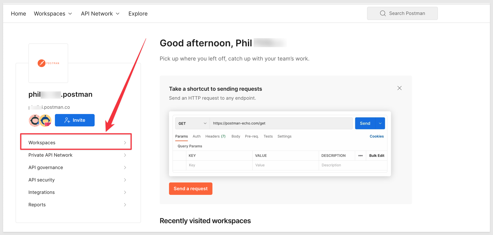

There are several workflows available in Postman and we will use this one:

Create a `new Workspace` called `Sigma`:

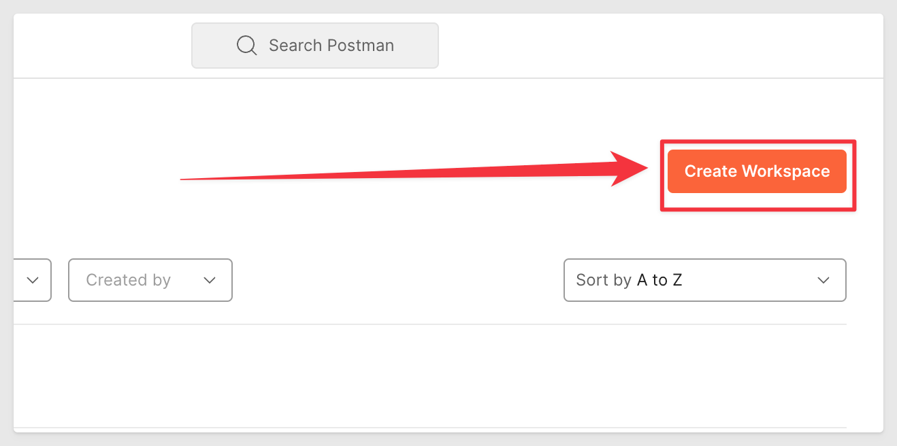

Give it the `name`, `description` and set the `visibility to Personal` for now. Click `Create Workspace`:

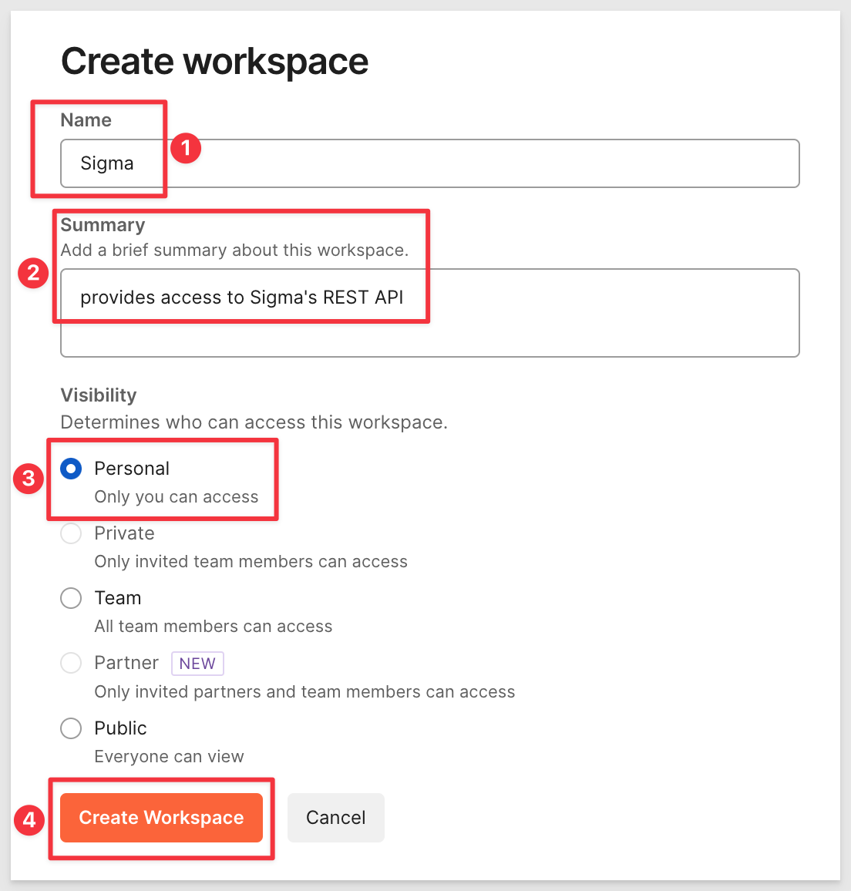

We want to create a new API and there are several ways to do that. In our case, we will use the `Import` option as we will grab the latest Sigma API release from our public API Reference page.

Click the `Collections` icon and click then the `Import` icon:

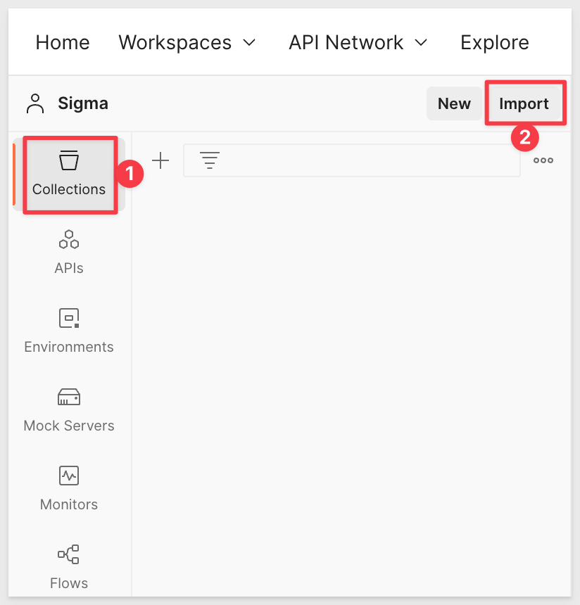

Next we will need to get the link (URL) to the latest Sigma API. Open another browser tab.

[Browse to the Sigma API Reference.](https://help.sigmacomputing.com/reference/get-started-sigma-api)

Click the button `Download the Sigma OpenAPI Definitions`:

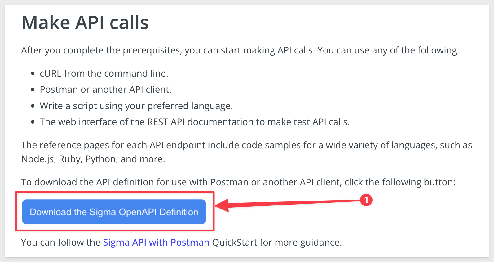

Using Postman, click to `import` the downloaded file:

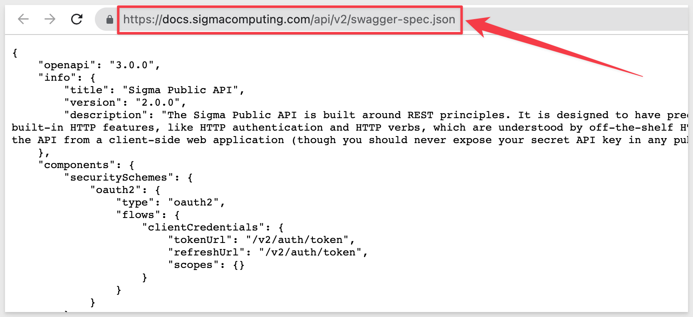

Drag and drop the downloaded file into the space provided by Postman and click `Import`:

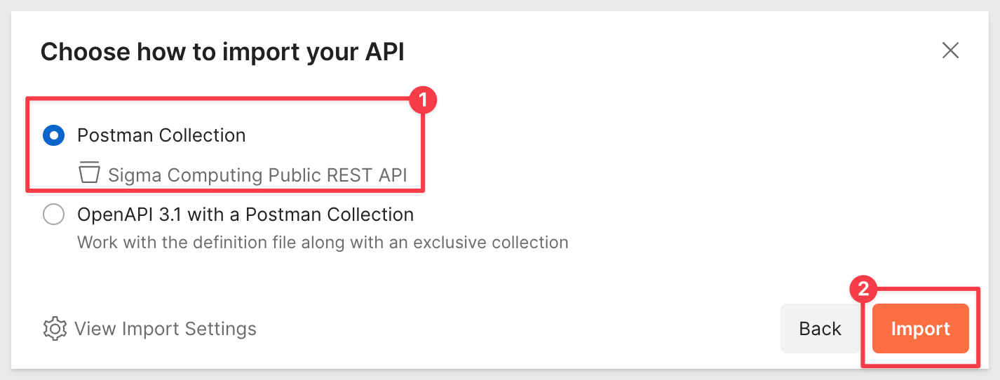

When done, it API will appear as a new `Collection`. It may be helpful to rename the collection if you have more than one copy.

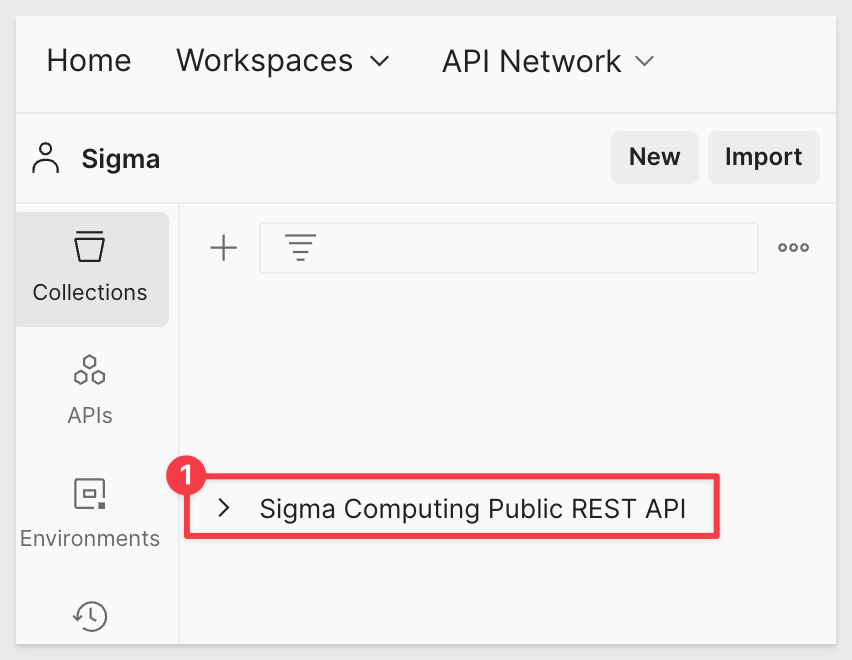

Expand the `Sigma Public API` to see the available methods as below:

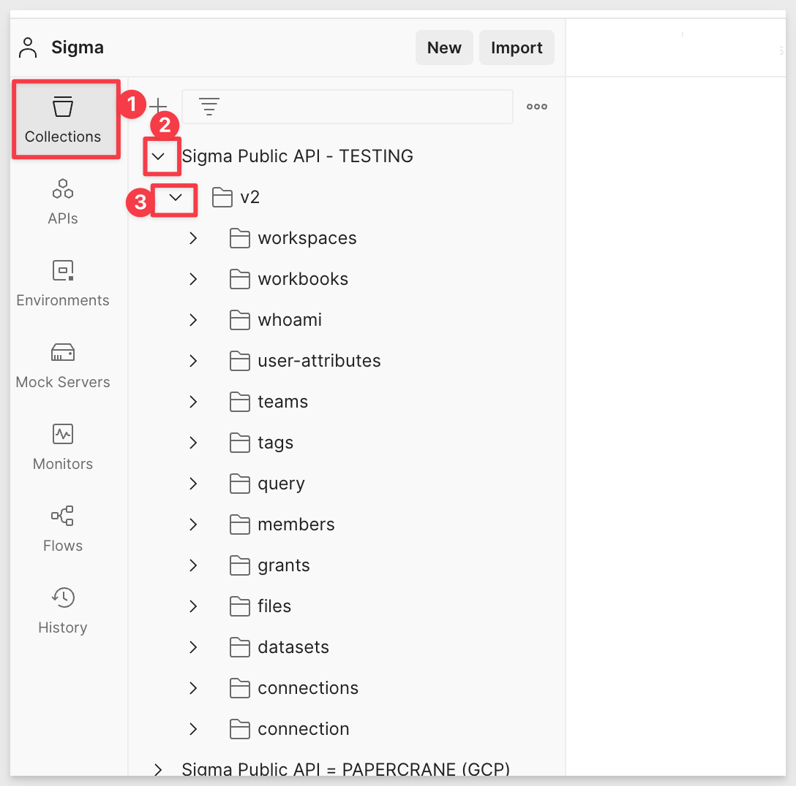

In order to be able to use any API in the web version of Postman, you can either use the `Cloud Agent` or install the `Postman Agent` on your local machine. 

To keep things simple we will use the `Cloud Agent` for this QuickStart.

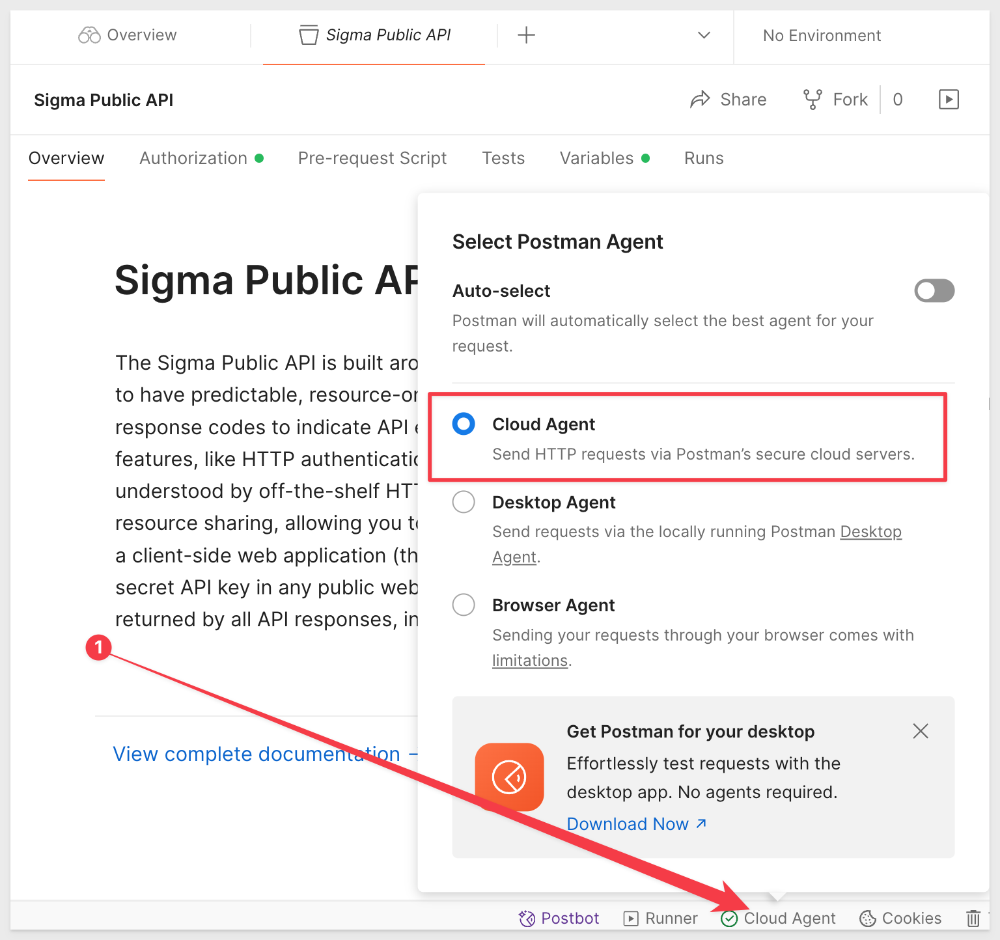

So you know the difference, the Postman Desktop Agent is a micro-application that runs locally on your desktop. It enables you to bypass the limitations that exist in the browser by allowing API requests to originate in the browser, but be routed through your local machine and network. The Postman Desktop Agent overcomes the Cross Object Resource Sharing (CORS) limitations of browsers and acts as your agent for making API requests from the Postman web app.

Download and install the Postman Desktop Agent. You will need to unzip to perform the installation. 

<button>[Login or Sign Up to Postman](https://www.postman.com/downloads/postman-agent/)</button>


<!-- END -->

## Generate ClientID / Secret
Duration: 10

In preparation for using the API we need to use Sigma to generate a new API Token.

Log onto Sigma (as Administrator). Navigate to `Administration`, `APIs & Embed Secrets`

Click the `Create New` button:

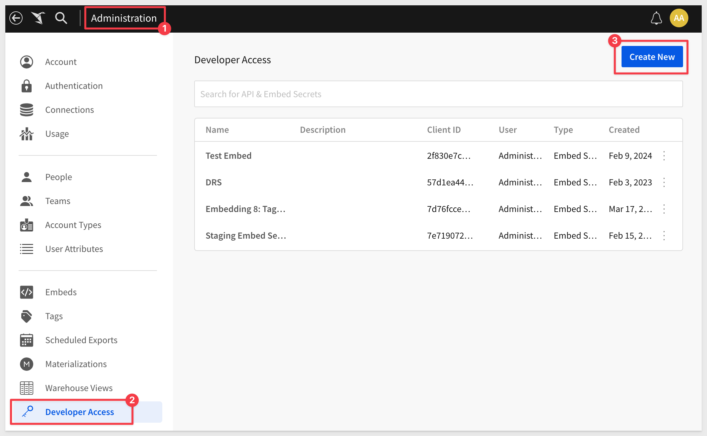

Select `REST API`, give it a name and description. Some customers create a `Service Account` user for automation purposes; this is a best practice. Since we are just testing, you can choose any `Admin` user you prefer. Click `Create`.

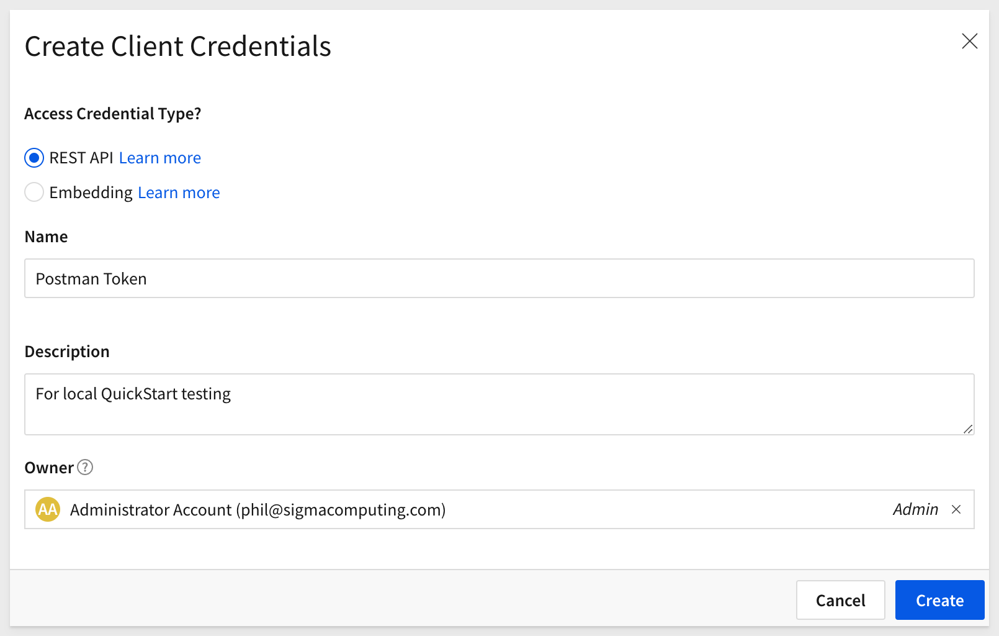

Copy the `ClientID` and `Secret` from the popup and save them to a secure location. We will use them later. Close the popup:

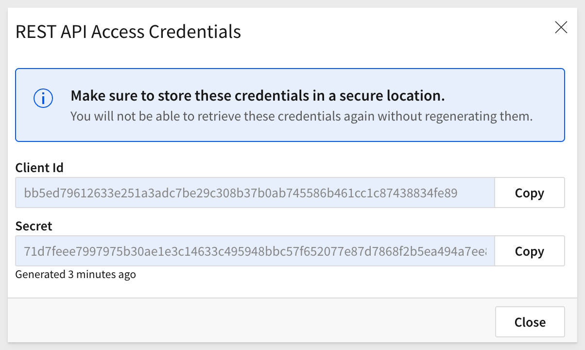


<!-- END -->

## Postman Variables
Duration: 10

Postman variables enable us to store and reuse values in Postman. By storing a value as a variable, we can reference it throughout our API Collection (API).

Creating a dedicated `environment` in Postman is a great approach for managing variables such as the Sigma access_token. 

It not only helps in organizing and isolating your variables based on different stages of development (like testing, staging, and production) but also enhances security by keeping sensitive information such as tokens and secrets scoped to specific environments. 

Since Sigma is a SaaS platform, we will only be using one environment, but this is great functionality to know when using Postman to work with APIs.

In any case, we need to manage the Sigma bearer token, so let's do it using Postman environment variables, which is a best-practice.

Here’s how you can set up an environment in Postman:

### Create a New Environment

Open the `Environments Manager` by clicking on the gear icon in the top right corner of Postman or use the “Manage Environments” option from the environment dropdown.

Click on the `Add` button to create a new environment.

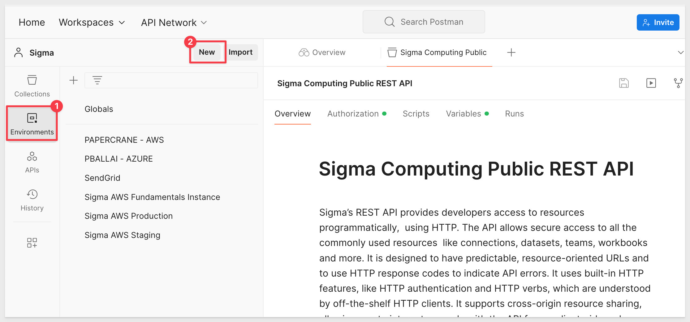

Give the new environment a meaningful name, such as `Sigma AWS Production`.

We need to add some variables. The `Current Value` will populate automatically and in the case of the blank variables, will populate with we actually authenticate. 

<aside class="positive">
<strong>IMPORTANT:</strong><br> Environment variables in Postman allow values to be referenced dynamically. For example, {{access_token}} will retrieve the most recent value stored in that variable, for the current selected environment.
</aside>

```code
Variable       /   Initial Value
baseUrl        /   https://aws-api.sigmacomputing.com
tokenBaseURL   /   https://aws-api.sigmacomputing.com/v2/auth/token
clientID       /   "Your Client ID"
secret         /   "Your secret"
access_token   /   Leave blank
refresh_token  /   Leave blank
token_type     /   Leave blank
expires_in     /   Leave blank
```

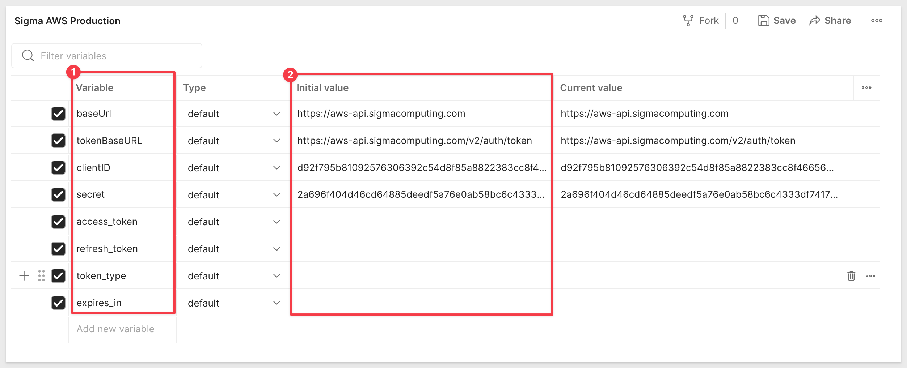

`Save`the changes.

<aside class="positive">
<strong>IMPORTANT:</strong><br> Be sure to replace the initial and current values with the correct URLs based on where the Sigma portal is hosted (ie: AWS, GCP or Azure)
</aside>

If unsure where Sigma is hosted, this is found in `Sigma` > `Administration` > `Account`:

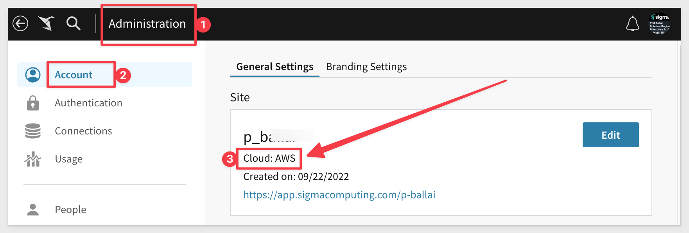

[The baseURL for each cloud is available here](https://docs.sigmacomputing.com/api/v2/#servers)

Modify the `tokenBaseURL` and `tokenBaseURL` as needed for the cloud provider.

### Use the new environment

**Don't miss this step!**

Once we have the new enviroment saved, we need to make it the active one for our API to use it:

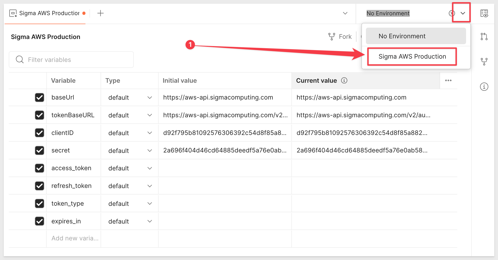

Save the changes and **CLOSE THIS TAB.**


<!-- END -->

## Authentication
Duration: 10

Sigma's API requires that we authenticate prior to use. 

We will be using variables that we setup in the last step to request a `access_token`. This access_token is also know as a Bearer or JSON web token (JWT).

We are going to add a `POST` method to automate authenticating, retrieving an access_token, and persisting it in a variable. 

### New POST Method

Click `v2` > `Add request`:

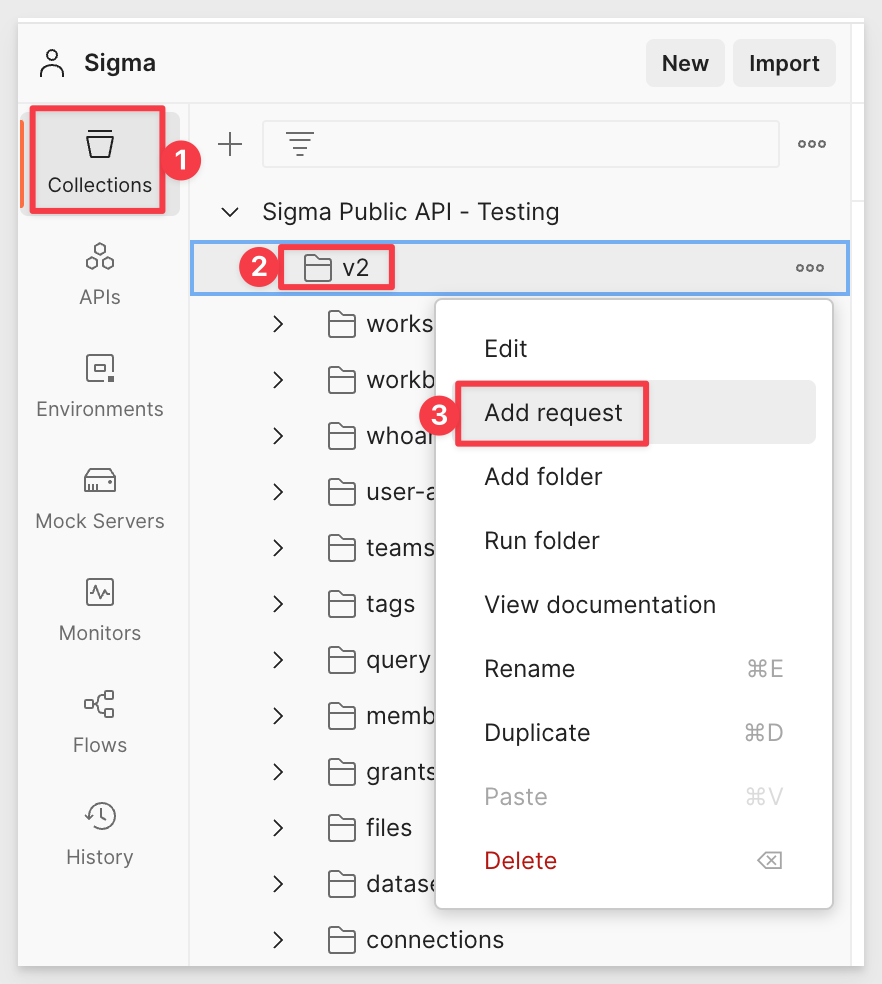

This opens a new request which we will rename to `Authenticate`.   

Change the `method` to `POST` and `Authorization` to `No Auth`:

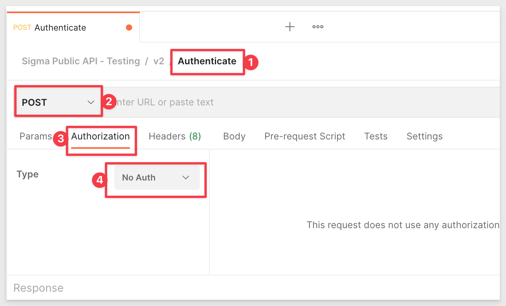

Under the `Body` tab, all the following values (two are environment variables and one is static):

Be sure to select the **x-www-form-urlencoded** message type.

```console
grant_type      / client_credentials
client_id       / {{clientID}}
client_secret   / {{secret}}
```

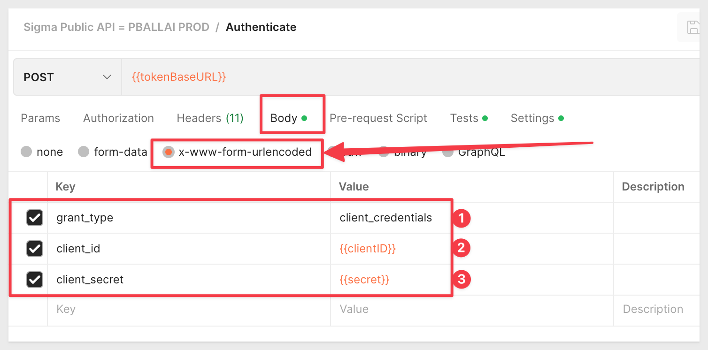

Provide the request url using the curly-brace format to leverage our environment variable for `tokenBaseURL`:

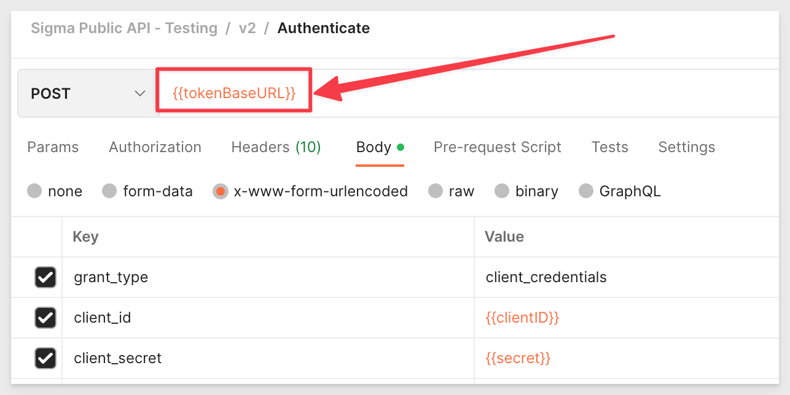

We want to persist this new `access_token` in our environment variable under the same name.

To do that, we need to add this script to the authenticate method, under the `Tests` tab:
```code
let responseData = pm.response.json(); // Extract the JSON response
pm.environment.set("access_token", responseData.access_token); // Store the access token as an environment variable
```

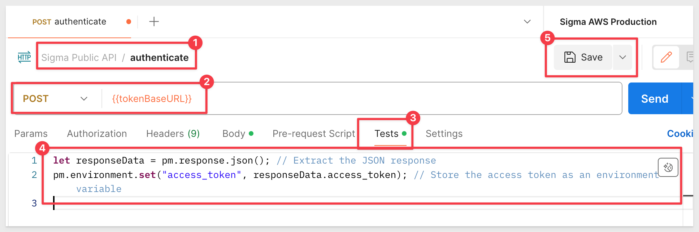

Now that we are configured, click `Save` and `Send` to try our request. If all is correct, we will get a `Status 200 OK` and an access token:


<aside class="negative">
<strong>NOTE:</strong><br> The access_token that we must now pass for all requests (withing this expiration period) is the value between the quotation marks.

access_token do expire. If the API later returns one of these (or similar):<br>

message="invalid signature"<br>
code="unauthorized"<br>
message="jwt expired"<br>

...we just need to resend the Authentication request, copy and paste the new token as we demonstrated earlier in this section.
</aside>

We can verify that the access_token has been stored by simply going back the `environments` icon, opening it, clicking `edit` and observing that the value has been stored:

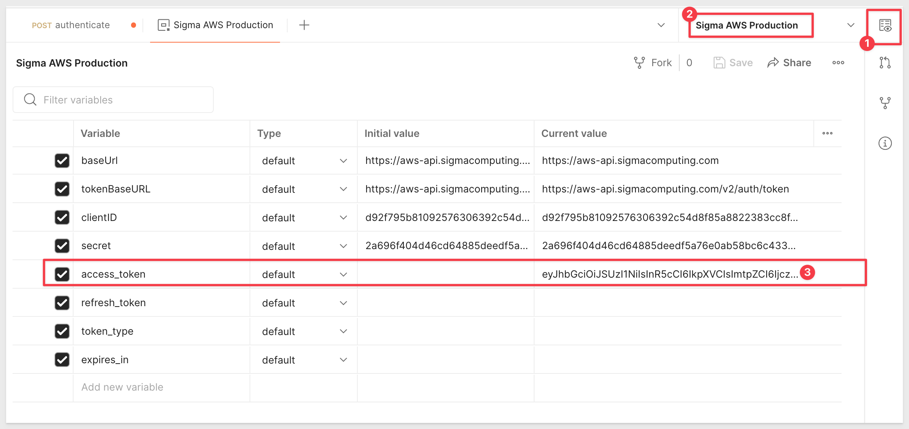

We are now ready to proceed to using other API methods.


<!-- END OF SECTION-->

## Our First API Request
Duration: 10

Let's use the API to `Get` a list of available Connections.

Expand the API to show the method under `V2`, `connections`, `Returns a list of available connections` and click to select open it in a new tab.

We need to uncheck the two checkboxes (item #4 in the screenshot) for `Params` as we just want to return all the connections. These two optional parameters allow us to filter the return but we won't do that at this point. 

Click `Save`:

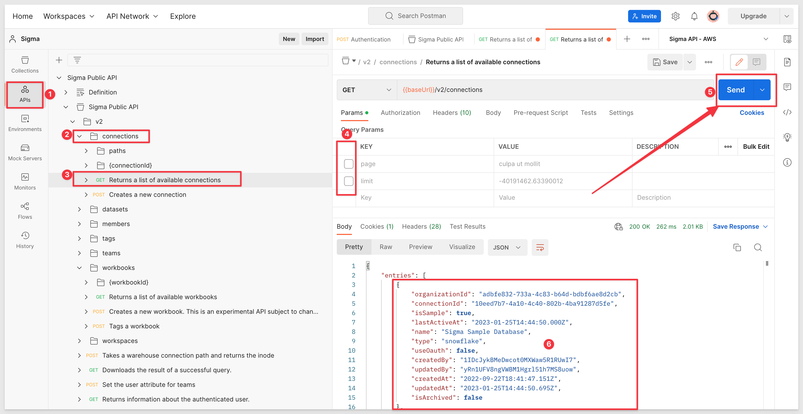

We need to alter the `Authorization` tab to use the bearer token variable:

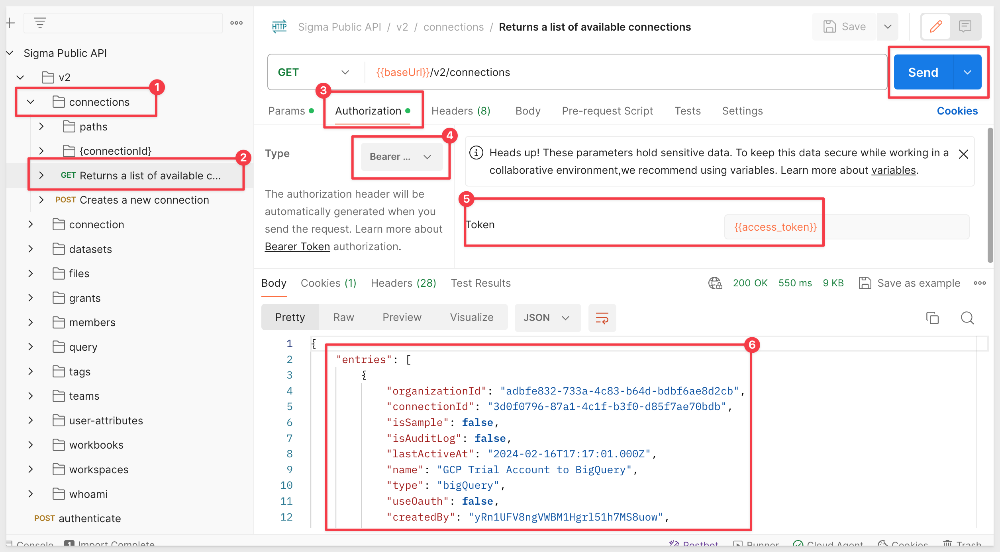

Click `Save` and the `Send`.

<aside class="positive">
<strong>IMPORTANT:</strong><br> Each method you wish to use must have it's authentication change this way, in order for them to work as expected. Postman also allows permission inheritance, which is outside the scope of this QuickStart.
</aside>

In the `Body` section (shown in the previous screenshot), is the return from the API in JSON. For example, our first connection is described this way:

```code
          "organizationId": "adbfe832-733a-4c83-b64d-bdbf6ae8d2cb",
            "connectionId": "10eed7b7-4a10-4c40-802b-4ba91287d5fe",
            "isSample": true,
            "isAuditLog": false,
            "lastActiveAt": "2024-02-15T21:01:37.000Z",
            "name": "Sigma Sample Database",
            "type": "snowflake",
            "useOauth": false,
            "createdBy": "1IDcJykBMeDwcot0MXWaw5R1RUwI7",
            "updatedBy": "yRn1UFV8ngVWBM1Hgrl51h7MS8uow",
            "createdAt": "2022-09-22T18:41:47.151Z",
            "updatedAt": "2024-02-15T21:01:37.140Z",
            "default": 120....more
```

Even if you are only using a Sigma Trial, and have not created a connection yourself, there will be one shown. This is Sigma's sample database, and is included on all Sigma instances by default. Your ID values will be different of course.


<!-- END -->

## New Connection using POST
Duration: 10

The API provides methods to *add/update/delete* a Sigma instance using `POST` messages. We will demonstrate this by creating a new Snowflake connection. 

**This is a demonstration only** as we will show duplicating an existing connection. 

<aside class="negative">
<strong>NOTE:</strong><br> You may use this demonstration to perform the same operation but will have to supply your own Snowflake connection details.
</aside>

We will use the following code to configure a POST message to create a new connection in Sigma. 

[You can get this code and more information here.](https://help.sigmacomputing.com/reference/createconnection)

**The values shown below are for example only:**

<aside class="negative">
<strong>NOTE:</strong><br> The code to enable write access has been removed to simplify this example.
</aside>

```plaintext
{  
 "name": "Snowflake via API POST",     
    "details": { 
                    "type": "snowflake", 
                    "account": "tester", 
                    "host": "testing.snowtest.com", 
                    "password": "<password>", 
                    "role": "A_ROLE", 
                    "user": "THE_DEV", 
                    "warehouse": "TEST_WAREHOUSE", 
                }
}
```

Configure the method `"Creates a new connection"` as shown and click `Send` (we have masked some values of course). A successful result is similar to what is shown in item #6:

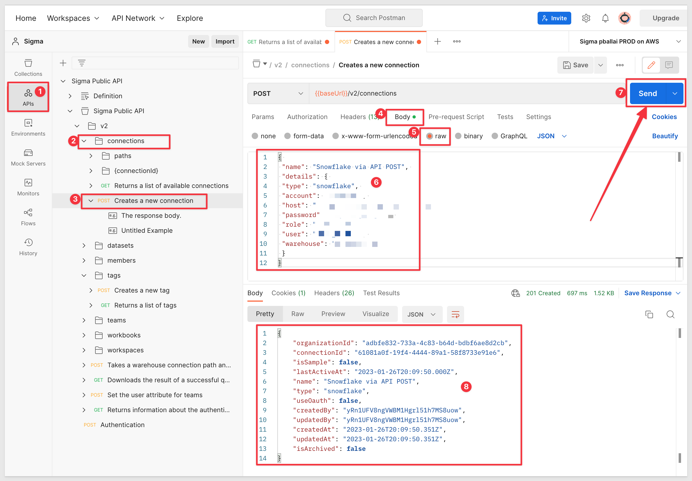

Logging into the Sigma portal we can see we have a new connection:

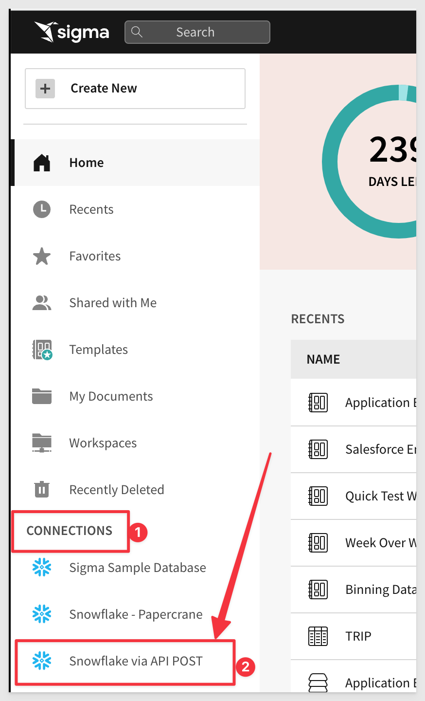


<!-- END -->


## What we've covered
Duration: 5

We created a Postman account, created API token secrets in Sigma, imported the Sigma API to a new Postman API, configured authorization and tested GET and POST methods.

Sigma also provides sample code for many common API use cases (called "Recipes"). You can read more about using [Sigma Recipes here.](https://quickstarts.sigmacomputing.com/guide/administration_api_code_samples/index.html?index=..%2F..index#0)

<!-- THE FOLLOWING ADDITIONAL RESOURCES IS REQUIRED AS IS FOR ALL QUICKSTARTS -->
**Additional Resource Links**

Be sure to check out all the latest developments at [Sigma's First Friday Feature page!](https://quickstarts.sigmacomputing.com/firstfridayfeatures/)

[Sigma API Documentation](https://docs.sigmacomputing.com/)

[Postman Learning Center](https://learning.postman.com/docs/getting-started/introduction/)<br>

[Help Center Home](https://help.sigmacomputing.com)<br>
[Sigma Community](https://community.sigmacomputing.com/)<br>
[Sigma Blog](https://www.sigmacomputing.com/blog/)<br>
<br>

[](https://twitter.com/sigmacomputing)&emsp;
[](https://www.linkedin.com/company/sigmacomputing)&emsp;
[](https://www.facebook.com/sigmacomputing)


<!-- END -->
<!-- END OF QUICKSTART -->
