author: pballai
id: administration_sigma_calculations
summary: administration_sigma_calculations
categories: Administration
environments: web
status: Published
feedback link: https://github.com/sigmacomputing/sigmaquickstarts/issues
tags: default
lastUpdated: {lasted updated using the date format yyyy-mm-dd}

# Query Performance with Sigma


## Overview 
Duration: 5 

This QuickStart introduces and discusses how Sigma is designed to optimize query performance as data is requested by the user interface. Extensive engineering time has been spent determining a solution that provides the best user experience, performance and least cost impact when used against a data warehouse. 

To accomplish this, Sigma provides multiple tiers of caching and evaluation to reduce data warehouse load and enhance user experience. 

Using these mechanisms, Sigma helps ensure that customers typically gain far more value from fast, easy access to data than the increased cost. This is a bit of a balancing act and certainly not something that is easy to do.

We also typically see that for a given organization, economies of scale are realized, meaning as more Sigma users onboard, the associated cost per user decreases.

 ### Target Audience
Tech executives, architects, developers and Sigma administrators who are looking for a deeper understanding of Sigma's unique approach. This approach allows Sigma to perform well against very large datasets, without negatively impacting the end user experience. 

### Prerequisites

<ul>
  <li>A computer with a current browser. It does not matter which browser you want to use.</li>
  <li>Access to your Sigma environment.</li>
  <li>Some familiarity with Sigma is assumed. Not all steps will be shown as the basics are assumed to be understood.</li>
</ul>

<aside class="postive">
<strong>IMPORTANT:</strong><br> Sigma recommends that you use non-production resources when doing QuickStarts.
</aside>

<button>[Sigma Free Trial](https://www.sigmacomputing.com/free-trial/)</button>
  

<!-- END OF SECTION-->

## Tier Definitions
Duration: 20

Each time a user performs an operation, Sigma evaluates where data is retrieved from in order to populate a Workbook’s tables, charts, pivots, and other elements. 

In order to perform these calculations as fast as possible, data operations (calculations) are attempted at a few different tiers, making decisions based on where the requested data can be provided to the user, as fast as possible, and with least cost.

The image below shows where the query logic happens, as "lanes". Each item is then numbered so that we can use the subsequent numbered list to describe each item. 

<aside class="positive">
<strong>IMPORTANT:</strong><br> The numbers DO NOT imply an order of operations. We will discuss that in the next section when we explore a typical query workflow.
</aside>

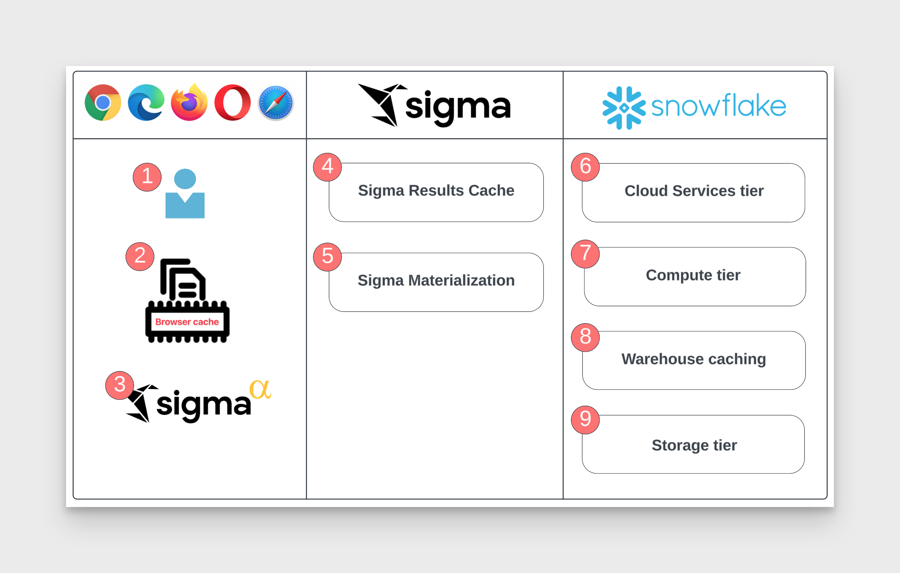

### End User Lane

<strong>1: End User:</strong><br>
An user with a current browser. It does not matter which browser you want to use.

<strong>2: Sigma Browser Cache:</strong><br>
Sigma maintains a cache of recent results in the web browser. This cannot help on the initial load since the cache is empty, however, as changes are made in the workbook, it is automatically leveraged. Any new query is checked against the recent results and if a matching result is found, no network request or query is issued.

<strong>3: Sigma Alpha Query:</strong><br>
The data presented in a Sigma workbook ends up cached in the browser. Sigma will leverage the compute of the browser to compute additional calculations that don’t require data to be refetched instead of sending new queries for the database to compute. An example would be a user creating a new calculation such as a percentage change ([column 2] - [column 1])/[column 1].

### Sigma Cloud Lane

<strong>4: Sigma results cache:</strong><br>
Sigma maintains a mapping of Snowflake result ID’s, if a Sigma generated SQL query has been previously run, Sigma can actually request the result from Snowflake using the request id.<br>

<strong>5: Sigma Materialization:</strong><br>
Complex datasets (which could be ones that involve many joins) can be materialized as single tables back to Snowflake and updated on a schedule set in Sigma, this means that the same query will be less costly and more performant.<br>

### Data Warehouse (Snowflake) Lane
<strong>6: Cloud Services tier:</strong><br>
 Query results in Snowflake, are saved for 24 hours, and are only used only if underlying data has not changed, non-deterministic functions are not used, etc.<br>

<strong>7: Compute tier:</strong><br>
Also called "virtual warehouses", a set of resources allocated to perform data processing tasks such as loading, querying, and running computations on  data. Scale on demand.<br>

<strong>8: Warehouse tier:</strong><br>
Full managed caching feature. Retains the result set of every query executed for 24 hours. Subsequent queries are retrieved from the cache rather than reprocessing the query, significantly improving query response times.<br>

<strong>9: Storage tier:</strong><br>
The cloud-agnostic, independent, elastic, and scalable component that holds all the data loaded into Snowflake.<br>


<!-- END OF SECTION-->

## Query Decision Tree
Duration: 20

Now that we have the definitions, let's look at what happens when an end-user makes a request for data in Sigma.

The following decision tree is very high-level and does not include lower-level details like security, system architecture, and so on. In this QuickStart, we are only focused on the query processing logic, although it is understood that this is not the only thing related to platform performance.

First, let's review the overall decision tree, showing all the possible routes based on what is discovered about the data requested by any query in Sigma.

Let's assume there is a Sigma workbook that has one table on it. The user may (or may not) have added a few calculated columns and they have published the workbook.

Take a few minutes to review the decision tree so that you are familiar with process.

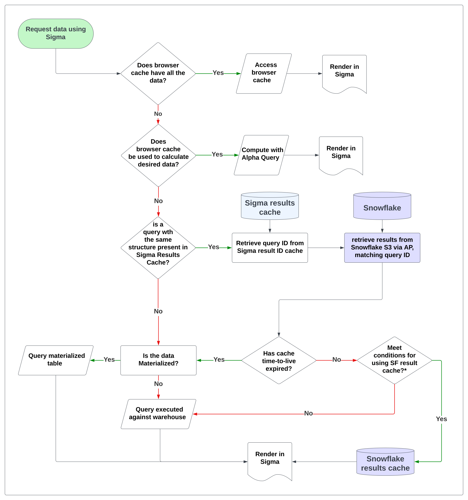

### Conditions for using Snowflake Results Cache
Sigma leverages Snowflake's feature called `Results Cache`, which is designed to improve the performance of data retrieval by caching the results of previously executed queries. This is beneficial because repeated execution of identical queries will be faster, saving compute resources.

At the time of this QuickStart, the following are Snowflake's result cache rules. [More information can be found here.](https://community.snowflake.com/s/article/Understanding-Result-Caching#:~:text=Typically%2C%20query%20results%20are%20reused,query%20result%20has%20not%20changed.)

<aside class="positive">
<strong>IMPORTANT:</strong><br> Snowflake's result cache is just one way Sigma optimizes data rendering performance.
</aside>

<ul>
      <li><strong>Same Query:</strong> The exact same query must be run. Even a minor change in whitespace or case in the SQL statement will result in a cache miss.</li>
      <li><strong>Same Virtual Warehouse:</strong> The same virtual warehouse must be used. If you run a query on one warehouse, then the results will be cached for that warehouse. Running the same query on a different warehouse will not hit the cache.</li>
      <li><strong>Same Role (see note below):</strong> The user must be using the same role. If you change roles and run the query, it will result in a cache miss. In most cases, Sigma is using the same connection to query the warehouse. </li>
      <li><strong>Unchanged Data:</strong> The underlying data cannot have changed. If any data in the tables that the query references has been changed, added, or deleted, then the cache will be invalidated for that query.</li>
      <li><strong>Cache Expiration:</strong> The Results Cache in Snowflake expires after 24 hours. Therefore, even if you meet all the above conditions but more than 24 hours have passed since the query was run, the cache will not be used.</li>
      <li><strong>Session Variables:</strong> If a query involves session variables, those variables must have the same values for the Results Cache to be used. For example, The query does not include functions that must be evaluated at execution (e.g. CURRENT_TIMESTAMP()).</li>
      <li><strong>Table Configuration:</strong> he table’s micro-partitions have not changed (e.g. been re-clustered or consolidated) due to changes to other data in the table.
</li>    
</ul>

***NOTE:***
There are some cases (ie: [Sigma dynamic role switching](https://quickstarts.sigmacomputing.com/guide/embedding_7_dynamic_role_switching_snowflake/index.html?index=..%2F..index#0)) where this may not be the case.    


<!-- END OF SECTION-->

## In-Browser Calculation
Duration: 20

In this section, we will discuss operations that are in this potion of our decision tree:

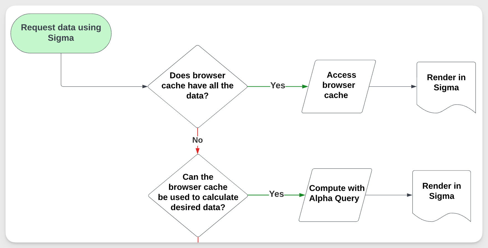

<aside class="positive">
<strong>IMPORTANT:</strong><br> Sigma is able to perform some calculations in the user's browser, resulting in the same interactive performance found in locally installed spreadsheet applications. This is the best case for calculations – it makes Sigma feel fast and powerful, but is just one method Sigma employs to optimize the user's experience. 
</aside>

These calculations are often performed **incrementally**. In many cases, this means that Sigma only needs to perform calculations for a specific change – sorting a table, adding a column, filtering a chart – rather than fully recalculating one or more elements in the Workbook.


**There are a few preconditions necessary for in-browser calculations to kick in:**
 
 <ul>
      <li>The in-browser calculation system supports the requested calculation.</li>
      <li>There are enough rows of data in the browser to calculate complete, correct results. When a table is too large, Sigma cannot pull all of the rows into the browser.</li>
      <li>The data in the browser is up-to-date and will not produce overly stale results. This threshold is configured in a Workbook’s Data Refresh Settings.</li>
</ul>

When Sigma cannot perform a calculation in the browser, it falls back to the next portion of the decision tree.

### Incremental Computation with Large Data Sources

Sigma can perform some calculations without pulling all of the rows into the browser.

Sigma’s general approach to in-browser calculations is called `incremental computation`. Every time you interact with a Workbook – add a column, update a formula, change a control, etc – Sigma determines the minimal set of calculations necessary to produce or update missing or changed data, respectively. 

When Sigma can perform all of these calculations in the browser and return correct results, we can skip using the warehouse entirely.

Imagine an analysis over billions of customer transactions, which summarizes a few metrics across 250 retail store locations. The initial summary calculations are performed in the data warehouse, since it’s impossible to fit billions of fine grained customer transactions into a browser. However, Sigma can use the browser to perform some calculations on the summary metrics, at the granularity of the 250 retail store locations. 

For example, Sigma can calculate the stores that generated over $10MM in revenue without looking at billions of transactions. We only need to look at the summary metrics for the 250 retail store locations – therefore this calculation can occur in the browser.

### Incremental Computation - Simple Example

Let's take a look how this work using the Sigma UI, to show how you may evaluate the operations being performed.

Log in to Sigma as administrator.

Create a new Workbook in Sigma.

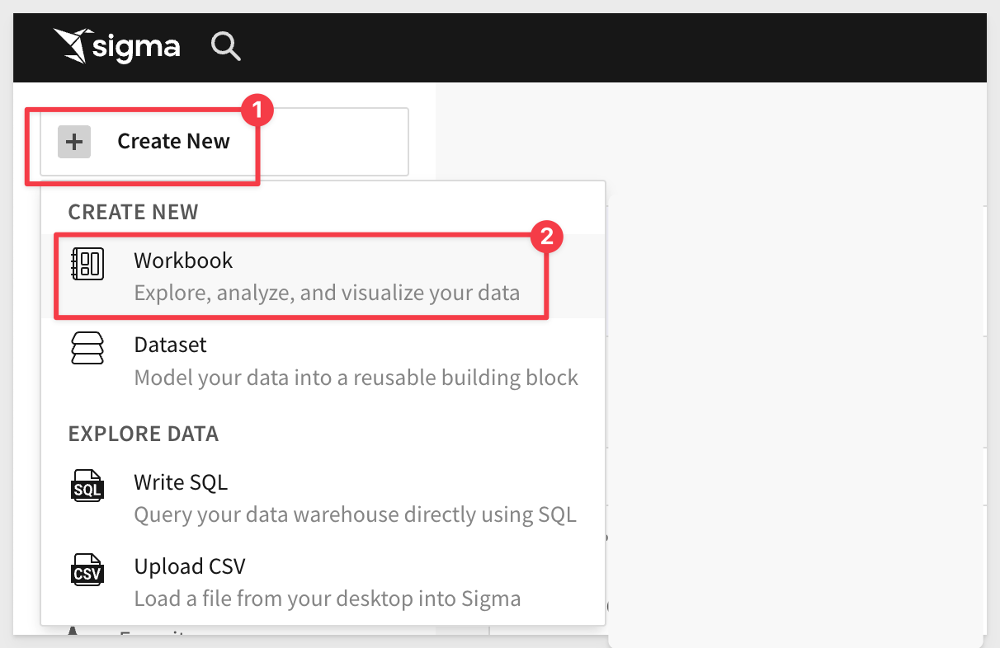

Add a new `Table`:

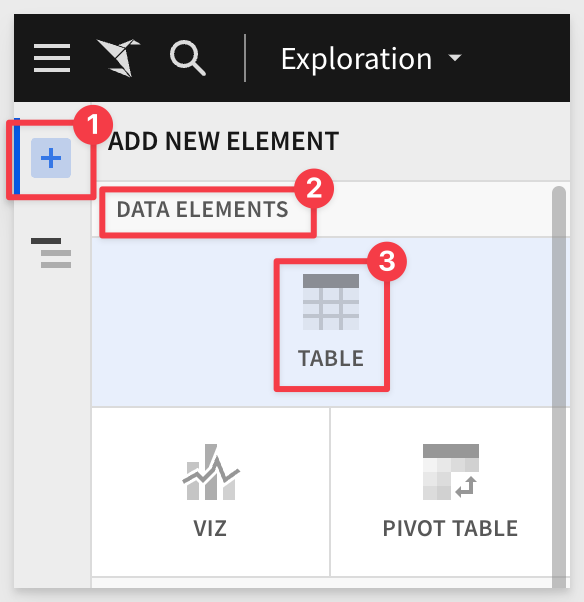

From `NEW` > `TABLES AND DATASETS`:

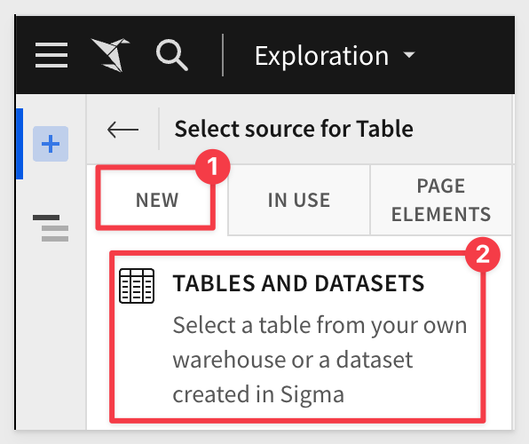

Select the `Sigma Sample Database` > `RETAIL` > `PLUGS ELECTRONICS` > `F_POINT_OF_SALE` table:

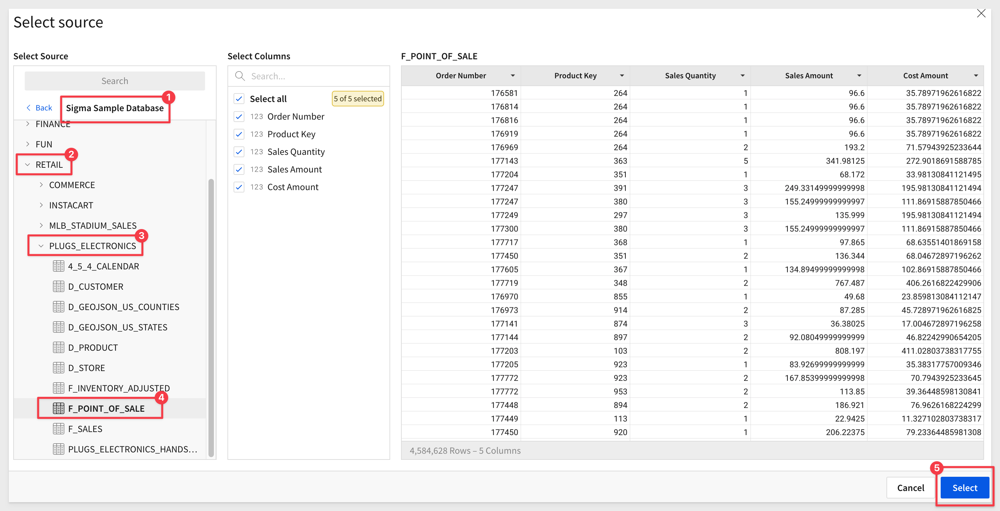

We now have a new, unsaved `Exploration`. Before we do anything else, let's see how Sigma generated queries to the warehouse.

Open Query History and evaluate what query operations Sigma is creating. 

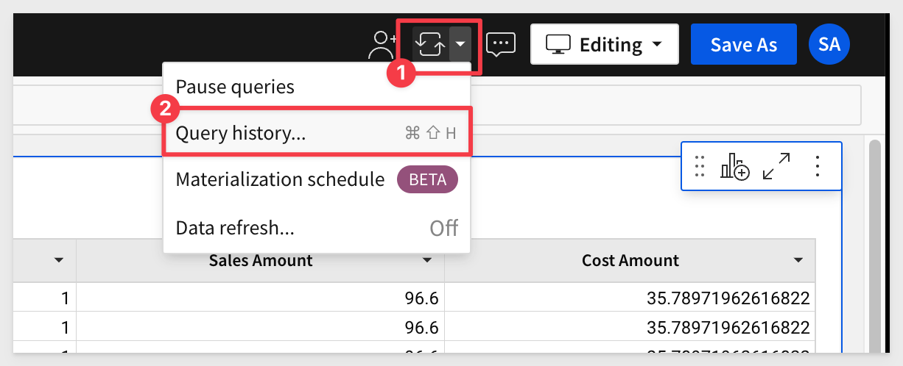

There are three rows. 

Click on the slider to also show in-browser calculations. There are none so far, since this is the first time we have requested the data from the warehouse for this workbook. 

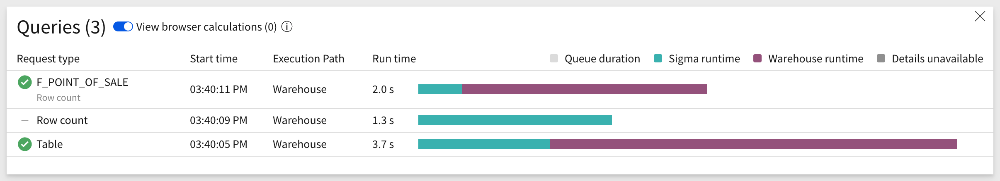

Let's make a few changes to the table and check the `Query History` to see what happens.

Format the two columns `Sales Amount` and `Cost Amount`. 

Open Query History; there are no new rows. 

Work is being done by Sigma, against existing browser data with no new query or calculation required. 

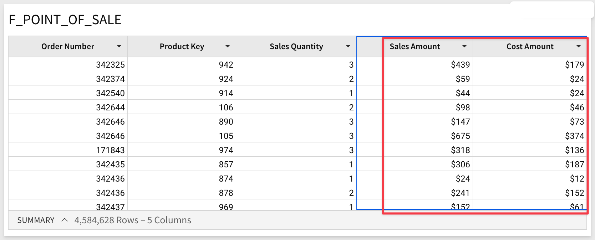

Next, add a new column with formula:
```plaintext
[Sales Quantity] * [Sales Amount]
```

Click the checkmark to accept the new formula and reopen the `Query History`. Notice there is a one new row with `browser` execution. This is the indication that Sigma was able to use data in the local browser cache to calculate the new column's value, without going back to the warehouse.

### Incremental Computation - Child Elements

It is very common to have one (or just a few) tables that drive entire dashboards. 

Sigma can calculate multiple elements in the browser after fetching data for a common parent element.

Imagine a Sigma Workbook that shows a number of KPIs related to sales opportunities, where all of the KPIs are calculated from a common data table. 

If Sigma believes that it can pull all of the records for the common data table into the browser, it will attempt to do so **before calculating the KPIs by sending a single query to the data warehouse.** 

If the query indeed returns all of the records, the KPIs are calculated directly in the browser. This avoids potentially sending a query-per-KPI to the data warehouse.

<aside class="positive">
<strong>IMPORTANT:</strong><br> Incremental computation reduces the number of warehouse `hits` and improves page loading performance, since it only needs to query the data once from the warehouse, and then calculate all the other child elements in-browser. 
</aside>


<!-- END OF SECTION-->

## Sigma Result Cache
Duration: 20

Sigma has the capability to automatically fetch previously calculated data, leveraging the ability of some data warehouses to fetch the results of prior SQL calculations.

Sigma’s result cache is a feature implemented within Sigma itself.

This implementation is distinctly different from the result caching functionality that some data warehouses natively provide, which is typically implemented using a SQL text match algorithm. This checks if a syntactically equivalent SQL statement was submitted recently, and returns prior calculations if the underlying table data has not changed since the last query. Each warehouse provider implements their own way. 

[The Snowflake method](https://docs.snowflake.com/en/user-guide/querying-persisted-results#retrieval-optimization)
[The BigQuery method](https://cloud.google.com/bigquery/docs/cached-results)
[The Redshift method](https://docs.aws.amazon.com/redshift/latest/dg/c_challenges_achieving_high_performance_queries.html#result-caching)

In order to achieve this, we first maintain a mapping between calculations (Sigma request ID) and the results they produce in the data warehouse (queryID). 

We next calculate a fingerprint (a structure of prior calculations) for this mapping.

The production of a fingerprint and mapping of fingerprint to prior results is performed entirely within Sigma – the warehouse is not involved until we ask it to return any prior calculations it has. 

When a new calculation matches a prior one (using Sigma's matching algorithm), we ask the data warehouse if it still has results for the prior calculation (time-to-live expiration). 

If it does, we’ll return those results when they’re recent enough for the requesting client. **At no point are these prior results cache data stored to disk within Sigma’s cloud.** 

The tradeoff inherent in result caching, which prioritizes retrieval speed over data liveness – the previously calculated results are potentially out-of-date relative to fresh calculations. 

In many cases this is desirable, as results may only change on an hourly or daily basis. 

For live data, you can configure the staleness threshold. This gives you full control over when Sigma calculates results using up-to-date data in the data warehouse.

For information on how to configure [Workbook Data refresh, click here.](https://help.sigmacomputing.com/hc/en-us/articles/4403612567955)

<strong>There are a few preconditions necessary for the Sigma result cache to kick in:</strong>
 <ul>
      <li>Sigma is able to prove that a new calculation will produce the same results as a prior one. This is explained after this table.</li>
      <li>The prior calculations found in the warehouse are not too old for the Workbook to use. This threshold is configured in a Workbook’s Data Refresh Settings. (see Note 2 below)</li>
      <li>Snowflake’s RESULT_SCAN function can fetch calculations produced in the last 24 hours.</li>
      <li>BigQuery’s API is able to fetch calculations produced in the last 24 hours.</li>
</ul>

When Sigma cannot use the warehouse result cache, it must perform a calculation in the data warehouse.

### How Sigma proves a pair of calculations are equivalent

As previously mentioned, Sigma’s result cache will only kick in when a new calculation produces the same results as a prior one. 

Proving this condition requires comparing the structure of a pair of calculations. 

This comparison is done by producing a unique fingerprint for each calculation, searching for other calculations with a matching fingerprint, and ensuring we don’t have false positives.

**The fingerprint does not use Sigma’s generated SQL.** Instead, it uses a representation that’s more appropriate for the Workbook, given it's functionality. 

For example, Sigma Workbooks commonly use user attributes and row-level security parameters. Fingerprinting is a better method, as it is sensitive to this type of contextual information.

At the same time, fingerprinting is resilient to unnecessary information such as value formatting or column descriptions. 

The exact details of how Sigma produces a fingerprint are beyond the scope of this article.

[To learn more about Fingerprinting in general, click here:](https://en.wikipedia.org/wiki/Fingerprint_(computing))

### A Practical Example
One key use-case for Sigma’s result cache is to accelerate the initial page load for a Workbook.

Imagine that a 100-person sales organization has a weekly operational meeting, where they review important KPIs and explore various pipeline and opportunity scenarios together as a team.

When the meeting begins, all 100 members of the team open the same Sigma Workbook. 

Rather than asking the warehouse to calculate fresh results for every team member, **the result cache accelerates the initial page load** by returning the data calculated by the first person to open the Workbook. 

This drastically reduces the number of calculations the data warehouse needs to perform, and improves the page load time since there are no additional calculations to perform.


<!-- END OF SECTION-->

## Best Practice Resources
Duration: 20

Since you are taking time to learn about how Sigma performs calculations, we thought you might find these other resource ov value. They are all related to best practices and performance when using Sigma.

### Snowflake:
[Sigma on Snowflake Best Practices Guide](https://www.sigmacomputing.com/sigma-on-snowflake-best-practices)

This workbook walks you through the process of analyzing the Snowflake sample database for clustering needs:
[Snowflake Clustering)](https://www.sigmacomputing.com/interactive-demos/snowflake-clustering-demo)

Sigma also provides many templated business solutions "out of the box", that you can review as demonstration or connect to your own data. At the time of this QuickStart, the included templates are:

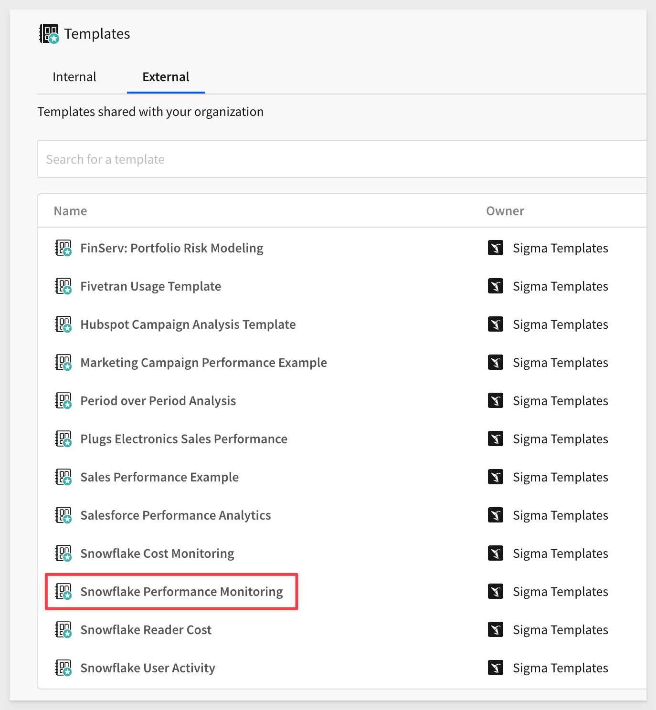

One of particular interest is the `Snowflake Performance Monitoring` which provides extensive information on Snowflake warehouse activities, related to Sigma usage. For example, on the summary page:

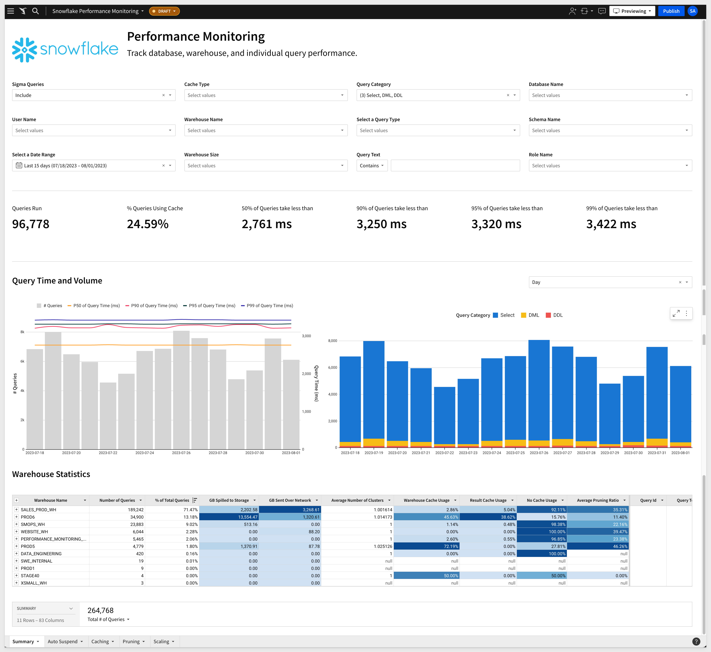

[Try the Sigma Snowflake Performance Monitoring Template live here:](https://www.sigmacomputing.com/interactive-demos/snowflake-performance-monitoring-template)

[For more information on the Snowflake usage templates, click here.](https://help.sigmacomputing.com/hc/en-us/articles/6951091947027-Snowflake-usage-templates)

### Databricks:
[Sigma on Databricks: End-to-End Best Practices Guide](https://www.sigmacomputing.com/ebook/sigma-on-databricks-end-to-end-best-practices-guide)

### Large Datasets:
[Best practices when working with large data sets](https://www.sigmacomputing.com/product-faq/best-practices-when-working-with-large-data-sets)

### Performance:
[Best practices for improved performance](https://help.sigmacomputing.com/hc/en-us/articles/17540858525715-Best-practices-for-improved-performance)

### Modeling:
[Modeling Best Practices](https://help.sigmacomputing.com/hc/en-us/articles/4408743358355-Modeling-Best-Practices)


<!-- END OF SECTION-->

**Additional Resource Links**

[Help Center Home](https://help.sigmacomputing.com/hc/en-us)<br>
[Sigma Community](https://community.sigmacomputing.com/)<br>
[Sigma Blog](https://www.sigmacomputing.com/blog/)<br>
<br>

[](https://twitter.com/sigmacomputing)&emsp;
[](https://www.linkedin.com/company/sigmacomputing)
[](https://www.facebook.com/sigmacomputing)


<!-- END OF WHAT WE COVERED -->
<!-- END OF QUICKSTART -->