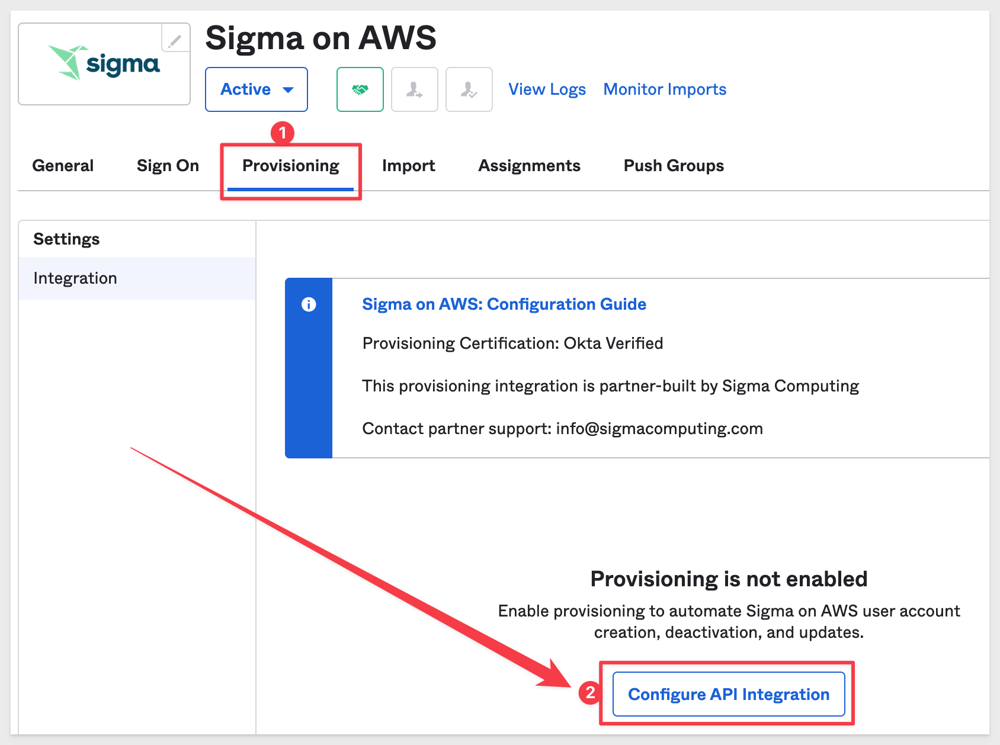

author: pballai
id: administration_sso_okta
summary: administration_sso_okta
categories: Administration
environments: web
status: Published
feedback link: https://github.com/sigmacomputing/sigmaquickstarts/issues
tags: Getting Started, Analytics, Data Engineering, BI, Business Intelligence, Sigma, Sigma Computing, Snowflake, Dashboarding, Visualization, Analysis, Excel, Spreadsheet, Embedding
lastUpdated: 2023-05-01

# Single Sign On with Sigma and Okta
<!-- The above name is what appears on the website and is searchable. -->

## Overview 
Duration: 5 

This QuickStart **QS** provides all the common Markup to be used in new QS. 

Sample code and examples are shown for each item.

We encourage you to review the QS called 

This QuickStart assumes you........

 ### Target Audience
Anyone who is trying to create QS content for Sigma. 

### Prerequisites

<ul>
  <li>A computer with a current browser. It does not matter which browser you want to use.</li>
  <li>Access to your Sigma environment. A Sigma trial environment is acceptable and preferred.</li>
  <li>An Okta account as Administrator. A development environment is acceptable.</li>
</ul>

<aside class="postive">
<strong>IMPORTANT:</strong>  Sigma recommends that you use non-production resources when doing QuickStarts.
</aside>

<button>[Sigma Free Trial](https://www.sigmacomputing.com/free-trial/)</button> <button>[Okta Developer Account](https://developer.okta.com/signup//)</button>``

<aside class="postive">
<strong>IMPORTANT:</strong>  We will assume you have access to (or setup trials) as outlined above before starting this QuickStart. We will not cover the steps to access the base sites as the vendors have made the process very straight-forward.
</aside>
  
### What You’ll Learn
How to apply Sigma approved Markdown for your QS.

### What You’ll Build
[I good example of the Sigma style that we want to try to adhere to is here](https://quickstarts.sigmacomputing.com/guide/getting_started_working_with_tables_hol/index.html) .

INSERT IMAGE OF FINAL BUILD IF APPROPRIATE.........

<!-- NOTE: SIGMA LOGO REQUIRED AT END OF EACH ## SECTION -->
<!-- END OF OVERVIEW -->

## **SSO Initial Configuration**
Duration: 20

Login into Okta as Administrator and navigate to `Applications` > `Applications` and click `Browse App Catalog`:

Type `Sigma` into the search bar and select either "Sigma on AWS" or "Sigma on GPC" depending on where your Sigma instance is hosted:

<aside class="negative">
<strong>NOTE:</strong>  To see where you Sigma instance is hosted, login to Sigma (as Administrator) and navigate to Administration > Account. The cloud provider is listed near the top in the "Site" grouping.
</aside>

On the next page we see that Sigma is "Okta Verified". Click `Add Integration`:

Give the integration a name and click `Done`:

We have to get some information and configure things in Sigma as we set this up.

In another browser tab, log into Sigma and navigate to `Administration` > `Account` and copy the URL as shown:

This is the URL Okta will use to reach Sigma. Save it off in a text file so we can use it later.

Navigate to `Administration` > `Authentication` and click `Edit`:

Select `SAML or password` while we are testing so that we can login with Okta SSO or directly into Sigma with a our admin username and password. 

There are other options on this page but we will leave them at the defaults. The links below provide more information on those options:

[Guest Access](https://help.sigmacomputing.com/hc/en-us/articles/4412853245971-Guest-User-Accounts)

[Multi-Factor Authentication](https://help.sigmacomputing.com/hc/en-us/articles/4409688043411-Two-Factor-Email-Authentication)

<aside class="positive">
<strong>IMPORTANT:</strong>  Sigma supports the configuration of both SP-initiated and IdP-initiated authentication. This means your organization members can choose to login to Sigma from either your IdP console or your Sigma login page. After testing, we will change this to enforce SSO only login.
</aside>

Sigma needs to have an Identity Provider (IDP) login URL and X509 certificate. We can gets these from Okta (our IDP)

Return to Okta and navigate to the `Sign On` tab. Scroll down to find `Settings` group and the button to `Show details` after the "Metadata URL". We want to click to copy `Sign on URL`:

Paste this value into Sigma for the value of `Identity provider login URL`:

Now click to copy the x509 certificate, which little further down in the same group.

Paste this value into Sigma under the value for `Identity provider X509 certificate` and click `Save`:

Return to Okta and the `Sign On` page. This time, click `Edit` in the `Settings` group:

Copy the Sigma Account URL we saved off to a text file earlier and paste it into the `Default Relay State` box:

There are some additional options but we will discuss them later. 

### Activate SSO

In Okta, navigate to the `Provisioning` tab and click `C

Now click the `Provisioning` tab and then `Configure API Integration`:

<!-- END OF NEXT SECTION-->

## **Sigma Configuration**
Duration: 20

<!-- END OF NEXT SECTION-->

## **NEXT SECTION**
Duration: 20

<!-- END OF NEXT SECTION-->

## **NEXT SECTION**
Duration: 20

<!-- END OF NEXT SECTION-->

## **NEXT SECTION**
Duration: 20

<!-- END OF NEXT SECTION-->

## What we've covered
Duration: 5

In this lab we learned how to.........

INSERT FINAL IMAGE OF BUILD IF APPROPRIATE

<!-- THE FOLLOWING ADDITIONAL RESOURCES IS REQUIRED AS IS FOR ALL QUICKSTARTS -->
**Additional Resource Links**

[Help Center Home](https://help.sigmacomputing.com/hc/en-us) 
[Sigma Community](https://community.sigmacomputing.com/) 
[Sigma Blog](https://www.sigmacomputing.com/blog/) 
 

&emsp;

<!-- END OF WHAT WE COVERED -->
<!-- END OF QUICKSTART -->