author: pballai
id: administration_sso_okta
summary: administration_sso_okta
categories: Administration
environments: web
status: Published
feedback link: https://github.com/sigmacomputing/sigmaquickstarts/issues
tags: Getting Started, Analytics, Data Engineering, BI, Business Intelligence, Sigma, Sigma Computing, Snowflake, Dashboarding, Visualization, Analysis, Excel, Spreadsheet, Embedding
lastUpdated: 2023-05-01

# Single Sign On with Sigma and Okta
<!-- The above name is what appears on the website and is searchable. -->

## Overview 
Duration: 5 

This QuickStart **QS** provides all the common Markup to be used in new QS. 

When using Okta SSO, there are several user management options available. These include:

 <ul>
      <li><strong> User Provisioning:</strong> Okta can automatically provision user accounts in the target applications when the user is added or modified in Okta. This can reduce manual effort and ensure consistency across applications.</li>
      <li><strong>User Deprovisioning:</strong> Okta can automatically deprovision user accounts in the target applications when the user is deleted or deactivated in Okta. This can help ensure that former employees or contractors no longer have access to company data.</li>
      <li><strong> Group Management:</strong> Okta allows administrators to create groups and assign users to those groups. This can simplify application provisioning and deprovisioning by allowing administrators to manage access based on groups instead of individual users.</li>
      <li><strong> Access Policies:</strong> Okta allows administrators to define access policies that govern user access to specific applications or data. These policies can be based on factors such as user location, device, or role.</li>
      <li><strong> Password Policies:</strong> Okta provides password policies that can enforce password complexity rules and expiration policies. This can help ensure that users have strong passwords and reduce the risk of password-related security breaches.</li>
      <li><strong> User Self-Service:</strong> Okta provides a self-service portal that allows users to reset their passwords or update their profile information. This can reduce the burden on IT help desks and improve user satisfaction.</li>
</ul>

While Okta has many options available, we want to call attention to just a few in this section.

 ### Target Audience
Anyone who is trying to create QS content for Sigma. 

### Prerequisites

<ul>
  <li>A computer with a current browser. It does not matter which browser you want to use.</li>
  <li>Access to your Sigma environment. A Sigma trial environment is acceptable and preferred.</li>
  <li>An Okta account as Administrator. A development environment is acceptable.</li>
</ul>

<aside class="postive">
<strong>IMPORTANT:</strong>  Sigma recommends that you use non-production resources when doing QuickStarts.
</aside>

<button>[Sigma Free Trial](https://www.sigmacomputing.com/free-trial/)</button> <button>[Okta Developer Account](https://developer.okta.com/signup//)</button>``

<aside class="postive">
<strong>IMPORTANT:</strong>  We will assume you have access to (or setup trials) as outlined above before starting this QuickStart. We will not cover the steps to access the base sites as the vendors have made the process very straight-forward.
</aside>
  
### What You’ll Learn
How to apply Sigma approved Markdown for your QS.

### What You’ll Build
[I good example of the Sigma style that we want to try to adhere to is here](https://quickstarts.sigmacomputing.com/guide/getting_started_working_with_tables_hol/index.html) .

INSERT IMAGE OF FINAL BUILD IF APPROPRIATE.........

<!-- NOTE: SIGMA LOGO REQUIRED AT END OF EACH ## SECTION -->
<!-- END OF OVERVIEW -->

## **SSO Initial Configuration**
Duration: 20

Login into Okta as Administrator and navigate to `Applications` > `Applications` and click `Browse App Catalog`:

Type `Sigma` into the search bar and select either "Sigma on AWS" or "Sigma on GPC" depending on where your Sigma instance is hosted:

<aside class="negative">
<strong>NOTE:</strong>  To see where you Sigma instance is hosted, login to Sigma (as Administrator) and navigate to Administration > Account. The cloud provider is listed near the top in the "Site" grouping.
</aside>

On the next page we see that Sigma is "Okta Verified". Click `Add Integration`:

Give the integration a name and click `Done`:

We have to get some information and configure things in Sigma as we set this up.

In another browser tab, log into Sigma and navigate to `Administration` > `Account` and copy the URL as shown:

This is the URL Okta will use to reach Sigma. Save it off in a text file so we can use it later.

Navigate to `Administration` > `Authentication` and click `Edit`:

Select `SAML or password` while we are testing so that we can login with Okta SSO or directly into Sigma with a our admin username and password. 

There are other options on this page but we will leave them at the defaults. The links below provide more information on those options:

[Guest Access](https://help.sigmacomputing.com/hc/en-us/articles/4412853245971-Guest-User-Accounts)

[Multi-Factor Authentication](https://help.sigmacomputing.com/hc/en-us/articles/4409688043411-Two-Factor-Email-Authentication)

<aside class="positive">
<strong>IMPORTANT:</strong>  Sigma supports the configuration of both SP-initiated and IdP-initiated authentication. This means your organization members can choose to login to Sigma from either your IdP console or your Sigma login page. After testing, we will change this to enforce SSO only login.
</aside>

Sigma needs to have an Identity Provider (IDP) login URL and X509 certificate. We can gets these from Okta (our IDP)

Return to Okta and navigate to the `Sign On` tab. Scroll down to find `Settings` group and the button to `Show details` after the "Metadata URL". We want to click to copy `Sign on URL`:

Paste this value into Sigma for the value of `Identity provider login URL`:

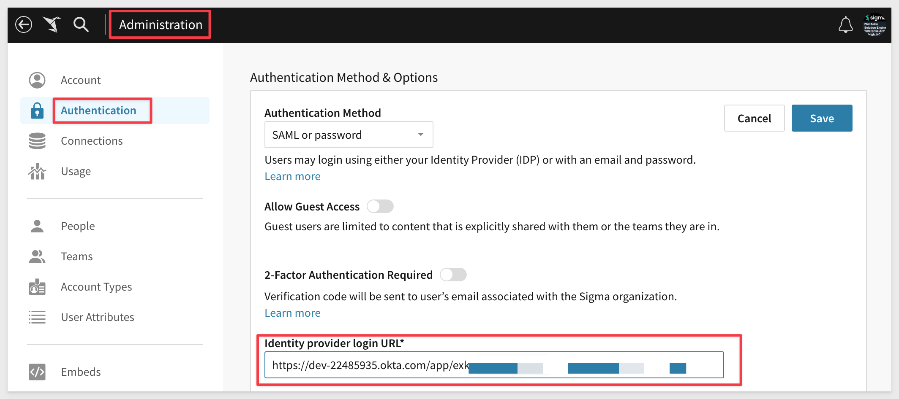

Now click to copy the x509 certificate, which little further down in the same group.

Paste this value into Sigma under the value for `Identity provider X509 certificate` and click `Save`:

Return to Okta and the `Sign On` page. This time, click `Edit` in the `Settings` group:

Copy the Sigma Account URL we saved off to a text file earlier and paste it into the `Default Relay State` box:

Last thing we should do is make sure any new Sigma user get the least privilige unless configure otherwise. This is done by navigating to the `Provisioning` tab for the Application ` Sigma on AWS`. 

Scroll down the the page bottom and `Show Unmapped Attributes`. Click the pencil icon on the row with `UserType` and configure it as follows:

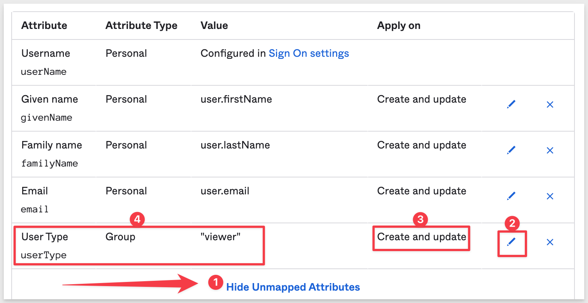

Now all Sigma users we add to Okta are `Viewers` unless we assign otherwise.

Scroll all the way to the bottom and click `Save`.

<!-- END OF SECTION -->

## Testing SSO

Open a new Chrome browser in `Incognito mode` so that we avoid issues with session cookies. You could also just use another browser like Firefox or Safari to create isolation. 

Navigate to your Sigma portal using whatever URL you typically use. 

For example: https://app.sigmacomputing.com/{YOUR ACCOUNT NAME}

Now that SSO is enabled, we are presented an additional login option. Recall that we left username/password authentication on. We will turn this off later.

Click the `Sign in with SSO` button. We are talking to an Okta page for signing into Sigma now.

Try to login with your Sigma credentials. It will fail. This is because we have not created this user in Okta.

When errors occur in Okta (before reaching out to Sigma) it can be useful to review the Okta Application error log:

Here we see `Verification error` which indicates that Okta does not have a record for this user login attempt:

### Add User in Okta

We need to add our Sigma Admin user in Okta so we can disable non-SSO logins to Sigma. 

Navigate to `Directory` > `People` and click `Add person`:

Configure the new user as follows and use the same password used for your Administrator user in Sigma:

Go back to the incognito Chrome window and try to login again. It will fail but this time, the errors is more instructive:

The user needs to be "assigned" to the Sigma application. Currently, this Okta user is not allowed to use anything.

In Okta, navigate to the `People` list again and click on the user we created previously.

Click the `Assign Application` button.

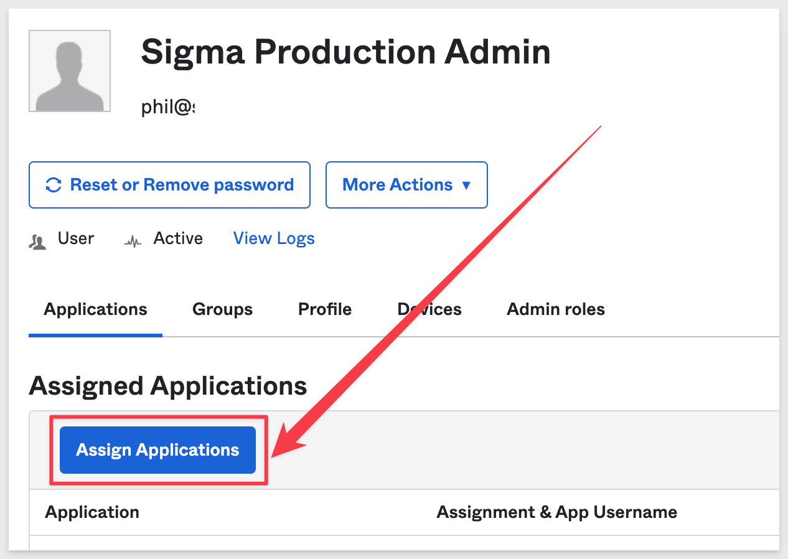

Click to assign the `Sigma on AWS` application:

Next click `Save and go back`:

Click `Done`.

Now that the user is added in Okta, go back to incognito Chrome again and try to login again.

We are now able to login to Sigma with SSO.

Another inspection of the Okta log for the Sigma application reveals the two steps that occured:

<!-- END OF SECTION -->

## **Disable Standard Authentication**
Duration: 20

We want to disable username/password logins to Sigma and enforce only SSO with Okta.

In Sigma, navigate to `Administration` > `Authentication` and click the `Edit` button.

Change the `Authentication Method` to only `SAML`. 

Sigma will now only support SSO login, in this case with Okta.

After logging out of Sigma, close the incognito browser and reopen a new one. Browse to Sigma like:

https://app.sigmacomputing.com/{ACCOUNT NAME}/login

We now only see the `Sign in with SSO` button:

The Sigma admin user is still able to login but only with SSO. 

<!-- END OF NEXT SECTION-->

## **User Management Options**
Duration: 20

So far, we have only used the admin use account in Sigma to setup and test Okta SSO with. Now we want to learn how to manage other users who may have different roles with SSO. There are many ways to do this but we will focus on using “System for Cross-domain Identity Management”, better known by its acronym SCIM, which is a standard for the automation of user and group provisioning between two services. In this case, the two services are Okta and Sigma.

Configuring SCIM for your Sigma organization will allow you to centralize management of users and teams through Okta.

This is preferred as we want to manage users in one place (Okta) which likely is handing security operations for other applications besides Sigma. 

Once SCIM provisioning is enabled for both services, all management of users and teams must be done through Okta. While not directly editable in Sigma, both will be displayed in your Sigma Admin Portal.

When you add SCIM to your Okta configuration, we will gain the ability to manage Sigma teams from Okta, and both user and group/team data in Okta will automatically be pushed to your Sigma organization (via REST API), regardless of user login. 

The following functions are available with Okta / Sigma:

<ul>
  <li></li>
    <li>Push New Users:
        <ul>
        <li>New users created through Okta will also be created in Sigma.</li>
        <li>An Admin, Creator or Viewer user type (aka account type in Sigma) can be defined for each Sigma user in Okta. If no user type is defined, Sigma will limit the user to Viewer only permissions.</li>
        </ul>
    </li>
        <li>Push User Profile Updates:
        <ul>
        <li>Updates made to the user's name (‘given name’ and ‘family name’) in their Okta profile will automatically be pushed to Sigma.</li>
        <li>Updates made to a user’s ‘user type’ (via that application Assignment page) will automatically be pushed to Sigma.</li>
        </ul>
    </li>
        </li>
        <li>Deactivate Users:
        <ul>
        <li>Deactivating a user through Okta will deactivate the user in Sigma.</li>
        <li>The user's profile information will be maintained as an inactive user.</li>
        <li>Ownership of any documents created by the user will be transferred to the Admin performing the deactivation. Any documents located in the user’s My Documents folder will automatically be transferred to a folder in the Admin’s My Documents.</li>
        </ul>
    </li>
        </li>
        <li>Reactivate Users:
        <ul>
        <li>Sigma user accounts can be reactivated by reactivating the corresponding account in Okta.</li>
        <li>The user's profile information will be maintained as an inactive user.</li>
        <li>Ownership of any documents created by the user will be transferred to the Admin performing the deactivation. Any documents located in the user’s My Documents folder will automatically be transferred to a folder in the Admin’s My Documents.</li>
        </ul>
        </li>
        <li>Push Groups / Teams:
        <ul>
        <li>Groups created in Okta will be created as Teams in Sigma.</li>
        </ul>
        <li>Deactivate Groups / Teams:
        <ul>
        <li>Deactivating a group in Okta will deactivate the corresponding team in Sigma.</li>
        <li>Any documents located in the team’s workspace folder will automatically be transferred to the My Documents folder of the Admin performing the deletion.</li>
        </ul>
</ul>

[Learn more about SCIM with Sigma](https://help.sigmacomputing.com/hc/en-us/articles/1500001556701-Manage-Users-and-Teams-with-SCIM-and-Okta)

<!-- END OF NEXT SECTION-->

## Configure API Integration

Before we add anymore users in Okta, we want to configure the automated exchange of data between Okta and Sigma.

In Sigma, navigate to `Administration` > `Authentication` and click the `Setup` button for "Account Type and Team Provisioning":

In the popup, check the box on for `I have read and understand the above guidance.` and click `Next`:

<aside class="negative">
<strong>NOTE:</strong> If left undefined in Okta, Sigma will default to assigning the user an Account Type of Viewer.
</aside>

Give the token a friendly name and click `Next`:

Click `Copy` for the `Directory Base URL` and `Bearer Token` and save these values to a text file for now. We will use them later.

Click `Done`.

Back in Okta, navigate to `Applications` > `Applications` and click into `Sigma on AWS`. 

Click on the `Provisioning` tab. Click the `Configure API Integration` button:

Click on the checkbox for `Enable API Integration`, paste the `API Token` (Bearer Token) we saved earlier and click the `Test API Credentials` button:

We should receive a message `Sigma on AWS was verified successfully!` if all is good.

Click `Save`.

Now Okta is able to communicate with Sigma's REST endpoint for this account only.

We now have many more configuration options available to us in Okta to control SSO. 

There are two items we want to pay attention to on this page.

The first is what happens when a user who exists in Okta (and is allowed to access Sigma) but does not exist in Sigma, is handled. 

We want Okta to creates a user in Sigma on AWS when assigning the app to a user in Okta. 

Click `Edit at the top right cornder  across from `Provisioning to App`.

Then click the `Enable` checkbox on adjacent to `Create`.

Also enable the checkboxes for `Update User Attributes` and `Deactivate Users`. Okta has provide information that describes what these do.

Click `Save`.

The second item we want to cover is how a user's role ("Account Type" in Sigma) is assigned in Okta.

Before we can add any users in Okta for Sigma, we need to create User Groups so that users can be assigned membership when they are created in Okta. Group membership will map to Sigma `Account Types` and is how Role-Base Access Control (RBAC) provisions rights to users.

In Okta, navigate to  `Directory` > `Groups`. In our case, three groups already existed in Sigma, under `Administration`  / `Teams` but in a Sigma Trial, no Teams will exist so we need to create one. We can do this in Okta now that the API Integration is in place and working.

<aside class="negative">
<strong>NOTE:</strong>  When we enabled API integration to Sigma in Okta, Okta reached out and reads teams into Okta automatically. In our example, we had three teams already.
</aside>

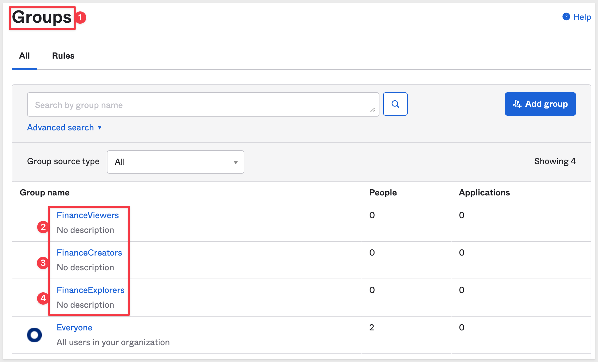

Lets use Okta to create a new Group and send it to Sigma over from the Okta UI. 

Click `Add Group`:

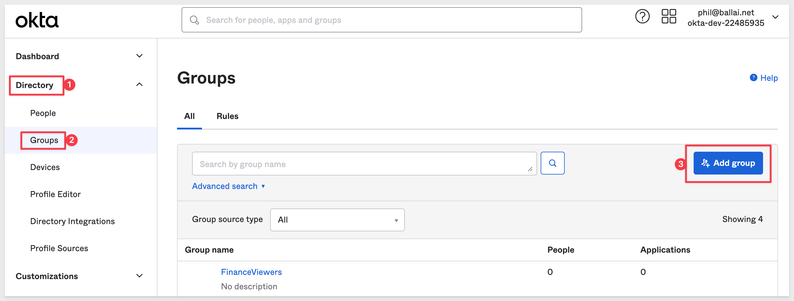

Give the new Group a name and description and click `Save`:

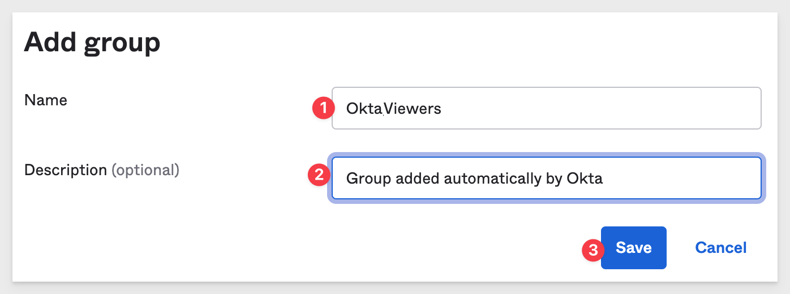

<aside class="negative">
<strong>NOTE:</strong>  You may need to refresh the browser page if the new group does not appear on the list right away.
</aside>

Now click into the new Group and navigate to the `Applications` tab. Then click the `Assign Applications` button:

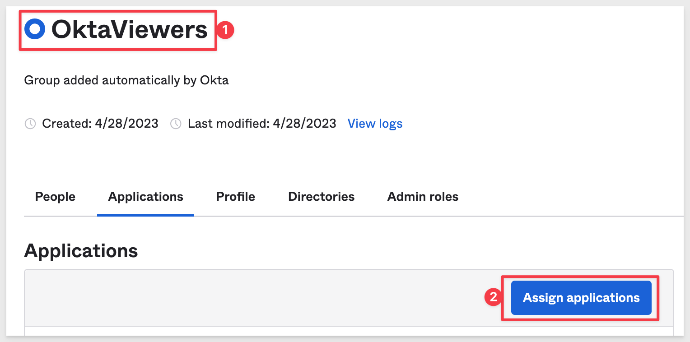

Click `Assign` for `Sigma on AWS`:

In the popup, select `Viewer` and click `Save and Go Back`:

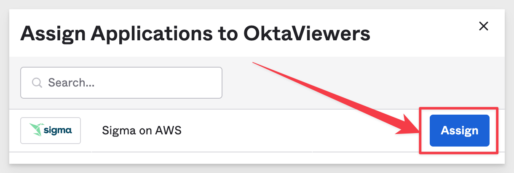

Then click `Done`.

We now need to ask Okta to push this new Group/Team to Sigma.

Navigate back to `Applications` > `Sigma on AWS` and click the `Push Group` tab, then the `Push Groups` button and then `Find groups by name`:

Start typing the group name and it will appear as shown for click selection:

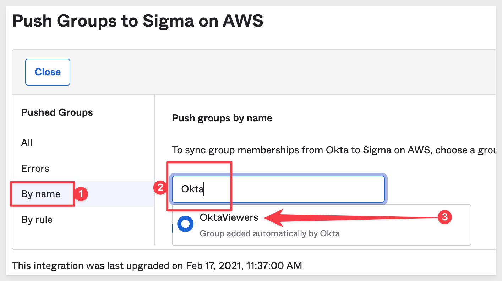

We want Okta to create the group so set it to `Create Group`:

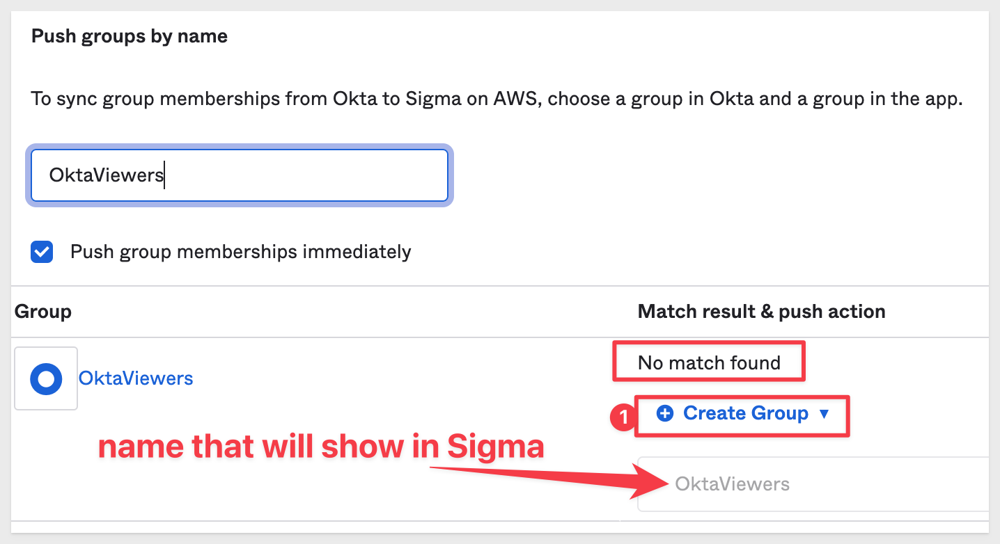

Click `Save`.

The group gets pushed to Sigma and it happens very quickly. The status will change from `Pushing` to `Active`:

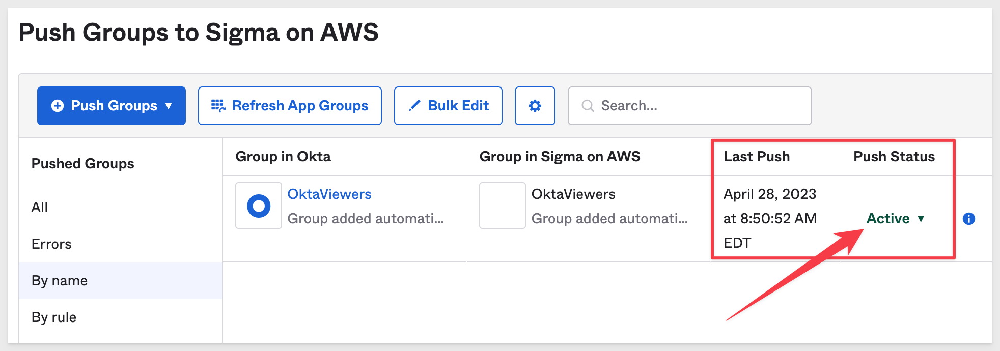

Back in Sigma, `Administration` > `Teams`, we see the new Team/Group that Okta sent to Sigma:

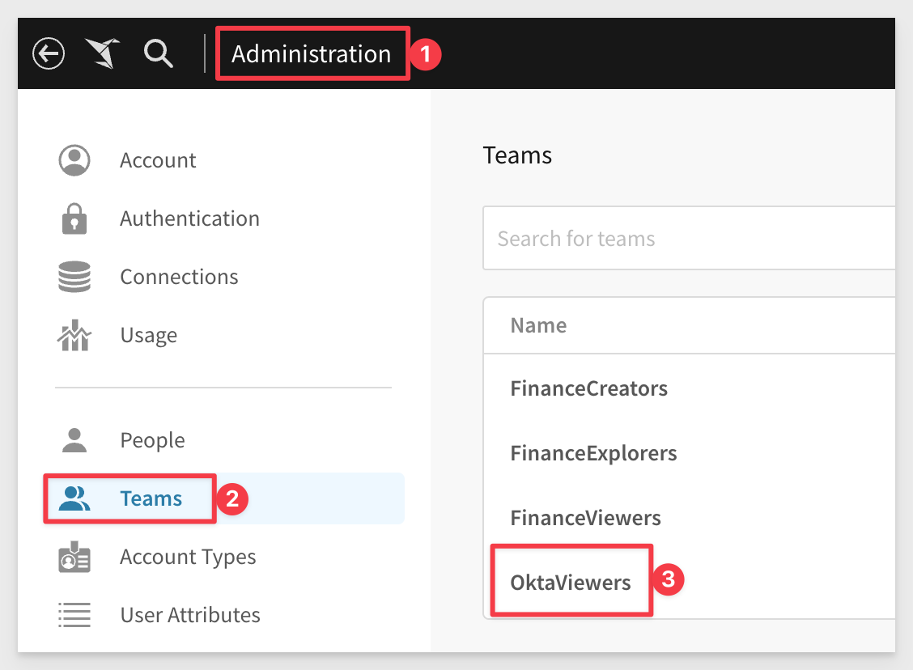

<!-- END OF NEXT SECTION-->

## Add User(s)
Duration: 20

Now that we have a Group with Viewer rights, we can assign new users to it in Okta as we create them. These new users can then use SSO to gain access to Sigma and will have the RBAC that we assigned them.

<aside class="positive">
<strong>IMPORTANT:</strong>  We are demonstrating the general framework / workflow, which can be used to create any RBAC integration between Okta and Sigma that your organization may need. Earlier, we set an Application attribute that made all users Viewers. We wanted to demonstrate both options to you. The Okta / Sigma integration is very flexible. 
</aside>

In Okta, navigate to `Directory` > `People` and click the `Add Person` button:

Configure the new user as shown, tailoring the details to suit the user:

Make sure to set the user to use the group in Okta for "Viewers" and it is good practice to set a default password and enforce a required password change on first login:

Click `Save` when done.

### Test New User

Open a new incognito Chrome browser and navigate to your Sigma account.

Click `Sign in with SSO`.

For `Username` use the email address assigned to the new user created in Okta. Enter the password as well.

Okta will respond with a page asking for a new password. Provide one. 

<aside class="negative">
<strong>NOTE:</strong>  Okta sign-on policies and rules provide a secure and flexible way to control how users authenticate and sign in to their accounts. Password policies, Okta sign-on policies, and app-specific application sign-on policies can be configured.
</aside>

[Read more about Okta Sign-on policies](https://help.okta.com/en-us/Content/Topics/Security/policies/policies-home.htm)

We don't need to give the new user permission to use the `Sigma on AWS` application in Okta. That is implied when we granted the Group access.

After changing password, we are taken to the Sigma portal and have only `Viewer` access:

It is also possible to see the Sigma App in the Okta portal for this user. 

Login to Okta (in another incognito browser window). Use the new user's email and password to login. 

The Okta portal should show the Sigma App tile:

<!-- END OF NEXT SECTION-->

## **Custom Account Types with Okta**
Duration: 20

It is common for companies to give users access to Sigma but disallow them the ability to export (download) data for various reasons. This is done by creating an `Account Type` in Sigma and assigning a team to it. 

Any users who are assigned to this "download restricted" team, will not be able to export content. 

Lets see how to adjust the user we just created in Okta to grant more rights but also not allow exports.

We will need to create a new `Group` in Okta (which we will push to Sigma as a `Team`) so that we can manage the level of access we want users to have. 

<aside class="negative">
<strong>NOTE:</strong>  Sigma comes with three "out-of-box" teams and they can be customized to suit or you can create as many other teams as needed.
</aside>

INSERT A WORKFLOW HERE PHIL

In Okta, `Directory` > `Groups`, click `Add group`:

Give the `Group` a name and description as shown and click `Ok`.

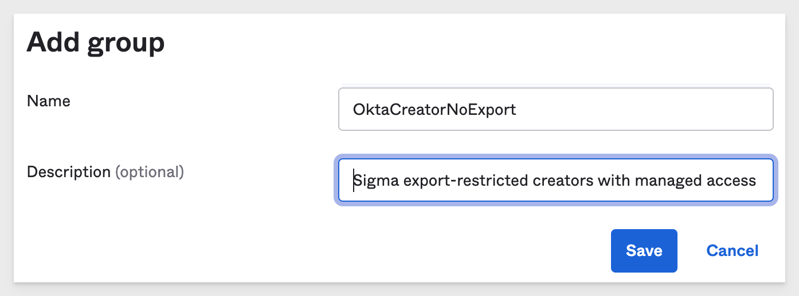

We need to assign this new group to the `Sigma on AWS` application:

In the assignment workflow (which we have shown previously) set the `User Type` to `Viewer`. 

Click `Save and Go Back` and then `Done`.

Navigate to the `Sigma on AWS` application, `Push Groups` tab. 

Click `+ Push Groups` and `Find groups by name`:

Start typing "Crea" in the input-box and select `Creator - No Export`. The checkbox for `Push group memberships immediately` should be checked by default.

Scroll down and select `Save`. The new Group will be immediately pushed to Sigma. 

Return to Sigma

In Sigma (as Administrator), navigate to `Administration` > `Teams`. Our Okta Group is listed here. 

Lets add a new `Account Type`. Click on `Account Types` > and `Create New Account Type` button:

Configure the Account Type as shown. Notice that we are not allowing any Export functionality (shown in light red):

Click `Create`.

We can check our test user "Bob" and see that he is a member of the "Okta Viewers" team and we are not given an option to change that because Okta is managing his team membership:

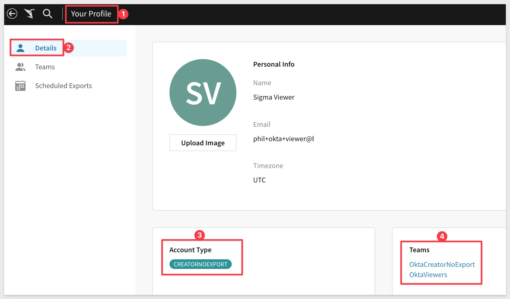

Lets assign Bob to our new group in Okta.

Navigate to to `Directory` > `Groups` > `People` and click `Assign people`:

Click the `+` in Bob's row to add him to the Group:

Click `Done`.

We also need to assign the `Creator - No Export` group to the `Sigma on AWS` application. Assign it with `Author` User Type.

### Test New Role in Sigma

Login to Sigma as Bob, using a new incognito browser.

STOPPED HERE PB

<!-- END OF NEXT SECTION-->

## What we've covered
Duration: 5

In this lab we learned how to.........

INSERT FINAL IMAGE OF BUILD IF APPROPRIATE

<!-- THE FOLLOWING ADDITIONAL RESOURCES IS REQUIRED AS IS FOR ALL QUICKSTARTS -->
**Additional Resource Links**

[Help Center Home](https://help.sigmacomputing.com/hc/en-us) 
[Sigma Community](https://community.sigmacomputing.com/) 
[Sigma Blog](https://www.sigmacomputing.com/blog/) 
 

&emsp;

<!-- END OF WHAT WE COVERED -->
<!-- END OF QUICKSTART -->