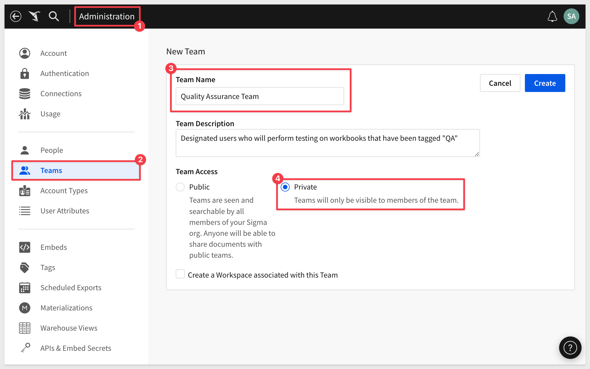
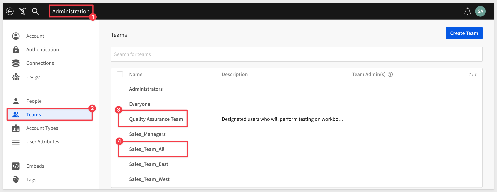
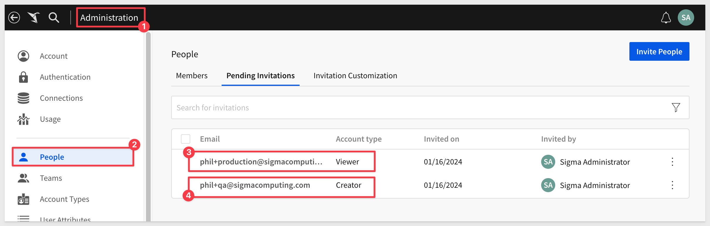
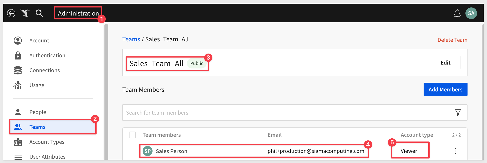
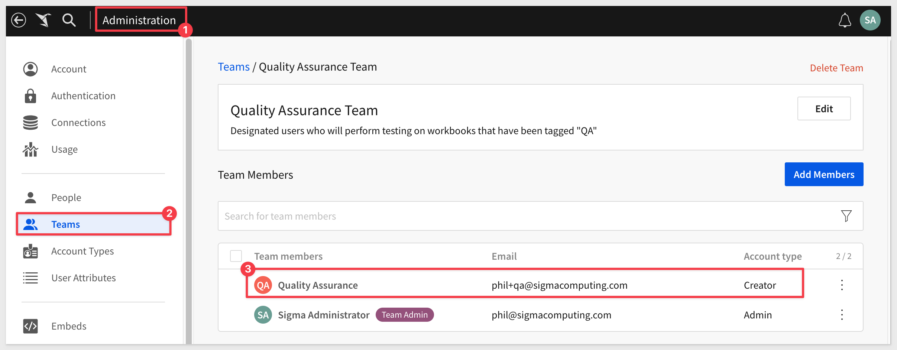
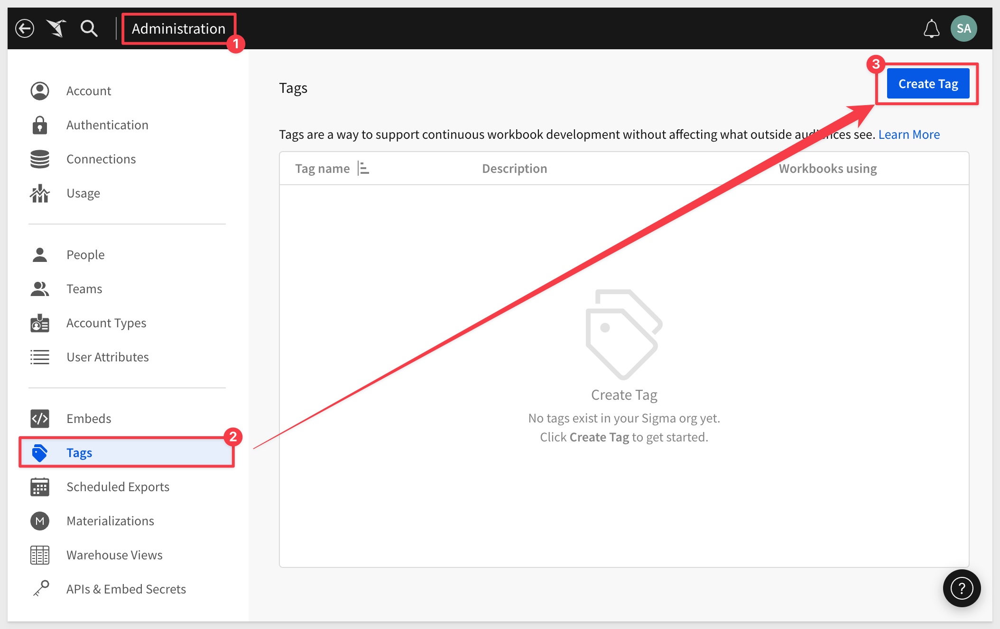
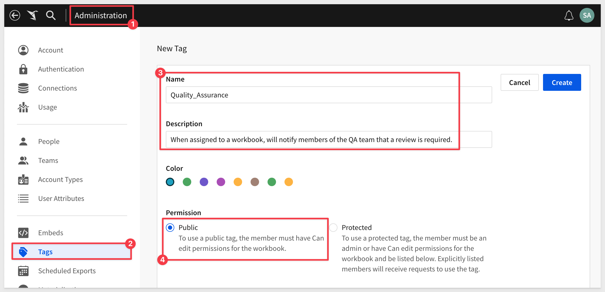
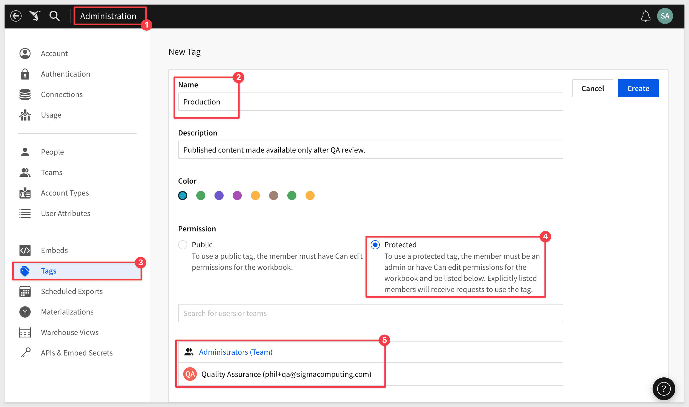
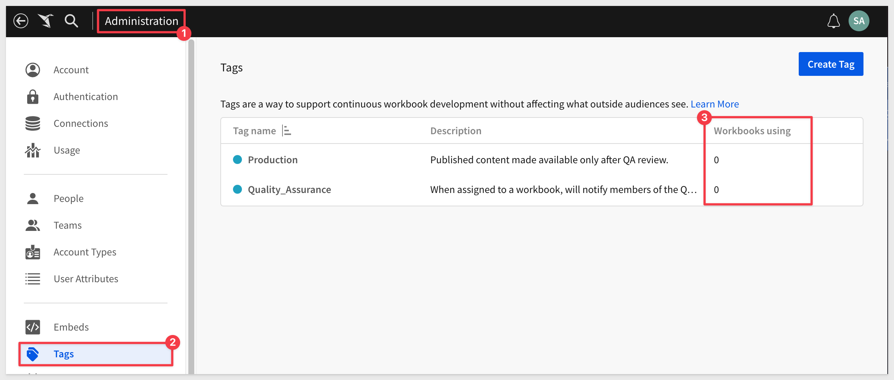

author: pballai
id: administration_version_tagging
summary: administration_version_tagging
categories: Administration
environments: web
status: Published
feedback link: https://github.com/sigmacomputing/sigmaquickstarts/issues
tags: default
lastUpdated: 2024-01-20

# Version Tagging with Sigma

## Overview 
Duration: 5 

Version tagging allows you to employ a software development lifecycle (SDLC) to control Workbook versions, using tags. Tags provide control over which workbook versions are available to your users. 

In this QuickStart, we will confine the use and management of version tagging inside Sigma itself. For those interested in integrating with external tools, [please check out the QuickStart: Embedding 8: Version Tagging](https://quickstarts.sigmacomputing.com/guide/embedding_8_version_tagging/index.html?index=..%2F..index#0) 

In Sigma, administrators can create as many tags as required by the organizations SDLC workflows. 

When you create a tag and assign it to a workbook, you essentially **freeze the state of that workbook**. 

The process of tagging a Workbook creates a duplicate that can be shared with other stakeholders and users.  

Sigma’s version tagging facilitates collaboration and control, especially in team environments where multiple users are working on the same workbook.

For example, administrators can create `Production` and `QA` tags, and assign them to a workbook that's used by groups of Sigma end users.

The `QA` version is used for testing and approval purposes. Once reviewed, the workbook can be tagged `Production` for users to consume.

<aside class="postive">
<strong>IMPORTANT:</strong>  Sigma’s version tagging facilitates collaboration and control, especially in team environments where multiple users are working on the same workbook.
</aside> 

 ### Target Audience
Semi-technical users who are interested in a more controlled (ie: SDLC) methodology for developing, testing and deploying Sigma content.

### Prerequisites

<ul>
  <li>A computer with a current browser. It does not matter which browser you want to use.</li>
  <li>Access to your Sigma environment.</li>
  <li>Some familiarity with Sigma is assumed. Not all steps will be shown as the basics are assumed to be understood.</li>
</ul>

<aside class="postive">
<strong>IMPORTANT:</strong>  Sigma recommends that you use non-production resources when doing QuickStarts.
</aside>

<button>[Sigma Free Trial](https://www.sigmacomputing.com/free-trial/)</button>
  
### What You’ll Learn
How to Sigma version tagging can be used to provide a controlled release experience which should result in less reported issues and happier end-users.

## Typical Workflow
Duration: 20

need a Lucid flow here Phil

<!-- END OF SECTION-->

## Getting Started
Duration: 20

### Example Use Case
Our sales team, who are avid users of Sigma as `Viewers`, recently reported some issues with the sales output details in the workbooks. This is causing frustration and wasted time for the Sales team.

Currently, Sigma users who have the `Creators` permission are responsible for creating content.

Upon learning about these challenges, our CTO sought an efficient, cost-effective solution to enhance the quality of the workbooks before they reach the sales team.

We informed the CTO that Sigma's built-in version tagging feature is the perfect solution to address these concerns. **Notably, this functionality comes at no additional cost.**

<aside class="positive">
<strong>IMPORTANT:</strong>  Sigma is very flexible. The use case described here is one example, and was created to make version tagging easy to understand. More complex SDLC workflows are also possible.
</aside>

Here is how we will get this done.

### Teams and Users

For this use case, we will create some teams and a user to help facilitate our demonstration. 

First, we will create two teams; `Quality Assurance` and `Sales_Team_All`. 

  

For the `Quality Assurance` team, we will assign one user, who will be responsible for testing workbooks, prior to promotion to production use.

All other sales users will be assigned to the `Sales_Team_All` team.

### Assign users to teams

We need to create at least one user (for each team) in order to demonstration version tagging. 

In Sigma > Administration > People, we have added one user for each team:

<aside class="negative">
<strong>NOTE:</strong>  Users in Sigma must have unique email addresses. We use the `+` sign to create an email alias, as google mail allows for this. 
</aside>

<aside class="positive">
<strong>IMPORTANT:</strong>  Don't forget that you will need to "accept" any new users you invite to Sigma or they will not be available to assign to teams (for example).
</aside>

We also need to assign these users to each team:

*and....*

<aside class="negative">
<strong>NOTE:</strong>  New users can also be assigned team(s) when they are created. This saves administrative time. 
</aside>

### Create tags

Now we need to create the tags we want to use for our organization. 

<aside class="negative">
<strong>NOTE:</strong>  Tags should have names that make their purpose obvious as the name will appear in other places in the workflow. 
</aside>

Log into Sigma as an administrator and navigate to `Administration` > `Tags` and click the `Create Tag` button:

Our first tag, `Quality Assurance` is created with the `Public` permission. Recall that in our use case, content is made by users who have the `Creator` permission and therefore, will be able to edit workbooks. 0The `Protected` option is there for those who want to explicitly control who receive messages for review.

For our `Production` tag, we want to ensure that only a member of the QA team or Sigma administrator can promote content to production. That configuration is:

Our two tags are created and Sigma provides an indication of how many workbooks are using each (none so far):

We are now ready to start using version tagging in an example tagging workflow.

<!-- END OF SECTION-->

## Create Sample Content
Duration: 20

In Sigma, we will use create a new workbook that contains a single table, based off the Sigma Sample Database.

If you are unfamiliar how to create this content, please review step 5 of this QuickStart: [Fundamentals 1: Getting Around](https://quickstarts.sigmacomputing.com/guide/fundamentals-1-getting-around/index.html?index=..%2F..index#4)

<!-- END OF SECTION-->

## 4
Duration: 20

<!-- END OF SECTION-->

## What we've covered
Duration: 5

In this lab we learned how to.........

INSERT FINAL IMAGE OF BUILD IF APPROPRIATE

<!-- THE FOLLOWING ADDITIONAL RESOURCES IS REQUIRED AS IS FOR ALL QUICKSTARTS -->
**Additional Resource Links**

[Blog](https://www.sigmacomputing.com/blog/) 
[Community](https://community.sigmacomputing.com/) 
[Help Center](https://help.sigmacomputing.com/hc/en-us) 
[QuickStarts](https://quickstarts.sigmacomputing.com/) 
=======
Be sure to check out all the latest developments at [Sigma's First Friday Feature page!](https://quickstarts.sigmacomputing.com/firstfridayfeatures/)
 

&emsp;
&emsp;

<!-- END OF WHAT WE COVERED -->
<!-- END OF QUICKSTART -->