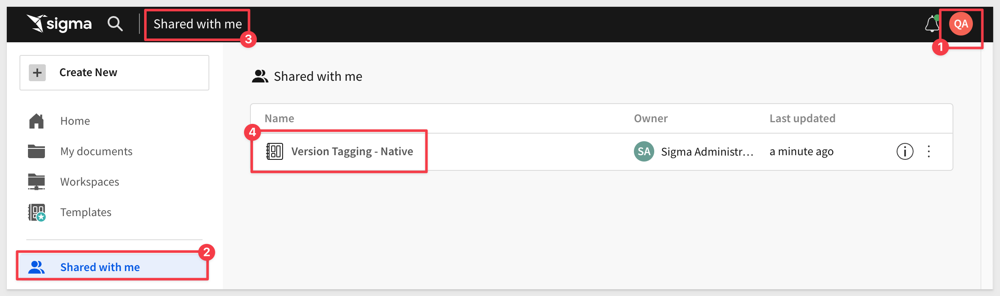

author: pballai
id: administration_version_tagging
summary: administration_version_tagging
categories: Administration
environments: web
status: Published
feedback link: https://github.com/sigmacomputing/sigmaquickstarts/issues
tags: default
lastUpdated: 2024-01-20

# Version Tagging with Sigma

## Overview 
Duration: 5 

Version tagging allows you to employ a software development lifecycle (SDLC) to control Workbook versions, using tags.

Tags provide control over which workbook versions are available to your users, along with some workflow automation to foster collaboration. 

In this QuickStart, we will confine the use and management of version tagging inside Sigma itself. 

For those interested in integrating with external tools, [please check out the QuickStart: Embedding 8: Version Tagging](https://quickstarts.sigmacomputing.com/guide/embedding_08_version_tagging/index.html?index=..%2F..index#0) 

### Tagging concept

In Sigma, administrators can create as many tags as required by the organization's SDLC workflows. Tags are created in Sigma's administrative interface.

**When a tag is created and assigned to a workbook, the workbook version's state is essentially frozen, at the time of the tagging.**

The process of tagging a workbook creates a virtual duplicate that can be shared with other stakeholders and users.  

For example, administrators can create `Production` and `Quality Assurance` tags, and assign them to a workbook that's used by groups of Sigma end users.

The `Quality Assurance` version is used for testing and approval purposes. Once reviewed, the workbook can be tagged `Production` for users to consume.

<aside class="postive">
<strong>IMPORTANT:</strong>  Sigma’s version tagging facilitates collaboration and assures control, especially in team environments where multiple users are working on the same workbook.
</aside> 

 ### Target Audience
Semi-technical users who are interested in a more controlled (ie: SDLC) methodology for developing, testing and deploying Sigma content.

### Prerequisites

<ul>
  <li>A computer with a current browser. It does not matter which browser you want to use.</li>
  <li>Access to your Sigma environment.</li>
  <li>Some familiarity with Sigma is assumed. Not all steps will be shown as the basics are assumed to be understood.</li>
</ul>

<aside class="postive">
<strong>IMPORTANT:</strong>  Sigma recommends that you use non-production resources when doing QuickStarts.
</aside>

<button>[Sigma Free Trial](https://www.sigmacomputing.com/free-trial/)</button>
  
### What You’ll Learn
How to Sigma version tagging can be used (inside Sigma itself) to provide a controlled release experience which should result in less reported issues and happier end-users.

## Typical Workflow
Duration: 20

It is important to understand that the system is flexible enough to allow for different workflows.

For example, in the diagrams below, we see two possible workflows. The first, which assumes QA will only pass/fail content and the second which allows them to make changes in order to get to production without another development cycle. It is up to your organization how you want to structure the workflow / approval process.

In our use case, we will allow a Quality Assurance team to make edits instead of the original developers. 

<!-- END OF SECTION-->

## Getting Started
Duration: 20

### Example Use Case
Our sales team, who are avid users of Sigma as `Viewers`, recently reported some issues with the sales output details in the workbooks. This is causing frustration and wasted time for the Sales team.

Currently, Sigma users who have the `Creators` permission are responsible for creating content.

Upon learning about these challenges, our CTO sought an efficient, cost-effective solution to enhance the quality of the workbooks before they reach the sales team.

We informed the CTO that Sigma's built-in version tagging feature is the perfect solution to address these concerns.

**Notably, this functionality comes at no additional cost.**

<aside class="positive">
<strong>IMPORTANT:</strong>  Sigma is very flexible. The use case described here is one example, and was created to make version tagging easy to understand. More complex SDLC workflows are also possible.
</aside>

Here is how we will get this done.

### Teams and Users

For this use case, we will create some teams and a user to help facilitate our demonstration. 

First, we will create two teams; `Quality Assurance Team` and `Sales_Team_All`. 

  

### Assign users to teams

We need to create at least one user (for each team) in order to demonstration version tagging. 

For the `Quality Assurance` team, we will assign one user, who will be responsible for testing workbooks, prior to promotion to production use.

All other sales users will be assigned to the `Sales_Team_All` team.

In Sigma > `Administration` > `People` we have added one user for each team:

<aside class="negative">
<strong>NOTE:</strong>  Users in Sigma must have unique email addresses. We use the `+` sign to create an email alias, as Google mail allows for this. 
</aside>

<aside class="positive">
<strong>IMPORTANT:</strong>  Don't forget that you will need to "accept" any new users you invite to Sigma or they will not be available to assign to teams.
</aside>

We also need to assign these users to each team:

*and....*

<aside class="negative">
<strong>NOTE:</strong>  New users can also be assigned team(s) when they are created. This saves administrative time. 
</aside>

### Create tags

Now we need to create the tags we want to use for our organization. 

<aside class="negative">
<strong>NOTE:</strong>  Tags should have names that make their purpose obvious, as the name will appear in other places in the workflow. 
</aside>

Log into Sigma as an administrator and navigate to `Administration` > `Tags` and click the `Create Tag` button:

Our first tag, `Quality_Assurance` is created with the `Public` permission. Recall that in our use case, content is made by users who have the `Creator` permission and therefore, will be able to edit workbooks. The `Protected` option is there for those who want to explicitly control who receive messages for review.

For our `Production` tag, we want to ensure that only a member of the QA team or Sigma administrator can promote content to production. That configuration is:

Our two tags are created and Sigma provides an indication of how many workbooks are using each (none so far):

We are now ready to start using version tagging, in an example tagging workflow.

<!-- END OF SECTION-->

## Create Sample Content
Duration: 20

In Sigma, we will use create a new workbook that contains a single table, based off the `Sigma Sample Database`.

If you are unfamiliar how to create this content, please review step 5 of this QuickStart: [Fundamentals 1: Getting Around](https://quickstarts.sigmacomputing.com/guide/fundamentals-1-getting-around/index.html?index=..%2F..index#4)

When we create this workbook, we will intentionally leave out the `Order Number` column so we can simulate the workflow, adding it back in the review cycle.

A workbook with the `PLUGS_ELECTRONICS_HANDS_ON_LAB_DATA` table on it should look like this, while still in `edit` mode:

<!-- END OF SECTION-->

## Tagging
Duration: 20

Now that we have our workbook created, we can tag the workbook as ready for `Quality Assurance` to review it:

This is done by clicking the carrot (down arrow) next to the workbook's name and selecting `Tag latest published version` from the drop menu:

<aside class="positive">
<strong>IMPORTANT:</strong>  Take note of the wording "Tag latest published version". This is telling us that our workbook (in the last screenshot) is in a draft state and that if we do not publish it, the unpublished changes will not be what the tag will be applied to. 

Instead, it will tag the most recent published version, if one exists. 

Always publish prior to tagging to avoid this potential issue. The workbook must be in a published state (at least one time) in order to add a version tag. 
</aside>

If we publish our draft instead, notice that the tagging menu item changes to `Tag this published version`:

We will select to tag this version and move on, next selecting to apply the `Quality_Assurance` tag to our workbook:

On this modal (Set Tag on Version) there are a few other interesting features that enable even more complex functionality:

**Allow user to use data sources when they "Save As":** 
This enables a user with access to a tagged version, to make a copy of the workbook.  When a user does this, the copy will no longer be connected to the original version of the workbook.

**Swap sources of the tagged version:** 
Allows user to swap sources of the tagged version to select a different source (connection, database, schema) for this tagged workbook. They are able to browse and select available sources in the dropdown under `Sources of Tagged Workbook`. If this is left unchecked, the user tagging the workbook will not be prompted to select a different source. This is useful when there different source tables that have the same schema. For example, development has tables dedicated to their work that have the identical schema as the tables used in production.

<aside class="positive">
<strong>IMPORTANT:</strong>  Tables created through CSV uploads, Input tables, and Custom SQL are not available for data source swapping. These items cannot be migrated across connections (at the time of this QuickStart), but please check with Sigma support to get the most recent information. We are always interested in what features are important to our customers.
</aside>

<aside class="negative">
<strong>NOTE:</strong>  Input tables created in one version will be available in other tagged version, but any data entered into that Input Table will not be copied into the new tag. 

CSV files uploaded into the workbook will be available across different tags, but will only be updatable in the "Draft" version. 

Materialized tables and data warehouse views will be available across all tags, but only updatable in the "Draft" version.
</aside>

Click the `Set Tag on Version` button.

The workbook is now showing that it is tagged `Quality_Assurance`. In this example, we can see that the tag is also added to the end of the URL:

We also have the ability to see `Version History`, which is a listing of all the changes made to this workbook. 

**This is very useful** in determining who made changes (and the details of the change) along with the ability to revert to previous versions.  Numbers 4-5 in the screenshot below (the 3-dots) have menus that provide functionality that is well worth exploring:

### Deleting a tag:
For example, you may wish to "untag" or remove a tag from a workbook. Workbooks written to different tags can be removed by opening `Version History` in the workbook, and clicking on the three dots to the right of the version name, and selecting `Remove this tag` to delete the tag:

<li><strong></strong>Some reasons for deletion may be:</strong>
    <ol type="n"> 
      <li>Content was tagged (migrated) with a material misstatement or error.  Remove the tag and resolve issues in the "Draft" or previous version.</li>
      <li>Any security testing that exposes more data than expected.</li>
      <li>Accidental tagging.</li>
    </ol>
  </li>

### Add a tag description
Another useful collaboration feature is to add meaningful names and descriptions to changes listed in the workbook's version history. 

This can include the purpose for the change, link to any tickets or other information that might be useful to yourself or other collaborators.

For example:

### Sharing the tagged workbook

Before the Quality Assurance team can see this workbook, we will need to share it with them:

In our use case, we are restricting the Quality Assurance Team members to only explore the workbook that is tagged `Quality_Assurance`, so they can either find issues set the tag to production. We are also sending them an email (which is optional).

Since we shared to a Team, Sigma warns us about that:

Now that the workbook is shared, we can login as our Quality Assurance user and check the `Shared with me` folder.

We see our workbook is shared now:

<!-- END OF SECTION-->

## Requesting Edit Access
Duration: 5

In our example, we did not give the Quality Assurance team `edit` permission to the workbook. 

We want them to review and if they found and error, request edit access to make a correction. 

This will provide an audit trail in the workbook's version history.

This action generates an email to the workbook owner that allows them to grant the request, by clicking the button in the email:

...and then `Deny` or `Approve` the request in Sigma:

We clicked `Approve` in this case, so now Quality Assurance has `Can edit` permission to all versions of this workbook:

### Make corrections

Now that we have edit access, we can (as the Quality Assurance user) place the workbook in `explore` mode, access the `element panel` and add the missing column to the data (Order Number):

Sigma warns you that we are now working on a variation that we can save or revert back to the last published version:

### Migrating to Production

There are some options that allow organizations to decide who has production release authority and Sigma allows you to have as many tags as you would like, in support of this. 

In our use case, we will simply assume that Quality Assurance can release to production (by tagging the workbook accordingly). 

To stay organized, the team can use a Sigma workspace or simply create a folder to store production workbook in. 

<aside class="positive">
<strong>IMPORTANT:</strong>  For large multi-user workbooks, best practice is to store in a workspace and tag that workspace, when sharing the workspace with teams or users.
</aside>

Since this is single workbook example, we will just save the workbook in a folder:

Now we just repeat the tagging process as before, setting the tag to `Production`:

...deciding if we want to allow different data source options to users:

...and finally, sharing this new version with the Sales Team, locking them down to only see the version tagged `Production`:

Logging back into Sigma as a "Sales Person", we can see the new workbook that Quality Assurance has shared:

The sales user can see the `Order Number` column, but only has access to the production tagged version:

The `Quality Assurance` user retains access to the `Production` version that they saved, along with the version tagged `Quality_Assurance`, that was shared with them by the workbooks creator.

The workbook creator retains access to the original `Draft`, along with the version they tagged `Quality_Assurance`.

<!-- END OF SECTION-->

## Wrapping up
Duration: 5

While Sigma has worked hard to make versioning simple, the tagging system is also very flexible. 

It is recommended that customers thoughtfully plan how to best use all the options, so that SDLC workflows are simple and effective as possible. **Upfront planning is the key in this regard.**

Some additional detail on [version tagging can be found in our documentation](https://help.sigmacomputing.com/docs/version-tagging), and we encourage you to review that as well. 

<!-- END OF SECTION-->

## What we've covered
Duration: 5

In this QuickStart, we discussed Sigma's version tagging system, and used it to drive a use case that took us through content promotion from creation, quality assurance and production. 

This was one example of version tagging, covering the basics, so that readers could become familiar with how version tagging works in general. 

<!-- THE FOLLOWING ADDITIONAL RESOURCES IS REQUIRED AS IS FOR ALL QUICKSTARTS -->
**Additional Resource Links**

[Blog](https://www.sigmacomputing.com/blog/) 
[Community](https://community.sigmacomputing.com/) 
[Help Center](https://help.sigmacomputing.com/hc/en-us) 
[QuickStarts](https://quickstarts.sigmacomputing.com/) 
=======
Be sure to check out all the latest developments at [Sigma's First Friday Feature page!](https://quickstarts.sigmacomputing.com/firstfridayfeatures/)
 

&emsp;
&emsp;

<!-- END OF WHAT WE COVERED -->
<!-- END OF QUICKSTART -->