author: pballai
id: agents_01_building_your_first_agent
summary: agents_01_building_your_first_agent
categories: agents
environments: web
status: Published
feedback link: https://github.com/sigmacomputing/sigmaquickstarts/issues
tags: default
lastUpdated: 2026-12-31

# Building Your First Sigma Agent

## Overview
Duration: 10

Build a Sigma agent that plans a request, grounds it in governed data, and hands back an answer someone besides its builder can verify — not just one that returns a fast guess.

Getting an answer has never been the whole job. A real request gets planned into something precise, explored against context, verified against the underlying data, acted on, and shared with whoever needs it next. A model pointed straight at a warehouse can do the first of those things. The rest is what an agent needs a governed platform underneath it to do at all.

That's what a Sigma agent is: the same governed, warehouse-native architecture that already makes Sigma trustworthy for a person to work in directly, put behind a conversation. It reads through the same object model as every other Sigma element, so what an agent can see and do is exactly what you've already governed — no separate model, no separate rules to maintain.

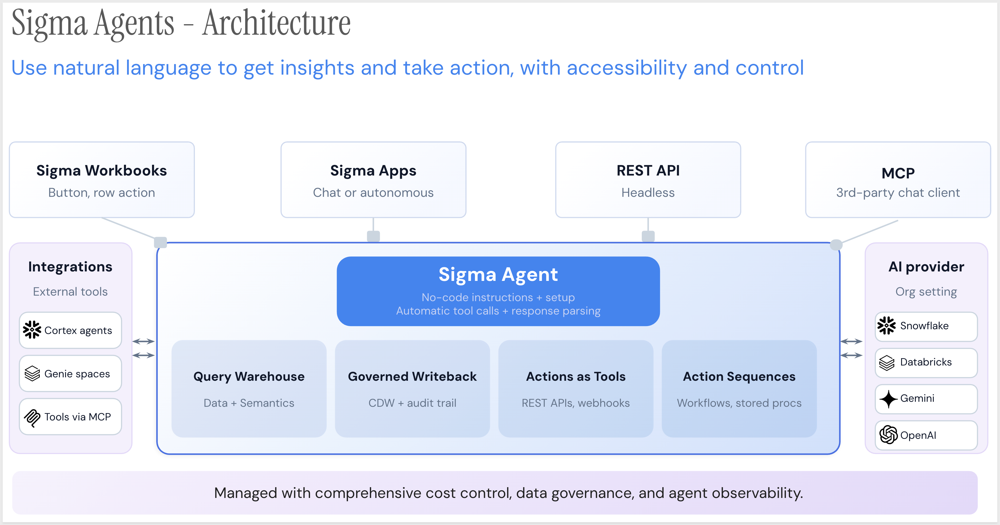

A Sigma agent can be reached five different ways — a manual trigger, a chat window, a schedule, a REST API call, or another agent over MCP — and every one of them lands on the same governed core: the same data connection, the same write-back audit trail, the same tools, no matter which door you walked through.

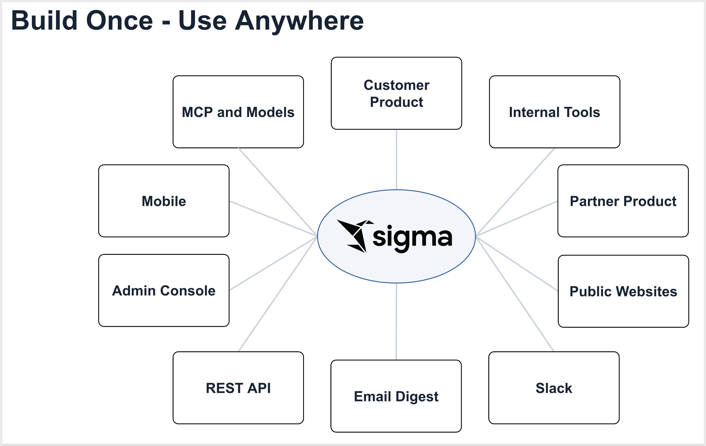

This QuickStart demonstrates the door most people start with: chat — but not the chat window built into Sigma Assistant. Sigma Assistant is Sigma's built-in way to ask questions of your data; the agent you'll build here is a separate, named object you configure yourself, with its own data sources and its own instructions, that happens to also be reachable through a chat window, alongside a schedule, an API call, or another agent over MCP.

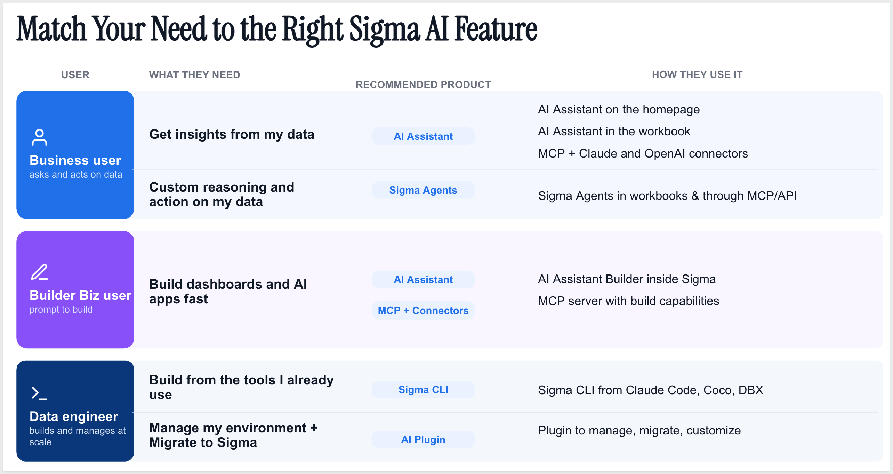

We will build a Sigma agent from the ground up — attach it to a data source, write the instructions that scope what it's allowed to do, and have a conversation with it to see how it decides what to do with a request before it answers.

Along the way you'll learn how to:
- Create a Sigma agent and attach a governed data source to it
- Write instructions that scope what an agent can and can't do
- Test an agent in a chat conversation and read how it reasons through a request
- Recognize where this agent could go next — the tools, actions, and entry points covered later in this series

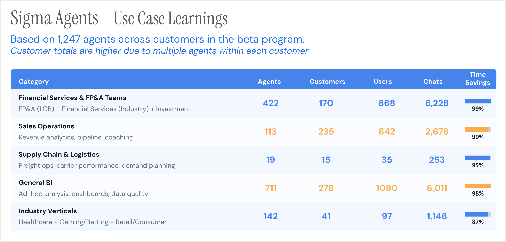

<aside class="positive">
<strong>WHY IT MATTERS:</strong><br> An agent that only answers a question has done a fraction of the job. Sigma agents can plan, explore, verify, act, and share — all on the same governed connection your business already trusts, which is what lets an agent move from suggesting something to safely acting on your behalf.
</aside>

<aside class="positive">
<strong>IMPORTANT:</strong><br> Some screens in Sigma may appear slightly different from those shown in QuickStarts. This is because Sigma continuously adds and enhances functionality. Rest assured, Sigma's intuitive interface ensures that any differences will not prevent you from successfully completing any QuickStart.
</aside>

For more information on Sigma's product release strategy, see [Sigma product releases](https://help.sigmacomputing.com/docs/sigma-product-releases)

If something doesn't work as expected, here's how to [contact Sigma support](https://help.sigmacomputing.com/docs/sigma-support)

### Target Audience
The typical audience for this QuickStart includes Sigma workbook authors and admins who want to move from viewing AI-generated answers to building the agent that produces them.

### Prerequisites

<ul>
  <li>Any modern browser is acceptable.</li>
  <li>Access to your Sigma environment with permission to create and manage agents.</li>
  <li>A workbook or data model you can attach as a data source — no warehouse-specific setup is required for this QuickStart.</li>
  <li>Some familiarity with Sigma is assumed. Not all steps will be shown, as the basics are assumed to be understood.</li>
 </ul>

<aside class="positive">
<strong>IMPORTANT:</strong><br> Sigma recommends using non-production resources when completing QuickStarts.
</aside>

<button>[Sigma Free Trial](https://www.sigmacomputing.com/free-trial/)</button>

<aside class="negative">
<strong>IMPORTANT:</strong><br> Some features may carry a "Beta" tag. Beta features are subject to quick, iterative changes. As a result, the latest product version may differ from the contents of this document.
</aside>


## Create a Workbook and Add Your Data
Duration: 10

Every Sigma agent needs something to reason over. Before building the agent itself, let's give it a home — a workbook — and a data source it's allowed to see.

### Create a new workbook

From Sigma Home, click `Create New` and select `Workbook`.

In the top left, click `Save as` and name it:

```copy-code
My First Sigma Agent - QuickStart
```

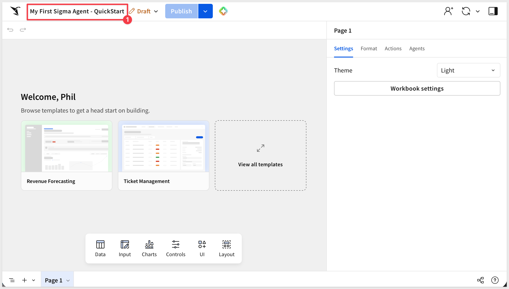

### Add a data source to the page

From the element bar at the bottom, add a `Table` element from the `Data` group, and connect it to:

```copy-code
BIG_BUYS_POS
```

from `Sigma Sample Database` > `RETAIL` > `BIG_BUYS`.

<aside class="positive">
<strong>NOTE:</strong><br> `Sigma Sample Database` ships with every Sigma account, so there's nothing to connect or set up first. `BIG_BUYS_POS` is a retail point-of-sale table with enough columns — region, product, date, price, cost, quantity — to carry every example in this series. If you'd rather use a table or data model of your own instead, any of them works just as well; the agent you build later will attach to whichever table you add now.
</aside>

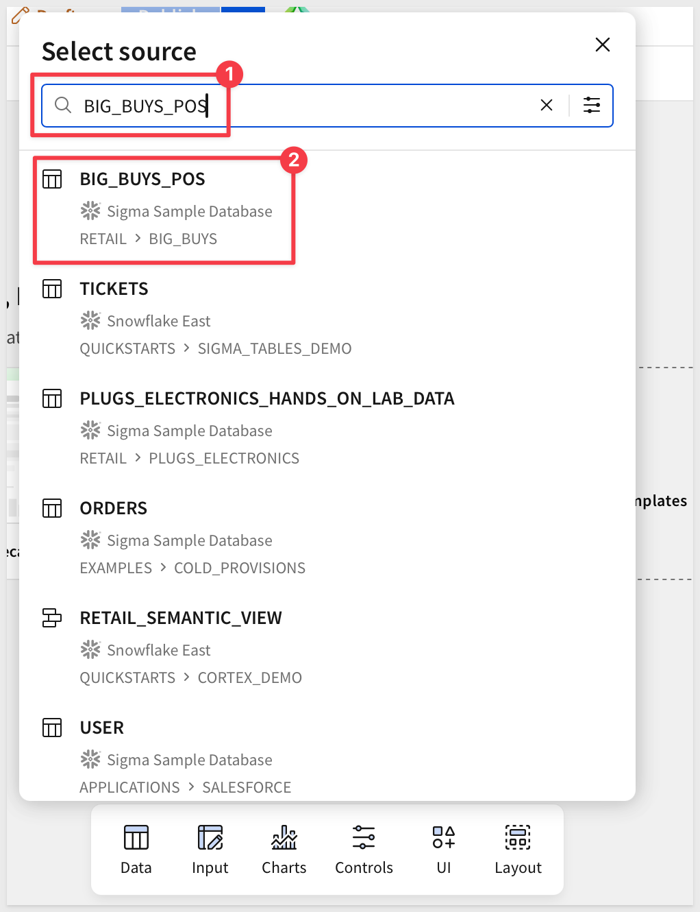

Rename the table element to something identifiable:

```copy-code
Agent Source Data
```

<aside class="positive">
<strong>WHY IT MATTERS:</strong><br> The agent you build in the next section will only be able to see this exact table — nothing else in the connection, and nothing else in the workbook unless you explicitly add it as a data source. That's the governance boundary from the Overview, made concrete.
</aside>

Rename the page from `Page 1` to `Data`.

Click `Publish`:

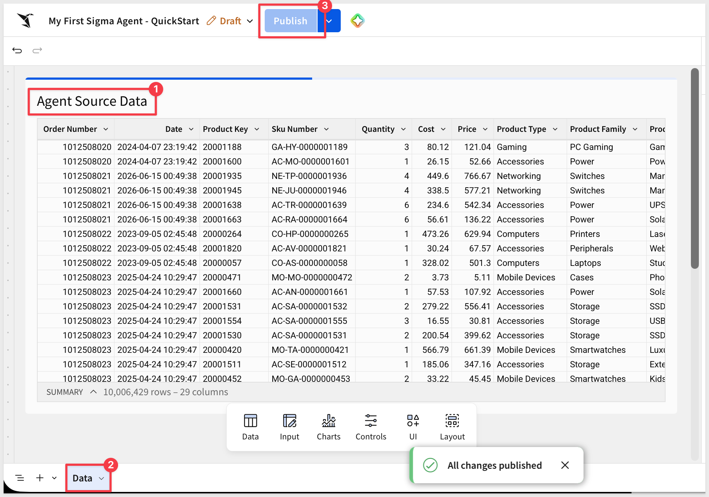


<!-- END OF SECTION-->

## Build the Sigma Agent
Duration: 15

The workbook has a data source now. This is where the agent that reasons over it gets built.

### Open the Agents panel

Click a blank area of the canvas to deselect any element. In the right panel, click the `Agents` tab.

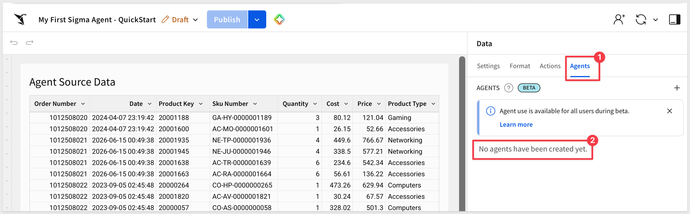

You'll see "No agents have been created yet."

### Create a new agent

Click the `+` button to create a new agent.

<aside class="positive">
<strong>NOTE:</strong><br> Agents are created at the workbook level, not the page level. The same agent can power a chat element on any page in this workbook, or several at once.
</aside>

Click the pencil icon and change the default name from (`Agent 1`) to:
```copy-code
My First Agent
```

### Add the data source

Under `Data sources`, click `Add data source` (`+`). Select `Elements` > `Data` > `Agent Source Data` — the table added in the previous section.

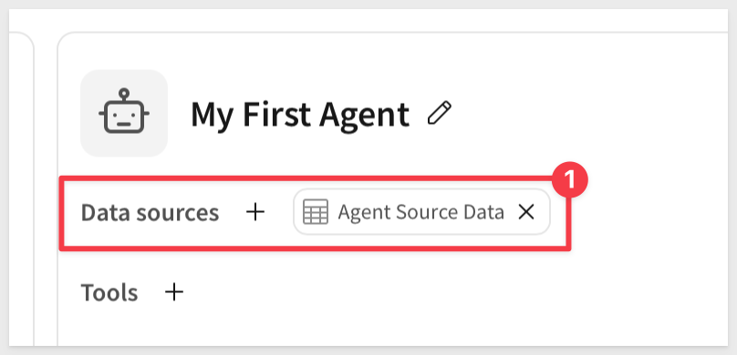

<aside class="positive">
<strong>WHY IT MATTERS:</strong><br> This list is the entire governance boundary from the Overview, made literal: whatever isn't added here, the agent can't see — not other tables in the connection, not other pages in the workbook.
</aside>

### Write the instructions

Click the `Instructions` tab and enter:

```copy-code
You are a retail data assistant. Answer questions using Agent Source Data — orders, products, regions, and sales figures.

When responding:
- Be concise and specific
- Reference exact figures from the data, not estimates
- If a question can't be answered from Agent Source Data, say so rather than guessing
```

<aside class="positive">
<strong>NOTE:</strong><br> Instructions are the agent's scope, not a suggestion. They're the difference between an agent that stays inside the data you gave it and one that starts guessing the moment a question runs past what it can see.
</aside>

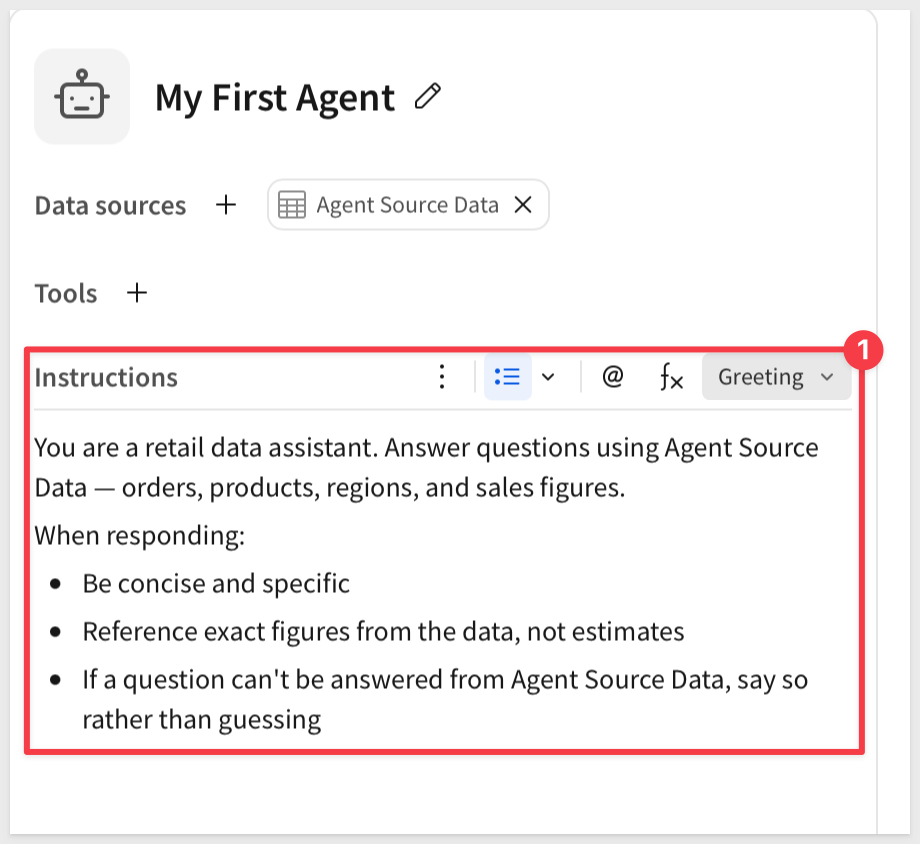

### Set a greeting

Click `Greeting`, enable `Fixed`, then enter:

```copy-code
Ask me about the retail data in Agent Source Data — orders, products, regions, or sales.
```

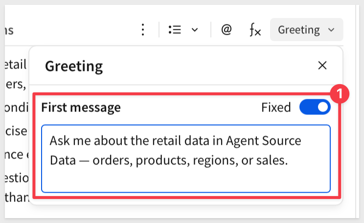

<aside class="positive">
<strong>NOTE:</strong><br> A fixed greeting is optional, but it tells whoever opens the chat element what this particular agent is actually for, instead of leaving them staring at a blank box.
</aside>

### Save the agent

Click `Save`.

`My First Agent` now appears in the Agents panel, with a data source and instructions attached — ready to connect to a chat element.


<!-- END OF SECTION-->

## Add a Chat Element and Test It
Duration: 10

The agent exists, but nothing on the page can talk to it yet. A [chat element](https://help.sigmacomputing.com/docs/chat-with-agent) is the interface — the agent underneath is the same one you just built, no matter how many chat elements end up pointed at it.

### Add the chat element

Click `+` next to the page tabs to add a new page, then rename it from `Page 1` to:

```copy-code
Chat
```

On the new `Chat` page, add an element from the element bar at the bottom: click `UI` > `Chat`.

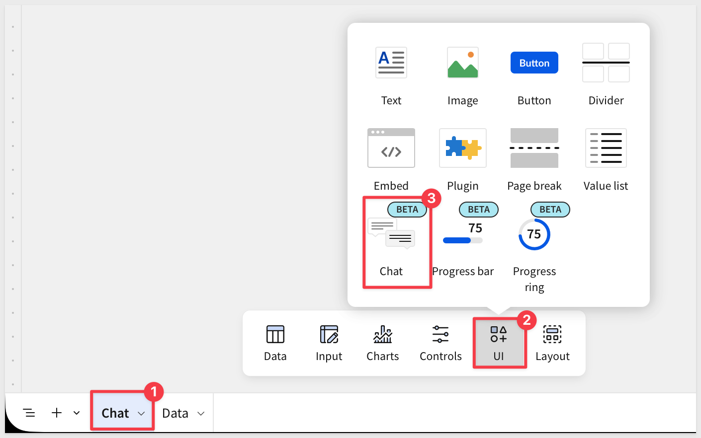

### Connect it to the agent

Click the chat element to select it. In its configuration, select the agent to power it:

```copy-code
My First Agent
```

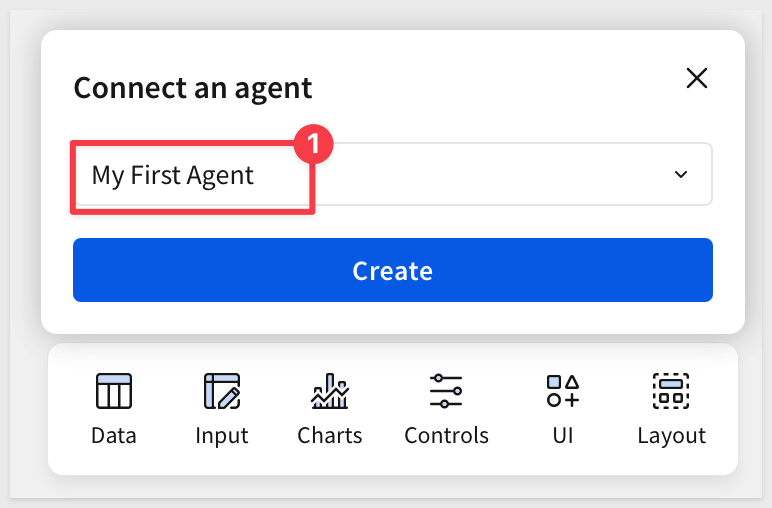

<aside class="positive">
<strong>NOTE:</strong><br> This is the pairing from the Overview, made concrete: the chat element is the door, the agent is what's behind it. Swap in a different agent here and the same door leads somewhere else entirely.
</aside>

### Publish and ask a question

Click `Publish`. In the published view, use the chat element to ask:

```copy-code
How many orders are there for the Computers product type?
```

The agent greets you on the way in:

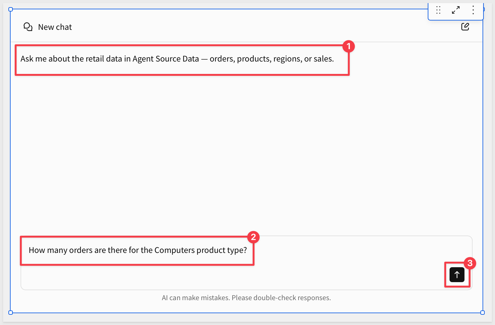

The agent reads `Agent Source Data`, answers using only what's in that table:

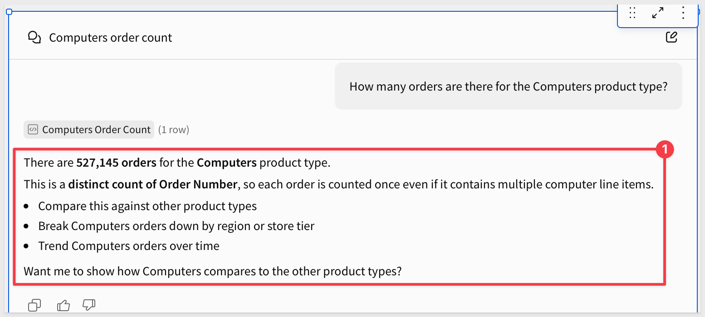

We can check this value by setting a `Summary` calculation on the `Agent Source Data` table on the `Data` page, and filtering it for `Computers`. If you do this, be sure to remove the filter when done.

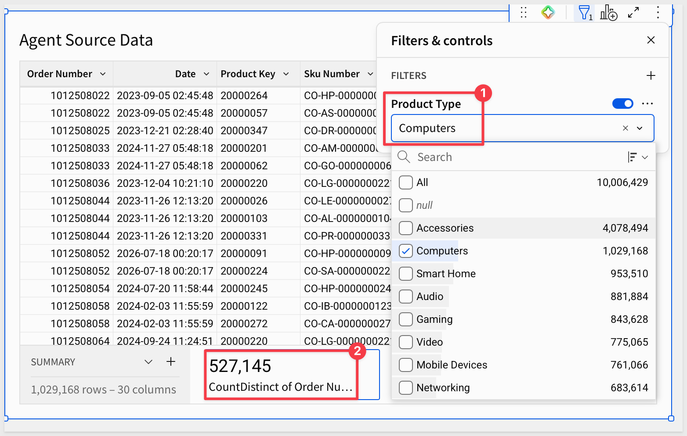

### Test the boundary

Let's try asking for something the data can't actually support:

```copy-code
Did a recent marketing campaign drive the increase in computer sales this quarter?
```

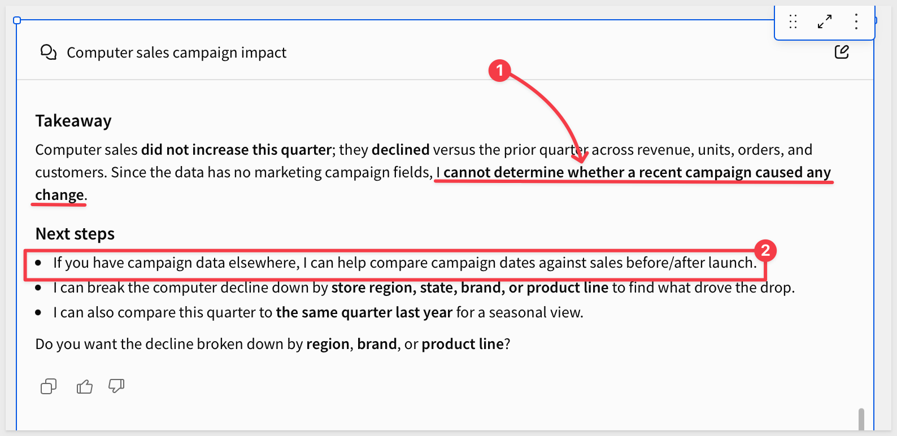

`Agent Source Data` has no marketing or campaign columns — nothing about a campaign exists in `BIG_BUYS_POS` to confirm or deny. 

An agent following the instructions from the previous section says it doesn't have that information instead of guessing. If it answers as though it does, that's a sign the instructions need to be more explicit about the boundary, not a sign the agent is being helpful.

<aside class="positive">
<strong>NOTE:</strong><br> A question like "what's driving this change" is a weaker test than it looks — an agent can describe a real pattern already sitting in the data (say, quantity sold went up) without inventing anything, and that's a legitimate answer, not a guardrail failure. Asking about something that's structurally absent from the table, like a marketing campaign, is what actually tests whether the agent stays inside its instructions instead of speculating.
</aside>

<aside class="positive">
<strong>WHY IT MATTERS:</strong><br> This is the difference an agent needs a governed platform to make good on: it isn't reasoning over undocumented text, it's reasoning over one named table you can see, on the same connection your business already governs.
</aside>

You've now built and tested a Sigma agent end to end — data source, instructions, greeting, and a chat element that puts it in front of a user. Everything later in this series adds a new capability to an agent built exactly this way.


<!-- END OF SECTION-->

## What we've covered
Duration: 5

We built a Sigma agent from nothing — a data source, a set of instructions, a greeting, and a chat element to put it in front of a user — and then tested that it actually stays inside the boundary we gave it instead of guessing past it.

### Core concepts
- **An agent is a configured object, not a chat window** — the chat element you added is just one door to it; the agent itself is a separate, named thing with its own data sources and instructions, reusable behind a schedule, a REST API call, or another agent over MCP, the other doors from the Overview. That's different from Sigma Assistant, which doesn't select a custom agent as a data source the way those doors do.
- **Data sources are the governance boundary** — an agent can only see what's explicitly added to it, nothing else in the connection and nothing else in the workbook
- **Instructions are scope, not a suggestion** — a well-written boundary is the difference between an agent that says "I don't have that information" and one that quietly invents an answer

### Key takeaways

**The data source list is the real security model:**
- Whatever isn't added as a data source doesn't exist from the agent's point of view
- This is the same governance a person already works inside — the agent doesn't get separate rules
- This QuickStart used a plain table to keep the first build simple. For an agent you're putting in front of other people, attach a Sigma data model instead — the same governance boundary, plus curated columns, defined metrics, and any row- or column-level security already built into the model

**A weak boundary looks fine until you test it correctly:**
- An open-ended "why" question can get answered honestly from real data without ever proving the agent respects its instructions
- The real test is asking about something structurally absent from the data — that's what actually separates "grounded" from "guessing"

**The chat element and the agent are independently reusable:**
- One agent can power chat elements on multiple pages within the same workbook, or several at once
- Swapping which agent a chat element points to changes what's behind the same door, without touching the door itself

### Next steps

This is QS #1 in Sigma's Agents series. Everything after it adds one new capability — a warehouse agent as a tool, an MCP server, an external API call, write-back actions, persistent memory, a Python calculation, or a schedule — to an agent built exactly the way this one was.

Explore the rest of the [Agents series](https://quickstarts.sigmacomputing.com/?cat=agents).

For more on agent configuration, see [Build agents](https://help.sigmacomputing.com/docs/build-agents).

**Additional Resource Links**

[Blog](https://www.sigmacomputing.com/blog/)<br>
[Community](https://community.sigmacomputing.com/)<br>
[Help Center](https://help.sigmacomputing.com/hc/en-us)<br>
[QuickStarts](https://quickstarts.sigmacomputing.com/)<br>

Be sure to check out all the latest developments at [Sigma's First Friday Feature page!](https://quickstarts.sigmacomputing.com/firstfridayfeatures/)
<br>

[](https://twitter.com/sigmacomputing)&emsp;
[](https://www.linkedin.com/company/sigmacomputing)&emsp;
[](https://www.facebook.com/sigmacomputing)


<!-- END OF WHAT WE COVERED -->
<!-- END OF QUICKSTART -->
