author: pballai
id: agents_02_actions_writeback
summary: agents_02_actions_writeback
categories: agents
environments: web
status: Published
feedback link: https://github.com/sigmacomputing/sigmaquickstarts/issues
tags: default
lastUpdated: 2026-12-31

# Agent-Driven Actions & Writeback

## Overview
Duration: 5

This QuickStart demonstrates how to give a Sigma agent two ways to act on a workbook instead of just answering questions: setting a control to show a specific view, and writing a new row to a table.

An agent that only answers has done part of the job. Here, we'll add two actions: one that sets a control and navigates the workbook to show something specific, and one that inserts a row into an input table — gated by your approval before anything actually gets written.

Along the way you'll learn how to:
- Configure an action that sets a control value and navigates the workbook
- Configure a writeback action that inserts a row into an input table, gated by approval
- Write instructions that scope when each action runs
- Test both actions from a chat conversation

<aside class="positive">
<strong>WHY IT MATTERS:</strong><br> An agent that can only talk can still be confidently wrong — it just can't act on it. One that can act needs two things also true: approval before anything gets written, and instructions specific enough that the agent knows when acting is actually appropriate — not just when it's technically able to.
</aside>

<aside class="positive">
<strong>IMPORTANT:</strong><br> Some screens in Sigma may appear slightly different from those shown in QuickStarts. This is because Sigma continuously adds and enhances functionality. Rest assured, Sigma's intuitive interface ensures that any differences will not prevent you from successfully completing any QuickStart.
</aside>

For more information on Sigma's product release strategy, see [Sigma product releases](https://help.sigmacomputing.com/docs/sigma-product-releases)

If something doesn't work as expected, here's how to [contact Sigma support](https://help.sigmacomputing.com/docs/sigma-support)

### Target Audience
Sigma workbook authors and admins building agents that need to do something, not just answer questions. For a closer look at the basics of creating an agent, see [Building Your First Sigma Agent](https://quickstarts.sigmacomputing.com/guide/agents_01_building_your_first_agent/index.html) — but this QuickStart includes everything you need to follow along on its own.

### Prerequisites

<ul>
  <li>Any modern browser is acceptable.</li>
  <li>Access to your Sigma environment with permission to create and manage agents, and to create input tables.</li>
  <li>Write access enabled on the connection backing your workbook — the writeback action in this QuickStart inserts a row into a table.</li>
  <li>Some familiarity with Sigma is assumed. Not all steps will be shown, as the basics are assumed to be understood.</li>
 </ul>

<aside class="positive">
<strong>IMPORTANT:</strong><br> Sigma recommends using non-production resources when completing QuickStarts.
</aside>

<button>[Sigma Free Trial](https://www.sigmacomputing.com/free-trial/)</button>

<aside class="negative">
<strong>IMPORTANT:</strong><br> Some features may carry a "Beta" tag. Beta features are subject to quick, iterative changes. As a result, the latest product version may differ from the contents of this document.
</aside>


## Create the Workbook, Control, and Agent
Duration: 15

An action needs something to act on. Before building either action, this section sets up a workbook with a control to point at and an agent to do the pointing.

### Create a new workbook

From Sigma Home, click `Create New` and select `Workbook`. Save and name it:

```copy-code
Actions & Writeback - QuickStart
```

Add `BIG_BUYS_POS` from `Sigma Sample Database` > `RETAIL` > `BIG_BUYS` as a `Table` element. 

Rename the page from `Page 1` to:

```copy-code
Data
```

### Add a Product Type control

From the element bar, add a `Controls` > `List Values` element. Set its label to:
```copy-code
Product Type
```

 Set the `Control ID`:

```copy-code
product_type
```

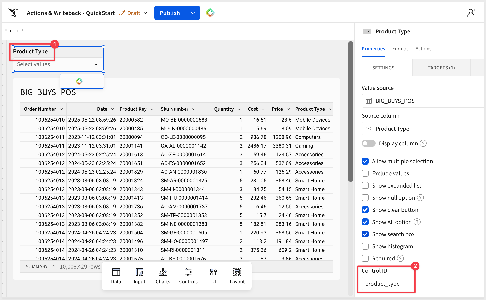

Under `Targets` > `Add filter target`, apply an `Equal to` filter from this control to the `BIG_BUYS_POS` table.

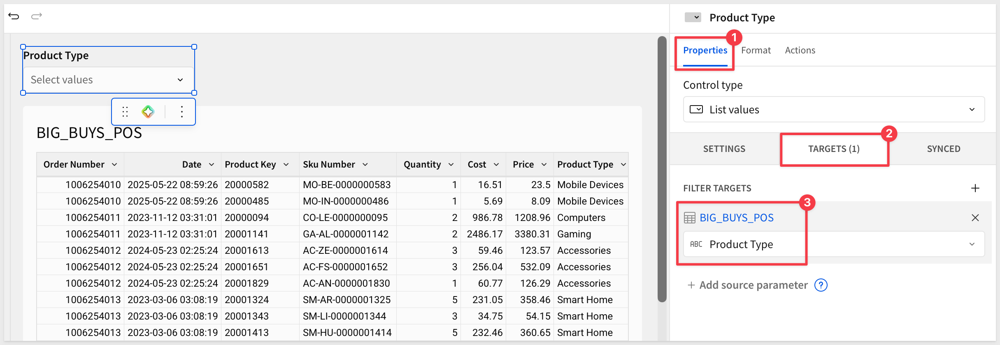

<aside class="positive">
<strong>NOTE:</strong><br> This control is what the display action in the next section will set. An agent doesn't get a special back door to the workbook — it changes the same control a person would click into, which is why the filter you just wired up is the whole mechanism.
</aside>

Click `Publish`.

### Create the agent

With the table or control **not selected,** open the `Agents` tab in the right panel and click `+`:

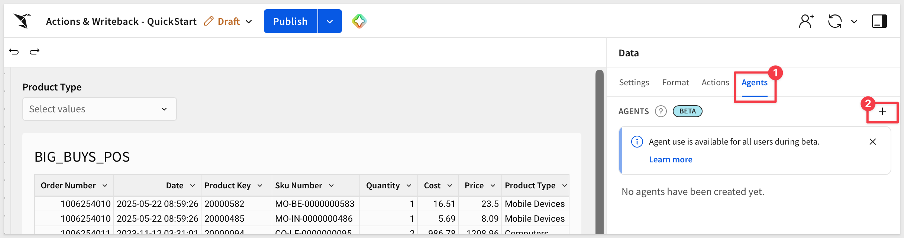

Click the pencil icon and rename the new agent:

```copy-code
My Actions Agent
```

Under `Data sources`, add the `BIG_BUYS_POS` table.

Click the `Instructions` tab and enter:

```copy-code
You are a retail data assistant for BIG_BUYS_POS. Answer questions about products, regions, stores, and sales figures using your own data.
```

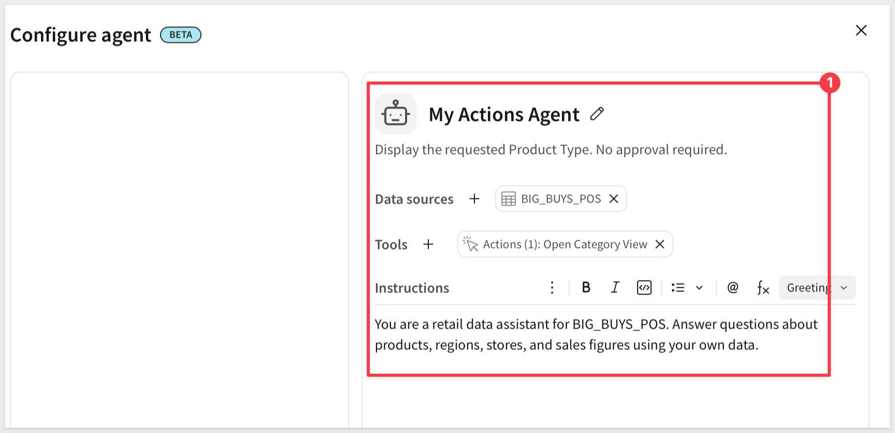

Click `Save` and then `Publish`.

The next two sections add to these instructions as each action gets built.


<!-- END OF SECTION-->

## Add a Display Action
Duration: 15

This action sets the `Product Type` control and navigates to the `Data` page — the agent driving the same control a person would click into, not a separate back door.

### Add the action tool

Click a blank area of the canvas to deselect any element. In the right panel, open the `Agents` tab and use the `3-dot` menu to edit `My Actions Agent`.

Under `Tools`, click `+ Add tool` and select `Action`. Name it:

```copy-code
Open Category View
```

Set the description:

```copy-code
Display the requested Product Type. No approval required.
```

### Configure the steps

Configure the first step: `Step type` > `Run an action`, `Action` > `Set control value`.

Under `Update control`, select `Product Type`.

Set `Set value as` to `Agent input`, and set `Agent input name` to `Product Type`.

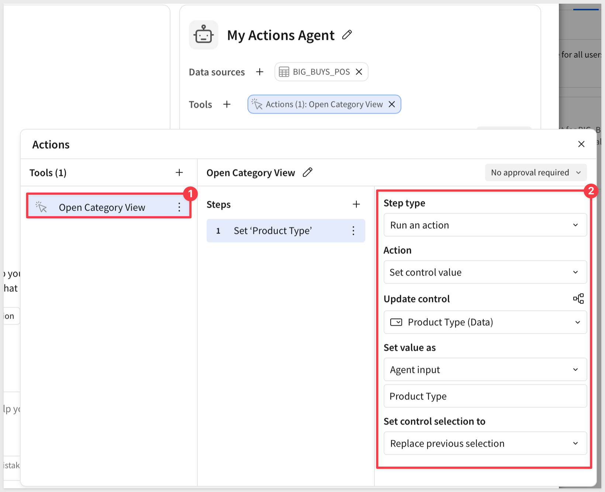

Add a second step: `Run an action` > `Navigate in this workbook` > `Product Type (Data)`.

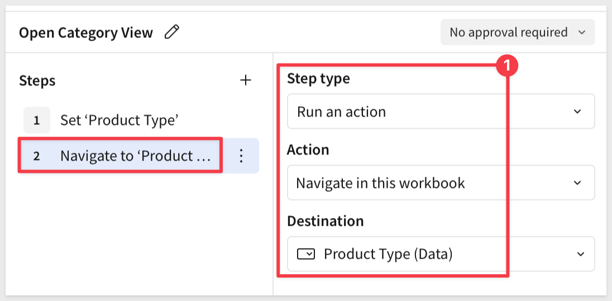

Close the tools modal.

### Update the instructions

Revise the `Instructions` tab, adding:

```copy-code
Use Open Category View when asked to show or look at a specific Product Type. Set the exact Product Type requested — do not substitute a different one.
```

<aside class="positive">
<strong>NOTE:</strong><br> This action needs no approval because nothing gets written — it only changes what's displayed. That distinction is why the next action, which does write data, is configured differently.
</aside>

Click `Save`.


<!-- END OF SECTION-->

## Add a Writeback Action and Test Both
Duration: 20

The display action changes what's on screen. This one changes data — which is why it needs your approval before it commits anything.

### Create the Category Flags input table

On the `Data` page, add `Input` > `Empty`. Select the `Sigma Sample Database` connection.

Rename the initial `Text` column to `Product Type`.

Use its column caret `Add new column` > `Text` to add a second column, `Reason`.

Delete the pre-populated seed rows so the table starts empty.

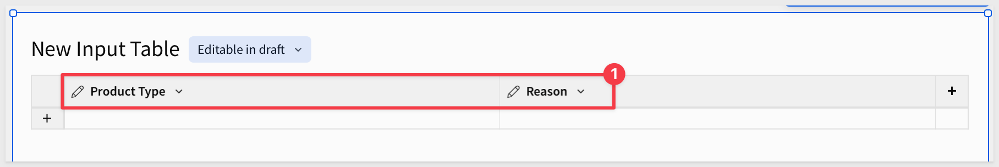

In the table's Properties, use `Add column` > `Row edit history` to add `Created by` and `Created at` automatically — no need for the agent to supply either.

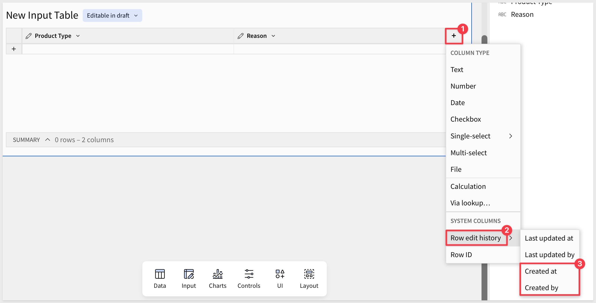

Rename the input table:

```copy-code
Category Flags
```

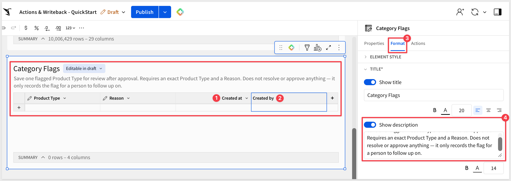

<aside class="positive">
<strong>NOTE:</strong><br> This is a plain log, not the memory pattern covered later in this series — the point here is the writeback mechanic itself: an agent that can insert a row, gated by approval, into a table you defined.
</aside>

### Add the writeback action tool

Back in `My Actions Agent`, under `Tools`, click `+` and select `Action`. Name it:

```copy-code
Flag for Review
```

Set the description:

```copy-code
Save one flagged Product Type for review after approval. Requires an exact Product Type and a Reason. Does not resolve or approve anything — it only records the flag for a person to follow up on.
```

Choose `Requires approval`.

Configure the first step: `Run an action` > `Insert row`. 

Set `Into` to `Category Flags`. Under `Set column values`:
- `Product Type`: `Agent input`, name `product_type`
- `Reason`: `Agent input`, name `reason`

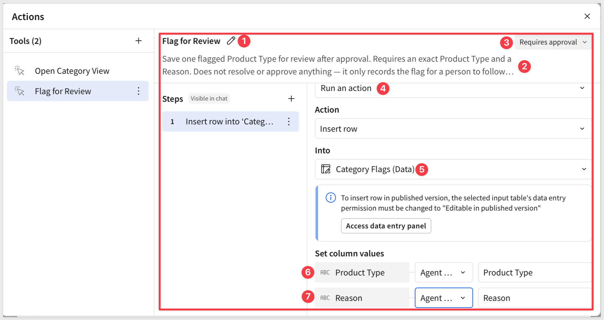

Save the tool.

### Update the instructions

Open the `Instructions` tab and append:

```copy-code
Use Flag for Review only when the user explicitly asks to flag a Product Type, and only with both an exact Product Type and a Reason. If either is missing, ask for it — do not invent a reason. This inserts one row for a person to follow up on; it does not resolve anything or change a price.
```

Click `Save`.

### Add a chat element

Click `+` next to the page tabs to add a new page, then rename it from `Page 1` to:

```copy-code
Chat
```

On the `Chat` page, add a `UI` > `Chat` element and connect it to `My Actions Agent`. 

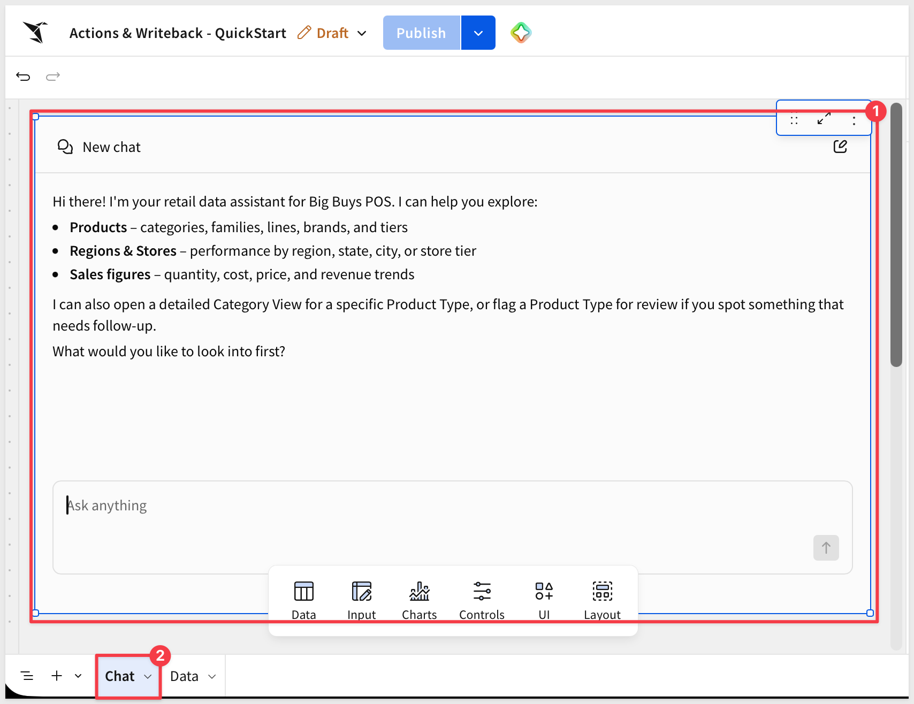

We want to be able to see the table data change when the chat changes the `Product Type` control. Move the `BIG_BUYS_POS` table to the `Chat` page below the chat element.

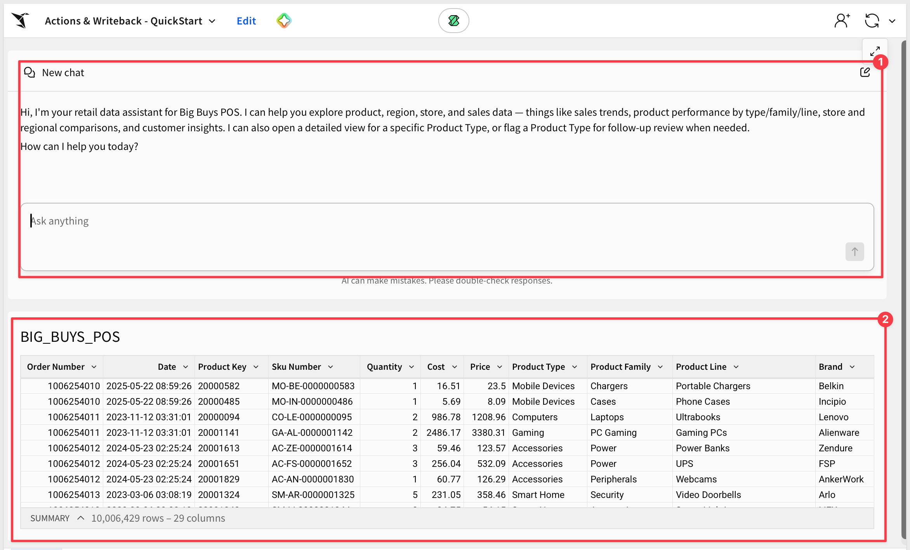

Hide the `Data` page.

Set the `Catagory Flags` input table to `Published version (restricted)`.

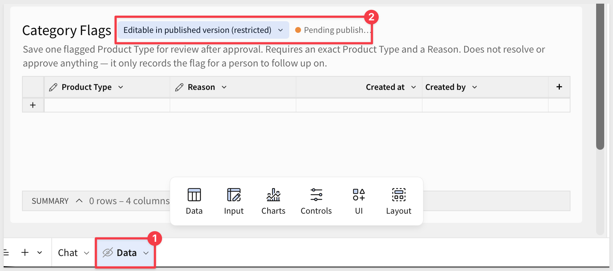

Click `Publish` and open the pubished version of the workbook.

### Test all three

Ask something the display action should handle:

```copy-code
Show me the Computers category
```

The table is filtered for `Computers`.

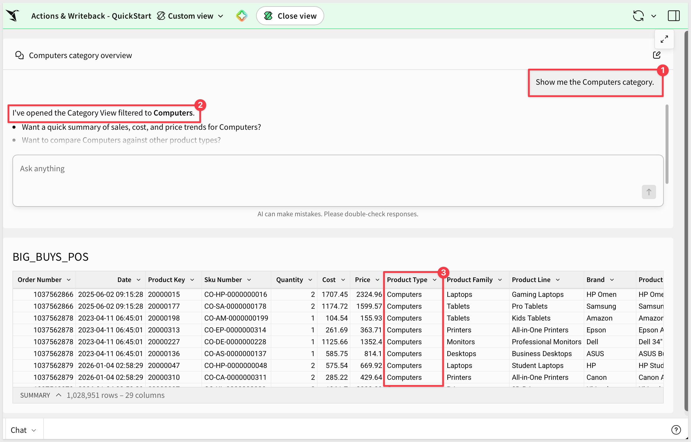

Now ask for a flag, with a reason:

```copy-code
Flag Computers for review because margins look off this month
```

We can expand the chat interface and see that we need to approve adding a new row to the input table.

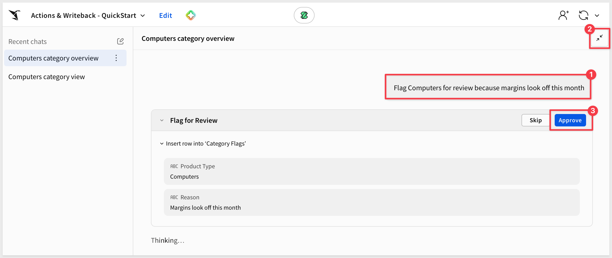

Approve the action.

Place the workbook in `Edit` mode and check `Category Flags` for the new row — `Product Type`, `Reason`, and the `Created by`/`Created at` columns Sigma filled in automatically.

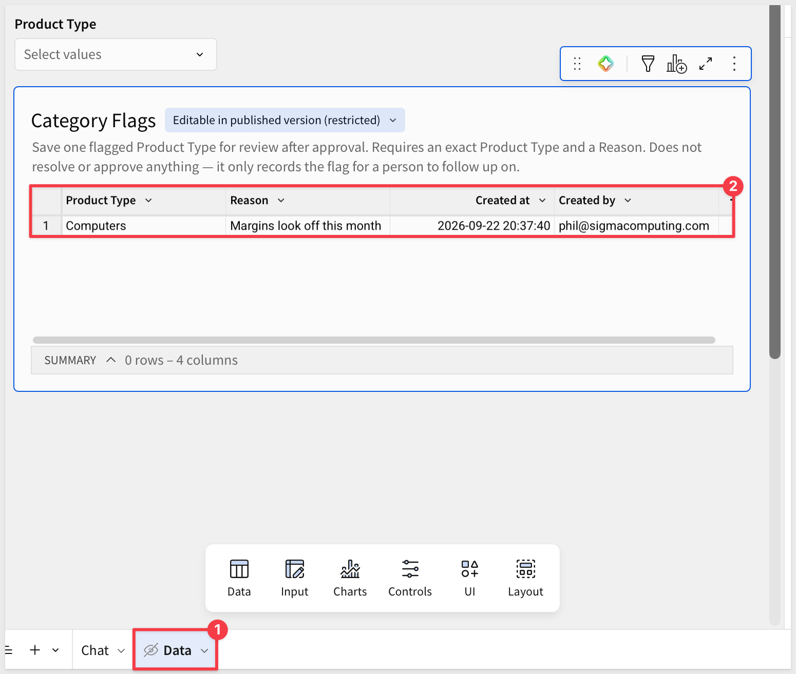

Return to the published version and ask for a flag without a reason.

```copy-code
Flag Mobile Devices for review
```

An agent following the instructions asks what the reason is instead of inventing one. 

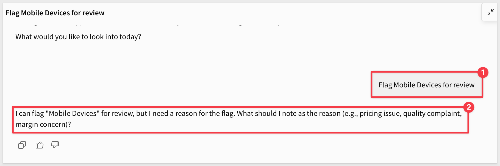

If it flags the category anyway with a made-up reason, the instructions need to be more explicit about requiring both inputs — the same lesson from earlier in this series, applied to a required input instead of a data boundary.

<aside class="positive">
<strong>WHY IT MATTERS:</strong><br> Three tests, three different guarantees: the display action proves the agent can drive the UI, the writeback action proves it can change data only with your approval, and the missing-reason test proves it won't fill a gap in required input with a guess.
</aside>

### This isn't the same as chat history

Sigma also keeps a list of your past conversations with an agent, visible in the chat panel's `Recent chats` list. 

It's a slick feature, but it's a different one — reopening an old chat just shows you what you already said.

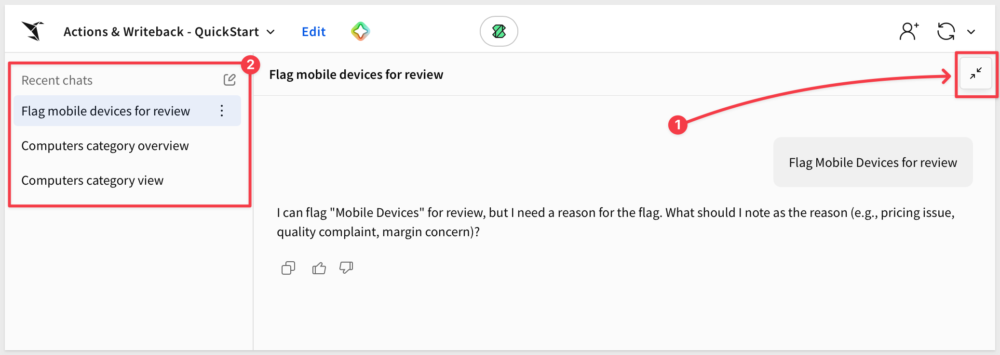

The row you just approved in `Category Flags` is a permanent database record, not something tied to this conversation. It'll still be there next week, in a chat that never happened yet, read by anyone with access to the table — not just recoverable by scrolling back through what you typed.

You've now given an agent two ways to act instead of just answer: one that's always available because nothing gets written, and one that's gated behind your approval because something does.


<!-- END OF SECTION-->

## What we've covered
Duration: 5

We gave an agent two ways to act on a workbook instead of just answer — setting a control to show something specific, and writing a new row to a table, gated by your approval before anything actually commits.

### Core concepts
- **Display and writeback actions are configured differently on purpose** — one needs no approval because nothing gets written; the other requires it because something does
- **An agent's actions run through the same controls and tables a person already uses** — there's no special back door, which is why the filter and the table you built earlier in this series are the entire mechanism
- **Instructions have to cover the when and the what** — when an action should run, and what inputs are required before it runs

### Key takeaways

**Approval is the gate, not the instructions:**
- No approval was needed for the display action because nothing gets written, no matter how it's used
- `Requires approval` on the writeback action means a person confirms before a row lands in the table, regardless of how confident the agent sounds

**A missing required input is not the agent's problem to guess its way through:**
- Asked to flag a category with no reason given, the agent asked for the reason instead of inventing one
- That only happens because the instructions said to ask — an `Insert row` action by itself doesn't know which inputs are actually required

**Three tests proved three separate guarantees, not the same thing three times:**
- The display test proved the agent can drive the UI through a real control, not a shortcut around it
- The writeback test proved data only changes with your approval
- The missing-reason test proved a required input gets asked for, not fabricated

### Next steps

Explore the rest of the [Agents series](https://quickstarts.sigmacomputing.com/?cat=agents).

If you haven't already, [Building Your First Sigma Agent](https://quickstarts.sigmacomputing.com/guide/agents_01_building_your_first_agent/index.html) covers the basics of creating an agent and giving it a data source, from scratch.

**Additional Resource Links**

[Blog](https://www.sigmacomputing.com/blog/)<br>
[Community](https://community.sigmacomputing.com/)<br>
[Help Center](https://help.sigmacomputing.com/hc/en-us)<br>
[QuickStarts](https://quickstarts.sigmacomputing.com/)<br>

Be sure to check out all the latest developments at [Sigma's First Friday Feature page!](https://quickstarts.sigmacomputing.com/firstfridayfeatures/)
<br>

[](https://twitter.com/sigmacomputing)&emsp;
[](https://www.linkedin.com/company/sigmacomputing)&emsp;
[](https://www.facebook.com/sigmacomputing)


<!-- END OF WHAT WE COVERED -->
<!-- END OF QUICKSTART -->
