author: pballai
id: agents_03_agent_memory
summary: agents_03_agent_memory
categories: agents
environments: web
status: Published
feedback link: https://github.com/sigmacomputing/sigmaquickstarts/issues
tags: default
lastUpdated: 2026-09-28

# Agents 03: Giving Agents Memory

## Overview
Duration: 5

This QuickStart demonstrates how to give a Sigma agent a persistent memory — a fact or commitment it saves once and can recall in a completely separate conversation later.

[Agents 02: Agent-Driven Actions & Writeback](https://quickstarts.sigmacomputing.com/guide/agents_02_actions_writeback/index.html) covered the mechanic: an agent inserting a row into a table, gated by your approval. Here, we'll point that same mechanic at a memory table, then prove it actually persists — save a note in one chat, and retrieve it from a brand new one.

Along the way you'll learn how to:
- Create an input table that stores a note tied to a specific scope
- Configure an approval-gated action that saves an explicitly-supplied note
- Write instructions that read prior notes before answering, matched to the exact scope requested
- Test that a note survives into a new chat, and doesn't leak into an unrelated scope

<aside class="positive">
<strong>WHY IT MATTERS:</strong><br> A note that only lives inside one chat is barely different from a sticky note on someone's monitor — gone the moment the conversation ends. Saving it to a table the agent can read back means a fact supplied once stays true the next time anyone asks about that exact scope, not just the person who said it.
</aside>

<aside class="positive">
<strong>IMPORTANT:</strong><br> Some screens in Sigma may appear slightly different from those shown in QuickStarts. This is because Sigma continuously adds and enhances functionality. Rest assured, Sigma's intuitive interface ensures that any differences will not prevent you from successfully completing any QuickStart.
</aside>

For more information on Sigma's product release strategy, see [Sigma product releases](https://help.sigmacomputing.com/docs/sigma-product-releases)

If something doesn't work as expected, here's how to [contact Sigma support](https://help.sigmacomputing.com/docs/sigma-support)

### Target Audience
Sigma workbook authors and admins building agents that need to remember something across conversations, not just within one. For the writeback mechanic this QuickStart builds on, see [Agents 02: Agent-Driven Actions & Writeback](https://quickstarts.sigmacomputing.com/guide/agents_02_actions_writeback/index.html) — but this QuickStart includes everything you need to follow along on its own.

### Prerequisites

<ul>
  <li>Any modern browser is acceptable.</li>
  <li>Access to your Sigma environment with permission to create and manage agents, and to create input tables.</li>
  <li>Write access enabled on the connection backing your workbook — the memory action in this QuickStart inserts a row into a table.</li>
  <li>Some familiarity with Sigma is assumed. Not all steps will be shown, as the basics are assumed to be understood.</li>
 </ul>

<aside class="positive">
<strong>IMPORTANT:</strong><br> Sigma recommends using non-production resources when completing QuickStarts.
</aside>

<aside class="negative">
<strong>IMPORTANT:</strong><br> Sigma agents are a premium feature. During the beta, anyone with workbook access can use agents; after the beta, contact your Sigma Account Executive to maintain access. See <a href="https://help.sigmacomputing.com/docs/sigma-agents">Sigma agents</a> for the latest details.
</aside>

<button>[Sigma Free Trial](https://www.sigmacomputing.com/free-trial/)</button>

<aside class="negative">
<strong>IMPORTANT:</strong><br> Some features may carry a "Beta" tag. Beta features are subject to quick, iterative changes. As a result, the latest product version may differ from the contents of this document.
</aside>


## Create the Workbook, Memory Table, and Agent
Duration: 15

A memory needs somewhere to live that outlasts a single conversation. This section builds that: a workbook, a table to hold saved notes, and an agent that can read both.

### Create a new workbook

From Sigma Home, click `Create New` and select `Workbook`. Save and name it:

```copy-code
Agent Memory - QuickStart
```

Add `BIG_BUYS_POS` from `Sigma Sample Database` > `RETAIL` > `BIG_BUYS` as a `Table` element. Rename the page from `Page 1` to:

```copy-code
Data
```

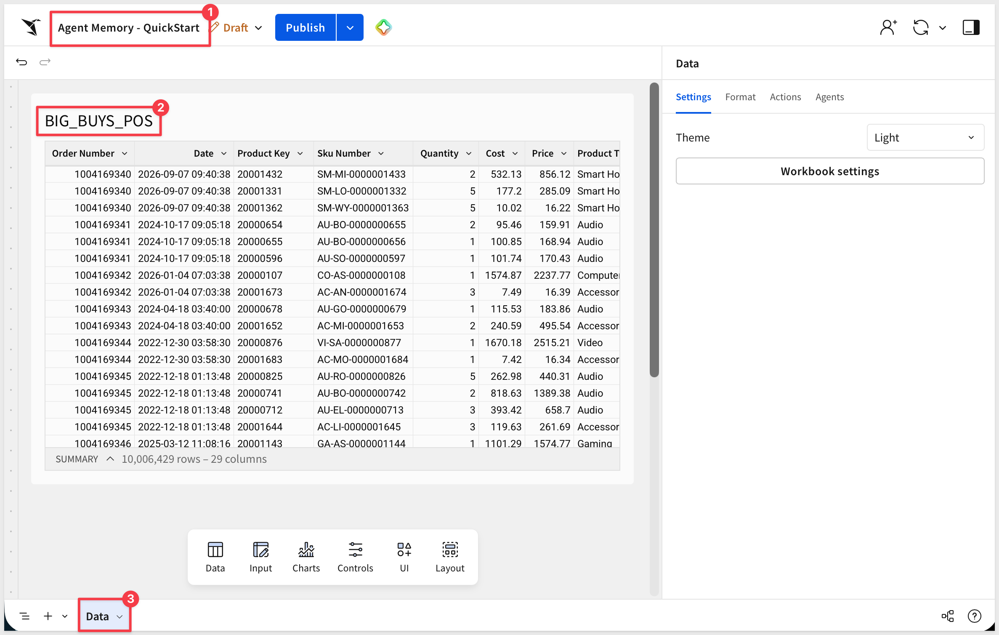

### Create the Agent Memory input table

On the `Data` page, add `Input` > `Empty`. Select the `Sigma Sample Database` connection.

Rename the initial `Text` column to `Product Type`.

Click the `+` to the right of `Product Type` to add a second `Text` column and name it `Note`.

Delete the pre-populated seed row so the table starts empty.

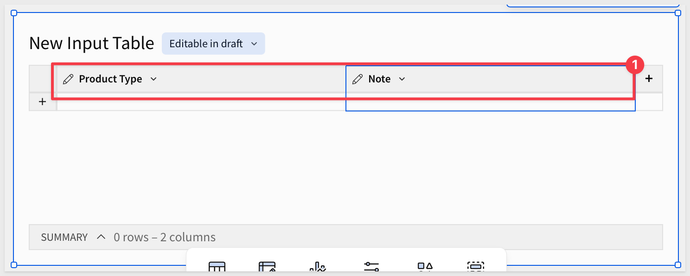

In the table's Properties, use `Add column` > `Row edit history` to add `Created by` and `Created at` automatically — the note's attribution, without the agent having to supply it.

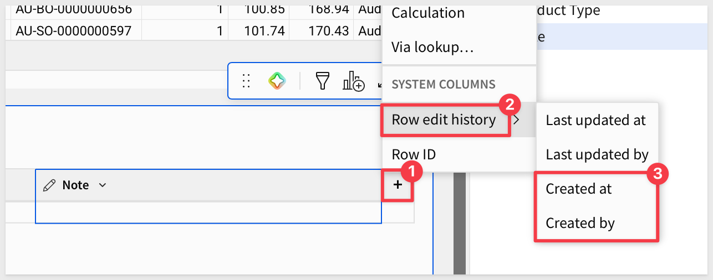

Rename the input table:

```copy-code
Agent Memory
```

Set `Editable in` to `Published version (restricted)`, then click `Publish`.

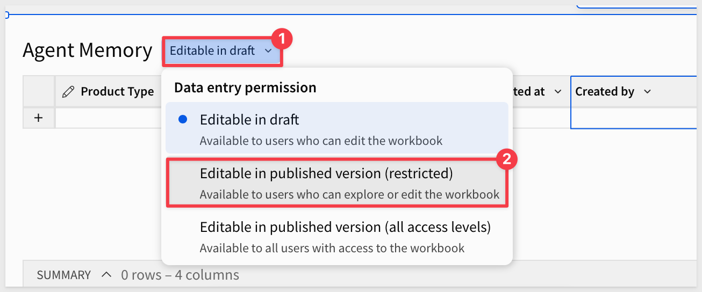

<aside class="positive">
<strong>NOTE:</strong><br> Later we will use `Product Type` as the scope a note is attached to. A note saved for `Computers` should only ever answer questions about `Computers`, which is what the exact-match instructions in the next section enforce.
</aside>

### Create the agent

With nothing selected on the page, open the `Agents` tab on the properties panel and click `+`.

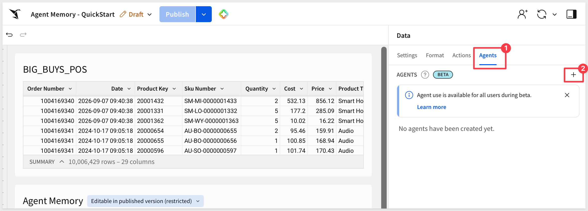

Use the pencil icon to rename the new agent:

```copy-code
My Memory Agent
```

Under `Data sources`, add both `BIG_BUYS_POS` and `Agent Memory`.

Click the `Instructions` tab and enter:

```copy-code
You are a retail data assistant for BIG_BUYS_POS. Answer questions about products, regions, stores, and sales figures using your own data.

You also have access to Agent Memory, a table of notes saved from prior conversations.
```

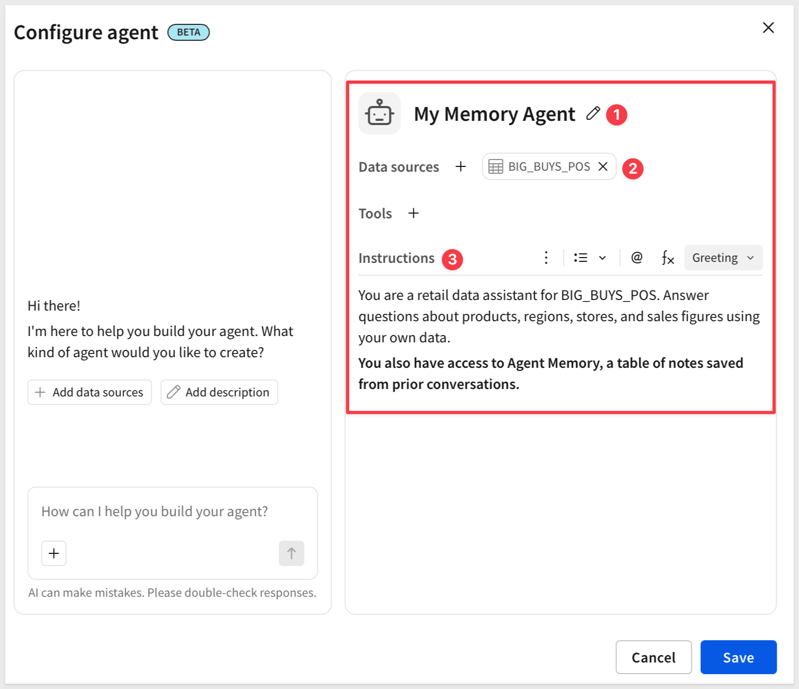

Click `Save`.

The next section adds the action that actually writes to `Agent Memory`, and the instructions that scope when it's used.


<!-- END OF SECTION-->

## Add a Memory Action
Duration: 15

Actions are user-defined interactivity that you can configure within and across workbook elements. By automating responses to specific user interactions, you can create efficient workbook workflows that produce quick and relevant data insights.

This action writes to `Agent Memory`, gated by your approval — the same shape as the writeback action from earlier in this series, pointed at a different table.

### Add the action tool

With nothing selected on the page, open the `Agents` tab and use the `3-dot` menu to edit `My Memory Agent`.

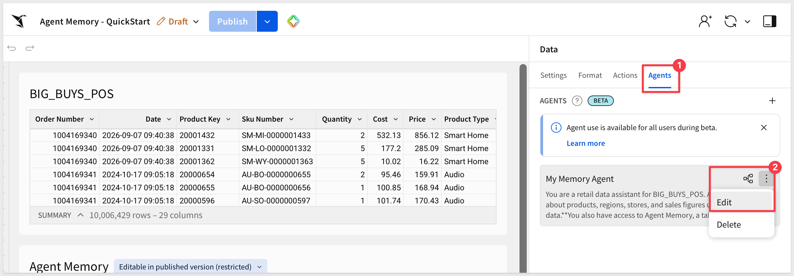

Click the `+` to the right of `Tools` and select `Action`. 

Using the pencil icon, rename it:

```copy-code
Remember a Note
```

Set the description:

```copy-code
Save one note tied to an exact Product Type, after approval. Requires the Product Type and the note text. Only use when the user explicitly asks you to remember or save something.
```

Choose `Requires approval`.

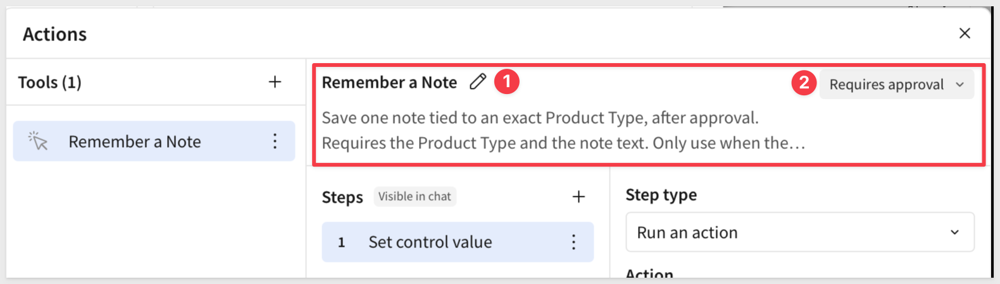

### Configure the step

Configure the first step: `Run an action` > `Insert row`. Set `Into` to `Agent Memory`.

Under `Set column values`:
- `Product Type`: `Agent input`, name `product_type`
- `Note`: `Agent input`, name `note`

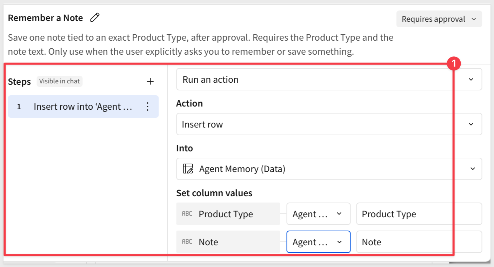

Close the modal.

### Update the instructions

In the agent `Instructions` tab append:

```copy-code
Use Remember a Note only when the user explicitly asks you to remember or save something, and only with both an exact Product Type and the note text. If either is missing, ask for it — do not invent a note or guess the Product Type.

Before answering a question about a specific Product Type, check Agent Memory for a prior note matching that exact Product Type. Only use a note if its Product Type matches exactly — a note saved for one Product Type does not apply to another, even a related one.
```

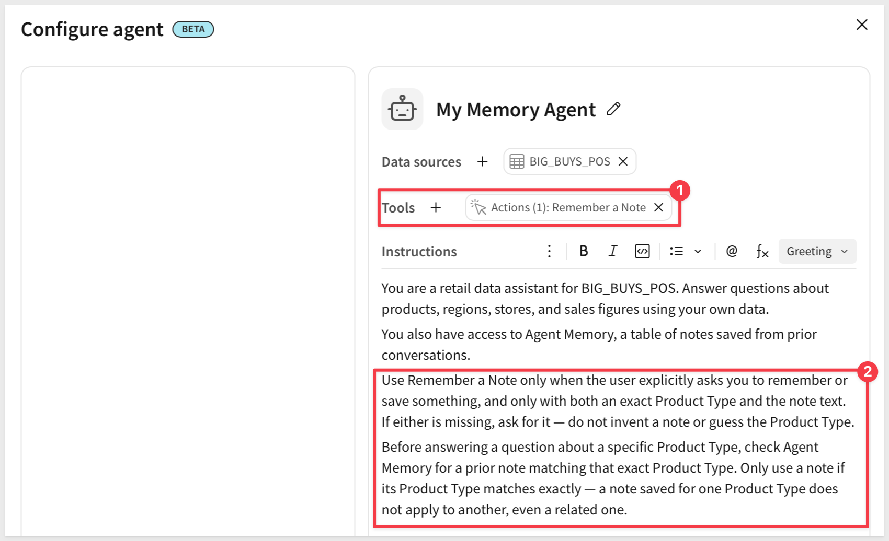

Click `Save`.

<aside class="positive">
<strong>WHY IT MATTERS:</strong><br> The second paragraph is what turns a plain writeback action into memory. Without an instruction to actually read the table back and match it exactly, the agent could just as easily ignore what it already saved, or apply one Product Type's note to a different one.
</aside>


<!-- END OF SECTION-->

## Test Memory Across Chats
Duration: 20

Since there's no live filter to watch here — nothing on `Data` needs to be visible while you chat.

Click `+` next to the page tabs to add a new page, then rename it from `Page 1` to:

```copy-code
Chat
```

`Hide` the `Data` page.

On the `Chat` page, add a `UI` > `Chat` element and connect it to `My Memory Agent`. 

Click `Publish` and open the published version of the workbook.

We can verify notes are saved by switching to `Edit` mode.

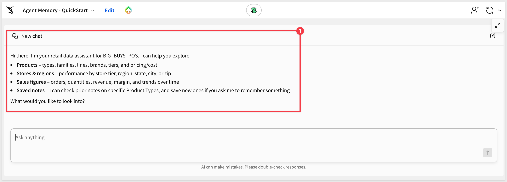

### Save a note

In the chat, ask the agent to remember something about `Computers`:

```copy-code
Remember that the Computers team wants monthly cost re-checks
```

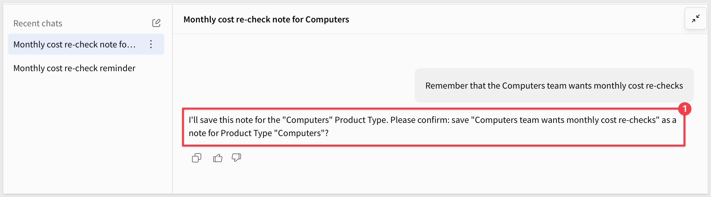

`Approve` the action.

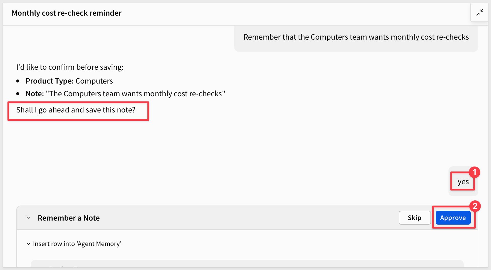

To confirm the row actually landed, switch the workbook to `Edit` mode and check `Agent Memory` for the new row — `Product Type`, `Note`, and the `Created by`/`Created at` columns Sigma filled in.

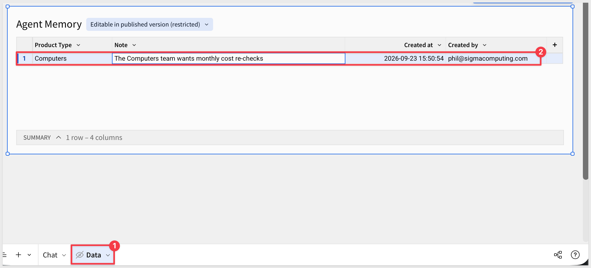

Return to the published view.

### Retrieve it in a new chat

Since we switched between edit and published, we are in a new chat — not a continuation of the one that saved the note. Ask:

```copy-code
What did I ask you to remember about Computers?
```

The agent reads `Agent Memory` and returns the note, even though this conversation never mentioned it. That's the actual point of this QuickStart: the fact survived past the chat that created it.

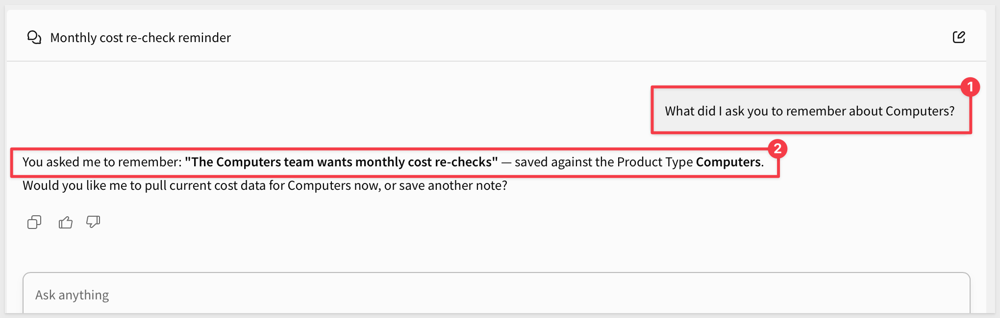

### Check the scope boundary

In that same new chat, ask about a different Product Type:

```copy-code
What did I ask you to remember about Mobile Devices?
```

Nothing was ever saved for `Mobile Devices`, so the agent should say so — not surface the `Computers` note, and not invent one. If it attributes the `Computers` commitment to `Mobile Devices`, the exact-match instruction from the previous section needs to be more explicit.

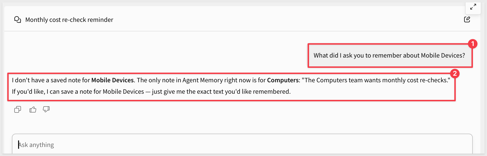

<aside class="positive">
<strong>WHY IT MATTERS:</strong><br> Persistence alone isn't the hard part — a table that just accumulates rows would do that. The actual guarantee is retrieval that respects scope: the right note comes back for the right Product Type, and nothing comes back for one that was never given a note at all.
</aside>

### This isn't the same as chat history

Sigma also keeps a list of your past conversations with an agent, visible in the chat panel's `Recent chats` list. 

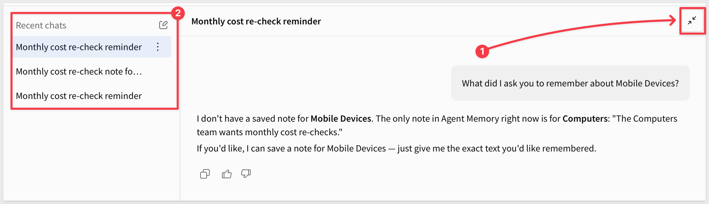

It's a slick feature, but it's a different one — reopening an old chat just shows you what you already said.

What you just tested is the agent recalling the note in a chat that never mentioned it, without anyone finding or reopening anything.

Chat history helps a person retrace a conversation. Agent Memory means the agent doesn't need the conversation retraced for it — the fact is just already there and other users can benefit from it too.

You've now given an agent a memory that outlives any single conversation — saved once, read back correctly, and silent when there's genuinely nothing to recall.


<!-- END OF SECTION-->

## What we've covered
Duration: 5

We gave an agent a memory — a fact saved once, in a table it reads back, recalled correctly in a conversation that never mentioned it, and silent for anything it was never told. An answer that only ever lived in a chat transcript would have died the moment that conversation ended; this one has somewhere to live instead.

### Core concepts
- **Memory is the writeback mechanic pointed at a different purpose** — the same insert-row-with-approval action from earlier in this series, but instructions that turn a plain log into something retrievable by scope
- **Persistence isn't the hard part — scoped retrieval is** — a table that only ever grows would already give you persistence; the actual work is making sure a note only answers for the exact scope it was saved under
- **This is a different guarantee than chat history** — reopening an old conversation shows you what you already said; this is the agent knowing something in a conversation that never said it

### Key takeaways

**Memory doesn't get a governance exception just because an agent wrote it:**
- `Requires approval` means that nothing enters `Agent Memory` without a person confirming it first, the same gate from earlier in this series
- `Created by` and `Created at` mean every note carries a traceable owner and timestamp

**Two instructions, not one, turn a table into memory:**
- Require both the scope and the note text before saving anything, and ask rather than guess when one's missing
- Match the exact scope before ever using a saved note — a note for one Product Type never answers for another, related or not

**Three tests proved three separate things:**
- Approving the save and checking the row in `Edit` mode proved the write itself worked
- Asking in a brand new chat proved the note survives past the conversation that created it
- Asking about an unrelated Product Type in that same new chat proved nothing leaks across scopes

**A recalled fact is a starting point, not a dead end:**
- When asked what was saved about `Computers`, the agent didn't just repeat the note back — it confirmed the exact scope and offered to act on it next
- That's the actual payoff: a fact worth remembering is usually a fact worth doing something with later, and now the agent has both

### Next steps

Explore the rest of the [Agents series](https://quickstarts.sigmacomputing.com/?cat=agents).

For the writeback mechanic this QuickStart builds on, see [Agents 02: Agent-Driven Actions & Writeback](https://quickstarts.sigmacomputing.com/guide/agents_02_actions_writeback/index.html).

**Additional Resource Links**

[Blog](https://www.sigmacomputing.com/blog/)<br>
[Community](https://community.sigmacomputing.com/)<br>
[Help Center](https://help.sigmacomputing.com/hc/en-us)<br>
[QuickStarts](https://quickstarts.sigmacomputing.com/)<br>

Be sure to check out all the latest developments at [Sigma's First Friday Feature page!](https://quickstarts.sigmacomputing.com/firstfridayfeatures/)
<br>

[](https://twitter.com/sigmacomputing)&emsp;
[](https://www.linkedin.com/company/sigmacomputing)&emsp;
[](https://www.facebook.com/sigmacomputing)


<!-- END OF WHAT WE COVERED -->
<!-- END OF QUICKSTART -->
