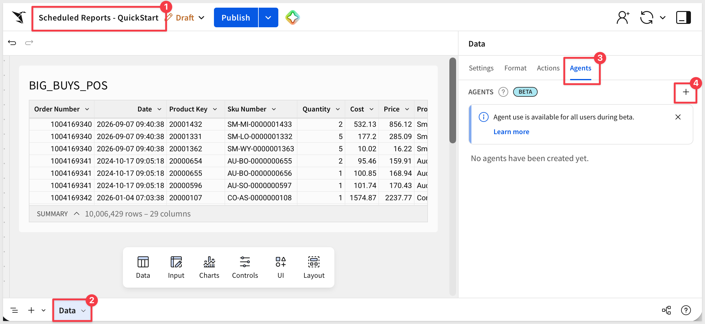
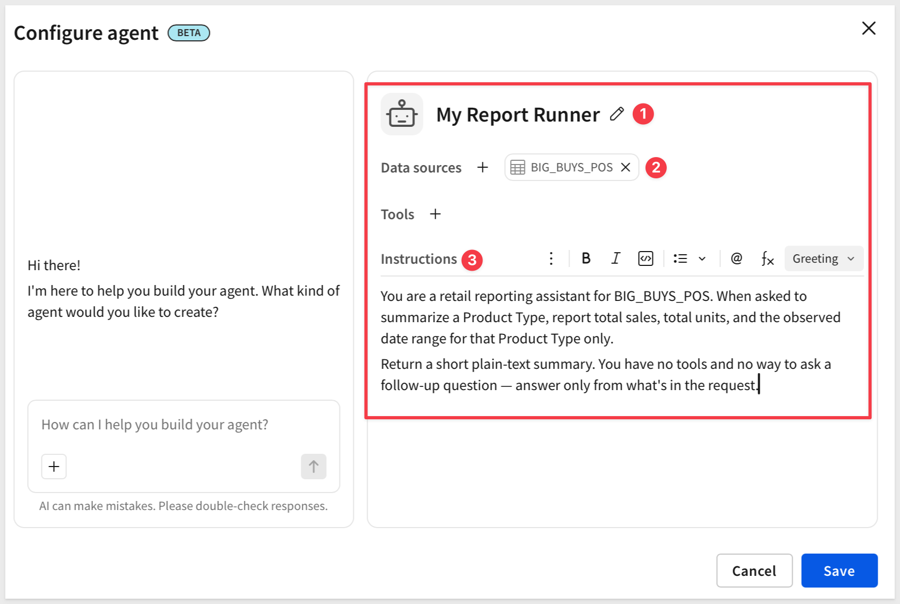
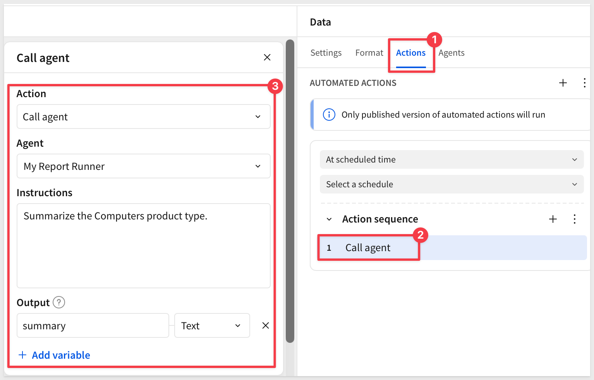
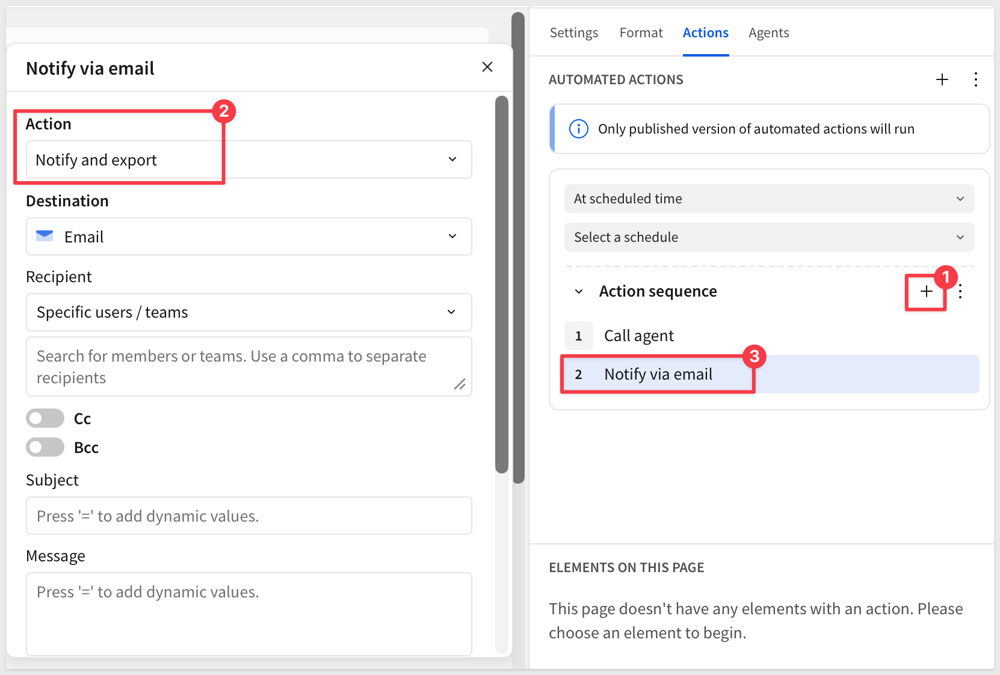
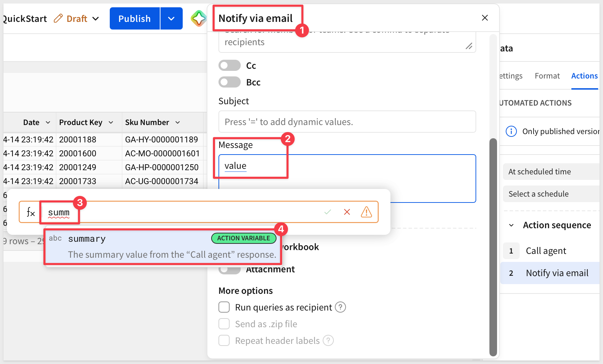
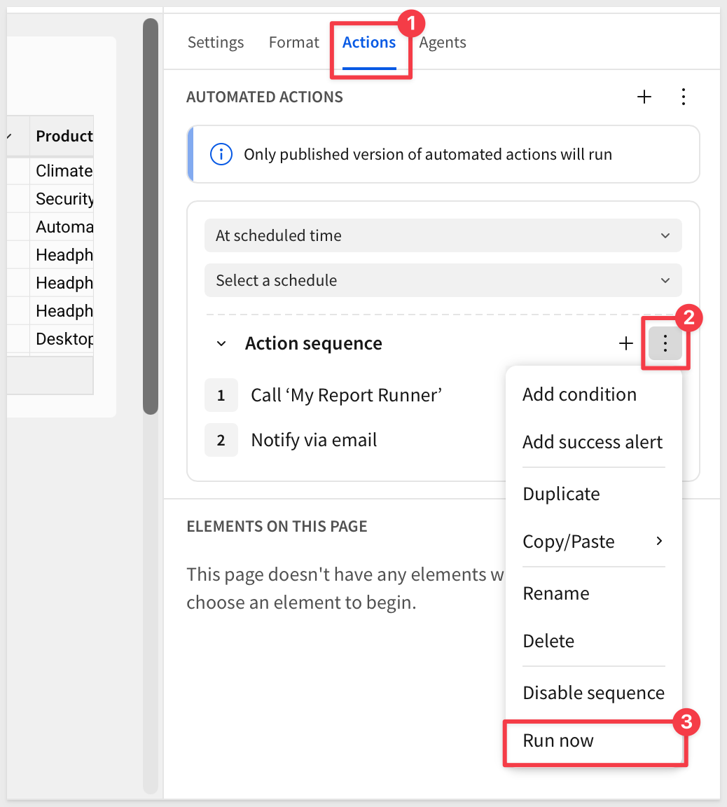
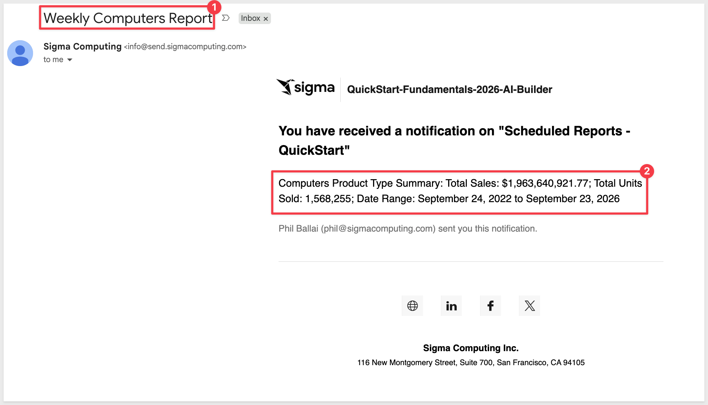

author: pballai
id: agents_04_scheduling_agents
summary: agents_04_scheduling_agents
categories: agents
environments: web
status: Published
feedback link: https://github.com/sigmacomputing/sigmaquickstarts/issues
tags: default
lastUpdated: 2026-09-28

# Agents 04: Scheduling Unattended Agent Runs

## Overview
Duration: 5

This QuickStart demonstrates how to run a Sigma agent on a schedule, with nobody watching, and email what it produces.

Every agent so far in this series has answered inside a conversation, with a person there to approve anything it writes. A scheduled run has no conversation and no one to click approve — so this QuickStart uses a different shape: a separate agent that only produces text, and an action sequence that calls it on a timer and sends the result by email automatically.

Along the way you'll learn how to:
- Build a text-only agent with no UI-dependent tools, suited to running unattended
- Configure a page-level action sequence that calls an agent and captures its response
- Send that response as an email, as part of the same sequence, with no approval step
- Confirm a scheduled trigger actually fired, not just that a manual run worked

<aside class="positive">
<strong>WHY IT MATTERS:</strong><br> A recurring check that depends on someone remembering to run it eventually stops happening — people get busy, change roles, or just forget. A scheduled agent removes that dependency entirely: the report arrives whether or not anyone remembered to ask for it, which is what actually makes a recurring check reliable.
</aside>

<aside class="positive">
<strong>IMPORTANT:</strong><br> Some screens in Sigma may appear slightly different from those shown in QuickStarts. This is because Sigma continuously adds and enhances functionality. Rest assured, Sigma's intuitive interface ensures that any differences will not prevent you from successfully completing any QuickStart.
</aside>

For more information on Sigma's product release strategy, see [Sigma product releases](https://help.sigmacomputing.com/docs/sigma-product-releases)

If something doesn't work as expected, here's how to [contact Sigma support](https://help.sigmacomputing.com/docs/sigma-support)

### Target Audience
Sigma workbook authors and admins building agents that need to run without anyone present, not just when someone opens a chat. For the approval-gated action pattern this QuickStart contrasts with, see [Agents 02: Agent-Driven Actions & Writeback](https://quickstarts.sigmacomputing.com/guide/agents_02_actions_writeback/index.html) — but this QuickStart includes everything you need to follow along on its own.

### Prerequisites

<ul>
  <li>Any modern browser is acceptable.</li>
  <li>Access to your Sigma environment with permission to create and manage agents, and to configure scheduled action sequences.</li>
  <li>Some familiarity with Sigma is assumed. Not all steps will be shown, as the basics are assumed to be understood.</li>
 </ul>

<aside class="positive">
<strong>IMPORTANT:</strong><br> Sigma recommends using non-production resources when completing QuickStarts.
</aside>

<aside class="negative">
<strong>IMPORTANT:</strong><br> Sigma agents are a premium feature. During the beta, anyone with workbook access can use agents; after the beta, contact your Sigma Account Executive to maintain access. See <a href="https://help.sigmacomputing.com/docs/sigma-agents">Sigma agents</a> for the latest details.
</aside>

<button>[Sigma Free Trial](https://www.sigmacomputing.com/free-trial/)</button>

<aside class="negative">
<strong>IMPORTANT:</strong><br> Some features may carry a "Beta" tag. Beta features are subject to quick, iterative changes. As a result, the latest product version may differ from the contents of this document.
</aside>


## Create the Workbook and Runner Agent
Duration: 15

This agent never appears in a chat element. It exists to be called by a schedule, so it gets a home and a data source but no UI elements in the workbook are required to use it.

### Create a new workbook

From Sigma Home, click `Create New` and select `Workbook`. Save and name it:

```copy-code
Scheduled Reports - QuickStart
```

Add `BIG_BUYS_POS` from `Sigma Sample Database` > `RETAIL` > `BIG_BUYS` as a `Table` element. Rename the page from `Page 1` to:

```copy-code
Data
```

### Create the runner agent

In the properties panel, open the `Agents` tab, click `+`.



Using the pencil icon, rename the new agent:

```copy-code
My Report Runner
```

Under `Data sources`, add `BIG_BUYS_POS`.

Click the `Instructions` tab and enter:

```copy-code
You are a retail reporting assistant for BIG_BUYS_POS. When asked to summarize a Product Type, report total sales, total units, and the observed date range for that Product Type only.

Return a short plain-text summary. You have no tools and no way to ask a follow-up question — answer only from what's in the request.
```



Click `Save`.

<aside class="positive">
<strong>NOTE:</strong><br> No Tools tab, no chat element, nothing to approve. This agent isn't scoped down from a fuller one — it never had anything to act on in the first place, because nobody will be present to approve an action when this runs.
</aside>

The next section builds the piece that actually calls this agent: a scheduled action sequence.


<!-- END OF SECTION-->

## Build the Scheduled Action Sequence
Duration: 15

There are two steps in this simple example, no chat: the first calls the runner agent, the second emails what it returns.

### Create the automated action

Click a blank area of the canvas background — not any element — so the panel shows page-level settings. In the element panel, open the `Actions` tab (to the left of `Agents`).

There is an automated action already set to trigger `At scheduled time`, with a `Select a schedule` dropdown and, below it, its own `Action sequence` area where the actual steps get added.

Click `+` to the right of `Action sequence`. A `Notify and export` action is added by default.

Change the `Action` to `Call agent`.

Set `Agent` to `My Report Runner`. 

In `Instructions`, enter:

```copy-code
Summarize the Computers product type.
```

Under `Output`, rename the default `Agent-Response` variable to:

```copy-code
summary
```

The `Action variable` `summary` is expected to return `Text`.



### Export to email

In the `Action sequence` area, click its `+` to add another step (action). Now there are two actions, both defaulted to `Call agent`.

Change the `Action` to `Notify and export`, which will change the actions name for us.



<aside class="positive">
<strong>NOTE:</strong><br> Email is one destination among several here — the same "Notify and export" action also reaches Slack, Microsoft Teams, SharePoint, a webhook, or cloud storage. This QuickStart uses email because it needs no other setup, but the schedule and the agent call underneath it stay identical if you pointed this at Slack instead.
</aside>

Under `Recipient`, leave the mode as `Specific users / teams` and search for yourself in the field below it.

Set the `Subject`:

```copy-code
Weekly Computers Report
```

In `Message`, type `=` to switch to a formula, then insert the `summary` variable from the previous step rather than typing its name as plain text.



<aside class="positive">
<strong>NOTE:</strong><br> The "message" sends the summary as one plain paragraph. "Message" also supports HTML — worth trying if you want the report to read as a short formatted list instead of a wall of text.
<br><br>
Both "Subject" and "Message" accept dynamic values the same way — press <code>=</code> to insert a variable instead of typing it literally. Leave "Cc", "Bcc", "Link to workbook", and "Attachment" off; none of them are needed for this example.
</aside>

<aside class="negative">
<strong>NOTE:</strong><br> This sequence only calls the agent once, but nothing limits it to that. A second "Call agent" step with different instructions could capture another answer into its own variable — say, "summary2" — and "Message" can reference both in the same email.
</aside>

Click `Publish`.


<!-- END OF SECTION-->

## Test the Schedule
Duration: 10

Waiting for a real `Weekly` trigger to fire would work, but nobody wants to sit around for it. This section runs the same sequence immediately instead.

### Run it now

Open the `...` menu on the `Action sequence` and select `Run now`.



Nothing in the workbook will indicate it's running — no spinner, no confirmation. That's expected: this sequence is built to run with no one watching, so it was never given anything to show a person. The email in the next step is the only signal you'll get.

<aside class="positive">
<strong>NOTE:</strong><br> <code>Run now</code> executes the exact same two steps — call the agent, then notify — on demand instead of waiting for the schedule. It proves the sequence itself works. It doesn't prove the scheduled trigger fires on its own; that only happens at the actual scheduled time, which is a standard Sigma mechanism this build doesn't change.
</aside>

### Check the result

Check the inbox for the address you set as `Recipient`. You should have an email with the subject `Weekly Computers Report` and a message containing `My Report Runner`'s summary.



You've now built an agent that runs without anyone opening a chat, and delivers what it finds without anyone approving it first — the two things a scheduled, unattended run actually requires.


<!-- END OF SECTION-->

## What we've covered
Duration: 5

We built an agent that runs on a schedule, with no one watching, and delivered its own result somewhere a person will actually see it — no click, no approval, no one confirming it even ran.

### Core concepts
- **A runner agent needs nothing to run unattended** — no tools, no chat element, no way to ask a follow-up. It answers exactly the one question the sequence sends it, nothing more. Add more action sequences to create more outputs as needed.
- **Automated actions replace approval with configuration** — there's no approval step because there's no one present to approve. The trust boundary moves to who can edit the sequence and its schedule, not who clicks allow on any given run.
- **The `Notify and export` action reaches further than email** — same action, a different destination, minimal setup changes.

### Key takeaways

**Two steps, no approval, by design:**
- `Call agent` captures a result; `Notify and export` delivers it — nothing in between waits on a person
- A scheduled run genuinely has no one to approve anything

**One "Call agent" step is a starting point, not a ceiling:**
- This example calls the runner once, for one Product Type — a second `Call agent` step with different instructions, capturing its own output variable, would work the same way, still with no approval step in between

**Testing with "Run now" proved the logic, not the trigger:**
- Testing without waiting for the real schedule confirmed the sequence itself works end to end
- Testing on a set schedule is easily done based on what we learned

**Silence is the expected behavior, not a missing feature:**
- No spinner, no confirmation inside the workbook when it runs — the email is the only signal
- That's correct for something built to run with no one watching

### Next steps

Explore the rest of the [Agents series](https://quickstarts.sigmacomputing.com/?cat=agents).

For the approval-gated action pattern this QuickStart contrasts with, see [Agents 02: Agent-Driven Actions & Writeback](https://quickstarts.sigmacomputing.com/guide/agents_02_actions_writeback/index.html).

**Additional Resource Links**

[Blog](https://www.sigmacomputing.com/blog/)<br>
[Community](https://community.sigmacomputing.com/)<br>
[Help Center](https://help.sigmacomputing.com/hc/en-us)<br>
[QuickStarts](https://quickstarts.sigmacomputing.com/)<br>

Be sure to check out all the latest developments at [Sigma's First Friday Feature page!](https://quickstarts.sigmacomputing.com/firstfridayfeatures/)
<br>

[](https://twitter.com/sigmacomputing)&emsp;
[](https://www.linkedin.com/company/sigmacomputing)&emsp;
[](https://www.facebook.com/sigmacomputing)


<!-- END OF WHAT WE COVERED -->
<!-- END OF QUICKSTART -->
