author: pballai
id: agents_07_python_from_agent
summary: agents_07_python_from_agent
categories: agents
environments: web
status: Published
feedback link: https://github.com/sigmacomputing/sigmaquickstarts/issues
tags: default
lastUpdated: 2026-09-28

# Agents 07: Running Python from an Agent

## Overview
Duration: 5

Sigma agents can already act on a workbook — setting a control, inserting a row — through the same mechanisms a person uses. Some tasks need more than that: a real calculation or transformation Sigma's native formula language can't express in one step. This QuickStart demonstrates how to give an agent exactly that, by wiring a Python element in as a callable tool.

We'll build a small parsing tool that turns messy, inconsistently formatted text into structured fields — first as a plain workbook feature anyone can click, then as something an agent can call itself, across several notes in one request.

Along the way you'll learn how to:
- Build a Python element that parses free text with multiple fallback patterns, not just one
- Wire that element to a button, so it works as a standalone tool before any agent touches it
- Attach the same element to an agent as a callable action
- Test a capability the button alone can't demonstrate: checking several notes in a single request and reporting on all of them

<aside class="positive">
<strong>WHY IT MATTERS:</strong><br> Free text — exception notes, support tickets, call logs — rarely follows one consistent format, and a single formula usually only catches the format someone happened to test it against. An agent that can run a real parsing step, and check several notes in one request instead of one at a time, turns a manual, error-prone cleanup task into something a person can just ask for.
</aside>

<aside class="positive">
<strong>IMPORTANT:</strong><br> Some screens in Sigma may appear slightly different from those shown in QuickStarts. This is because Sigma continuously adds and enhances functionality. Rest assured, Sigma's intuitive interface ensures that any differences will not prevent you from successfully completing any QuickStart.
</aside>

For more information on Sigma's product release strategy, see [Sigma product releases](https://help.sigmacomputing.com/docs/sigma-product-releases)

If something doesn't work as expected, here's how to [contact Sigma support](https://help.sigmacomputing.com/docs/sigma-support)

### Target Audience

Sigma workbook authors and admins who want an agent to run a calculation or transformation Sigma's native formulas can't express — not just answer questions or act through a control or table.

For the fundamentals of building and configuring a Sigma agent, see [Agents 01: Building Your First Sigma Agent](https://quickstarts.sigmacomputing.com/guide/agents_01_building_your_first_agent/index.html) — but this QuickStart includes everything you need to follow along on its own.

### Prerequisites

<ul>
  <li>Any modern browser is acceptable.</li>
  <li>Access to your Sigma environment with permission to create and manage agents, and to create input tables.</li>
  <li>Admin access to a Snowflake connection with Python enabled, and Snowflake privileges to grant <code>CREATE PROCEDURE</code> on a write-back schema. See <a href="https://help.sigmacomputing.com/docs/set-up-a-snowflake-connection-for-python">Set up a Snowflake connection for Python</a> for the full setup — this QuickStart assumes it's already done.</li>
  <li>Some familiarity with Sigma is assumed. Not all steps will be shown, as the basics are assumed to be understood.</li>
 </ul>

<aside class="positive">
<strong>NOTE:</strong><br> Python has to be turned on for the specific connection this workbook uses — it isn't available on every connection, and it isn't available at all on <code>Sigma Sample Database</code>, the shared connection used elsewhere in this series. The toggle lives under <code>Administration</code> > <code>Connections</code> > edit the connection > <code>Python</code>:
</aside>

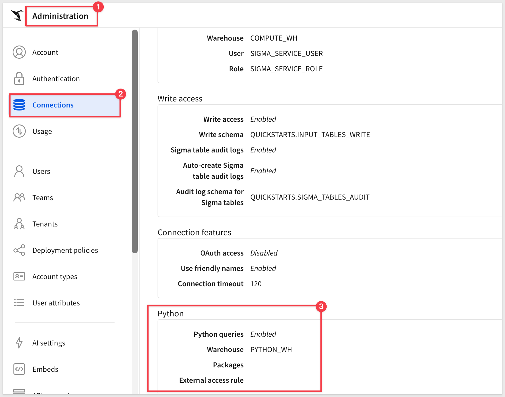

See <a href="https://help.sigmacomputing.com/docs/write-and-run-python-code">Write and run Python code in Sigma</a> for the general Python-element reference used throughout this QuickStart.

<aside class="negative">
<strong>IMPORTANT:</strong><br> Some features may carry a "Beta" tag. Beta features are subject to quick, iterative changes. As a result, the latest product version may differ from the contents of this document.
</aside>

<aside class="negative">
<strong>IMPORTANT:</strong><br> Sigma agents are a premium feature. During the beta, anyone with workbook access can use agents; after the beta, contact your Sigma Account Executive to maintain access. See <a href="https://help.sigmacomputing.com/docs/sigma-agents">Sigma agents</a> for the latest details.
</aside>

<aside class="positive">
<strong>IMPORTANT:</strong><br> Sigma recommends using non-production resources when completing QuickStarts.
</aside>

<button>[Sigma Free Trial](https://www.sigmacomputing.com/free-trial/)</button>


<!-- END OF SECTION-->

## Build the Parsing Tool
Duration: 20

Before an agent can reach for this, the tool has to exist and work on its own — a person clicking a button, nothing agent-specific about it yet. This section builds that: a table of messy notes, a control to pick one, a Python element that does the actual parsing, and a button that runs it.

### Create a new workbook

From Sigma Home, click `Create New` and select `Workbook`. Save and name it:

```copy-code
Python Parsing Tool - QuickStart
```

Rename the page from `Page 1` to:

```copy-code
Parser
```

### Add the order exception notes

Add `Input` > `Empty`. Select the Python-enabled Snowflake connection from Prerequisites — not `Sigma Sample Database`.

Rename the initial `Text` column:

```copy-code
Note Text
```

Delete the pre-populated seed rows so the table starts empty.

Select a cell in the `Note Text` column and paste:

```copy-code
Order# 12345 - customer says item arrived damaged, refunded $45.00 on 2026-09-10.
PO-98212: item missing from shipment, refund of $22.50 issued 9/12/2026.
order 55210 - escalated to supervisor on 2026-09-11, customer very upset, no refund processed yet. Will follow up next week.
Order# 33110 - item arrived damaged, refunded $60.00. Customer notified same day, exact date not logged in this note.
Order# 61239 - customer received the wrong color, doesn't want a refund, just wants an exchange next time. Noted 2026-09-15.
Called about an issue, seemed annoyed, said something about a delay. No order number given.
```

Use the column caret's `+` menu to add one more column. Under `SYSTEM COLUMNS`, select `Row ID` — Sigma fills a unique ID into every row automatically, so there's nothing to type or paste for this column. 

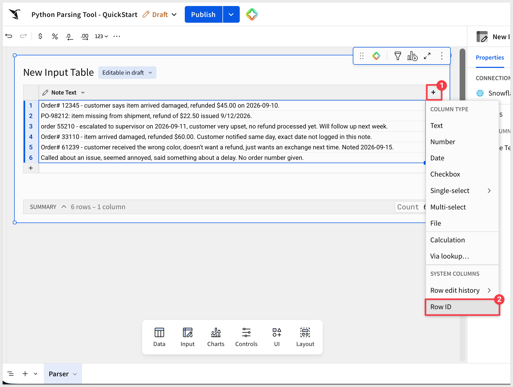

Rename the table:

```copy-code
Order Exception Notes
```

<aside class="positive">
<strong>NOTE:</strong><br> These six notes are deliberately messy, not random. Two use different order-reference formats, two are each missing one field the parser won't be able to find, one describes an issue that doesn't map cleanly to a known category, and one is close to unusable. That variety is what makes the difference between a formula and a script obvious later.
</aside>

### Add the note picker control

From the element bar, add `Controls` > `List Values`. Set its label to:

```copy-code
Note
```

Under `Value source`, select `Order Exception Notes`.

Set `Source column` to `ID` — that's the actual value the control will hold.

Turn on `Display column` and set it to `Note Text`, so the dropdown shows the readable note instead of a raw ID.

<aside class="positive">
<strong>NOTE:</strong><br> Set <code>Control ID</code> last, after configuring <code>Source column</code>. Sigma resets <code>Control ID</code> to match whatever column you just picked, so setting it before this step just gets overwritten.
</aside>

Set the `Control ID`:

```copy-code
note_id
```

Turn off `Allow multiple selection` — exactly one note has to be selected at a time for the Python element to parse.

Leave `Targets` empty — this control feeds the Python element directly, not a table filter.

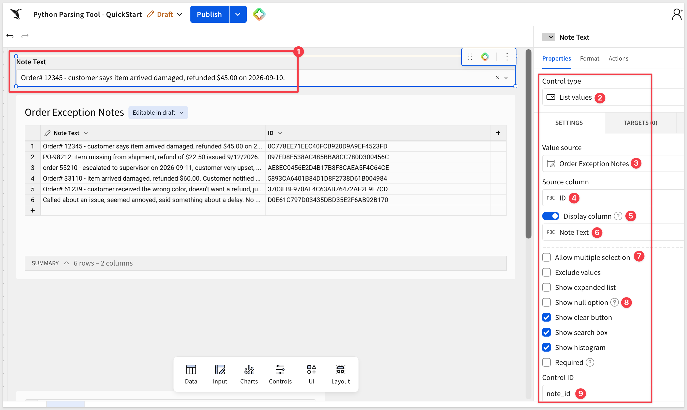

### Add the Python element

Add `Data` > `Python`. 

There's no separate panel for wiring up sources — a Python element pulls in a workbook element by calling `sigma.get_element()` directly in the code, and a control value the same way you already used it in the earlier smoke test, with `sigma.get_control_value()`.

<aside class="positive">
<strong>NOTE:</strong><br> <code>sigma.get_element()</code> returns a Snowpark DataFrame, not a pandas one — methods like <code>.loc</code> aren't available on it directly. Convert it with <code>.to_pandas()</code> right after retrieving it, before doing anything pandas-flavored to it.
</aside>

Paste the code (overwriting the sample code):

```copy-code
import re
import pandas as pd

notes = sigma.get_element("Order Exception Notes").to_pandas()
selected_id = sigma.get_control_value("note_id")
note = notes.loc[notes["ID"] == selected_id, "Note Text"].iloc[0]

def extract_order_id(text):
    for pattern in [r"Order#\s*(\d+)", r"PO-(\d+)", r"[Oo]rder\s+(\d+)"]:
        match = re.search(pattern, text)
        if match:
            return match.group(1)
    return None

def extract_issue_type(text):
    text_lower = text.lower()
    for keyword in ["damaged", "missing", "escalated"]:
        if keyword in text_lower:
            return keyword
    return None

def extract_refund_amount(text):
    match = re.search(r"\$([0-9]+(?:\.[0-9]{2})?)", text)
    return float(match.group(1)) if match else None

def extract_resolved_date(text):
    for pattern in [r"(\d{4}-\d{2}-\d{2})", r"(\d{1,2}/\d{1,2}/\d{2,4})"]:
        match = re.search(pattern, text)
        if match:
            return match.group(1)
    return None

order_id = extract_order_id(note)
issue_type = extract_issue_type(note)
refund_amount = extract_refund_amount(note)
resolved_date = extract_resolved_date(note)

missing = [name for name, value in [
    ("order_id", order_id), ("issue_type", issue_type),
    ("refund_amount", refund_amount), ("resolved_date", resolved_date),
] if value is None]
flags = "OK" if not missing else "missing " + ", ".join(missing)

result = pd.DataFrame([{
    "note_id": selected_id,
    "order_id": order_id,
    "issue_type": issue_type,
    "refund_amount": refund_amount,
    "resolved_date": resolved_date,
    "flags": flags,
    "raw_note": note,
}])

sigma.output("parsed_note", result)
```

<aside class="positive">
<strong>NOTE:</strong><br> Every field is extracted independently, with more than one pattern tried per field. That's the actual reason this is a script and not a formula — a single <code>REGEXP_EXTRACT</code> commits to one pattern; this tries several and falls back cleanly when a note doesn't match the first one.
</aside>

Before running this, select `Order# 12345` in the `Note Text` control  — the code above filters by whatever `note_id` currently holds, and there's nothing to match against if the control is still blank.

Click `Run` once. 

<aside class="positive">
<strong>NOTE:</strong><br> If this errors on a note that clearly exists in the table, just click <code>Run</code> again before assuming something's wrong — there can be a brief lag between changing the control and the element picking up the new value.
</aside>

Under `Output`, select `parsed_note`, choose `Table`.

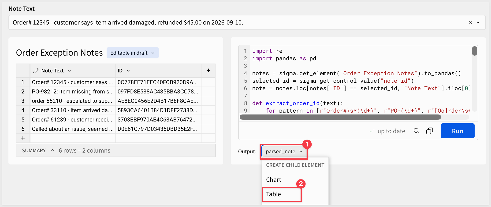

The new table shows the selected row parsed into columns. 

Rename the child table:

```copy-code
Parsed Note
```

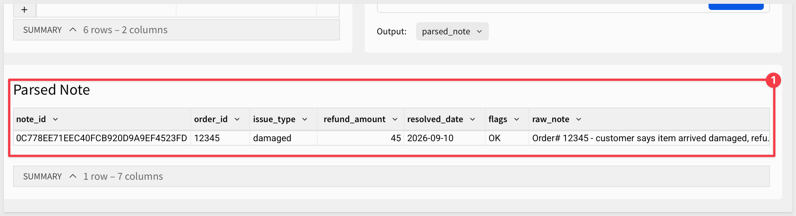

### Add a log for every parse

`Parsed Note` only ever holds the single most recent result — a Python element can't read its own prior output back in, Sigma blocks that as a circular dependency. To keep a running history instead, add a second, plain input table.

Add `Input` > `Empty` on the same Python-enabled connection. 

Add columns to match `Parsed Note`'s fields:

```copy-code
Column name:        Type
note_id             Text
order_id            Text
issue_type          Text
refund_amount       Number
resolved_date       Text
flags               Text
raw_note            Text
```

Be sure to set `refund_amount` to `Number` — the `Insert row` action rejects a numeric formula value going into a `Text` column, so this one has to match `Parsed Note`'s type. Every other column can stay `Text`.

Delete the pre-populated seed rows so it starts empty. Rename the table:

```copy-code
Parsed Notes Log
```

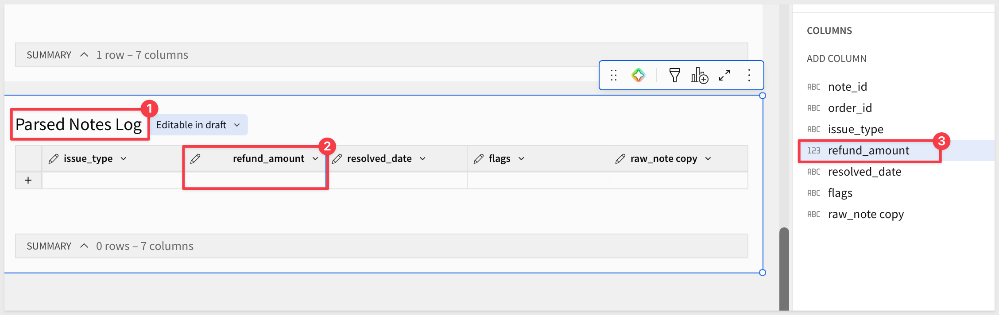

### Add the run button

Add `UI` > `Button`. Change its text to:

```copy-code
Parse Selected Note
```

Select the button and click `+` next to `Action sequence`. 

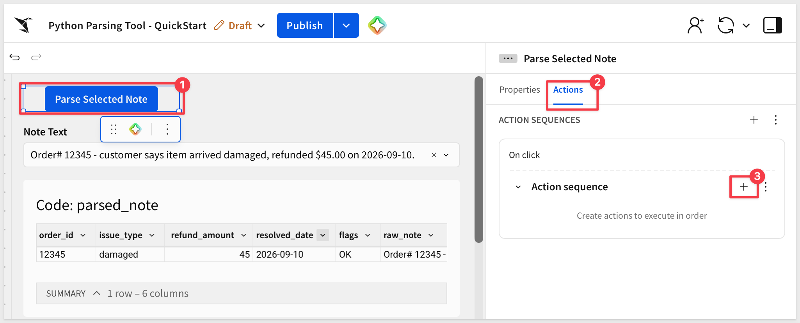

Configure the first step:

**Action type:** `Run Python element`<br>
**Element:** `Code (Parser)`

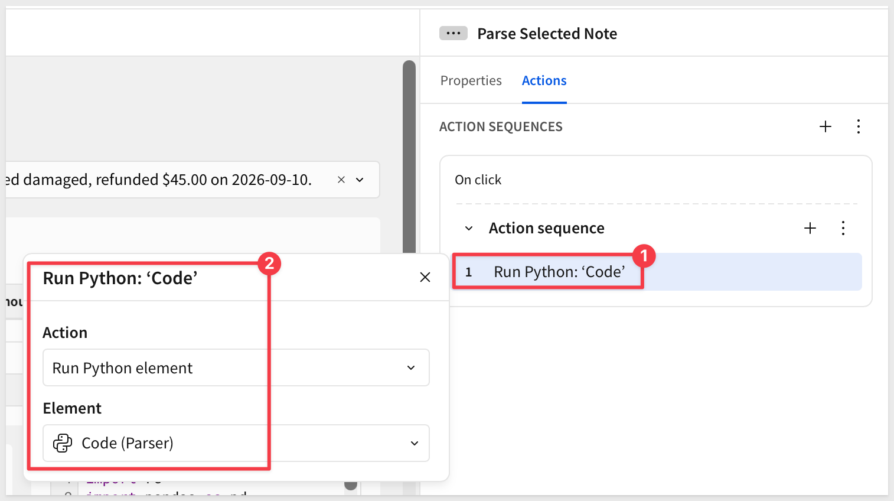

Add a second step:

**Action type:** `Insert row` (under Input Tables and Forms) <br>
**Into:** `Parsed Notes Log`<br>

**Set column values:** for each column, use `Formula` and reference `Parsed Note`'s matching column:
```copy-code
[Parsed Note/note_id]
[Parsed Note/order_id]
[Parsed Note/issue_type]
[Parsed Note/refund_amount]
[Parsed Note/resolved_date]
[Parsed Note/flags]
[Parsed Note/raw_note]
```

<!-- 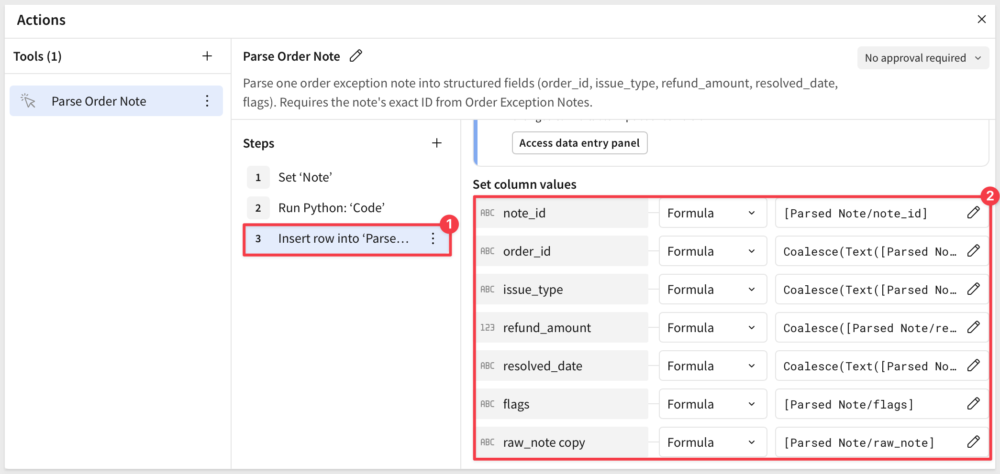 -->

Click `Publish`.

### Test it manually

Select the note beginning `Order# 12345` and click `Parse Selected Note`.

Check `Parsed Note` — since we had previously tested this, the table still shows `Order 12345`.

Check `Parsed Notes Log` too — it should now have that same row logged.

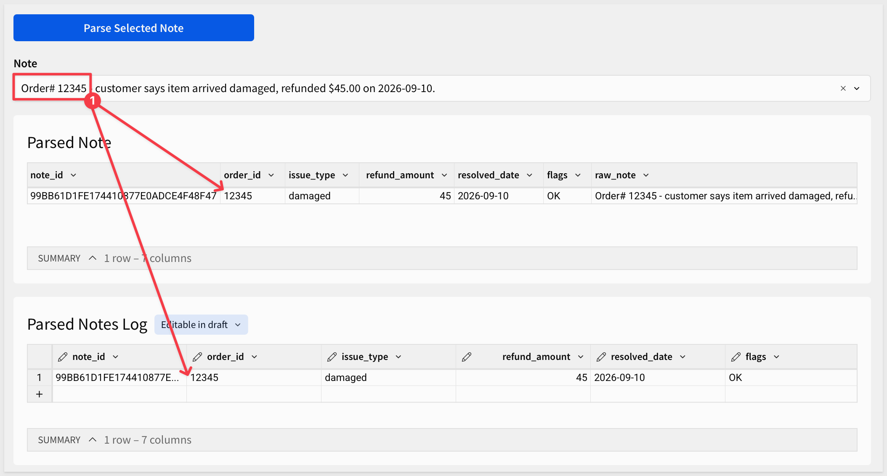

This time change the list control to select `Order 55210` and click the `Parse Selected Note` button again.

`Parsed Note` shows just this new result — that table always holds only the latest run. 

`Parsed Notes Log` is the one that keeps growing: it should now have two rows, this one added to the last. 

`refund_amount` comes back empty on this one and `flags` says so — the note never mentioned a dollar figure, so there's nothing to guess at.

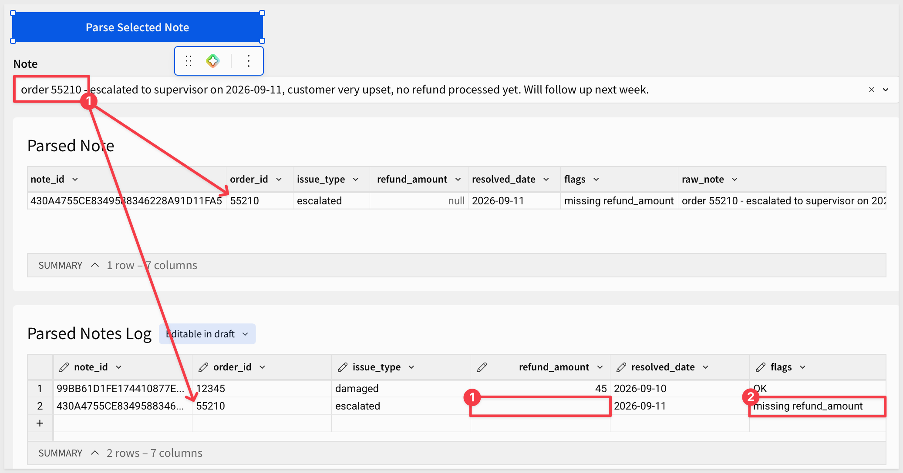

The tool works, end to end, without anything agent-specific about it — a control, a Python element, and a button a person clicks.

The next section gives an agent this exact same tool, with one difference: it can't click a dropdown, so its version of this action needs one more step than the button's did.


<!-- END OF SECTION-->

## Give the Agent the Same Tool
Duration: 15

The button proved the parsing tool works. This section attaches the exact same tool to an agent — same Python element, same underlying action, with one difference: a person picks a note from a dropdown, but an agent can't click one, so its version of this action needs to look up the note's ID itself before it can run anything.

### Add a chat page and an agent

Click `+` next to the page tabs to add a new page, then rename it from `Page 1` to:

```copy-code
Chat
```

Add a `UI` > `Chat` element and select `+ Create new agent`.

Using the pencil icon, rename the new agent:

```copy-code
My Parsing Agent
```

Under `Data sources`, add `Parser` > `Order Exception Notes` — the agent needs to see the notes and their IDs to pick the right one, not just trigger the parser blindly.

Also add `Parser` > `Parsed Note`. Running the action changes what that table holds, but running it doesn't hand the agent the result directly — without this as a data source, the agent has no way to actually read what the parser just produced.

Click the `Instructions` tab and enter:

```copy-code
You are an assistant for order exception notes. You can answer questions about the notes in Order Exception Notes directly from your data.
```

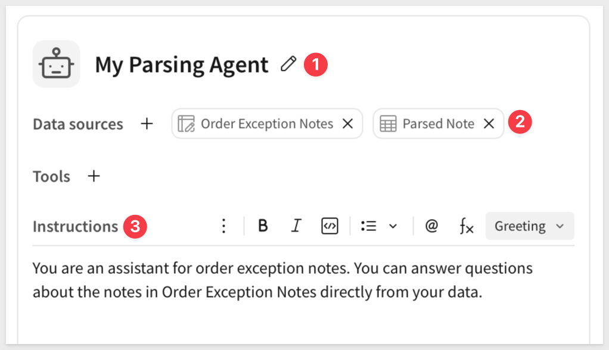

<aside class="positive">
<strong>NOTE:</strong><br> Keeping the <code>Parser</code> page visible, not hidden, is deliberate — the point of this section is comparing two callers of the same tool, so both the button and the chat need to stay reachable.
</aside>

Under `Tools`, click `+` and select `Action`. Name it:

```copy-code
Parse Order Note
```

Set the description:

```copy-code
Parse one order exception note into structured fields (order_id, issue_type, refund_amount, resolved_date, flags). Requires the note's exact ID from Order Exception Notes.
```

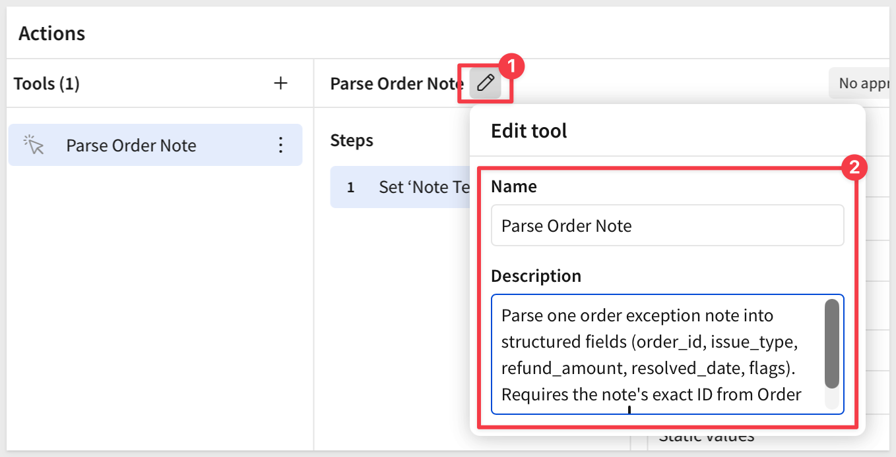

Leave `Requires approval` off — this action doesn't write a business record, it recomputes a scratch result that gets overwritten on the next run, the same thing the button already does.

Configure the first step: `Run an action` > `Set control value`.

Under `Update control`, select `Note (Parser)`.

Set `Set value as` to `Agent input`, and set `Agent input name` to:

```copy-code
note_id
```

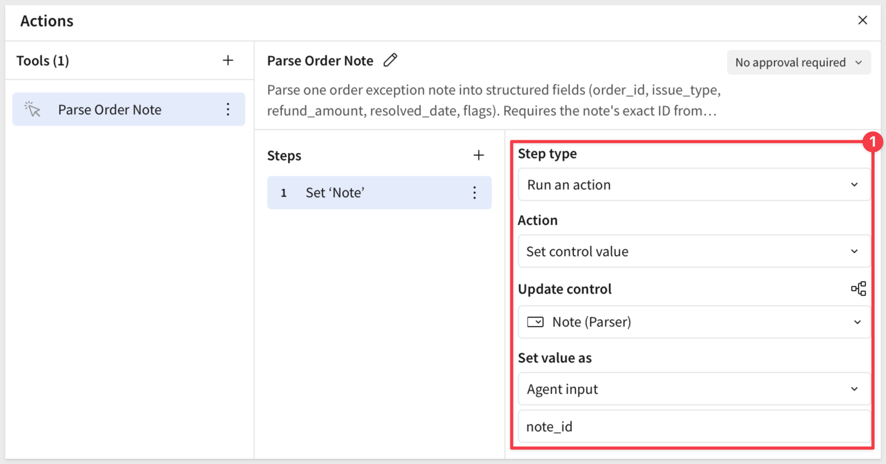

Add a second step: `Run an action` > `Run Python element` > `Code (Parser)`.

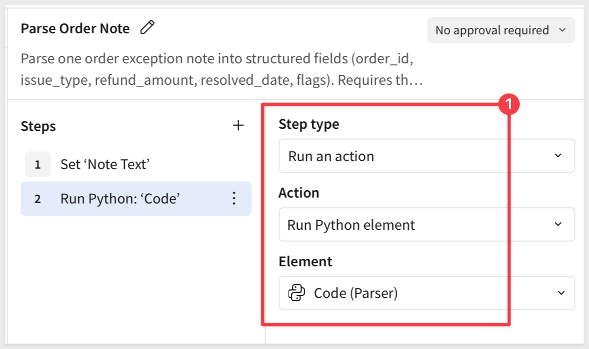

Add a third step: 
`Run an action` > `Insert row` > `Into: Parsed Notes Log`. 

Map each column the same way the button's version does — `Formula`, referencing `Parsed Note`'s matching column — with one addition: wrap any column that can come back null (`issue_type`, `refund_amount`, `resolved_date`) in `Coalesce`, so a missing value inserts as blank instead of failing the row.

The text columns also need a `Text()` wrapper around the reference itself — `Parsed Note`'s `order_id`/`issue_type`/`resolved_date` mix strings and blanks, so `Coalesce` needs them read explicitly as text before it can compare them against a plain `""`:

```copy-code
Value:              Formula:
note_id:            [Parsed Note/note_id]
order_id:           Coalesce(Text([Parsed Note/order_id]), "")
issue_type:         Coalesce(Text([Parsed Note/issue_type]), "")
refund_amount:      Coalesce([Parsed Note/refund_amount], 0)
resolved_date:      Coalesce(Text([Parsed Note/resolved_date]), "")
flags:              [Parsed Note/flags]
raw_note            [Parsed Note/raw_note]
```

<aside class="positive">
<strong>NOTE:</strong><br> <code>Coalesce</code> returns the first non-null argument — see <a href="https://help.sigmacomputing.com/docs/coalesce">Coalesce</a>. Its arguments have to share a data type; <code>refund_amount</code> is unambiguously numeric so it doesn't need the extra wrapper, but the three text columns do.
</aside>


<aside class="positive">
<strong>NOTE:</strong><br> <code>Agent input</code> here isn't the model inventing a value — it's the model reading an ID off its own data source first. That's still <code>Agent input</code>: the value changes per request and comes from the model's own reasoning, it just happens to be a lookup instead of something typed from scratch.
</aside>

<aside class="positive">
<strong>NOTE:</strong><br> This third step is why the agent's parses show up in the same running history a person's button clicks do — same log, whichever caller triggered it.
</aside>

Revise the `Instructions` tab, adding:

```copy-code
Use Parse Order Note when asked to parse, extract, or check the structured details of an order exception note. First find the exact note in Order Exception Notes and read its ID — never guess or invent one. Call Parse Order Note with that ID, then immediately read the fresh result in Parsed Note before doing anything else.

Parsed Note keeps every note you've parsed, not just the most recent one. If asked about more than one note, still parse and read each note's result individually, one at a time, before moving to the next — confirm each result as you go rather than firing off several runs and only checking the table at the end.

If flags reports a field as missing, say so plainly. Do not fill a missing refund_amount, issue_type, or resolved_date with a guess.
```

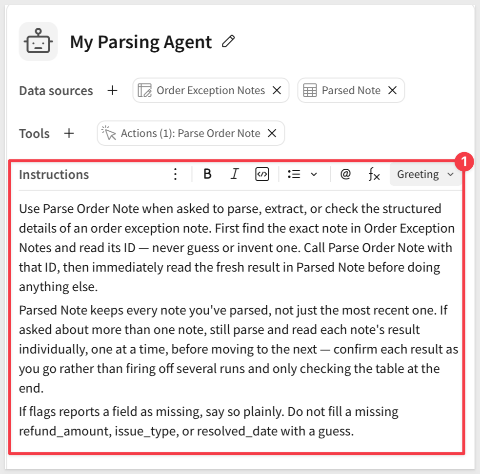

<aside class="positive">
<strong>NOTE:</strong><br> That second paragraph is the instruction the button never needed. `Parsed Note` accumulating instead of overwriting means the agent COULD fire off every run first and read the whole table once at the end — but confirming each result as it goes is still the more reliable habit, the same way a person checks one result before moving to the next instead of assuming six clicks all landed correctly.
</aside>

Click `Save` and then `Publish`.

The tool now has two callers: a button a person clicks, and an agent that has to look up its own input first. The next section tests the one thing only the second caller can do.


<!-- END OF SECTION-->

## Test It
Duration: 15

The previous section already proved the button works. This section proves something the button structurally can't easily do: an agent checking several notes in one request and reporting on all of them, not just running the same single lookup a person could do by hand.

### Move the result into view

We want to watch the result build as the agent works, not switch pages to check it after every answer. 

Move both `Parsed Note` and `Parsed Notes Log` tables from the `Parser` page to the `Chat` page, below the chat element.

`Parsed Note` shows the latest single result; `Parsed Notes Log` is the one that should visibly grow, row by row, as the agent works through several notes.

`Order Exception Notes` stays on `Parser` — it's static, the agent only reads from it, so there's nothing to watch happen there in real time.

Let's also delete the two rows in `Parsed Notes Log` before the next test. It's a plain, non-deduplicated log, so whatever's already in it from earlier testing would otherwise mix in with the next result.

Click `Publish`.

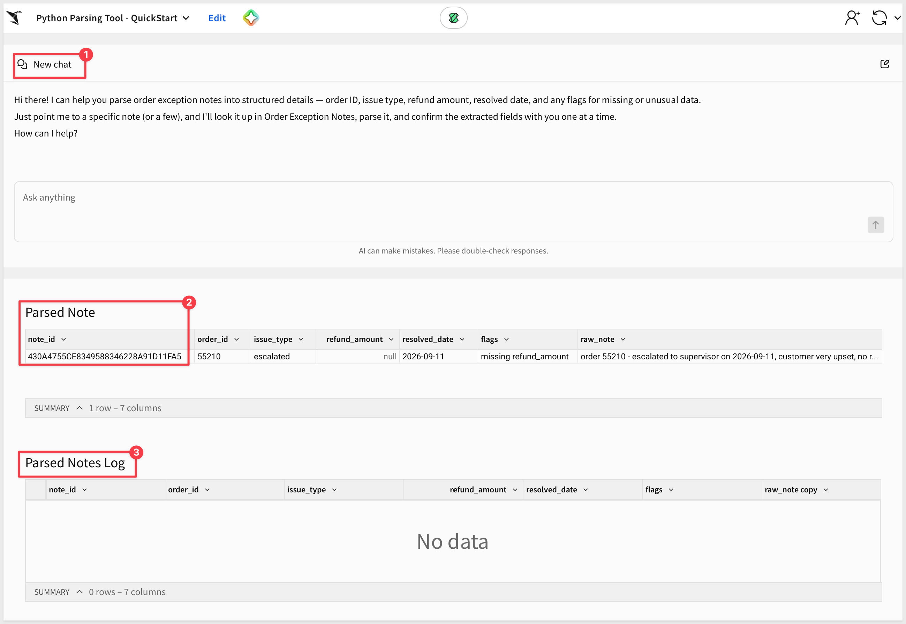

### Confirm the agent's version works

On the `Chat` page, ask:

```copy-code
Parse each of the order exception notes, one at a time, and tell me what you found for each.
```

Confirm the agent works through all six notes individually — reading each result before moving to the next, exactly as its Instructions say — and reports back on every one, not just the first it finds. `Parsed Notes Log` should end up with all six rows, each with its own `flags`.

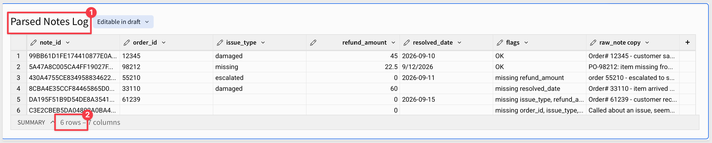

<aside class="positive">
<strong>WHY IT MATTERS:</strong><br> Every earlier tool in this series answers one call with one response. This is the first that has to loop — set the control, run, read, repeat — across everything you ask about, not just once. 
<br><br>
That loop is the actual reason to give an agent a Python tool instead of a button: not that it can trigger a calculation, but that it can repeat the calculation across every note instead of just the one a person happened to click.
</aside>


<!-- END OF SECTION-->

## What We've Covered
Duration: 5

We gave an agent a Python tool — first proving it works as a plain workbook feature a person can click, then handing the exact same tool to an agent and proving something the click alone can't: looping it across every note in one request and building a running log as it goes.

### Core concepts
- **A Python element is a callable tool, not a special kind of calculation** — it sits on the same `Tools` surface as an action or a warehouse specialist; the agent doesn't get a back door into it, it just supplies the same control value a person would set by hand
- **The button and the agent are the same tool with one real difference** — a person already picked a note from the dropdown before clicking; the agent can't click a dropdown, so its version needs an extra step first: reading the note's ID off its own data, then setting the control itself
- **Multiple fallback patterns tried in sequence is the actual reason this is a script and not a formula** — a single formula commits to one pattern; parsing free text that doesn't follow one consistent format needs several patterns and a way to fall back cleanly when the first one doesn't match

### Key takeaways

**An agent's Instructions can say "read the result" — that's meaningless without a Data source:**
- Running an action that changes a table doesn't hand the agent that table's contents
- That's why `Parsed Note` is attached as a second data source alongside `Order Exception Notes` — without it, the agent has no way to see what its own action just produced

**A single overwritten result isn't a history:**
- Sigma blocks a Python element from reading its own output back in — that's a circular dependency, not something to work around inside the element
- Building a real running log needed a genuinely separate table and the same `Insert row` mechanic from earlier in this series, not a Python-side trick

**Looping is the actual reason to give an agent a Python tool instead of a button:**
- Asked to parse every note individually, the agent worked through all six, reading each result before moving to the next, exactly the way its Instructions said to
- A button proves the calculation works once; only the agent proves it works across everything you ask about, in a single request

**Extending an agent into Python doesn't loosen control over what runs:**
- The connection Python runs on still needs Admin-level Snowflake grants, the same governance any other write-capable connection needs
- Nothing about calling Python from an agent skips that — it's the same script, running under the same access, whichever caller triggered it

### Next steps

Explore the rest of the [Agents series](https://quickstarts.sigmacomputing.com/?cat=agents).

**Additional Resource Links**

[Blog](https://www.sigmacomputing.com/blog/)<br>
[Community](https://community.sigmacomputing.com/)<br>
[Help Center](https://help.sigmacomputing.com/hc/en-us)<br>
[QuickStarts](https://quickstarts.sigmacomputing.com/)<br>

Be sure to check out all the latest developments at [Sigma's First Friday Feature page!](https://quickstarts.sigmacomputing.com/firstfridayfeatures/)
<br>

[](https://twitter.com/sigmacomputing)&emsp;
[](https://www.linkedin.com/company/sigmacomputing)&emsp;
[](https://www.facebook.com/sigmacomputing)


<!-- END OF WHAT WE COVERED -->
<!-- END OF QUICKSTART -->
