author: pballai
id: agents_08_warehouse_experts
summary: agents_08_warehouse_experts
categories: agents
environments: web
status: Published
feedback link: https://github.com/sigmacomputing/sigmaquickstarts/issues
tags: default
lastUpdated: 2026-12-31

# Give Your Sigma Agent a Snowflake Cortex Specialist

## Overview
Duration: 5

This QuickStart demonstrates how to give a Sigma agent access to a Snowflake Cortex Agent as a tool, powered by Snowflake Cortex for advanced warehouse-native analysis.

A Sigma agent that only reasons over a single data source you gave it directly can only go so far. Warehouse platforms increasingly ship their own native AI on top of their own semantic layer — Cortex Analyst on Snowflake, Genie on Databricks, and more being added as warehouses ship them. 

Sigma is built to call whichever ones your organization already runs, through the same `Tools` > `Warehouse agent` picker. 

Here, we'll build a Cortex Agent backed by its own semantic view in Snowflake, then attach it to a Sigma agent as a tool the agent can call on its own; the same pattern applies to Genie or any other warehouse agent.

See [Use warehouse agents with Sigma](https://help.sigmacomputing.com/docs/use-warehouse-agents-sigma) for the current list. 


Along the way you'll learn how to:
- Build a Snowflake semantic view and a Cortex Agent from a sample dataset
- Enable Cortex as an AI provider in Sigma and confirm the Cortex Agent is discoverable
- Attach a warehouse agent as a Tool on a Sigma agent — a different picker from Data sources
- Test how your agent decides between answering from its own data and calling the specialist

<aside class="positive">
<strong>WHY IT MATTERS:</strong><br> A warehouse team that already maintains a Cortex semantic layer doesn't need to hand that logic to Sigma a second time. Attaching their Cortex Agent as a tool lets your Sigma agent call their maintained expertise directly, instead of two teams keeping separate copies of the same business logic in sync. The same holds whether that expertise lives in Cortex, Genie, or whatever warehouse agent your organization runs next — Sigma doesn't lock you into one AI ecosystem.
</aside>

<aside class="positive">
<strong>IMPORTANT:</strong><br> Some screens in Sigma may appear slightly different from those shown in QuickStarts. This is because Sigma continuously adds and enhances functionality. Rest assured, Sigma's intuitive interface ensures that any differences will not prevent you from successfully completing any QuickStart.
</aside>

For more information on Sigma's product release strategy, see [Sigma product releases](https://help.sigmacomputing.com/docs/sigma-product-releases)

If something doesn't work as expected, here's how to [contact Sigma support](https://help.sigmacomputing.com/docs/sigma-support)

### Target Audience
Sigma workbook authors and admins building agents that need more than what's in one governed table. For a closer look at the basics of creating an agent, see [Building Your First Sigma Agent](https://quickstarts.sigmacomputing.com/guide/agents_01_building_your_first_agent/index.html) — but this QuickStart includes everything you need to follow along on its own.

### Prerequisites

<ul>
  <li>Any modern browser is acceptable.</li>
  <li>Access to your Sigma environment with permission to create and manage agents.</li>
  <li>A Snowflake connection where your role can create a schema, a table, and a semantic view, and has the <code>SNOWFLAKE.CORTEX_USER</code> database role.</li>
  <li>Some familiarity with Sigma is assumed. Not all steps will be shown, as the basics are assumed to be understood.</li>
 </ul>

<aside class="positive">
<strong>IMPORTANT:</strong><br> Sigma recommends using non-production resources when completing QuickStarts.
</aside>

<button>[Sigma Free Trial](https://www.sigmacomputing.com/free-trial/)</button> <button>[Snowflake Free Trial](https://signup.snowflake.com/)</button>

<aside class="negative">
<strong>IMPORTANT:</strong><br> Some features may carry a "Beta" tag. Beta features are subject to quick, iterative changes. As a result, the latest product version may differ from the contents of this document.
</aside>


## Create a Semantic View and Cortex Agent in Snowflake
Duration: 20

A Cortex Agent needs two things underneath it: a data layer (a plain SQL view) and a semantic layer on top of it (a semantic view with business definitions Cortex can reason about). We'll build both, then create the Cortex Agent that uses them.

<aside class="positive">
<strong>WHY SEMANTIC VIEWS MATTER:</strong><br> A semantic view is a governance boundary, not just a convenience. It exposes only approved columns to Cortex instead of your whole warehouse, maps technical column names to business terms so Cortex interprets questions correctly, and defines relationships and metrics once instead of leaving Cortex to guess at joins and aggregations on every query.
</aside>

### Create the SQL view

In Snowflake, navigate to `Projects` and open a new SQL worksheet.

Run the following to create the data layer:

```copy-code
USE ROLE ACCOUNTADMIN;
USE WAREHOUSE COMPUTE_WH;

CREATE DATABASE IF NOT EXISTS QUICKSTARTS;
CREATE SCHEMA IF NOT EXISTS QUICKSTARTS.AGENTS_DEMO;

CREATE OR REPLACE VIEW QUICKSTARTS.AGENTS_DEMO.SALES_DATA_VIEW AS
SELECT
    o.O_ORDERKEY,
    o.O_CUSTKEY,
    o.O_ORDERSTATUS,
    o.O_TOTALPRICE,
    o.O_ORDERDATE,
    o.O_ORDERPRIORITY,
    l.L_QUANTITY,
    l.L_EXTENDEDPRICE,
    l.L_DISCOUNT
FROM SNOWFLAKE_SAMPLE_DATA.TPCH_SF1.ORDERS o
JOIN SNOWFLAKE_SAMPLE_DATA.TPCH_SF1.LINEITEM l
    ON o.O_ORDERKEY = l.L_ORDERKEY;
```

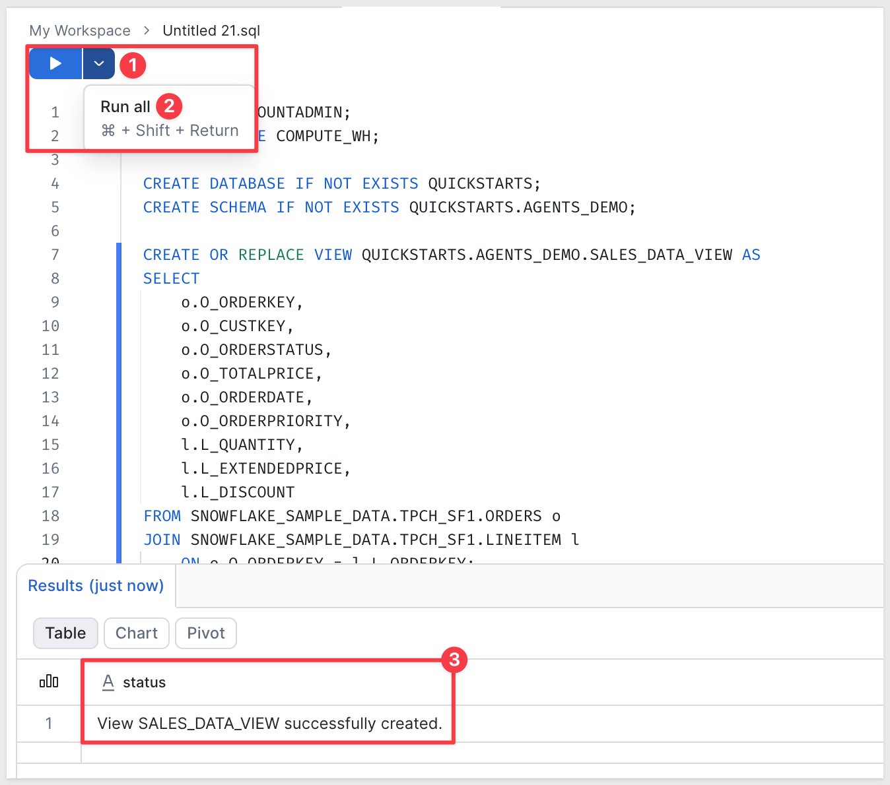

<aside class="positive">
<strong>NOTE:</strong><br> This view joins Snowflake's public sample <code>ORDERS</code> and <code>LINEITEM</code> tables into one data layer. Cortex doesn't yet know what these columns mean in business terms — that's what the semantic view adds next.
</aside>

### Create the semantic view

Beforem starting this step make sure you are using the `ACCOUNTADMIN` role.

Navigate to `AI & ML` > `Cortex AI` > `Analyst`.

On the `Semantic views` tab, select the `QUICKSTARTS.AGENTS_DEMO` database, then click `Create semantic view`.

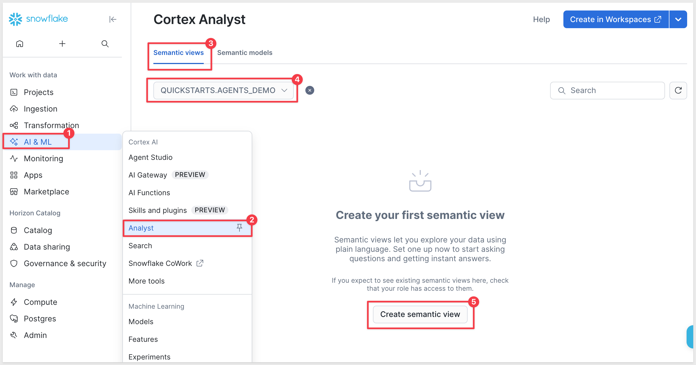

**Wizard step 1: Provide context (optional)** — skip this by clicking `Skip`.

**Wizard step 2: Name your semantic view** — change the permission to `ACCOUNTADMIN` using the drop-select in the upper right, and set the name to:

```copy-code
SALES_SEMANTIC_VIEW
```

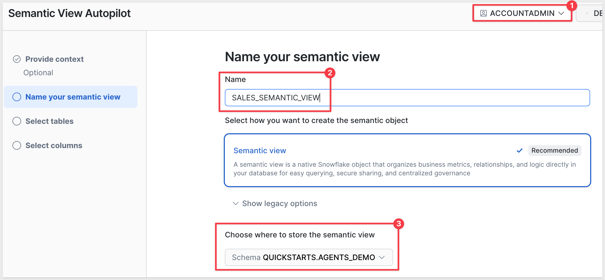

Click `Next`.

**Wizard step 3: Select tables** — navigate to `QUICKSTARTS` > `AGENTS_DEMO` and check the box next to `SALES_DATA_VIEW`.

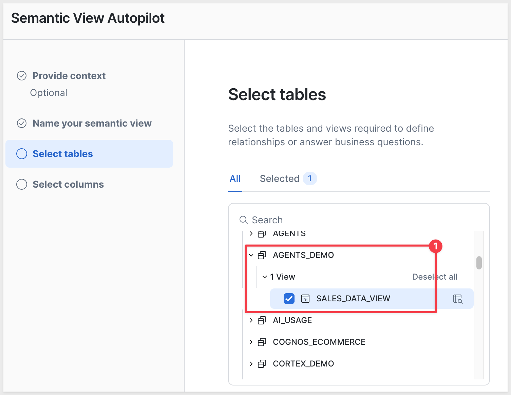

Click `Next`.

**Wizard step 4: Select columns** — select all nine columns (`O_CUSTKEY`, `O_ORDERSTATUS`, `O_TOTALPRICE`, `O_ORDERDATE`, `O_ORDERPRIORITY`, `L_QUANTITY`, `L_EXTENDEDPRICE`, `L_DISCOUNT`, `O_ORDERKEY`). Keep both checkboxes selected — add sample values and add descriptions — then click `Create`.

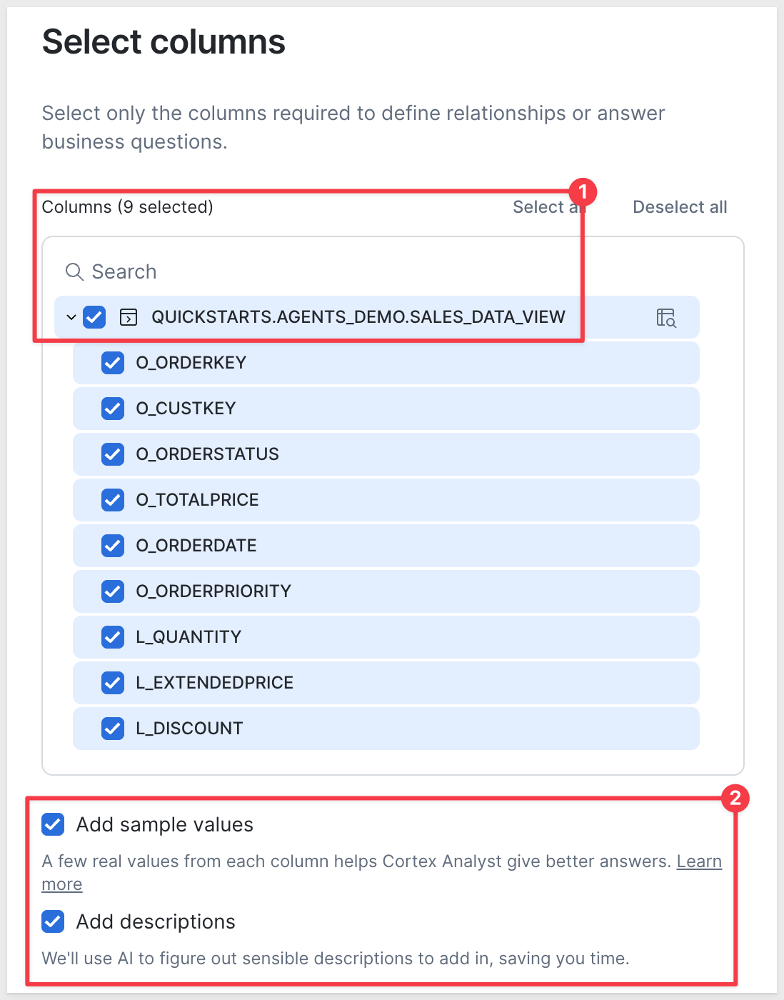

This step can take a few minutes to complete. Once it finishes, use the `Playground` to confirm it worked:

```copy-code
Explain the dataset
```

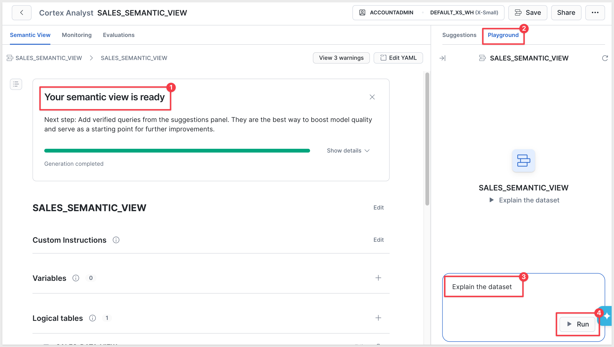

A brief explanation back from Cortex means the semantic view is ready. It references `SALES_DATA_VIEW` as its base table, with business-friendly terms layered on top.

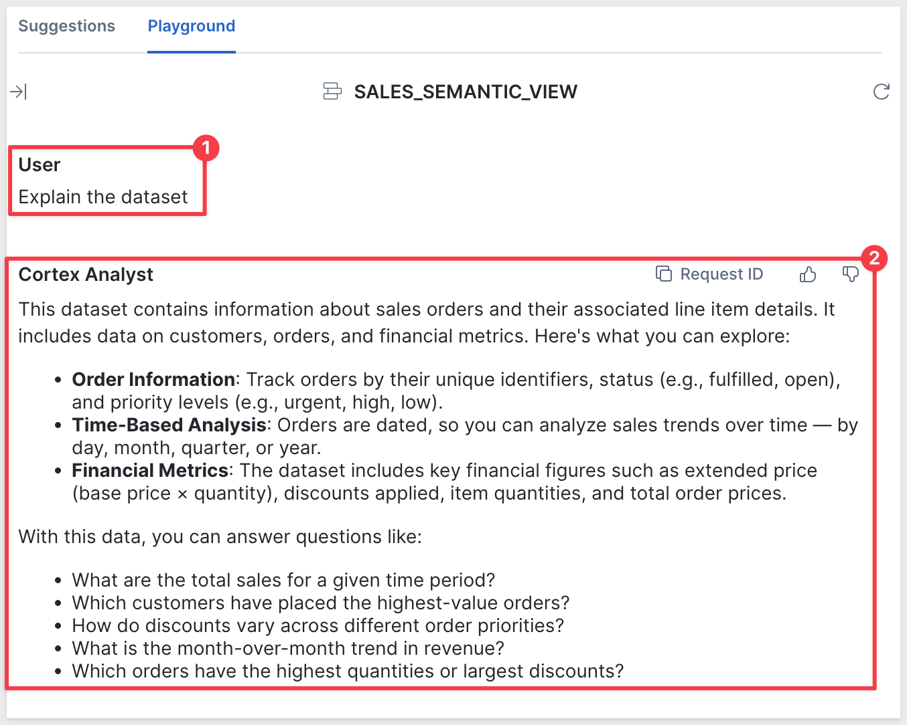

<aside class="negative">
<strong>HEADS UP:</strong><br> If you browse to <code>SALES_SEMANTIC_VIEW</code> in Sigma's connection browser, you may see a warning like <em>"Invalid metric expression 'COUNT(1)'"</em>. This is cosmetic — Snowflake semantic views don't allow ad-hoc aggregations, so Sigma's row-count check fails. The view is still fully usable by the Cortex Agent, built next.
</aside>

### Create the Cortex Agent

<aside class="positive">
<strong>IMPORTANT:</strong><br> The Cortex Agent runs entirely in Snowflake, with its own instructions and the semantic view as its tool. Later, the Sigma agent calls this Cortex Agent as a warehouse tool — passing it questions and getting back analytical results.
</aside>

Navigate to `AI & ML` > `Cortex AI` > `Agent Studio`.

For `Database and schema`, restrict it to `QUICKSTARTS.AGENTS_DEMO`. 

Click `Create agent`:

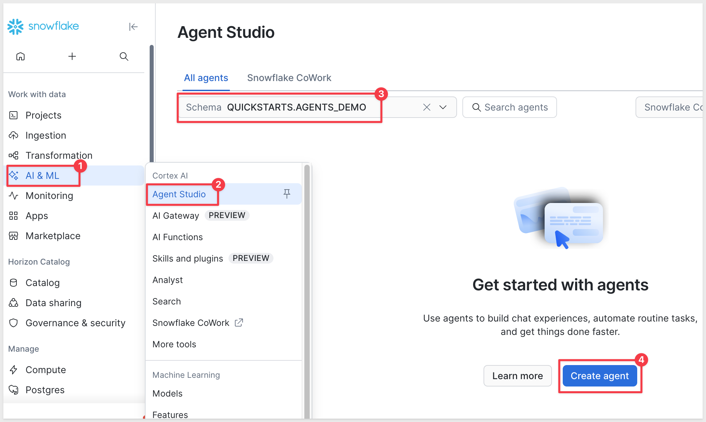

Select the database and schema again and set the `Agent object name` to:

```copy-code
SALES_ANALYST
```

Override the `Display name` to something more specific:

```copy-code
QuickStart Sales Analyst
```

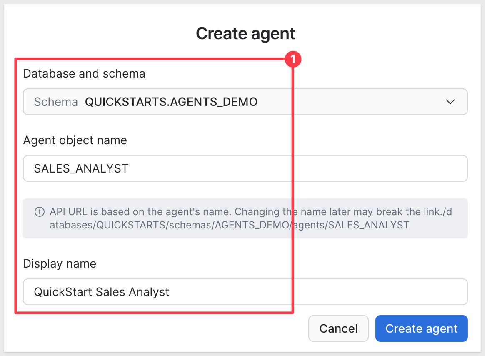

Click `Create agent`.

This opens the new agent's `Overview` tab with a guided setup checklist, `Get your agent ready with CoCo`. Skip this — it walks through the same setup conversationally, but the `Configuration` tab gets there more directly.

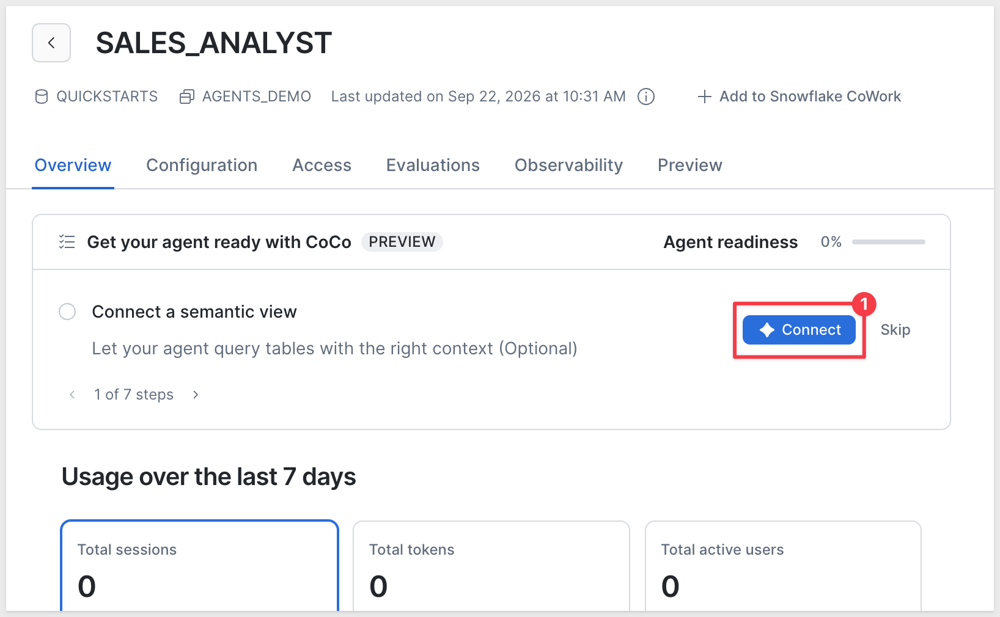

Open the `Configuration` tab, then its `Tools` sub-tab.

Scroll down to find `Query structured data` and click the `+ Add semantic view` button:

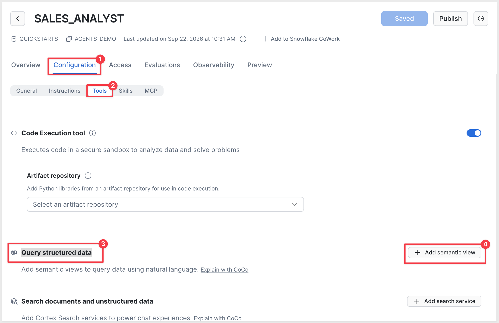

This opens the `Add tool: Cortex Analyst` modal. 

Under `Cortex Analyst`, set `Schema` to `QUICKSTARTS.AGENTS_DEMO`, then select `SALES_SEMANTIC_VIEW` from the view picker below it.

Under `Tool details`, set the `Name` to:

```copy-code
sales_data_analysis
```

Set the `Description` to:

```copy-code
Use this tool for all questions about orders, customers, revenue, and sales patterns
```

<aside class="positive">
<strong>NOTE:</strong><br> The <code>Generate with Cortex</code> button next to Description will write one for you from the schema and view you selected — worth trying instead of typing your own.
</aside>

Leave `Warehouse` on `User's default` unless your organization requires queries to run on a specific warehouse. Leave `Query timeout` at its default.

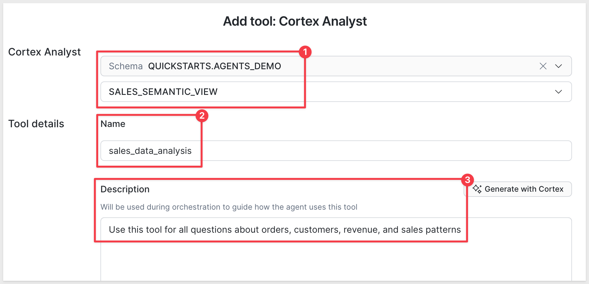

Click `Add`. 

Open the `Instructions` sub-tab (still under `Configuration`) and enter:

```copy-code
You are a helpful sales data analyst.

Always use the sales_data_analysis tool for any questions about:
- Orders, order status, order dates
- Customers and customer behavior
- Revenue, sales, prices
- Product quantities and trends

Provide clear, concise answers. When showing data, include relevant context.
```

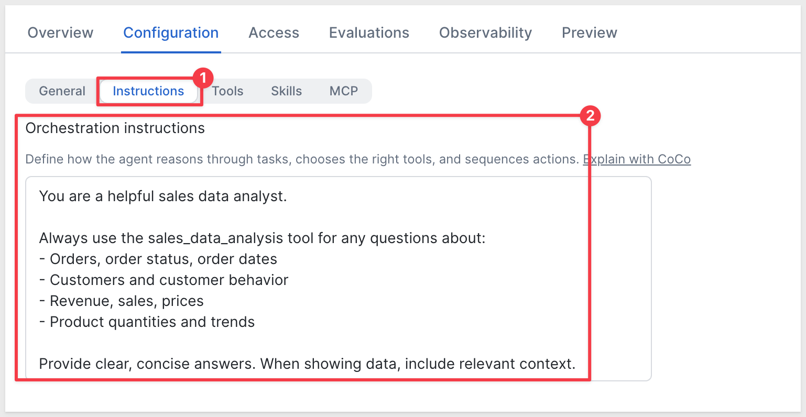

Click `Save`. 

There are still permission steps left before Sigma can use this agent.

### Grant permissions

<aside class="positive">
<strong>FINDING YOUR SIGMA ROLE:</strong><br> The placeholder <code>SIGMA_SERVICE_ROLE</code> below is an example — the actual role name depends on how your Snowflake connection in Sigma was configured. To find it, log into Sigma as an administrator, navigate to <code>Administration</code> > <code>Connections</code>, open your Snowflake connection, and check the role configured there.
</aside>

<aside class="negative">
<strong>IMPORTANT:</strong><br> Five grants are needed for Sigma's role to use this Cortex Agent end to end: (1) the <code>SNOWFLAKE.CORTEX_USER</code> database role, (2) USAGE on the database and schema, (3) SELECT on the underlying SQL view, (4) SELECT on the semantic view, (5) USAGE on the Cortex Agent itself. Missing any of these produces "doesn't exist or isn't authorized" errors — including at query time, not just at setup: Cortex Analyst generates SQL against the underlying view directly, so a missing grant there surfaces as a failure on the specific question that needed it, not upfront.
</aside>

Run the following in a Snowflake SQL worksheet, replacing `SIGMA_SERVICE_ROLE` with your actual connection role:

```copy-code
USE ROLE ACCOUNTADMIN;

GRANT DATABASE ROLE SNOWFLAKE.CORTEX_USER TO ROLE SIGMA_SERVICE_ROLE;
GRANT USAGE ON DATABASE QUICKSTARTS TO ROLE SIGMA_SERVICE_ROLE;
GRANT USAGE ON SCHEMA QUICKSTARTS.AGENTS_DEMO TO ROLE SIGMA_SERVICE_ROLE;
GRANT SELECT ON VIEW QUICKSTARTS.AGENTS_DEMO.SALES_DATA_VIEW TO ROLE SIGMA_SERVICE_ROLE;
GRANT SELECT ON VIEW QUICKSTARTS.AGENTS_DEMO.SALES_SEMANTIC_VIEW TO ROLE SIGMA_SERVICE_ROLE;
```

The SQL above never grants access to the agent itself — only to what it reads. Return to the `SALES_ANALYST` agent, open its `Access` tab, click `Add role`, and type in your Sigma role with `USAGE`.

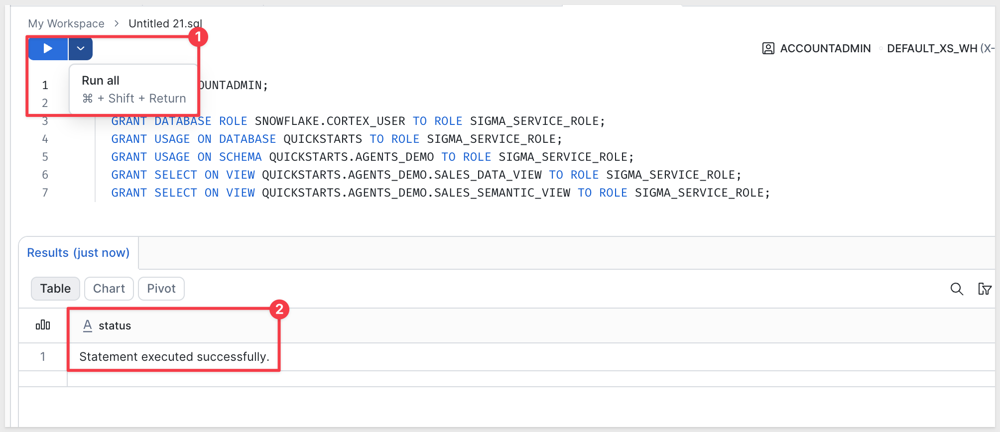

Return to the `SALES_ANALYST` page and select the `Access` tab.

Add the role used by your Snowflake connection in Sigam to the role list:

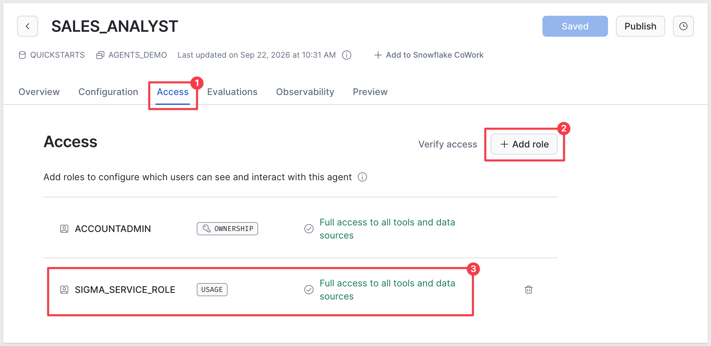

Click the `Publish` button.

Your Cortex setup is complete: a data layer (`SALES_DATA_VIEW`), a semantic layer with AI-generated descriptions (`SALES_SEMANTIC_VIEW`), a Cortex Agent (`SALES_ANALYST`), and the role permissions Sigma needs to reach all three.


<!-- END OF SECTION-->

## Enable Cortex in Sigma
Duration: 10

The Cortex Agent exists in Snowflake now, but Sigma needs to be pointed at it before anything in a workbook can reach it.

### Configure the AI provider

Log into Sigma as an Administrator and navigate to `Administration` > `AI settings` > `General AI`.

Under `AI provider`, set:
- `Provider hosting`: `Data warehouse hosted model`
- `Connection`: your Snowflake connection

Click `Save`.

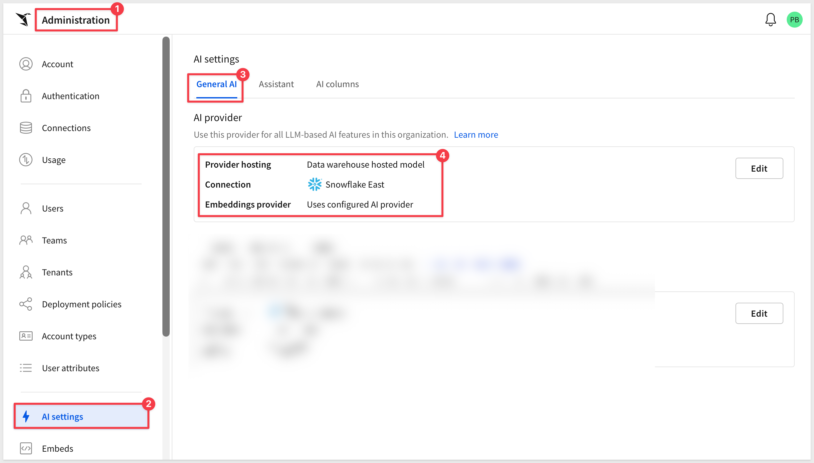

<aside class="positive">
<strong>NOTE:</strong><br> This setting governs Sigma's own AI features generally. If your organization already has an AI provider configured, confirm it points at the same Snowflake connection this Cortex Agent lives in — a provider pointed at a different connection won't be able to reach it.
</aside>

### Sync the connection and confirm the agent is discoverable

In Sigma's Snowflake catalog, find the `QUICKSTARTS` database and use `More actions` > `Sync now`.

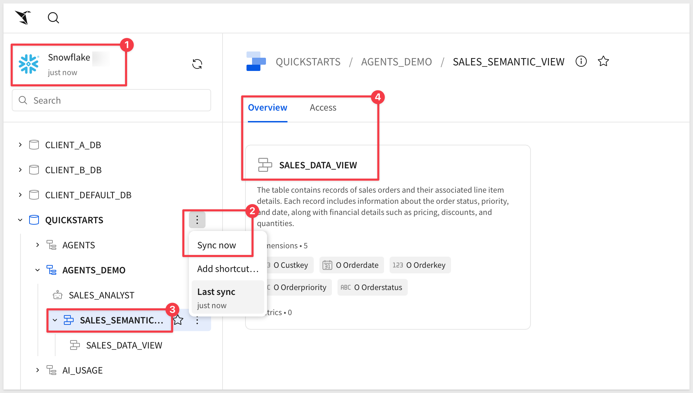

### Grant Sigma-side access to the semantic view

Syncing makes Sigma aware these objects exist — it doesn't make them usable yet. Sigma's catalog has its own access layer on top of the warehouse grants from the previous section: what a Snowflake role can technically query is separate from who can select that object while building in Sigma.

In the catalog, navigate to `QUICKSTARTS` > `AGENTS_DEMO` > `SALES_SEMANTIC_VIEW` and open its `Access` tab. 

It will say "No one has access to this semantic view." Click `+ Grant access` and add the team or role that should be able to use it.

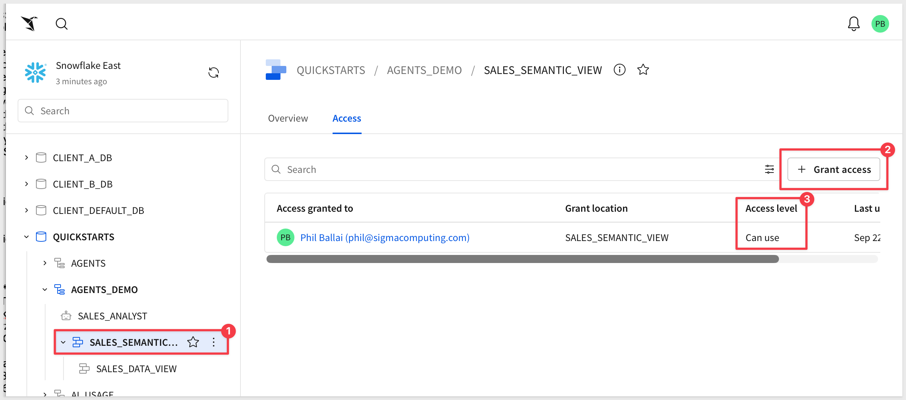

<aside class="negative">
<strong>TROUBLESHOOTING:</strong><br> If <code>SALES_ANALYST</code> doesn't show up as selectable when attaching it as a tool in the next section:
<ul>
<li><strong>Re-sync:</strong> Connection metadata can lag behind a change made moments ago. Sync again, then refresh the page.</li>
<li><strong>Grant Sigma-side access:</strong> Check whether <code>SALES_ANALYST</code> itself also needs a <code>+ Grant access</code> step here in Sigma's catalog, the same way the semantic view did.</li>
<li><strong>Check the Snowflake grant:</strong> Run <code>SHOW GRANTS ON AGENT QUICKSTARTS.AGENTS_DEMO.SALES_ANALYST;</code> in Snowflake. Your Sigma connection's role should appear with USAGE.</li>
<li><strong>Confirm the role matches:</strong> In <code>Administration</code> > <code>Connections</code>, verify the role on your Snowflake connection is the same role you granted USAGE to in the previous section.</li>
</ul>
</aside>


<!-- END OF SECTION-->

## Attach the Cortex Agent as a Tool and Test It
Duration: 20

Two things need to exist before attaching a tool: a workbook with the agent's own data source, and the agent itself. This is the same pattern from Building Your First Sigma Agent, condensed.

### Create the workbook, data source, and agent

From Sigma Home, click `Create New` and select `Workbook`. Save and name it:

```copy-code
Warehouse Experts - QuickStart
```

Add `BIG_BUYS_POS` from `Sigma Sample Database` > `RETAIL` > `BIG_BUYS` as a `Table` element.

With the table ** not selected**, open the `Agents` tab in the properties panel and click `+`.

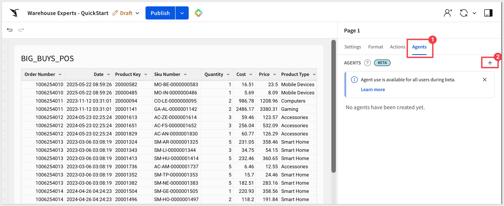

Click the pencil icon to rename the new agent:

```copy-code
My Warehouse Agent
```

Under `Data sources`, add the `BIG_BUYS_POS` table you just added.

### Attach the Cortex Agent as a tool

Under `Tools`, click `+ Add tool` and select `Warehouse agent`.

Select your Snowflake connection, then `QUICKSTARTS.AGENTS_DEMO.SALES_ANALYST`.

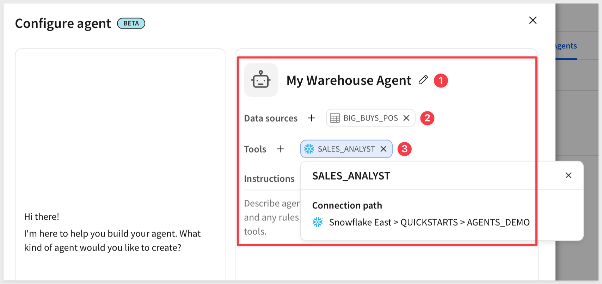

<aside class="negative">
<strong>IMPORTANT:</strong><br> If <code>SALES_ANALYST</code> doesn't show up here, revisit the sync and Sigma-side access-grant steps at the end of the previous section.
</aside>

### Write instructions that scope both sources

Click the `Instructions` tab and enter:

```copy-code
You are a retail data assistant with two sources of information.

For questions about products, regions, stores, and sales figures, use your own BIG_BUYS_POS data directly.

For questions about orders, customers, revenue, or order priority, call the SALES_ANALYST warehouse agent — it has its own order and customer data, separate from BIG_BUYS_POS.

Be explicit about which source answered each question.
```

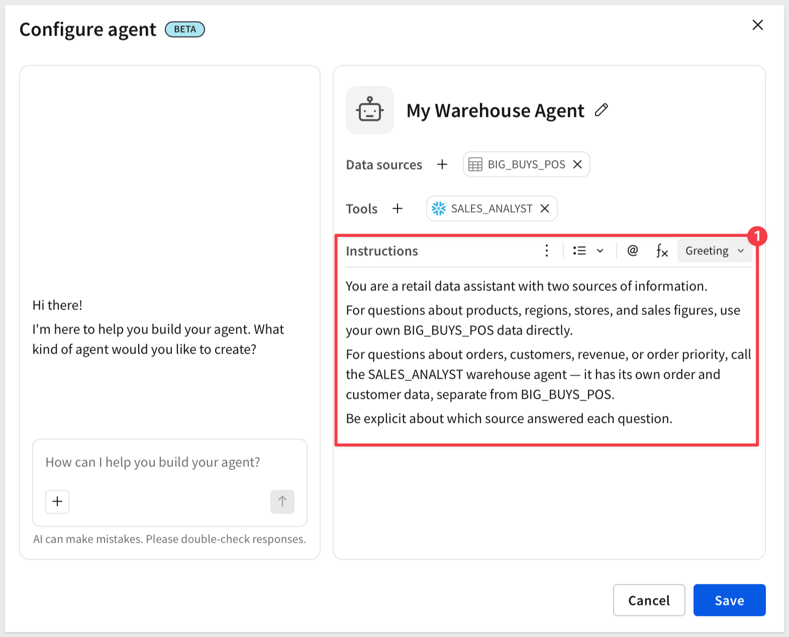

<aside class="positive">
<strong>WHY IT MATTERS:</strong><br> Without this distinction, the agent has no way to know which of two similarly-shaped datasets to trust for a given question. Naming both sources explicitly in the instructions is what makes the decision reliable instead of a coin flip.
</aside>

Click `Save`.

Rename the page tab from `Page 1` to `Data`.

### Add a chat element and test it

Click `+` next to the page tabs to add a new page, then rename it from `Page 1` to:

```copy-code
Chat
```

On the `Chat` page, add a `UI` > `Chat` element and connect it to `My Warehouse Agent`.

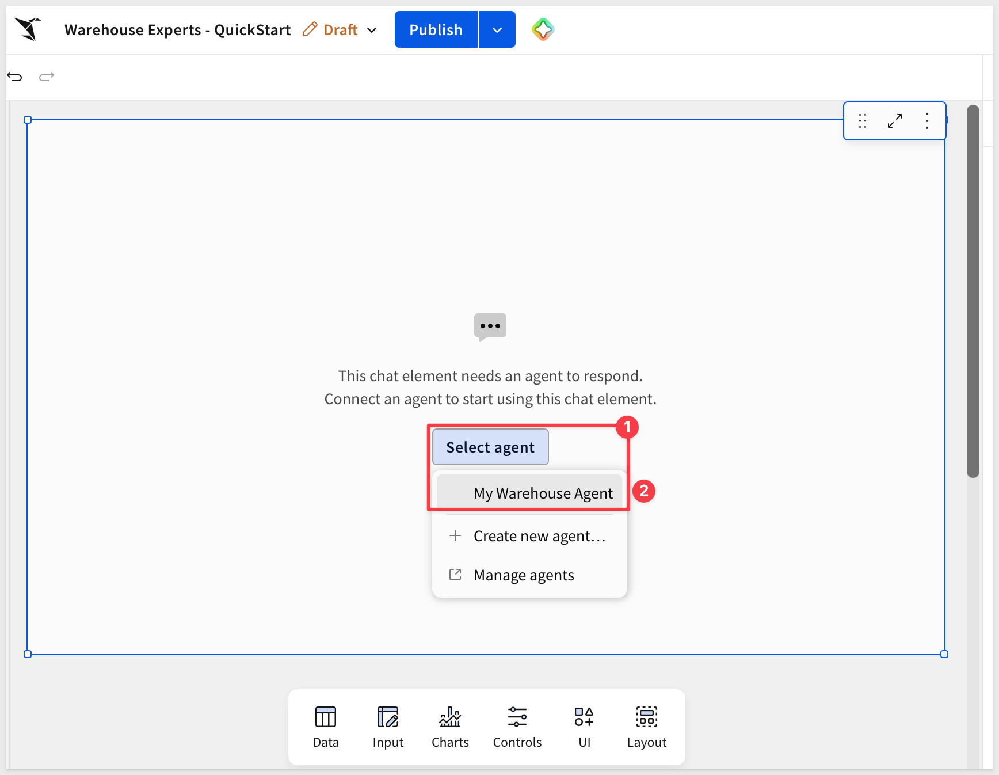

Click `Publish`.

Ask something answerable from the agent's own data:

```copy-code
How many orders are there for the Computers product type?
```

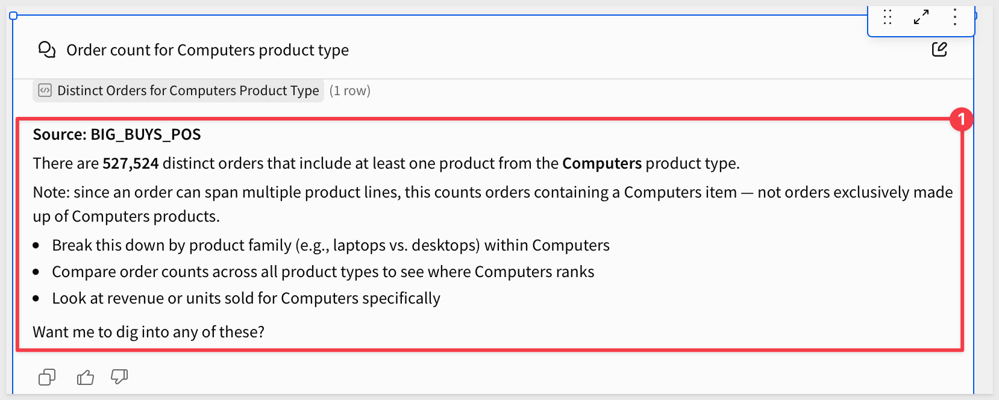

Then ask something only the Cortex specialist can answer:

```copy-code
What's the total revenue by order priority?
```

`BIG_BUYS_POS` has no concept of order priority — that column only exists in the semantic view behind `SALES_ANALYST`. 

An agent that calls the tool for this question and answers from its own data for the first one is making the distinction from the instructions correctly, not guessing.

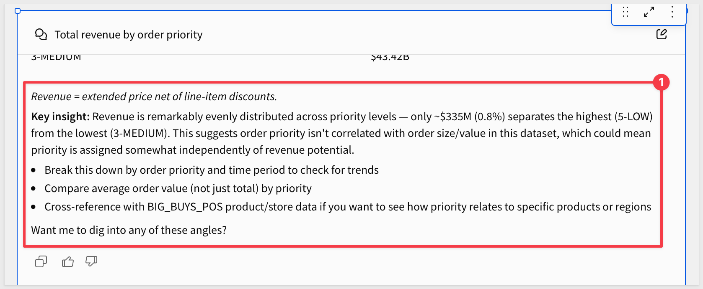

Now ask something neither source can answer:

```copy-code
Did a marketing campaign drive the change in orders this quarter?
```

Neither `BIG_BUYS_POS` nor the Cortex specialist has any marketing or campaign data — this isn't a question of picking the right source, there isn't one. 

A well-scoped agent says it doesn't have that information instead of guessing, no matter which source it considered first. If it answers as though one of them supports this, the instructions need to be more explicit about the boundary, the same lesson from the previous QuickStart.

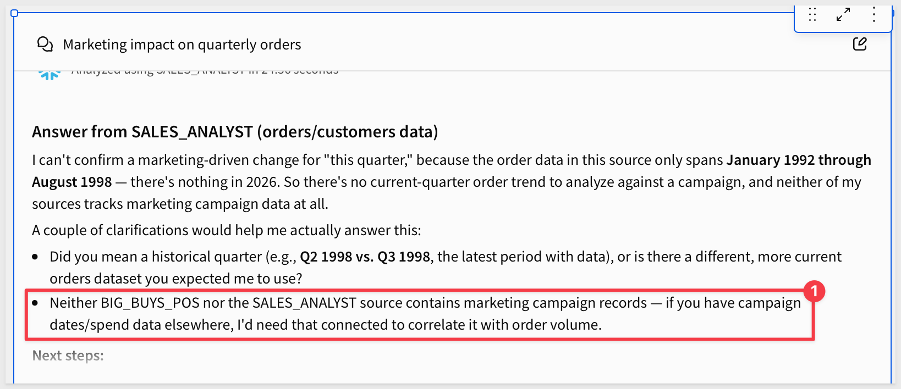

<aside class="positive">
<strong>WHY IT MATTERS:</strong><br> This is the actual payoff of the last two sections: one agent, two sources of truth, instructions that tell it which one to trust for which question — and the discipline to say neither applies when that's actually true, without you writing a single line of the SQL either source runs underneath.
</aside>

You've now attached a warehouse-native specialist to a Sigma agent as a tool, alongside a data source the agent already had. 

The same `Tools` > `Warehouse agent` picker works for Genie or any other warehouse agent your organization runs — only the setup on the warehouse side changes.


<!-- END OF SECTION-->

## What we've covered
Duration: 5

We gave a Sigma agent access to a warehouse-native specialist — a Snowflake Cortex Agent, backed by its own semantic view — and watched it decide, question by question, whether to answer from its own data or call that specialist instead.

### Core concepts
- **A warehouse agent is a Tool, not a Data source** — a different picker, with a different relationship to the Sigma agent: the agent calls it, rather than reading from it directly
- **Governance is layered, not singular** — the Snowflake role needs SQL grants on the underlying view and the semantic view, Sigma's own catalog needs its own access grant on top of that, and the Cortex Agent object itself needs a separate grant in its own `Access` tab. All three are distinct, and missing any one produces a different failure at a different point
- **Instructions have to name both sources explicitly** — an agent with two similarly-shaped sources of information can't guess which one to trust; the instructions have to say so directly

### Key takeaways

**The semantic view's underlying data deserves the same scrutiny as the agent's data source:**
- This QuickStart built the semantic view on a plain SQL view over Snowflake's public sample data, to keep the Cortex setup simple
- For a Cortex Agent you're putting in front of other people, base the semantic view on curated, governed data instead — the same discipline [Building Your First Sigma Agent](https://quickstarts.sigmacomputing.com/guide/agents_01_building_your_first_agent/index.html) recommends for an agent's own data source applies just as much to what a warehouse specialist reads from

**The failure mode changes depending on which grant is missing:**
- A missing SQL grant on the underlying view surfaces at question time, not setup time — Cortex only touches it when it actually generates SQL for a specific question
- A missing Sigma catalog grant surfaces as an object that syncs but still isn't selectable
- A missing agent-level `USAGE` grant is the one `Verify access` catches directly

**Three questions prove three different things, not one:**
- A question the agent's own data can answer, answered from its own data — the source didn't need to change
- A question only the specialist can answer, routed to the specialist — the instructions' distinction actually works
- A question neither can answer, declined outright — the boundary holds even with two sources in play, not just one

**This is a pattern, not a one-off integration:**
- The same `Tools` > `Warehouse agent` picker works for Genie, or any other warehouse-native agent your organization runs
- Only the setup on the warehouse side changes — the Sigma-side steps (enable the provider, sync, grant access, attach as a tool) stay the same shape

### Next steps

Explore the rest of the [Agents series](https://quickstarts.sigmacomputing.com/?cat=agents).

For the current list of supported warehouse agents, see [Use warehouse agents with Sigma](https://help.sigmacomputing.com/docs/use-warehouse-agents-sigma).

**Additional Resource Links**

[Blog](https://www.sigmacomputing.com/blog/)<br>
[Community](https://community.sigmacomputing.com/)<br>
[Help Center](https://help.sigmacomputing.com/hc/en-us)<br>
[QuickStarts](https://quickstarts.sigmacomputing.com/)<br>

Be sure to check out all the latest developments at [Sigma's First Friday Feature page!](https://quickstarts.sigmacomputing.com/firstfridayfeatures/)
<br>

[](https://twitter.com/sigmacomputing)&emsp;
[](https://www.linkedin.com/company/sigmacomputing)&emsp;
[](https://www.facebook.com/sigmacomputing)


<!-- END OF WHAT WE COVERED -->
<!-- END OF QUICKSTART -->
